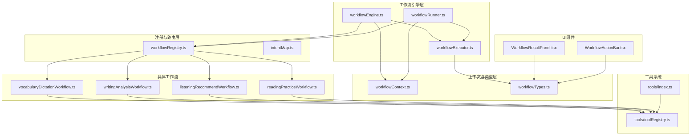
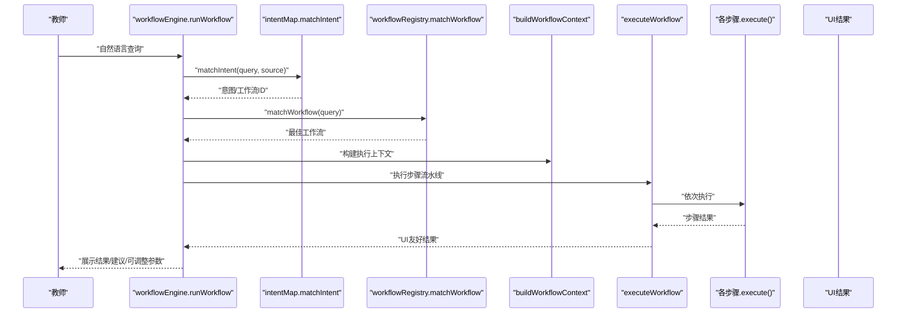
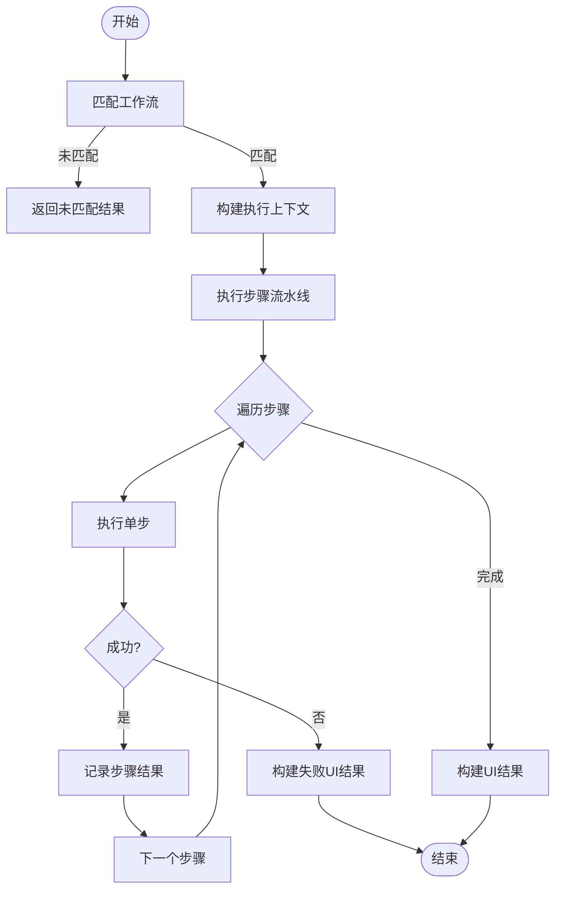
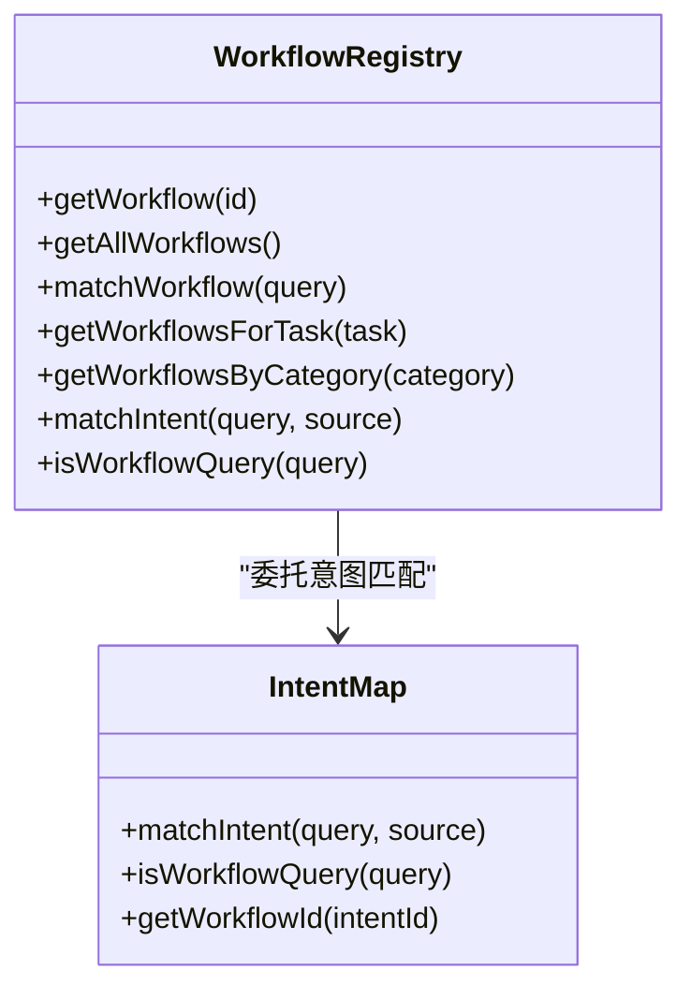
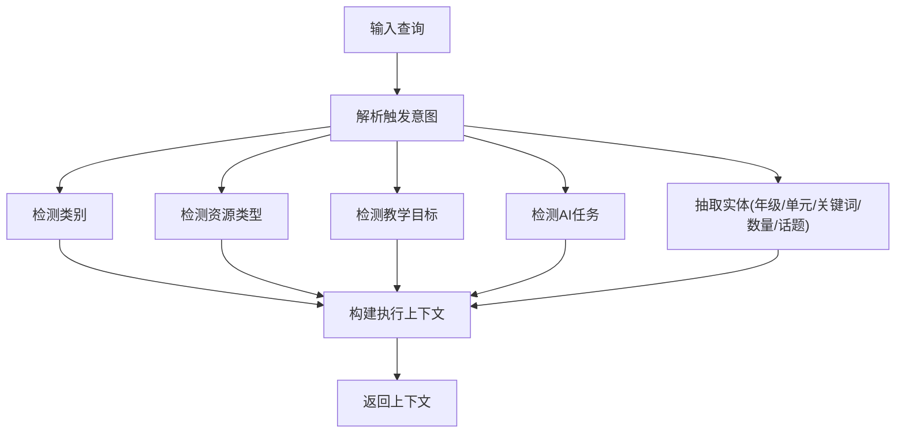
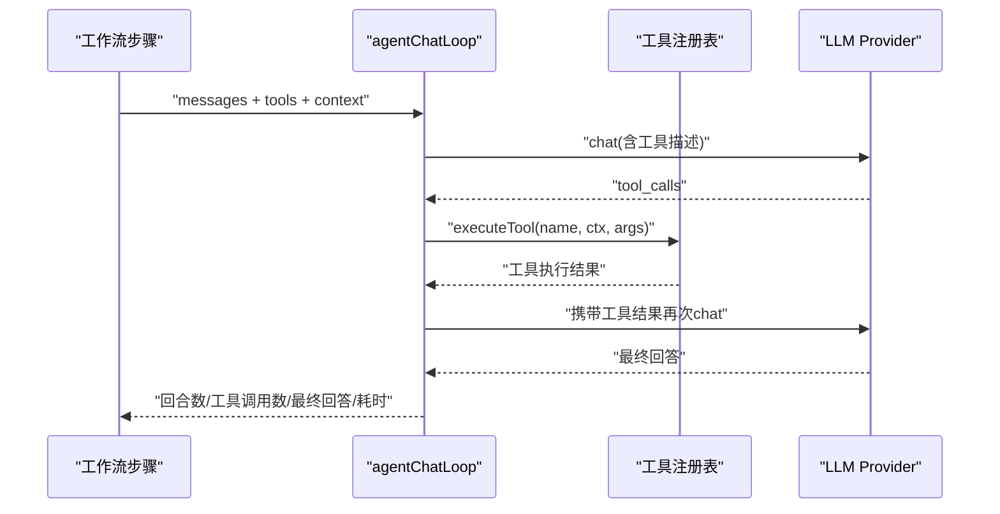
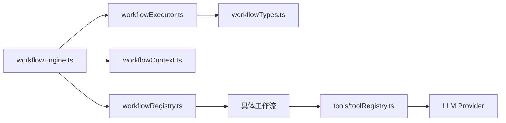

# AI工作流系统

<cite>
**本文引用的文件**
- [src/ai/workflows/index.ts](file://src/ai/workflows/index.ts)
- [src/ai/workflows/workflowEngine.ts](file://src/ai/workflows/workflowEngine.ts)
- [src/ai/workflows/workflowExecutor.ts](file://src/ai/workflows/workflowExecutor.ts)
- [src/ai/workflows/workflowRegistry.ts](file://src/ai/workflows/workflowRegistry.ts)
- [src/ai/workflows/workflowContext.ts](file://src/ai/workflows/workflowContext.ts)
- [src/ai/workflows/workflowTypes.ts](file://src/ai/workflows/workflowTypes.ts)
- [src/ai/workflows/vocabularyDictationWorkflow.ts](file://src/ai/workflows/vocabularyDictationWorkflow.ts)
- [src/ai/workflows/writingAnalysisWorkflow.ts](file://src/ai/workflows/writingAnalysisWorkflow.ts)
- [src/ai/workflows/listeningRecommendWorkflow.ts](file://src/ai/workflows/listeningRecommendWorkflow.ts)
- [src/ai/workflows/readingPracticeWorkflow.ts](file://src/ai/workflows/readingPracticeWorkflow.ts)
- [src/ai/router/intentMap.ts](file://src/ai/router/intentMap.ts)
- [src/ai/engine/workflowRunner.ts](file://src/ai/engine/workflowRunner.ts)
- [src/ai/tools/index.ts](file://src/ai/tools/index.ts)
- [src/ai/tools/toolRegistry.ts](file://src/ai/tools/toolRegistry.ts)
- [src/ai/components/workflow/WorkflowResultPanel.tsx](file://src/ai/components/workflow/WorkflowResultPanel.tsx)
- [src/ai/components/workflow/WorkflowActionBar.tsx](file://src/ai/components/workflow/WorkflowActionBar.tsx)
</cite>

## 目录
1. [简介](#简介)
2. [项目结构](#项目结构)
3. [核心组件](#核心组件)
4. [架构总览](#架构总览)
5. [详细组件分析](#详细组件分析)
6. [依赖关系分析](#依赖关系分析)
7. [性能考量](#性能考量)
8. [故障排查指南](#故障排查指南)
9. [结论](#结论)
10. [附录](#附录)

## 简介
本技术文档面向小天AI教育平台的AI工作流系统，系统以“意图路由 + 工作流引擎 + 执行器 + 注册表 + 上下文 + 工具链”的分层架构实现，覆盖词汇听写、写作分析、听力推荐、阅读练习等典型教学场景。文档从工作流定义、执行流程控制与状态管理、注册系统与动态加载、上下文与参数传递、调试与错误处理、扩展与最佳实践等维度，帮助开发者全面理解并高效使用该系统。

## 项目结构
工作流系统位于 src/ai/workflows 目录，围绕以下关键模块组织：
- 引擎与执行：workflowEngine.ts、workflowExecutor.ts、workflowRunner.ts
- 注册与路由：workflowRegistry.ts、intentMap.ts
- 上下文与类型：workflowContext.ts、workflowTypes.ts
- 具体工作流：vocabularyDictationWorkflow.ts、writingAnalysisWorkflow.ts、listeningRecommendWorkflow.ts、readingPracticeWorkflow.ts
- 工具系统：tools/index.ts、tools/toolRegistry.ts
- UI组件：WorkflowResultPanel.tsx、WorkflowActionBar.tsx

图表来源
- [src/ai/workflows/workflowEngine.ts:1-119](file://src/ai/workflows/workflowEngine.ts#L1-L119)
- [src/ai/workflows/workflowExecutor.ts:1-143](file://src/ai/workflows/workflowExecutor.ts#L1-L143)
- [src/ai/workflows/workflowRegistry.ts:1-119](file://src/ai/workflows/workflowRegistry.ts#L1-L119)
- [src/ai/router/intentMap.ts:1-302](file://src/ai/router/intentMap.ts#L1-L302)
- [src/ai/workflows/workflowContext.ts:1-154](file://src/ai/workflows/workflowContext.ts#L1-L154)
- [src/ai/workflows/workflowTypes.ts:1-164](file://src/ai/workflows/workflowTypes.ts#L1-L164)
- [src/ai/workflows/vocabularyDictationWorkflow.ts:1-387](file://src/ai/workflows/vocabularyDictationWorkflow.ts#L1-L387)
- [src/ai/workflows/writingAnalysisWorkflow.ts:1-161](file://src/ai/workflows/writingAnalysisWorkflow.ts#L1-L161)
- [src/ai/workflows/listeningRecommendWorkflow.ts:1-165](file://src/ai/workflows/listeningRecommendWorkflow.ts#L1-L165)
- [src/ai/workflows/readingPracticeWorkflow.ts:1-150](file://src/ai/workflows/readingPracticeWorkflow.ts#L1-L150)
- [src/ai/tools/index.ts:1-20](file://src/ai/tools/index.ts#L1-L20)
- [src/ai/tools/toolRegistry.ts:1-117](file://src/ai/tools/toolRegistry.ts#L1-L117)
- [src/ai/components/workflow/WorkflowResultPanel.tsx:1-75](file://src/ai/components/workflow/WorkflowResultPanel.tsx#L1-L75)
- [src/ai/components/workflow/WorkflowActionBar.tsx:1-54](file://src/ai/components/workflow/WorkflowActionBar.tsx#L1-L54)

章节来源
- [src/ai/workflows/index.ts:1-38](file://src/ai/workflows/index.ts#L1-L38)

## 核心组件
- 工作流引擎（workflowEngine.ts）
  - 提供 runWorkflow 与 runWorkflowById 两个入口，负责意图匹配、上下文构建与执行流水线调度，并返回 UI 友好的结果。
- 执行器（workflowExecutor.ts）
  - 顺序执行步骤，收集每步结果，构建最终 UI 结果；遇到异常立即中断并回传部分结果。
- 注册表（workflowRegistry.ts）
  - 维护工作流注册表，提供查询、匹配与分类检索；委托统一意图路由。
- 意图路由（intentMap.ts）
  - 统一的关键词优先级规则与来源增强逻辑，决定是否走工作流还是搜索。
- 上下文构建（workflowContext.ts）
  - 从查询解析触发意图，注入教材/年级/班级/区域等上下文，支持覆盖参数。
- 类型系统（workflowTypes.ts）
  - 定义步骤类型、类别、状态、执行上下文、结果与输出模型。
- 工具系统（tools/toolRegistry.ts）
  - 工具注册与执行，按工作流ID自动映射所需工具，桥接LLM与工具调用。

章节来源
- [src/ai/workflows/workflowEngine.ts:1-119](file://src/ai/workflows/workflowEngine.ts#L1-L119)
- [src/ai/workflows/workflowExecutor.ts:1-143](file://src/ai/workflows/workflowExecutor.ts#L1-L143)
- [src/ai/workflows/workflowRegistry.ts:1-119](file://src/ai/workflows/workflowRegistry.ts#L1-L119)
- [src/ai/router/intentMap.ts:1-302](file://src/ai/router/intentMap.ts#L1-L302)
- [src/ai/workflows/workflowContext.ts:1-154](file://src/ai/workflows/workflowContext.ts#L1-L154)
- [src/ai/workflows/workflowTypes.ts:1-164](file://src/ai/workflows/workflowTypes.ts#L1-L164)
- [src/ai/tools/toolRegistry.ts:1-117](file://src/ai/tools/toolRegistry.ts#L1-L117)

## 架构总览
系统采用“意图路由 → 工作流匹配 → 上下文构建 → 步骤流水线执行 → UI结果聚合”的主干流程。注册表集中管理所有工作流，意图路由提供稳定的关键词匹配与来源增强，工具系统解耦LLM与业务工具调用。

图表来源
- [src/ai/workflows/workflowEngine.ts:42-78](file://src/ai/workflows/workflowEngine.ts#L42-L78)
- [src/ai/router/intentMap.ts:219-272](file://src/ai/router/intentMap.ts#L219-L272)
- [src/ai/workflows/workflowRegistry.ts:55-73](file://src/ai/workflows/workflowRegistry.ts#L55-L73)
- [src/ai/workflows/workflowExecutor.ts:9-45](file://src/ai/workflows/workflowExecutor.ts#L9-L45)

## 详细组件分析

### 工作流引擎与执行器
- runWorkflow
  - 匹配最佳工作流 → 构建上下文 → 执行流水线 → 返回结果与消息。
- runWorkflowById
  - 直接按ID获取定义 → 构建上下文 → 执行 → 返回结果。
- executeWorkflow
  - 顺序执行步骤，记录每步耗时与结果；异常时立即构建失败UI结果并提前返回。
- buildUIResult/extractOutput
  - 优先从带输出类型的最后成功步骤提取输出；否则回退为文本摘要。

图表来源
- [src/ai/workflows/workflowEngine.ts:42-118](file://src/ai/workflows/workflowEngine.ts#L42-L118)
- [src/ai/workflows/workflowExecutor.ts:9-98](file://src/ai/workflows/workflowExecutor.ts#L9-L98)

章节来源
- [src/ai/workflows/workflowEngine.ts:18-118](file://src/ai/workflows/workflowEngine.ts#L18-L118)
- [src/ai/workflows/workflowExecutor.ts:1-143](file://src/ai/workflows/workflowExecutor.ts#L1-L143)

### 工作流注册系统与动态加载
- 注册表
  - 使用 Map 存储工作流定义；提供 getWorkflow/getAllWorkflows/matchWorkflow/getWorkflowsForTask/getWorkflowsByCategory。
  - matchWorkflow 基于触发关键词与任务集合打分，返回最佳匹配。
- 动态加载
  - 通过在注册表中导入并 register 各工作流定义实现静态注册；新增工作流只需在注册表中添加导入与注册行。
- 意图路由
  - workflowRegistry.matchIntent/deprecated 的 IntentMatch 与 isWorkflowQuery 新接口委托至 intentMap.ts，后者提供统一规则与来源增强。

图表来源
- [src/ai/workflows/workflowRegistry.ts:47-115](file://src/ai/workflows/workflowRegistry.ts#L47-L115)
- [src/ai/router/intentMap.ts:219-287](file://src/ai/router/intentMap.ts#L219-L287)

章节来源
- [src/ai/workflows/workflowRegistry.ts:21-115](file://src/ai/workflows/workflowRegistry.ts#L21-L115)
- [src/ai/router/intentMap.ts:70-186](file://src/ai/router/intentMap.ts#L70-L186)

### 工作流上下文与参数传递
- buildWorkflowContext
  - 生成运行ID、注入教材/单元/年级/班级/学生数/区域；解析触发意图（类别、资源类型、教学目标、AI任务、实体）；初始化 stepResults 与 overrides。
- 触发意图解析
  - detectCategory/detectResourceTypes/detectTeachingGoal/detectAITask + 实体抽取（年级、单元、关键词、数量、话题）。
- 参数覆盖
  - overrides 支持 quantity、difficulty、className 等，执行器与引擎均尊重覆盖值。

图表来源
- [src/ai/workflows/workflowContext.ts:10-154](file://src/ai/workflows/workflowContext.ts#L10-L154)

章节来源
- [src/ai/workflows/workflowContext.ts:10-154](file://src/ai/workflows/workflowContext.ts#L10-L154)
- [src/ai/workflows/workflowTypes.ts:53-93](file://src/ai/workflows/workflowTypes.ts#L53-L93)

### 工具系统与Agent闭环
- 工具注册与执行
  - registerTool/getTool/getAllTools/executeTool；toolToLLMFormat/allToolsToLLMFormat；按工作流ID映射工具集。
- 词汇听写工作流中的Agent闭环
  - 步骤3/4/5直接调用 agentChatLoop，内部完成 LLM 对话、工具调用、执行与结果汇总，最终生成输出卡片与建议。
- 工具上下文
  - 从上下文收集先前步骤结果，形成 ToolExecuteContext，便于工具读取历史数据。

图表来源
- [src/ai/tools/toolRegistry.ts:41-81](file://src/ai/tools/toolRegistry.ts#L41-L81)
- [src/ai/workflows/vocabularyDictationWorkflow.ts:131-188](file://src/ai/workflows/vocabularyDictationWorkflow.ts#L131-L188)

章节来源
- [src/ai/tools/index.ts:1-20](file://src/ai/tools/index.ts#L1-L20)
- [src/ai/tools/toolRegistry.ts:83-117](file://src/ai/tools/toolRegistry.ts#L83-L117)
- [src/ai/workflows/vocabularyDictationWorkflow.ts:131-298](file://src/ai/workflows/vocabularyDictationWorkflow.ts#L131-L298)

### 具体工作流实现

#### 词汇听写生成（vocabularyDictationWorkflow）
- 流程
  - 解析上下文 → 获取词汇 → AI筛选重点词（Agent闭环）→ 生成默写内容（Agent闭环）→ 生成可打印结果（Agent闭环）。
- 特点
  - 多步骤调用 agentChatLoop，结合工具链完成筛选与生成；支持多种默写模式（英译中、中译英、混合、听音拼写）。
- 输出
  - 卡片式输出，含题目、答案、音标、得分分布与元数据；附教学建议。

章节来源
- [src/ai/workflows/vocabularyDictationWorkflow.ts:59-300](file://src/ai/workflows/vocabularyDictationWorkflow.ts#L59-L300)

#### 写作分析（writingAnalysisWorkflow）
- 流程
  - 获取作文上下文 → AI逐篇分析（语法/拼写/搭配/表达）→ 生成教学建议 → 生成批改报告。
- 特点
  - 基于模拟数据生成共性问题与重点关注学生，提供推荐练习与样例改进。
- 输出
  - 结构化卡片报告，含元数据与建议列表。

章节来源
- [src/ai/workflows/writingAnalysisWorkflow.ts:12-158](file://src/ai/workflows/writingAnalysisWorkflow.ts#L12-L158)

#### 听力/听说推荐（listeningRecommendWorkflow）
- 流程
  - 解析需求（单元/地区/听说模式）→ 分析班级水平 → 匹配素材（按弱项排序）→ 生成推荐结果。
- 特点
  - 支持广东听说考试专项；按听说/听力模式输出不同推荐。
- 输出
  - 列表式推荐，含难度、时长、技能聚焦与AI理由。

章节来源
- [src/ai/workflows/listeningRecommendWorkflow.ts:12-162](file://src/ai/workflows/listeningRecommendWorkflow.ts#L12-L162)

#### 阅读理解训练（readingPracticeWorkflow）
- 流程
  - 解析阅读需求（年级/单元/难度）→ 获取素材 → AI推荐最佳文章 → 生成阅读训练。
- 特点
  - 根据难度过滤素材；输出卡片式内容与元数据。
- 输出
  - 文章、题型、题数、难度、预估用时等信息卡片。

章节来源
- [src/ai/workflows/readingPracticeWorkflow.ts:12-147](file://src/ai/workflows/readingPracticeWorkflow.ts#L12-L147)

### UI集成与交互
- 结果面板（WorkflowResultPanel）
  - 展示标题、摘要、条目列表、元数据与AI建议。
- 操作栏（WorkflowActionBar）
  - 提供一键布置、下载、加入篮子与重跑按钮；支持回调 onAdjust/onRerun。

章节来源
- [src/ai/components/workflow/WorkflowResultPanel.tsx:1-75](file://src/ai/components/workflow/WorkflowResultPanel.tsx#L1-L75)
- [src/ai/components/workflow/WorkflowActionBar.tsx:1-54](file://src/ai/components/workflow/WorkflowActionBar.tsx#L1-L54)

## 依赖关系分析
- 组件内聚与耦合
  - 工作流定义与步骤实现与工具系统解耦；通过工具注册表与映射自动注入工具，降低步骤对工具的硬编码依赖。
  - 引擎/执行器与注册表/意图路由松耦合，通过接口契约交互。
- 外部依赖
  - LLM Provider 与工具执行通过工具注册表桥接，便于替换与测试。
- 循环依赖
  - 无明显循环依赖；注册表集中管理工作流定义，避免相互引用。

图表来源
- [src/ai/workflows/workflowEngine.ts:1-6](file://src/ai/workflows/workflowEngine.ts#L1-L6)
- [src/ai/workflows/workflowRegistry.ts:1-20](file://src/ai/workflows/workflowRegistry.ts#L1-L20)
- [src/ai/workflows/workflowExecutor.ts:1-2](file://src/ai/workflows/workflowExecutor.ts#L1-L2)
- [src/ai/workflows/workflowTypes.ts:1-10](file://src/ai/workflows/workflowTypes.ts#L1-L10)
- [src/ai/tools/toolRegistry.ts:1-12](file://src/ai/tools/toolRegistry.ts#L1-L12)

章节来源
- [src/ai/workflows/workflowEngine.ts:1-6](file://src/ai/workflows/workflowEngine.ts#L1-L6)
- [src/ai/workflows/workflowRegistry.ts:1-20](file://src/ai/workflows/workflowRegistry.ts#L1-L20)
- [src/ai/workflows/workflowExecutor.ts:1-2](file://src/ai/workflows/workflowExecutor.ts#L1-L2)
- [src/ai/tools/toolRegistry.ts:1-12](file://src/ai/tools/toolRegistry.ts#L1-L12)

## 性能考量
- 步骤计时
  - 执行器使用高精度时间戳统计每步耗时，便于监控与优化。
- 早期失败返回
  - 任一步骤失败即停止流水线并返回已收集的部分结果，减少无效开销。
- 上下文与覆盖
  - 通过 overrides 与实体抽取减少重复计算，提升个性化体验。
- 建议
  - 对耗时步骤引入缓存与并发工具调用；对UI渲染采用虚拟滚动与懒加载。

[本节为通用指导，无需列出章节来源]

## 故障排查指南
- 常见问题
  - 未匹配到工作流：检查意图路由规则与关键词优先级；确认 query 是否包含足够触发信息。
  - 工作流未注册：确认在注册表中已导入并注册对应工作流定义。
  - 步骤执行失败：查看步骤结果中的 error 字段与摘要；定位具体步骤与工具调用。
  - 工具未注册：确认工具已在工具注册表中注册，且工作流ID映射正确。
- 调试策略
  - 使用 onStepUpdate/onError 回调观察步骤状态与错误信息。
  - 在 UI 层展示 suggestions 与 output 元数据辅助定位问题。
  - 对Agent闭环步骤，关注回合数、工具调用数与最终回答摘要。

章节来源
- [src/ai/workflows/workflowExecutor.ts:20-42](file://src/ai/workflows/workflowExecutor.ts#L20-L42)
- [src/ai/engine/workflowRunner.ts:205-220](file://src/ai/engine/workflowRunner.ts#L205-L220)
- [src/ai/tools/toolRegistry.ts:41-65](file://src/ai/tools/toolRegistry.ts#L41-L65)

## 结论
小天AI教育平台的工作流系统以清晰的分层与解耦设计实现了稳定、可扩展的教学场景自动化。通过意图路由与统一注册表，系统能够准确识别教师需求并选择合适的工作流；通过工具注册与Agent闭环，实现了与LLM的平滑对接与灵活扩展。开发者可基于现有类型与接口快速新增工作流与工具，同时利用覆盖参数与建议机制提升个性化体验。

[本节为总结性内容，无需列出章节来源]

## 附录

### 工作流类型与步骤类型
- 步骤类型：上下文注入、意图解析、资源获取、AI推荐、教学建议、布置动作、输出生成、教师复核。
- 工作流类别：资源、生成、教学、分析、布置。
- 状态：pending、running、completed、failed、skipped。

章节来源
- [src/ai/workflows/workflowTypes.ts:3-25](file://src/ai/workflows/workflowTypes.ts#L3-L25)

### 工具注册与映射
- 工具注册：registerTool/getTool/getAllTools/executeTool/toolToLLMFormat。
- 工具映射：按工作流ID自动映射所需工具集，支持新增工作流注册映射。

章节来源
- [src/ai/tools/toolRegistry.ts:18-117](file://src/ai/tools/toolRegistry.ts#L18-L117)

### 运行器（替代入口）
- workflowRunner 提供独立的运行器入口，支持回调与状态管理，适合在页面或服务端统一调度。

章节来源
- [src/ai/engine/workflowRunner.ts:103-179](file://src/ai/engine/workflowRunner.ts#L103-L179)