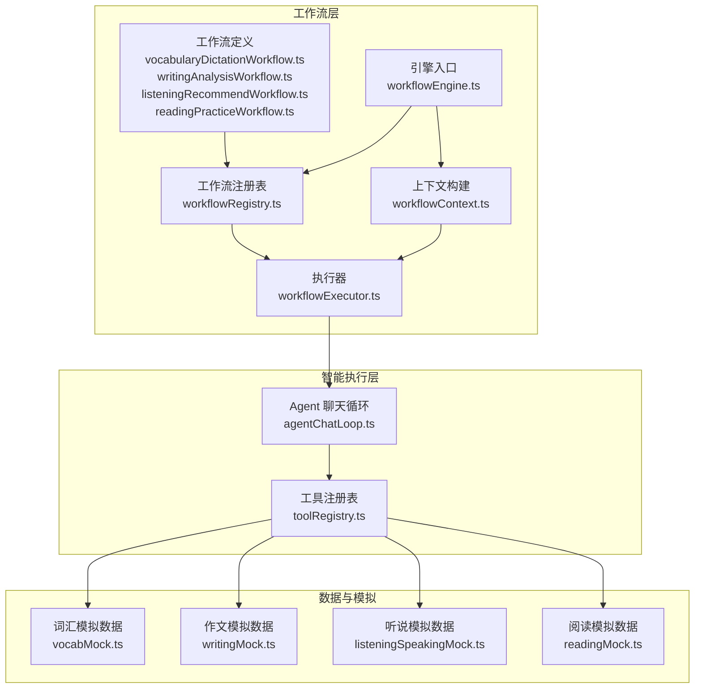
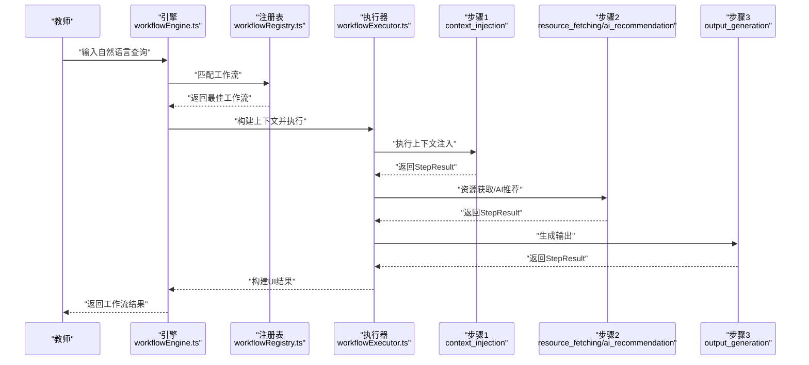
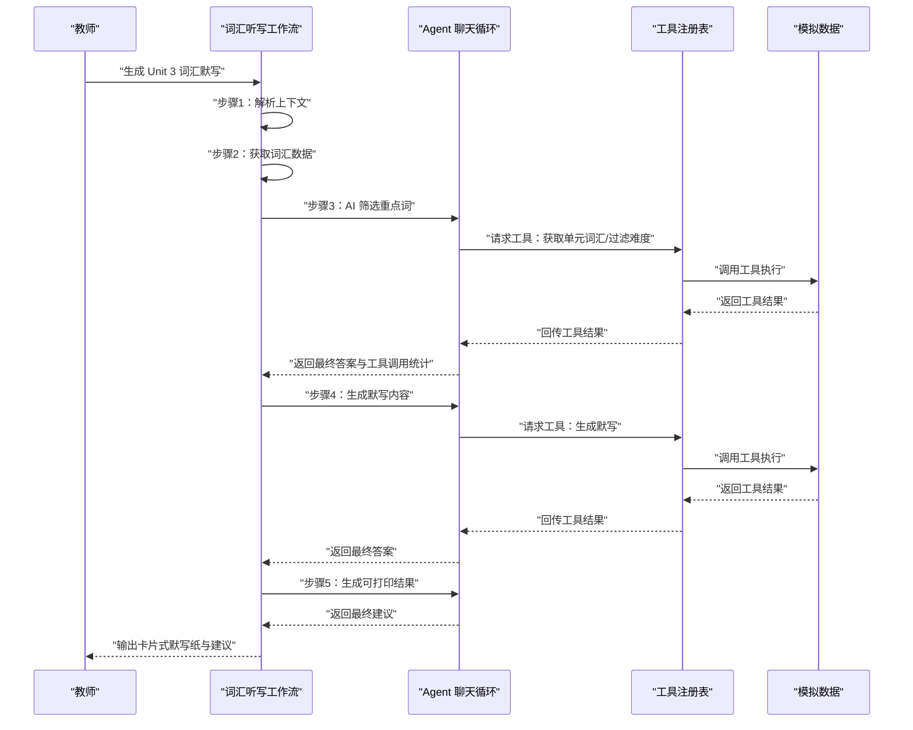
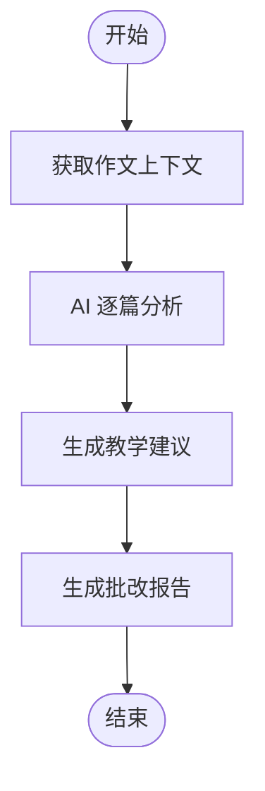
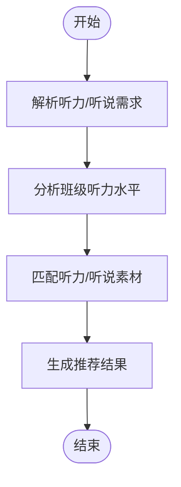
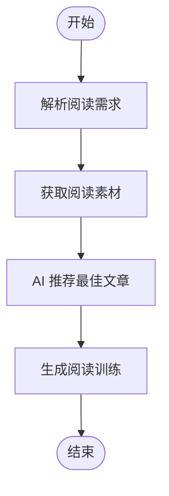
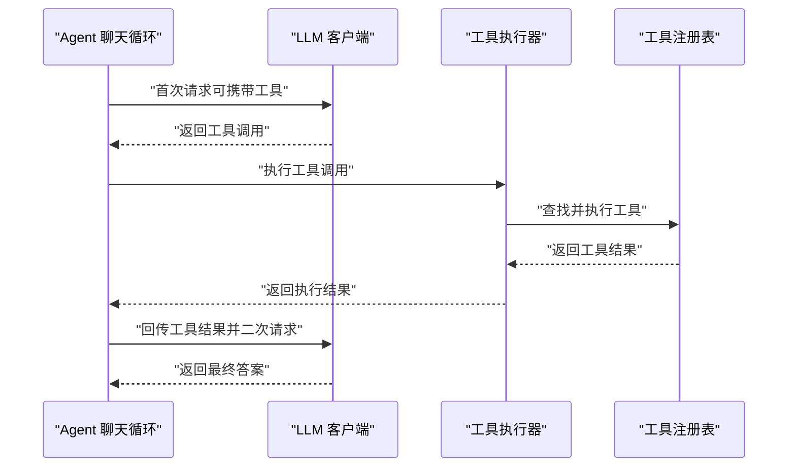
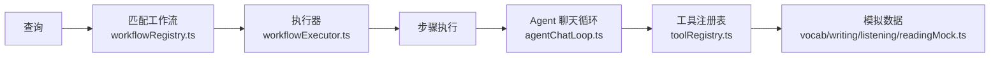

# 具体工作流实现

<cite>
**本文引用的文件**
- [vocabularyDictationWorkflow.ts](file://src/ai/workflows/vocabularyDictationWorkflow.ts)
- [writingAnalysisWorkflow.ts](file://src/ai/workflows/writingAnalysisWorkflow.ts)
- [listeningRecommendWorkflow.ts](file://src/ai/workflows/listeningRecommendWorkflow.ts)
- [readingPracticeWorkflow.ts](file://src/ai/workflows/readingPracticeWorkflow.ts)
- [workflowEngine.ts](file://src/ai/workflows/workflowEngine.ts)
- [workflowRegistry.ts](file://src/ai/workflows/workflowRegistry.ts)
- [workflowExecutor.ts](file://src/ai/workflows/workflowExecutor.ts)
- [workflowContext.ts](file://src/ai/workflows/workflowContext.ts)
- [workflowTypes.ts](file://src/ai/workflows/workflowTypes.ts)
- [agentChatLoop.ts](file://src/ai/agent/agentChatLoop.ts)
- [toolRegistry.ts](file://src/ai/tools/toolRegistry.ts)
- [index.ts](file://src/ai/workflows/index.ts)
- [vocabMock.ts](file://src/ai/mock/business/vocabMock.ts)
- [writingMock.ts](file://src/ai/mock/business/writingMock.ts)
- [listeningSpeakingMock.ts](file://src/ai/mock/business/listeningSpeakingMock.ts)
- [readingMock.ts](file://src/ai/mock/business/readingMock.ts)
</cite>

## 目录
1. [简介](#简介)
2. [项目结构](#项目结构)
3. [核心组件](#核心组件)
4. [架构总览](#架构总览)
5. [详细组件分析](#详细组件分析)
6. [依赖分析](#依赖分析)
7. [性能考虑](#性能考虑)
8. [故障排查指南](#故障排查指南)
9. [结论](#结论)
10. [附录](#附录)

## 简介
本文件面向小天AI教育平台的“具体工作流实现”，围绕词汇听写、写作分析、听力推荐、阅读练习等核心工作流，系统阐述其目标、输入参数、执行步骤、输出结果、工作流间依赖与协作机制，并提供配置与参数调优指南、典型使用场景与最佳实践，帮助开发者快速理解不同工作流的设计思路与实现模式。

## 项目结构
工作流体系位于 src/ai/workflows 下，采用“定义-注册-执行-上下文”分层设计：
- 定义层：各具体工作流以 WorkflowDefinition 形式声明步骤与触发条件
- 注册层：集中注册并提供匹配、查询能力
- 执行层：顺序执行步骤，收集结果并构建 UI 友好输出
- 上下文层：解析教师意图，注入教材、年级、班级等上下文
- Agent/工具层：通过 agentChatLoop 与工具注册表实现 LLM + 工具的闭环

**图示来源**
- [workflowEngine.ts:42-78](file://src/ai/workflows/workflowEngine.ts#L42-L78)
- [workflowRegistry.ts:30-43](file://src/ai/workflows/workflowRegistry.ts#L30-L43)
- [workflowExecutor.ts:9-45](file://src/ai/workflows/workflowExecutor.ts#L9-L45)
- [workflowContext.ts:10-43](file://src/ai/workflows/workflowContext.ts#L10-L43)
- [agentChatLoop.ts:70-200](file://src/ai/agent/agentChatLoop.ts#L70-L200)
- [toolRegistry.ts:86-109](file://src/ai/tools/toolRegistry.ts#L86-L109)
- [vocabMock.ts:16-37](file://src/ai/mock/business/vocabMock.ts#L16-L37)
- [writingMock.ts:34-102](file://src/ai/mock/business/writingMock.ts#L34-L102)
- [listeningSpeakingMock.ts:119-133](file://src/ai/mock/business/listeningSpeakingMock.ts#L119-L133)
- [readingMock.ts:20-83](file://src/ai/mock/business/readingMock.ts#L20-L83)

**章节来源**
- [index.ts:1-38](file://src/ai/workflows/index.ts#L1-L38)

## 核心组件
- 工作流定义与步骤：每个工作流以 steps 数组定义顺序执行的步骤，包含上下文注入、资源获取、AI 推荐、输出生成等类型
- 工作流注册与匹配：注册所有工作流，按触发关键词与任务进行匹配
- 执行器：顺序执行步骤，收集 StepResult，构建 UI 友好输出
- 上下文构建：解析教师查询，提取实体与意图，注入教材、年级、班级等上下文
- Agent 聊天循环：实现 LLM + 工具调用的完整闭环，支持多轮工具调用与结果回传
- 工具注册表：集中管理工具，按工作流自动注入所需工具集合

**章节来源**
- [workflowTypes.ts:39-114](file://src/ai/workflows/workflowTypes.ts#L39-L114)
- [workflowRegistry.ts:55-73](file://src/ai/workflows/workflowRegistry.ts#L55-L73)
- [workflowExecutor.ts:9-45](file://src/ai/workflows/workflowExecutor.ts#L9-L45)
- [workflowContext.ts:10-43](file://src/ai/workflows/workflowContext.ts#L10-L43)
- [agentChatLoop.ts:70-200](file://src/ai/agent/agentChatLoop.ts#L70-L200)
- [toolRegistry.ts:86-109](file://src/ai/tools/toolRegistry.ts#L86-L109)

## 架构总览
工作流引擎从教师自然语言查询出发，经过意图解析与工作流匹配，构建执行上下文，顺序执行各步骤，最终输出 UI 友好结果。Agent 聊天循环贯穿多个工作流的关键步骤，实现“工具驱动”的智能决策与内容生成。

**图示来源**
- [workflowEngine.ts:42-78](file://src/ai/workflows/workflowEngine.ts#L42-L78)
- [workflowRegistry.ts:55-73](file://src/ai/workflows/workflowRegistry.ts#L55-L73)
- [workflowExecutor.ts:9-45](file://src/ai/workflows/workflowExecutor.ts#L9-L45)

## 详细组件分析

### 词汇听写工作流（vocabularyDictationWorkflow）
- 目标：根据教材单元智能筛选重点词汇，生成多种默写模式（英译中、中译英、混合、听音拼写）的默写练习与可打印结果
- 输入参数
  - 查询：如“生成 Unit 3 词汇默写”
  - 上下文：教材、年级、班级、学生人数
  - 覆盖参数：题目数量、默写模式（通过查询或覆盖参数指定）
- 执行步骤
  1) 解析教材上下文：识别年级、单元、教材版本
  2) 获取词汇数据：从模拟数据源按单元拉取词汇
  3) AI 筛选重点词：Agent 调用工具（如获取单元词汇、过滤难度）筛选重点词
  4) 生成默写内容：Agent 调用工具生成题目与答题卡
  5) 生成可打印结果：生成卡片式输出、元数据与教学建议
- 输出结果
  - 卡片式输出：包含题目、答案、音标、满分等
  - 元数据：教材、年级、单元、模式、题目数量、满分、预计用时、班级
  - 教学建议：打印前切换模式、预留时间、互批建议等
- 关键实现要点
  - 步骤3与4、5均通过 agentChatLoop 实现工具调用闭环
  - 工具通过 getToolsForWorkflow 自动注入，与工作流解耦
  - 默写模式检测与输出构建逻辑清晰，便于扩展

**图示来源**
- [vocabularyDictationWorkflow.ts:59-299](file://src/ai/workflows/vocabularyDictationWorkflow.ts#L59-L299)
- [agentChatLoop.ts:70-200](file://src/ai/agent/agentChatLoop.ts#L70-L200)
- [toolRegistry.ts:86-109](file://src/ai/tools/toolRegistry.ts#L86-L109)
- [vocabMock.ts:16-37](file://src/ai/mock/business/vocabMock.ts#L16-L37)

**章节来源**
- [vocabularyDictationWorkflow.ts:59-299](file://src/ai/workflows/vocabularyDictationWorkflow.ts#L59-L299)

### 写作分析工作流（writingAnalysisWorkflow）
- 目标：上传或选择学生作文，AI 自动逐句批注、分项评分、生成总评与教学建议
- 输入参数
  - 查询：如“批改作文”“作文分析”
  - 上下文：班级、主题、作文数量
- 执行步骤
  1) 获取作文上下文：确认批改范围与班级信息
  2) AI 逐篇分析：对语法、拼写、搭配、表达四维度分析，提取共性问题与需关注学生
  3) 生成教学建议：基于分析结果生成针对性建议与推荐练习
  4) 生成批改报告：结构化输出，含共性问题、个别辅导建议、推荐练习
- 输出结果
  - 结构化卡片输出：问题分类、涉及人数、建议说明
  - 元数据：作文主题、提交人数、平均分、分布情况
  - 建议与练习：优先问题与练习清单

**图示来源**
- [writingAnalysisWorkflow.ts:12-158](file://src/ai/workflows/writingAnalysisWorkflow.ts#L12-L158)

**章节来源**
- [writingAnalysisWorkflow.ts:12-158](file://src/ai/workflows/writingAnalysisWorkflow.ts#L12-L158)
- [writingMock.ts:34-119](file://src/ai/mock/business/writingMock.ts#L34-L119)

### 听力推荐工作流（listeningRecommendWorkflow）
- 目标：根据当前单元与班级听力水平，智能推荐听力/听说素材，支持广东听说考试专项
- 输入参数
  - 查询：如“找一个听说训练”“有什么听力素材”
  - 上下文：单元、地区模式（默认通用，含“听说”关键词时进入广东模式）
- 执行步骤
  1) 解析听力/听说需求：识别单元、地区模式、训练类型
  2) 分析班级听力水平：给出平均分、弱项与推荐难度
  3) 匹配听力/听说素材：按班级弱项排序，区分听说与听力
  4) 生成推荐结果：输出素材列表与配套建议
- 输出结果
  - 列表式输出：标题、时长、难度、技能聚焦、AI理由
  - 元数据：素材总数、训练模式、推荐难度、班级弱项
  - 建议：按弱项优先、首推素材、布置入口

**图示来源**
- [listeningRecommendWorkflow.ts:12-162](file://src/ai/workflows/listeningRecommendWorkflow.ts#L12-L162)

**章节来源**
- [listeningRecommendWorkflow.ts:12-162](file://src/ai/workflows/listeningRecommendWorkflow.ts#L12-L162)
- [listeningSpeakingMock.ts:119-133](file://src/ai/mock/business/listeningSpeakingMock.ts#L119-L133)

### 阅读练习工作流（readingPracticeWorkflow）
- 目标：根据年级与单元智能推荐阅读文章，生成配套练习题与答题卡
- 输入参数
  - 查询：如“来一篇 Unit3 阅读理解”
  - 上下文：年级、单元、难度（基础/中等/进阶）
- 执行步骤
  1) 解析阅读需求：确定年级、单元与难度
  2) 获取阅读素材：按单元与难度筛选
  3) AI 推荐最佳文章：根据匹配度推荐
  4) 生成阅读训练：输出文章、题型、题数、难度、预计用时与建议
- 输出结果
  - 卡片式输出：文章摘要、题型、题数、难度、预计用时
  - 元数据：年级、单元、题型、难度、题数
  - 建议：通读全文、分题型训练、小组讨论

**图示来源**
- [readingPracticeWorkflow.ts:12-147](file://src/ai/workflows/readingPracticeWorkflow.ts#L12-L147)

**章节来源**
- [readingPracticeWorkflow.ts:12-147](file://src/ai/workflows/readingPracticeWorkflow.ts#L12-L147)
- [readingMock.ts:20-83](file://src/ai/mock/business/readingMock.ts#L20-L83)

### Agent 聊天循环与工具集成
- Agent 聊天循环实现 LLM 与工具的完整闭环：首次请求携带工具列表，若返回工具调用则执行工具并将结果回传，再次请求得到最终答案
- 工具注册表集中管理工具，按工作流自动注入所需工具集合，实现工作流与工具的解耦
- 在词汇听写与写作分析等工作中，Agent 通过工具完成“筛选重点词”“生成默写”“获取单元词汇”等关键动作

**图示来源**
- [agentChatLoop.ts:112-178](file://src/ai/agent/agentChatLoop.ts#L112-L178)
- [toolRegistry.ts:41-65](file://src/ai/tools/toolRegistry.ts#L41-L65)

**章节来源**
- [agentChatLoop.ts:70-200](file://src/ai/agent/agentChatLoop.ts#L70-L200)
- [toolRegistry.ts:14-117](file://src/ai/tools/toolRegistry.ts#L14-L117)

## 依赖分析
- 工作流注册与匹配
  - 注册表集中注册所有工作流，提供按关键词与任务匹配的能力
  - 支持按类别与任务查询工作流集合
- 执行链路
  - 引擎负责匹配与上下文构建，执行器顺序执行步骤并收集结果
  - 上下文解析包含轻量级实体抽取（年级、单元、数量、主题等）
- 工具与 Agent
  - 工具按工作流自动注入，Agent 聊天循环统一处理工具调用与回传
  - 模拟数据模块为各工作流提供稳定的数据支撑

**图示来源**
- [workflowRegistry.ts:55-73](file://src/ai/workflows/workflowRegistry.ts#L55-L73)
- [workflowExecutor.ts:9-45](file://src/ai/workflows/workflowExecutor.ts#L9-L45)
- [agentChatLoop.ts:70-200](file://src/ai/agent/agentChatLoop.ts#L70-L200)
- [toolRegistry.ts:86-109](file://src/ai/tools/toolRegistry.ts#L86-L109)

**章节来源**
- [workflowRegistry.ts:47-85](file://src/ai/workflows/workflowRegistry.ts#L47-L85)
- [workflowExecutor.ts:47-143](file://src/ai/workflows/workflowExecutor.ts#L47-L143)
- [workflowContext.ts:48-153](file://src/ai/workflows/workflowContext.ts#L48-L153)

## 性能考虑
- 步骤耗时统计：执行器在每步完成后记录 duration，便于监控与优化
- Agent 循环轮数限制：默认最多 5 轮，避免过长等待
- 工具调用聚合：工具执行结果一次性回传，减少往返次数
- 上下文构建：轻量级实体抽取，避免复杂 NLP 开销
- 建议
  - 对耗时步骤（如 AI 推荐、工具执行）增加缓存策略
  - 将工具执行迁移至真实 LLM Provider 时，注意并发与限流
  - 对大规模输出（如阅读训练）分页或延迟渲染以提升前端体验

[本节为通用指导，无需特定文件来源]

## 故障排查指南
- 工作流未匹配
  - 检查查询是否包含任一工作流的触发关键词或任务标识
  - 参考匹配逻辑与触发关键字配置
- 步骤执行失败
  - 查看执行器返回的 StepResult.error 字段
  - 关注工具执行异常与 Agent 循环中的工具调用失败
- 输出为空或不完整
  - 确认最后成功步骤是否包含 outputType 与 output 数据
  - 检查工作流步骤的可编辑性与覆盖参数
- 参数无效
  - 检查覆盖参数（如题目数量、难度、目标班级）是否在可选项范围内

**章节来源**
- [workflowExecutor.ts:26-42](file://src/ai/workflows/workflowExecutor.ts#L26-L42)
- [workflowExecutor.ts:72-98](file://src/ai/workflows/workflowExecutor.ts#L72-L98)
- [workflowRegistry.ts:55-73](file://src/ai/workflows/workflowRegistry.ts#L55-L73)
- [toolRegistry.ts:41-65](file://src/ai/tools/toolRegistry.ts#L41-L65)

## 结论
小天AI教育平台的工作流体系以“定义-注册-执行-上下文-Agent工具闭环”为核心，实现了从自然语言到结构化输出的完整路径。词汇听写、写作分析、听力推荐、阅读练习等具体工作流分别针对不同教学场景，通过统一的执行框架与工具体系，提供了高内聚、低耦合的实现模式。开发者可据此快速扩展新的工作流与工具，持续优化性能与用户体验。

[本节为总结，无需特定文件来源]

## 附录

### 工作流配置与参数调优指南
- 触发关键词与任务
  - 通过 triggerKeywords 与 triggerTasks 提升匹配准确度
  - 保持关键词与任务语义一致，避免歧义
- 覆盖参数
  - quantity：默写题数、阅读题数等
  - difficulty：基础/中等/进阶
  - className：目标班级或“全年级”
- 上下文注入
  - 通过 buildWorkflowContext 注入教材、年级、班级、地区等信息
  - 使用 overrides 覆盖默认值，满足个性化需求
- Agent 与工具
  - 使用 getToolsForWorkflow 自动注入工具，确保 Agent 能力与工作流需求一致
  - 工具执行失败时，Agent 会回传错误摘要，便于定位问题

**章节来源**
- [workflowTypes.ts:110-164](file://src/ai/workflows/workflowTypes.ts#L110-L164)
- [workflowContext.ts:10-43](file://src/ai/workflows/workflowContext.ts#L10-L43)
- [workflowExecutor.ts:110-142](file://src/ai/workflows/workflowExecutor.ts#L110-L142)
- [toolRegistry.ts:103-117](file://src/ai/tools/toolRegistry.ts#L103-L117)

### 实际使用场景与最佳实践
- 词汇听写
  - 场景：课堂随堂训练、课后巩固、单元检测
  - 最佳实践：根据班级平均分调整题目数量与难度；听音拼写模式用于语音语调专项
- 写作分析
  - 场景：作文讲评、个性化辅导、教学改进
  - 最佳实践：结合共性问题与个别学生弱点制定分层教学方案
- 听力推荐
  - 场景：课堂导入、课后训练、听说考试专项
  - 最佳实践：依据班级弱项优先推荐对应素材；广东模式下强化口语与评分训练
- 阅读练习
  - 场景：阅读理解训练、题型专项突破
  - 最佳实践：按单元主题与难度梯度安排；结合小组讨论提升表达能力

[本节为通用指导，无需特定文件来源]