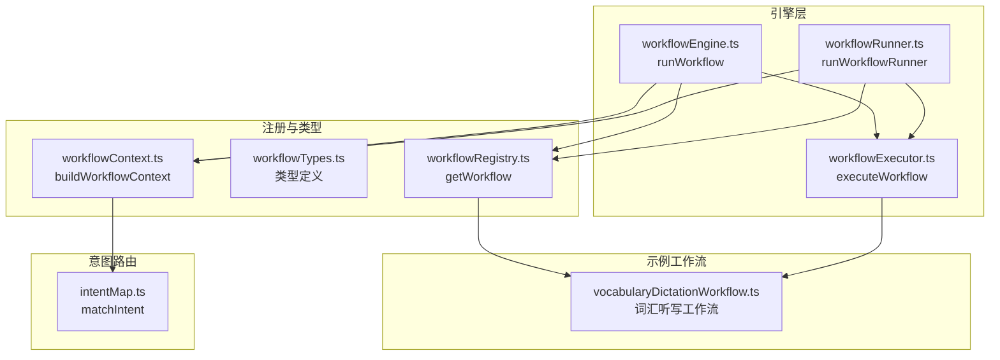
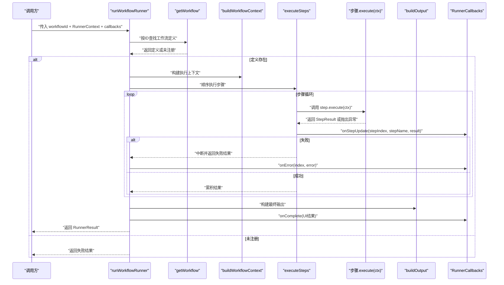
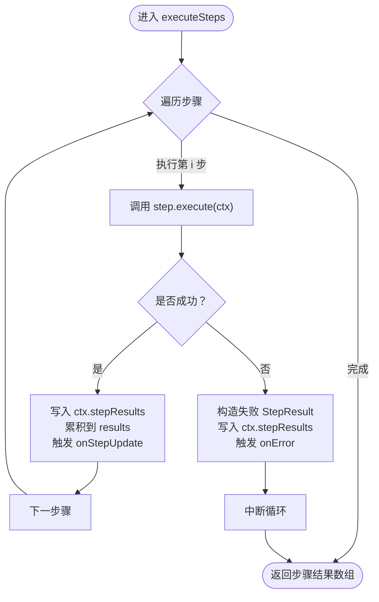
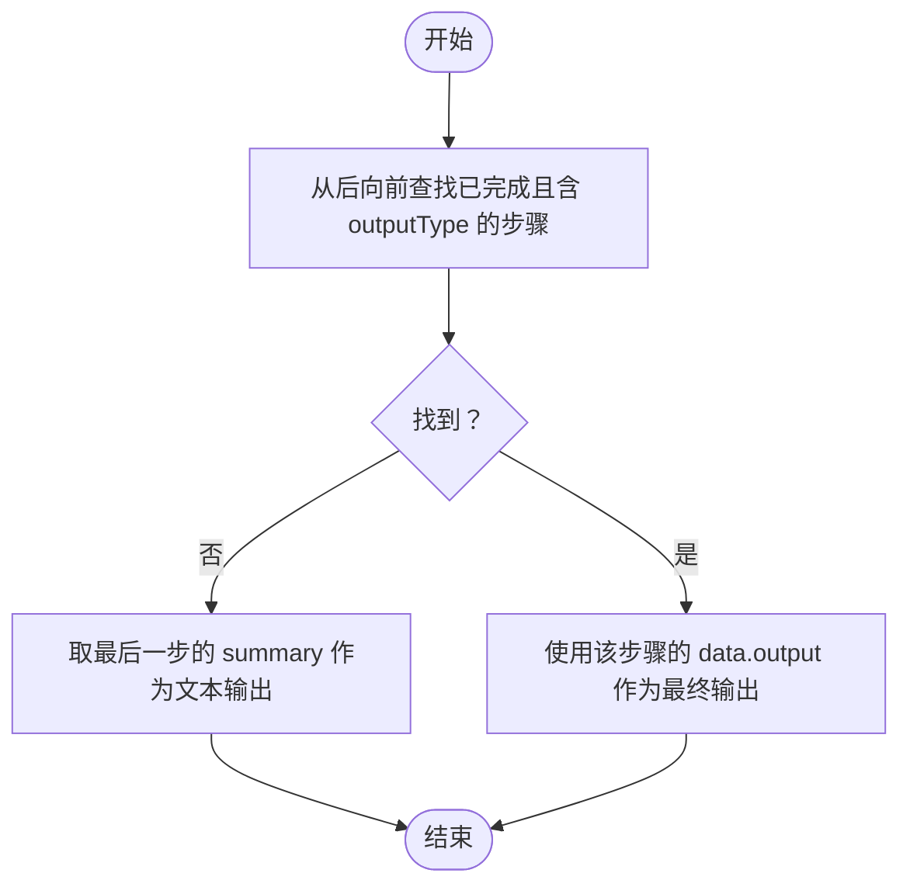
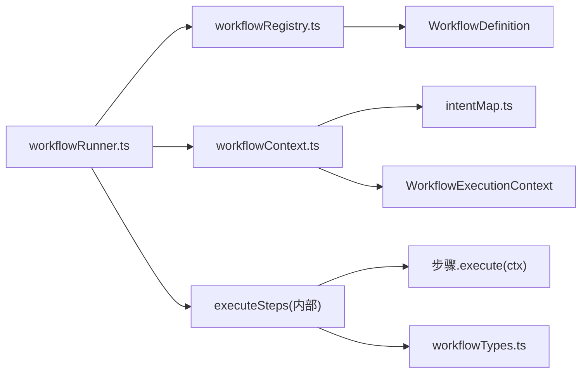

# 工作流引擎核心

<cite>
**本文引用的文件列表**
- [workflowRunner.ts](file://src/ai/engine/workflowRunner.ts)
- [workflowEngine.ts](file://src/ai/workflows/workflowEngine.ts)
- [workflowExecutor.ts](file://src/ai/workflows/workflowExecutor.ts)
- [workflowRegistry.ts](file://src/ai/workflows/workflowRegistry.ts)
- [workflowTypes.ts](file://src/ai/workflows/workflowTypes.ts)
- [workflowContext.ts](file://src/ai/workflows/workflowContext.ts)
- [vocabularyDictationWorkflow.ts](file://src/ai/workflows/vocabularyDictationWorkflow.ts)
- [intentMap.ts](file://src/ai/router/intentMap.ts)
- [WorkflowActionBar.tsx](file://src/ai/components/workflow/WorkflowActionBar.tsx)
- [WorkflowResultPanel.tsx](file://src/ai/components/workflow/WorkflowResultPanel.tsx)
- [index.ts](file://src/ai/engine/index.ts)
</cite>

## 目录
1. [简介](#简介)
2. [项目结构](#项目结构)
3. [核心组件](#核心组件)
4. [架构总览](#架构总览)
5. [详细组件分析](#详细组件分析)
6. [依赖关系分析](#依赖关系分析)
7. [性能考量](#性能考量)
8. [故障排查指南](#故障排查指南)
9. [结论](#结论)
10. [附录](#附录)

## 简介
本技术文档聚焦于小天AI教育平台的工作流引擎核心，围绕 workflowRunner.ts 的 runWorkflowRunner 函数展开，系统性阐述以下主题：
- runWorkflowRunner 的实现原理与控制流
- RunnerContext 与 RunnerCallbacks 的设计理念与使用方式
- 工作流执行的完整流程：从工作流定义查找、执行上下文构建到步骤执行与结果汇总
- 步骤执行器 executeSteps 的工作原理、错误处理与中断机制
- 输出构建器 buildOutput 的逻辑与建议收集机制
- 工作流执行的性能监控与状态管理策略
- 实际的代码示例与使用模式，帮助开发者理解内部工作机制

## 项目结构
工作流引擎位于 src/ai/engine 与 src/ai/workflows 两个目录下，采用“入口执行器 + 注册表 + 上下文 + 类型定义”的分层设计：
- 入口执行器：workflowRunner.ts 提供 runWorkflowRunner 主入口；workflowEngine.ts 提供基于自然语言查询的引擎入口；workflowExecutor.ts 提供可复用的执行器。
- 注册表：workflowRegistry.ts 维护所有工作流定义的注册与查找。
- 上下文：workflowContext.ts 负责构建执行上下文，包含触发意图解析与覆盖参数。
- 类型：workflowTypes.ts 定义了工作流、步骤、上下文、输出等核心类型。
- 示例工作流：vocabularyDictationWorkflow.ts 展示了多步骤、带 Agent 闭环的典型工作流。
- UI 组件：WorkflowActionBar.tsx 与 WorkflowResultPanel.tsx 展示了 UI 层对执行结果的消费方式。

图表来源
- [workflowRunner.ts:103-179](file://src/ai/engine/workflowRunner.ts#L103-L179)
- [workflowEngine.ts:42-78](file://src/ai/workflows/workflowEngine.ts#L42-L78)
- [workflowExecutor.ts:9-45](file://src/ai/workflows/workflowExecutor.ts#L9-L45)
- [workflowRegistry.ts:47-73](file://src/ai/workflows/workflowRegistry.ts#L47-L73)
- [workflowContext.ts:10-43](file://src/ai/workflows/workflowContext.ts#L10-L43)
- [vocabularyDictationWorkflow.ts:59-300](file://src/ai/workflows/vocabularyDictationWorkflow.ts#L59-L300)
- [intentMap.ts:219-272](file://src/ai/router/intentMap.ts#L219-L272)

章节来源
- [workflowRunner.ts:103-179](file://src/ai/engine/workflowRunner.ts#L103-L179)
- [workflowEngine.ts:42-78](file://src/ai/workflows/workflowEngine.ts#L42-L78)
- [workflowExecutor.ts:9-45](file://src/ai/workflows/workflowExecutor.ts#L9-L45)
- [workflowRegistry.ts:47-73](file://src/ai/workflows/workflowRegistry.ts#L47-L73)
- [workflowContext.ts:10-43](file://src/ai/workflows/workflowContext.ts#L10-L43)
- [vocabularyDictationWorkflow.ts:59-300](file://src/ai/workflows/vocabularyDictationWorkflow.ts#L59-L300)
- [intentMap.ts:219-272](file://src/ai/router/intentMap.ts#L219-L272)

## 核心组件
- runWorkflowRunner：工作流执行主入口，负责查找定义、构建上下文、顺序执行步骤、构建输出与建议、回调通知与最终结果封装。
- RunnerContext：教师端上下文，包含教材、年级、班级、学生人数、区域、触发查询、覆盖参数等。
- RunnerCallbacks：回调接口，支持每步更新、完成与错误通知。
- executeSteps：顺序执行步骤的内部实现，负责异常捕获、中断与持续时间统计。
- buildOutput：从步骤结果中提取最终输出，优先使用带 outputType 的步骤输出，否则回退到最后一步摘要。
- collectSuggestions：聚合各步骤的建议数组，形成全局建议列表。
- WorkflowDefinition/WorkflowExecutionContext/StepResult 等类型：统一的数据契约，确保执行器与步骤之间的解耦。

章节来源
- [workflowRunner.ts:31-74](file://src/ai/engine/workflowRunner.ts#L31-L74)
- [workflowRunner.ts:103-179](file://src/ai/engine/workflowRunner.ts#L103-L179)
- [workflowRunner.ts:183-223](file://src/ai/engine/workflowRunner.ts#L183-L223)
- [workflowRunner.ts:227-252](file://src/ai/engine/workflowRunner.ts#L227-L252)
- [workflowRunner.ts:254-261](file://src/ai/engine/workflowRunner.ts#L254-L261)
- [workflowTypes.ts:28-164](file://src/ai/workflows/workflowTypes.ts#L28-L164)

## 架构总览
工作流引擎采用“入口执行器 + 注册表 + 执行器 + 上下文”的分层架构：
- 入口执行器（workflowRunner.ts）面向外部调用者，提供 runWorkflowRunner 主入口。
- 注册表（workflowRegistry.ts）集中管理所有工作流定义，提供按 ID 查找与匹配能力。
- 执行器（workflowExecutor.ts）提供可复用的顺序执行与 UI 结果构建能力。
- 上下文（workflowContext.ts）负责从触发查询解析意图并注入执行上下文。
- 示例工作流（vocabularyDictationWorkflow.ts）展示多步骤与 Agent 闭环的典型场景。

图表来源
- [workflowRunner.ts:103-179](file://src/ai/engine/workflowRunner.ts#L103-L179)
- [workflowRunner.ts:183-223](file://src/ai/engine/workflowRunner.ts#L183-L223)
- [workflowRunner.ts:227-252](file://src/ai/engine/workflowRunner.ts#L227-L252)
- [workflowRegistry.ts:47-49](file://src/ai/workflows/workflowRegistry.ts#L47-L49)
- [workflowContext.ts:10-43](file://src/ai/workflows/workflowContext.ts#L10-L43)

## 详细组件分析

### runWorkflowRunner：执行主入口
- 职责与流程
  - 通过 workflowRegistry 查找工作流定义，若未注册则返回失败结果。
  - 使用 workflowContext 构建执行上下文，注入触发查询、教材/年级/班级/人数/区域、覆盖参数等。
  - 调用 executeSteps 顺序执行步骤，记录每步耗时与中间结果。
  - 使用 buildOutput 从步骤结果中提取最终输出，聚合建议与可调整参数。
  - 通过 RunnerCallbacks 回调完成事件与错误事件。
  - 返回 RunnerResult，包含成功标志、步骤明细、最终输出、建议与消息。

- 设计要点
  - 与 LLM 无关：当前全部 mock，接口设计兼容 LLM Agent，替换路径为 step.execute → LLM Tool Call。
  - 管道不变：step pipeline 即 Agent 的 plan→execute→observe 循环。
  - 回调驱动：每步完成后触发 onStepUpdate，完成后触发 onComplete，失败触发 onError。

- 使用模式
  - 基本调用：传入 workflowId、RunnerContext 与可选回调。
  - 覆盖参数：通过 RunnerContext.overrides 传递 quantity、difficulty 等参数。
  - UI 消费：onComplete 中接收 WorkflowUIRresult，用于渲染输出卡片与建议。

章节来源
- [workflowRunner.ts:103-179](file://src/ai/engine/workflowRunner.ts#L103-L179)
- [workflowRegistry.ts:47-49](file://src/ai/workflows/workflowRegistry.ts#L47-L49)
- [workflowContext.ts:10-43](file://src/ai/workflows/workflowContext.ts#L10-L43)

### RunnerContext 与 RunnerCallbacks：执行上下文与回调
- RunnerContext
  - 字段：textbook、unit、grade、className、studentCount、region、query、overrides。
  - 用途：作为 runWorkflowRunner 的输入，驱动上下文构建与覆盖参数生效。
- RunnerCallbacks
  - onStepUpdate：每步完成后回调，便于 UI 实时更新。
  - onComplete：全部步骤完成后回调，返回 UI 友好的 WorkflowUIRresult。
  - onError：某步失败时回调，便于错误提示与重试。

- 设计理念
  - RunnerContext 与 RunnerCallbacks 将“输入”和“观察”解耦，使执行器专注于执行，UI 专注展示。
  - 回调接口最小化，仅暴露必要的生命周期事件，降低耦合度。

章节来源
- [workflowRunner.ts:31-57](file://src/ai/engine/workflowRunner.ts#L31-L57)
- [workflowRunner.ts:103-179](file://src/ai/engine/workflowRunner.ts#L103-L179)

### executeSteps：步骤执行器与中断机制
- 工作原理
  - 顺序遍历 definition.steps，为每步记录开始时间，调用 step.execute(ctx)。
  - 成功：设置 result.duration，写入 ctx.stepResults，累积到 results，触发 onStepUpdate。
  - 失败：构造失败 StepResult，写入 ctx.stepResults，触发 onError，立即中断循环。
- 中断机制
  - 第一步失败即中断，避免无效的后续步骤执行，减少资源浪费。
- 性能监控
  - 使用 performance.now 记录每步耗时，duration 字段可用于 UI 展示与日志采集。

图表来源
- [workflowRunner.ts:183-223](file://src/ai/engine/workflowRunner.ts#L183-L223)

章节来源
- [workflowRunner.ts:183-223](file://src/ai/engine/workflowRunner.ts#L183-L223)

### buildOutput：输出构建与回退策略
- 优先策略
  - 寻找最后一个 status 为 completed 且 data.outputType 存在的步骤，使用其 data.output 作为最终输出。
- 回退策略
  - 若无 outputType，则使用最后一步的 summary 作为文本输出。
  - 若无任何步骤，返回空文本输出。
- 适用场景
  - 多步骤工作流中，只有特定步骤会产出最终 UI 输出（如词汇听写工作流的“生成可打印结果”步骤）。

图表来源
- [workflowRunner.ts:227-252](file://src/ai/engine/workflowRunner.ts#L227-L252)

章节来源
- [workflowRunner.ts:227-252](file://src/ai/engine/workflowRunner.ts#L227-L252)

### 建议收集机制：collectSuggestions
- 逻辑
  - 遍历所有步骤，若步骤 data.suggestions 为数组，则将其元素合并到全局建议数组。
- 用途
  - 将各步骤产生的建议聚合为 UI 的“AI 建议”面板，辅助教师决策与优化。

章节来源
- [workflowRunner.ts:254-261](file://src/ai/engine/workflowRunner.ts#L254-L261)
- [WorkflowResultPanel.tsx:57-71](file://src/ai/components/workflow/WorkflowResultPanel.tsx#L57-L71)

### 与 workflowEngine/workflowExecutor 的关系
- workflowEngine.runWorkflow：基于自然语言查询进行意图匹配，再调用 executeWorkflow 执行。
- workflowExecutor.executeWorkflow：通用顺序执行器，适合被其他入口复用。
- workflowRunner.runWorkflowRunner：面向已知 workflowId 的直接执行入口，内部也调用 executeSteps。

章节来源
- [workflowEngine.ts:42-78](file://src/ai/workflows/workflowEngine.ts#L42-L78)
- [workflowExecutor.ts:9-45](file://src/ai/workflows/workflowExecutor.ts#L9-L45)
- [workflowRunner.ts:103-179](file://src/ai/engine/workflowRunner.ts#L103-L179)

### 示例工作流：词汇听写生成
- 步骤构成
  - 解析教材上下文、获取词汇数据、AI 筛选重点词、生成默写内容、生成可打印结果。
- Agent 闭环
  - 步骤中多次调用 agentChatLoop，内部执行工具调用与多轮对话，最终生成输出。
- 输出类型
  - 最终步骤设置 data.outputType 为 pdf，buildOutput 优先使用该输出。

章节来源
- [vocabularyDictationWorkflow.ts:59-300](file://src/ai/workflows/vocabularyDictationWorkflow.ts#L59-L300)
- [workflowRunner.ts:227-252](file://src/ai/engine/workflowRunner.ts#L227-L252)

## 依赖关系分析
- 入口层依赖
  - runWorkflowRunner 依赖 workflowRegistry.getWorkflow 与 workflowContext.buildWorkflowContext。
- 执行层依赖
  - executeSteps 依赖步骤的 execute(ctx) 方法，步骤间通过 ctx.stepResults 传递数据。
- 类型契约
  - 所有类型定义集中在 workflowTypes.ts，保证执行器与步骤的解耦。
- 意图路由
  - workflowContext 内部调用 intentMap.matchIntent 进行触发意图解析，影响覆盖参数与上下文。

图表来源
- [workflowRunner.ts:103-179](file://src/ai/engine/workflowRunner.ts#L103-L179)
- [workflowRegistry.ts:47-49](file://src/ai/workflows/workflowRegistry.ts#L47-L49)
- [workflowContext.ts:10-43](file://src/ai/workflows/workflowContext.ts#L10-L43)
- [intentMap.ts:219-272](file://src/ai/router/intentMap.ts#L219-L272)
- [workflowTypes.ts:28-164](file://src/ai/workflows/workflowTypes.ts#L28-L164)

章节来源
- [workflowRunner.ts:103-179](file://src/ai/engine/workflowRunner.ts#L103-L179)
- [workflowRegistry.ts:47-49](file://src/ai/workflows/workflowRegistry.ts#L47-L49)
- [workflowContext.ts:10-43](file://src/ai/workflows/workflowContext.ts#L10-L43)
- [intentMap.ts:219-272](file://src/ai/router/intentMap.ts#L219-L272)
- [workflowTypes.ts:28-164](file://src/ai/workflows/workflowTypes.ts#L28-L164)

## 性能考量
- 步骤耗时统计
  - executeSteps 使用 performance.now 记录每步耗时，duration 字段可用于 UI 展示与日志采集。
- 中断策略
  - 首次失败即中断，避免无效的后续步骤执行，减少资源浪费。
- 输出构建
  - buildOutput 优先使用带 outputType 的步骤输出，减少不必要的回退计算。
- 建议聚合
  - collectSuggestions 仅聚合数组元素，复杂度线性于步骤数与建议总数。

章节来源
- [workflowRunner.ts:183-223](file://src/ai/engine/workflowRunner.ts#L183-L223)
- [workflowRunner.ts:227-252](file://src/ai/engine/workflowRunner.ts#L227-L252)
- [workflowRunner.ts:254-261](file://src/ai/engine/workflowRunner.ts#L254-L261)

## 故障排查指南
- 未注册工作流
  - 现象：返回失败结果，message 显示未注册。
  - 排查：确认 workflowId 是否存在于注册表，或检查注册流程。
- 步骤执行失败
  - 现象：onError 回调触发，后续步骤被中断。
  - 排查：查看具体步骤的 error 字段与 summary，定位失败原因。
- 输出为空
  - 现象：最终输出为文本或空。
  - 排查：确认是否有步骤设置了 data.outputType 与 data.output；否则回退逻辑是否合理。
- 建议缺失
  - 现象：UI 不显示建议。
  - 排查：确认步骤 data.suggestions 是否为数组，且非空。

章节来源
- [workflowRunner.ts:110-112](file://src/ai/engine/workflowRunner.ts#L110-L112)
- [workflowRunner.ts:205-219](file://src/ai/engine/workflowRunner.ts#L205-L219)
- [workflowRunner.ts:227-252](file://src/ai/engine/workflowRunner.ts#L227-L252)
- [workflowRunner.ts:254-261](file://src/ai/engine/workflowRunner.ts#L254-L261)

## 结论
工作流引擎以 runWorkflowRunner 为核心入口，结合注册表、上下文与执行器，实现了“定义可插拔、执行可观察、输出可聚合”的架构。通过 RunnerCallbacks 与 UI 组件的配合，实现了良好的用户体验与可观测性。executeSteps 的中断机制与 buildOutput 的优先策略，确保了在失败场景下的快速反馈与合理的回退输出。建议在扩展新工作流时遵循现有类型契约与回调约定，保持执行器与步骤的解耦与可测试性。

## 附录
- 入口导出
  - engine/index.ts 导出 runWorkflowRunner 与相关类型，便于外部模块统一引入。
- UI 消费
  - WorkflowActionBar.tsx 与 WorkflowResultPanel.tsx 展示了如何消费 WorkflowUIRresult，包括输出卡片、元数据与建议列表。

章节来源
- [index.ts:1-14](file://src/ai/engine/index.ts#L1-L14)
- [WorkflowActionBar.tsx:11-53](file://src/ai/components/workflow/WorkflowActionBar.tsx#L11-L53)
- [WorkflowResultPanel.tsx:8-74](file://src/ai/components/workflow/WorkflowResultPanel.tsx#L8-L74)