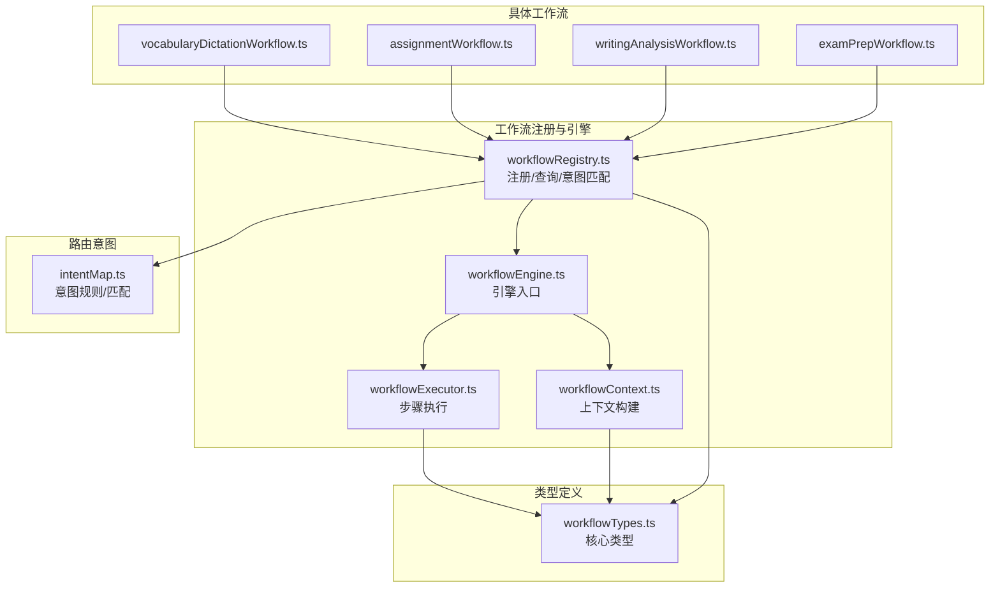
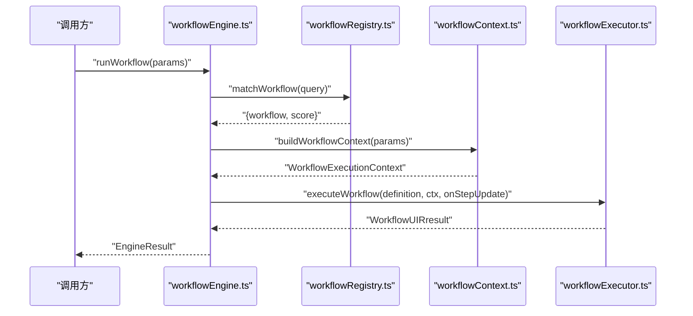
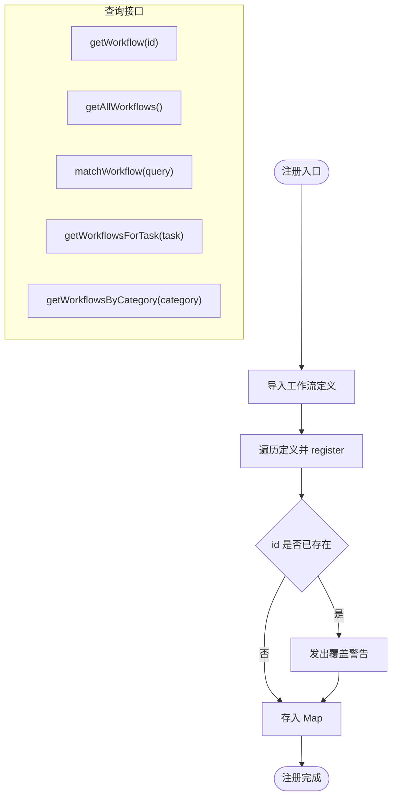
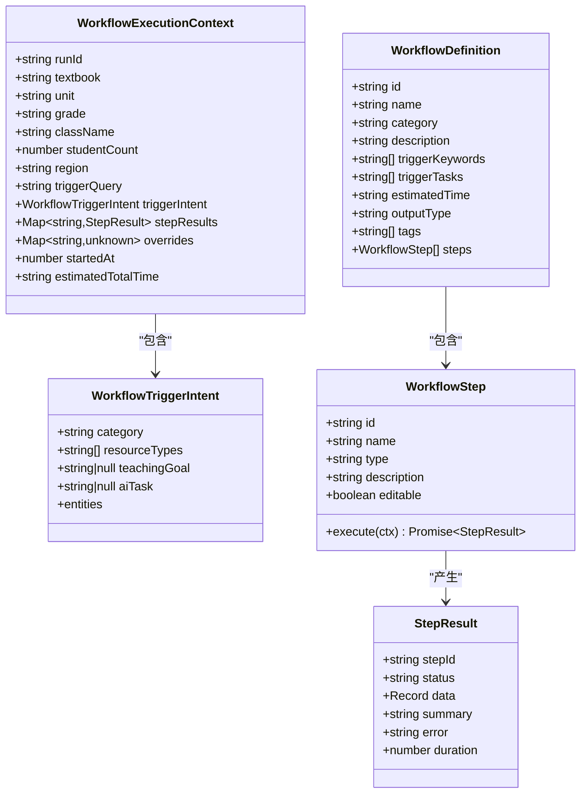
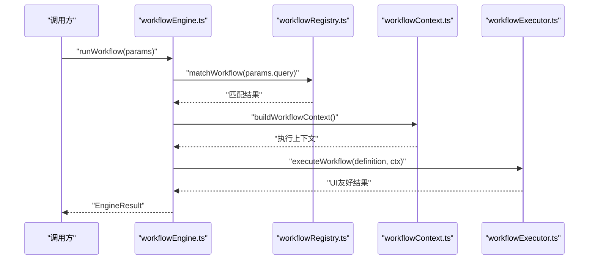
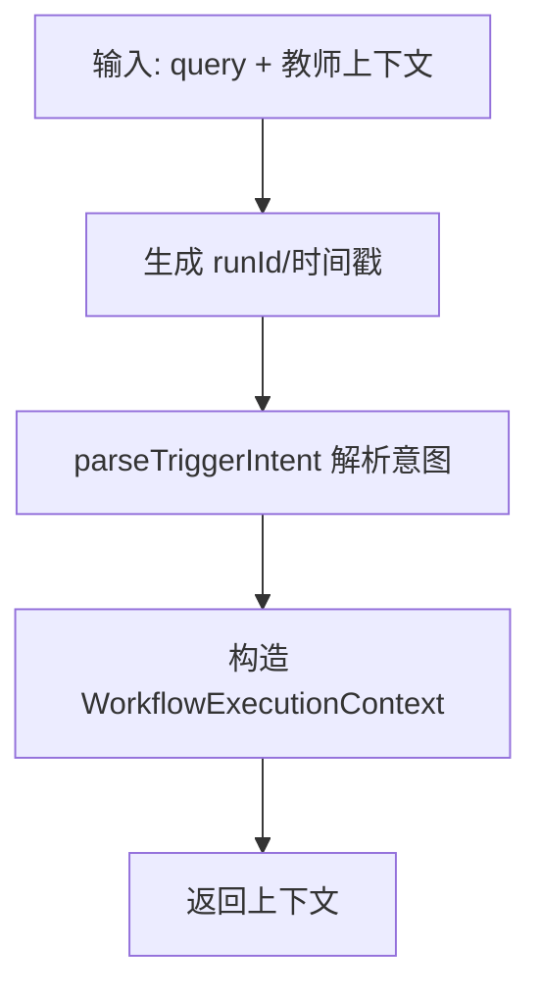
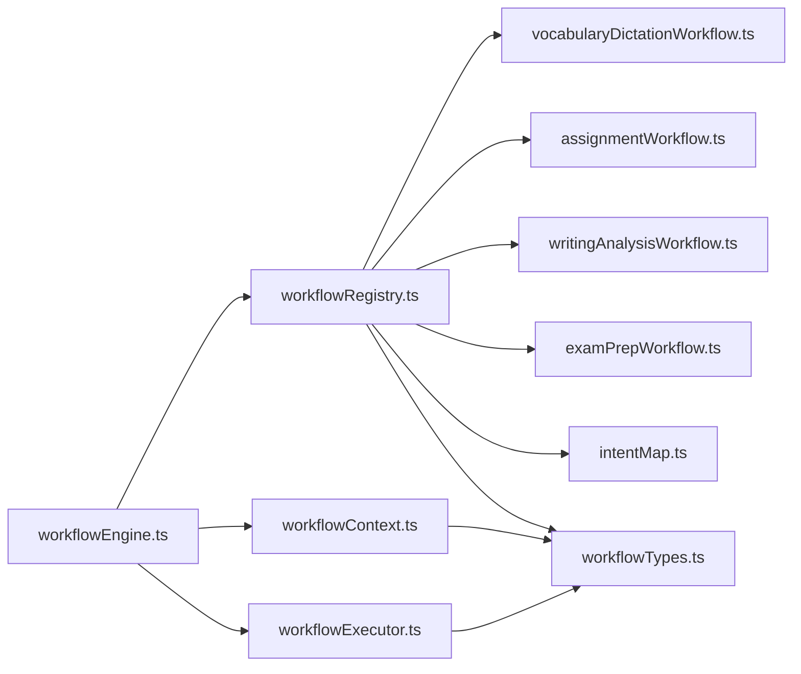

# 工作流注册系统

<cite>
**本文档引用的文件**
- [workflowRegistry.ts](file://src/ai/workflows/workflowRegistry.ts)
- [workflowTypes.ts](file://src/ai/workflows/workflowTypes.ts)
- [workflowEngine.ts](file://src/ai/workflows/workflowEngine.ts)
- [workflowExecutor.ts](file://src/ai/workflows/workflowExecutor.ts)
- [workflowContext.ts](file://src/ai/workflows/workflowContext.ts)
- [index.ts](file://src/ai/workflows/index.ts)
- [vocabularyDictationWorkflow.ts](file://src/ai/workflows/vocabularyDictationWorkflow.ts)
- [assignmentWorkflow.ts](file://src/ai/workflows/assignmentWorkflow.ts)
- [writingAnalysisWorkflow.ts](file://src/ai/workflows/writingAnalysisWorkflow.ts)
- [examPrepWorkflow.ts](file://src/ai/workflows/examPrepWorkflow.ts)
- [intentMap.ts](file://src/ai/router/intentMap.ts)
</cite>

## 目录
1. [简介](#简介)
2. [项目结构](#项目结构)
3. [核心组件](#核心组件)
4. [架构概览](#架构概览)
5. [详细组件分析](#详细组件分析)
6. [依赖关系分析](#依赖关系分析)
7. [性能考虑](#性能考虑)
8. [故障排除指南](#故障排除指南)
9. [结论](#结论)
10. [附录](#附录)

## 简介
本文件面向小天AI教育平台的工作流注册系统，围绕 workflowRegistry.ts 展开，系统性阐述工作流定义的注册、查找与管理机制；解释 WorkflowDefinition 与 WorkflowExecutionContext 等核心类型；梳理工作流生命周期（注册、激活、停用、销毁）；说明工作流分类与元数据管理；给出最佳实践与扩展指南，并提供具体注册示例与常见问题解决方案，帮助开发者正确注册与管理自定义工作流。

## 项目结构
工作流子系统位于 src/ai/workflows 目录下，采用“定义-注册-执行-上下文”分层组织：
- 注册中心：workflowRegistry.ts 负责集中注册与查询工作流
- 类型定义：workflowTypes.ts 提供工作流与步骤的核心类型
- 引擎：workflowEngine.ts 提供统一入口与运行策略
- 执行器：workflowExecutor.ts 实现步骤流水线执行与结果聚合
- 上下文：workflowContext.ts 负责触发意图解析与执行上下文构建
- 入口导出：index.ts 统一对外暴露 API
- 具体工作流：多个业务工作流文件（如 vocabularyDictationWorkflow.ts、assignmentWorkflow.ts 等）
- 路由意图：intentMap.ts 提供统一意图匹配与路由能力

图表来源
- [workflowRegistry.ts:1-119](file://src/ai/workflows/workflowRegistry.ts#L1-L119)
- [workflowEngine.ts:1-119](file://src/ai/workflows/workflowEngine.ts#L1-L119)
- [workflowExecutor.ts:1-143](file://src/ai/workflows/workflowExecutor.ts#L1-L143)
- [workflowContext.ts:1-154](file://src/ai/workflows/workflowContext.ts#L1-L154)
- [workflowTypes.ts:1-164](file://src/ai/workflows/workflowTypes.ts#L1-L164)
- [vocabularyDictationWorkflow.ts:1-387](file://src/ai/workflows/vocabularyDictationWorkflow.ts#L1-L387)
- [assignmentWorkflow.ts:1-144](file://src/ai/workflows/assignmentWorkflow.ts#L1-L144)
- [writingAnalysisWorkflow.ts:1-161](file://src/ai/workflows/writingAnalysisWorkflow.ts#L1-L161)
- [examPrepWorkflow.ts:1-112](file://src/ai/workflows/examPrepWorkflow.ts#L1-L112)
- [intentMap.ts:1-302](file://src/ai/router/intentMap.ts#L1-L302)

章节来源
- [workflowRegistry.ts:1-119](file://src/ai/workflows/workflowRegistry.ts#L1-L119)
- [index.ts:1-38](file://src/ai/workflows/index.ts#L1-L38)

## 核心组件
本节聚焦 workflowRegistry.ts 的注册机制与查询接口，以及与之配套的核心类型。

- 注册中心（workflowRegistry.ts）
  - 使用 Map 存储 WorkflowDefinition，键为 workflow.id
  - register 函数负责注册，若重复注册会发出警告并覆盖
  - 提供 getWorkflow、getAllWorkflows、matchWorkflow、getWorkflowsForTask、getWorkflowsByCategory 等查询接口
  - 提供 matchIntent/isWorkflowQuery 以委托统一意图路由（intentMap.ts）

- 核心类型（workflowTypes.ts）
  - WorkflowDefinition：工作流定义，包含 id/name/category/description/triggerKeywords/triggerTasks/estimatedTime/outputType/tags/steps
  - WorkflowExecutionContext：执行上下文，包含 runId、教师上下文、触发信息、步骤结果、覆盖参数、元数据等
  - WorkflowStep：步骤定义，包含 id/name/type/description/editable/execute
  - StepResult：步骤执行结果，包含 stepId/status/data/summary/error/duration
  - WorkflowRun/WorkflowUIRresult：运行记录与UI结果封装
  - WorkflowOutput/WorkflowOutputItem/AdjustableParam：输出结构与可调节参数

- 引擎与执行（workflowEngine.ts / workflowExecutor.ts）
  - runWorkflow/runWorkflowById：引擎入口，先匹配工作流，再构建上下文，最后执行
  - executeWorkflow：顺序执行步骤，收集 StepResult，构建 UI 友好结果

- 上下文构建（workflowContext.ts）
  - buildWorkflowContext：从查询与教师上下文构建执行上下文
  - parseTriggerIntent：轻量解析触发意图，提取实体与任务

章节来源
- [workflowRegistry.ts:21-85](file://src/ai/workflows/workflowRegistry.ts#L21-L85)
- [workflowTypes.ts:97-164](file://src/ai/workflows/workflowTypes.ts#L97-L164)
- [workflowEngine.ts:42-118](file://src/ai/workflows/workflowEngine.ts#L42-L118)
- [workflowExecutor.ts:9-70](file://src/ai/workflows/workflowExecutor.ts#L9-L70)
- [workflowContext.ts:10-43](file://src/ai/workflows/workflowContext.ts#L10-L43)

## 架构概览
工作流注册系统采用“集中注册 + 分散实现”的架构：
- 注册中心集中管理所有工作流定义，提供查询与匹配能力
- 具体工作流以模块形式独立实现，遵循 WorkflowDefinition 接口
- 引擎通过注册中心获取定义，结合上下文执行步骤流水线
- 路由意图系统提供自然语言到意图/工作流的映射

图表来源
- [workflowEngine.ts:42-78](file://src/ai/workflows/workflowEngine.ts#L42-L78)
- [workflowRegistry.ts:55-73](file://src/ai/workflows/workflowRegistry.ts#L55-L73)
- [workflowContext.ts:10-43](file://src/ai/workflows/workflowContext.ts#L10-L43)
- [workflowExecutor.ts:9-45](file://src/ai/workflows/workflowExecutor.ts#L9-L45)

## 详细组件分析

### 注册机制与查询接口（workflowRegistry.ts）
- 注册流程
  - 导入各工作流定义
  - 调用 register(wf) 将定义存入 Map
  - 若 id 已存在，发出覆盖警告
- 查询接口
  - getWorkflow(id)：按 id 获取定义
  - getAllWorkflows()：返回全部定义数组
  - matchWorkflow(query)：基于 triggerKeywords/triggerTasks 计算匹配分数，返回最佳匹配
  - getWorkflowsForTask(task)：按触发任务过滤
  - getWorkflowsByCategory(category)：按分类过滤
- 意图路由
  - matchIntent/query 委托 intentMap.ts 的 matchIntentNew/isWorkflowQueryNew
  - 保持向后兼容：导出兼容接口 IntentMatch

图表来源
- [workflowRegistry.ts:23-43](file://src/ai/workflows/workflowRegistry.ts#L23-L43)
- [workflowRegistry.ts:47-85](file://src/ai/workflows/workflowRegistry.ts#L47-L85)

章节来源
- [workflowRegistry.ts:21-85](file://src/ai/workflows/workflowRegistry.ts#L21-L85)

### 核心类型定义（workflowTypes.ts）
- WorkflowDefinition：工作流契约，包含元数据与步骤列表
- WorkflowExecutionContext：执行上下文，承载触发信息、步骤结果、覆盖参数与元数据
- WorkflowStep：步骤契约，要求实现 execute(ctx) 返回 StepResult
- StepResult：步骤结果，包含状态、数据、摘要、错误与耗时
- WorkflowRun/WorkflowUIRresult：运行记录与UI结果封装
- WorkflowOutput/AdjustableParam：输出结构与可调节参数

图表来源
- [workflowTypes.ts:97-164](file://src/ai/workflows/workflowTypes.ts#L97-L164)

章节来源
- [workflowTypes.ts:1-164](file://src/ai/workflows/workflowTypes.ts#L1-L164)

### 引擎与执行（workflowEngine.ts / workflowExecutor.ts）
- runWorkflow：匹配最佳工作流 → 构建上下文 → 执行 → 返回 UI 结果
- runWorkflowById：按 id 直接执行，跳过匹配
- executeWorkflow：顺序执行步骤，异常时提前返回失败结果
- buildUIResult：聚合输出、建议与可调节参数

图表来源
- [workflowEngine.ts:42-78](file://src/ai/workflows/workflowEngine.ts#L42-L78)
- [workflowExecutor.ts:9-45](file://src/ai/workflows/workflowExecutor.ts#L9-L45)

章节来源
- [workflowEngine.ts:18-118](file://src/ai/workflows/workflowEngine.ts#L18-L118)
- [workflowExecutor.ts:9-143](file://src/ai/workflows/workflowExecutor.ts#L9-L143)

### 上下文构建（workflowContext.ts）
- buildWorkflowContext：生成 runId、注入教师上下文、解析触发意图、初始化覆盖参数与元数据
- parseTriggerIntent：轻量解析类别、资源类型、教学目标、AI任务与实体（年级/单元/教材/关键词/数量/话题）

图表来源
- [workflowContext.ts:10-43](file://src/ai/workflows/workflowContext.ts#L10-L43)
- [workflowContext.ts:48-66](file://src/ai/workflows/workflowContext.ts#L48-L66)

章节来源
- [workflowContext.ts:1-154](file://src/ai/workflows/workflowContext.ts#L1-L154)

### 具体工作流示例
- 词汇听写工作流（vocabularyDictationWorkflow.ts）
  - 包含解析上下文、获取词汇、AI筛选重点词、生成默写内容、生成可打印结果等步骤
  - 步骤类型涵盖 context_injection/resource_fetching/ai_recommendation/output_generation
  - 支持通过覆盖参数（如数量、难度、模式）调节输出
- 布置作业工作流（assignmentWorkflow.ts）
  - 包含获取班级、选择班级、设置时间与规则、发布作业等步骤
  - 步骤类型涵盖 resource_fetching/context_injection/assignment_action
- 写作分析工作流（writingAnalysisWorkflow.ts）
  - 包含获取作文上下文、AI逐篇分析、生成教学建议、生成批改报告等步骤
  - 步骤类型涵盖 context_injection/ai_recommendation/teaching_suggestion/output_generation
- 考前冲刺工作流（examPrepWorkflow.ts）
  - 包含获取考试上下文、分析薄弱点、生成复习计划等步骤
  - 步骤类型涵盖 context_injection/ai_recommendation/output_generation

章节来源
- [vocabularyDictationWorkflow.ts:59-300](file://src/ai/workflows/vocabularyDictationWorkflow.ts#L59-L300)
- [assignmentWorkflow.ts:11-141](file://src/ai/workflows/assignmentWorkflow.ts#L11-L141)
- [writingAnalysisWorkflow.ts:12-158](file://src/ai/workflows/writingAnalysisWorkflow.ts#L12-L158)
- [examPrepWorkflow.ts:6-107](file://src/ai/workflows/examPrepWorkflow.ts#L6-L107)

### 工作流生命周期管理
- 注册：在 workflowRegistry.ts 中导入并调用 register，完成集中注册
- 激活：通过 getWorkflow/getAllWorkflows/matchWorkflow 获取并使用
- 停用：当前未提供显式停用接口；可通过移除注册或在业务侧屏蔽返回结果实现逻辑停用
- 销毁：无专门销毁函数；执行完成后上下文与结果对象由垃圾回收处理

章节来源
- [workflowRegistry.ts:23-53](file://src/ai/workflows/workflowRegistry.ts#L23-L53)
- [workflowEngine.ts:83-118](file://src/ai/workflows/workflowEngine.ts#L83-L118)

### 工作流分类与元数据管理
- 分类（WorkflowCategory）：resource/generation/teaching/analysis/assignment
- 触发关键字（triggerKeywords）与触发任务（triggerTasks）用于自然语言匹配
- 元数据（tags/estimatedTime/outputType）用于展示与调度
- 分类查询接口：getWorkflowsByCategory

章节来源
- [workflowTypes.ts:15-21](file://src/ai/workflows/workflowTypes.ts#L15-L21)
- [workflowTypes.ts:102-111](file://src/ai/workflows/workflowTypes.ts#L102-L111)
- [workflowRegistry.ts:81-85](file://src/ai/workflows/workflowRegistry.ts#L81-L85)

### 最佳实践与扩展指南
- 定义规范
  - 为每个工作流提供唯一的 id 与清晰的 name/description
  - 明确 triggerKeywords/triggerTasks，确保意图路由准确
  - 合理划分步骤，使用合适的步骤类型（context_injection/resource_fetching/ai_recommendation/output_generation/assignment_action/teaching_suggestion）
  - 在步骤 execute 中捕获异常并返回标准 StepResult
- 注册与导出
  - 在 workflowRegistry.ts 中导入并 register
  - 在 index.ts 中统一导出，便于外部消费
- 上下文与覆盖
  - 在 buildWorkflowContext 中合理注入教师上下文与触发意图
  - 通过 overrides 支持用户交互式调节参数
- 性能与可观测性
  - 步骤内记录 duration，便于性能分析
  - 使用 onStepUpdate 回调实时反馈进度
- 扩展新工作流
  - 新建文件实现 WorkflowDefinition
  - 在 workflowRegistry.ts 导入并注册
  - 如需路由支持，在 intentMap.ts 中添加规则

章节来源
- [workflowRegistry.ts:15-43](file://src/ai/workflows/workflowRegistry.ts#L15-L43)
- [index.ts:25-38](file://src/ai/workflows/index.ts#L25-L38)
- [workflowContext.ts:10-43](file://src/ai/workflows/workflowContext.ts#L10-L43)
- [workflowExecutor.ts:16-42](file://src/ai/workflows/workflowExecutor.ts#L16-L42)

### 注册示例与常见问题
- 注册示例
  - 在 workflowRegistry.ts 导入工作流定义并调用 register
  - 通过 getWorkflow('your-workflow-id') 获取定义
  - 通过 matchWorkflow('你的查询语句') 获取最佳匹配
- 常见问题
  - 重复注册：已有相同 id 的工作流会被覆盖并发出警告
  - 未匹配到工作流：matchWorkflow 返回 null，需回退到搜索或其他处理
  - 未注册的工作流：runWorkflowById 会提示未注册
  - 路由冲突：统一意图路由由 intentMap.ts 管理，避免关键词重叠导致歧义

章节来源
- [workflowRegistry.ts:23-28](file://src/ai/workflows/workflowRegistry.ts#L23-L28)
- [workflowEngine.ts:46-54](file://src/ai/workflows/workflowEngine.ts#L46-L54)
- [workflowEngine.ts:87-96](file://src/ai/workflows/workflowEngine.ts#L87-L96)
- [intentMap.ts:72-186](file://src/ai/router/intentMap.ts#L72-L186)

## 依赖关系分析
- 注册中心依赖：导入各工作流定义并在启动时集中注册
- 引擎依赖：依赖注册中心进行查询，依赖上下文构建与执行器
- 执行器依赖：依赖类型定义与步骤契约
- 上下文依赖：依赖类型定义与触发意图解析
- 路由意图：被注册中心委托使用

图表来源
- [workflowRegistry.ts:15-43](file://src/ai/workflows/workflowRegistry.ts#L15-L43)
- [workflowEngine.ts:1-6](file://src/ai/workflows/workflowEngine.ts#L1-L6)
- [workflowExecutor.ts:1](file://src/ai/workflows/workflowExecutor.ts#L1)
- [workflowContext.ts:1](file://src/ai/workflows/workflowContext.ts#L1)
- [workflowTypes.ts:1](file://src/ai/workflows/workflowTypes.ts#L1)
- [intentMap.ts:1](file://src/ai/router/intentMap.ts#L1)

章节来源
- [workflowRegistry.ts:15-43](file://src/ai/workflows/workflowRegistry.ts#L15-L43)
- [workflowEngine.ts:1-6](file://src/ai/workflows/workflowEngine.ts#L1-L6)
- [workflowExecutor.ts:1](file://src/ai/workflows/workflowExecutor.ts#L1)
- [workflowContext.ts:1](file://src/ai/workflows/workflowContext.ts#L1)
- [workflowTypes.ts:1](file://src/ai/workflows/workflowTypes.ts#L1)
- [intentMap.ts:1](file://src/ai/router/intentMap.ts#L1)

## 性能考虑
- 步骤执行耗时：在 executeWorkflow 中记录每步 duration，便于性能分析与优化
- 匹配算法：matchWorkflow 对所有工作流遍历计算分数，复杂度 O(N×(K+T))，N 为工作流数量，K/T 为关键字/任务数量
- 上下文构建：parseTriggerIntent 为轻量正则匹配，成本较低
- 建议
  - 控制工作流数量与步骤数量，避免过长流水线
  - 对耗时步骤进行异步处理与缓存
  - 使用覆盖参数减少不必要的重复计算

章节来源
- [workflowExecutor.ts:16-42](file://src/ai/workflows/workflowExecutor.ts#L16-L42)
- [workflowRegistry.ts:58-72](file://src/ai/workflows/workflowRegistry.ts#L58-L72)
- [workflowContext.ts:48-66](file://src/ai/workflows/workflowContext.ts#L48-L66)

## 故障排除指南
- 注册失败或覆盖
  - 症状：重复 id 注册发出警告
  - 处理：确保 id 唯一，必要时清理旧定义
- 未匹配到工作流
  - 症状：matchWorkflow 返回 null
  - 处理：检查 triggerKeywords/triggerTasks 是否合理，或回退到搜索
- 未注册的工作流
  - 症状：runWorkflowById 报告未注册
  - 处理：确认已在 workflowRegistry.ts 中导入并注册
- 路由歧义
  - 症状：意图无法判断或误判
  - 处理：在 intentMap.ts 中调整规则优先级与来源增强

章节来源
- [workflowRegistry.ts:23-28](file://src/ai/workflows/workflowRegistry.ts#L23-L28)
- [workflowEngine.ts:46-54](file://src/ai/workflows/workflowEngine.ts#L46-L54)
- [workflowEngine.ts:87-96](file://src/ai/workflows/workflowEngine.ts#L87-L96)
- [intentMap.ts:219-272](file://src/ai/router/intentMap.ts#L219-L272)

## 结论
工作流注册系统以 workflowRegistry.ts 为核心，通过集中注册与查询、统一意图路由、标准化类型定义与执行流程，实现了可扩展、可维护的工作流体系。开发者可依据 WorkflowDefinition 契约快速扩展新工作流，并通过覆盖参数与上下文注入实现灵活的业务适配。建议在实际开发中严格遵循注册规范、类型约束与最佳实践，确保系统稳定与可演进。

## 附录
- 统一导出入口：index.ts 提供引擎、执行器、注册中心、上下文与类型的一致对外接口
- 意图路由：intentMap.ts 提供统一的意图规则与匹配逻辑，支持来源增强与优先级控制

章节来源
- [index.ts:1-38](file://src/ai/workflows/index.ts#L1-L38)
- [intentMap.ts:72-186](file://src/ai/router/intentMap.ts#L72-L186)