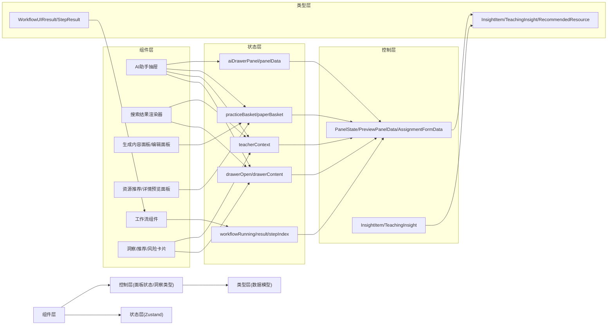
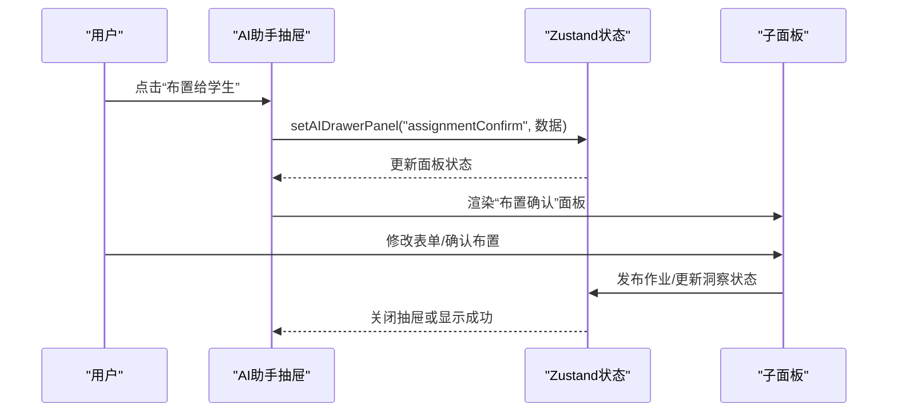
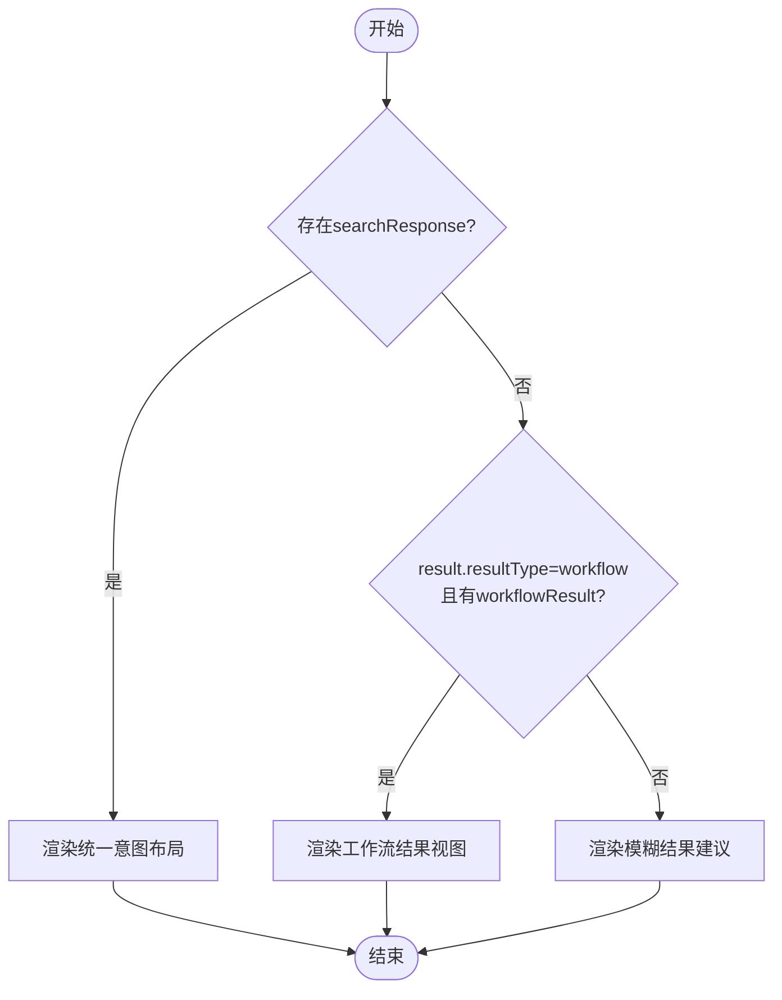
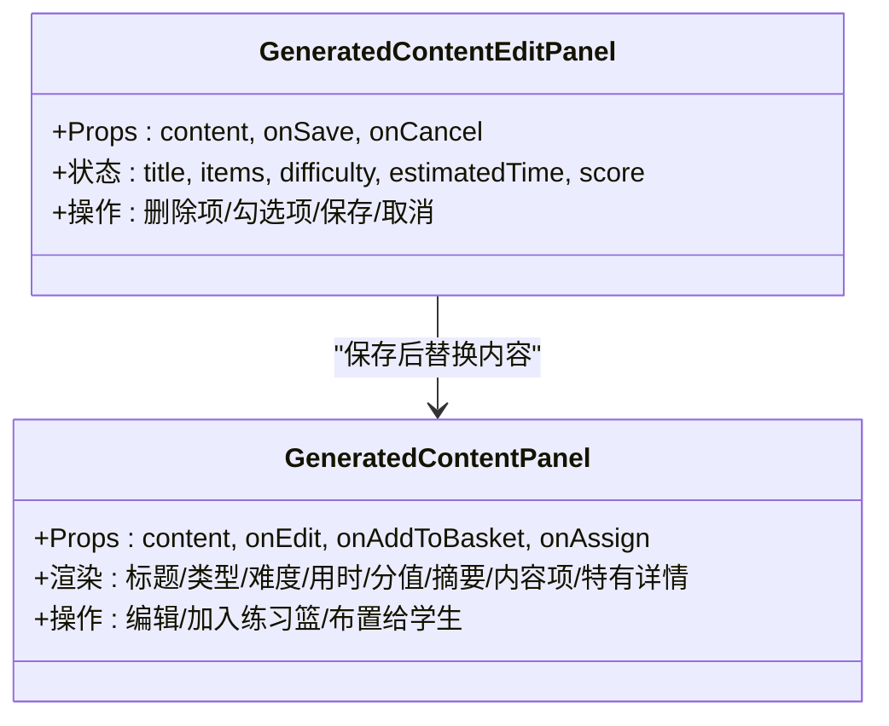
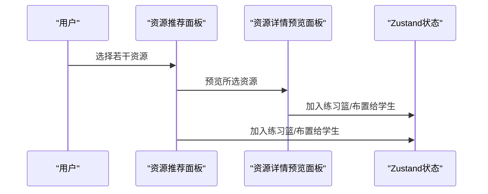
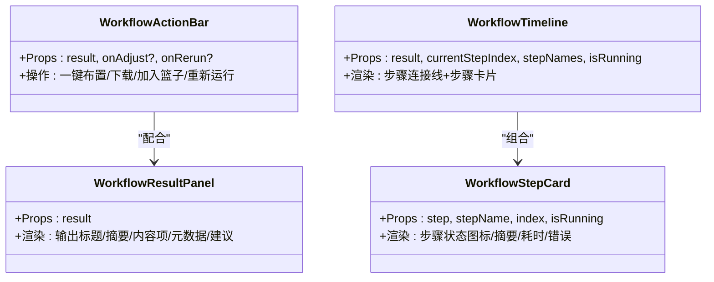
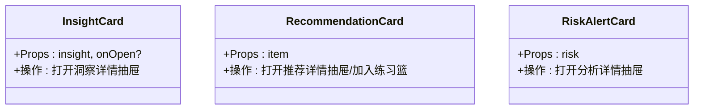
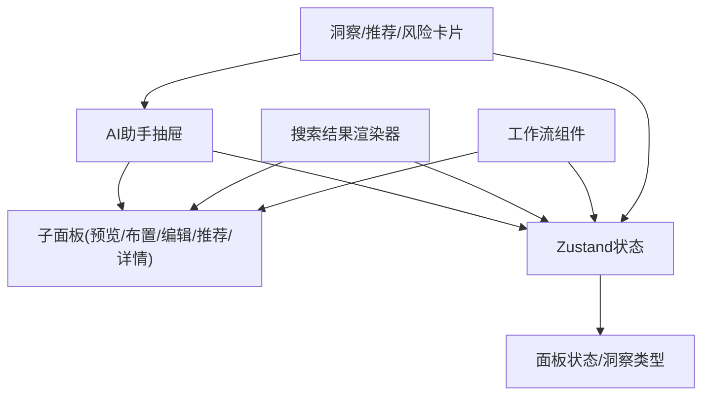

# AI组件系统

<cite>
**本文档引用的文件**
- [AIAssistantDrawer.tsx](file://src/ai/components/AIAssistantDrawer.tsx)
- [AISearchResultRenderer.tsx](file://src/ai/components/AISearchResultRenderer.tsx)
- [GeneratedContentPanel.tsx](file://src/ai/components/GeneratedContentPanel.tsx)
- [GeneratedContentEditPanel.tsx](file://src/ai/components/GeneratedContentEditPanel.tsx)
- [ResourceRecommendationPanel.tsx](file://src/ai/components/ResourceRecommendationPanel.tsx)
- [ResourceDetailPreviewPanel.tsx](file://src/ai/components/ResourceDetailPreviewPanel.tsx)
- [WorkflowActionBar.tsx](file://src/ai/components/workflow/WorkflowActionBar.tsx)
- [WorkflowResultPanel.tsx](file://src/ai/components/workflow/WorkflowResultPanel.tsx)
- [WorkflowTimeline.tsx](file://src/ai/components/workflow/WorkflowTimeline.tsx)
- [WorkflowStepCard.tsx](file://src/ai/components/workflow/WorkflowStepCard.tsx)
- [InsightCard.tsx](file://src/ai/cards/InsightCard.tsx)
- [RecommendationCard.tsx](file://src/ai/cards/RecommendationCard.tsx)
- [RiskAlertCard.tsx](file://src/ai/cards/RiskAlertCard.tsx)
- [index.ts](file://src/ai/store/index.ts)
- [panelState.ts](file://src/ai/controller/panelState.ts)
- [insightTypes.ts](file://src/ai/insights/insightTypes.ts)
- [teachingInsightTypes.ts](file://src/ai/insights/teachingInsightTypes.ts)
- [DrawerHeader.tsx](file://src/ai/components/DrawerHeader.tsx)
</cite>

## 目录
1. [简介](#简介)
2. [项目结构](#项目结构)
3. [核心组件](#核心组件)
4. [架构总览](#架构总览)
5. [详细组件分析](#详细组件分析)
6. [依赖关系分析](#依赖关系分析)
7. [性能考量](#性能考量)
8. [故障排查指南](#故障排查指南)
9. [结论](#结论)
10. [附录](#附录)

## 简介
本文件面向小天AI教育平台的AI组件系统，系统性梳理AI助手抽屉、搜索结果渲染器、内容编辑面板、工作流组件、洞察卡片等核心模块的设计理念、架构模式与实现细节。文档覆盖组件的属性接口、事件处理、状态管理、样式定制与主题支持，并提供扩展与自定义开发指南，帮助开发者快速理解与高效集成。

## 项目结构
AI组件系统采用“按功能域分层 + 组件化”的组织方式：
- 组件层：AI助手抽屉、搜索结果渲染器、内容面板与编辑面板、工作流操作条与时间线、洞察/推荐/风险卡片等
- 控制层：面板状态定义与切换、洞察类型与教学洞察类型定义
- 状态层：Zustand全局状态管理，统一维护抽屉、教师上下文、练习篮、工作流运行状态、AI助手抽屉面板等
- 资源与洞察：资源类型、推荐资源、洞察数据模型与生成内容类型

```mermaid
graph TB
subgraph "组件层"
A["AI助手抽屉<br/>AIAssistantDrawer.tsx"]
B["搜索结果渲染器<br/>AISearchResultRenderer.tsx"]
C["生成内容面板<br/>GeneratedContentPanel.tsx"]
D["生成内容编辑面板<br/>GeneratedContentEditPanel.tsx"]
E["资源推荐面板<br/>ResourceRecommendationPanel.tsx"]
F["资源详情预览面板<br/>ResourceDetailPreviewPanel.tsx"]
G["工作流操作条<br/>WorkflowActionBar.tsx"]
H["工作流结果面板<br/>WorkflowResultPanel.tsx"]
I["工作流时间线<br/>WorkflowTimeline.tsx"]
J["工作流步骤卡片<br/>WorkflowStepCard.tsx"]
K["洞察卡片<br/>InsightCard.tsx"]
L["推荐卡片<br/>RecommendationCard.tsx"]
M["风险预警卡片<br/>RiskAlertCard.tsx"]
N["抽屉头部<br/>DrawerHeader.tsx"]
end
subgraph "控制与类型"
O["面板状态定义<br/>panelState.ts"]
P["洞察类型定义<br/>insightTypes.ts"]
Q["教学洞察类型定义<br/>teachingInsightTypes.ts"]
end
subgraph "状态管理"
R["Zustand状态(store)<br/>index.ts"]
end
A --> R
B --> R
C --> R
D --> R
E --> R
F --> R
G --> R
H --> R
I --> R
J --> R
K --> R
L --> R
M --> R
N --> R
A --> O
B --> P
C --> Q
D --> Q
E --> Q
F --> Q
G --> Q
H --> Q
I --> Q
J --> Q
K --> P
L --> R
M --> R
N --> R
```

图表来源
- [AIAssistantDrawer.tsx:1-2475](file://src/ai/components/AIAssistantDrawer.tsx#L1-L2475)
- [AISearchResultRenderer.tsx:1-624](file://src/ai/components/AISearchResultRenderer.tsx#L1-L624)
- [GeneratedContentPanel.tsx:1-254](file://src/ai/components/GeneratedContentPanel.tsx#L1-L254)
- [GeneratedContentEditPanel.tsx:1-189](file://src/ai/components/GeneratedContentEditPanel.tsx#L1-L189)
- [ResourceRecommendationPanel.tsx:1-237](file://src/ai/components/ResourceRecommendationPanel.tsx#L1-L237)
- [ResourceDetailPreviewPanel.tsx:1-224](file://src/ai/components/ResourceDetailPreviewPanel.tsx#L1-L224)
- [WorkflowActionBar.tsx:1-54](file://src/ai/components/workflow/WorkflowActionBar.tsx#L1-L54)
- [WorkflowResultPanel.tsx:1-75](file://src/ai/components/workflow/WorkflowResultPanel.tsx#L1-L75)
- [WorkflowTimeline.tsx:1-31](file://src/ai/components/workflow/WorkflowTimeline.tsx#L1-L31)
- [WorkflowStepCard.tsx:1-57](file://src/ai/components/workflow/WorkflowStepCard.tsx#L1-L57)
- [InsightCard.tsx:1-58](file://src/ai/cards/InsightCard.tsx#L1-L58)
- [RecommendationCard.tsx:1-72](file://src/ai/cards/RecommendationCard.tsx#L1-L72)
- [RiskAlertCard.tsx:1-63](file://src/ai/cards/RiskAlertCard.tsx#L1-L63)
- [index.ts:1-244](file://src/ai/store/index.ts#L1-L244)
- [panelState.ts:1-52](file://src/ai/controller/panelState.ts#L1-L52)
- [insightTypes.ts:1-113](file://src/ai/insights/insightTypes.ts#L1-L113)
- [teachingInsightTypes.ts:1-191](file://src/ai/insights/teachingInsightTypes.ts#L1-L191)
- [DrawerHeader.tsx:1-50](file://src/ai/components/DrawerHeader.tsx#L1-L50)

章节来源
- [AIAssistantDrawer.tsx:1-2475](file://src/ai/components/AIAssistantDrawer.tsx#L1-L2475)
- [AISearchResultRenderer.tsx:1-624](file://src/ai/components/AISearchResultRenderer.tsx#L1-L624)
- [index.ts:1-244](file://src/ai/store/index.ts#L1-L244)

## 核心组件
- AI助手抽屉：右侧66vw全宽抽屉，承载资源预览、布置确认、练习篮、制卡确认、词表编辑、洞察详情、生成内容预览/编辑、资源推荐、资源详情预览、搜索结果、阶段洞察、新搜索V2等面板。支持面板历史栈、Esc关闭、面包屑式返回。
- 搜索结果渲染器：统一渲染各类意图的结果，支持工作流结果视图与搜索结果视图，内置“单词讲解/学情结论/问题结论/任务理解/默认资源搜索”等多场景布局。
- 生成内容面板/编辑面板：展示AI生成内容摘要、题型配置、讲评要点、范文亮点等，并支持编辑、加入练习篮、布置给学生等操作。
- 资源推荐/详情预览面板：支持资源选择/反选、移除/恢复、预览题目详情、加入练习篮、布置给学生。
- 工作流组件：工作流操作条、结果面板、时间线与步骤卡片，用于展示工作流执行状态与步骤详情。
- 洞察/推荐/风险卡片：以卡片形式呈现洞察、推荐与风险信息，支持优先级/风险等级可视化与跳转到抽屉详情。

章节来源
- [AIAssistantDrawer.tsx:54-554](file://src/ai/components/AIAssistantDrawer.tsx#L54-L554)
- [AISearchResultRenderer.tsx:29-54](file://src/ai/components/AISearchResultRenderer.tsx#L29-L54)
- [GeneratedContentPanel.tsx:40-151](file://src/ai/components/GeneratedContentPanel.tsx#L40-L151)
- [GeneratedContentEditPanel.tsx:18-49](file://src/ai/components/GeneratedContentEditPanel.tsx#L18-L49)
- [ResourceRecommendationPanel.tsx:25-236](file://src/ai/components/ResourceRecommendationPanel.tsx#L25-L236)
- [ResourceDetailPreviewPanel.tsx:21-223](file://src/ai/components/ResourceDetailPreviewPanel.tsx#L21-L223)
- [WorkflowActionBar.tsx:11-53](file://src/ai/components/workflow/WorkflowActionBar.tsx#L11-L53)
- [WorkflowResultPanel.tsx:8-74](file://src/ai/components/workflow/WorkflowResultPanel.tsx#L8-L74)
- [WorkflowTimeline.tsx:11-30](file://src/ai/components/workflow/WorkflowTimeline.tsx#L11-L30)
- [WorkflowStepCard.tsx:11-56](file://src/ai/components/workflow/WorkflowStepCard.tsx#L11-L56)
- [InsightCard.tsx:11-57](file://src/ai/cards/InsightCard.tsx#L11-L57)
- [RecommendationCard.tsx:18-71](file://src/ai/cards/RecommendationCard.tsx#L18-L71)
- [RiskAlertCard.tsx:11-62](file://src/ai/cards/RiskAlertCard.tsx#L11-L62)

## 架构总览
系统采用“组件-状态-控制-类型”分层架构：
- 组件层负责UI与交互，通过props接收数据与回调，触发状态变更
- 状态层使用Zustand集中管理抽屉、教师上下文、练习篮、工作流、AI助手抽屉面板等
- 控制层提供面板状态类型定义与洞察/教学洞察类型定义，确保跨页面一致的数据契约
- 类型层定义了洞察、推荐、风险、工作流输出等核心数据结构

图表来源
- [index.ts:59-243](file://src/ai/store/index.ts#L59-L243)
- [panelState.ts:7-51](file://src/ai/controller/panelState.ts#L7-L51)
- [insightTypes.ts:58-75](file://src/ai/insights/insightTypes.ts#L58-L75)
- [teachingInsightTypes.ts:137-190](file://src/ai/insights/teachingInsightTypes.ts#L137-L190)

## 详细组件分析

### AI助手抽屉（AIAssistantDrawer）
- 设计理念：作为右侧66vw全宽抽屉，承载教学场景中的“资源预览、布置确认、练习篮、制卡确认、词表编辑、洞察详情、生成内容预览/编辑、资源推荐、资源详情预览、搜索结果、阶段洞察、新搜索V2”等面板，形成“轻量操作面板 + 深度内容编辑”的一体化体验。
- 关键特性：
  - 面板历史栈：支持在抽屉内打开子面板时保存当前面板，返回时恢复
  - Esc关闭：监听键盘事件，按Esc关闭抽屉
  - 布置确认流程：支持预填布置设置、修改后确认布置、成功反馈
  - 练习篮：支持加入/移除，显示数量徽标
  - 新搜索V2：支持快速入口、预览、加入试卷篮、生成布置草稿、一键确认布置
- 事件与状态：
  - 打开/关闭抽屉、切换面板、返回上一级、提交布置、加入练习篮、打开子面板等
  - 使用Zustand状态管理抽屉开关、面板类型与数据、教师上下文、练习篮、新搜索结果、待发布布置草稿等

图表来源
- [AIAssistantDrawer.tsx:123-138](file://src/ai/components/AIAssistantDrawer.tsx#L123-L138)
- [index.ts:97-118](file://src/ai/store/index.ts#L97-L118)

章节来源
- [AIAssistantDrawer.tsx:54-554](file://src/ai/components/AIAssistantDrawer.tsx#L54-L554)
- [index.ts:97-118](file://src/ai/store/index.ts#L97-L118)

### 搜索结果渲染器（AISearchResultRenderer）
- 设计理念：统一渲染各类意图的搜索结果，优先使用“统一意图布局”，兼容旧工作流-only结果与模糊结果场景。
- 关键特性：
  - 统一意图布局：根据searchResponse渲染“单词讲解/学情结论/问题结论/任务理解/默认资源搜索”等场景
  - 工作流结果视图：展示工作流输出标题、摘要、建议、元数据与操作按钮
  - 模糊结果：提供常见意图建议，引导用户明确需求
- 事件与状态：
  - 处理资源动作（预览、加入练习篮、布置）、面板切换、加载态

图表来源
- [AISearchResultRenderer.tsx:29-54](file://src/ai/components/AISearchResultRenderer.tsx#L29-L54)

章节来源
- [AISearchResultRenderer.tsx:29-580](file://src/ai/components/AISearchResultRenderer.tsx#L29-L580)

### 生成内容面板与编辑面板
- 生成内容面板：
  - 展示标题、类型、难度、用时、分值、摘要、内容项、类型特有详情（题型配置、讲评要点、范文亮点等）
  - 支持编辑、加入练习篮、布置给学生
- 生成内容编辑面板：
  - 支持编辑标题、增删改内容项、设置难度/用时/分值、口语/听力素材选择等
  - 保存后更新状态并返回上一级

图表来源
- [GeneratedContentPanel.tsx:40-151](file://src/ai/components/GeneratedContentPanel.tsx#L40-L151)
- [GeneratedContentEditPanel.tsx:18-49](file://src/ai/components/GeneratedContentEditPanel.tsx#L18-L49)

章节来源
- [GeneratedContentPanel.tsx:40-254](file://src/ai/components/GeneratedContentPanel.tsx#L40-L254)
- [GeneratedContentEditPanel.tsx:18-189](file://src/ai/components/GeneratedContentEditPanel.tsx#L18-L189)

### 资源推荐/详情预览面板
- 资源推荐面板：
  - 支持资源选择/反选、移除/恢复、预览、加入练习篮、布置给学生
  - 提供“已选数量”与底部操作栏
- 资源详情预览面板：
  - 展示题目详情、难度/分值、答案与解析
  - 支持移除/恢复题目、加入练习篮、布置给学生

图表来源
- [ResourceRecommendationPanel.tsx:54-89](file://src/ai/components/ResourceRecommendationPanel.tsx#L54-L89)
- [ResourceDetailPreviewPanel.tsx:43-71](file://src/ai/components/ResourceDetailPreviewPanel.tsx#L43-L71)

章节来源
- [ResourceRecommendationPanel.tsx:25-236](file://src/ai/components/ResourceRecommendationPanel.tsx#L25-L236)
- [ResourceDetailPreviewPanel.tsx:21-223](file://src/ai/components/ResourceDetailPreviewPanel.tsx#L21-L223)

### 工作流组件
- 工作流操作条：一键布置、下载、加入练习篮、重新运行
- 工作流结果面板：展示输出标题/摘要、内容项、元数据、AI建议
- 工作流时间线：展示步骤连接线与步骤卡片
- 工作流步骤卡片：展示步骤状态（完成/运行中/失败/跳过）、耗时、错误信息

图表来源
- [WorkflowActionBar.tsx:11-53](file://src/ai/components/workflow/WorkflowActionBar.tsx#L11-L53)
- [WorkflowResultPanel.tsx:8-74](file://src/ai/components/workflow/WorkflowResultPanel.tsx#L8-L74)
- [WorkflowTimeline.tsx:11-30](file://src/ai/components/workflow/WorkflowTimeline.tsx#L11-L30)
- [WorkflowStepCard.tsx:11-56](file://src/ai/components/workflow/WorkflowStepCard.tsx#L11-L56)

章节来源
- [WorkflowActionBar.tsx:11-53](file://src/ai/components/workflow/WorkflowActionBar.tsx#L11-L53)
- [WorkflowResultPanel.tsx:8-74](file://src/ai/components/workflow/WorkflowResultPanel.tsx#L8-L74)
- [WorkflowTimeline.tsx:11-30](file://src/ai/components/workflow/WorkflowTimeline.tsx#L11-L30)
- [WorkflowStepCard.tsx:11-56](file://src/ai/components/workflow/WorkflowStepCard.tsx#L11-L56)

### 洞察/推荐/风险卡片
- 洞察卡片：展示洞察标题、摘要、标签、优先级（常规/关注/预警），点击打开洞察详情抽屉
- 推荐卡片：展示推荐标题、理由、类型（练习/素材/课件/作业）、难度、用时，支持加入练习篮
- 风险预警卡片：展示风险标题、描述、学生名、风险等级（低/中/高）、标签，点击打开分析详情抽屉

图表来源
- [InsightCard.tsx:11-57](file://src/ai/cards/InsightCard.tsx#L11-L57)
- [RecommendationCard.tsx:18-71](file://src/ai/cards/RecommendationCard.tsx#L18-L71)
- [RiskAlertCard.tsx:11-62](file://src/ai/cards/RiskAlertCard.tsx#L11-L62)

章节来源
- [InsightCard.tsx:11-57](file://src/ai/cards/InsightCard.tsx#L11-L57)
- [RecommendationCard.tsx:18-71](file://src/ai/cards/RecommendationCard.tsx#L18-L71)
- [RiskAlertCard.tsx:11-62](file://src/ai/cards/RiskAlertCard.tsx#L11-L62)

### 抽屉头部（DrawerHeader）
- 展示抽屉类型标签、标题与教师上下文（教材、单元、班级）
- 提供关闭抽屉按钮

章节来源
- [DrawerHeader.tsx:13-49](file://src/ai/components/DrawerHeader.tsx#L13-L49)

## 依赖关系分析
- 组件对状态的依赖：各组件通过useAIStore访问全局状态，如抽屉开关、面板类型、教师上下文、练习篮、工作流状态、AI助手抽屉面板等
- 组件间协作：AI助手抽屉作为容器，内部嵌套多个子面板；搜索结果渲染器与工作流组件分别对接不同数据源；卡片组件驱动抽屉详情展示
- 类型一致性：通过panelState.ts与insightTypes.ts/teachingInsightTypes.ts保证数据契约稳定

图表来源
- [index.ts:140-243](file://src/ai/store/index.ts#L140-L243)
- [panelState.ts:7-51](file://src/ai/controller/panelState.ts#L7-L51)
- [insightTypes.ts:58-75](file://src/ai/insights/insightTypes.ts#L58-L75)
- [teachingInsightTypes.ts:137-190](file://src/ai/insights/teachingInsightTypes.ts#L137-L190)

章节来源
- [index.ts:140-243](file://src/ai/store/index.ts#L140-L243)
- [panelState.ts:7-51](file://src/ai/controller/panelState.ts#L7-L51)
- [insightTypes.ts:58-75](file://src/ai/insights/insightTypes.ts#L58-L75)
- [teachingInsightTypes.ts:137-190](file://src/ai/insights/teachingInsightTypes.ts#L137-L190)

## 性能考量
- 渲染优化：抽屉采用固定宽度与动画入场，避免频繁重排；子面板按需渲染，减少不必要的重渲染
- 状态粒度：将抽屉、面板、教师上下文、练习篮、工作流状态拆分为独立字段，降低无关状态变更带来的重渲染
- 本地存储：试卷篮持久化至localStorage，减少重复计算与网络请求
- 操作反馈：通过toast与按钮禁用状态提供即时反馈，避免无效操作

## 故障排查指南
- 抽屉无法关闭/返回：
  - 检查Esc事件绑定与面板栈是否正确更新
  - 确认setPanel与setPanelStack调用顺序
- 布置确认失败：
  - 校验表单数据完整性与必填项
  - 检查发布作业逻辑与洞察状态更新
- 练习篮/试卷篮异常：
  - 确认去重逻辑与本地存储读写
  - 检查toast提示与状态更新
- 工作流步骤状态异常：
  - 校验步骤状态枚举与渲染条件
  - 检查耗时与错误信息展示

章节来源
- [AIAssistantDrawer.tsx:74-119](file://src/ai/components/AIAssistantDrawer.tsx#L74-L119)
- [index.ts:124-136](file://src/ai/store/index.ts#L124-L136)
- [WorkflowStepCard.tsx:12-20](file://src/ai/components/workflow/WorkflowStepCard.tsx#L12-L20)

## 结论
小天AI教育平台的AI组件系统以“组件-状态-控制-类型”分层架构为核心，通过Zustand集中管理全局状态，结合统一的面板状态与洞察类型定义，实现了从搜索结果到内容生成、从工作流执行到卡片驱动的完整教学闭环。系统具备良好的扩展性与可维护性，便于后续接入真实资源与洞察数据。

## 附录
- 属性接口与事件处理清单（节选）
  - AI助手抽屉：面板类型、面板数据、教师上下文、练习篮、新搜索结果、待发布布置草稿
  - 搜索结果渲染器：结果对象、上下文、面板切换回调、加载态
  - 生成内容面板/编辑面板：内容对象、编辑/加入/布置回调
  - 资源推荐/详情预览面板：动作标签、查询语句、动作ID、洞察标题、预览/布置回调、返回回调
  - 工作流组件：结果对象、调整/重新运行回调
  - 洞察/推荐/风险卡片：洞察/推荐/风险对象、打开详情回调
- 主题与样式定制
  - 组件广泛使用Tailwind类名，可通过主题变量或CSS变量覆盖颜色与尺寸
  - 建议统一定义品牌色、风险色（低/中/高）、状态色（完成/运行中/失败/跳过）等主题常量
- 扩展与自定义开发指南
  - 新增面板：在AI助手抽屉中新增case分支，定义面板数据结构与操作回调
  - 新增工作流：在工作流结果视图中增加类型分支与渲染逻辑
  - 新增卡片：在卡片组件中增加类型映射与跳转逻辑
  - 状态扩展：在Zustand store中新增字段与方法，确保类型定义同步更新

章节来源
- [AIAssistantDrawer.tsx:98-165](file://src/ai/components/AIAssistantDrawer.tsx#L98-L165)
- [AISearchResultRenderer.tsx:20-25](file://src/ai/components/AISearchResultRenderer.tsx#L20-L25)
- [GeneratedContentPanel.tsx:11-16](file://src/ai/components/GeneratedContentPanel.tsx#L11-L16)
- [ResourceRecommendationPanel.tsx:15-23](file://src/ai/components/ResourceRecommendationPanel.tsx#L15-L23)
- [WorkflowActionBar.tsx:5-9](file://src/ai/components/workflow/WorkflowActionBar.tsx#L5-L9)
- [InsightCard.tsx:1-4](file://src/ai/cards/InsightCard.tsx#L1-L4)
- [index.ts:59-118](file://src/ai/store/index.ts#L59-L118)
- [panelState.ts:7-51](file://src/ai/controller/panelState.ts#L7-L51)
- [insightTypes.ts:58-75](file://src/ai/insights/insightTypes.ts#L58-L75)
- [teachingInsightTypes.ts:137-190](file://src/ai/insights/teachingInsightTypes.ts#L137-L190)