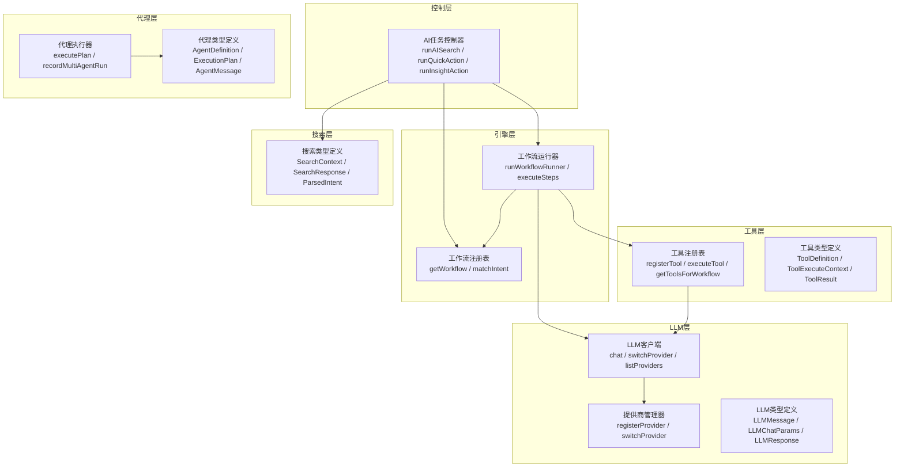
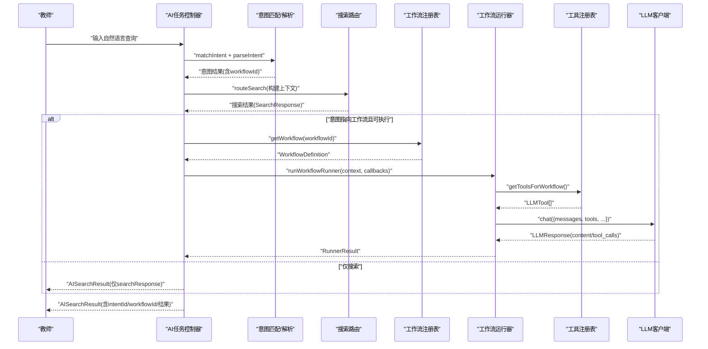
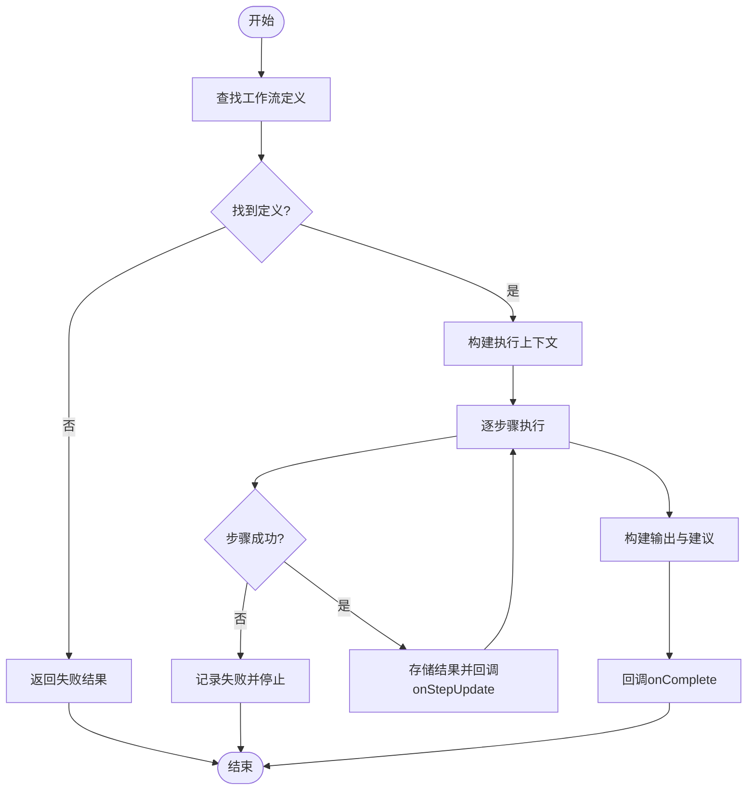
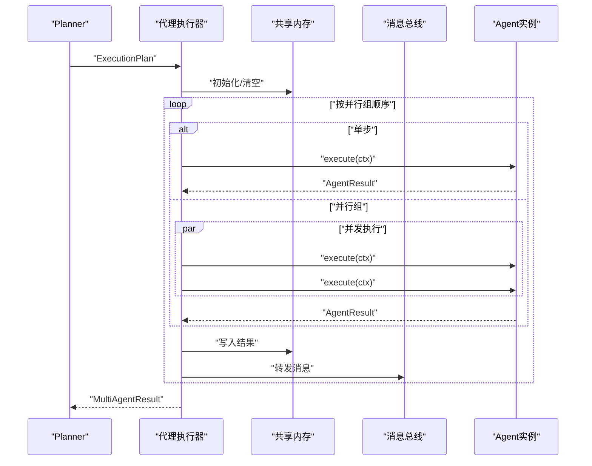
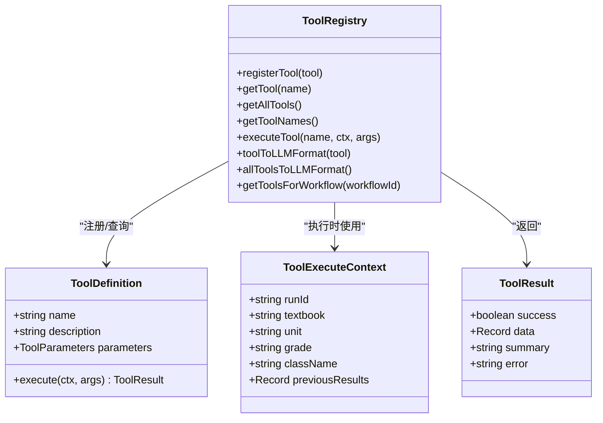
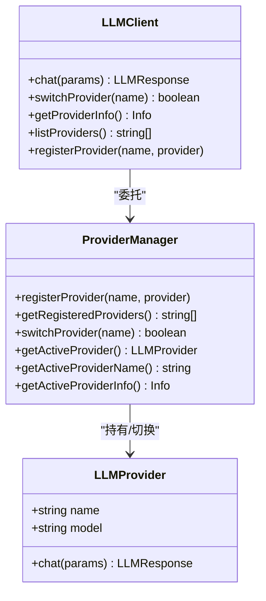
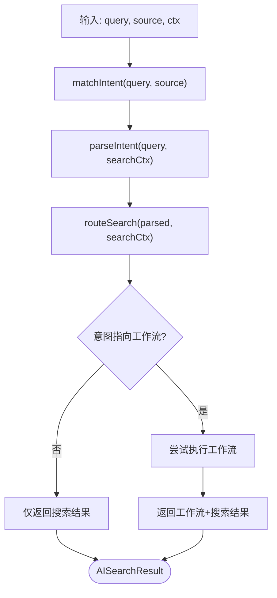
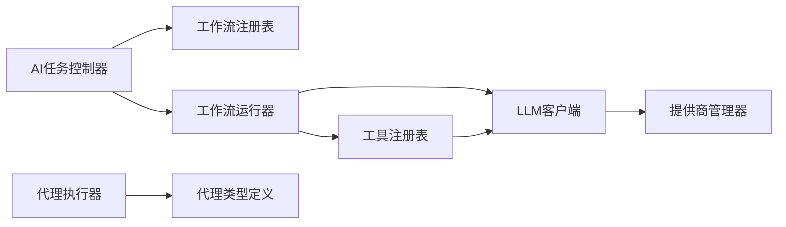

# API参考文档

<cite>
**本文档引用的文件**
- [src/ai/controller/aiTaskController.ts](file://src/ai/controller/aiTaskController.ts)
- [src/ai/engine/workflowRunner.ts](file://src/ai/engine/workflowRunner.ts)
- [src/ai/workflows/workflowRegistry.ts](file://src/ai/workflows/workflowRegistry.ts)
- [src/ai/llm/index.ts](file://src/ai/llm/index.ts)
- [src/ai/llm/llmClient.ts](file://src/ai/llm/llmClient.ts)
- [src/ai/llm/providerManager.ts](file://src/ai/llm/providerManager.ts)
- [src/ai/llm/types.ts](file://src/ai/llm/types.ts)
- [src/ai/tools/index.ts](file://src/ai/tools/index.ts)
- [src/ai/tools/toolRegistry.ts](file://src/ai/tools/toolRegistry.ts)
- [src/ai/tools/types.ts](file://src/ai/tools/types.ts)
- [src/ai/agent/index.ts](file://src/ai/agent/index.ts)
- [src/ai/agent/agentExecutor.ts](file://src/ai/agent/agentExecutor.ts)
- [src/ai/agent/types.ts](file://src/ai/agent/types.ts)
- [src/ai/search/types.ts](file://src/ai/search/types.ts)
</cite>

## 目录
1. [简介](#简介)
2. [项目结构](#项目结构)
3. [核心组件](#核心组件)
4. [架构总览](#架构总览)
5. [详细组件分析](#详细组件分析)
6. [依赖关系分析](#依赖关系分析)
7. [性能考量](#性能考量)
8. [故障排查指南](#故障排查指南)
9. [结论](#结论)
10. [附录](#附录)

## 简介
本文件为小天AI教育平台的API参考文档，覆盖以下能力域：
- 工作流API：统一的任务编排与执行，支持步骤级回调、可调整参数与建议输出。
- 代理API：多智能体协作执行计划，支持并行/串行/条件执行，共享内存与消息总线。
- 工具API：工具注册、LLM函数式调用桥接、工具执行与结果回传。
- LLM提供商API：统一聊天接口、提供商切换、注册与信息查询。
- 搜索与意图路由：自然语言解析、资源/动作/教学建议检索与上下文构建。

说明：
- 本仓库未发现传统REST API端点或WebSocket/Socket/IPC/Pipe等网络协议实现。
- 文档中的“API”均指上述模块对外暴露的JavaScript/TypeScript公共接口与类型契约。
- 若需接入HTTP/WebSocket/Socket/IPC，请基于本文档的类型与流程进行适配层开发。

## 项目结构
围绕AI能力的核心目录与职责：
- 控制层：统一入口，负责意图匹配、搜索路由与工作流执行。
- 引擎层：工作流执行引擎，提供步骤管线、回调与结果聚合。
- 工作流注册表：集中注册与查找工作流定义。
- LLM层：统一聊天客户端、提供商管理器与类型定义。
- 工具层：工具注册表、LLM函数式调用桥接与执行。
- 代理层：多Agent执行器、消息总线与共享内存。
- 搜索层：资源/动作/建议的类型定义与上下文。

图表来源
- [src/ai/controller/aiTaskController.ts:1-184](file://src/ai/controller/aiTaskController.ts#L1-L184)
- [src/ai/engine/workflowRunner.ts:1-288](file://src/ai/engine/workflowRunner.ts#L1-L288)
- [src/ai/workflows/workflowRegistry.ts:1-119](file://src/ai/workflows/workflowRegistry.ts#L1-L119)
- [src/ai/llm/llmClient.ts:1-78](file://src/ai/llm/llmClient.ts#L1-L78)
- [src/ai/llm/providerManager.ts:1-76](file://src/ai/llm/providerManager.ts#L1-L76)
- [src/ai/llm/types.ts:1-118](file://src/ai/llm/types.ts#L1-L118)
- [src/ai/tools/toolRegistry.ts:1-117](file://src/ai/tools/toolRegistry.ts#L1-L117)
- [src/ai/tools/types.ts:1-60](file://src/ai/tools/types.ts#L1-L60)
- [src/ai/agent/agentExecutor.ts:1-165](file://src/ai/agent/agentExecutor.ts#L1-L165)
- [src/ai/agent/types.ts:1-131](file://src/ai/agent/types.ts#L1-L131)
- [src/ai/search/types.ts:1-195](file://src/ai/search/types.ts#L1-L195)

章节来源
- [src/ai/controller/aiTaskController.ts:1-184](file://src/ai/controller/aiTaskController.ts#L1-L184)
- [src/ai/engine/workflowRunner.ts:1-288](file://src/ai/engine/workflowRunner.ts#L1-L288)
- [src/ai/workflows/workflowRegistry.ts:1-119](file://src/ai/workflows/workflowRegistry.ts#L1-L119)
- [src/ai/llm/index.ts:1-39](file://src/ai/llm/index.ts#L1-L39)
- [src/ai/llm/llmClient.ts:1-78](file://src/ai/llm/llmClient.ts#L1-L78)
- [src/ai/llm/providerManager.ts:1-76](file://src/ai/llm/providerManager.ts#L1-L76)
- [src/ai/llm/types.ts:1-118](file://src/ai/llm/types.ts#L1-L118)
- [src/ai/tools/index.ts:1-20](file://src/ai/tools/index.ts#L1-L20)
- [src/ai/tools/toolRegistry.ts:1-117](file://src/ai/tools/toolRegistry.ts#L1-L117)
- [src/ai/tools/types.ts:1-60](file://src/ai/tools/types.ts#L1-L60)
- [src/ai/agent/index.ts:1-57](file://src/ai/agent/index.ts#L1-L57)
- [src/ai/agent/agentExecutor.ts:1-165](file://src/ai/agent/agentExecutor.ts#L1-L165)
- [src/ai/agent/types.ts:1-131](file://src/ai/agent/types.ts#L1-L131)
- [src/ai/search/types.ts:1-195](file://src/ai/search/types.ts#L1-L195)

## 核心组件
- AI任务控制器：统一入口，封装意图匹配、搜索路由与工作流执行，返回一致的搜索/工作流结果结构。
- 工作流运行器：按步骤顺序执行，支持回调（每步更新、完成、错误）、可调整参数与建议收集。
- 工具注册表：注册工具、桥接到LLM函数schema、按工作流自动注入所需工具。
- LLM客户端与提供商管理器：统一聊天接口、动态切换提供商、列出已注册提供商。
- 代理执行器：按并行组顺序执行多Agent计划，支持共享内存与消息总线。
- 搜索类型：定义资源/动作/建议的结构化结果与上下文。

章节来源
- [src/ai/controller/aiTaskController.ts:70-184](file://src/ai/controller/aiTaskController.ts#L70-L184)
- [src/ai/engine/workflowRunner.ts:82-288](file://src/ai/engine/workflowRunner.ts#L82-L288)
- [src/ai/tools/toolRegistry.ts:14-117](file://src/ai/tools/toolRegistry.ts#L14-L117)
- [src/ai/llm/llmClient.ts:29-78](file://src/ai/llm/llmClient.ts#L29-L78)
- [src/ai/llm/providerManager.ts:14-76](file://src/ai/llm/providerManager.ts#L14-L76)
- [src/ai/agent/agentExecutor.ts:36-165](file://src/ai/agent/agentExecutor.ts#L36-L165)
- [src/ai/search/types.ts:108-195](file://src/ai/search/types.ts#L108-L195)

## 架构总览
整体流程：教师输入自然语言 → 意图解析 → 搜索路由（优先）→ 可选工作流执行 → 统一结果返回。

图表来源
- [src/ai/controller/aiTaskController.ts:78-118](file://src/ai/controller/aiTaskController.ts#L78-L118)
- [src/ai/engine/workflowRunner.ts:103-179](file://src/ai/engine/workflowRunner.ts#L103-L179)
- [src/ai/workflows/workflowRegistry.ts:47-115](file://src/ai/workflows/workflowRegistry.ts#L47-L115)
- [src/ai/tools/toolRegistry.ts:103-116](file://src/ai/tools/toolRegistry.ts#L103-L116)
- [src/ai/llm/llmClient.ts:33-35](file://src/ai/llm/llmClient.ts#L33-L35)

## 详细组件分析

### 工作流API
- 入口函数：runWorkflowRunner(workflowId, context, callbacks)
- 关键回调：
  - onStepUpdate(stepIndex, stepName, result)
  - onComplete(result)
  - onError(stepIndex, error)
- 输出结构：RunnerResult，包含成功标志、步骤明细、最终输出、可调整参数与建议列表。
- 步骤执行：按定义顺序执行，失败即停止；最后输出优先取最后一个完成步骤的输出，否则汇总最后一步摘要。
- 上下文：RunnerContext包含教材、单元、年级、班级、学生人数、区域、触发查询与覆盖参数。

图表来源
- [src/ai/engine/workflowRunner.ts:103-223](file://src/ai/engine/workflowRunner.ts#L103-L223)
- [src/ai/engine/workflowRunner.ts:227-275](file://src/ai/engine/workflowRunner.ts#L227-L275)

章节来源
- [src/ai/engine/workflowRunner.ts:31-179](file://src/ai/engine/workflowRunner.ts#L31-L179)
- [src/ai/workflows/workflowRegistry.ts:47-85](file://src/ai/workflows/workflowRegistry.ts#L47-L85)

### 代理API
- 执行入口：executePlan(plan, sharedMemory?)
- 执行模式：按并行组顺序执行，组内并行；遇到非可选失败步骤立即停止。
- 共享内存：跨Agent可见的键值存储，便于步骤间数据传递。
- 消息总线：Agent间通过消息传递上下文、发现、请求、结果与错误。
- 记录：recordMultiAgentRun用于记录协作执行结果。

图表来源
- [src/ai/agent/agentExecutor.ts:36-106](file://src/ai/agent/agentExecutor.ts#L36-L106)
- [src/ai/agent/types.ts:107-131](file://src/ai/agent/types.ts#L107-L131)

章节来源
- [src/ai/agent/agentExecutor.ts:27-165](file://src/ai/agent/agentExecutor.ts#L27-L165)
- [src/ai/agent/types.ts:13-131](file://src/ai/agent/types.ts#L13-L131)

### 工具API
- 注册与查询：registerTool(tool)、getTool(name)、getAllTools()、getToolNames()。
- 执行：executeTool(name, ctx, args) → ToolResult。
- LLM桥接：toolToLLMFormat(tool)、allToolsToLLMFormat()、getToolsForWorkflow(workflowId)。
- 类型：ToolDefinition、ToolExecuteContext、ToolResult。

图表来源
- [src/ai/tools/toolRegistry.ts:14-117](file://src/ai/tools/toolRegistry.ts#L14-L117)
- [src/ai/tools/types.ts:5-60](file://src/ai/tools/types.ts#L5-L60)

章节来源
- [src/ai/tools/index.ts:1-20](file://src/ai/tools/index.ts#L1-L20)
- [src/ai/tools/toolRegistry.ts:14-117](file://src/ai/tools/toolRegistry.ts#L14-L117)
- [src/ai/tools/types.ts:1-60](file://src/ai/tools/types.ts#L1-L60)

### LLM提供商API
- 客户端：llm.chat(params)、switchLLMProvider(name)、getLLMProviderInfo()、listProviders()、registerLLMProvider(name, provider)。
- 提供商管理：registerProvider(name, provider)、switchProvider(name)、getActiveProvider()/Info()。
- 类型：LLMMessage、LLMTool、LLMToolCall、LLMToolParameters、LLMResponse、LLMUsage、LLMChatParams、LLMProvider。

图表来源
- [src/ai/llm/llmClient.ts:29-78](file://src/ai/llm/llmClient.ts#L29-L78)
- [src/ai/llm/providerManager.ts:26-66](file://src/ai/llm/providerManager.ts#L26-L66)
- [src/ai/llm/types.ts:105-118](file://src/ai/llm/types.ts#L105-L118)

章节来源
- [src/ai/llm/index.ts:1-39](file://src/ai/llm/index.ts#L1-L39)
- [src/ai/llm/llmClient.ts:1-78](file://src/ai/llm/llmClient.ts#L1-L78)
- [src/ai/llm/providerManager.ts:1-76](file://src/ai/llm/providerManager.ts#L1-L76)
- [src/ai/llm/types.ts:1-118](file://src/ai/llm/types.ts#L1-L118)

### 搜索与意图路由API
- 控制器：runAISearch(query, source, ctx)、runQuickAction(actionType, source, ctx)、runInsightAction(insightType, source, ctx)。
- 搜索上下文：buildSearchContext(ctx) → SearchContext。
- 结果：AISearchResult，包含intentId、workflowId、label、confidence、resultType、searchResponse、workflowResult、query、source。

图表来源
- [src/ai/controller/aiTaskController.ts:78-160](file://src/ai/controller/aiTaskController.ts#L78-L160)
- [src/ai/controller/aiTaskController.ts:171-183](file://src/ai/controller/aiTaskController.ts#L171-L183)

章节来源
- [src/ai/controller/aiTaskController.ts:70-160](file://src/ai/controller/aiTaskController.ts#L70-L160)
- [src/ai/search/types.ts:108-195](file://src/ai/search/types.ts#L108-L195)

## 依赖关系分析
- 控制器依赖工作流注册表与运行器，并调用搜索路由。
- 工作流运行器依赖注册表、工具注册表与LLM客户端。
- 工具注册表依赖LLM客户端进行函数式调用桥接。
- 代理执行器依赖代理定义、共享内存与消息总线。
- LLM客户端依赖提供商管理器。

图表来源
- [src/ai/controller/aiTaskController.ts:8-11](file://src/ai/controller/aiTaskController.ts#L8-L11)
- [src/ai/engine/workflowRunner.ts:17-27](file://src/ai/engine/workflowRunner.ts#L17-L27)
- [src/ai/tools/toolRegistry.ts:14](file://src/ai/tools/toolRegistry.ts#L14)
- [src/ai/llm/llmClient.ts:12-19](file://src/ai/llm/llmClient.ts#L12-L19)
- [src/ai/agent/agentExecutor.ts:17-23](file://src/ai/agent/agentExecutor.ts#L17-L23)

章节来源
- [src/ai/controller/aiTaskController.ts:8-11](file://src/ai/controller/aiTaskController.ts#L8-L11)
- [src/ai/engine/workflowRunner.ts:17-27](file://src/ai/engine/workflowRunner.ts#L17-L27)
- [src/ai/tools/toolRegistry.ts:14](file://src/ai/tools/toolRegistry.ts#L14)
- [src/ai/llm/llmClient.ts:12-19](file://src/ai/llm/llmClient.ts#L12-L19)
- [src/ai/agent/agentExecutor.ts:17-23](file://src/ai/agent/agentExecutor.ts#L17-L23)

## 性能考量
- 步骤计时：工作流运行器在每步执行前后记录时间，便于统计耗时与瓶颈。
- 并行执行：代理执行器支持并行组，减少总执行时间；但需注意共享内存与消息总线的并发访问。
- 工具调用：工具执行可能涉及外部系统，应避免阻塞主线程，必要时采用异步与超时控制。
- LLM调用：合理设置温度与最大令牌数，避免不必要的长对话轮次；批量工具注册与一次性LLM调用优于多次往返。
- 缓存与去重：在工具层与搜索层可引入缓存策略，减少重复计算与网络请求。

## 故障排查指南
- 工作流失败：
  - 检查工作流定义是否存在；若未注册，运行器会返回失败结果。
  - 查看步骤执行日志与错误回调，定位首个失败步骤。
  - 确认工具注册与LLM函数schema是否正确映射。
- LLM提供商切换：
  - 确认提供商已注册；未注册名称将被拒绝并打印可用列表。
  - 检查API密钥配置（真实提供商），默认mock提供商始终可用。
- 工具执行失败：
  - 工具未注册或执行异常会返回失败结果，检查工具名称与参数schema。
- 代理执行失败：
  - 非可选步骤失败会中断后续执行；检查Agent定义与依赖关系。
  - 共享内存与消息总线冲突可能导致数据不一致，确保并发安全。

章节来源
- [src/ai/engine/workflowRunner.ts:110-112](file://src/ai/engine/workflowRunner.ts#L110-L112)
- [src/ai/engine/workflowRunner.ts:205-218](file://src/ai/engine/workflowRunner.ts#L205-L218)
- [src/ai/llm/providerManager.ts:36-46](file://src/ai/llm/providerManager.ts#L36-L46)
- [src/ai/tools/toolRegistry.ts:46-65](file://src/ai/tools/toolRegistry.ts#L46-L65)
- [src/ai/agent/agentExecutor.ts:70-73](file://src/ai/agent/agentExecutor.ts#L70-L73)

## 结论
本仓库提供了完整的AI能力模块化API：统一的意图解析与搜索路由、可扩展的工作流执行引擎、跨提供商的LLM客户端、工具注册与函数式调用桥接、以及多Agent协作执行器。这些API以清晰的类型契约与回调机制，支撑了从自然语言到结构化输出的完整链路。若需接入HTTP/WebSocket/Socket/IPC，请基于本文档的类型与流程进行适配层开发。

## 附录
- 常见用例
  - 快速动作：根据动作类型生成对应查询并执行搜索或工作流。
  - 学情洞察：根据洞察类型生成查询并执行搜索或工作流。
  - 教学建议：结合搜索结果与工作流输出，给出教学建议。
- 客户端实现要点
  - 使用AI任务控制器作为唯一入口，避免页面自建路由逻辑。
  - 在工作流执行中订阅步骤回调，实时更新UI。
  - 工具调用前先注册工具，确保LLM函数schema正确映射。
  - 代理执行时合理规划并行组，避免共享内存竞争。
- 安全与合规
  - 提供商切换与注册需严格校验名称与凭证。
  - 工具执行参数需进行Schema校验，防止注入。
  - 日志中避免泄露敏感信息（如API密钥）。
- 版本与演进
  - 提供商与工具注册表支持动态注册，便于灰度与热切换。
  - 工作流与代理执行器保持向后兼容的回调与输出结构。