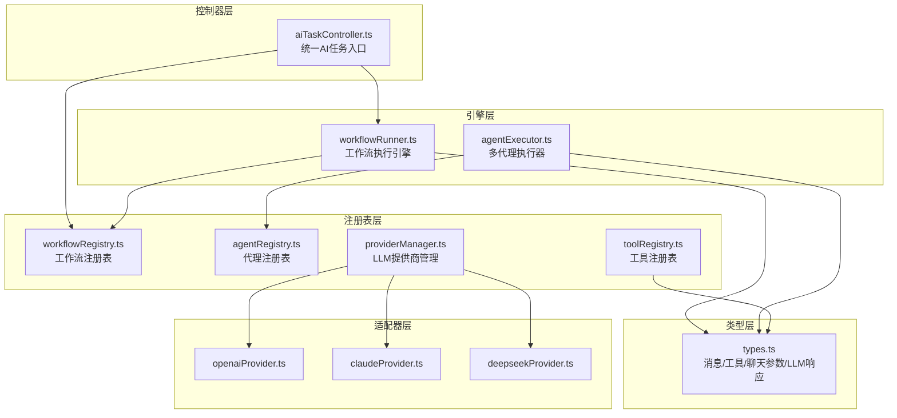
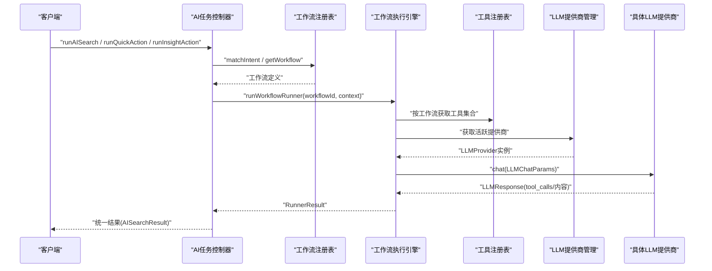
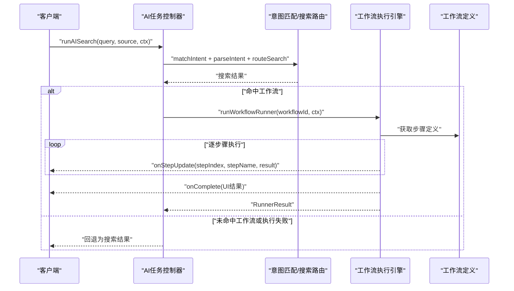
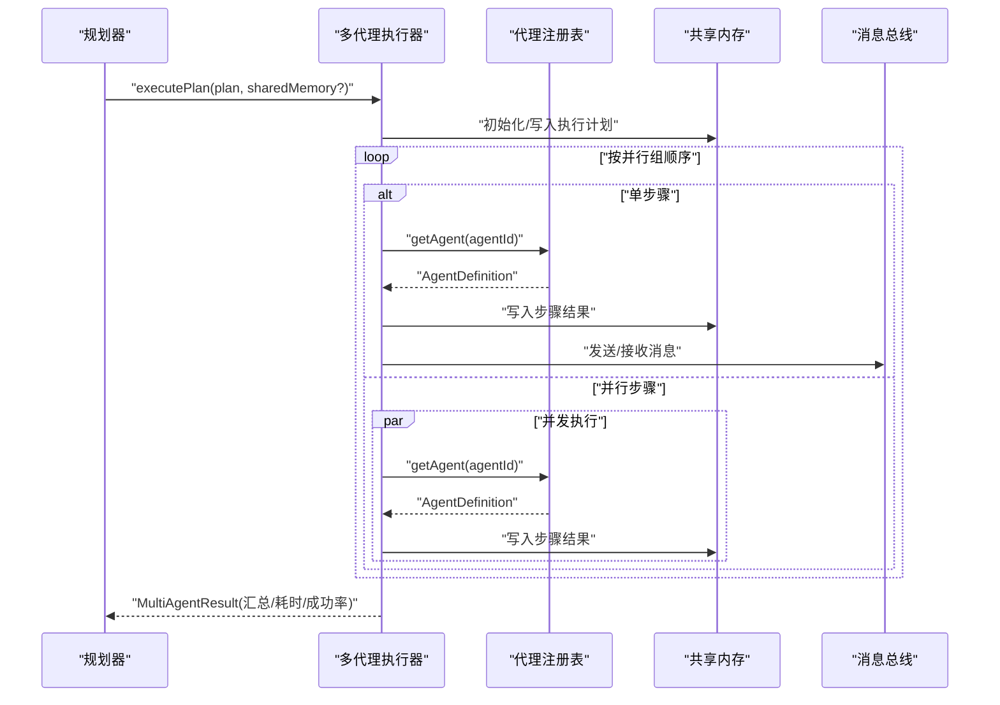
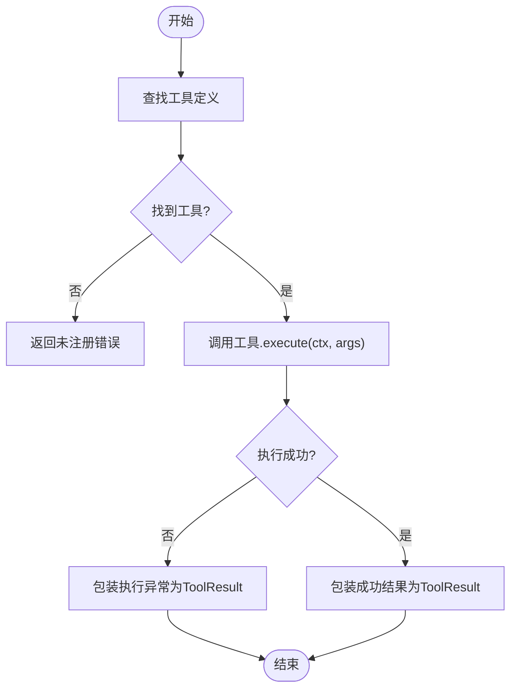
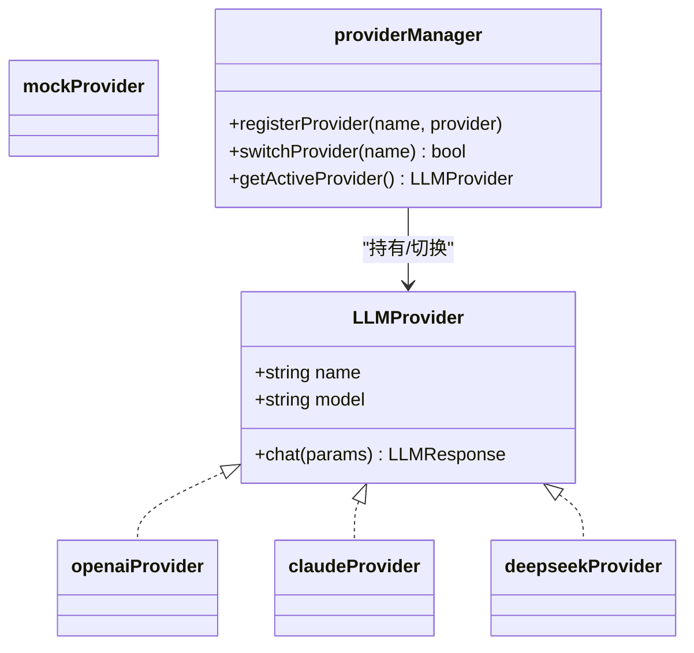
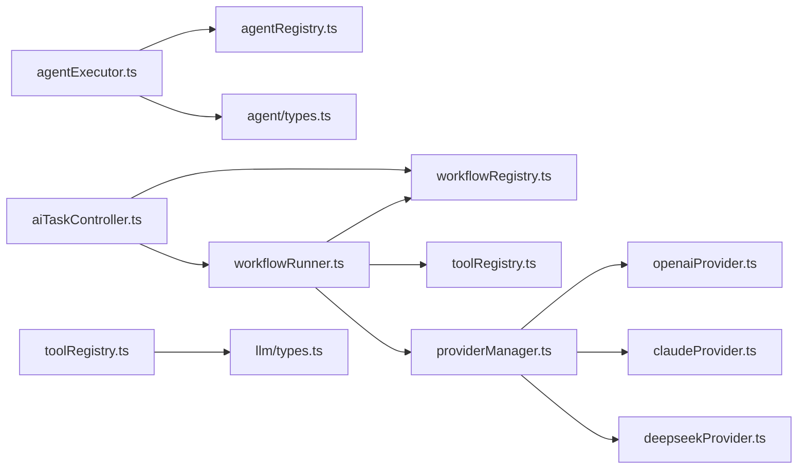

# 核心API

<cite>
**本文引用的文件**
- [src/ai/controller/aiTaskController.ts](file://src/ai/controller/aiTaskController.ts)
- [src/ai/engine/workflowRunner.ts](file://src/ai/engine/workflowRunner.ts)
- [src/ai/workflows/workflowRegistry.ts](file://src/ai/workflows/workflowRegistry.ts)
- [src/ai/workflows/workflowTypes.ts](file://src/ai/workflows/workflowTypes.ts)
- [src/ai/agent/agentExecutor.ts](file://src/ai/agent/agentExecutor.ts)
- [src/ai/agent/agentRegistry.ts](file://src/ai/agent/agentRegistry.ts)
- [src/ai/agent/types.ts](file://src/ai/agent/types.ts)
- [src/ai/tools/index.ts](file://src/ai/tools/index.ts)
- [src/ai/tools/toolRegistry.ts](file://src/ai/tools/toolRegistry.ts)
- [src/ai/tools/vocabTools.ts](file://src/ai/tools/vocabTools.ts)
- [src/ai/llm/types.ts](file://src/ai/llm/types.ts)
- [src/ai/llm/providerManager.ts](file://src/ai/llm/providerManager.ts)
- [src/ai/llm/openaiProvider.ts](file://src/ai/llm/openaiProvider.ts)
- [src/ai/llm/claudeProvider.ts](file://src/ai/llm/claudeProvider.ts)
- [src/ai/llm/deepseekProvider.ts](file://src/ai/llm/deepseekProvider.ts)
</cite>

## 目录
1. [简介](#简介)
2. [项目结构](#项目结构)
3. [核心组件](#核心组件)
4. [架构总览](#架构总览)
5. [详细组件分析](#详细组件分析)
6. [依赖关系分析](#依赖关系分析)
7. [性能考量](#性能考量)
8. [故障排查指南](#故障排查指南)
9. [结论](#结论)
10. [附录](#附录)

## 简介
本文件为小天AI教育平台的核心API文档，聚焦以下能力域：
- 工作流API：统一入口触发教学相关工作流，支持意图解析、工作流路由与执行。
- 代理API：多智能体协作执行计划，支持并行/串行/条件执行，共享内存与消息总线。
- 工具API：工具注册与LLM函数调用桥接，支持按工作流自动注入工具集合。
- LLM提供商API：统一LLM接口，适配OpenAI、Claude、DeepSeek及Mock，支持运行时切换。

文档覆盖REST风格端点规范、参数定义、响应结构、错误处理、认证方式、版本兼容性、性能指标与使用限制，并提供客户端集成指南与最佳实践。

## 项目结构
围绕“控制器-引擎-注册表-类型-适配器”的分层组织，形成清晰的职责边界：
- 控制器层：对外暴露统一的AI任务入口，封装意图解析与工作流路由。
- 引擎层：工作流执行引擎与多代理执行器，负责步骤管线与协作执行。
- 注册表层：工作流、代理、工具、LLM提供商的注册与查询。
- 类型层：统一的消息、工具、聊天参数与LLM响应结构，确保跨厂商兼容。
- 适配器层：LLM提供商适配器，屏蔽不同厂商API差异。

图表来源
- [src/ai/controller/aiTaskController.ts:1-184](file://src/ai/controller/aiTaskController.ts#L1-L184)
- [src/ai/engine/workflowRunner.ts:1-288](file://src/ai/engine/workflowRunner.ts#L1-L288)
- [src/ai/agent/agentExecutor.ts:1-165](file://src/ai/agent/agentExecutor.ts#L1-L165)
- [src/ai/workflows/workflowRegistry.ts:1-119](file://src/ai/workflows/workflowRegistry.ts#L1-L119)
- [src/ai/agent/agentRegistry.ts:1-62](file://src/ai/agent/agentRegistry.ts#L1-L62)
- [src/ai/tools/toolRegistry.ts:1-117](file://src/ai/tools/toolRegistry.ts#L1-L117)
- [src/ai/llm/providerManager.ts:1-76](file://src/ai/llm/providerManager.ts#L1-L76)
- [src/ai/llm/types.ts:1-118](file://src/ai/llm/types.ts#L1-L118)
- [src/ai/llm/openaiProvider.ts:1-196](file://src/ai/llm/openaiProvider.ts#L1-L196)
- [src/ai/llm/claudeProvider.ts:1-224](file://src/ai/llm/claudeProvider.ts#L1-L224)
- [src/ai/llm/deepseekProvider.ts:1-156](file://src/ai/llm/deepseekProvider.ts#L1-L156)

章节来源
- [src/ai/controller/aiTaskController.ts:1-184](file://src/ai/controller/aiTaskController.ts#L1-L184)
- [src/ai/engine/workflowRunner.ts:1-288](file://src/ai/engine/workflowRunner.ts#L1-L288)
- [src/ai/agent/agentExecutor.ts:1-165](file://src/ai/agent/agentExecutor.ts#L1-L165)
- [src/ai/workflows/workflowRegistry.ts:1-119](file://src/ai/workflows/workflowRegistry.ts#L1-L119)
- [src/ai/agent/agentRegistry.ts:1-62](file://src/ai/agent/agentRegistry.ts#L1-L62)
- [src/ai/tools/toolRegistry.ts:1-117](file://src/ai/tools/toolRegistry.ts#L1-L117)
- [src/ai/llm/providerManager.ts:1-76](file://src/ai/llm/providerManager.ts#L1-L76)
- [src/ai/llm/types.ts:1-118](file://src/ai/llm/types.ts#L1-L118)

## 核心组件
- 统一AI任务控制器：封装意图匹配、搜索路由与工作流执行，输出统一的搜索或工作流结果。
- 工作流执行引擎：按步骤顺序执行，支持回调通知、失败中断与最终输出构建。
- 多代理执行器：按并行组顺序执行，支持串行/并行/条件执行，共享内存与消息总线。
- 工具注册表：工具注册、执行、LLM格式转换与按工作流自动注入。
- LLM提供商管理：注册与切换不同提供商，屏蔽厂商差异，统一聊天接口。

章节来源
- [src/ai/controller/aiTaskController.ts:70-184](file://src/ai/controller/aiTaskController.ts#L70-L184)
- [src/ai/engine/workflowRunner.ts:103-288](file://src/ai/engine/workflowRunner.ts#L103-L288)
- [src/ai/agent/agentExecutor.ts:36-165](file://src/ai/agent/agentExecutor.ts#L36-L165)
- [src/ai/tools/toolRegistry.ts:14-117](file://src/ai/tools/toolRegistry.ts#L14-L117)
- [src/ai/llm/providerManager.ts:14-76](file://src/ai/llm/providerManager.ts#L14-L76)

## 架构总览
下图展示从控制器到引擎、注册表与LLM提供商的整体交互流程。

图表来源
- [src/ai/controller/aiTaskController.ts:78-118](file://src/ai/controller/aiTaskController.ts#L78-L118)
- [src/ai/workflows/workflowRegistry.ts:47-115](file://src/ai/workflows/workflowRegistry.ts#L47-L115)
- [src/ai/engine/workflowRunner.ts:103-179](file://src/ai/engine/workflowRunner.ts#L103-L179)
- [src/ai/tools/toolRegistry.ts:103-116](file://src/ai/tools/toolRegistry.ts#L103-L116)
- [src/ai/llm/providerManager.ts:48-66](file://src/ai/llm/providerManager.ts#L48-L66)
- [src/ai/llm/types.ts:105-118](file://src/ai/llm/types.ts#L105-L118)

## 详细组件分析

### 工作流API
- 功能概述：统一入口触发教学相关工作流，结合意图解析与搜索路由，优先尝试工作流执行，失败时回退到搜索结果。
- 关键类型与结构：
  - 运行上下文：包含教材、单元、年级、班级、学生人数、区域、触发查询与可选覆盖参数。
  - 运行结果：包含成功标志、工作流ID/名称/分类、步骤明细、最终输出、可调整参数、建议与人类可读消息。
  - 步骤结果：包含步骤ID、状态、数据、摘要、错误与耗时。
- 典型调用链：
  - 控制器层：runAISearch → 意图匹配 → 搜索路由 → 可选工作流执行。
  - 引擎层：runWorkflowRunner → 步骤执行 → 输出构建 → 回调通知。
- 参数与约束：
  - 必填：workflowId；可选：overrides（如数量、难度）。
  - 失败策略：任一步骤失败即中断，返回失败结果并携带错误信息。
- 性能与可观测性：
  - 步骤粒度计时，便于定位瓶颈。
  - 支持回调onStepUpdate/onComplete/onError，便于前端进度与错误处理。

图表来源
- [src/ai/controller/aiTaskController.ts:78-118](file://src/ai/controller/aiTaskController.ts#L78-L118)
- [src/ai/engine/workflowRunner.ts:103-179](file://src/ai/engine/workflowRunner.ts#L103-L179)
- [src/ai/workflows/workflowRegistry.ts:47-49](file://src/ai/workflows/workflowRegistry.ts#L47-L49)

章节来源
- [src/ai/controller/aiTaskController.ts:70-184](file://src/ai/controller/aiTaskController.ts#L70-L184)
- [src/ai/engine/workflowRunner.ts:31-179](file://src/ai/engine/workflowRunner.ts#L31-L179)
- [src/ai/workflows/workflowTypes.ts:28-164](file://src/ai/workflows/workflowTypes.ts#L28-L164)

### 代理API
- 功能概述：多智能体协作执行计划，支持按并行组顺序执行，组内并行，失败可选停止，共享内存与消息总线。
- 关键类型与结构：
  - 执行计划：包含目标、步骤、并行组、估计耗时。
  - 执行步骤：包含代理ID、任务、依赖、可选标志与优先级。
  - 执行结果：包含代理ID/名称、成功标志、输出、数据、消息与耗时。
  - 共享内存：键值存储，跨代理可见。
- 执行模式：
  - 串行：单步骤按依赖顺序执行。
  - 并行：同组内多个步骤并发执行。
  - 条件：根据前一步结果决定是否继续。
- 错误处理：
  - 非可选步骤失败即终止后续执行。
  - 记录协作总结与总耗时，便于监控与优化。

图表来源
- [src/ai/agent/agentExecutor.ts:36-106](file://src/ai/agent/agentExecutor.ts#L36-L106)
- [src/ai/agent/agentRegistry.ts:19-29](file://src/ai/agent/agentRegistry.ts#L19-L29)
- [src/ai/agent/types.ts:77-131](file://src/ai/agent/types.ts#L77-L131)

章节来源
- [src/ai/agent/agentExecutor.ts:1-165](file://src/ai/agent/agentExecutor.ts#L1-L165)
- [src/ai/agent/agentRegistry.ts:1-62](file://src/ai/agent/agentRegistry.ts#L1-L62)
- [src/ai/agent/types.ts:1-131](file://src/ai/agent/types.ts#L1-L131)

### 工具API
- 功能概述：工具注册与执行，支持将工具转换为LLM函数签名，供LLM在对话中调用，执行后回传结果。
- 关键类型与结构：
  - 工具定义：名称、描述、参数Schema（JSON Schema）、执行函数。
  - 工具执行上下文：执行所需环境与数据。
  - 工具执行结果：成功标志、数据、摘要与错误。
- 自动注入：
  - 按工作流ID自动映射所需工具集合，减少手工维护成本。
- 示例工具：
  - 获取单元词汇表、按难度/核心/中考标记筛选、生成默写试卷。

图表来源
- [src/ai/tools/toolRegistry.ts:41-65](file://src/ai/tools/toolRegistry.ts#L41-L65)
- [src/ai/tools/vocabTools.ts:10-260](file://src/ai/tools/vocabTools.ts#L10-L260)

章节来源
- [src/ai/tools/index.ts:1-20](file://src/ai/tools/index.ts#L1-L20)
- [src/ai/tools/toolRegistry.ts:1-117](file://src/ai/tools/toolRegistry.ts#L1-L117)
- [src/ai/tools/vocabTools.ts:1-260](file://src/ai/tools/vocabTools.ts#L1-L260)

### LLM提供商API
- 功能概述：统一LLM接口，适配OpenAI、Claude、DeepSeek与Mock，支持运行时切换，屏蔽厂商差异。
- 统一类型：
  - LLMMessage、LLMTool、LLMToolCall、LLMResponse、LLMChatParams、LLMProvider。
- 提供商适配：
  - OpenAI：转换为OpenAI格式，支持真实API与Mock回退。
  - Claude：转换Messages API格式，支持tool_use与tool_result转换。
  - DeepSeek：兼容OpenAI格式，仅替换Base URL与Model。
  - Mock：统一结构的本地模拟响应。
- 切换机制：
  - 通过providerManager注册与切换，无需重启。

图表来源
- [src/ai/llm/types.ts:105-118](file://src/ai/llm/types.ts#L105-L118)
- [src/ai/llm/openaiProvider.ts:89-144](file://src/ai/llm/openaiProvider.ts#L89-L144)
- [src/ai/llm/claudeProvider.ts:133-179](file://src/ai/llm/claudeProvider.ts#L133-L179)
- [src/ai/llm/deepseekProvider.ts:65-113](file://src/ai/llm/deepseekProvider.ts#L65-L113)
- [src/ai/llm/providerManager.ts:26-66](file://src/ai/llm/providerManager.ts#L26-L66)

章节来源
- [src/ai/llm/types.ts:1-118](file://src/ai/llm/types.ts#L1-L118)
- [src/ai/llm/openaiProvider.ts:1-196](file://src/ai/llm/openaiProvider.ts#L1-L196)
- [src/ai/llm/claudeProvider.ts:1-224](file://src/ai/llm/claudeProvider.ts#L1-L224)
- [src/ai/llm/deepseekProvider.ts:1-156](file://src/ai/llm/deepseekProvider.ts#L1-L156)
- [src/ai/llm/providerManager.ts:1-76](file://src/ai/llm/providerManager.ts#L1-L76)

## 依赖关系分析
- 控制器依赖工作流注册表与引擎，用于意图解析与工作流执行。
- 引擎依赖注册表（工作流与工具）、LLM提供商管理器与类型系统。
- 代理执行器依赖代理注册表与共享内存/消息总线。
- 工具注册表依赖类型系统，提供LLM函数签名转换。
- LLM提供商管理器统一管理各厂商适配器。

图表来源
- [src/ai/controller/aiTaskController.ts:8-14](file://src/ai/controller/aiTaskController.ts#L8-L14)
- [src/ai/engine/workflowRunner.ts:17-27](file://src/ai/engine/workflowRunner.ts#L17-L27)
- [src/ai/workflows/workflowRegistry.ts:1-21](file://src/ai/workflows/workflowRegistry.ts#L1-L21)
- [src/ai/agent/agentExecutor.ts:17-23](file://src/ai/agent/agentExecutor.ts#L17-L23)
- [src/ai/agent/agentRegistry.ts:8-10](file://src/ai/agent/agentRegistry.ts#L8-L10)
- [src/ai/tools/toolRegistry.ts:14-16](file://src/ai/tools/toolRegistry.ts#L14-L16)
- [src/ai/llm/providerManager.ts:19-22](file://src/ai/llm/providerManager.ts#L19-L22)
- [src/ai/llm/types.ts:4-13](file://src/ai/llm/types.ts#L4-L13)

章节来源
- [src/ai/controller/aiTaskController.ts:1-184](file://src/ai/controller/aiTaskController.ts#L1-L184)
- [src/ai/engine/workflowRunner.ts:1-288](file://src/ai/engine/workflowRunner.ts#L1-L288)
- [src/ai/agent/agentExecutor.ts:1-165](file://src/ai/agent/agentExecutor.ts#L1-L165)
- [src/ai/tools/toolRegistry.ts:1-117](file://src/ai/tools/toolRegistry.ts#L1-L117)
- [src/ai/llm/providerManager.ts:1-76](file://src/ai/llm/providerManager.ts#L1-L76)

## 性能考量
- 工作流执行：
  - 步骤粒度计时，便于定位耗时步骤。
  - 失败即停，避免无效开销。
- 代理执行：
  - 并行组内并发执行，缩短总耗时。
  - 非可选步骤失败立即停止，降低整体等待时间。
- LLM提供商：
  - 提供Mock回退，保障开发与测试稳定性。
  - 工具调用模拟与真实调用保持统一结构，便于性能对比。
- 建议：
  - 合理拆分工作流步骤，避免单步过长。
  - 利用可调整参数（如数量、难度）进行A/B评估。
  - 在生产环境配置真实API Key，避免频繁Mock回退影响体验。

## 故障排查指南
- 工作流未注册：
  - 现象：返回“未注册”错误。
  - 处理：确认workflowId正确，检查注册表是否包含对应工作流。
- 工具未注册：
  - 现象：工具执行返回“未注册”错误。
  - 处理：确认工具已注册，或检查工作流映射是否正确。
- LLM提供商未配置：
  - 现象：真实API调用失败，回退到Mock。
  - 处理：设置对应环境变量（如OPENAI_API_KEY），或显式切换提供商。
- 代理未注册：
  - 现象：执行计划中找不到Agent。
  - 处理：确认代理已注册，检查ID是否一致。
- 令牌与配额：
  - 现象：API返回错误或被限流。
  - 处理：检查API Key有效性与配额，必要时降级或缓存响应。

章节来源
- [src/ai/engine/workflowRunner.ts:110-112](file://src/ai/engine/workflowRunner.ts#L110-L112)
- [src/ai/tools/toolRegistry.ts:47-54](file://src/ai/tools/toolRegistry.ts#L47-L54)
- [src/ai/llm/openaiProvider.ts:95-98](file://src/ai/llm/openaiProvider.ts#L95-L98)
- [src/ai/llm/claudeProvider.ts:138-141](file://src/ai/llm/claudeProvider.ts#L138-L141)
- [src/ai/llm/deepseekProvider.ts:70-73](file://src/ai/llm/deepseekProvider.ts#L70-L73)
- [src/ai/agent/agentExecutor.ts:117-127](file://src/ai/agent/agentExecutor.ts#L117-L127)

## 结论
本API体系以统一类型与注册表为核心，屏蔽LLM厂商差异，提供工作流、代理、工具与LLM提供商的完整能力闭环。通过意图解析与工作流路由，实现从自然语言到教学动作的高效转化；通过多代理协作与工具函数调用，支撑复杂教学场景的自动化执行。建议在生产环境中合理配置提供商、参数与缓存策略，持续监控步骤耗时与成功率，以获得稳定且高性能的用户体验。

## 附录

### REST端点规范（概念性说明）
- 说明：当前代码库采用纯TS模块化架构，未直接暴露HTTP端点。若需对外提供REST API，可在现有控制器/引擎之上封装HTTP层，遵循如下规范。
- 统一约定：
  - 方法：GET/POST
  - 基础路径：/api/v1
  - 内容类型：application/json
  - 认证：可选（如需鉴权，建议基于请求头或Cookie）
  - 版本：/api/v1
- 端点建议（概念性）：
  - POST /api/v1/workflows/run
    - 请求体：{ workflowId, context: RunnerContext, callbacks? }
    - 响应：RunnerResult
  - POST /api/v1/agents/execute-plan
    - 请求体：{ plan: ExecutionPlan, sharedMemory? }
    - 响应：MultiAgentResult
  - POST /api/v1/tools/execute
    - 请求体：{ name, ctx, args }
    - 响应：ToolResult
  - GET /api/v1/providers
    - 响应：可用提供商列表
  - POST /api/v1/providers/switch
    - 请求体：{ name }
    - 响应：{ success: boolean, activeProvider }
- 参数校验与错误码（概念性）：
  - 400：参数缺失或格式错误
  - 401：认证失败
  - 404：工作流/代理/工具未注册
  - 500：内部错误或LLM提供商异常
- 版本兼容性：
  - 语义化版本：MAJOR.MINOR.PATCH
  - 向后兼容：新增字段/可选参数不破坏旧客户端
  - 不兼容变更：通过升级MAJOR版本并在迁移期内提供双栈支持
- 性能指标与使用限制（概念性）：
  - QPS：按提供商配额与后端资源设定
  - 延迟：P50/P95/P99步骤耗时与总耗时
  - 限流：令牌桶/滑动窗口
- 客户端集成指南（概念性）：
  - 初始化：设置基础URL与认证头
  - 超时与重试：指数退避，最大重试次数
  - 缓存：对只读数据（如工具Schema）进行短期缓存
  - 错误处理：区分网络错误、业务错误与超时
  - 最佳实践：批量请求合并、异步执行、回调驱动更新UI