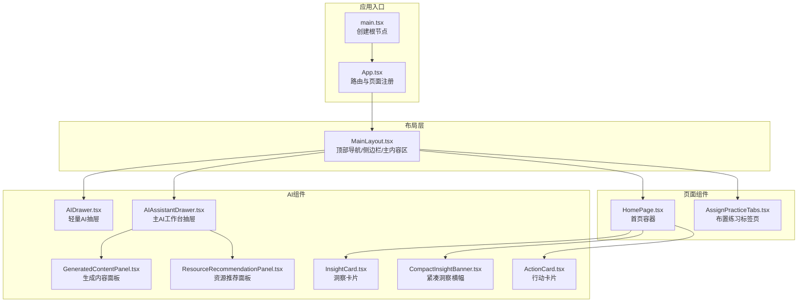
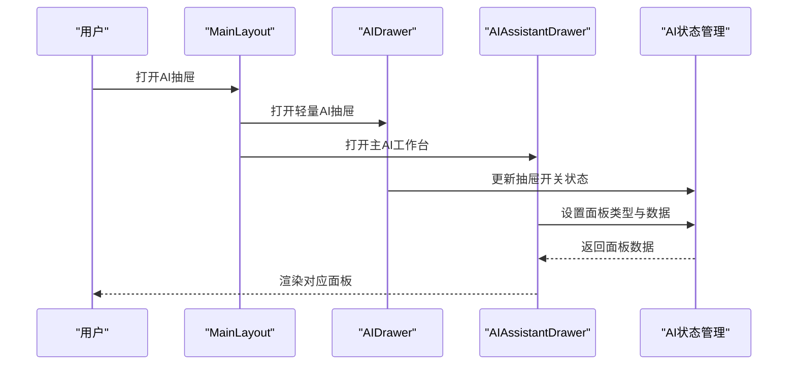
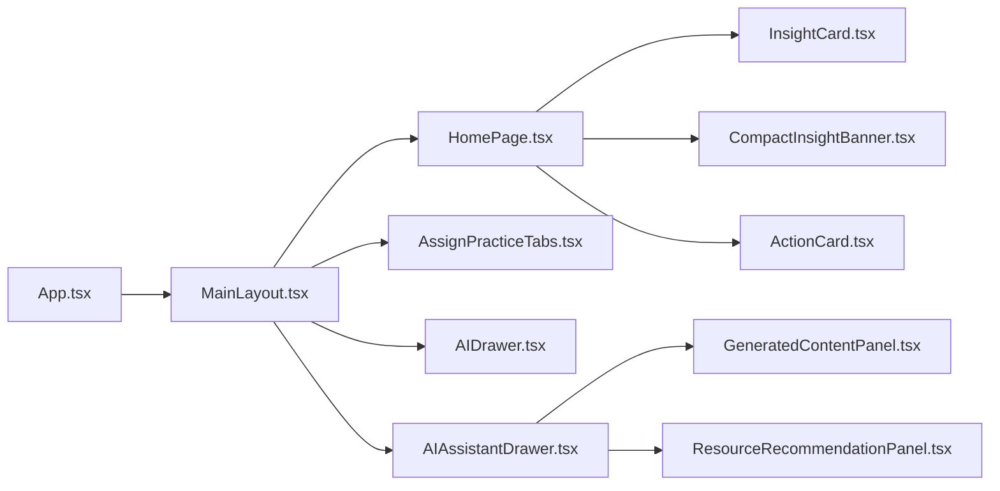

# 组件API

<cite>
**本文档引用的文件**
- [src/App.tsx](file://src/App.tsx)
- [src/main.tsx](file://src/main.tsx)
- [src/layouts/MainLayout.tsx](file://src/layouts/MainLayout.tsx)
- [src/pages/HomePage.tsx](file://src/pages/HomePage.tsx)
- [src/components/AssignPracticeTabs.tsx](file://src/components/AssignPracticeTabs.tsx)
- [src/ai/components/AIDrawer.tsx](file://src/ai/components/AIDrawer.tsx)
- [src/ai/components/AIAssistantDrawer.tsx](file://src/ai/components/AIAssistantDrawer.tsx)
- [src/ai/components/GeneratedContentPanel.tsx](file://src/ai/components/GeneratedContentPanel.tsx)
- [src/ai/components/ResourceRecommendationPanel.tsx](file://src/ai/components/ResourceRecommendationPanel.tsx)
- [src/ai/components/InsightCard.tsx](file://src/ai/components/InsightCard.tsx)
- [src/ai/components/CompactInsightBanner.tsx](file://src/ai/components/CompactInsightBanner.tsx)
- [src/ai/cards/ActionCard.tsx](file://src/ai/cards/ActionCard.tsx)
- [src/ai/cards/index.ts](file://src/ai/cards/index.ts)
- [src/ai/components/index.ts](file://src/ai/components/index.ts)
- [src/style.css](file://src/style.css)
</cite>

## 目录
1. [简介](#简介)
2. [项目结构](#项目结构)
3. [核心组件](#核心组件)
4. [架构总览](#架构总览)
5. [组件详解](#组件详解)
6. [依赖关系分析](#依赖关系分析)
7. [性能与可用性](#性能与可用性)
8. [故障排查指南](#故障排查指南)
9. [结论](#结论)
10. [附录](#附录)

## 简介
本文件面向小天AI教育平台的UI组件API，系统性梳理页面组件API、AI组件API与业务组件API的接口规范，覆盖props属性、事件处理、插槽使用、自定义选项、状态管理、生命周期钩子与渲染行为，并提供使用示例路径、交互演示流程、样式定制与主题支持、响应式设计策略、组件组合模式、无障碍与浏览器兼容性说明。

## 项目结构
- 应用入口与路由：应用通过路由注册页面组件，主布局负责导航与两个AI抽屉的挂载。
- 页面组件：如首页、布置类页面、资源与报告页面等，承担业务场景的容器职责。
- AI组件：包括轻量AI抽屉与主AI工作台抽屉，承载洞察卡片、生成内容面板、资源推荐面板等。
- 业务组件：如布置练习标签页等，聚焦具体业务流程的交互与导航。

**图表来源**
- [src/main.tsx:1-11](file://src/main.tsx#L1-L11)
- [src/App.tsx:28-63](file://src/App.tsx#L28-L63)
- [src/layouts/MainLayout.tsx:32-214](file://src/layouts/MainLayout.tsx#L32-L214)
- [src/pages/HomePage.tsx:107-464](file://src/pages/HomePage.tsx#L107-L464)
- [src/components/AssignPracticeTabs.tsx:29-63](file://src/components/AssignPracticeTabs.tsx#L29-L63)
- [src/ai/components/AIDrawer.tsx:6-40](file://src/ai/components/AIDrawer.tsx#L6-L40)
- [src/ai/components/AIAssistantDrawer.tsx:54-555](file://src/ai/components/AIAssistantDrawer.tsx#L54-L555)
- [src/ai/components/GeneratedContentPanel.tsx:40-151](file://src/ai/components/GeneratedContentPanel.tsx#L40-L151)
- [src/ai/components/ResourceRecommendationPanel.tsx:25-236](file://src/ai/components/ResourceRecommendationPanel.tsx#L25-L236)
- [src/ai/components/InsightCard.tsx:15-83](file://src/ai/components/InsightCard.tsx#L15-L83)
- [src/ai/components/CompactInsightBanner.tsx:9-33](file://src/ai/components/CompactInsightBanner.tsx#L9-L33)
- [src/ai/cards/ActionCard.tsx:11-37](file://src/ai/cards/ActionCard.tsx#L11-L37)

**章节来源**
- [src/main.tsx:1-11](file://src/main.tsx#L1-L11)
- [src/App.tsx:28-63](file://src/App.tsx#L28-L63)
- [src/layouts/MainLayout.tsx:32-214](file://src/layouts/MainLayout.tsx#L32-L214)

## 核心组件
- 页面组件API
  - 主布局：提供顶部导航、侧边栏、主内容区与两个AI抽屉的挂载点。
  - 首页：聚合布置练习、课堂教学、更多课本、小天AI搜索、教学关注与练习报告等区域。
  - 布置练习标签页：提供多种练习类型的导航与跳转。
- AI组件API
  - 轻量AI抽屉：控制抽屉开关与Esc键关闭逻辑。
  - 主AI工作台抽屉：承载多种面板（资源预览、布置确认、练习篮、洞察详情、生成内容、资源推荐、搜索结果等），并维护面板历史栈。
  - 生成内容面板：展示AI生成内容摘要、类型/难度/时长/分数等元信息，支持编辑、加入练习篮、布置给学生。
  - 资源推荐面板：支持勾选/移除/恢复资源，预览详情，批量加入练习篮与布置。
  - 洞察卡片与紧凑横幅：用于首页洞察展示与点击进入教学洞察面板。
  - 行动卡片：用于展示可执行的操作项与耗时信息。
- 业务组件API
  - 布置练习标签页：根据当前路由激活对应标签，未实现的标签给出提示。

**章节来源**
- [src/layouts/MainLayout.tsx:32-214](file://src/layouts/MainLayout.tsx#L32-L214)
- [src/pages/HomePage.tsx:107-464](file://src/pages/HomePage.tsx#L107-L464)
- [src/components/AssignPracticeTabs.tsx:29-63](file://src/components/AssignPracticeTabs.tsx#L29-L63)
- [src/ai/components/AIDrawer.tsx:6-40](file://src/ai/components/AIDrawer.tsx#L6-L40)
- [src/ai/components/AIAssistantDrawer.tsx:54-555](file://src/ai/components/AIAssistantDrawer.tsx#L54-L555)
- [src/ai/components/GeneratedContentPanel.tsx:40-151](file://src/ai/components/GeneratedContentPanel.tsx#L40-L151)
- [src/ai/components/ResourceRecommendationPanel.tsx:25-236](file://src/ai/components/ResourceRecommendationPanel.tsx#L25-L236)
- [src/ai/components/InsightCard.tsx:15-83](file://src/ai/components/InsightCard.tsx#L15-L83)
- [src/ai/components/CompactInsightBanner.tsx:9-33](file://src/ai/components/CompactInsightBanner.tsx#L9-L33)
- [src/ai/cards/ActionCard.tsx:11-37](file://src/ai/cards/ActionCard.tsx#L11-L37)

## 架构总览
- 路由与页面：App集中注册页面路由，MainLayout作为顶层布局，注入顶部导航、侧边栏与主内容区。
- AI抽屉体系：AIDrawer为轻量抽屉，AIAssistantDrawer为主工作台，二者均在MainLayout中挂载，互不冲突。
- 数据流：页面组件通过AI状态管理器触发抽屉面板切换与数据传递；AI组件内部维护面板历史栈与本地状态，同时调用业务控制器与洞察状态管理。

**图表来源**
- [src/layouts/MainLayout.tsx:208-211](file://src/layouts/MainLayout.tsx#L208-L211)
- [src/ai/components/AIDrawer.tsx:6-40](file://src/ai/components/AIDrawer.tsx#L6-L40)
- [src/ai/components/AIAssistantDrawer.tsx:54-120](file://src/ai/components/AIAssistantDrawer.tsx#L54-L120)

## 组件详解

### 页面组件API

#### 主布局 MainLayout
- 功能
  - 顶部导航栏：品牌标识、教材版本与班级选择、消息与下载、小天AI入口、窗口控制。
  - 侧边栏：导航项、更多功能下拉、返回与最小化控制。
  - 主内容区：Outlet占位，承载各页面组件。
  - AI抽屉挂载：同时挂载轻量AI抽屉与主AI工作台抽屉。
- 关键props
  - 无显式props，通过路由与状态管理驱动渲染。
- 生命周期
  - 初始化：绑定移动端侧边栏开关状态。
  - 交互：点击菜单项切换侧边栏；点击“更多功能”展开/收起下拉。
- 渲染行为
  - 使用条件类名控制侧边栏显示/隐藏；根据当前路由高亮导航项。
- 无障碍与响应式
  - 使用语义化按钮与标题；移动端侧边栏采用覆盖层遮罩，提升可触达性。
  - 响应式布局：大屏固定侧边栏，小屏抽屉模式。

**章节来源**
- [src/layouts/MainLayout.tsx:32-214](file://src/layouts/MainLayout.tsx#L32-L214)

#### 首页 HomePage
- 功能
  - 布置练习：九宫格按钮，支持同步、专项、模拟、趣味配音、时文阅读、主题视频、课后PK、选题组卷、试卷/答题卡、自定义批改。
  - 课堂教学：四个教学模块卡片，点击进入对应路由。
  - 更多课本：横向滚动卡片，支持左右滑动。
  - 小天AI：输入框与发送按钮，支持快捷意图匹配与工作流执行。
  - 教学关注：首页洞察卡片集合，点击进入教学洞察面板。
  - 练习报告：最近练习列表，支持一键催、全屏讲解、查看报告。
- 关键props
  - 无显式props，通过AI状态管理器与路由控制。
- 生命周期
  - 初始化：订阅教师上下文，准备工作流运行状态。
  - 交互：输入查询、点击按钮、滑动查看更多课本。
- 渲染行为
  - 使用网格布局与响应式列数；洞察卡片按风险等级着色；报告列表支持新标记与状态按钮。
- 无障碍与响应式
  - 按钮具备焦点可见性；滚动区域提供滚动条样式覆盖。

**章节来源**
- [src/pages/HomePage.tsx:107-464](file://src/pages/HomePage.tsx#L107-L464)

#### 布置练习标签页 AssignPracticeTabs
- 功能
  - 提供九个布置练习标签，点击切换至对应路由。
  - 未实现标签给出提示。
- 关键props
  - 无显式props，内部维护标签配置与实现集合。
- 生命周期
  - 初始化：解析当前路由映射到活动标签。
  - 交互：点击标签触发导航或提示。
- 渲染行为
  - 活动标签底部有强调线；未实现标签禁用导航并弹出提示。

**章节来源**
- [src/components/AssignPracticeTabs.tsx:29-63](file://src/components/AssignPracticeTabs.tsx#L29-L63)

### AI组件API

#### 轻量AI抽屉 AIDrawer
- 功能
  - 控制右侧AI抽屉的打开/关闭。
  - 支持Esc键关闭。
- 关键props
  - 无显式props，通过状态管理器读取抽屉开关与关闭方法。
- 生命周期
  - 初始化：监听键盘事件，Esc关闭抽屉。
  - 卸载：移除键盘事件监听。
- 渲染行为
  - 背景遮罩与抽屉面板分离渲染；抽屉宽度与过渡动画可控。

**章节来源**
- [src/ai/components/AIDrawer.tsx:6-40](file://src/ai/components/AIDrawer.tsx#L6-L40)

#### 主AI工作台抽屉 AIAssistantDrawer
- 功能
  - 承载多种面板：资源预览、布置确认、练习篮、制卡确认、词表编辑、洞察详情、错词学生列表、范文预览、生成内容、生成内容编辑、资源推荐、资源详情预览、搜索结果、错词复习规划、阶段练习洞察、词汇掌握洞察、听说能力洞察、写作表现洞察、AI搜索结果、待发布作业确认、布置成功等。
  - 维护面板历史栈：打开子面板时压栈，返回时出栈。
  - 支持Esc键关闭抽屉。
- 关键props
  - 无显式props，通过状态管理器读取当前面板类型与数据。
- 生命周期
  - 初始化：监听键盘事件，Esc关闭抽屉。
  - 面板切换：assignmentConfirm初始化表单；面包屑返回栈处理。
  - 卸载：移除键盘事件监听。
- 渲染行为
  - 根据面板类型渲染不同视图；支持嵌套子面板与返回；支持Toast提示。

**章节来源**
- [src/ai/components/AIAssistantDrawer.tsx:54-555](file://src/ai/components/AIAssistantDrawer.tsx#L54-L555)

#### 生成内容面板 GeneratedContentPanel
- 功能
  - 展示AI生成内容的标题、类型、难度、时长、分数等元信息。
  - 支持编辑、加入练习篮、布置给学生三种操作。
- 关键props
  - content: GeneratedContent（必填）
  - onEdit(): void（必填）
  - onAddToBasket(): void（必填）
  - onAssign(): void（必填）
- 事件处理
  - 编辑：调用onEdit回调。
  - 加入练习篮：调用onAddToBasket回调。
  - 布置给学生：调用onAssign回调。
- 插槽与自定义
  - 无插槽；通过props传入回调实现行为定制。
- 渲染行为
  - 根据内容类型渲染不同细节块（如题型配置、讲评要点、范文亮点等）。

**章节来源**
- [src/ai/components/GeneratedContentPanel.tsx:40-151](file://src/ai/components/GeneratedContentPanel.tsx#L40-L151)

#### 资源推荐面板 ResourceRecommendationPanel
- 功能
  - 展示基于洞察的推荐资源列表，支持勾选、移除、恢复、预览、加入练习篮、布置。
- 关键props
  - actionLabel: string（必填）
  - query: string（必填）
  - actionId: string（必填）
  - insightTitle?: string
  - onPreview(resource): void（必填）
  - onAssign(resources): void（必填）
  - onBack?(): void
- 事件处理
  - 勾选/取消：toggle(id)
  - 移除：removeResource(id)
  - 恢复：restoreResource(id)
  - 加入练习篮：handleAddSelectedToBasket()
  - 布置：handleAssignSelected()
- 插槽与自定义
  - 无插槽；通过props传入回调实现行为定制。
- 渲染行为
  - 可见与已移除资源分组展示；底部工具栏显示已选数量与操作按钮。

**章节来源**
- [src/ai/components/ResourceRecommendationPanel.tsx:25-236](file://src/ai/components/ResourceRecommendationPanel.tsx#L25-L236)

#### 洞察卡片 InsightCard
- 功能
  - 展示首页洞察卡片，包含风险等级徽标、标题、证据摘要与“查看分析”按钮。
- 关键props
  - insight: InsightItem（必填）
  - onClick(insight): void（必填）
- 事件处理
  - 点击卡片：调用onClick回调。
- 插槽与自定义
  - 无插槽；通过onClick回调实现行为定制。
- 渲染行为
  - 根据风险等级动态设置边框颜色、背景色与徽标文本；对考试提醒模块特殊处理。

**章节来源**
- [src/ai/components/InsightCard.tsx:15-83](file://src/ai/components/InsightCard.tsx#L15-L83)

#### 紧凑洞察横幅 CompactInsightBanner
- 功能
  - 展示紧凑形式的洞察横幅，包含风险等级徽标与标题，支持点击进入详情。
- 关键props
  - insight: InsightItem（必填）
  - onClick(insight): void（必填）
- 事件处理
  - 点击横幅：调用onClick回调。
- 插槽与自定义
  - 无插槽；通过onClick回调实现行为定制。
- 渲染行为
  - 根据风险等级动态设置背景、边框与徽标颜色。

**章节来源**
- [src/ai/components/CompactInsightBanner.tsx:9-33](file://src/ai/components/CompactInsightBanner.tsx#L9-L33)

#### 行动卡片 ActionCard
- 功能
  - 展示可执行的行动项，包含标题、描述、耗时与类型标签。
- 关键props
  - title: string（必填）
  - description: string（必填）
  - time: string（必填）
  - type: string（必填）
  - onClick?(): void
- 事件处理
  - 点击卡片：调用onClick回调。
- 插槽与自定义
  - 无插槽；通过onClick回调实现行为定制。
- 渲染行为
  - 卡片左上角图标与类型标签；描述支持两行省略；时间以小图标展示。

**章节来源**
- [src/ai/cards/ActionCard.tsx:11-37](file://src/ai/cards/ActionCard.tsx#L11-L37)

### 业务组件API

#### 布置练习标签页 AssignPracticeTabs
- 功能
  - 提供九个布置练习标签，点击切换至对应路由。
  - 未实现标签给出提示。
- 关键props
  - 无显式props，内部维护标签配置与实现集合。
- 生命周期
  - 初始化：解析当前路由映射到活动标签。
  - 交互：点击标签触发导航或提示。
- 渲染行为
  - 活动标签底部有强调线；未实现标签禁用导航并弹出提示。

**章节来源**
- [src/components/AssignPracticeTabs.tsx:29-63](file://src/components/AssignPracticeTabs.tsx#L29-L63)

## 依赖关系分析

**图表来源**
- [src/App.tsx:28-63](file://src/App.tsx#L28-L63)
- [src/layouts/MainLayout.tsx:208-211](file://src/layouts/MainLayout.tsx#L208-L211)
- [src/pages/HomePage.tsx:107-464](file://src/pages/HomePage.tsx#L107-L464)
- [src/components/AssignPracticeTabs.tsx:29-63](file://src/components/AssignPracticeTabs.tsx#L29-L63)
- [src/ai/components/AIDrawer.tsx:6-40](file://src/ai/components/AIDrawer.tsx#L6-L40)
- [src/ai/components/AIAssistantDrawer.tsx:54-555](file://src/ai/components/AIAssistantDrawer.tsx#L54-L555)
- [src/ai/components/GeneratedContentPanel.tsx:40-151](file://src/ai/components/GeneratedContentPanel.tsx#L40-L151)
- [src/ai/components/ResourceRecommendationPanel.tsx:25-236](file://src/ai/components/ResourceRecommendationPanel.tsx#L25-L236)
- [src/ai/components/InsightCard.tsx:15-83](file://src/ai/components/InsightCard.tsx#L15-L83)
- [src/ai/components/CompactInsightBanner.tsx:9-33](file://src/ai/components/CompactInsightBanner.tsx#L9-L33)
- [src/ai/cards/ActionCard.tsx:11-37](file://src/ai/cards/ActionCard.tsx#L11-L37)

**章节来源**
- [src/App.tsx:28-63](file://src/App.tsx#L28-L63)
- [src/layouts/MainLayout.tsx:208-211](file://src/layouts/MainLayout.tsx#L208-L211)

## 性能与可用性
- 性能优化建议
  - 抽屉面板懒加载：仅在打开时渲染对应面板，减少初始渲染压力。
  - 面板历史栈：避免重复渲染相同面板，合理使用栈顶替换。
  - 列表虚拟化：首页洞察与报告列表可考虑虚拟滚动以提升大数据量场景下的渲染性能。
  - 图标与样式：统一使用轻量图标库，避免重复引入导致包体膨胀。
- 无障碍支持
  - 按钮具备明确的可访问名称与键盘可达性；滚动区域提供可见滚动条。
  - 对话框与遮罩：确保焦点陷阱与Esc关闭机制符合ARIA最佳实践。
- 浏览器兼容性
  - 使用现代CSS特性与PostCSS/Tailwind，确保主流桌面端浏览器兼容；移动端抽屉模式提供降级体验。

[本节为通用指导，无需特定文件引用]

## 故障排查指南
- 抽屉无法关闭
  - 检查Esc事件是否被其他元素拦截；确认键盘事件监听在组件挂载时正确绑定、卸载时清理。
- 面板数据为空
  - 检查状态管理器中的面板数据是否正确设置；确认面板类型与数据结构一致。
- 资源推荐面板无数据
  - 确认mock数据函数返回值；检查资源移除/恢复逻辑是否影响可见列表。
- 布置确认表单异常
  - 检查默认表单初始化逻辑；确认表单字段与状态同步。

**章节来源**
- [src/ai/components/AIDrawer.tsx:10-17](file://src/ai/components/AIDrawer.tsx#L10-L17)
- [src/ai/components/AIAssistantDrawer.tsx:74-82](file://src/ai/components/AIAssistantDrawer.tsx#L74-L82)
- [src/ai/components/ResourceRecommendationPanel.tsx:25-236](file://src/ai/components/ResourceRecommendationPanel.tsx#L25-L236)

## 结论
本文件系统梳理了小天AI教育平台的页面组件、AI组件与业务组件的API规范，明确了props、事件、插槽与自定义选项，给出了状态管理与生命周期要点，并提供了交互流程、样式与响应式策略、组合模式与性能优化建议。建议在实际开发中遵循统一的事件回调约定与状态管理模式，确保组件间的协作稳定与可维护性。

[本节为总结，无需特定文件引用]

## 附录

### 组件导出清单
- AI组件导出
  - [src/ai/components/index.ts:1-2](file://src/ai/components/index.ts#L1-L2)
- AI卡片导出
  - [src/ai/cards/index.ts:1-6](file://src/ai/cards/index.ts#L1-L6)

### 样式与主题
- 样式基础
  - [src/style.css:1-2](file://src/style.css#L1-L2)
- 设计要点
  - 使用Tailwind类名进行主题化与响应式布局；颜色与尺寸通过变量或类名控制，便于主题切换。

**章节来源**
- [src/ai/components/index.ts:1-2](file://src/ai/components/index.ts#L1-L2)
- [src/ai/cards/index.ts:1-6](file://src/ai/cards/index.ts#L1-L6)
- [src/style.css:1-2](file://src/style.css#L1-L2)