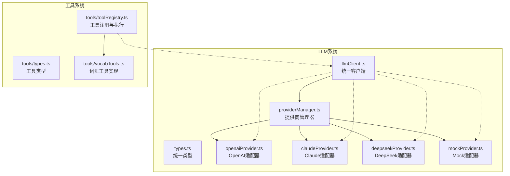
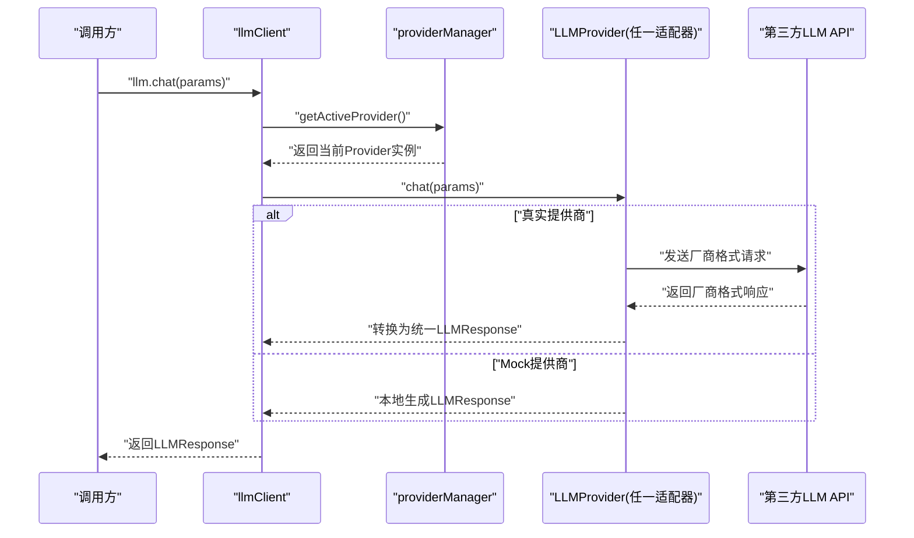
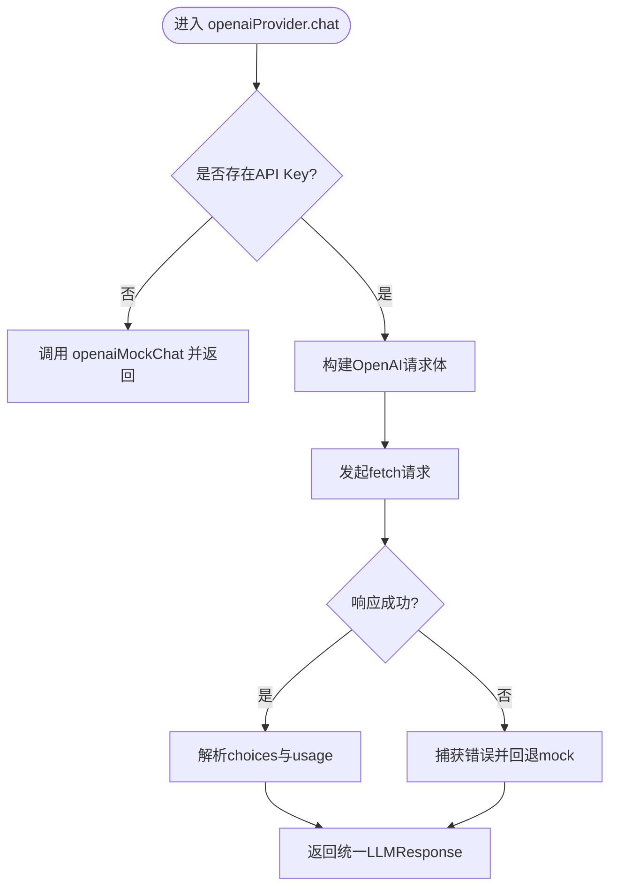
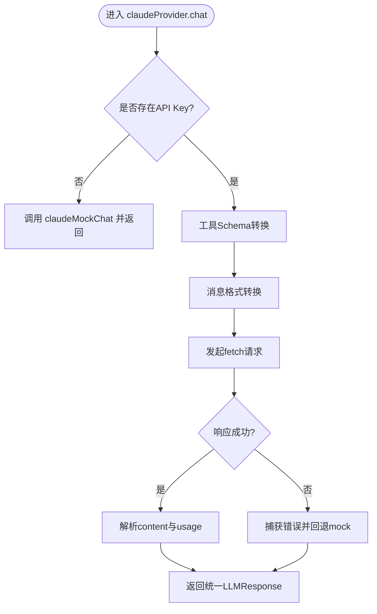
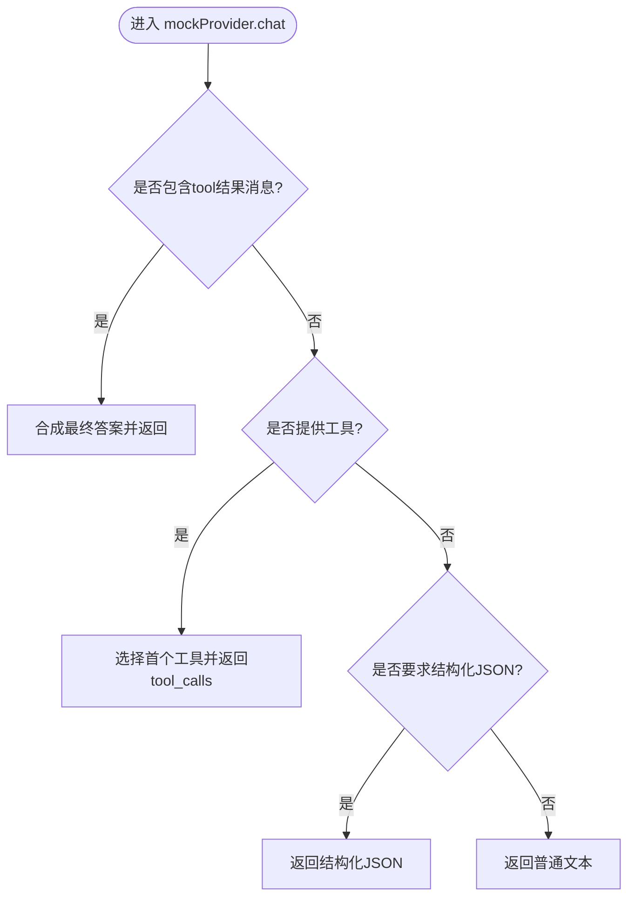
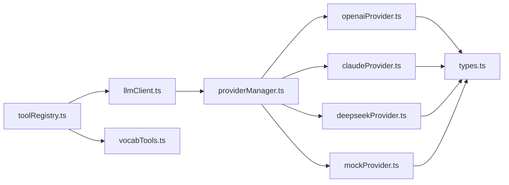

# LLM提供商系统

<cite>
**本文引用的文件**
- [src/ai/llm/index.ts](file://src/ai/llm/index.ts)
- [src/ai/llm/llmClient.ts](file://src/ai/llm/llmClient.ts)
- [src/ai/llm/providerManager.ts](file://src/ai/llm/providerManager.ts)
- [src/ai/llm/types.ts](file://src/ai/llm/types.ts)
- [src/ai/llm/openaiProvider.ts](file://src/ai/llm/openaiProvider.ts)
- [src/ai/llm/claudeProvider.ts](file://src/ai/llm/claudeProvider.ts)
- [src/ai/llm/deepseekProvider.ts](file://src/ai/llm/deepseekProvider.ts)
- [src/ai/llm/mockProvider.ts](file://src/ai/llm/mockProvider.ts)
- [src/ai/tools/types.ts](file://src/ai/tools/types.ts)
- [src/ai/tools/toolRegistry.ts](file://src/ai/tools/toolRegistry.ts)
- [src/ai/tools/vocabTools.ts](file://src/ai/tools/vocabTools.ts)
</cite>

## 目录
1. [简介](#简介)
2. [项目结构](#项目结构)
3. [核心组件](#核心组件)
4. [架构总览](#架构总览)
5. [详细组件分析](#详细组件分析)
6. [依赖关系分析](#依赖关系分析)
7. [性能考量](#性能考量)
8. [故障排查指南](#故障排查指南)
9. [结论](#结论)
10. [附录](#附录)

## 简介
本文件面向小天AI教育平台的LLM提供商系统，系统通过“统一接口 + 适配器 + 管理器”的三层设计，屏蔽不同大模型厂商（如OpenAI、Claude、DeepSeek）的协议差异，向上层提供一致的聊天接口与工具调用能力。核心目标包括：
- 提供统一的LLM消息、工具定义与响应模型，确保跨厂商兼容
- 通过提供商管理器实现提供商的注册、切换与状态查询
- 通过LLM客户端封装统一入口，简化上层调用
- 为每个提供商提供独立的适配器，负责格式转换与错误回退
- 提供Mock提供商用于开发与测试，保障端到端链路可跑通

## 项目结构
LLM系统位于src/ai/llm目录，核心文件如下：
- types.ts：统一的消息、工具、响应与聊天参数类型
- providerManager.ts：提供商注册与切换中心
- llmClient.ts：统一客户端入口，自动注册提供商
- openaiProvider.ts、claudeProvider.ts、deepseekProvider.ts、mockProvider.ts：各厂商适配器
- tools子系统：工具定义、注册与执行，支撑工具调用链路

图表来源
- [src/ai/llm/llmClient.ts:1-78](file://src/ai/llm/llmClient.ts#L1-L78)
- [src/ai/llm/providerManager.ts:1-76](file://src/ai/llm/providerManager.ts#L1-L76)
- [src/ai/llm/openaiProvider.ts:1-196](file://src/ai/llm/openaiProvider.ts#L1-L196)
- [src/ai/llm/claudeProvider.ts:1-224](file://src/ai/llm/claudeProvider.ts#L1-L224)
- [src/ai/llm/deepseekProvider.ts:1-156](file://src/ai/llm/deepseekProvider.ts#L1-L156)
- [src/ai/llm/mockProvider.ts:1-246](file://src/ai/llm/mockProvider.ts#L1-L246)
- [src/ai/tools/toolRegistry.ts:1-117](file://src/ai/tools/toolRegistry.ts#L1-L117)
- [src/ai/tools/vocabTools.ts:1-260](file://src/ai/tools/vocabTools.ts#L1-L260)

章节来源
- [src/ai/llm/index.ts:1-39](file://src/ai/llm/index.ts#L1-L39)
- [src/ai/llm/llmClient.ts:1-78](file://src/ai/llm/llmClient.ts#L1-L78)
- [src/ai/llm/providerManager.ts:1-76](file://src/ai/llm/providerManager.ts#L1-L76)

## 核心组件
- 统一类型体系（types.ts）
  - LLMMessage：角色、内容、工具调用元信息
  - LLMTool/LLMToolParameters/LLMToolProperty：跨厂商工具定义
  - LLMToolCall：工具调用请求体
  - LLMResponse/LLMUsage：统一响应与用量
  - LLMChatParams：统一聊天参数（系统提示、消息、工具、温度、最大token、工具选择、结构化输出）
  - LLMProvider：统一提供商接口（name、model、chat）

- 提供商管理器（providerManager.ts）
  - 注册：registerProvider(name, provider)
  - 切换：switchProvider(name)
  - 查询：getActiveProvider/getActiveProviderName/getActiveProviderInfo/getRegisteredProviders
  - 默认注册：mockProvider始终可用

- LLM客户端（llmClient.ts）
  - 自动注册：导入各适配器文件触发注册
  - 统一API：llm.chat / llm.switchProvider / llm.getProviderInfo / llm.listProviders / llm.registerProvider

- 适配器（openaiProvider.ts、claudeProvider.ts、deepseekProvider.ts、mockProvider.ts）
  - OpenAI：将统一参数转换为OpenAI格式，解析OpenAI响应
  - Claude：处理system分离、tool_use与tool_result格式转换
  - DeepSeek：兼容OpenAI格式，仅替换endpoint与model
  - Mock：模拟工具调用与最终回答，支持无API键开发

章节来源
- [src/ai/llm/types.ts:1-118](file://src/ai/llm/types.ts#L1-L118)
- [src/ai/llm/providerManager.ts:1-76](file://src/ai/llm/providerManager.ts#L1-L76)
- [src/ai/llm/llmClient.ts:1-78](file://src/ai/llm/llmClient.ts#L1-L78)
- [src/ai/llm/openaiProvider.ts:1-196](file://src/ai/llm/openaiProvider.ts#L1-L196)
- [src/ai/llm/claudeProvider.ts:1-224](file://src/ai/llm/claudeProvider.ts#L1-L224)
- [src/ai/llm/deepseekProvider.ts:1-156](file://src/ai/llm/deepseekProvider.ts#L1-L156)
- [src/ai/llm/mockProvider.ts:1-246](file://src/ai/llm/mockProvider.ts#L1-L246)

## 架构总览
系统采用“统一接口 + 适配器 + 管理器”三层架构：
- 类型层：定义跨厂商统一的数据结构
- 管理层：集中注册与切换提供商，屏蔽具体实现
- 客户端层：向上暴露统一API，向下委托给当前活跃提供商
- 适配器层：负责将统一参数转为厂商API格式，并将厂商响应转为统一格式

图表来源
- [src/ai/llm/llmClient.ts:29-35](file://src/ai/llm/llmClient.ts#L29-L35)
- [src/ai/llm/providerManager.ts:48-50](file://src/ai/llm/providerManager.ts#L48-L50)
- [src/ai/llm/openaiProvider.ts:93-143](file://src/ai/llm/openaiProvider.ts#L93-L143)
- [src/ai/llm/claudeProvider.ts:137-178](file://src/ai/llm/claudeProvider.ts#L137-L178)
- [src/ai/llm/deepseekProvider.ts:69-112](file://src/ai/llm/deepseekProvider.ts#L69-L112)
- [src/ai/llm/mockProvider.ts:27-47](file://src/ai/llm/mockProvider.ts#L27-L47)

## 详细组件分析

### 统一类型与接口（types.ts）
- 设计要点
  - 与OpenAI函数调用schema对齐，确保跨厂商兼容
  - LLMChatParams支持工具调用、温度、最大token、结构化输出等关键参数
  - LLMProvider接口最小化，仅包含name、model与chat方法
- 数据结构复杂度
  - 工具定义为对象Schema，参数为嵌套属性，构建与序列化开销低
  - 消息与工具调用数组线性增长，适配器转换为O(n)

章节来源
- [src/ai/llm/types.ts:4-118](file://src/ai/llm/types.ts#L4-L118)

### 提供商管理器（providerManager.ts）
- 注册与查询
  - 使用Map存储提供商，支持动态注册与枚举
  - 默认激活mockProvider，确保无配置时可用
- 切换机制
  - 通过名称查找提供商，不存在则警告并返回false
  - 成功切换后记录名称与实例，日志提示当前模型
- 架构意义
  - 上层完全无感知，可按需热切换，便于A/B测试与灰度发布

章节来源
- [src/ai/llm/providerManager.ts:1-76](file://src/ai/llm/providerManager.ts#L1-L76)

### LLM客户端（llmClient.ts）
- 自动注册
  - 导入各适配器文件触发registerProvider，无需手动import
- 统一API
  - chat：转发至当前活跃提供商
  - switchLLMProvider：委托管理器切换
  - getLLMProviderInfo/listProviders/registerLLMProvider：查询与扩展

章节来源
- [src/ai/llm/llmClient.ts:1-78](file://src/ai/llm/llmClient.ts#L1-L78)

### OpenAI适配器（openaiProvider.ts）
- 配置与回退
  - 读取环境变量API Key，未配置时回退到本地mock
- 参数转换
  - 工具：统一格式转OpenAI function schema
  - 消息：保留tool_calls、tool_call_id、name字段
- 响应转换
  - 提取content与tool_calls，映射usage字段
- 错误处理
  - API失败时记录错误并回退mock

图表来源
- [src/ai/llm/openaiProvider.ts:93-143](file://src/ai/llm/openaiProvider.ts#L93-L143)
- [src/ai/llm/openaiProvider.ts:149-187](file://src/ai/llm/openaiProvider.ts#L149-L187)

章节来源
- [src/ai/llm/openaiProvider.ts:1-196](file://src/ai/llm/openaiProvider.ts#L1-L196)

### Claude适配器（claudeProvider.ts）
- 差异点
  - system为顶层参数，非消息角色
  - 工具调用使用tool_use块，工具结果使用tool_result块
- 转换逻辑
  - 工具：统一参数转input_schema
  - 消息：assistant-tool_calls → tool_use；tool→user-tool_result
  - 响应：text块提取content，tool_use块提取tool_calls
- 错误处理
  - API失败时回退mock

图表来源
- [src/ai/llm/claudeProvider.ts:137-178](file://src/ai/llm/claudeProvider.ts#L137-L178)
- [src/ai/llm/claudeProvider.ts:183-217](file://src/ai/llm/claudeProvider.ts#L183-L217)

章节来源
- [src/ai/llm/claudeProvider.ts:1-224](file://src/ai/llm/claudeProvider.ts#L1-L224)

### DeepSeek适配器（deepseekProvider.ts）
- 设计策略
  - 与OpenAI兼容，复用OpenAI转换逻辑，仅替换endpoint与model
- 错误处理
  - API失败时回退mock

章节来源
- [src/ai/llm/deepseekProvider.ts:1-156](file://src/ai/llm/deepseekProvider.ts#L1-L156)

### Mock适配器（mockProvider.ts）
- 功能特性
  - 首次调用且含工具：返回tool_calls（模拟LLM意图识别）
  - 收到tool结果后：返回自然语言最终答案
  - 支持结构化JSON输出与纯文本
- 价值
  - 保障端到端链路在开发阶段可运行
  - 支持工具调用的完整循环（调用→执行→回传→回答）

图表来源
- [src/ai/llm/mockProvider.ts:27-47](file://src/ai/llm/mockProvider.ts#L27-L47)
- [src/ai/llm/mockProvider.ts:155-174](file://src/ai/llm/mockProvider.ts#L155-L174)
- [src/ai/llm/mockProvider.ts:219-241](file://src/ai/llm/mockProvider.ts#L219-L241)

章节来源
- [src/ai/llm/mockProvider.ts:1-246](file://src/ai/llm/mockProvider.ts#L1-L246)

### 工具系统（tools）
- 类型与注册
  - ToolDefinition与ToolParameters对齐LLMTool，便于直接映射
  - ToolRegistry集中注册、查询与执行，支持按workflow自动映射
- 词汇工具（vocabTools）
  - get_unit_vocabulary：按单元/年级/教材版本获取词汇
  - filter_difficulty：按难度/核心/中考标记筛选
  - generate_dictation：按模式生成默写试卷
- 与LLM链路
  - 工具注册后自动注入LLM聊天参数，LLM返回tool_calls后由工具系统执行并回传

章节来源
- [src/ai/tools/types.ts:1-60](file://src/ai/tools/types.ts#L1-L60)
- [src/ai/tools/toolRegistry.ts:1-117](file://src/ai/tools/toolRegistry.ts#L1-L117)
- [src/ai/tools/vocabTools.ts:1-260](file://src/ai/tools/vocabTools.ts#L1-L260)

## 依赖关系分析
- 模块耦合
  - llmClient依赖providerManager，间接依赖各适配器
  - 适配器依赖types与providerManager（注册）
  - 工具系统独立于LLM，通过toolRegistry桥接LLM工具参数
- 外部依赖
  - fetch调用第三方LLM API
  - 环境变量读取API Key
- 循环依赖
  - 无直接循环；适配器通过注册函数向管理器注册自身

图表来源
- [src/ai/llm/llmClient.ts:12-19](file://src/ai/llm/llmClient.ts#L12-L19)
- [src/ai/llm/providerManager.ts:14-22](file://src/ai/llm/providerManager.ts#L14-L22)
- [src/ai/llm/openaiProvider.ts:15-16](file://src/ai/llm/openaiProvider.ts#L15-L16)
- [src/ai/llm/claudeProvider.ts:16-17](file://src/ai/llm/claudeProvider.ts#L16-L17)
- [src/ai/llm/deepseekProvider.ts:15-16](file://src/ai/llm/deepseekProvider.ts#L15-L16)
- [src/ai/llm/mockProvider.ts](file://src/ai/llm/mockProvider.ts#L12)
- [src/ai/tools/toolRegistry.ts:14-16](file://src/ai/tools/toolRegistry.ts#L14-L16)
- [src/ai/tools/vocabTools.ts:1-5](file://src/ai/tools/vocabTools.ts#L1-L5)

章节来源
- [src/ai/llm/llmClient.ts:1-78](file://src/ai/llm/llmClient.ts#L1-L78)
- [src/ai/llm/providerManager.ts:1-76](file://src/ai/llm/providerManager.ts#L1-L76)
- [src/ai/llm/openaiProvider.ts:1-196](file://src/ai/llm/openaiProvider.ts#L1-L196)
- [src/ai/llm/claudeProvider.ts:1-224](file://src/ai/llm/claudeProvider.ts#L1-L224)
- [src/ai/llm/deepseekProvider.ts:1-156](file://src/ai/llm/deepseekProvider.ts#L1-L156)
- [src/ai/llm/mockProvider.ts:1-246](file://src/ai/llm/mockProvider.ts#L1-L246)
- [src/ai/tools/toolRegistry.ts:1-117](file://src/ai/tools/toolRegistry.ts#L1-L117)
- [src/ai/tools/vocabTools.ts:1-260](file://src/ai/tools/vocabTools.ts#L1-L260)

## 性能考量
- 请求延迟
  - 适配器均通过fetch调用远程API，网络延迟为主要瓶颈
  - Mock模式用于开发与测试，避免外部依赖
- 资源消耗
  - 工具调用链路涉及多次往返：LLM→工具→LLM→回答
  - 建议在工具执行前进行参数校验与缓存，减少无效调用
- Token成本
  - 统一响应包含prompt/completion/total token，便于成本统计
  - 建议在上层记录与展示，辅助优化prompt与maxTokens

## 故障排查指南
- Provider未找到
  - 现象：切换Provider返回false并告警
  - 排查：确认已正确注册或环境变量配置
- API Key缺失
  - 现象：真实提供商回退到mock
  - 排查：检查环境变量是否正确设置
- API调用失败
  - 现象：控制台输出错误并回退mock
  - 排查：检查网络、Key有效性与服务可用性
- 工具调用异常
  - 现象：工具执行失败或未注册
  - 排查：确认工具已在toolRegistry注册，参数Schema与调用一致

章节来源
- [src/ai/llm/providerManager.ts:36-46](file://src/ai/llm/providerManager.ts#L36-L46)
- [src/ai/llm/openaiProvider.ts:95-98](file://src/ai/llm/openaiProvider.ts#L95-L98)
- [src/ai/llm/claudeProvider.ts:138-141](file://src/ai/llm/claudeProvider.ts#L138-L141)
- [src/ai/llm/deepseekProvider.ts:70-73](file://src/ai/llm/deepseekProvider.ts#L70-L73)
- [src/ai/tools/toolRegistry.ts:41-65](file://src/ai/tools/toolRegistry.ts#L41-L65)

## 结论
本系统通过统一类型、管理器与客户端，实现了对多家LLM提供商的抽象与统一接入。适配器层负责协议转换与错误回退，Mock适配器保障开发效率。工具系统与LLM深度结合，形成“意图识别→工具调用→结果回传→最终回答”的闭环。该架构具备良好的扩展性与可维护性，适合在教育场景中快速迭代与灰度发布。

## 附录

### 提供商选择与配置指南
- OpenAI
  - 环境变量：VITE_OPENAI_API_KEY
  - 切换：switchProvider('openai')
- Claude
  - 环境变量：VITE_ANTHROPIC_API_KEY
  - 切换：switchProvider('claude')
- DeepSeek
  - 环境变量：VITE_DEEPSEEK_API_KEY
  - 切换：switchProvider('deepseek')
- Mock
  - 默认可用，无需配置
  - 切换：switchProvider('mock')

章节来源
- [src/ai/llm/openaiProvider.ts:20-22](file://src/ai/llm/openaiProvider.ts#L20-L22)
- [src/ai/llm/claudeProvider.ts:19-21](file://src/ai/llm/claudeProvider.ts#L19-L21)
- [src/ai/llm/deepseekProvider.ts:18-20](file://src/ai/llm/deepseekProvider.ts#L18-L20)
- [src/ai/llm/providerManager.ts:71-75](file://src/ai/llm/providerManager.ts#L71-L75)

### 新提供商集成开发指南
- 实现步骤
  - 定义适配器：实现LLMProvider接口（name、model、chat）
  - 参数转换：将LLMChatParams转换为目标厂商格式
  - 响应转换：将厂商响应映射为LLMResponse
  - 错误回退：API失败时返回mock响应
  - 注册：在适配器末尾调用registerProvider('your-provider', provider)
- 最佳实践
  - 保持chat方法幂等与可重试
  - 统一处理tool_calls与tool结果的消息格式
  - 记录必要的日志与错误信息，便于排障
  - 提供Mock回退，提升开发体验

章节来源
- [src/ai/llm/types.ts:105-118](file://src/ai/llm/types.ts#L105-L118)
- [src/ai/llm/openaiProvider.ts:89-144](file://src/ai/llm/openaiProvider.ts#L89-L144)
- [src/ai/llm/claudeProvider.ts:133-179](file://src/ai/llm/claudeProvider.ts#L133-L179)
- [src/ai/llm/deepseekProvider.ts:65-113](file://src/ai/llm/deepseekProvider.ts#L65-L113)
- [src/ai/llm/mockProvider.ts:23-48](file://src/ai/llm/mockProvider.ts#L23-L48)