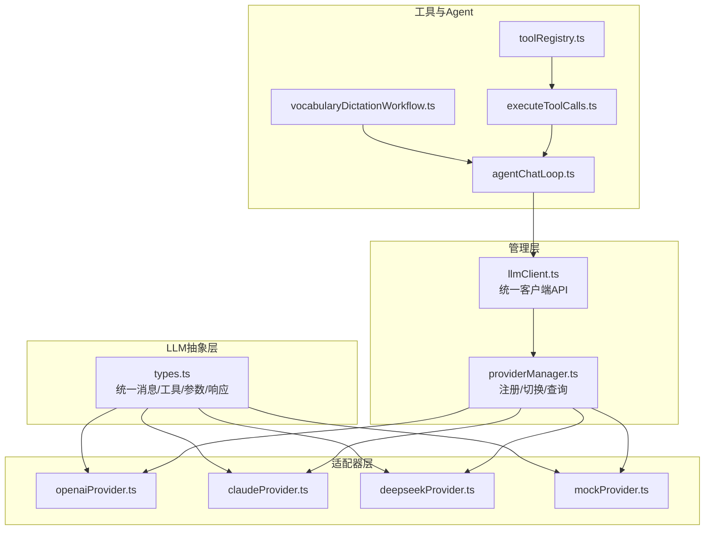
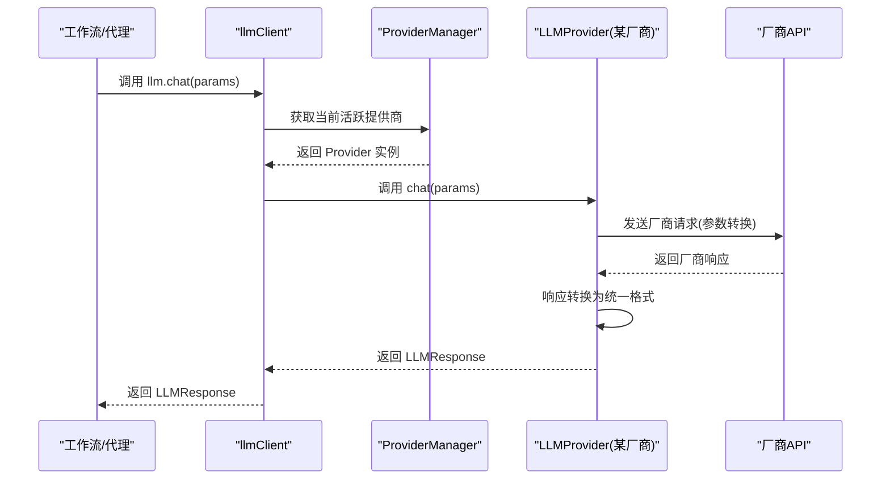
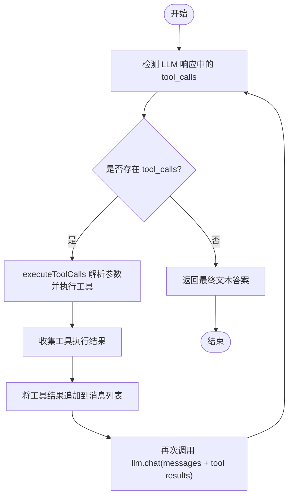
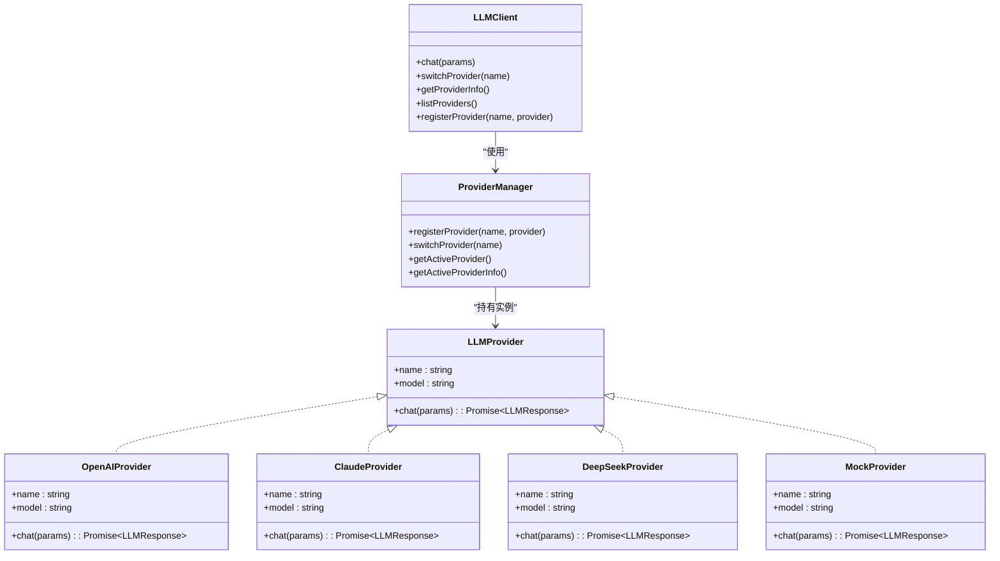

# LLM适配器设计

<cite>
**本文引用的文件**
- [src/ai/llm/types.ts](file://src/ai/llm/types.ts)
- [src/ai/llm/providerManager.ts](file://src/ai/llm/providerManager.ts)
- [src/ai/llm/llmClient.ts](file://src/ai/llm/llmClient.ts)
- [src/ai/llm/index.ts](file://src/ai/llm/index.ts)
- [src/ai/llm/openaiProvider.ts](file://src/ai/llm/openaiProvider.ts)
- [src/ai/llm/claudeProvider.ts](file://src/ai/llm/claudeProvider.ts)
- [src/ai/llm/deepseekProvider.ts](file://src/ai/llm/deepseekProvider.ts)
- [src/ai/llm/mockProvider.ts](file://src/ai/llm/mockProvider.ts)
- [src/ai/tools/types.ts](file://src/ai/tools/types.ts)
- [src/ai/tools/toolRegistry.ts](file://src/ai/tools/toolRegistry.ts)
- [src/ai/tools/executeToolCalls.ts](file://src/ai/tools/executeToolCalls.ts)
- [src/ai/agent/agentChatLoop.ts](file://src/ai/agent/agentChatLoop.ts)
- [src/ai/workflows/vocabularyDictationWorkflow.ts](file://src/ai/workflows/vocabularyDictationWorkflow.ts)
</cite>

## 目录
1. [引言](#引言)
2. [项目结构](#项目结构)
3. [核心组件](#核心组件)
4. [架构总览](#架构总览)
5. [组件详解](#组件详解)
6. [依赖关系分析](#依赖关系分析)
7. [性能考量](#性能考量)
8. [故障排查指南](#故障排查指南)
9. [结论](#结论)
10. [附录：新提供商适配开发指南](#附录新提供商适配开发指南)

## 引言
本文件面向小天AI教育平台的LLM适配器设计，系统性阐述多提供商抽象的设计理念、接口统一化策略与实现细节。文档覆盖LLMProvider接口规范、消息格式标准化、工具调用机制、不同提供商的适配器架构与实现模式、消息传递协议、参数标准化与响应格式统一，以及接口设计原则与最佳实践。同时提供新提供商适配器开发的完整指南，包括接口实现、错误处理与性能优化策略。

## 项目结构
LLM子系统采用“统一接口 + 适配器 + 注册中心”的分层架构：
- 统一类型与接口：定义跨厂商的消息、工具、参数与响应格式，确保上层工作流与代理不感知具体厂商差异。
- 提供商适配器：针对OpenAI、Claude、DeepSeek与Mock分别实现LLMProvider，负责将统一参数转换为各厂商API格式，并将厂商响应还原为统一格式。
- 提供商管理器：集中注册与切换当前活跃提供商，支持运行时热切换。
- 客户端封装：对外暴露统一的llm.chat等API，屏蔽提供商细节。
- 工具体系：工具注册与执行，配合工具调用闭环，支撑Agent与工作流。

图表来源
- [src/ai/llm/types.ts:1-118](file://src/ai/llm/types.ts#L1-L118)
- [src/ai/llm/openaiProvider.ts:1-196](file://src/ai/llm/openaiProvider.ts#L1-L196)
- [src/ai/llm/claudeProvider.ts:1-224](file://src/ai/llm/claudeProvider.ts#L1-L224)
- [src/ai/llm/deepseekProvider.ts:1-156](file://src/ai/llm/deepseekProvider.ts#L1-L156)
- [src/ai/llm/mockProvider.ts:1-246](file://src/ai/llm/mockProvider.ts#L1-L246)
- [src/ai/llm/providerManager.ts:1-76](file://src/ai/llm/providerManager.ts#L1-L76)
- [src/ai/llm/llmClient.ts:1-78](file://src/ai/llm/llmClient.ts#L1-L78)
- [src/ai/tools/toolRegistry.ts:1-117](file://src/ai/tools/toolRegistry.ts#L1-L117)
- [src/ai/tools/executeToolCalls.ts:1-114](file://src/ai/tools/executeToolCalls.ts#L1-L114)
- [src/ai/agent/agentChatLoop.ts:1-201](file://src/ai/agent/agentChatLoop.ts#L1-L201)
- [src/ai/workflows/vocabularyDictationWorkflow.ts:130-329](file://src/ai/workflows/vocabularyDictationWorkflow.ts#L130-L329)

章节来源
- [src/ai/llm/index.ts:1-39](file://src/ai/llm/index.ts#L1-L39)
- [src/ai/llm/llmClient.ts:1-78](file://src/ai/llm/llmClient.ts#L1-L78)

## 核心组件
- 统一消息与工具类型：LLMMessage、LLMTool、LLMToolCall、LLMToolParameters、LLMResponse、LLMUsage、LLMChatParams，确保跨厂商兼容。
- LLMProvider接口：统一的chat(params)方法，屏蔽厂商差异。
- 提供商管理器：注册、切换、查询当前活跃提供商。
- 客户端封装：llm.chat、switchLLMProvider、getLLMProviderInfo、listProviders、registerLLMProvider。
- 工具定义与注册：ToolDefinition、ToolExecuteContext、ToolResult，以及工具注册与自动映射。
- Agent循环：agentChatLoop实现工具调用闭环，支持多轮对话与工具结果回灌。

章节来源
- [src/ai/llm/types.ts:1-118](file://src/ai/llm/types.ts#L1-L118)
- [src/ai/llm/providerManager.ts:1-76](file://src/ai/llm/providerManager.ts#L1-L76)
- [src/ai/llm/llmClient.ts:1-78](file://src/ai/llm/llmClient.ts#L1-L78)
- [src/ai/tools/types.ts:1-60](file://src/ai/tools/types.ts#L1-L60)
- [src/ai/tools/toolRegistry.ts:1-117](file://src/ai/tools/toolRegistry.ts#L1-L117)
- [src/ai/agent/agentChatLoop.ts:1-201](file://src/ai/agent/agentChatLoop.ts#L1-L201)

## 架构总览
多提供商抽象通过“统一接口 + 适配器 + 注册中心”实现：
- 上层仅依赖LLMProvider接口与统一类型，不感知具体厂商SDK。
- 适配器负责参数与响应的双向转换，确保消息与工具调用格式标准化。
- 管理器提供运行时切换能力，便于灰度与A/B测试。
- 工具注册与执行器将LLM的工具调用意图转化为真实业务动作。

图表来源
- [src/ai/llm/llmClient.ts:29-67](file://src/ai/llm/llmClient.ts#L29-L67)
- [src/ai/llm/providerManager.ts:36-54](file://src/ai/llm/providerManager.ts#L36-L54)
- [src/ai/llm/openaiProvider.ts:93-143](file://src/ai/llm/openaiProvider.ts#L93-L143)
- [src/ai/llm/claudeProvider.ts:137-178](file://src/ai/llm/claudeProvider.ts#L137-L178)
- [src/ai/llm/deepseekProvider.ts:69-112](file://src/ai/llm/deepseekProvider.ts#L69-L112)

## 组件详解

### LLMProvider接口规范与统一消息格式
- 接口职责：提供统一的chat(params)方法，返回标准化的LLMResponse。
- 消息格式：统一的LLMMessage角色集合与字段，支持tool_call_id、tool_calls、name等扩展字段，满足工具调用场景。
- 工具定义：LLMTool与LLMToolParameters对齐OpenAI function calling与Claude tool use，确保跨厂商一致的工具声明与参数校验。
- 参数标准化：LLMChatParams统一承载system、messages、tools、temperature、maxTokens、toolChoice、responseFormat等关键参数。
- 响应统一：LLMResponse包含id、model、content、tool_calls、usage、provider、mock等字段，屏蔽厂商差异。

章节来源
- [src/ai/llm/types.ts:4-118](file://src/ai/llm/types.ts#L4-L118)

### 提供商管理器与客户端封装
- 注册与查询：registerProvider、getRegisteredProviders、getActiveProviderInfo等，支持动态注册与信息查询。
- 切换机制：switchProvider(name)根据名称切换活跃提供商，日志记录切换信息，便于运维与调试。
- 客户端API：llm.chat、switchLLMProvider、getLLMProviderInfo、listProviders、registerLLMProvider，向上层提供简洁统一的入口。

章节来源
- [src/ai/llm/providerManager.ts:1-76](file://src/ai/llm/providerManager.ts#L1-L76)
- [src/ai/llm/llmClient.ts:1-78](file://src/ai/llm/llmClient.ts#L1-L78)
- [src/ai/llm/index.ts:1-39](file://src/ai/llm/index.ts#L1-L39)

### OpenAI适配器
- 参数转换：toOpenAITools将统一工具定义转换为OpenAI function schema；消息体包含system与messages，支持tools、tool_choice、max_tokens、response_format等。
- 响应转换：fromOpenAIResponse将choices与usage映射为统一格式。
- 错误处理：未配置API Key时回退至mock；网络异常时捕获并回退，保证链路可用性。
- Mock行为：模拟工具调用与最终回答，支持结构化JSON输出与纯文本输出。

章节来源
- [src/ai/llm/openaiProvider.ts:1-196](file://src/ai/llm/openaiProvider.ts#L1-L196)

### Claude适配器
- 参数转换：toClaudeTools将统一工具定义转换为Claude input_schema；toClaudeMessages处理system位置差异与tool结果消息格式。
- 响应转换：fromClaudeResponse提取text与tool_use块，组装统一LLMResponse。
- 错误处理：未配置API Key时回退至mock；网络异常时捕获并回退。
- Mock行为：模拟工具调用与最终回答，支持结构化JSON输出与纯文本输出。

章节来源
- [src/ai/llm/claudeProvider.ts:1-224](file://src/ai/llm/claudeProvider.ts#L1-L224)

### DeepSeek适配器
- 兼容性：DeepSeek API与OpenAI Chat Completions兼容，复用OpenAI的格式转换逻辑，仅变更base URL与model。
- 错误处理：未配置API Key时回退至mock；网络异常时捕获并回退。
- Mock行为：模拟工具调用与最终回答，支持结构化JSON输出与纯文本输出。

章节来源
- [src/ai/llm/deepseekProvider.ts:1-156](file://src/ai/llm/deepseekProvider.ts#L1-L156)

### Mock适配器
- 完整闭环：首次调用且含tools时返回tool_calls；收到tool result后的follow-up返回最终自然语言答案。
- 参数模拟：基于用户输入与系统提示，构建合理的工具参数，模拟真实LLM意图抽取。
- 结果合成：根据工具输出合成自然语言总结，支持多种输出形态。
- 性能：内置随机延时，模拟真实响应延迟，便于前端体验与压力测试。

章节来源
- [src/ai/llm/mockProvider.ts:1-246](file://src/ai/llm/mockProvider.ts#L1-L246)

### 工具体系与工具调用机制
- 工具定义：ToolDefinition、ToolParameters、ToolExecuteContext、ToolResult，确保工具参数schema与执行上下文一致。
- 注册与映射：toolRegistry提供注册、查找、批量转换为LLMTool格式的能力；支持按工作流自动映射所需工具。
- 工具执行：executeToolCalls接收LLM返回的tool_calls，解析参数，查找注册工具并执行，汇总执行结果与摘要。
- Agent闭环：agentChatLoop在检测到tool_calls后，调用executeToolCalls收集工具结果，追加到消息列表后进行re-chat，直至获得最终答案。

图表来源
- [src/ai/agent/agentChatLoop.ts:112-178](file://src/ai/agent/agentChatLoop.ts#L112-L178)
- [src/ai/tools/executeToolCalls.ts:60-113](file://src/ai/tools/executeToolCalls.ts#L60-L113)

章节来源
- [src/ai/tools/types.ts:1-60](file://src/ai/tools/types.ts#L1-L60)
- [src/ai/tools/toolRegistry.ts:1-117](file://src/ai/tools/toolRegistry.ts#L1-L117)
- [src/ai/tools/executeToolCalls.ts:1-114](file://src/ai/tools/executeToolCalls.ts#L1-L114)
- [src/ai/agent/agentChatLoop.ts:1-201](file://src/ai/agent/agentChatLoop.ts#L1-L201)

### 工作流与Agent集成示例
- 词汇默写工作流：通过agentChatLoop驱动工具调用与结果回灌，完成“选词→生成→打印建议”的完整流程。
- Provider信息透传：工作流步骤中记录_provider与_mock，便于追踪与审计。

章节来源
- [src/ai/workflows/vocabularyDictationWorkflow.ts:130-329](file://src/ai/workflows/vocabularyDictationWorkflow.ts#L130-L329)
- [src/ai/agent/agentChatLoop.ts:1-201](file://src/ai/agent/agentChatLoop.ts#L1-L201)

## 依赖关系分析
- 类型依赖：所有适配器严格依赖types.ts中的统一类型，确保消息、工具、参数与响应格式一致。
- 管理器耦合：llmClient依赖providerManager进行提供商切换与查询；providerManager维护全局注册表与当前活跃提供商。
- 工具链路：agentChatLoop依赖llmClient获取统一响应；executeToolCalls依赖toolRegistry查找工具并执行；toolRegistry依赖types.ts的工具定义。
- 工作流集成：工作流通过agentChatLoop与工具链路实现端到端功能。

图表来源
- [src/ai/llm/types.ts:105-118](file://src/ai/llm/types.ts#L105-L118)
- [src/ai/llm/openaiProvider.ts:89-144](file://src/ai/llm/openaiProvider.ts#L89-L144)
- [src/ai/llm/claudeProvider.ts:133-179](file://src/ai/llm/claudeProvider.ts#L133-L179)
- [src/ai/llm/deepseekProvider.ts:65-112](file://src/ai/llm/deepseekProvider.ts#L65-L112)
- [src/ai/llm/mockProvider.ts:23-48](file://src/ai/llm/mockProvider.ts#L23-L48)
- [src/ai/llm/llmClient.ts:12-77](file://src/ai/llm/llmClient.ts#L12-L77)
- [src/ai/llm/providerManager.ts:19-66](file://src/ai/llm/providerManager.ts#L19-L66)

章节来源
- [src/ai/llm/types.ts:1-118](file://src/ai/llm/types.ts#L1-L118)
- [src/ai/llm/llmClient.ts:1-78](file://src/ai/llm/llmClient.ts#L1-L78)
- [src/ai/llm/providerManager.ts:1-76](file://src/ai/llm/providerManager.ts#L1-L76)

## 性能考量
- 延迟控制：Mock适配器内置随机延时，便于前端体验与压力测试；生产环境建议在适配器层引入超时与重试策略。
- 请求合并：工具调用较多时，可考虑并发执行与批量工具结果回灌，减少往返次数。
- 缓存与预热：对常用工具参数与模板进行缓存，降低参数解析与构造成本。
- 日志与监控：在Provider层记录请求耗时、错误码与回退路径，便于定位性能瓶颈与异常。

## 故障排查指南
- Provider未注册：switchProvider返回false并打印可用列表，检查是否正确导入并注册。
- API Key缺失：各适配器在未配置Key时回退至mock，确认环境变量与导入路径。
- 网络异常：适配器捕获错误并回退至mock，检查网络连通性与API配额。
- 工具未注册：executeToolCalls返回未注册工具错误，检查工具是否在toolRegistry中注册。
- 参数解析失败：工具参数为JSON字符串，解析失败时记录原始参数，便于调试。

章节来源
- [src/ai/llm/providerManager.ts:36-46](file://src/ai/llm/providerManager.ts#L36-L46)
- [src/ai/llm/openaiProvider.ts:95-98](file://src/ai/llm/openaiProvider.ts#L95-L98)
- [src/ai/llm/claudeProvider.ts:138-141](file://src/ai/llm/claudeProvider.ts#L138-L141)
- [src/ai/llm/deepseekProvider.ts:70-73](file://src/ai/llm/deepseekProvider.ts#L70-L73)
- [src/ai/tools/executeToolCalls.ts:78-91](file://src/ai/tools/executeToolCalls.ts#L78-L91)

## 结论
本设计通过统一接口与类型、严格的参数与响应标准化、完善的工具调用闭环，实现了多提供商的无缝抽象与切换。适配器层隔离厂商差异，管理层提供运行时热切换能力，工具体系保障意图到行动的可靠转化。整体架构具备良好的扩展性与可维护性，适合在教育场景中持续演进与扩展。

## 附录：新提供商适配开发指南
- 设计原则
  - 保持LLMProvider接口不变，仅在适配器内部完成格式转换。
  - 统一使用types.ts中的消息、工具、参数与响应类型，避免厂商私有字段外泄。
  - 提供Mock回退逻辑，确保在未配置API Key或网络异常时仍可运行。
- 开发步骤
  1) 创建适配器文件，导出LLMProvider实例，包含name、model与chat方法。
  2) 实现参数转换函数：将统一LLMTool[]与LLMChatParams转换为目标厂商API格式。
  3) 实现响应转换函数：将厂商响应映射为统一LLMResponse。
  4) 在适配器末尾调用registerProvider注册名称与实例。
  5) 在llmClient中自动导入该适配器，使其在应用启动时被注册。
  6) 在providerManager中默认注册Mock，在需要时按需注册真实提供商。
- 错误处理
  - API Key缺失：记录警告并回退至mock。
  - 网络异常：捕获错误并回退至mock，保留原参数以便重试或降级。
  - 参数解析：对非标准格式参数提供容错与日志记录。
- 性能优化
  - 引入超时与指数退避重试。
  - 对常用工具参数与模板进行缓存。
  - 减少不必要的字符串序列化/反序列化。
  - 在Agent层合理控制工具调用轮次与消息长度。

章节来源
- [src/ai/llm/types.ts:105-118](file://src/ai/llm/types.ts#L105-L118)
- [src/ai/llm/openaiProvider.ts:1-196](file://src/ai/llm/openaiProvider.ts#L1-L196)
- [src/ai/llm/claudeProvider.ts:1-224](file://src/ai/llm/claudeProvider.ts#L1-L224)
- [src/ai/llm/deepseekProvider.ts:1-156](file://src/ai/llm/deepseekProvider.ts#L1-L156)
- [src/ai/llm/llmClient.ts:21-26](file://src/ai/llm/llmClient.ts#L21-L26)
- [src/ai/llm/providerManager.ts:68-76](file://src/ai/llm/providerManager.ts#L68-L76)