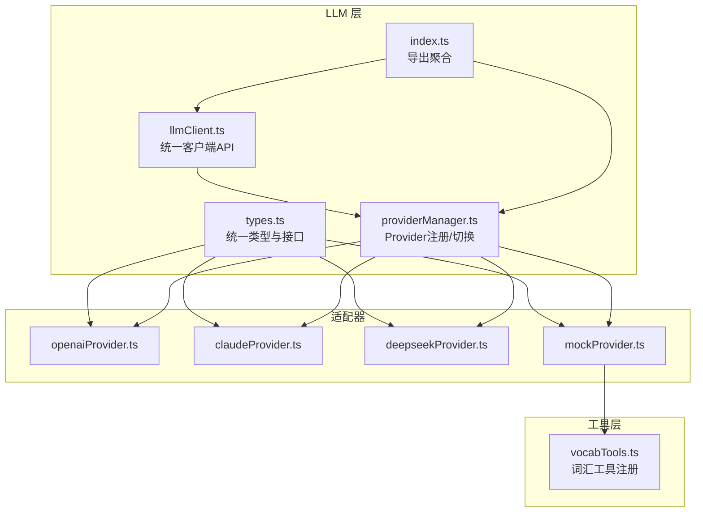
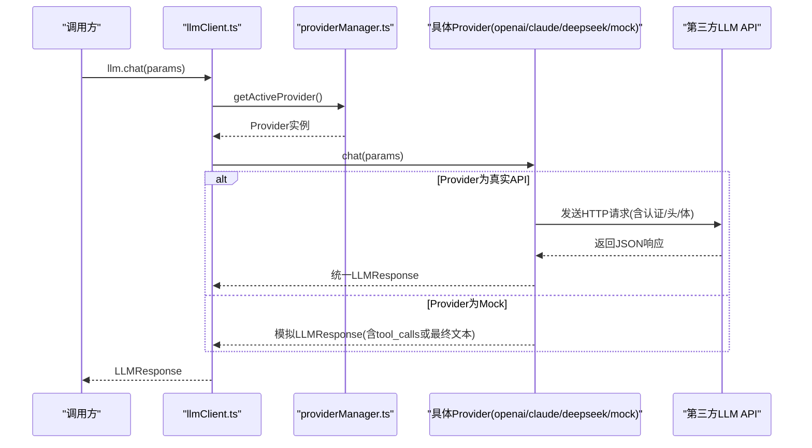
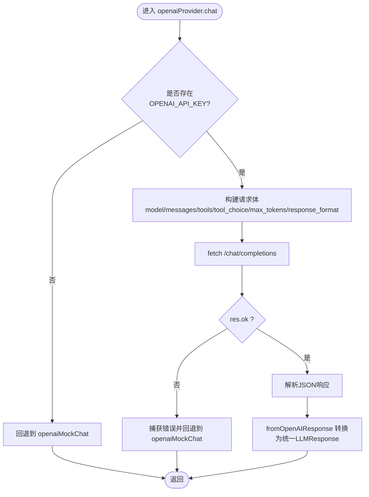
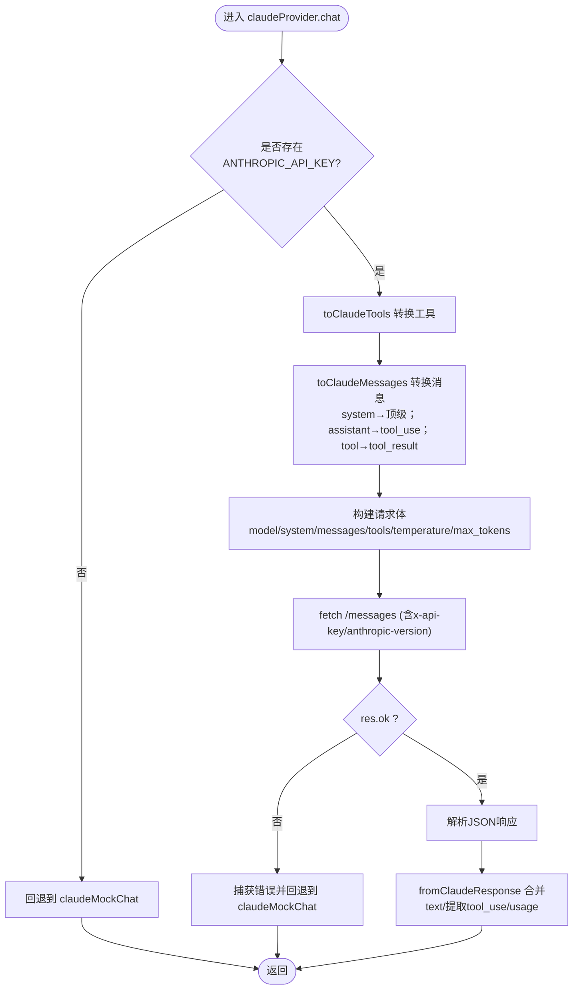
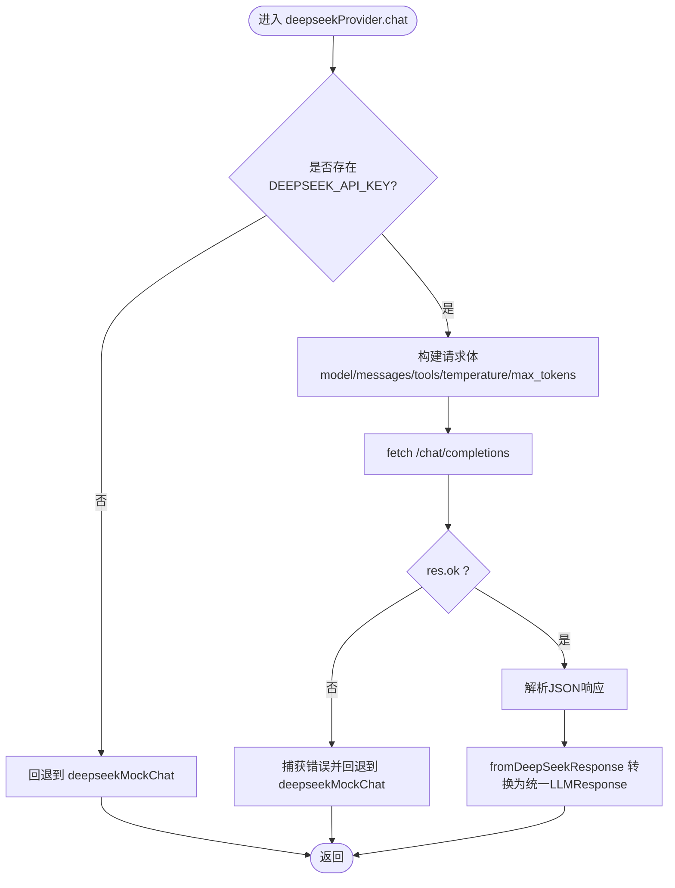
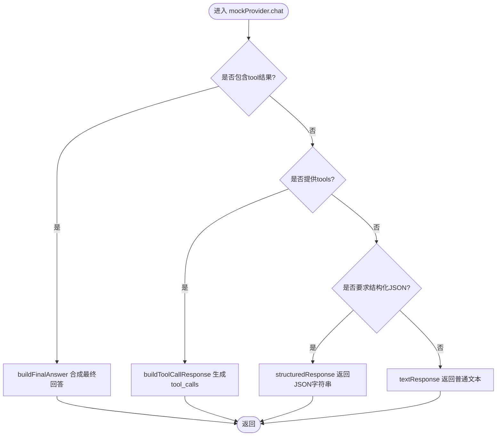
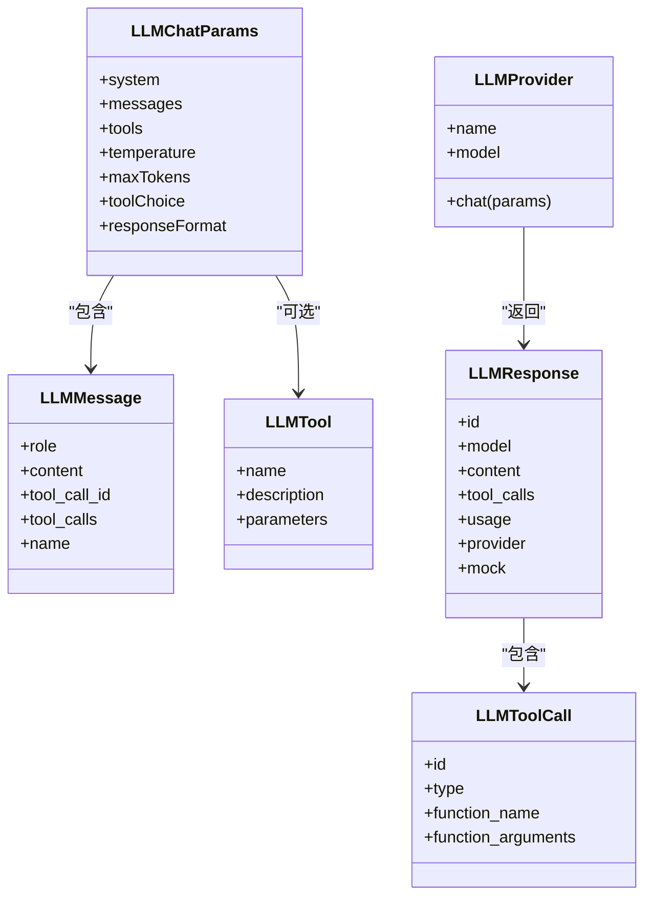
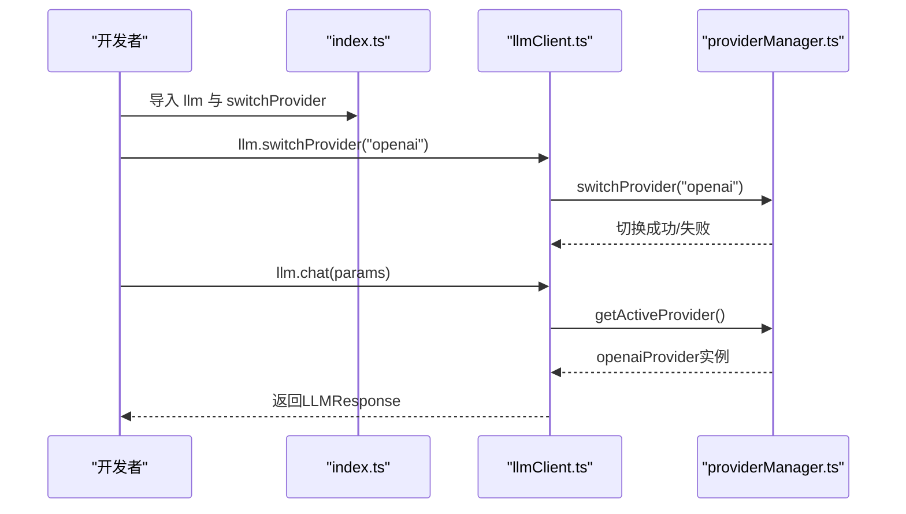
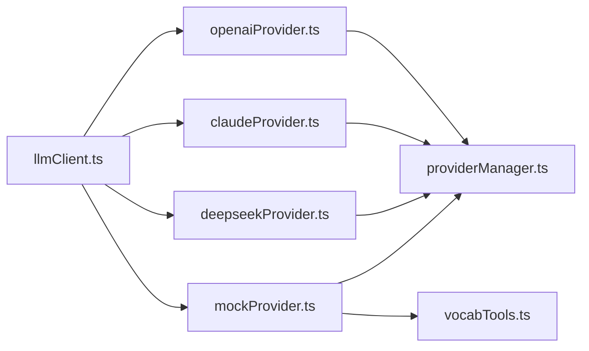

# 具体提供商实现

<cite>
**本文引用的文件**
- [src/ai/llm/openaiProvider.ts](file://src/ai/llm/openaiProvider.ts)
- [src/ai/llm/claudeProvider.ts](file://src/ai/llm/claudeProvider.ts)
- [src/ai/llm/deepseekProvider.ts](file://src/ai/llm/deepseekProvider.ts)
- [src/ai/llm/mockProvider.ts](file://src/ai/llm/mockProvider.ts)
- [src/ai/llm/types.ts](file://src/ai/llm/types.ts)
- [src/ai/llm/providerManager.ts](file://src/ai/llm/providerManager.ts)
- [src/ai/llm/llmClient.ts](file://src/ai/llm/llmClient.ts)
- [src/ai/llm/index.ts](file://src/ai/llm/index.ts)
- [src/ai/tools/vocabTools.ts](file://src/ai/tools/vocabTools.ts)
- [src/ai/agent/agentChatLoop.ts](file://src/ai/agent/agentChatLoop.ts)
- [src/ai/tools/executeToolCalls.ts](file://src/ai/tools/executeToolCalls.ts)
</cite>

## 目录
1. [简介](#简介)
2. [项目结构](#项目结构)
3. [核心组件](#核心组件)
4. [架构总览](#架构总览)
5. [详细组件分析](#详细组件分析)
6. [依赖关系分析](#依赖关系分析)
7. [性能考量](#性能考量)
8. [故障排除指南](#故障排除指南)
9. [结论](#结论)
10. [附录](#附录)

## 简介
本文件面向小天AI教育平台的LLM提供商实现，系统化梳理OpenAI、Claude、DeepSeek与Mock四类提供商的适配器设计与实现细节。内容覆盖：
- 统一消息与工具调用格式的跨厂商转换策略
- 认证机制与配置参数
- API调用流程、错误回退与Mock模式
- 工具调用链路在真实与Mock模式下的行为一致性
- 性能特征、价格对比与适用场景
- 配置示例与常见问题排查

## 项目结构
LLM提供商相关代码位于 src/ai/llm 目录，采用“统一类型 + 适配器 + 管理器”的分层设计：
- 统一类型与接口：定义跨厂商兼容的消息、工具、响应与聊天参数
- 适配器：OpenAI、Claude、DeepSeek、Mock各自的Provider实现
- 管理器：Provider注册、切换与默认激活
- 客户端：统一对外API入口，封装调用与Provider切换

图表来源
- [src/ai/llm/types.ts:1-118](file://src/ai/llm/types.ts#L1-L118)
- [src/ai/llm/providerManager.ts:1-76](file://src/ai/llm/providerManager.ts#L1-L76)
- [src/ai/llm/llmClient.ts:1-78](file://src/ai/llm/llmClient.ts#L1-L78)
- [src/ai/llm/index.ts:1-39](file://src/ai/llm/index.ts#L1-L39)
- [src/ai/llm/openaiProvider.ts:1-196](file://src/ai/llm/openaiProvider.ts#L1-L196)
- [src/ai/llm/claudeProvider.ts:1-224](file://src/ai/llm/claudeProvider.ts#L1-L224)
- [src/ai/llm/deepseekProvider.ts:1-156](file://src/ai/llm/deepseekProvider.ts#L1-L156)
- [src/ai/llm/mockProvider.ts:1-246](file://src/ai/llm/mockProvider.ts#L1-L246)
- [src/ai/tools/vocabTools.ts:1-260](file://src/ai/tools/vocabTools.ts#L1-L260)

章节来源
- [src/ai/llm/index.ts:1-39](file://src/ai/llm/index.ts#L1-L39)
- [src/ai/llm/llmClient.ts:1-78](file://src/ai/llm/llmClient.ts#L1-L78)
- [src/ai/llm/providerManager.ts:1-76](file://src/ai/llm/providerManager.ts#L1-L76)

## 核心组件
- 统一类型与接口
  - LLMMessage、LLMTool、LLMToolCall、LLMResponse、LLMUsage、LLMChatParams
  - LLMProvider接口：统一的chat(params)契约
- Provider管理器
  - 注册/查询/切换Provider，记录当前活跃Provider与模型
- 客户端
  - 对外暴露 llm.chat / switchProvider / getProviderInfo / listProviders / registerProvider
- 适配器
  - OpenAI：兼容OpenAI Chat Completions API，支持tools、tool_choice、response_format
  - Claude：兼容Anthropic Messages API，负责system与tool_use格式转换
  - DeepSeek：兼容OpenAI风格API，仅差异base URL与model
  - Mock：全链路模拟，支持首次tool_calls与后续最终回答

章节来源
- [src/ai/llm/types.ts:1-118](file://src/ai/llm/types.ts#L1-L118)
- [src/ai/llm/providerManager.ts:1-76](file://src/ai/llm/providerManager.ts#L1-L76)
- [src/ai/llm/llmClient.ts:1-78](file://src/ai/llm/llmClient.ts#L1-L78)

## 架构总览
统一的Provider接口屏蔽了不同厂商的API差异，通过格式转换器将统一参数转为各厂商请求体，并将厂商响应还原为统一响应。Provider管理器负责注册与切换，客户端提供统一调用入口。

图表来源
- [src/ai/llm/llmClient.ts:29-35](file://src/ai/llm/llmClient.ts#L29-L35)
- [src/ai/llm/providerManager.ts:48-50](file://src/ai/llm/providerManager.ts#L48-L50)
- [src/ai/llm/openaiProvider.ts:93-144](file://src/ai/llm/openaiProvider.ts#L93-L144)
- [src/ai/llm/claudeProvider.ts:137-179](file://src/ai/llm/claudeProvider.ts#L137-L179)
- [src/ai/llm/deepseekProvider.ts:69-113](file://src/ai/llm/deepseekProvider.ts#L69-L113)
- [src/ai/llm/mockProvider.ts:27-47](file://src/ai/llm/mockProvider.ts#L27-L47)

## 详细组件分析

### OpenAI 适配器
- 认证与配置
  - 读取VITE_OPENAI_API_KEY，未配置时回退到Mock
  - 使用OPENAI_BASE_URL发送/chat/completions
- 请求体转换
  - messages：附加system消息；保留tool_calls、tool_call_id、name字段
  - tools：转换为OpenAI function工具格式
  - tool_choice、max_tokens、response_format透传
- 响应转换
  - 提取消息内容与tool_calls，统计prompt/completion/total tokens
- 错误处理
  - HTTP非OK或异常抛错，捕获后回退到openaiMockChat
- Mock回退
  - 若存在tools，返回tool_calls；否则返回最终文本与usage

图表来源
- [src/ai/llm/openaiProvider.ts:93-144](file://src/ai/llm/openaiProvider.ts#L93-L144)
- [src/ai/llm/openaiProvider.ts:56-85](file://src/ai/llm/openaiProvider.ts#L56-L85)
- [src/ai/llm/openaiProvider.ts:149-187](file://src/ai/llm/openaiProvider.ts#L149-L187)

章节来源
- [src/ai/llm/openaiProvider.ts:1-196](file://src/ai/llm/openaiProvider.ts#L1-L196)

### Claude 适配器
- 认证与配置
  - 读取VITE_ANTHROPIC_API_KEY，未配置时回退到Mock
  - 使用ANTHROPIC_BASE_URL发送/messages，带anthropic-version头
- 请求体转换
  - system：顶级参数，非消息角色
  - messages：assistant+tool_calls → tool_use块；tool→user+tool_result块；其余保持原样
  - tools：转换为input_schema格式
- 响应转换
  - content：合并text块文本；提取tool_use块为tool_calls
  - usage：input_tokens与output_tokens汇总
- 错误处理
  - HTTP非OK或异常抛错，捕获后回退到claudeMockChat
- Mock回退
  - 若存在tools，返回tool_use风格tool_calls；否则返回最终文本与usage

图表来源
- [src/ai/llm/claudeProvider.ts:137-179](file://src/ai/llm/claudeProvider.ts#L137-L179)
- [src/ai/llm/claudeProvider.ts:34-41](file://src/ai/llm/claudeProvider.ts#L34-L41)
- [src/ai/llm/claudeProvider.ts:50-85](file://src/ai/llm/claudeProvider.ts#L50-L85)
- [src/ai/llm/claudeProvider.ts:96-129](file://src/ai/llm/claudeProvider.ts#L96-L129)
- [src/ai/llm/claudeProvider.ts:183-217](file://src/ai/llm/claudeProvider.ts#L183-L217)

章节来源
- [src/ai/llm/claudeProvider.ts:1-224](file://src/ai/llm/claudeProvider.ts#L1-L224)

### DeepSeek 适配器
- 认证与配置
  - 读取VITE_DEEPSEEK_API_KEY，未配置时回退到Mock
  - 使用DEEPSEEK_BASE_URL发送/chat/completions
- 请求体转换
  - 与OpenAI兼容：tools转换为function格式；透传temperature、max_tokens
  - 不支持tool_choice与response_format
- 响应转换
  - 与OpenAI一致：choices[0].message与usage字段映射
- 错误处理
  - HTTP非OK或异常抛错，捕获后回退到deepseekMockChat
- Mock回退
  - 若存在tools，返回tool_calls；否则返回最终文本与usage

图表来源
- [src/ai/llm/deepseekProvider.ts:69-113](file://src/ai/llm/deepseekProvider.ts#L69-L113)
- [src/ai/llm/deepseekProvider.ts:32-61](file://src/ai/llm/deepseekProvider.ts#L32-L61)
- [src/ai/llm/deepseekProvider.ts:117-149](file://src/ai/llm/deepseekProvider.ts#L117-L149)

章节来源
- [src/ai/llm/deepseekProvider.ts:1-156](file://src/ai/llm/deepseekProvider.ts#L1-L156)

### Mock 适配器
- 设计目标
  - 完整模拟工具调用链路：首次调用返回tool_calls；收到tool结果后返回最终文本
  - 支持结构化JSON输出与纯文本输出
- 关键逻辑
  - hasToolResults：检测messages中是否存在tool角色且带tool_call_id
  - buildToolCallResponse：选择首个工具并基于用户输入构造参数
  - buildFinalAnswer：合成最终自然语言回答，汇总工具输出
  - structuredResponse/textResponse：分别返回JSON字符串或普通文本
- 词汇工具集成
  - 通过导入vocabTools触发工具注册，Mock模式下即可使用

图表来源
- [src/ai/llm/mockProvider.ts:27-47](file://src/ai/llm/mockProvider.ts#L27-L47)
- [src/ai/llm/mockProvider.ts:56-58](file://src/ai/llm/mockProvider.ts#L56-L58)
- [src/ai/llm/mockProvider.ts:62-90](file://src/ai/llm/mockProvider.ts#L62-L90)
- [src/ai/llm/mockProvider.ts:155-174](file://src/ai/llm/mockProvider.ts#L155-L174)
- [src/ai/llm/mockProvider.ts:219-241](file://src/ai/llm/mockProvider.ts#L219-L241)

章节来源
- [src/ai/llm/mockProvider.ts:1-246](file://src/ai/llm/mockProvider.ts#L1-L246)
- [src/ai/tools/vocabTools.ts:1-260](file://src/ai/tools/vocabTools.ts#L1-L260)

### 统一类型与接口
- LLMMessage：role、content、tool_call_id、tool_calls、name
- LLMTool：name、description、parameters(JSON Schema)
- LLMToolCall：id、type=function、function{name, arguments(JSON字符串)}
- LLMResponse：id、model、content、tool_calls、usage、provider、mock
- LLMChatParams：system、messages、tools、temperature、maxTokens、toolChoice、responseFormat
- LLMProvider：name、model、chat(params)

图表来源
- [src/ai/llm/types.ts:4-118](file://src/ai/llm/types.ts#L4-L118)

章节来源
- [src/ai/llm/types.ts:1-118](file://src/ai/llm/types.ts#L1-L118)

### Provider管理器与客户端
- Provider管理器
  - registerProvider(name, provider)：注册Provider
  - switchProvider(name)：切换活跃Provider，打印日志
  - getActiveProvider/getActiveProviderName/getActiveProviderInfo：查询当前状态
  - 默认注册mockProvider，真实Provider需在各自文件中注册
- 客户端
  - llm.chat：转发至当前活跃Provider
  - llm.switchProvider：切换Provider
  - llm.getProviderInfo/listProviders/registerProvider：查询与扩展

图表来源
- [src/ai/llm/index.ts:1-39](file://src/ai/llm/index.ts#L1-L39)
- [src/ai/llm/llmClient.ts:46-48](file://src/ai/llm/llmClient.ts#L46-L48)
- [src/ai/llm/providerManager.ts:36-46](file://src/ai/llm/providerManager.ts#L36-L46)

章节来源
- [src/ai/llm/providerManager.ts:1-76](file://src/ai/llm/providerManager.ts#L1-L76)
- [src/ai/llm/llmClient.ts:1-78](file://src/ai/llm/llmClient.ts#L1-L78)
- [src/ai/llm/index.ts:1-39](file://src/ai/llm/index.ts#L1-L39)

## 依赖关系分析
- Provider注册
  - openaiProvider.ts、claudeProvider.ts、deepseekProvider.ts在文件末尾调用registerProvider注册自身
  - providerManager.ts默认注册mockProvider，真实Provider仅在API Key存在时被注册
- 客户端自动注册
  - llmClient.ts在顶部导入各Provider文件，触发其内部注册逻辑
- 工具链路
  - mockProvider导入vocabTools以注册词汇工具，确保Mock模式下工具可用
  - agentChatLoop与executeToolCalls消费统一LLM类型，不感知Provider差异

图表来源
- [src/ai/llm/openaiProvider.ts](file://src/ai/llm/openaiProvider.ts#L191)
- [src/ai/llm/claudeProvider.ts](file://src/ai/llm/claudeProvider.ts#L219)
- [src/ai/llm/deepseekProvider.ts](file://src/ai/llm/deepseekProvider.ts#L151)
- [src/ai/llm/providerManager.ts:71-75](file://src/ai/llm/providerManager.ts#L71-L75)
- [src/ai/llm/llmClient.ts:23-25](file://src/ai/llm/llmClient.ts#L23-L25)
- [src/ai/llm/mockProvider.ts:14-15](file://src/ai/llm/mockProvider.ts#L14-L15)
- [src/ai/tools/vocabTools.ts:255-257](file://src/ai/tools/vocabTools.ts#L255-L257)

章节来源
- [src/ai/llm/openaiProvider.ts](file://src/ai/llm/openaiProvider.ts#L191)
- [src/ai/llm/claudeProvider.ts](file://src/ai/llm/claudeProvider.ts#L219)
- [src/ai/llm/deepseekProvider.ts](file://src/ai/llm/deepseekProvider.ts#L151)
- [src/ai/llm/llmClient.ts:23-25](file://src/ai/llm/llmClient.ts#L23-L25)
- [src/ai/llm/mockProvider.ts:14-15](file://src/ai/llm/mockProvider.ts#L14-L15)

## 性能考量
- 调用延迟
  - 各Provider在Mock回退路径均sleep 200ms左右，便于演示与调试
  - 真实API调用受网络与第三方服务影响，建议在生产环境增加重试与超时控制
- 工具调用往返
  - Mock模式下可完整走通“LLM → 工具 → 再对话 → 最终答案”链路，便于联调
  - 真实API模式下，工具调用往返次数越多，总耗时越高
- Token消耗
  - 统一响应包含usage字段，便于成本与性能监控
- 模型选择
  - OpenAI：gpt-4o；Claude：claude-sonnet-4-20250514；DeepSeek：deepseek-chat
  - 不同模型在速度、成本与能力上存在差异，建议结合业务场景选择

[本节为通用性能讨论，不直接分析具体文件]

## 故障排除指南
- 无法切换Provider
  - 检查switchProvider(name)传入名称是否正确，使用listProviders()确认已注册
  - 查看控制台日志确认是否提示“Provider未注册”
- API调用失败
  - OpenAI/Claude/DeepSeek：检查对应API Key是否配置；查看错误日志中的HTTP状态码与错误文本
  - Provider会在catch后回退到Mock，确认是否因网络或密钥问题导致
- Mock模式下工具不可用
  - 确认mockProvider导入vocabTools，或在应用初始化时提前导入
- 工具调用参数异常
  - 检查LLMTool.parameters的JSON Schema是否与工具期望一致
  - Mock模式下会基于用户输入与规则推断参数，若不符合预期，可在工具实现中增强参数解析

章节来源
- [src/ai/llm/providerManager.ts:36-46](file://src/ai/llm/providerManager.ts#L36-L46)
- [src/ai/llm/openaiProvider.ts:132-142](file://src/ai/llm/openaiProvider.ts#L132-L142)
- [src/ai/llm/claudeProvider.ts:167-178](file://src/ai/llm/claudeProvider.ts#L167-L178)
- [src/ai/llm/deepseekProvider.ts:101-112](file://src/ai/llm/deepseekProvider.ts#L101-L112)
- [src/ai/llm/mockProvider.ts:14-15](file://src/ai/llm/mockProvider.ts#L14-L15)

## 结论
该实现通过统一类型与Provider适配器，有效屏蔽了OpenAI、Claude、DeepSeek与Mock之间的差异，实现了：
- 一致的工具调用体验与消息格式
- 灵活的Provider注册与热切换
- 完整的Mock链路，便于开发与联调
建议在生产环境中：
- 明确各Provider的API Key与Base URL配置
- 针对真实API增加重试、超时与熔断策略
- 基于usage进行成本与性能监控

[本节为总结性内容，不直接分析具体文件]

## 附录

### 配置参数与认证
- OpenAI
  - 环境变量：VITE_OPENAI_API_KEY
  - Base URL：https://api.openai.com/v1
  - 身份验证：Authorization: Bearer {key}
- Claude
  - 环境变量：VITE_ANTHROPIC_API_KEY
  - Base URL：https://api.anthropic.com/v1
  - 身份验证：x-api-key: {key}；anthropic-version: 2023-06-01
- DeepSeek
  - 环境变量：VITE_DEEPSEEK_API_KEY
  - Base URL：https://api.deepseek.com/v1
  - 身份验证：Authorization: Bearer {key}

章节来源
- [src/ai/llm/openaiProvider.ts:20-22](file://src/ai/llm/openaiProvider.ts#L20-L22)
- [src/ai/llm/claudeProvider.ts:19-21](file://src/ai/llm/claudeProvider.ts#L19-L21)
- [src/ai/llm/deepseekProvider.ts:18-20](file://src/ai/llm/deepseekProvider.ts#L18-L20)

### API调用方式与消息格式差异
- OpenAI
  - 请求：/chat/completions；支持tools、tool_choice、response_format
  - 响应：choices[0].message.content与tool_calls；usage
- Claude
  - 请求：/messages；system为顶级参数；assistant消息可含tool_use块；tool结果以tool_result块出现在user消息中
  - 响应：content包含text与tool_use块；usage为input_tokens与output_tokens
- DeepSeek
  - 请求：/chat/completions；兼容OpenAI风格；不支持tool_choice与response_format
  - 响应：与OpenAI一致

章节来源
- [src/ai/llm/openaiProvider.ts:101-121](file://src/ai/llm/openaiProvider.ts#L101-L121)
- [src/ai/llm/openaiProvider.ts:56-85](file://src/ai/llm/openaiProvider.ts#L56-L85)
- [src/ai/llm/claudeProvider.ts:146-155](file://src/ai/llm/claudeProvider.ts#L146-L155)
- [src/ai/llm/claudeProvider.ts:96-129](file://src/ai/llm/claudeProvider.ts#L96-L129)
- [src/ai/llm/deepseekProvider.ts:75-90](file://src/ai/llm/deepseekProvider.ts#L75-L90)
- [src/ai/llm/deepseekProvider.ts:32-61](file://src/ai/llm/deepseekProvider.ts#L32-L61)

### 工具调用支持与响应处理
- 统一工具Schema
  - LLMTool与ToolDefinition对齐OpenAI function与Claude tool schema
- 工具调用链路
  - 首轮：LLM返回tool_calls（Mock或真实API）
  - 执行：工具执行后将结果作为tool消息追加
  - 二轮：LLM根据工具结果生成最终文本
- Mock模式下的工具链路
  - 自动识别tool结果并合成最终回答，保证端到端可运行

章节来源
- [src/ai/llm/types.ts:18-49](file://src/ai/llm/types.ts#L18-L49)
- [src/ai/tools/types.ts:5-34](file://src/ai/tools/types.ts#L5-L34)
- [src/ai/llm/mockProvider.ts:56-58](file://src/ai/llm/mockProvider.ts#L56-L58)
- [src/ai/llm/mockProvider.ts:155-174](file://src/ai/llm/mockProvider.ts#L155-L174)
- [src/ai/agent/agentChatLoop.ts:118-140](file://src/ai/agent/agentChatLoop.ts#L118-L140)
- [src/ai/tools/executeToolCalls.ts](file://src/ai/tools/executeToolCalls.ts#L14)

### Mock提供商的测试与调试
- 用途
  - 在无API Key或网络受限时，保证工具链路可跑通
  - 便于前端与后端联调，降低外部依赖
- 特点
  - 首次调用返回tool_calls（Mock模式），随后根据工具结果合成最终文本
  - 支持结构化JSON输出与纯文本输出
- 集成
  - 通过导入vocabTools注册词汇工具，Mock模式下即可使用

章节来源
- [src/ai/llm/mockProvider.ts:1-246](file://src/ai/llm/mockProvider.ts#L1-L246)
- [src/ai/tools/vocabTools.ts:255-257](file://src/ai/tools/vocabTools.ts#L255-L257)

### 性能特点、价格对比与适用场景
- 性能特点
  - Mock模式：固定延迟，便于演示与调试
  - 真实API：受网络与第三方服务影响，工具调用往返次数越多，总耗时越高
- 价格对比
  - 未在代码中体现，需参考各厂商官方定价
- 适用场景
  - 开发与联调：优先使用Mock
  - 生产部署：根据需求选择OpenAI/Claude/DeepSeek，关注响应速度与成本

[本节为通用指导，不直接分析具体文件]