# 上下文和记忆管理

<cite>
**本文引用的文件**
- [src/ai/context/contextEngine.ts](file://src/ai/context/contextEngine.ts)
- [src/ai/context/types.ts](file://src/ai/context/types.ts)
- [src/ai/context/index.ts](file://src/ai/context/index.ts)
- [src/ai/memory/index.ts](file://src/ai/memory/index.ts)
- [src/ai/memory/sessionMemory.ts](file://src/ai/memory/sessionMemory.ts)
- [src/ai/memory/workflowHistory.ts](file://src/ai/memory/workflowHistory.ts)
- [src/ai/memory/toolResultMemory.ts](file://src/ai/memory/toolResultMemory.ts)
- [src/ai/memory/importanceScorer.ts](file://src/ai/memory/importanceScorer.ts)
- [src/storage/memoryStorage.ts](file://src/storage/memoryStorage.ts)
- [src/storage/types.ts](file://src/storage/types.ts)
- [src/vector/index.ts](file://src/vector/index.ts)
- [src/vector/mockVectorAdapter.ts](file://src/vector/mockVectorAdapter.ts)
- [src/ai/engine/workflowRunner.ts](file://src/ai/engine/workflowRunner.ts)
- [src/ai/workflows/workflowContext.ts](file://src/ai/workflows/workflowContext.ts)
- [src/ai/agent/agentExecutor.ts](file://src/ai/agent/agentExecutor.ts)
- [src/ai/agent/sharedMemory.ts](file://src/ai/agent/sharedMemory.ts)
- [src/ai/tools/executeToolCalls.ts](file://src/ai/tools/executeToolCalls.ts)
</cite>

## 目录
1. [简介](#简介)
2. [项目结构](#项目结构)
3. [核心组件](#核心组件)
4. [架构总览](#架构总览)
5. [详细组件分析](#详细组件分析)
6. [依赖分析](#依赖分析)
7. [性能考虑](#性能考虑)
8. [故障排查指南](#故障排查指南)
9. [结论](#结论)
10. [附录](#附录)

## 简介
本技术文档围绕小天AI教育平台的“上下文引擎”与“记忆系统”展开，目标是帮助开发者全面理解以下内容：
- 上下文引擎的设计架构与状态管理机制
- 三类记忆系统：会话记忆、工作流历史、工具结果记忆
- 重要性评分器的计算算法与优先级排序机制
- 记忆系统的生命周期管理与内存优化策略
- 上下文传递与状态同步机制
- 记忆系统的扩展与自定义开发指南
- 提供上下文与记忆管理的完整实现与使用框架

## 项目结构
上下文与记忆管理相关代码主要分布在以下模块：
- 上下文引擎：负责构建运行时上下文、注入RAG检索到的知识片段，并提供上下文摘要能力
- 记忆子系统：会话记忆、工作流历史、工具结果记忆，均通过统一的存储适配器进行持久化
- 存储适配器：抽象了会话、消息、工作流运行、工具结果等数据的读写与清理
- 向量检索：提供RAG检索能力，支持向量相似度与关键词混合打分
- 执行链路：工作流执行器、多智能体执行器、工具调用执行器，贯穿上下文与记忆的使用

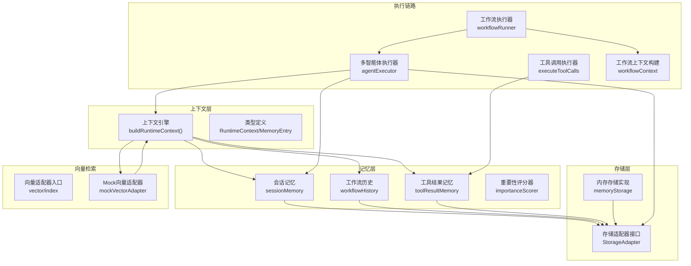

图表来源
- [src/ai/context/contextEngine.ts:37-80](file://src/ai/context/contextEngine.ts#L37-L80)
- [src/ai/context/types.ts:78-102](file://src/ai/context/types.ts#L78-L102)
- [src/ai/memory/sessionMemory.ts:18-60](file://src/ai/memory/sessionMemory.ts#L18-L60)
- [src/ai/memory/workflowHistory.ts:10-48](file://src/ai/memory/workflowHistory.ts#L10-L48)
- [src/ai/memory/toolResultMemory.ts:10-40](file://src/ai/memory/toolResultMemory.ts#L10-L40)
- [src/ai/memory/importanceScorer.ts:22-63](file://src/ai/memory/importanceScorer.ts#L22-L63)
- [src/storage/memoryStorage.ts:28-167](file://src/storage/memoryStorage.ts#L28-L167)
- [src/storage/types.ts:71-100](file://src/storage/types.ts#L71-L100)
- [src/vector/index.ts:7-13](file://src/vector/index.ts#L7-L13)
- [src/vector/mockVectorAdapter.ts:20-94](file://src/vector/mockVectorAdapter.ts#L20-L94)
- [src/ai/engine/workflowRunner.ts:103-179](file://src/ai/engine/workflowRunner.ts#L103-L179)
- [src/ai/workflows/workflowContext.ts:10-43](file://src/ai/workflows/workflowContext.ts#L10-L43)
- [src/ai/agent/agentExecutor.ts:36-106](file://src/ai/agent/agentExecutor.ts#L36-L106)
- [src/ai/tools/executeToolCalls.ts:60-113](file://src/ai/tools/executeToolCalls.ts#L60-L113)

章节来源
- [src/ai/context/contextEngine.ts:1-189](file://src/ai/context/contextEngine.ts#L1-L189)
- [src/ai/context/types.ts:1-128](file://src/ai/context/types.ts#L1-L128)
- [src/ai/memory/index.ts:1-31](file://src/ai/memory/index.ts#L1-L31)
- [src/storage/types.ts:1-101](file://src/storage/types.ts#L1-L101)
- [src/vector/index.ts:1-35](file://src/vector/index.ts#L1-L35)

## 核心组件
- 上下文引擎：聚合教师画像、班级信息、近期工作流、工具结果、会话消息以及RAG检索到的相关知识，形成统一的运行时上下文；提供上下文摘要能力
- 三类记忆系统：
  - 会话记忆：以存储适配器为核心，持久化消息与会话元数据，支持上下文窗口估算与清理
  - 工作流历史：记录工作流执行的触发、状态、耗时、摘要与工具调用次数
  - 工具结果记忆：记录工具调用参数、返回结果与摘要
- 重要性评分器：基于记忆类型、文本特征、信息量等维度进行加权评分，决定是否写入长期向量存储
- 存储适配器：抽象会话、消息、工作流运行、工具结果等数据的读写与清理，支持默认内存实现与未来替换为SQLite/PostgreSQL等
- 向量检索：提供RAG检索能力，默认使用Mock向量适配器，支持命名空间过滤、最小分数阈值与关键词增强

章节来源
- [src/ai/context/contextEngine.ts:37-80](file://src/ai/context/contextEngine.ts#L37-L80)
- [src/ai/memory/sessionMemory.ts:18-115](file://src/ai/memory/sessionMemory.ts#L18-L115)
- [src/ai/memory/workflowHistory.ts:10-79](file://src/ai/memory/workflowHistory.ts#L10-L79)
- [src/ai/memory/toolResultMemory.ts:10-74](file://src/ai/memory/toolResultMemory.ts#L10-L74)
- [src/ai/memory/importanceScorer.ts:22-71](file://src/ai/memory/importanceScorer.ts#L22-L71)
- [src/storage/types.ts:71-100](file://src/storage/types.ts#L71-L100)
- [src/vector/mockVectorAdapter.ts:43-94](file://src/vector/mockVectorAdapter.ts#L43-L94)

## 架构总览
上下文引擎在构建运行时上下文时，采用并行加载策略，同时拉取近期工作流、工具结果与会话消息，并通过向量适配器检索相关知识片段，最终形成包含教师画像、班级信息、近期活动与RAG知识的上下文对象。

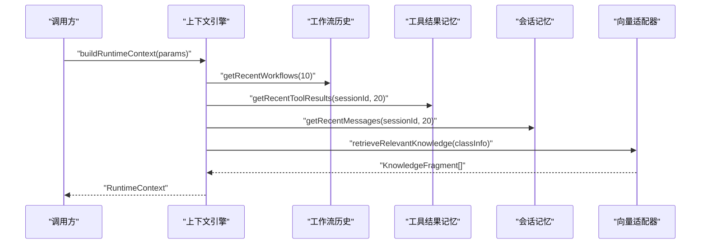

图表来源
- [src/ai/context/contextEngine.ts:62-80](file://src/ai/context/contextEngine.ts#L62-L80)
- [src/ai/context/contextEngine.ts:94-133](file://src/ai/context/contextEngine.ts#L94-L133)

章节来源
- [src/ai/context/contextEngine.ts:37-80](file://src/ai/context/contextEngine.ts#L37-L80)

## 详细组件分析

### 上下文引擎（Context Engine）
- 设计要点
  - 运行时上下文由教师画像、班级信息、近期工作流、工具结果、会话消息与RAG知识组成
  - 并行加载近期工作流、工具结果、会话消息与RAG知识，提升构建效率
  - RAG检索通过向量适配器完成，支持命名空间过滤与最小分数阈值
  - 提供上下文摘要函数，便于日志与监控
- 关键流程
  - 构建sessionId与默认教师画像
  - 并行获取近期工作流、工具结果、会话消息与RAG知识
  - 组装RuntimeContext并返回

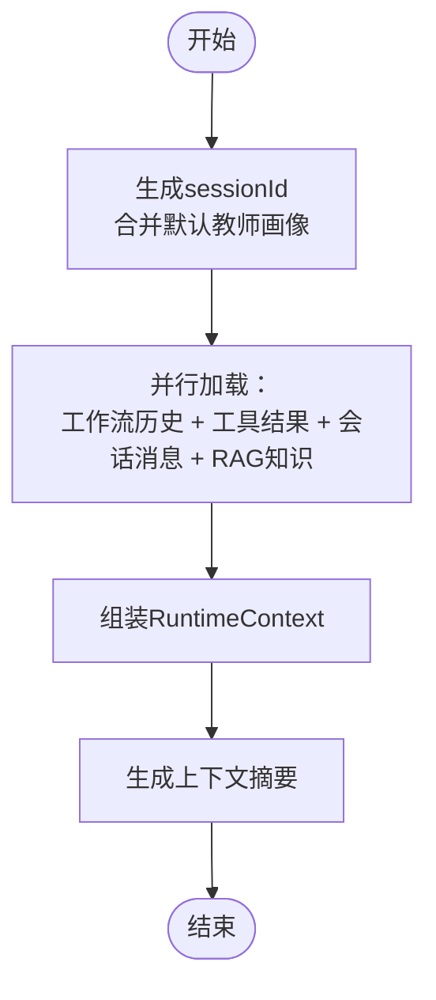

图表来源
- [src/ai/context/contextEngine.ts:48-80](file://src/ai/context/contextEngine.ts#L48-L80)
- [src/ai/context/contextEngine.ts:167-188](file://src/ai/context/contextEngine.ts#L167-L188)

章节来源
- [src/ai/context/contextEngine.ts:37-80](file://src/ai/context/contextEngine.ts#L37-L80)
- [src/ai/context/contextEngine.ts:82-133](file://src/ai/context/contextEngine.ts#L82-L133)
- [src/ai/context/contextEngine.ts:167-188](file://src/ai/context/contextEngine.ts#L167-L188)

### 会话记忆（Session Memory）
- 设计要点
  - 通过存储适配器持久化消息与会话元数据
  - 自动确保会话存在，不存在则先创建
  - 提供上下文窗口估算（按token估算），用于控制提示长度
  - 支持清理会话、列出会话、统计消息数量
- 生命周期与优化
  - 每会话最多保留固定数量的消息，超出则丢弃最早项
  - 会话更新时间与消息计数实时维护

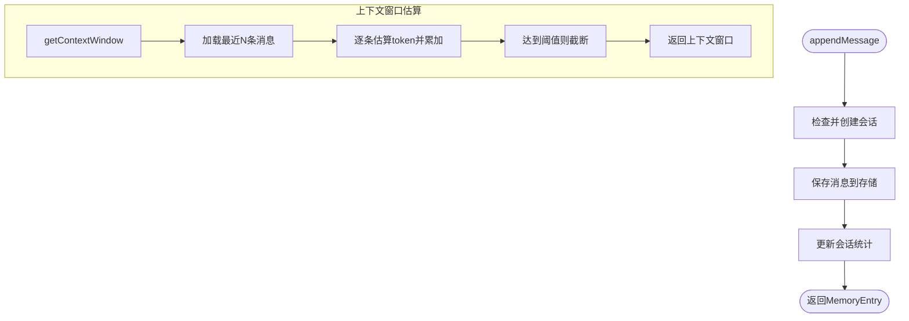

图表来源
- [src/ai/memory/sessionMemory.ts:18-60](file://src/ai/memory/sessionMemory.ts#L18-L60)
- [src/ai/memory/sessionMemory.ts:79-94](file://src/ai/memory/sessionMemory.ts#L79-L94)
- [src/storage/memoryStorage.ts:32-78](file://src/storage/memoryStorage.ts#L32-L78)
- [src/storage/memoryStorage.ts:103-120](file://src/storage/memoryStorage.ts#L103-L120)

章节来源
- [src/ai/memory/sessionMemory.ts:1-115](file://src/ai/memory/sessionMemory.ts#L1-L115)
- [src/storage/memoryStorage.ts:28-167](file://src/storage/memoryStorage.ts#L28-L167)

### 工作流历史（Workflow History）
- 设计要点
  - 记录工作流执行的标识、名称、触发词、状态、起止时间、摘要与工具调用次数
  - 提供最近工作流查询、按类型筛选、获取最后一条记录等便捷方法
- 生命周期与优化
  - 限制最大运行记录数量，超出则删除最早项
  - 清理工作流历史需通过存储层全量清理

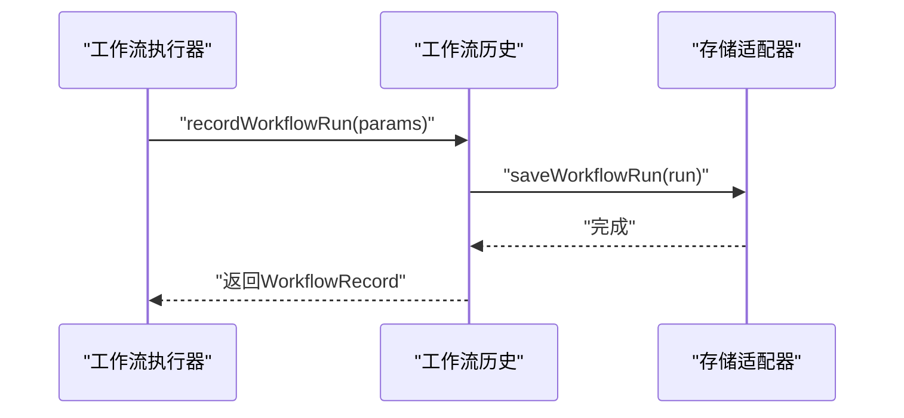

图表来源
- [src/ai/memory/workflowHistory.ts:10-48](file://src/ai/memory/workflowHistory.ts#L10-L48)
- [src/storage/memoryStorage.ts:81-96](file://src/storage/memoryStorage.ts#L81-L96)

章节来源
- [src/ai/memory/workflowHistory.ts:1-79](file://src/ai/memory/workflowHistory.ts#L1-L79)
- [src/storage/memoryStorage.ts:80-100](file://src/storage/memoryStorage.ts#L80-L100)

### 工具结果记忆（Tool Result Memory）
- 设计要点
  - 记录工具名称、参数、结果、时间戳与摘要
  - 提供最近工具结果查询、按工具名获取最后一条结果、全量查询与清理
- 生命周期与优化
  - 每会话最多保留固定数量的工具结果，超出则丢弃最早项

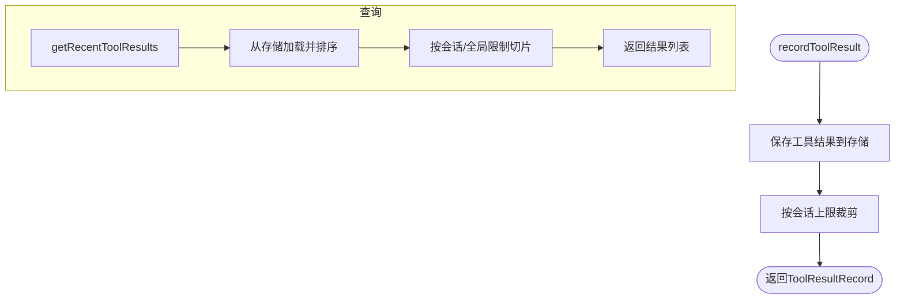

图表来源
- [src/ai/memory/toolResultMemory.ts:10-40](file://src/ai/memory/toolResultMemory.ts#L10-L40)
- [src/ai/memory/toolResultMemory.ts:42-69](file://src/ai/memory/toolResultMemory.ts#L42-L69)
- [src/storage/memoryStorage.ts:103-120](file://src/storage/memoryStorage.ts#L103-L120)

章节来源
- [src/ai/memory/toolResultMemory.ts:1-74](file://src/ai/memory/toolResultMemory.ts#L1-L74)
- [src/storage/memoryStorage.ts:102-120](file://src/storage/memoryStorage.ts#L102-L120)

### 重要性评分器（Importance Scorer）
- 评分规则
  - 基于调用方传入的基础重要性，按记忆类型进行加成
  - 针对教学相关实体（如学生姓名、班级信息）给予额外加分
  - 对低信息量文本施加惩罚
  - 最终归一化到[0,1]区间
- 决策逻辑
  - 重要性≥阈值：写入长期向量存储
  - 重要性<阈值：仅保留会话记忆（短期）

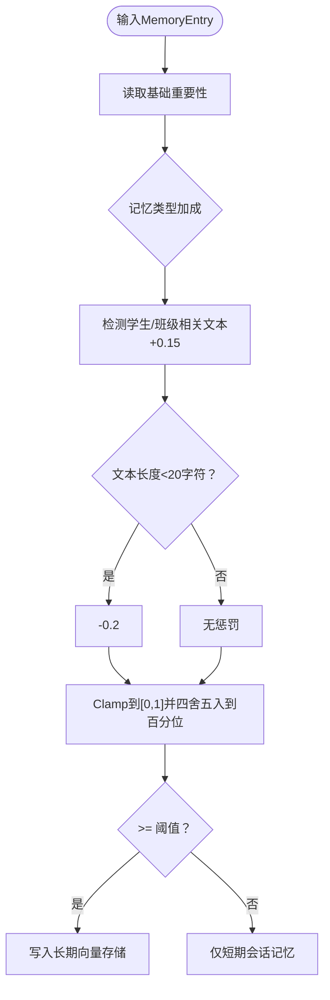

图表来源
- [src/ai/memory/importanceScorer.ts:22-63](file://src/ai/memory/importanceScorer.ts#L22-L63)

章节来源
- [src/ai/memory/importanceScorer.ts:1-71](file://src/ai/memory/importanceScorer.ts#L1-L71)

### 存储适配器（Storage Adapter）
- 抽象接口
  - 会话：保存、加载、列出、删除
  - 消息：保存、查询、清空
  - 工作流运行：保存、查询历史、查询单条
  - 工具结果：保存、查询历史
  - 内存：保存、搜索（关键词+重要性加权）
  - 管理：清空全部
- 默认实现
  - 内存存储：基于Map，提供上限裁剪与排序
  - 生产环境可替换为SQLite/PostgreSQL等

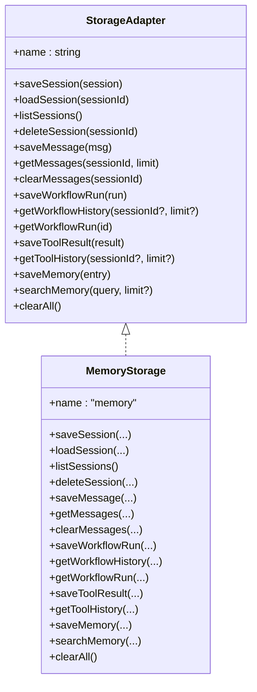

图表来源
- [src/storage/types.ts:71-100](file://src/storage/types.ts#L71-L100)
- [src/storage/memoryStorage.ts:28-167](file://src/storage/memoryStorage.ts#L28-L167)

章节来源
- [src/storage/types.ts:1-101](file://src/storage/types.ts#L1-L101)
- [src/storage/memoryStorage.ts:1-168](file://src/storage/memoryStorage.ts#L1-L168)

### 向量检索（Vector Adapter）
- 设计要点
  - 默认使用Mock向量适配器，支持嵌入生成、向量相似度与关键词增强
  - 支持命名空间过滤、元数据过滤、最小分数阈值与topK返回
- 切换策略
  - 通过入口函数设置/获取当前向量适配器，便于替换为生产向量数据库

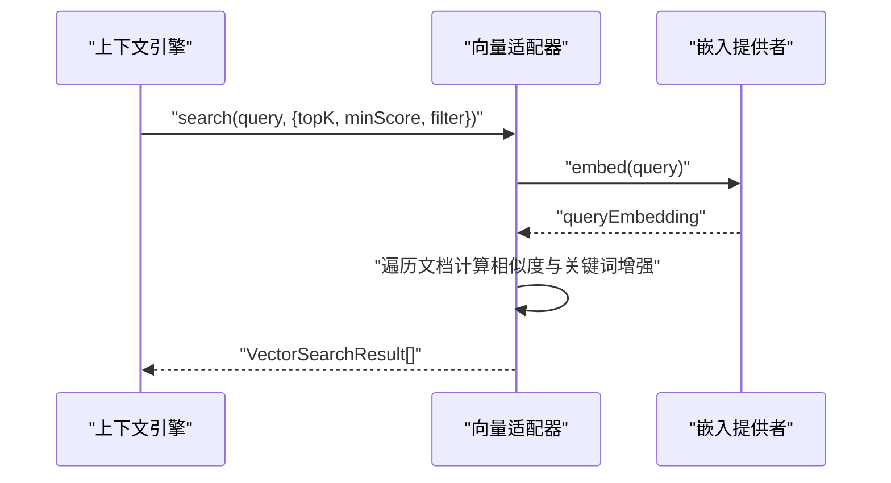

图表来源
- [src/ai/context/contextEngine.ts:94-133](file://src/ai/context/contextEngine.ts#L94-L133)
- [src/vector/index.ts:7-13](file://src/vector/index.ts#L7-L13)
- [src/vector/mockVectorAdapter.ts:43-94](file://src/vector/mockVectorAdapter.ts#L43-L94)

章节来源
- [src/vector/index.ts:1-35](file://src/vector/index.ts#L1-L35)
- [src/vector/mockVectorAdapter.ts:1-112](file://src/vector/mockVectorAdapter.ts#L1-L112)

### 执行链路中的上下文与记忆
- 工作流执行器
  - 接收教师上下文，构建工作流执行上下文，按步骤顺序执行，回调通知UI
- 多智能体执行器
  - 构建运行时上下文，将执行计划与消息注入Agent执行上下文，跨Agent共享结果
- 工具调用执行器
  - 解析LLM返回的工具调用，查找工具并执行，收集结果并汇总

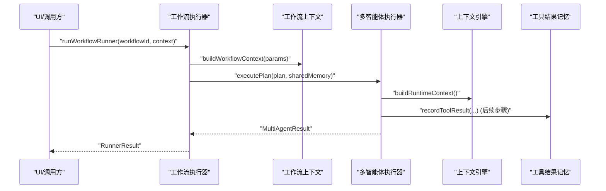

图表来源
- [src/ai/engine/workflowRunner.ts:103-179](file://src/ai/engine/workflowRunner.ts#L103-L179)
- [src/ai/workflows/workflowContext.ts:10-43](file://src/ai/workflows/workflowContext.ts#L10-L43)
- [src/ai/agent/agentExecutor.ts:36-106](file://src/ai/agent/agentExecutor.ts#L36-L106)
- [src/ai/context/contextEngine.ts:37-80](file://src/ai/context/contextEngine.ts#L37-L80)
- [src/ai/tools/executeToolCalls.ts:60-113](file://src/ai/tools/executeToolCalls.ts#L60-L113)

章节来源
- [src/ai/engine/workflowRunner.ts:1-288](file://src/ai/engine/workflowRunner.ts#L1-L288)
- [src/ai/workflows/workflowContext.ts:1-154](file://src/ai/workflows/workflowContext.ts#L1-L154)
- [src/ai/agent/agentExecutor.ts:1-165](file://src/ai/agent/agentExecutor.ts#L1-L165)
- [src/ai/tools/executeToolCalls.ts:1-114](file://src/ai/tools/executeToolCalls.ts#L1-L114)

## 依赖分析
- 组件耦合
  - 上下文引擎依赖存储适配器与向量适配器，用于加载近期活动与RAG检索
  - 记忆子系统均依赖存储适配器，保持一致的数据持久化策略
  - 执行链路（工作流/多智能体/工具调用）在运行时注入上下文与共享记忆
- 外部依赖
  - 向量适配器默认为Mock实现，可通过入口函数切换为生产向量数据库
  - 存储适配器默认为内存实现，可替换为SQLite/PostgreSQL等

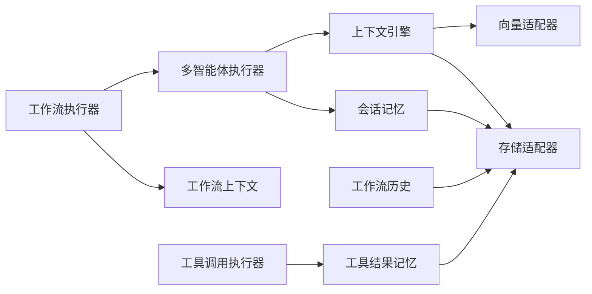

图表来源
- [src/ai/context/contextEngine.ts:12-16](file://src/ai/context/contextEngine.ts#L12-L16)
- [src/ai/memory/sessionMemory.ts](file://src/ai/memory/sessionMemory.ts#L9)
- [src/ai/memory/workflowHistory.ts](file://src/ai/memory/workflowHistory.ts#L6)
- [src/ai/memory/toolResultMemory.ts](file://src/ai/memory/toolResultMemory.ts#L6)
- [src/ai/agent/agentExecutor.ts:19-23](file://src/ai/agent/agentExecutor.ts#L19-L23)
- [src/ai/engine/workflowRunner.ts:17-27](file://src/ai/engine/workflowRunner.ts#L17-L27)
- [src/ai/tools/executeToolCalls.ts:15-17](file://src/ai/tools/executeToolCalls.ts#L15-L17)

章节来源
- [src/ai/context/contextEngine.ts:12-16](file://src/ai/context/contextEngine.ts#L12-L16)
- [src/ai/memory/sessionMemory.ts](file://src/ai/memory/sessionMemory.ts#L9)
- [src/ai/memory/workflowHistory.ts](file://src/ai/memory/workflowHistory.ts#L6)
- [src/ai/memory/toolResultMemory.ts](file://src/ai/memory/toolResultMemory.ts#L6)
- [src/ai/agent/agentExecutor.ts:19-23](file://src/ai/agent/agentExecutor.ts#L19-L23)
- [src/ai/engine/workflowRunner.ts:17-27](file://src/ai/engine/workflowRunner.ts#L17-L27)
- [src/ai/tools/executeToolCalls.ts:15-17](file://src/ai/tools/executeToolCalls.ts#L15-L17)

## 性能考虑
- 并行加载：上下文构建时并行获取近期工作流、工具结果与会话消息，减少等待时间
- 上下文窗口估算：按token估算控制提示长度，避免超过模型上下文上限
- 存储裁剪：每会话消息与工具结果、工作流运行、内存条目均设置上限，防止无限增长
- 向量检索阈值：通过最小分数与topK限制，平衡召回质量与性能
- 重要性评分：快速加权与归一化，避免复杂计算影响实时性

## 故障排查指南
- 上下文构建失败
  - 检查向量适配器是否可用，若不可用将回退到模拟知识片段
  - 确认存储适配器初始化与会话创建流程
- 记忆缺失或过期
  - 检查存储裁剪策略（每会话上限）是否导致早期数据被移除
  - 确认工作流历史与工具结果的清理策略
- 重要性评分异常
  - 核对评分规则与阈值，确认文本长度与教学相关实体识别
- 执行链路问题
  - 多智能体执行器中检查共享内存与消息注入是否正确
  - 工具调用执行器中核对工具注册与参数解析

章节来源
- [src/ai/context/contextEngine.ts:129-133](file://src/ai/context/contextEngine.ts#L129-L133)
- [src/storage/memoryStorage.ts:60-62](file://src/storage/memoryStorage.ts#L60-L62)
- [src/storage/memoryStorage.ts](file://src/storage/memoryStorage.ts#L107)
- [src/ai/memory/importanceScorer.ts:52-58](file://src/ai/memory/importanceScorer.ts#L52-L58)
- [src/ai/agent/agentExecutor.ts:131-140](file://src/ai/agent/agentExecutor.ts#L131-L140)
- [src/ai/tools/executeToolCalls.ts:78-91](file://src/ai/tools/executeToolCalls.ts#L78-L91)

## 结论
本系统通过“上下文引擎 + 统一存储适配器 + 重要性评分器”的组合，实现了教育场景下的高效上下文构建与记忆管理。三类记忆系统分别覆盖对话、执行与工具调用的关键信息，配合RAG检索与并行加载策略，在保证实时性的同时提升了教学决策的质量。通过清晰的抽象接口与可替换的适配器，系统具备良好的扩展性与可维护性。

## 附录
- 类型与导出
  - 上下文类型与导出：RuntimeContext、TeacherProfile、ClassInfo、MemoryEntry、WorkflowRecord、ToolResultRecord、KnowledgeFragment、SystemPromptParts
  - 记忆模块导出：会话记忆、工具结果记忆、工作流历史、重要性评分器

章节来源
- [src/ai/context/types.ts:1-128](file://src/ai/context/types.ts#L1-L128)
- [src/ai/context/index.ts:1-13](file://src/ai/context/index.ts#L1-L13)
- [src/ai/memory/index.ts:1-31](file://src/ai/memory/index.ts#L1-L31)