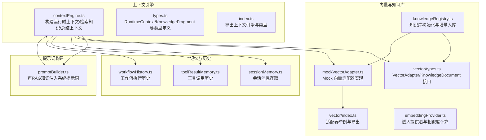
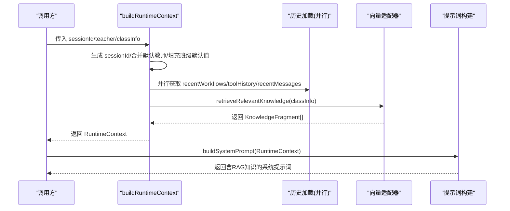
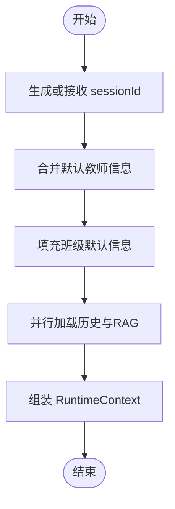
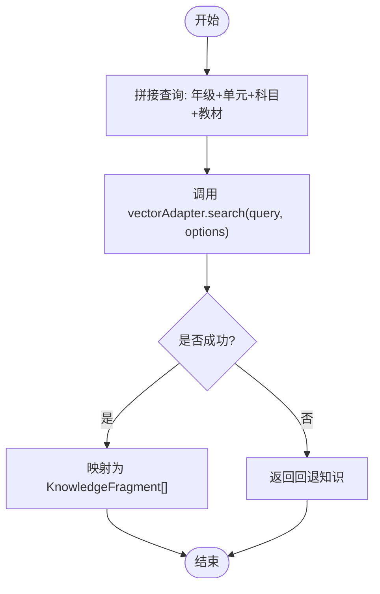
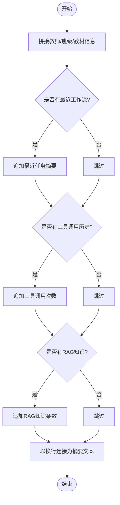
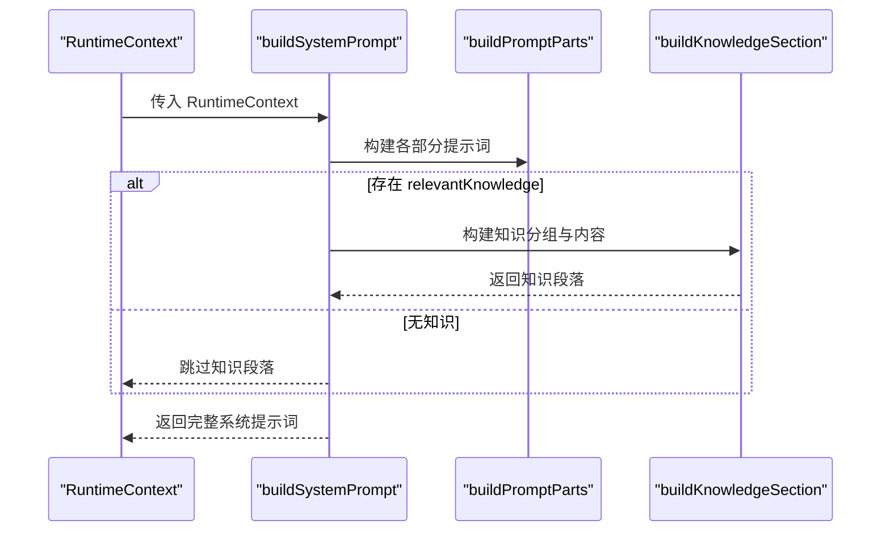
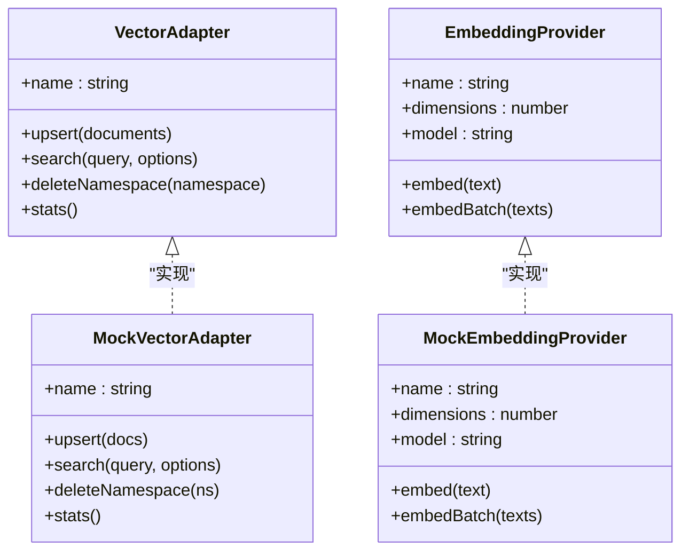
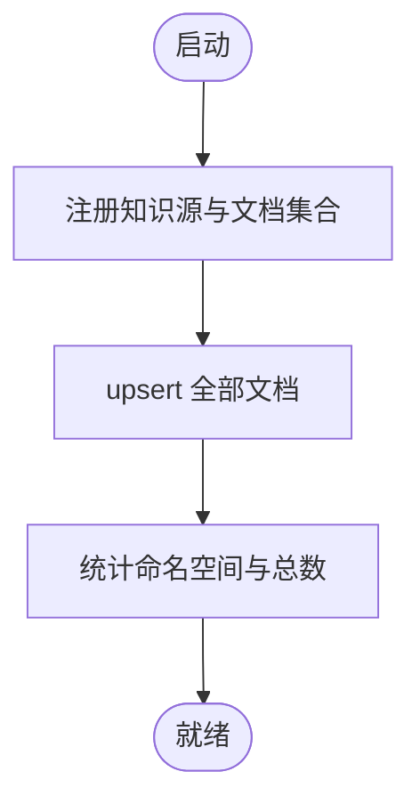
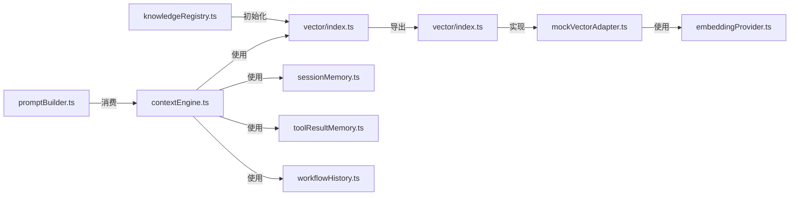

# 上下文引擎

<cite>
**本文档引用的文件**
- [contextEngine.ts](file://src/ai/context/contextEngine.ts)
- [types.ts](file://src/ai/context/types.ts)
- [index.ts](file://src/ai/context/index.ts)
- [promptBuilder.ts](file://src/ai/prompt/promptBuilder.ts)
- [types.ts](file://src/vector/types.ts)
- [mockVectorAdapter.ts](file://src/vector/mockVectorAdapter.ts)
- [index.ts](file://src/vector/index.ts)
- [embeddingProvider.ts](file://src/vector/embeddingProvider.ts)
- [knowledgeRegistry.ts](file://src/knowledge/knowledgeRegistry.ts)
- [sessionMemory.ts](file://src/ai/memory/sessionMemory.ts)
- [toolResultMemory.ts](file://src/ai/memory/toolResultMemory.ts)
- [workflowHistory.ts](file://src/ai/memory/workflowHistory.ts)
</cite>

## 目录
1. [简介](#简介)
2. [项目结构](#项目结构)
3. [核心组件](#核心组件)
4. [架构总览](#架构总览)
5. [详细组件分析](#详细组件分析)
6. [依赖关系分析](#依赖关系分析)
7. [性能考量](#性能考量)
8. [故障排查指南](#故障排查指南)
9. [结论](#结论)
10. [附录](#附录)

## 简介
本文件面向小天AI教育平台的上下文引擎，系统性阐述其核心架构与RAG（检索增强生成）集成机制。重点覆盖以下方面：
- buildRuntimeContext 的工作流程：会话ID生成、教师信息构建、班级信息处理、并行加载历史与向量检索。
- retrieveRelevantKnowledge 的向量检索算法与知识片段转换过程。
- 上下文总结功能 summarizeContext 的实现原理。
- 上下文参数配置、默认值设置与错误处理机制。
- 扩展开发指南与性能优化建议。
- 提供完整的上下文管理实现框架说明。

## 项目结构
上下文引擎位于 src/ai/context，围绕 RuntimeContext 类型与三个关键函数构建：buildRuntimeContext、retrieveRelevantKnowledge、summarizeContext；同时通过 promptBuilder 将检索到的知识注入系统提示词，形成端到端的RAG工作流。

图表来源
- [contextEngine.ts:1-189](file://src/ai/context/contextEngine.ts#L1-L189)
- [types.ts:1-128](file://src/ai/context/types.ts#L1-L128)
- [promptBuilder.ts:1-145](file://src/ai/prompt/promptBuilder.ts#L1-L145)
- [types.ts:1-115](file://src/vector/types.ts#L1-L115)
- [mockVectorAdapter.ts:1-112](file://src/vector/mockVectorAdapter.ts#L1-L112)
- [index.ts:1-34](file://src/vector/index.ts#L1-L34)
- [embeddingProvider.ts:1-138](file://src/vector/embeddingProvider.ts#L1-L138)
- [knowledgeRegistry.ts:41-108](file://src/knowledge/knowledgeRegistry.ts#L41-L108)
- [sessionMemory.ts:1-115](file://src/ai/memory/sessionMemory.ts#L1-L115)
- [toolResultMemory.ts:1-74](file://src/ai/memory/toolResultMemory.ts#L1-L74)
- [workflowHistory.ts:1-79](file://src/ai/memory/workflowHistory.ts#L1-L79)

章节来源
- [contextEngine.ts:1-189](file://src/ai/context/contextEngine.ts#L1-L189)
- [types.ts:1-128](file://src/ai/context/types.ts#L1-L128)
- [promptBuilder.ts:1-145](file://src/ai/prompt/promptBuilder.ts#L1-L145)
- [types.ts:1-115](file://src/vector/types.ts#L1-L115)
- [mockVectorAdapter.ts:1-112](file://src/vector/mockVectorAdapter.ts#L1-L112)
- [index.ts:1-34](file://src/vector/index.ts#L1-L34)
- [embeddingProvider.ts:1-138](file://src/vector/embeddingProvider.ts#L1-L138)
- [knowledgeRegistry.ts:41-108](file://src/knowledge/knowledgeRegistry.ts#L41-L108)
- [sessionMemory.ts:1-115](file://src/ai/memory/sessionMemory.ts#L1-L115)
- [toolResultMemory.ts:1-74](file://src/ai/memory/toolResultMemory.ts#L1-L74)
- [workflowHistory.ts:1-79](file://src/ai/memory/workflowHistory.ts#L1-L79)

## 核心组件
- 运行时上下文 RuntimeContext：承载会话标识、教师画像、班级信息、近期工作流、工具调用、会话消息、RAG检索到的知识片段以及构建时间戳。
- 上下文构建器 buildRuntimeContext：负责并行加载历史数据与RAG知识，组装 RuntimeContext。
- RAG检索器 retrieveRelevantKnowledge：基于班级上下文构建查询，调用向量适配器检索，转换为知识片段。
- 上下文总结 summarizeContext：将教师、班级、近期活动与RAG知识摘要为一段文本，供提示词构建使用。
- 提示词构建器 buildSystemPrompt：自动将 RAG 知识注入系统提示词，无需工作流层手工拼接。

章节来源
- [types.ts:76-128](file://src/ai/context/types.ts#L76-L128)
- [contextEngine.ts:37-80](file://src/ai/context/contextEngine.ts#L37-L80)
- [contextEngine.ts:94-133](file://src/ai/context/contextEngine.ts#L94-L133)
- [contextEngine.ts:167-188](file://src/ai/context/contextEngine.ts#L167-L188)
- [promptBuilder.ts:13-48](file://src/ai/prompt/promptBuilder.ts#L13-L48)

## 架构总览
上下文引擎采用“运行时上下文 + RAG检索 + 提示词注入”的三层协作模式：
- 输入层：调用方传入可选的会话ID、教师部分信息、班级信息。
- 处理层：并行加载近期工作流、工具调用、会话消息与RAG知识；RAG知识由向量适配器检索并转换为知识片段。
- 输出层：返回 RuntimeContext；提示词构建器自动将 RAG 知识注入系统提示词。

图表来源
- [contextEngine.ts:37-80](file://src/ai/context/contextEngine.ts#L37-L80)
- [contextEngine.ts:94-133](file://src/ai/context/contextEngine.ts#L94-L133)
- [promptBuilder.ts:13-36](file://src/ai/prompt/promptBuilder.ts#L13-L36)

## 详细组件分析

### 组件一：buildRuntimeContext（运行时上下文构建）
- 会话ID生成：若未提供则以时间戳+自增计数器生成唯一ID。
- 教师信息构建：以默认教师为基础，合并传入的部分信息。
- 班级信息处理：对缺失字段使用默认值，确保后续检索与提示词构建可用。
- 历史与RAG并行加载：通过 Promise.all 并行获取近期工作流、工具调用、会话消息与RAG知识，提升整体吞吐。
- 返回 RuntimeContext：包含所有上下文要素与构建时间戳。

图表来源
- [contextEngine.ts:37-80](file://src/ai/context/contextEngine.ts#L37-L80)

章节来源
- [contextEngine.ts:37-80](file://src/ai/context/contextEngine.ts#L37-L80)

### 组件二：retrieveRelevantKnowledge（RAG检索）
- 查询构建：从班级信息中提取年级、单元、科目与教材，拼接为查询字符串。
- 向量搜索：调用 getVectorAdapter().search，设置 topK、最小分数阈值与按学科过滤。
- 结果转换：将 VectorSearchResult 转换为 KnowledgeFragment，保留文档ID、内容、来源、相关性与元数据。
- 错误回退：当向量搜索异常时，返回内置的回退知识列表，保证系统可用性。

图表来源
- [contextEngine.ts:94-133](file://src/ai/context/contextEngine.ts#L94-L133)
- [types.ts:47-51](file://src/vector/types.ts#L47-L51)

章节来源
- [contextEngine.ts:94-133](file://src/ai/context/contextEngine.ts#L94-L133)
- [types.ts:47-51](file://src/vector/types.ts#L47-L51)

### 组件三：summarizeContext（上下文摘要）
- 摘要内容：教师姓名与部门、班级名称/年级/人数、教材与当前单元。
- 可选补充：最近工作流（任务名与摘要）、工具调用次数、RAG知识条数。
- 输出格式：以换行分隔的字符串，便于提示词构建器直接使用。

图表来源
- [contextEngine.ts:167-188](file://src/ai/context/contextEngine.ts#L167-L188)

章节来源
- [contextEngine.ts:167-188](file://src/ai/context/contextEngine.ts#L167-L188)

### 组件四：提示词构建与RAG注入（promptBuilder）
- 分段构建：角色、教学上下文（含摘要）、最近活动、能力清单、行为约束。
- RAG注入：若存在相关知识，则按类型分组并插入到能力清单之后，作为系统提示的一部分。
- 自动化：工作流层无需手动拼接知识，由提示词构建器自动完成。

图表来源
- [promptBuilder.ts:13-48](file://src/ai/prompt/promptBuilder.ts#L13-L48)
- [promptBuilder.ts:84-118](file://src/ai/prompt/promptBuilder.ts#L84-L118)

章节来源
- [promptBuilder.ts:13-48](file://src/ai/prompt/promptBuilder.ts#L13-L48)
- [promptBuilder.ts:84-118](file://src/ai/prompt/promptBuilder.ts#L84-L118)

### 组件五：向量适配器与嵌入提供者（Mock 实现）
- VectorAdapter 抽象：统一 upsert、search、deleteNamespace、stats 等接口，屏蔽底层向量库差异。
- MockVectorAdapter：内存数组存储 + 嵌入提供者生成假向量，支持命名空间与元数据过滤、关键词增强、重要性加权等打分策略。
- EmbeddingProvider：提供嵌入生成与批量嵌入能力，默认使用 mock 实现，支持 cosine 相似度计算。

图表来源
- [types.ts:83-114](file://src/vector/types.ts#L83-L114)
- [mockVectorAdapter.ts:20-111](file://src/vector/mockVectorAdapter.ts#L20-L111)
- [embeddingProvider.ts:21-86](file://src/vector/embeddingProvider.ts#L21-L86)

章节来源
- [types.ts:83-114](file://src/vector/types.ts#L83-L114)
- [mockVectorAdapter.ts:20-111](file://src/vector/mockVectorAdapter.ts#L20-L111)
- [embeddingProvider.ts:21-86](file://src/vector/embeddingProvider.ts#L21-L86)

### 组件六：知识库初始化与动态入库
- 初始化：在应用启动时注册多个知识源（如教学大纲、策略库、常见错误、考试信息），并将全部文档 upsert 到向量存储。
- 动态入库：支持运行时新增单个或批量知识文档，实时进入检索范围。

图表来源
- [knowledgeRegistry.ts:47-92](file://src/knowledge/knowledgeRegistry.ts#L47-L92)

章节来源
- [knowledgeRegistry.ts:47-92](file://src/knowledge/knowledgeRegistry.ts#L47-L92)

## 依赖关系分析
- 上下文引擎依赖：
  - 向量适配器：用于检索相关教学知识。
  - 记忆模块：加载近期工作流、工具调用与会话消息。
  - 提示词构建器：消费 RuntimeContext 生成系统提示词。
- 向量与知识库依赖：
  - VectorAdapter 抽象屏蔽具体向量库实现。
  - MockVectorAdapter 提供演示环境下的完整检索能力。
  - 嵌入提供者负责文本向量化与相似度计算。
- 知识库依赖：
  - knowledgeRegistry 在启动时初始化知识库，支持后续动态增量入库。

图表来源
- [contextEngine.ts:12-16](file://src/ai/context/contextEngine.ts#L12-L16)
- [promptBuilder.ts:8-9](file://src/ai/prompt/promptBuilder.ts#L8-L9)
- [index.ts:1-34](file://src/vector/index.ts#L1-L34)
- [mockVectorAdapter.ts:11-12](file://src/vector/mockVectorAdapter.ts#L11-L12)
- [embeddingProvider.ts:13](file://src/vector/embeddingProvider.ts#L13)
- [knowledgeRegistry.ts:51-59](file://src/knowledge/knowledgeRegistry.ts#L51-L59)

章节来源
- [contextEngine.ts:12-16](file://src/ai/context/contextEngine.ts#L12-L16)
- [promptBuilder.ts:8-9](file://src/ai/prompt/promptBuilder.ts#L8-L9)
- [index.ts:1-34](file://src/vector/index.ts#L1-L34)
- [mockVectorAdapter.ts:11-12](file://src/vector/mockVectorAdapter.ts#L11-L12)
- [embeddingProvider.ts:13](file://src/vector/embeddingProvider.ts#L13)
- [knowledgeRegistry.ts:51-59](file://src/knowledge/knowledgeRegistry.ts#L51-L59)

## 性能考量
- 并行加载：buildRuntimeContext 对历史与RAG检索采用 Promise.all 并行执行，减少等待时间。
- 检索参数：topK、minScore、filter 控制召回数量与质量，建议根据业务规模调整。
- 打分策略：向量相似度（70%）+ 关键词命中（20%）+ 文档重要性（10%），兼顾召回与相关性。
- 嵌入维度：演示使用低维向量（128维），生产环境建议使用更高维（1024-3072）以提升检索精度。
- 缓存与预热：知识库初始化后可进行预热检索，降低首次延迟。
- 限流与降级：在高并发场景下，可限制检索并发数并在向量服务不可用时快速回退。

## 故障排查指南
- 向量检索失败：
  - 现象：retrieveRelevantKnowledge 抛出异常。
  - 处理：函数内部已捕获并回退到内置回退知识，确保系统可用；检查向量适配器状态与网络连通性。
- 知识库未初始化：
  - 现象：检索结果为空。
  - 处理：确认应用启动时已调用知识库初始化流程；检查注册的知识源与文档是否正确 upsert。
- 嵌入提供者异常：
  - 现象：向量生成失败或维度不匹配。
  - 处理：切换到 mock 提供者验证链路；生产环境配置真实嵌入服务并校验模型与维度。
- 提示词过大：
  - 现象：LLM输入超长。
  - 处理：控制 RAG 知识注入数量（调整 topK），或精简知识片段内容。

章节来源
- [contextEngine.ts:129-132](file://src/ai/context/contextEngine.ts#L129-L132)
- [knowledgeRegistry.ts:82-92](file://src/knowledge/knowledgeRegistry.ts#L82-L92)
- [mockVectorAdapter.ts:43-94](file://src/vector/mockVectorAdapter.ts#L43-L94)

## 结论
上下文引擎通过“运行时上下文 + RAG检索 + 提示词注入”的一体化设计，实现了教学场景下的智能上下文感知与知识增强。其默认采用 Mock 向量与嵌入实现，便于快速验证；生产部署时可无缝替换为真实向量库与嵌入服务。配合完善的类型定义、并行加载与错误回退机制，该引擎为小天AI教育平台提供了稳定、可扩展的上下文支撑。

## 附录

### 参数配置与默认值
- 教师默认信息：包含姓名、学科、学校、部门与偏好（默写模式、练习数量、难度、教材）。
- 班级默认信息：包含班级名、年级、人数、教材、当前单元、地区。
- RAG检索默认参数：topK=5、minScore=0.1、subject=english。
- 会话ID生成：基于时间戳与自增计数器。

章节来源
- [contextEngine.ts:20-31](file://src/ai/context/contextEngine.ts#L20-L31)
- [contextEngine.ts:52-59](file://src/ai/context/contextEngine.ts#L52-L59)
- [contextEngine.ts:108-114](file://src/ai/context/contextEngine.ts#L108-L114)
- [contextEngine.ts:49](file://src/ai/context/contextEngine.ts#L49)

### 扩展开发指南
- 替换向量适配器：通过 vector/index.ts 的单例方法切换至真实向量库实现。
- 自定义检索策略：在 retrieveRelevantKnowledge 中扩展查询构建逻辑或增加重排序（re-ranking）。
- 新增知识源：在知识库注册处新增命名空间与文档集合，并在初始化流程中纳入 upsert。
- 提示词扩展：在 promptBuilder 中扩展分段或新增注入规则，满足更复杂的教学场景。

章节来源
- [index.ts:7-13](file://src/vector/index.ts#L7-L13)
- [contextEngine.ts:94-133](file://src/ai/context/contextEngine.ts#L94-L133)
- [knowledgeRegistry.ts:54-80](file://src/knowledge/knowledgeRegistry.ts#L54-L80)
- [promptBuilder.ts:84-118](file://src/ai/prompt/promptBuilder.ts#L84-L118)