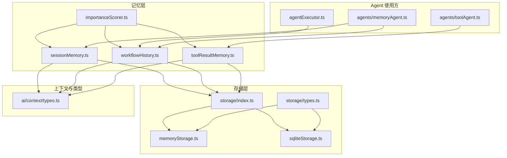
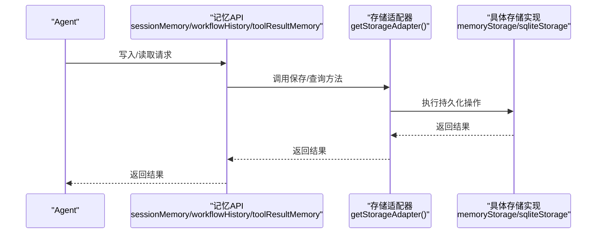
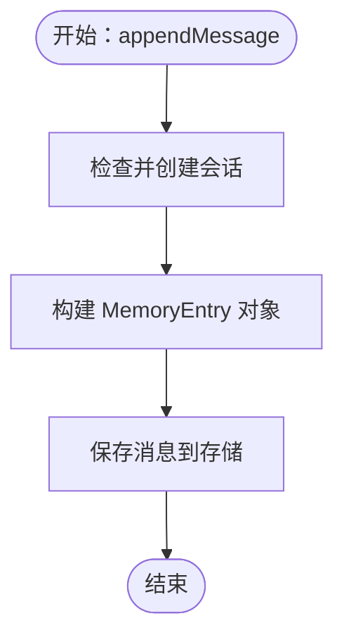
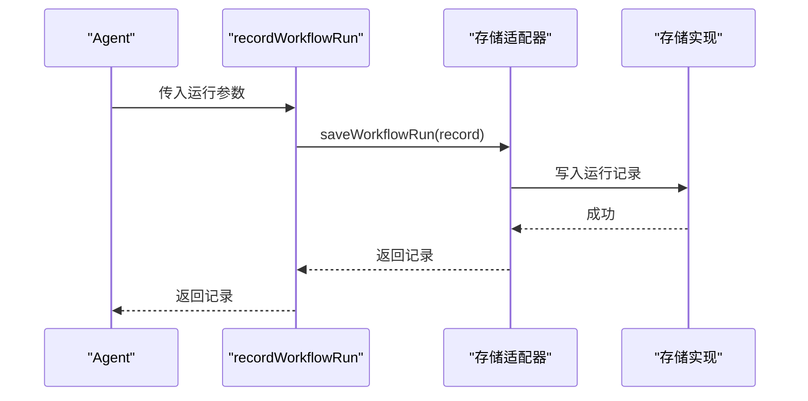
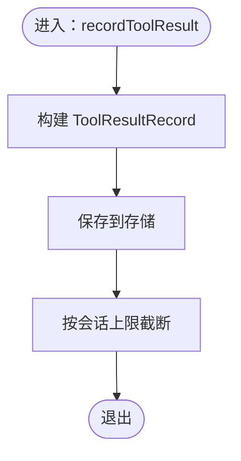
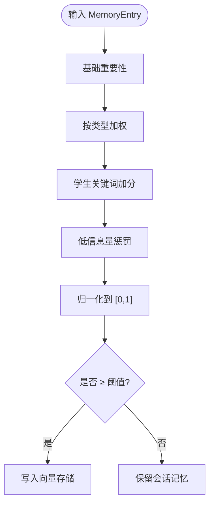
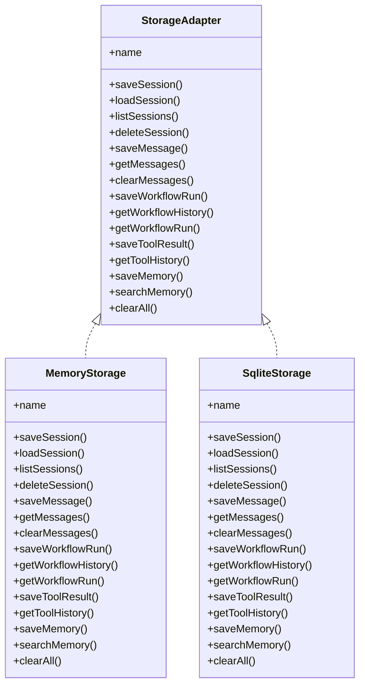

# 记忆系统

<cite>
**本文引用的文件**
- [src/ai/memory/sessionMemory.ts](file://src/ai/memory/sessionMemory.ts)
- [src/ai/memory/workflowHistory.ts](file://src/ai/memory/workflowHistory.ts)
- [src/ai/memory/toolResultMemory.ts](file://src/ai/memory/toolResultMemory.ts)
- [src/ai/memory/index.ts](file://src/ai/memory/index.ts)
- [src/ai/memory/importanceScorer.ts](file://src/ai/memory/importanceScorer.ts)
- [src/storage/index.ts](file://src/storage/index.ts)
- [src/storage/types.ts](file://src/storage/types.ts)
- [src/storage/memoryStorage.ts](file://src/storage/memoryStorage.ts)
- [src/storage/sqliteStorage.ts](file://src/storage/sqliteStorage.ts)
- [src/ai/context/types.ts](file://src/ai/context/types.ts)
- [src/ai/agent/agentExecutor.ts](file://src/ai/agent/agentExecutor.ts)
- [src/ai/agents/memoryAgent.ts](file://src/ai/agents/memoryAgent.ts)
- [src/ai/agents/toolAgent.ts](file://src/ai/agents/toolAgent.ts)
</cite>

## 目录
1. [简介](#简介)
2. [项目结构](#项目结构)
3. [核心组件](#核心组件)
4. [架构总览](#架构总览)
5. [详细组件分析](#详细组件分析)
6. [依赖关系分析](#依赖关系分析)
7. [性能考量](#性能考量)
8. [故障排查指南](#故障排查指南)
9. [结论](#结论)
10. [附录](#附录)

## 简介
本文件为小天AI教育平台的记忆系统技术文档，聚焦三类存储：
- 会话记忆（sessionMemory）：面向对话上下文与近期交互的短期记忆
- 工作流历史（workflowHistory）：面向工作流执行轨迹与结果的审计型历史
- 工具结果记忆（toolResultMemory）：面向工具调用结果的可检索历史

文档将从存储结构、数据格式、访问模式、生命周期与清理策略、并发与一致性、序列化/反序列化、性能优化与内存管理、以及扩展与适配器开发等方面进行系统化说明，并提供可视化图示与实践建议。

## 项目结构
记忆系统位于 src/ai/memory 下，围绕统一的存储适配器接口进行数据持久化；存储层位于 src/storage，提供默认内存实现与未来可替换的 SQLite 实现。上层 Agent 在执行流程中按需写入与读取记忆。

图表来源
- [src/ai/memory/sessionMemory.ts:1-115](file://src/ai/memory/sessionMemory.ts#L1-L115)
- [src/ai/memory/workflowHistory.ts:1-79](file://src/ai/memory/workflowHistory.ts#L1-L79)
- [src/ai/memory/toolResultMemory.ts:1-74](file://src/ai/memory/toolResultMemory.ts#L1-L74)
- [src/ai/memory/importanceScorer.ts:1-71](file://src/ai/memory/importanceScorer.ts#L1-L71)
- [src/storage/index.ts:1-36](file://src/storage/index.ts#L1-L36)
- [src/storage/types.ts:1-101](file://src/storage/types.ts#L1-L101)
- [src/storage/memoryStorage.ts:1-168](file://src/storage/memoryStorage.ts#L1-L168)
- [src/storage/sqliteStorage.ts:1-166](file://src/storage/sqliteStorage.ts#L1-L166)
- [src/ai/context/types.ts:1-128](file://src/ai/context/types.ts#L1-L128)
- [src/ai/agent/agentExecutor.ts:150-165](file://src/ai/agent/agentExecutor.ts#L150-L165)
- [src/ai/agents/memoryAgent.ts:30-78](file://src/ai/agents/memoryAgent.ts#L30-L78)
- [src/ai/agents/toolAgent.ts:60-97](file://src/ai/agents/toolAgent.ts#L60-L97)

章节来源
- [src/ai/memory/index.ts:1-31](file://src/ai/memory/index.ts#L1-L31)
- [src/storage/index.ts:1-36](file://src/storage/index.ts#L1-L36)

## 核心组件
- 会话记忆（sessionMemory）
  - 存储结构：基于 sessionId 维度的消息列表，支持最近消息查询与上下文窗口估算
  - 数据格式：MemoryEntry（包含 id、type、timestamp、sessionId、data、summary、importance）
  - 访问模式：追加消息、获取最近消息、按 token 上下文窗口裁剪、清空会话、列出会话、统计消息数
- 工作流历史（workflowHistory）
  - 存储结构：以运行记录为主，包含触发条件、状态、耗时、摘要、工具调用次数等
  - 数据格式：WorkflowRecord（包含 id、workflowId、workflowName、trigger、status、startedAt、completedAt、summary、toolCallCount）
  - 访问模式：记录运行、获取最近若干条、按类型筛选、获取最新一次
- 工具结果记忆（toolResultMemory）
  - 存储结构：按 sessionId 维度的结果队列，支持最近结果查询与按工具名回溯
  - 数据格式：ToolResultRecord（包含 id、toolName、args、result、timestamp、sessionId、summary）
  - 访问模式：记录结果、获取最近若干条、按工具名获取最后一次、获取全部

章节来源
- [src/ai/memory/sessionMemory.ts:18-115](file://src/ai/memory/sessionMemory.ts#L18-L115)
- [src/ai/memory/workflowHistory.ts:10-79](file://src/ai/memory/workflowHistory.ts#L10-L79)
- [src/ai/memory/toolResultMemory.ts:10-74](file://src/ai/memory/toolResultMemory.ts#L10-L74)
- [src/ai/context/types.ts:39-74](file://src/ai/context/types.ts#L39-L74)

## 架构总览
记忆系统采用“上层记忆 API + 存储适配器”的分层设计。所有上层模块通过全局适配器实例进行读写，适配器默认为内存实现，可在生产环境替换为 SQLite 等持久化存储。

图表来源
- [src/ai/memory/sessionMemory.ts:24-59](file://src/ai/memory/sessionMemory.ts#L24-L59)
- [src/ai/memory/workflowHistory.ts:18-47](file://src/ai/memory/workflowHistory.ts#L18-L47)
- [src/ai/memory/toolResultMemory.ts:16-39](file://src/ai/memory/toolResultMemory.ts#L16-L39)
- [src/storage/index.ts:20-22](file://src/storage/index.ts#L20-L22)
- [src/storage/memoryStorage.ts:28-167](file://src/storage/memoryStorage.ts#L28-L167)
- [src/storage/sqliteStorage.ts:60-165](file://src/storage/sqliteStorage.ts#L60-L165)

## 详细组件分析

### 会话记忆（sessionMemory）
- 存储结构与数据格式
  - 以 sessionId 为键，维护消息数组；每条消息为 MemoryEntry
  - 支持按时间倒序返回最近 N 条消息
- 生命周期与清理
  - 单会话最多保留固定数量的历史消息（例如 200），超出则丢弃最早项
  - 清理会话时删除对应消息列表
- 访问模式
  - 追加消息：生成唯一 id，确保会话存在，保存消息
  - 获取最近消息：限制返回条数
  - 上下文窗口：按预估 token 数从最近向前累加，达到阈值停止
  - 清空会话、列出会话、统计消息数
- 并发与一致性
  - 通过单一适配器实例串行化读写，避免竞态
  - 会话存在性检查与消息保存在同一流程内完成，减少不一致风险
- 性能与内存
  - 消息列表截断与排序在内存中完成，复杂度 O(n)
  - 上下文窗口遍历从尾部向前，平均 O(k)，k 为窗口大小
- 序列化/反序列化
  - 适配器层负责对象序列化（如 JSON）与反序列化，API 层传入原始对象
- 使用示例
  - Agent 在执行后将协作结果写入会话记忆，作为后续推理依据

图表来源
- [src/ai/memory/sessionMemory.ts:18-60](file://src/ai/memory/sessionMemory.ts#L18-L60)

章节来源
- [src/ai/memory/sessionMemory.ts:18-115](file://src/ai/memory/sessionMemory.ts#L18-L115)
- [src/storage/memoryStorage.ts:32-78](file://src/storage/memoryStorage.ts#L32-L78)
- [src/storage/types.ts:16-32](file://src/storage/types.ts#L16-L32)

### 工作流历史（workflowHistory）
- 存储结构与数据格式
  - 以运行记录为单位，包含工作流标识、名称、触发来源、状态、起止时间、摘要、工具调用计数等
- 生命周期与清理
  - 全局运行记录上限控制（例如 100），超出则删除最早项
  - 提供按会话维度过滤查询
- 访问模式
  - 记录运行：生成唯一 id，保存运行记录
  - 获取最近若干条：支持按会话过滤
  - 按类型筛选：根据 workflowId 过滤
  - 获取最新一次：基于最近列表取首项
- 并发与一致性
  - 通过适配器层的原子写入与有序读取保障一致性
- 性能与内存
  - 运行记录按 id 排序，查询时按时间倒序切片，复杂度 O(n log n) 主要来自排序
- 序列化/反序列化
  - 适配器层处理对象序列化与反序列化
- 使用示例
  - 多 Agent 协作完成后记录一次运行，便于审计与复盘

图表来源
- [src/ai/memory/workflowHistory.ts:10-48](file://src/ai/memory/workflowHistory.ts#L10-L48)
- [src/storage/memoryStorage.ts:81-96](file://src/storage/memoryStorage.ts#L81-L96)

章节来源
- [src/ai/memory/workflowHistory.ts:1-79](file://src/ai/memory/workflowHistory.ts#L1-L79)
- [src/storage/memoryStorage.ts:80-96](file://src/storage/memoryStorage.ts#L80-L96)
- [src/storage/types.ts:34-46](file://src/storage/types.ts#L34-L46)

### 工具结果记忆（toolResultMemory）
- 存储结构与数据格式
  - 以 sessionId 为键，维护工具结果数组；每条结果为 ToolResultRecord
- 生命周期与清理
  - 单会话最多保留固定数量的结果（例如 100），超出则丢弃最早项
- 访问模式
  - 记录结果：生成唯一 id，保存结果
  - 获取最近若干条：支持按会话过滤
  - 按工具名获取最后一次：对最近结果集进行筛选
  - 获取全部：限定最大返回量
- 并发与一致性
  - 同一会话内的写入与读取通过适配器层串行化
- 性能与内存
  - 结果列表截断与排序在内存中完成，查询时线性筛选，复杂度 O(n)
- 序列化/反序列化
  - 适配器层负责对象序列化与反序列化
- 使用示例
  - 工具执行完成后记录结果，供后续 Agent 查询与复用

图表来源
- [src/ai/memory/toolResultMemory.ts:10-40](file://src/ai/memory/toolResultMemory.ts#L10-L40)
- [src/storage/memoryStorage.ts:103-120](file://src/storage/memoryStorage.ts#L103-L120)

章节来源
- [src/ai/memory/toolResultMemory.ts:1-74](file://src/ai/memory/toolResultMemory.ts#L1-L74)
- [src/storage/memoryStorage.ts:102-120](file://src/storage/memoryStorage.ts#L102-L120)
- [src/storage/types.ts:48-56](file://src/storage/types.ts#L48-L56)

### 重要性评分与长期记忆选择（importanceScorer）
- 评分维度
  - 工作流成功完成、工具执行成功且有数据、洞察、偏好、消息等不同权重加分
  - 包含学生相关关键词与低信息量惩罚
- 决策阈值
  - 重要性 ≥ 阈值 → 写入向量长期记忆
  - 重要性 < 阈值 → 仅保留会话短期记忆
- 过滤策略
  - 提供批量过滤函数，用于选择需要长期存储的记忆条目

图表来源
- [src/ai/memory/importanceScorer.ts:22-63](file://src/ai/memory/importanceScorer.ts#L22-L63)

章节来源
- [src/ai/memory/importanceScorer.ts:1-71](file://src/ai/memory/importanceScorer.ts#L1-L71)

## 依赖关系分析
- 上层 API 依赖存储适配器接口
- 存储适配器默认实现为内存存储，SQLite 实现为占位实现（行为与内存一致）
- 类型定义集中于存储与上下文类型文件，确保 API 与存储层契约一致

图表来源
- [src/storage/types.ts:71-100](file://src/storage/types.ts#L71-L100)
- [src/storage/memoryStorage.ts:28-167](file://src/storage/memoryStorage.ts#L28-L167)
- [src/storage/sqliteStorage.ts:60-165](file://src/storage/sqliteStorage.ts#L60-L165)

章节来源
- [src/storage/types.ts:1-101](file://src/storage/types.ts#L1-L101)
- [src/storage/index.ts:1-36](file://src/storage/index.ts#L1-L36)

## 性能考量
- 时间复杂度
  - 会话消息：追加 O(1)，最近查询 O(n)，上下文窗口 O(k)
  - 工作流历史：追加 O(1)，查询 O(n log n)（排序主导）
  - 工具结果：追加 O(1)，查询 O(n)
- 空间复杂度
  - 各存储均设置上限（会话消息、工作流运行、工具结果、通用记忆），避免无限增长
- 优化建议
  - 将常用查询结果缓存至进程内存（注意与持久化的一致性）
  - 对高频读取的会话/工具结果采用索引字段（当前实现为内存 Map）
  - 在 SQLite 实现中引入数据库索引与分页查询
  - 引入批量写入与异步刷盘策略（在适配器层实现）

[本节为通用性能指导，不直接分析具体文件]

## 故障排查指南
- 常见问题
  - 会话为空或未创建：确认写入前的会话存在性检查逻辑是否生效
  - 查询结果为空：检查 limit 参数与过滤条件（按会话过滤）
  - 记录被截断：确认各存储的上限配置是否符合预期
- 定位手段
  - 查看适配器日志输出（切换适配器时会打印当前适配器名称）
  - 在存储层增加读写计数与错误捕获
  - 使用最小可复现场景（仅会话/工作流/工具结果之一）
- 建议修复
  - 对关键路径增加重试与幂等处理
  - 在 API 层补充参数校验与默认值设置
  - 在 SQLite 实现中完善异常处理与事务回滚

章节来源
- [src/storage/index.ts:15-18](file://src/storage/index.ts#L15-L18)
- [src/storage/memoryStorage.ts:55-78](file://src/storage/memoryStorage.ts#L55-L78)
- [src/storage/memoryStorage.ts:81-96](file://src/storage/memoryStorage.ts#L81-L96)
- [src/storage/memoryStorage.ts:103-120](file://src/storage/memoryStorage.ts#L103-L120)

## 结论
小天AI教育平台的记忆系统通过统一的存储适配器接口实现了三层记忆的解耦与可替换性。会话记忆关注短期上下文，工作流历史关注执行轨迹，工具结果记忆关注可复用的数据。配合重要性评分器，系统能够智能区分长期与短期记忆，兼顾性能与实用性。未来可通过 SQLite 实现进一步增强持久化能力与查询性能。

[本节为总结性内容，不直接分析具体文件]

## 附录

### 数据模型与类型
- 会话与消息
  - StoredSession：会话元数据
  - StoredMessage：消息体（含类型、时间戳、数据、摘要、重要性）
- 工作流运行
  - StoredWorkflowRun：运行记录（含触发来源、状态、起止时间、摘要、工具调用次数）
- 工具结果
  - StoredToolResult：工具调用结果（含工具名、参数、结果、时间戳、摘要）
- 通用记忆（未来 RAG）
  - StoredMemoryEntry：内容、关键词、时间戳、重要性、元数据

章节来源
- [src/storage/types.ts:16-67](file://src/storage/types.ts#L16-L67)

### API 使用示例路径
- 记录工作流运行
  - [src/ai/agent/agentExecutor.ts:154-163](file://src/ai/agent/agentExecutor.ts#L154-L163)
  - [src/ai/agents/memoryAgent.ts:47-55](file://src/ai/agents/memoryAgent.ts#L47-L55)
- 记录工具结果
  - [src/ai/agents/toolAgent.ts:69-76](file://src/ai/agents/toolAgent.ts#L69-L76)
- 追加会话消息
  - [src/ai/agents/memoryAgent.ts:33-44](file://src/ai/agents/memoryAgent.ts#L33-L44)

### 扩展与自定义存储适配器开发指南
- 开发步骤
  - 实现 StorageAdapter 接口的所有方法
  - 设计数据表结构（参考 SQLite 占位实现中的注释 Schema）
  - 实现序列化/反序列化（JSON 或二进制）
  - 在初始化阶段调用 setStorageAdapter 替换默认适配器
- 注意事项
  - 保持与现有 DTO 的兼容性
  - 明确并发写入的串行化策略
  - 提供完善的错误处理与回滚机制
  - 在 SQLite 实现中考虑索引与查询优化

章节来源
- [src/storage/types.ts:71-100](file://src/storage/types.ts#L71-L100)
- [src/storage/sqliteStorage.ts:13-41](file://src/storage/sqliteStorage.ts#L13-L41)
- [src/storage/index.ts:15-18](file://src/storage/index.ts#L15-L18)