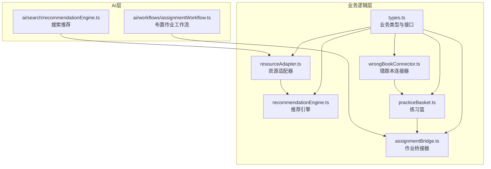
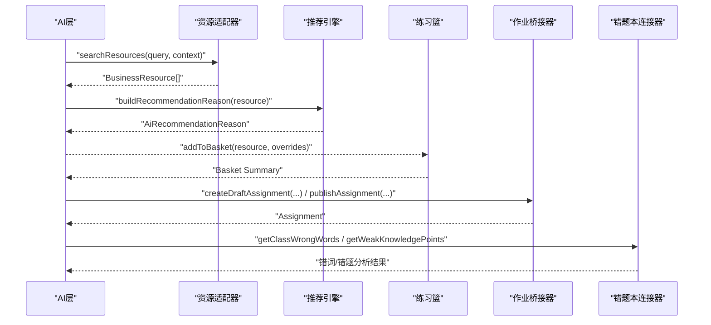
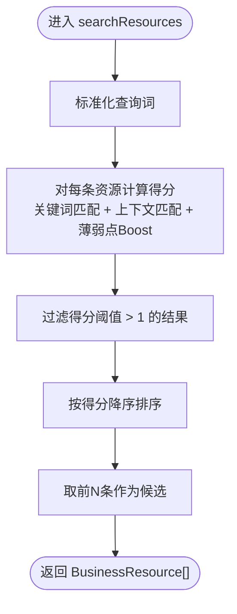
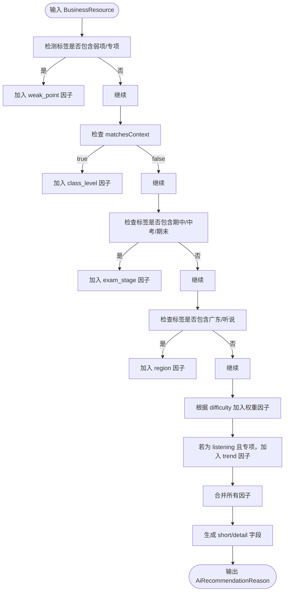
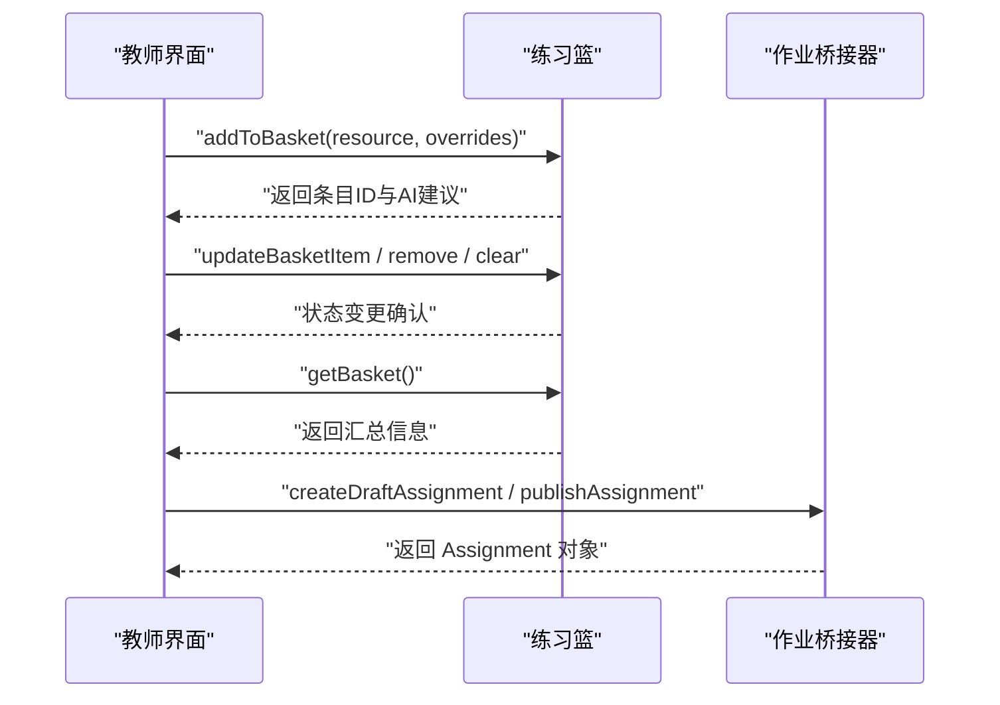
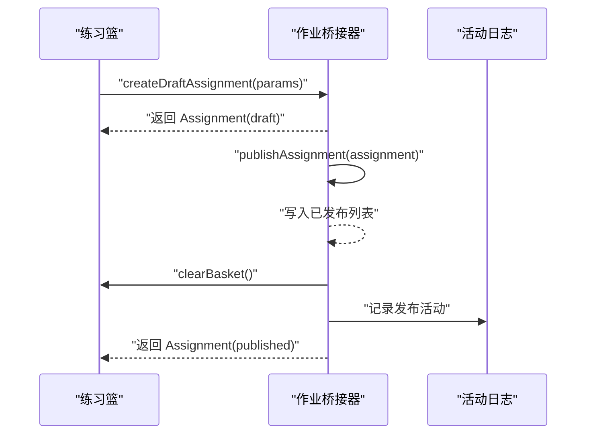
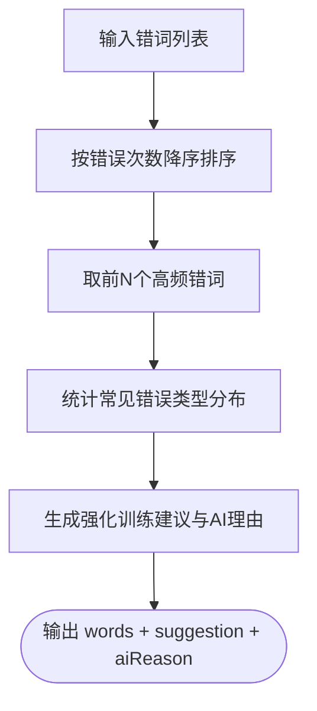
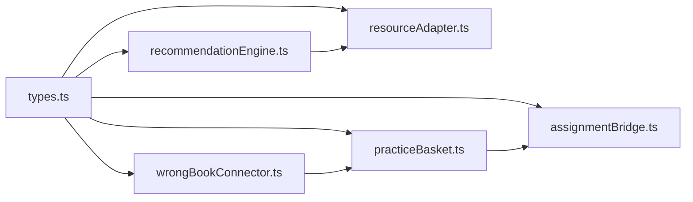

# 业务逻辑模块

<cite>
**本文引用的文件**
- [src/business/index.ts](file://src/business/index.ts)
- [src/business/resourceAdapter.ts](file://src/business/resourceAdapter.ts)
- [src/business/recommendationEngine.ts](file://src/business/recommendationEngine.ts)
- [src/business/practiceBasket.ts](file://src/business/practiceBasket.ts)
- [src/business/assignmentBridge.ts](file://src/business/assignmentBridge.ts)
- [src/business/wrongBookConnector.ts](file://src/business/wrongBookConnector.ts)
- [src/business/types.ts](file://src/business/types.ts)
- [src/ai/search/recommendationEngine.ts](file://src/ai/search/recommendationEngine.ts)
- [src/ai/workflows/assignmentWorkflow.ts](file://src/ai/workflows/assignmentWorkflow.ts)
</cite>

## 目录
1. [简介](#简介)
2. [项目结构](#项目结构)
3. [核心组件](#核心组件)
4. [架构总览](#架构总览)
5. [详细组件分析](#详细组件分析)
6. [依赖关系分析](#依赖关系分析)
7. [性能考量](#性能考量)
8. [故障排查指南](#故障排查指南)
9. [结论](#结论)
10. [附录](#附录)

## 简介
本技术文档面向小天AI教育平台的“业务逻辑模块”，系统性阐述其整体架构与核心职责，涵盖以下能力域：
- 资源适配：将AI搜索结果与真实教学资源库对接，统一数据模型与格式，支持检索、预览与练习生成。
- 推荐引擎：基于教学上下文动态构建AI推荐理由，形成可解释、可权重化的推荐因子集合。
- 练习篮管理：承载教师在AI推荐基础上的二次选择与调整，支持批量生成作业或制卡。
- 错题本连接器：连接真实错词/错题数据，进行统计分析并生成强化训练建议。
- 作业桥接器：将AI生成的练习/试卷转化为可布置的作业，支持草稿、发布、统计与活动记录。
- 扩展与自定义：提供清晰的接口契约与数据模型，便于接入真实后端与二次开发。

该模块以“业务类型定义”为中心，向上承接AI层的意图与内容，向下连接真实资源与作业系统，形成闭环的教学辅助工作流。

## 项目结构
业务逻辑模块位于 src/business 目录，围绕“类型定义 + 适配器 + 引擎 + 管理器 + 连接器”的分层组织：
- 类型定义：统一业务实体与接口契约，确保跨层一致性。
- 资源适配器：封装资源检索、详情、预览与练习生成。
- 推荐引擎：动态生成推荐理由与因子权重。
- 练习篮：维护教师选择的资源集合，支持汇总与作业生成。
- 作业桥接器：作业生命周期管理与发布。
- 错题本连接器：错词/错题数据访问与分析。

图表来源
- [src/business/types.ts:1-203](file://src/business/types.ts#L1-L203)
- [src/business/resourceAdapter.ts:1-193](file://src/business/resourceAdapter.ts#L1-L193)
- [src/business/recommendationEngine.ts:1-87](file://src/business/recommendationEngine.ts#L1-L87)
- [src/business/practiceBasket.ts:1-84](file://src/business/practiceBasket.ts#L1-L84)
- [src/business/assignmentBridge.ts:1-73](file://src/business/assignmentBridge.ts#L1-L73)
- [src/business/wrongBookConnector.ts:1-81](file://src/business/wrongBookConnector.ts#L1-L81)
- [src/ai/search/recommendationEngine.ts:1-55](file://src/ai/search/recommendationEngine.ts#L1-L55)
- [src/ai/workflows/assignmentWorkflow.ts:1-144](file://src/ai/workflows/assignmentWorkflow.ts#L1-L144)

章节来源
- [src/business/index.ts:1-55](file://src/business/index.ts#L1-L55)
- [src/business/types.ts:1-203](file://src/business/types.ts#L1-L203)

## 核心组件
- 资源适配器（ResourceAdapter）
  - 负责资源检索、详情获取、预览获取与练习生成。
  - 支持基于查询词、年级、单元、教材版本、薄弱点等上下文的加权打分与排序。
  - 在生产环境可替换为真实API，当前为本地Mock数据。
- 推荐引擎（Recommendation Reason）
  - 动态构建推荐理由，包含简述、详情与因子权重。
  - 因子类型覆盖薄弱点、匹配度、考试阶段、地区适配、难度与趋势等。
- 练习篮（Practice Basket）
  - 维护教师选择的资源条目，支持增删改查、覆盖配置与统计汇总。
  - 提供一键生成作业的能力，自动汇总分数、时长与AI备注。
- 作业桥接器（Assignment Bridge）
  - 作业生命周期管理：草稿创建、发布、统计与活动日志。
  - 发布后清空练习篮，保证作业生成与布置的幂等性。
- 错题本连接器（Wrong Book Connector）
  - 提供错词/错题查询、高频词排行、薄弱知识点聚合与强化训练建议生成。
  - 基于错误类型统计给出教学建议与AI理由。

章节来源
- [src/business/resourceAdapter.ts:155-192](file://src/business/resourceAdapter.ts#L155-L192)
- [src/business/recommendationEngine.ts:10-86](file://src/business/recommendationEngine.ts#L10-L86)
- [src/business/practiceBasket.ts:16-83](file://src/business/practiceBasket.ts#L16-L83)
- [src/business/assignmentBridge.ts:18-72](file://src/business/assignmentBridge.ts#L18-L72)
- [src/business/wrongBookConnector.ts:33-80](file://src/business/wrongBookConnector.ts#L33-L80)

## 架构总览
业务逻辑模块通过“类型契约 + 适配器 + 引擎 + 管理器 + 连接器”的组合，形成如下闭环：
- AI层通过资源适配器获取业务资源，避免直接依赖底层资源系统。
- 推荐引擎为每个资源生成可解释的推荐理由，指导教师决策。
- 教师在练习篮中进行二次选择与覆盖，最终生成作业。
- 作业桥接器负责作业的发布与统计，同时联动活动日志。
- 错题本连接器提供数据驱动的强化训练建议，反哺教学策略。

图表来源
- [src/business/resourceAdapter.ts:156-176](file://src/business/resourceAdapter.ts#L156-L176)
- [src/business/recommendationEngine.ts:10-86](file://src/business/recommendationEngine.ts#L10-L86)
- [src/business/practiceBasket.ts:16-52](file://src/business/practiceBasket.ts#L16-L52)
- [src/business/assignmentBridge.ts:18-55](file://src/business/assignmentBridge.ts#L18-L55)
- [src/business/wrongBookConnector.ts:33-60](file://src/business/wrongBookConnector.ts#L33-L60)

## 详细组件分析

### 资源适配器（ResourceAdapter）
- 数据转换与格式统一
  - 统一输出 BusinessResource，包含标题、类型、难度、时长、标签、预览、匹配上下文、AI推荐理由、可添加/制卡/布置标记等。
  - 预览类型分为文本、列表、统计三类，满足不同卡片渲染需求。
- 检索与排序
  - 基于查询词与标签的关键词匹配加分，结合年级/单元/教材版本/薄弱点的上下文加权。
  - 使用阈值过滤与Top-N截断，确保结果质量与性能。
- 练习生成
  - 从已有资源派生新的练习实例，保留原始属性并生成唯一ID与标题后缀，便于后续作业生成。

图表来源
- [src/business/resourceAdapter.ts:156-176](file://src/business/resourceAdapter.ts#L156-L176)

章节来源
- [src/business/resourceAdapter.ts:1-193](file://src/business/resourceAdapter.ts#L1-L193)
- [src/business/types.ts:41-76](file://src/business/types.ts#L41-L76)

### 推荐引擎（Recommendation Reason）
- 因子构建
  - 薄弱点：当资源标签包含“弱项/专项”时，赋予高权重。
  - 匹配度：与当前教学上下文匹配时加分。
  - 考试阶段：针对期中/中考等阶段给出适配提示。
  - 地区适配：针对广东地区听说考试场景。
  - 难度：基础/进阶难度分别给出不同建议权重。
  - 趋势：对听力专项训练给出趋势预警。
- 结果生成
  - 依据因子权重生成简述与详情，便于卡片与抽屉展示。

图表来源
- [src/business/recommendationEngine.ts:10-86](file://src/business/recommendationEngine.ts#L10-L86)

章节来源
- [src/business/recommendationEngine.ts:1-87](file://src/business/recommendationEngine.ts#L1-L87)
- [src/business/types.ts:78-95](file://src/business/types.ts#L78-L95)

### 练习篮（Practice Basket）
- 状态管理
  - 维护内存中的练习篮条目数组，支持添加、移除、更新覆盖配置、清空与计数。
- 汇总统计
  - 计算总分（默认每项100）、条目数与估算时长（基于资源时长累加）。
- 作业生成
  - 从练习篮快照生成 Assignment，自动填充资源列表、总分与时长，并生成AI备注。

图表来源
- [src/business/practiceBasket.ts:16-52](file://src/business/practiceBasket.ts#L16-L52)
- [src/business/assignmentBridge.ts:18-55](file://src/business/assignmentBridge.ts#L18-L55)

章节来源
- [src/business/practiceBasket.ts:1-84](file://src/business/practiceBasket.ts#L1-L84)
- [src/business/types.ts:99-134](file://src/business/types.ts#L99-L134)

### 作业桥接器（Assignment Bridge）
- 草稿创建
  - 从练习篮快照创建 Assignment，填充标题、类型、目标班级、截止日期、总分与时长，并附带AI生成备注。
- 发布管理
  - 发布后将作业写入已发布列表，清空练习篮，记录活动日志。
- 统计与查询
  - 提供已发布作业统计与活动日志查询接口。

图表来源
- [src/business/assignmentBridge.ts:18-55](file://src/business/assignmentBridge.ts#L18-L55)

章节来源
- [src/business/assignmentBridge.ts:1-73](file://src/business/assignmentBridge.ts#L1-L73)
- [src/business/types.ts:123-134](file://src/business/types.ts#L123-L134)

### 错题本连接器（Wrong Book Connector）
- 数据访问
  - 提供按单元过滤的错词/错题查询、Top N高频错词与薄弱知识点聚合。
- 分析算法
  - 基于错题正确率与知识点维度聚合，计算平均错误率与条目数。
  - 统计错词常见错误类型（多字母/少字母/顺序错误），输出强化训练建议与AI理由。

图表来源
- [src/business/wrongBookConnector.ts:62-80](file://src/business/wrongBookConnector.ts#L62-L80)

章节来源
- [src/business/wrongBookConnector.ts:1-81](file://src/business/wrongBookConnector.ts#L1-L81)
- [src/business/types.ts:138-156](file://src/business/types.ts#L138-L156)

### 搜索推荐与工作流衔接
- 搜索推荐（AI层）
  - 基于教学上下文生成推荐搜索词与“相关推荐”，用于引导教师检索。
- 作业工作流（AI层）
  - 定义“布置作业”工作流步骤：获取班级、选择班级、设置时间与规则、发布作业。
  - 与业务层的作业桥接器配合，完成发布后的结果回传与建议提示。

章节来源
- [src/ai/search/recommendationEngine.ts:10-54](file://src/ai/search/recommendationEngine.ts#L10-L54)
- [src/ai/workflows/assignmentWorkflow.ts:11-141](file://src/ai/workflows/assignmentWorkflow.ts#L11-L141)

## 依赖关系分析
- 类型契约
  - 所有模块共享 types.ts 中的业务类型与接口，确保跨层一致性与可替换性。
- 适配器与引擎
  - 资源适配器依赖推荐引擎生成AI理由，二者通过类型契约解耦。
- 练习篮与作业桥接器
  - 练习篮为作业桥接器提供数据来源；作业桥接器在发布后清空练习篮，避免重复生成。
- 错题本与练习篮
  - 错题本连接器输出的分析结果可驱动教师在练习篮中选择针对性资源，形成闭环。

图表来源
- [src/business/types.ts:1-203](file://src/business/types.ts#L1-L203)
- [src/business/resourceAdapter.ts:1-193](file://src/business/resourceAdapter.ts#L1-L193)
- [src/business/recommendationEngine.ts:1-87](file://src/business/recommendationEngine.ts#L1-L87)
- [src/business/practiceBasket.ts:1-84](file://src/business/practiceBasket.ts#L1-L84)
- [src/business/assignmentBridge.ts:1-73](file://src/business/assignmentBridge.ts#L1-L73)
- [src/business/wrongBookConnector.ts:1-81](file://src/business/wrongBookConnector.ts#L1-L81)

章节来源
- [src/business/index.ts:1-55](file://src/business/index.ts#L1-L55)

## 性能考量
- 资源检索
  - 当前采用内存数组扫描与简单加权，复杂度约为 O(N×M)，其中N为资源数，M为特征匹配数。
  - 建议在真实环境中引入倒排索引或向量检索，以降低查询延迟。
- 排序与截断
  - 使用阈值过滤与Top-N截断，控制返回规模，提升前端渲染效率。
- 练习篮统计
  - 汇总计算为线性遍历，建议缓存最近一次统计结果，仅在条目变化时重算。
- 错题本分析
  - 聚合与排序为线性扫描，建议对高频知识点建立索引，减少重复计算。

## 故障排查指南
- 资源未找到
  - 现象：练习生成时报“资源不存在”。
  - 排查：确认资源ID是否存在，检查资源适配器的ID映射与Mock数据。
  - 参考路径：[src/business/resourceAdapter.ts:187-191](file://src/business/resourceAdapter.ts#L187-L191)
- 推荐理由为空
  - 现象：卡片显示默认文案。
  - 排查：检查资源标签与上下文是否满足因子触发条件，确认推荐引擎因子权重设置。
  - 参考路径：[src/business/recommendationEngine.ts:10-86](file://src/business/recommendationEngine.ts#L10-L86)
- 练习篮为空导致作业无内容
  - 现象：生成作业时资源列表为空。
  - 排查：确认教师是否已将资源加入练习篮，检查清空逻辑是否提前执行。
  - 参考路径：[src/business/practiceBasket.ts:64-83](file://src/business/practiceBasket.ts#L64-L83)
- 作业未发布或未记录日志
  - 现象：发布后无已发布作业或活动日志缺失。
  - 排查：确认发布调用是否执行，检查已发布列表与活动日志数组写入逻辑。
  - 参考路径：[src/business/assignmentBridge.ts:42-63](file://src/business/assignmentBridge.ts#L42-L63)
- 错题本数据异常
  - 现象：高频错词或薄弱知识点统计异常。
  - 排查：核对Mock数据字段完整性，检查聚合与排序逻辑。
  - 参考路径：[src/business/wrongBookConnector.ts:33-80](file://src/business/wrongBookConnector.ts#L33-L80)

章节来源
- [src/business/resourceAdapter.ts:187-191](file://src/business/resourceAdapter.ts#L187-L191)
- [src/business/recommendationEngine.ts:10-86](file://src/business/recommendationEngine.ts#L10-L86)
- [src/business/practiceBasket.ts:64-83](file://src/business/practiceBasket.ts#L64-L83)
- [src/business/assignmentBridge.ts:42-63](file://src/business/assignmentBridge.ts#L42-L63)
- [src/business/wrongBookConnector.ts:33-80](file://src/business/wrongBookConnector.ts#L33-L80)

## 结论
业务逻辑模块以清晰的类型契约与分层设计，实现了从AI推荐到资源适配、从练习篮到作业发布的完整闭环。推荐引擎提供可解释的决策依据，练习篮与作业桥接器保障教师可控的作业生成流程，错题本连接器则以数据驱动的方式强化教学反馈。模块具备良好的扩展性，便于接入真实后端与二次开发。

## 附录
- 类型与接口总览
  - 业务资源类型、资源预览、推荐理由与因子、练习篮条目与汇总、作业对象、错词/错题条目、教师活动、资源适配器接口、搜索上下文与练习选项等均在 types.ts 中集中定义。
- 导出入口
  - 通过 index.ts 统一导出各模块的核心函数与类型，便于上层按需引用。

章节来源
- [src/business/types.ts:1-203](file://src/business/types.ts#L1-L203)
- [src/business/index.ts:1-55](file://src/business/index.ts#L1-L55)