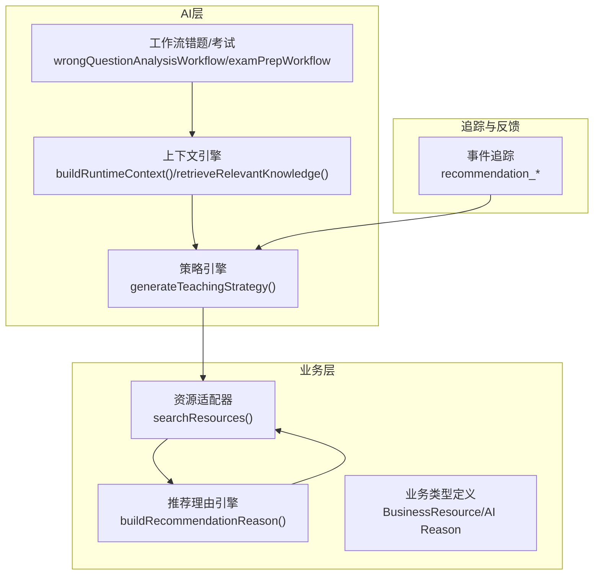
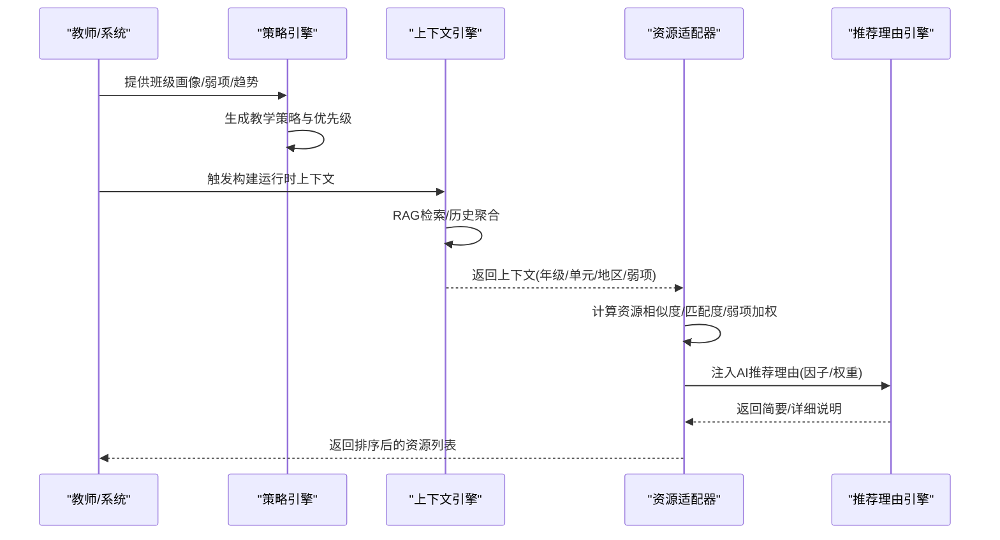
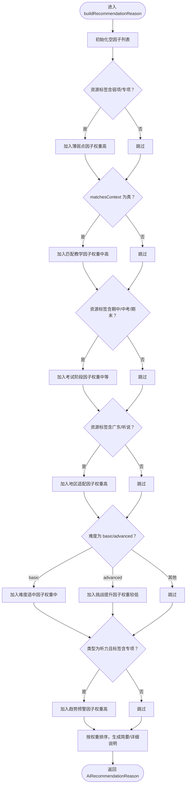
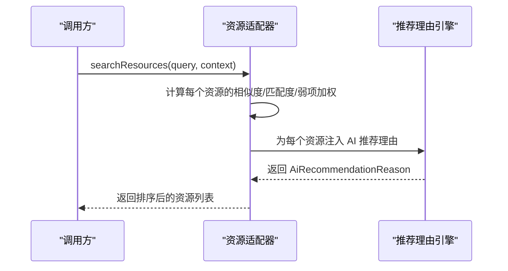
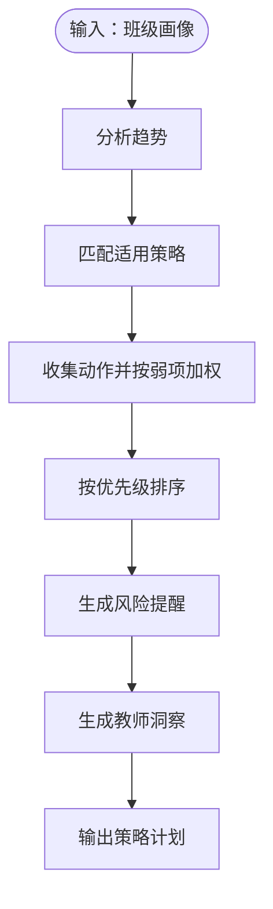
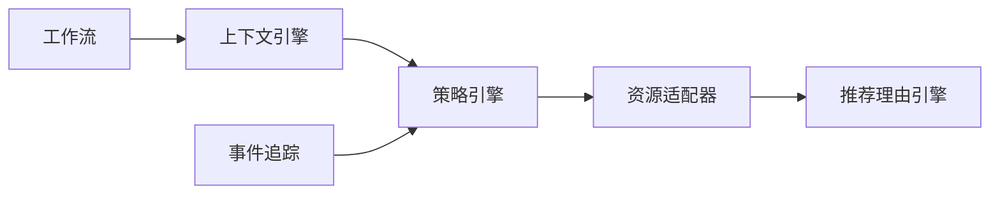

# 推荐引擎

<cite>
**本文引用的文件**
- [src/business/recommendationEngine.ts](file://src/business/recommendationEngine.ts)
- [src/business/resourceAdapter.ts](file://src/business/resourceAdapter.ts)
- [src/business/types.ts](file://src/business/types.ts)
- [src/ai/context/contextEngine.ts](file://src/ai/context/contextEngine.ts)
- [src/ai/strategy/strategyEngine.ts](file://src/ai/strategy/strategyEngine.ts)
- [src/analytics/tracker.ts](file://src/analytics/tracker.ts)
- [src/ai/workflows/wrongQuestionAnalysisWorkflow.ts](file://src/ai/workflows/wrongQuestionAnalysisWorkflow.ts)
- [src/ai/workflows/examPrepWorkflow.ts](file://src/ai/workflows/examPrepWorkflow.ts)
</cite>

## 目录
1. [简介](#简介)
2. [项目结构](#项目结构)
3. [核心组件](#核心组件)
4. [架构总览](#架构总览)
5. [详细组件分析](#详细组件分析)
6. [依赖分析](#依赖分析)
7. [性能考虑](#性能考虑)
8. [故障排查指南](#故障排查指南)
9. [结论](#结论)
10. [附录](#附录)

## 简介
本文件面向小天AI教育平台的推荐引擎，系统性阐述其核心算法与个性化策略，覆盖以下关键主题：
- 基于学生学情数据的智能推荐机制：薄弱知识点、学习趋势、地区与考试阶段适配。
- 推荐理由构建过程：综合学习进度、薄弱环节、知识点掌握情况与教学情境。
- 推荐评分算法：权重分配、相关性计算与排序逻辑。
- 推荐引擎与资源适配器的协作关系：如何通过上下文动态调整策略。
- 配置选项与性能优化建议：如何定制策略以适配不同教学场景。

## 项目结构
推荐引擎涉及业务层与AI层的协同：
- 业务层负责“资源”与“推荐理由”的建模与适配器实现。
- AI层负责上下文构建、策略生成与工作流编排，为推荐提供个性化依据。
- 数据追踪用于评估推荐效果并反馈优化。

图表来源
- [src/business/resourceAdapter.ts:155-192](file://src/business/resourceAdapter.ts#L155-L192)
- [src/business/recommendationEngine.ts:10-86](file://src/business/recommendationEngine.ts#L10-L86)
- [src/business/types.ts:41-95](file://src/business/types.ts#L41-L95)
- [src/ai/context/contextEngine.ts:37-80](file://src/ai/context/contextEngine.ts#L37-L80)
- [src/ai/strategy/strategyEngine.ts:133-186](file://src/ai/strategy/strategyEngine.ts#L133-L186)
- [src/analytics/tracker.ts:93-131](file://src/analytics/tracker.ts#L93-L131)
- [src/ai/workflows/wrongQuestionAnalysisWorkflow.ts:21-84](file://src/ai/workflows/wrongQuestionAnalysisWorkflow.ts#L21-L84)
- [src/ai/workflows/examPrepWorkflow.ts:17-54](file://src/ai/workflows/examPrepWorkflow.ts#L17-L54)

章节来源
- [src/business/resourceAdapter.ts:1-193](file://src/business/resourceAdapter.ts#L1-L193)
- [src/business/recommendationEngine.ts:1-87](file://src/business/recommendationEngine.ts#L1-L87)
- [src/business/types.ts:1-203](file://src/business/types.ts#L1-L203)
- [src/ai/context/contextEngine.ts:1-189](file://src/ai/context/contextEngine.ts#L1-L189)
- [src/ai/strategy/strategyEngine.ts:1-319](file://src/ai/strategy/strategyEngine.ts#L1-L319)
- [src/analytics/tracker.ts:93-136](file://src/analytics/tracker.ts#L93-L136)
- [src/ai/workflows/wrongQuestionAnalysisWorkflow.ts:21-84](file://src/ai/workflows/wrongQuestionAnalysisWorkflow.ts#L21-L84)
- [src/ai/workflows/examPrepWorkflow.ts:17-54](file://src/ai/workflows/examPrepWorkflow.ts#L17-L54)

## 核心组件
- 推荐理由引擎：根据资源标签、难度、匹配度与趋势，动态生成“简要说明/详细说明/因子权重”，作为UI呈现与排序依据。
- 资源适配器：封装资源检索、预览与派生练习，内置基础评分与过滤逻辑，并注入AI推荐理由。
- 业务类型体系：统一资源、推荐理由、搜索上下文与实践选项的数据结构。
- 上下文引擎：聚合教师、班级、教材、近期工作流与RAG检索到的相关知识，形成运行时上下文。
- 策略引擎：基于班级画像（地区、阶段、等级、弱项、趋势）生成教学策略计划，指导推荐优先级。
- 工作流：通过错题分析与考试准备等流程，输出薄弱知识点与目标范围，驱动上下文与策略。
- 事件追踪：记录推荐接受/拒绝/修改等行为，计算接受率，为策略优化提供反馈。

章节来源
- [src/business/recommendationEngine.ts:10-86](file://src/business/recommendationEngine.ts#L10-L86)
- [src/business/resourceAdapter.ts:155-192](file://src/business/resourceAdapter.ts#L155-L192)
- [src/business/types.ts:41-95](file://src/business/types.ts#L41-L95)
- [src/ai/context/contextEngine.ts:37-80](file://src/ai/context/contextEngine.ts#L37-L80)
- [src/ai/strategy/strategyEngine.ts:133-186](file://src/ai/strategy/strategyEngine.ts#L133-L186)
- [src/analytics/tracker.ts:93-131](file://src/analytics/tracker.ts#L93-L131)
- [src/ai/workflows/wrongQuestionAnalysisWorkflow.ts:21-84](file://src/ai/workflows/wrongQuestionAnalysisWorkflow.ts#L21-L84)
- [src/ai/workflows/examPrepWorkflow.ts:17-54](file://src/ai/workflows/examPrepWorkflow.ts#L17-L54)

## 架构总览
推荐引擎采用“策略驱动 + 上下文感知 + 业务适配器”的分层架构：
- 策略层：策略引擎根据班级画像与趋势生成教学策略与风险提醒，决定推荐优先级。
- 上下文层：上下文引擎整合教师偏好、班级现状与RAG知识，形成丰富上下文。
- 业务层：资源适配器负责检索与评分，推荐理由引擎负责解释与权重。
- 反馈层：事件追踪收集用户对推荐的行为反馈，闭环优化策略。

图表来源
- [src/ai/strategy/strategyEngine.ts:133-186](file://src/ai/strategy/strategyEngine.ts#L133-L186)
- [src/ai/context/contextEngine.ts:37-80](file://src/ai/context/contextEngine.ts#L37-L80)
- [src/business/resourceAdapter.ts:155-192](file://src/business/resourceAdapter.ts#L155-L192)
- [src/business/recommendationEngine.ts:10-86](file://src/business/recommendationEngine.ts#L10-L86)

## 详细组件分析

### 推荐理由引擎（buildRecommendationReason）
- 输入：业务资源对象（包含标签、难度、是否匹配当前教学、类型等）。
- 输出：推荐理由对象（简要说明、详细说明、因子数组）。
- 因子类型与权重：
  - 班级薄弱点：当资源标记为“弱项/专项”时加入，权重较高。
  - 匹配当前教学：当资源与当前年级/单元/教材匹配时加入，权重中高。
  - 考试阶段适配：当资源标记为“期中/中考/期末”时加入，权重中等。
  - 地区适配：当资源标记为“广东/听说”时加入，权重较高。
  - 难度适配：基础/进阶难度分别赋予不同权重，平衡全班与挑战需求。
  - 趋势预警：针对听力专项且近期趋势下滑时加入，权重较高。
- 最终呈现：
  - 简要说明：取权重最高的因子，截取描述长度。
  - 详细说明：汇总所有因子的标签与描述。
  - 因子数组：用于排序与UI展示。

图表来源
- [src/business/recommendationEngine.ts:10-86](file://src/business/recommendationEngine.ts#L10-L86)

章节来源
- [src/business/recommendationEngine.ts:10-86](file://src/business/recommendationEngine.ts#L10-L86)

### 资源适配器（searchResources 与评分）
- 检索流程：
  - 将查询词转为小写，匹配标题/描述关键词与标签。
  - 对年级/单元/教材进行精确或通用匹配加分。
  - 若上下文包含薄弱点，对资源标签进行模糊匹配并加权。
  - 过滤低分条目，按分数降序排序，限制返回数量。
- 关键点：
  - 评分维度与权重：关键词匹配、标签匹配、年级/单元/教材匹配、薄弱点加权。
  - 结果注入AI推荐理由：在适配器侧批量注入，便于后续排序与展示。
- 与推荐理由的关系：适配器负责“找得准”，理由引擎负责“说得清”。

图表来源
- [src/business/resourceAdapter.ts:155-192](file://src/business/resourceAdapter.ts#L155-L192)
- [src/business/recommendationEngine.ts:10-86](file://src/business/recommendationEngine.ts#L10-L86)

章节来源
- [src/business/resourceAdapter.ts:155-192](file://src/business/resourceAdapter.ts#L155-L192)

### 业务类型体系（BusinessResource/AI Reason/上下文）
- 资源类型：涵盖同步练习、词汇、听力、口语、阅读、写作、试卷、主题视频、配音、课堂PK、错题本、语法等。
- 推荐理由：包含简要说明、详细说明与因子数组，因子含类型、标签、描述与权重。
- 搜索上下文：包含年级、单元、教材、班级名、地区、班级水平、考试阶段、薄弱点列表等。
- 实践选项：题量、难度、模式、是否包含答案等。

章节来源
- [src/business/types.ts:10-95](file://src/business/types.ts#L10-L95)
- [src/business/types.ts:186-202](file://src/business/types.ts#L186-L202)

### 上下文引擎（构建运行时上下文与RAG检索）
- 构建步骤：
  - 组装教师与班级信息默认值。
  - 并行加载近期工作流、工具结果与消息。
  - 通过向量适配器检索与当前教学上下文相关的知识片段。
  - 失败回退：使用教学大纲、学情分析与教学策略库的静态知识。
- 总结：将教师偏好、班级现状与外部知识融合，为策略与推荐提供依据。

章节来源
- [src/ai/context/contextEngine.ts:37-80](file://src/ai/context/contextEngine.ts#L37-L80)
- [src/ai/context/contextEngine.ts:94-133](file://src/ai/context/contextEngine.ts#L94-L133)
- [src/ai/context/contextEngine.ts:137-163](file://src/ai/context/contextEngine.ts#L137-L163)

### 策略引擎（教学策略决策）
- 输入：班级画像（年级、地区、阶段、等级、弱项、趋势等）。
- 输出：教学策略计划（激活策略、推荐动作、风险提醒、教师洞察、区域聚焦）。
- 关键逻辑：
  - 匹配策略：按适用年级/阶段/等级/地区筛选。
  - 动作收集与加权：针对薄弱知识点提升相关动作优先级。
  - 风险提醒：基于趋势与错误率生成预警。
  - 区域聚焦：不同地区强调听说/读写/综合能力侧重点。

图表来源
- [src/ai/strategy/strategyEngine.ts:133-186](file://src/ai/strategy/strategyEngine.ts#L133-L186)
- [src/ai/strategy/strategyEngine.ts:192-226](file://src/ai/strategy/strategyEngine.ts#L192-L226)
- [src/ai/strategy/strategyEngine.ts:228-281](file://src/ai/strategy/strategyEngine.ts#L228-L281)

章节来源
- [src/ai/strategy/strategyEngine.ts:133-186](file://src/ai/strategy/strategyEngine.ts#L133-L186)
- [src/ai/strategy/strategyEngine.ts:192-226](file://src/ai/strategy/strategyEngine.ts#L192-L226)
- [src/ai/strategy/strategyEngine.ts:228-281](file://src/ai/strategy/strategyEngine.ts#L228-L281)

### 工作流（错题分析与考试准备）
- 错题分析工作流：抓取近期错题、诊断薄弱知识点、生成结构化报告。
- 考试准备工作流：识别考试类型与复习范围，分析班级薄弱点。
- 作用：为上下文与策略提供数据支撑，驱动推荐更贴合实际学情。

章节来源
- [src/ai/workflows/wrongQuestionAnalysisWorkflow.ts:21-84](file://src/ai/workflows/wrongQuestionAnalysisWorkflow.ts#L21-L84)
- [src/ai/workflows/examPrepWorkflow.ts:17-54](file://src/ai/workflows/examPrepWorkflow.ts#L17-L54)

### 事件追踪与反馈
- 记录推荐接受/拒绝/修改事件，更新会话内推荐接受率。
- 用于评估策略有效性与用户偏好，指导后续优化。

章节来源
- [src/analytics/tracker.ts:93-131](file://src/analytics/tracker.ts#L93-L131)

## 依赖分析
- 组件耦合：
  - 资源适配器依赖推荐理由引擎，用于为检索结果注入解释与权重。
  - 策略引擎依赖工作流与上下文引擎提供的班级画像与趋势数据。
  - 上下文引擎依赖向量适配器进行RAG检索，失败时回退到静态知识。
- 外部依赖：
  - 向量适配器：用于知识检索与重排序（可扩展）。
  - 事件追踪：用于策略效果评估与反馈闭环。

图表来源
- [src/ai/workflows/wrongQuestionAnalysisWorkflow.ts:21-84](file://src/ai/workflows/wrongQuestionAnalysisWorkflow.ts#L21-L84)
- [src/ai/context/contextEngine.ts:37-80](file://src/ai/context/contextEngine.ts#L37-L80)
- [src/ai/strategy/strategyEngine.ts:133-186](file://src/ai/strategy/strategyEngine.ts#L133-L186)
- [src/business/resourceAdapter.ts:155-192](file://src/business/resourceAdapter.ts#L155-L192)
- [src/business/recommendationEngine.ts:10-86](file://src/business/recommendationEngine.ts#L10-L86)
- [src/analytics/tracker.ts:93-131](file://src/analytics/tracker.ts#L93-L131)

## 性能考虑
- 检索与评分：
  - 评分函数线性遍历资源集合，复杂度 O(N×M)，其中 N 为资源数，M 为标签数。可通过缓存关键词匹配结果与通用匹配得分降低重复计算。
  - 过滤阈值与返回上限（如 >1 的分数与前 10）可控制响应规模。
- 向量检索：
  - RAG检索支持 topK 与最小分数过滤，建议结合重排序（re-ranking）提升命中质量。
- 排序与展示：
  - 建议在前端对推荐理由权重二次排序，或在服务端合并理由权重与适配器评分，统一排序。
- 缓存与回退：
  - 向量检索失败时的静态知识回退可保证可用性；建议对常用查询与知识片段建立缓存。

## 故障排查指南
- 推荐理由为空或权重异常：
  - 检查资源标签是否包含“弱项/专项/期中/中考/期末/广东/听说/基础/进阶”等关键字段。
  - 确认 matchesContext 是否为真，以触发“匹配当前教学”因子。
- 检索结果为空或过少：
  - 调整查询关键词大小写与标签匹配逻辑，检查年级/单元/教材是否与上下文一致。
  - 确认薄弱点列表是否有效，避免无效加权导致分数偏低。
- 上下文缺失或RAG失败：
  - 检查向量适配器可用性与过滤条件；确认回退知识是否加载成功。
- 接受率异常：
  - 检查事件追踪是否正确记录 recommendation_accept/recommendation_reject/recommendation_modify；核对会话内事件统计逻辑。

章节来源
- [src/business/recommendationEngine.ts:10-86](file://src/business/recommendationEngine.ts#L10-L86)
- [src/business/resourceAdapter.ts:155-192](file://src/business/resourceAdapter.ts#L155-L192)
- [src/ai/context/contextEngine.ts:94-133](file://src/ai/context/contextEngine.ts#L94-L133)
- [src/analytics/tracker.ts:93-131](file://src/analytics/tracker.ts#L93-L131)

## 结论
小天AI教育平台的推荐引擎通过“策略驱动 + 上下文感知 + 业务适配器”的架构，实现了以学情数据为核心的个性化推荐。推荐理由引擎与资源适配器协同，既保证“找得准”，也保证“说得清”。策略引擎与工作流进一步将薄弱知识点、趋势与地区差异纳入推荐优先级，形成闭环优化路径。通过合理配置评分权重、上下文参数与事件追踪，开发者可灵活定制策略以适配不同教学场景。

## 附录
- 推荐评分算法要点
  - 关键词匹配：标题/描述包含查询词 +5。
  - 标签匹配：标签包含查询词 +3。
  - 年级/单元/教材匹配：精确匹配更高分，通用匹配加分。
  - 薄弱点加权：若上下文包含薄弱点，标签模糊匹配额外 +3。
  - 过滤与排序：过滤低分，按分数降序，限制返回数量。
- 推荐理由权重分配
  - 班级薄弱点：高权重（示例：0.9）。
  - 匹配当前教学：中高权重（示例：0.8）。
  - 考试阶段适配：中等权重（示例：0.7）。
  - 地区适配：高权重（示例：0.85）。
  - 难度适配：基础/进阶分别赋予权重（示例：0.5/0.4）。
  - 趋势预警：高权重（示例：0.9）。
- 配置建议
  - 在资源标签中明确标注“弱项/专项/期中/中考/期末/广东/听说/基础/进阶”等关键语义。
  - 在上下文中提供准确的年级、单元、教材、地区与薄弱点列表。
  - 在策略引擎中为不同地区与阶段设置差异化权重与动作优先级。
  - 通过事件追踪持续监控推荐接受率，迭代优化评分与理由权重。