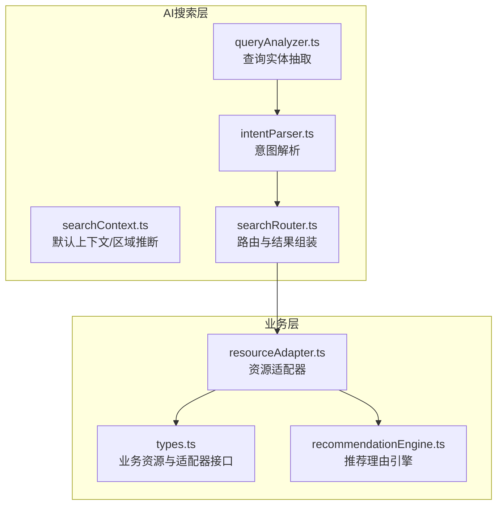
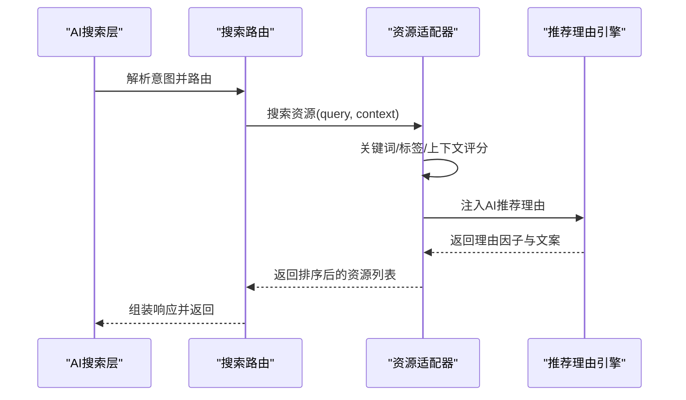
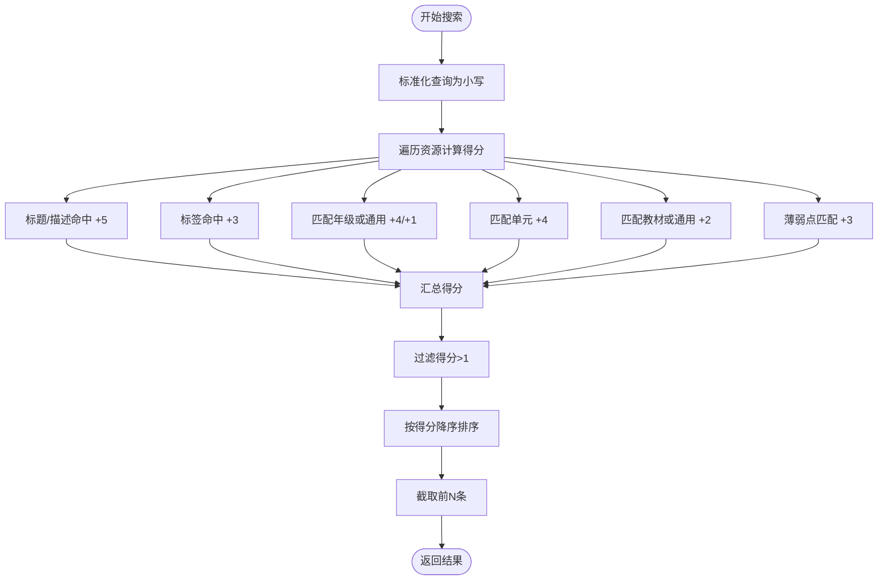
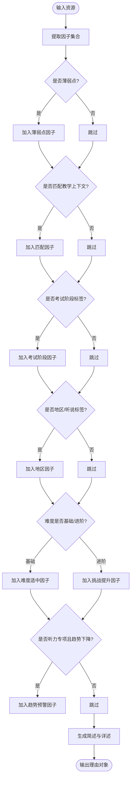
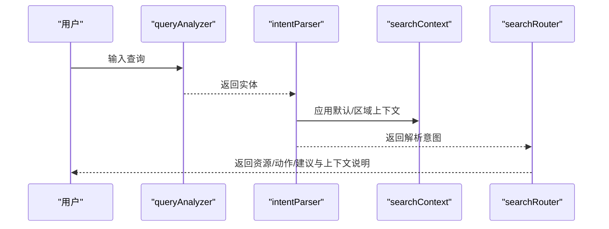
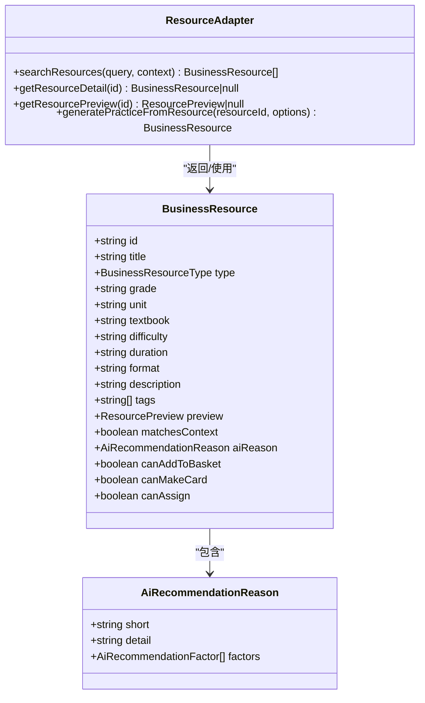
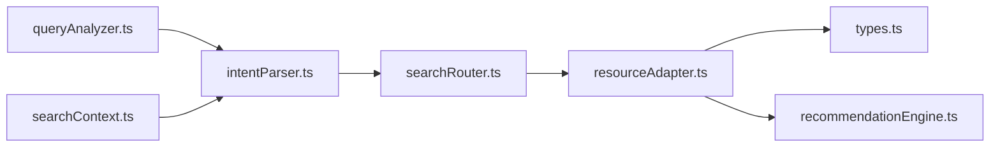

# 资源适配器

<cite>
**本文引用的文件**
- [src/business/resourceAdapter.ts](file://src/business/resourceAdapter.ts)
- [src/business/types.ts](file://src/business/types.ts)
- [src/business/recommendationEngine.ts](file://src/business/recommendationEngine.ts)
- [src/ai/search/types.ts](file://src/ai/search/types.ts)
- [src/ai/search/queryAnalyzer.ts](file://src/ai/search/queryAnalyzer.ts)
- [src/ai/search/intentParser.ts](file://src/ai/search/intentParser.ts)
- [src/ai/search/searchContext.ts](file://src/ai/search/searchContext.ts)
- [src/ai/search/searchRouter.ts](file://src/ai/search/searchRouter.ts)
</cite>

## 目录
1. [简介](#简介)
2. [项目结构](#项目结构)
3. [核心组件](#核心组件)
4. [架构总览](#架构总览)
5. [详细组件分析](#详细组件分析)
6. [依赖关系分析](#依赖关系分析)
7. [性能考量](#性能考量)
8. [故障排查指南](#故障排查指南)
9. [结论](#结论)
10. [附录：扩展与自定义开发指南](#附录扩展与自定义开发指南)

## 简介
本技术文档围绕“资源适配器”展开，目标是帮助开发者理解小天AI教育平台如何通过资源适配器将AI搜索能力与真实教学资源库解耦对接。资源适配器承担以下职责：
- 将AI层的搜索请求转换为对业务资源库的查询，屏蔽底层数据来源差异
- 提供资源搜索、详情获取、预览、练习生成等统一接口
- 基于教学上下文与标签体系进行评分与排序，并注入AI推荐理由
- 支持扩展新的资源类型与适配逻辑，便于持续演进

## 项目结构
资源适配器位于业务层，与AI搜索层协同工作。整体关系如下：

图表来源
- [src/ai/search/queryAnalyzer.ts:72-169](file://src/ai/search/queryAnalyzer.ts#L72-L169)
- [src/ai/search/intentParser.ts:69-142](file://src/ai/search/intentParser.ts#L69-L142)
- [src/ai/search/searchContext.ts:7-29](file://src/ai/search/searchContext.ts#L7-L29)
- [src/ai/search/searchRouter.ts:14-71](file://src/ai/search/searchRouter.ts#L14-L71)
- [src/business/resourceAdapter.ts:155-192](file://src/business/resourceAdapter.ts#L155-L192)
- [src/business/types.ts:170-195](file://src/business/types.ts#L170-L195)
- [src/business/recommendationEngine.ts:10-86](file://src/business/recommendationEngine.ts#L10-L86)

章节来源
- [src/business/resourceAdapter.ts:1-193](file://src/business/resourceAdapter.ts#L1-L193)
- [src/business/types.ts:1-203](file://src/business/types.ts#L1-L203)
- [src/business/recommendationEngine.ts:1-87](file://src/business/recommendationEngine.ts#L1-L87)
- [src/ai/search/types.ts:1-195](file://src/ai/search/types.ts#L1-L195)
- [src/ai/search/queryAnalyzer.ts:1-170](file://src/ai/search/queryAnalyzer.ts#L1-L170)
- [src/ai/search/intentParser.ts:1-143](file://src/ai/search/intentParser.ts#L1-L143)
- [src/ai/search/searchContext.ts:1-77](file://src/ai/search/searchContext.ts#L1-L77)
- [src/ai/search/searchRouter.ts:1-72](file://src/ai/search/searchRouter.ts#L1-L72)

## 核心组件
- 资源适配器接口与业务资源模型
  - 资源适配器接口定义了搜索、详情、预览、练习生成四个核心方法，确保AI层无需关心具体数据源
  - 业务资源模型包含资源标识、类型、难度、时长、格式、标签、预览、上下文匹配标记、AI推荐理由及可用性开关等字段
- 推荐理由引擎
  - 动态构建AI推荐理由，包含简述、详述与因子列表，因子权重用于解释推荐依据
- AI搜索与上下文
  - 查询实体抽取、意图解析、默认上下文与区域策略、搜索路由与结果组装，共同构成AI层的搜索链路

章节来源
- [src/business/types.ts:170-195](file://src/business/types.ts#L170-L195)
- [src/business/types.ts:41-65](file://src/business/types.ts#L41-L65)
- [src/business/types.ts:78-95](file://src/business/types.ts#L78-L95)
- [src/business/recommendationEngine.ts:10-86](file://src/business/recommendationEngine.ts#L10-L86)
- [src/ai/search/types.ts:108-155](file://src/ai/search/types.ts#L108-L155)
- [src/ai/search/queryAnalyzer.ts:72-169](file://src/ai/search/queryAnalyzer.ts#L72-L169)
- [src/ai/search/intentParser.ts:69-142](file://src/ai/search/intentParser.ts#L69-L142)
- [src/ai/search/searchContext.ts:7-29](file://src/ai/search/searchContext.ts#L7-L29)
- [src/ai/search/searchRouter.ts:14-71](file://src/ai/search/searchRouter.ts#L14-L71)

## 架构总览
资源适配器在系统中的位置与交互如下：

图表来源
- [src/ai/search/searchRouter.ts:14-71](file://src/ai/search/searchRouter.ts#L14-L71)
- [src/business/resourceAdapter.ts:155-176](file://src/business/resourceAdapter.ts#L155-L176)
- [src/business/recommendationEngine.ts:10-86](file://src/business/recommendationEngine.ts#L10-L86)

## 详细组件分析

### 资源适配器实现
- 搜索机制
  - 输入：查询字符串与搜索上下文
  - 处理：对每个资源计算综合得分，包含标题/描述关键词命中、标签匹配、年级/单元/教材匹配、薄弱点匹配等加权
  - 过滤与排序：过滤低分项，按分数降序，截取前N条
- 详情与预览
  - 详情：按id查找完整资源
  - 预览：按id返回轻量预览数据，避免加载全量详情
- 练习生成
  - 基于已有资源创建自定义练习，保留原始属性并生成新id与标题后缀
- AI推荐理由注入
  - 在适配器初始化时，为所有资源注入AI推荐理由，便于卡片与抽屉展示

图表来源
- [src/business/resourceAdapter.ts:155-176](file://src/business/resourceAdapter.ts#L155-L176)

章节来源
- [src/business/resourceAdapter.ts:155-192](file://src/business/resourceAdapter.ts#L155-L192)

### 推荐理由引擎
- 因子类型与权重
  - 班级薄弱点、匹配当前教学、考试阶段适配、地区适配、难度适配、趋势预警等
- 文案生成
  - 根据最高权重因子生成简述，汇总所有因子生成详述
- 与适配器集成
  - 适配器启动时批量注入理由，保证资源具备推荐说明

图表来源
- [src/business/recommendationEngine.ts:10-86](file://src/business/recommendationEngine.ts#L10-L86)

章节来源
- [src/business/recommendationEngine.ts:10-86](file://src/business/recommendationEngine.ts#L10-L86)

### AI搜索与上下文
- 实体抽取
  - 从自然语言查询中抽取年级、单元、教材、数量、题型、话题等结构化实体
- 意图解析
  - 基于关键词映射识别资源类型、教学目标、AI任务，结合区域策略与上下文补全
- 默认上下文与区域推断
  - 提供默认教学上下文，支持从查询或提示词推断区域
- 搜索路由
  - 根据意图路由到不同结果集合，统一按上下文匹配程度排序并生成上下文说明

图表来源
- [src/ai/search/queryAnalyzer.ts:72-169](file://src/ai/search/queryAnalyzer.ts#L72-L169)
- [src/ai/search/intentParser.ts:69-142](file://src/ai/search/intentParser.ts#L69-L142)
- [src/ai/search/searchContext.ts:7-29](file://src/ai/search/searchContext.ts#L7-L29)
- [src/ai/search/searchRouter.ts:14-71](file://src/ai/search/searchRouter.ts#L14-L71)

章节来源
- [src/ai/search/queryAnalyzer.ts:72-169](file://src/ai/search/queryAnalyzer.ts#L72-L169)
- [src/ai/search/intentParser.ts:69-142](file://src/ai/search/intentParser.ts#L69-L142)
- [src/ai/search/searchContext.ts:7-29](file://src/ai/search/searchContext.ts#L7-L29)
- [src/ai/search/searchRouter.ts:14-71](file://src/ai/search/searchRouter.ts#L14-L71)

### 数据模型与接口
- 业务资源模型
  - 包含资源标识、类型枚举、难度、时长、格式、描述、标签、预览、上下文匹配标记、AI推荐理由、可用性开关等
- 适配器接口
  - 搜索、详情、预览、练习生成四个方法，统一对外暴露
- AI搜索类型
  - 资源类型、教学目标、AI任务、区域配置、解析意图、搜索上下文、结果模型等

图表来源
- [src/business/types.ts:170-195](file://src/business/types.ts#L170-L195)
- [src/business/types.ts:41-65](file://src/business/types.ts#L41-L65)
- [src/business/types.ts:78-95](file://src/business/types.ts#L78-L95)

章节来源
- [src/business/types.ts:170-203](file://src/business/types.ts#L170-L203)

## 依赖关系分析
- 资源适配器依赖
  - 业务资源类型与适配器接口：确保对外一致的契约
  - 推荐理由引擎：为资源注入AI推荐理由
- AI搜索层依赖
  - 查询实体抽取与意图解析：为适配器提供上下文与关键词
  - 默认上下文与区域策略：影响资源类型优先级与匹配权重
  - 搜索路由：统一组装与排序结果

图表来源
- [src/business/resourceAdapter.ts:8-9](file://src/business/resourceAdapter.ts#L8-L9)
- [src/business/types.ts:170-195](file://src/business/types.ts#L170-L195)
- [src/business/recommendationEngine.ts:8-9](file://src/business/recommendationEngine.ts#L8-L9)
- [src/ai/search/searchRouter.ts:1-72](file://src/ai/search/searchRouter.ts#L1-L72)
- [src/ai/search/intentParser.ts:1-5](file://src/ai/search/intentParser.ts#L1-L5)
- [src/ai/search/queryAnalyzer.ts:1-3](file://src/ai/search/queryAnalyzer.ts#L1-L3)
- [src/ai/search/searchContext.ts:1-7](file://src/ai/search/searchContext.ts#L1-L7)

章节来源
- [src/business/resourceAdapter.ts:8-9](file://src/business/resourceAdapter.ts#L8-L9)
- [src/business/recommendationEngine.ts:8-9](file://src/business/recommendationEngine.ts#L8-L9)
- [src/ai/search/searchRouter.ts:1-72](file://src/ai/search/searchRouter.ts#L1-L72)
- [src/ai/search/intentParser.ts:1-5](file://src/ai/search/intentParser.ts#L1-L5)
- [src/ai/search/queryAnalyzer.ts:1-3](file://src/ai/search/queryAnalyzer.ts#L1-L3)
- [src/ai/search/searchContext.ts:1-7](file://src/ai/search/searchContext.ts#L1-L7)

## 性能考量
- 搜索复杂度
  - 当前实现对资源列表进行一次线性扫描并计算得分，时间复杂度O(N)，空间复杂度O(N)
  - 可通过索引（如倒排索引）优化关键词与标签匹配，减少不必要的字符串匹配开销
- 排序与截断
  - 使用一次排序与截断操作，建议在大数据集上采用Top-K堆优化以降低排序成本
- 预览与详情
  - 预览接口返回轻量结构，避免全量详情加载，有助于前端渲染性能
- 推荐理由
  - 初始化时批量注入理由，避免每次查询重复计算；可在缓存层复用

## 故障排查指南
- 搜索结果为空
  - 检查查询关键词是否过短或与资源标签/标题/描述无交集
  - 确认上下文（年级/单元/教材）是否正确传入
- 结果未按预期排序
  - 核对评分权重逻辑与过滤阈值，确认是否存在薄弱点匹配导致的额外加分
- 预览缺失
  - 确认资源是否包含预览数据，或id是否正确
- 练习生成异常
  - 确认原始资源是否存在，生成逻辑会抛出资源不存在的异常
- 推荐理由不显示
  - 确认适配器初始化时是否执行了理由注入步骤

章节来源
- [src/business/resourceAdapter.ts:155-192](file://src/business/resourceAdapter.ts#L155-L192)
- [src/business/recommendationEngine.ts:10-86](file://src/business/recommendationEngine.ts#L10-L86)

## 结论
资源适配器通过清晰的接口与评分排序机制，实现了AI层与业务资源系统的解耦。配合动态推荐理由与上下文感知的搜索链路，能够为教师提供精准、可解释的教学资源推荐与练习生成能力。未来可在索引优化、缓存策略与LLM增强意图解析等方面进一步提升性能与智能化水平。

## 附录：扩展与自定义开发指南
- 新增资源类型
  - 在业务资源类型枚举中添加新类型，并在适配器中完善评分与过滤逻辑
  - 在推荐理由引擎中增加对应因子与权重
- 自定义评分规则
  - 在搜索方法中扩展权重分配，例如引入向量化相似度或教师偏好因子
- 替换数据源
  - 将适配器内部的内存资源替换为真实API调用，保持接口不变
- 增强上下文
  - 在搜索上下文中新增更多维度（如班级水平、学习进度），并在评分中体现
- 推荐理由定制
  - 根据区域/学校/教师画像定制理由因子与权重，提升个性化程度

章节来源
- [src/business/types.ts:10-37](file://src/business/types.ts#L10-L37)
- [src/business/types.ts:170-195](file://src/business/types.ts#L170-L195)
- [src/business/recommendationEngine.ts:10-86](file://src/business/recommendationEngine.ts#L10-L86)
- [src/business/resourceAdapter.ts:155-176](file://src/business/resourceAdapter.ts#L155-L176)