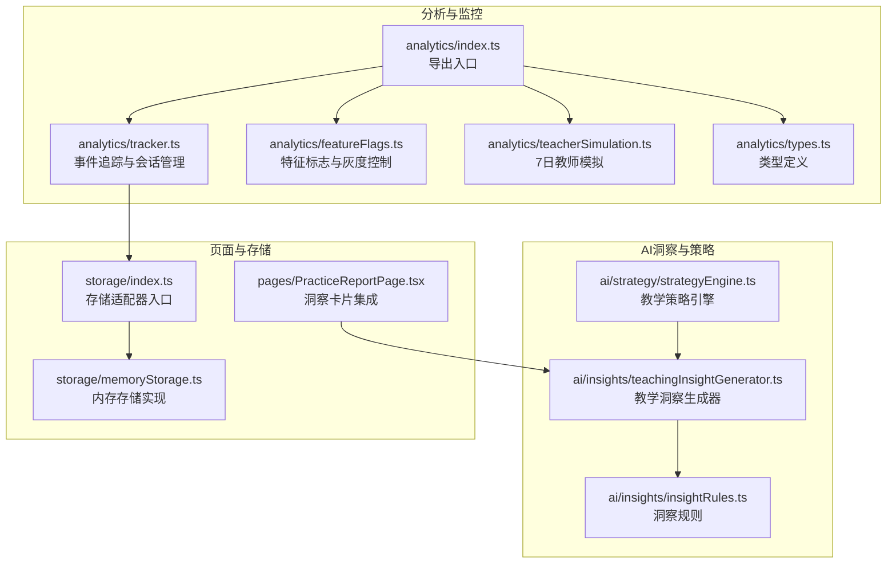
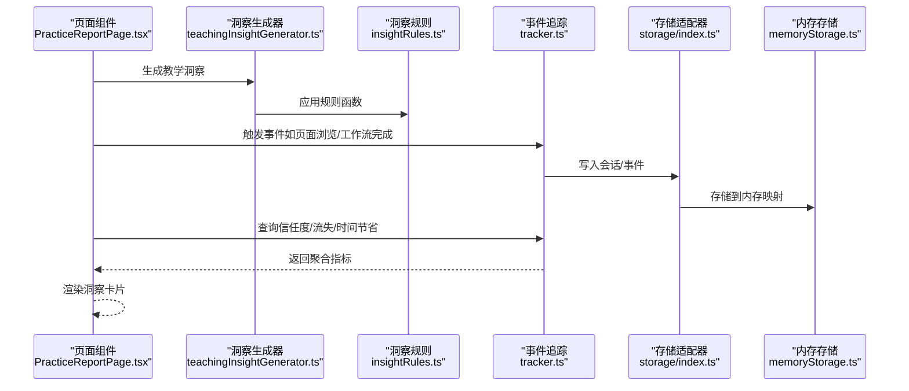
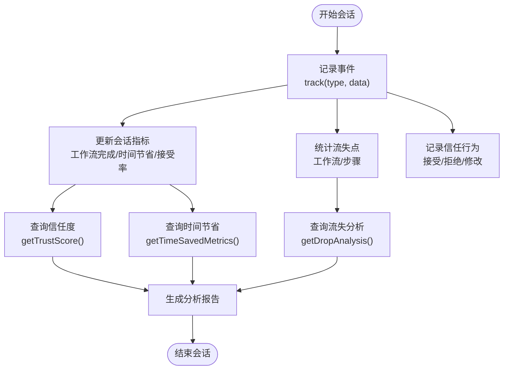
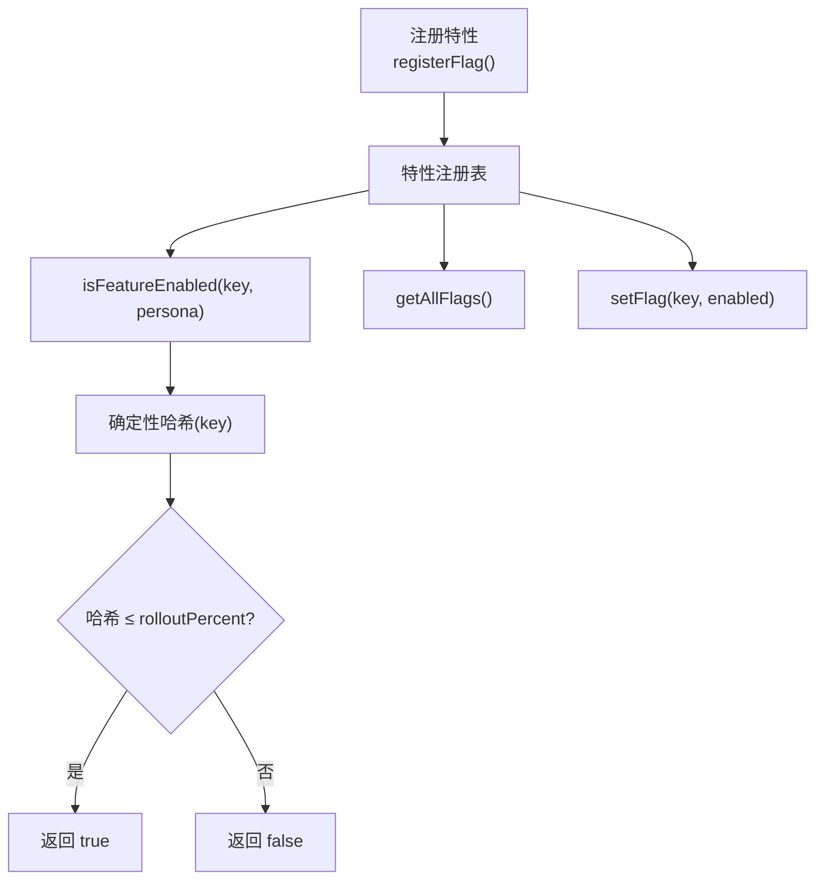
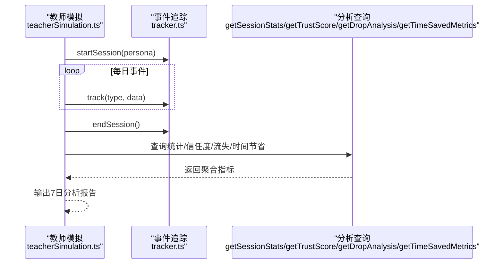
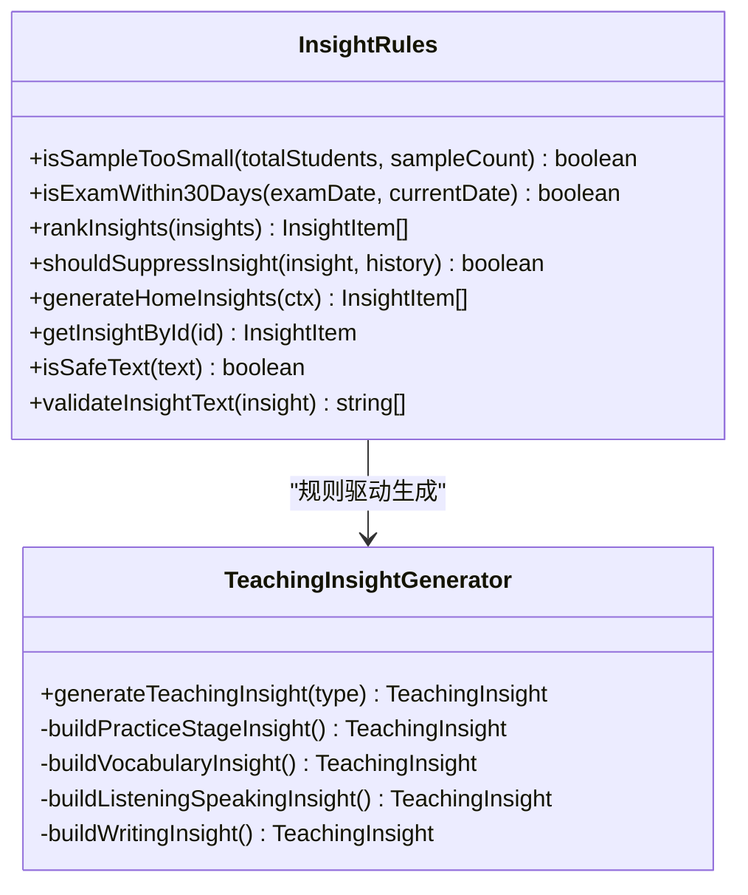
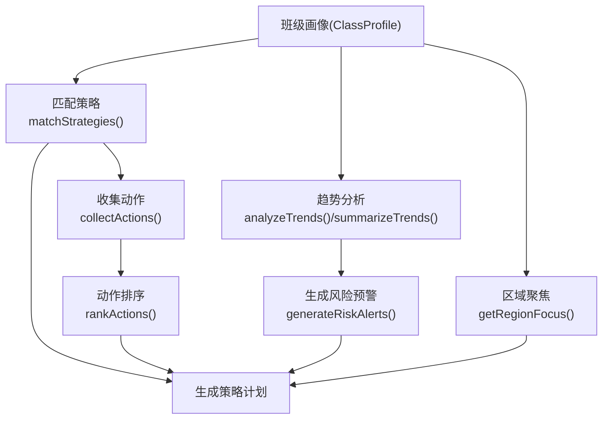
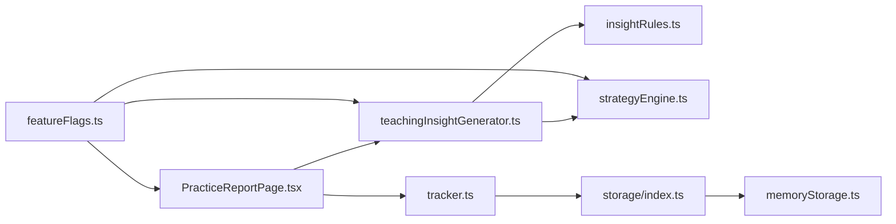

# 分析和监控系统

<cite>
**本文引用的文件**
- [src/analytics/index.ts](file://src/analytics/index.ts)
- [src/analytics/tracker.ts](file://src/analytics/tracker.ts)
- [src/analytics/featureFlags.ts](file://src/analytics/featureFlags.ts)
- [src/analytics/teacherSimulation.ts](file://src/analytics/teacherSimulation.ts)
- [src/analytics/types.ts](file://src/analytics/types.ts)
- [src/ai/insights/insightRules.ts](file://src/ai/insights/insightRules.ts)
- [src/ai/insights/teachingInsightGenerator.ts](file://src/ai/insights/teachingInsightGenerator.ts)
- [src/ai/strategy/strategyEngine.ts](file://src/ai/strategy/strategyEngine.ts)
- [src/pages/PracticeReportPage.tsx](file://src/pages/PracticeReportPage.tsx)
- [src/storage/index.ts](file://src/storage/index.ts)
- [src/storage/memoryStorage.ts](file://src/storage/memoryStorage.ts)
</cite>

## 目录
1. [简介](#简介)
2. [项目结构](#项目结构)
3. [核心组件](#核心组件)
4. [架构总览](#架构总览)
5. [详细组件分析](#详细组件分析)
6. [依赖关系分析](#依赖关系分析)
7. [性能考量](#性能考量)
8. [故障排查指南](#故障排查指南)
9. [结论](#结论)
10. [附录](#附录)

## 简介
本文件面向小天AI教育平台的分析与监控系统，系统性阐述以下方面：
- 分析系统的设计架构与事件追踪机制
- 特征标志系统与A/B测试支持
- 教师模拟系统与产品验证流程
- 用户行为分析与性能监控策略
- 分析数据的采集、处理与可视化方法
- 系统扩展与自定义开发指南
- 开发者实现与使用框架

该系统以“教师行为追踪”为核心，结合“洞察规则与教学策略”，并通过“特征标志灰度发布”与“7日教师模拟”形成闭环验证，最终在页面中以“洞察卡片”形式呈现分析结果。

## 项目结构
分析与监控系统主要分布在如下模块：
- analytics：事件追踪、特征标志、教师模拟、类型定义
- ai/insights：洞察规则与教学洞察生成器
- ai/strategy：教学策略引擎
- pages：页面集成与可视化入口
- storage：存储适配器（内存/可扩展）

图表来源
- [src/analytics/index.ts:1-34](file://src/analytics/index.ts#L1-L34)
- [src/analytics/tracker.ts:1-216](file://src/analytics/tracker.ts#L1-L216)
- [src/analytics/featureFlags.ts:1-108](file://src/analytics/featureFlags.ts#L1-L108)
- [src/analytics/teacherSimulation.ts:1-194](file://src/analytics/teacherSimulation.ts#L1-L194)
- [src/analytics/types.ts:1-150](file://src/analytics/types.ts#L1-L150)
- [src/ai/insights/insightRules.ts:1-179](file://src/ai/insights/insightRules.ts#L1-L179)
- [src/ai/insights/teachingInsightGenerator.ts:1-388](file://src/ai/insights/teachingInsightGenerator.ts#L1-L388)
- [src/ai/strategy/strategyEngine.ts:1-319](file://src/ai/strategy/strategyEngine.ts#L1-L319)
- [src/pages/PracticeReportPage.tsx:1-339](file://src/pages/PracticeReportPage.tsx#L1-L339)
- [src/storage/index.ts:1-36](file://src/storage/index.ts#L1-L36)
- [src/storage/memoryStorage.ts:1-168](file://src/storage/memoryStorage.ts#L1-L168)

章节来源
- [src/analytics/index.ts:1-34](file://src/analytics/index.ts#L1-L34)
- [src/analytics/tracker.ts:1-216](file://src/analytics/tracker.ts#L1-L216)
- [src/analytics/featureFlags.ts:1-108](file://src/analytics/featureFlags.ts#L1-L108)
- [src/analytics/teacherSimulation.ts:1-194](file://src/analytics/teacherSimulation.ts#L1-L194)
- [src/analytics/types.ts:1-150](file://src/analytics/types.ts#L1-L150)
- [src/ai/insights/insightRules.ts:1-179](file://src/ai/insights/insightRules.ts#L1-L179)
- [src/ai/insights/teachingInsightGenerator.ts:1-388](file://src/ai/insights/teachingInsightGenerator.ts#L1-L388)
- [src/ai/strategy/strategyEngine.ts:1-319](file://src/ai/strategy/strategyEngine.ts#L1-L319)
- [src/pages/PracticeReportPage.tsx:1-339](file://src/pages/PracticeReportPage.tsx#L1-L339)
- [src/storage/index.ts:1-36](file://src/storage/index.ts#L1-L36)
- [src/storage/memoryStorage.ts:1-168](file://src/storage/memoryStorage.ts#L1-L168)

## 核心组件
- 事件追踪与会话管理：负责教师行为事件采集、会话生命周期管理、信任度与流失分析、时间节省指标统计。
- 特征标志系统：支持按教师画像与百分比灰度的特性开关，便于A/B测试与渐进式发布。
- 教师模拟系统：构造7日连续使用场景，验证产品价值与用户体验路径。
- 洞察规则与教学洞察：基于规则生成洞察清单，统一生成教学洞察数据结构。
- 教学策略引擎：依据班级画像、地区、阶段与趋势数据生成策略计划与风险预警。
- 页面集成与可视化：在练习报告页以“洞察卡片”形式展示分析结果，支持点击跳转到具体分析区域。

章节来源
- [src/analytics/tracker.ts:1-216](file://src/analytics/tracker.ts#L1-L216)
- [src/analytics/featureFlags.ts:1-108](file://src/analytics/featureFlags.ts#L1-L108)
- [src/analytics/teacherSimulation.ts:1-194](file://src/analytics/teacherSimulation.ts#L1-L194)
- [src/ai/insights/insightRules.ts:1-179](file://src/ai/insights/insightRules.ts#L1-L179)
- [src/ai/insights/teachingInsightGenerator.ts:1-388](file://src/ai/insights/teachingInsightGenerator.ts#L1-L388)
- [src/ai/strategy/strategyEngine.ts:1-319](file://src/ai/strategy/strategyEngine.ts#L1-L319)
- [src/pages/PracticeReportPage.tsx:1-339](file://src/pages/PracticeReportPage.tsx#L1-L339)

## 架构总览
系统采用“事件驱动 + 规则引擎 + 策略引擎”的架构，数据流从页面触发事件，经追踪模块落盘，再由查询接口生成信任度、流失与时间节省等指标，并在页面以洞察卡片呈现；同时通过特征标志实现灰度发布与A/B测试。

图表来源
- [src/pages/PracticeReportPage.tsx:201-339](file://src/pages/PracticeReportPage.tsx#L201-L339)
- [src/ai/insights/teachingInsightGenerator.ts:12-66](file://src/ai/insights/teachingInsightGenerator.ts#L12-L66)
- [src/ai/insights/insightRules.ts:42-128](file://src/ai/insights/insightRules.ts#L42-L128)
- [src/analytics/tracker.ts:53-134](file://src/analytics/tracker.ts#L53-L134)
- [src/storage/index.ts:13-22](file://src/storage/index.ts#L13-L22)
- [src/storage/memoryStorage.ts:28-168](file://src/storage/memoryStorage.ts#L28-L168)

## 详细组件分析

### 事件追踪与会话管理
- 会话管理：startSession/endSession/currentSession维护当前会话与历史会话列表；事件计数器确保事件ID唯一。
- 事件采集：track统一记录事件类型、页面、时间戳、教师画像与数据载荷；同时更新会话内指标（工作流完成数、时间节省估计、推荐接受率）。
- 流失分析：通过工作流开始/步骤流失事件统计流失点与流失率。
- 信任度计算：基于最近与前一段的推荐接受率，计算总体信任度、按类型细分的信任度与趋势。
- 时间节省指标：按活动类型估算节省时间，提供周环比变化。

图表来源
- [src/analytics/tracker.ts:25-134](file://src/analytics/tracker.ts#L25-L134)
- [src/analytics/tracker.ts:138-215](file://src/analytics/tracker.ts#L138-L215)

章节来源
- [src/analytics/tracker.ts:1-216](file://src/analytics/tracker.ts#L1-L216)

### 特征标志系统与A/B测试支持
- 注册与查询：通过注册表集中管理特性开关，支持启用/禁用、按教师画像目标、按百分比灰度。
- 灰度策略：使用确定性哈希将特性键映射到0-100区间，按rolloutPercent决定是否对某用户可见。
- 运行时控制：支持动态设置特性开关，便于快速回滚与实验。

图表来源
- [src/analytics/featureFlags.ts:69-107](file://src/analytics/featureFlags.ts#L69-L107)

章节来源
- [src/analytics/featureFlags.ts:1-108](file://src/analytics/featureFlags.ts#L1-L108)

### 教师模拟系统与产品验证
- 模拟场景：构造7日连续使用场景，覆盖新手、经验型、班主任、冲刺型教师画像，记录典型事件序列。
- 数据驱动：每日常态化事件（如AI搜索、推荐接受/拒绝、工作流完成/取消、布置作业、反馈提交）。
- 报告输出：运行结束后汇总会话统计、信任度、流失点与时间节省指标，形成7日分析报告。

图表来源
- [src/analytics/teacherSimulation.ts:142-193](file://src/analytics/teacherSimulation.ts#L142-L193)
- [src/analytics/tracker.ts:180-215](file://src/analytics/tracker.ts#L180-L215)

章节来源
- [src/analytics/teacherSimulation.ts:1-194](file://src/analytics/teacherSimulation.ts#L1-L194)

### 洞察规则与教学洞察生成
- 洞察规则：提供样本规模判断、考试时间窗口判断、洞察排序、抑制策略、文本安全过滤等规则函数。
- 教学洞察：统一生成教学洞察数据结构，包含优先级、标题、摘要、结论、指标、趋势、对比、问题诊断、建议动作、关联项与雷达图等。
- 页面集成：练习报告页通过按钮触发洞察生成，渲染“阶段练习洞察”卡片，支持点击跳转到具体分析区域。

图表来源
- [src/ai/insights/insightRules.ts:23-179](file://src/ai/insights/insightRules.ts#L23-L179)
- [src/ai/insights/teachingInsightGenerator.ts:12-388](file://src/ai/insights/teachingInsightGenerator.ts#L12-L388)

章节来源
- [src/ai/insights/insightRules.ts:1-179](file://src/ai/insights/insightRules.ts#L1-L179)
- [src/ai/insights/teachingInsightGenerator.ts:1-388](file://src/ai/insights/teachingInsightGenerator.ts#L1-L388)
- [src/pages/PracticeReportPage.tsx:215-287](file://src/pages/PracticeReportPage.tsx#L215-L287)

### 教学策略引擎
- 策略定义：按年级、场景、考试阶段、班级等级、地区等维度定义教学策略，给出目标与行动优先级。
- 策略匹配：根据班级画像匹配可用策略，收集并加权动作优先级。
- 风险预警：基于趋势分析与薄弱点生成风险提示。
- 区域聚焦：按地区侧重生成教学关注点。
- 总结输出：生成策略计划摘要，供教师参考。

图表来源
- [src/ai/strategy/strategyEngine.ts:133-186](file://src/ai/strategy/strategyEngine.ts#L133-L186)
- [src/ai/strategy/strategyEngine.ts:192-226](file://src/ai/strategy/strategyEngine.ts#L192-L226)
- [src/ai/strategy/strategyEngine.ts:228-281](file://src/ai/strategy/strategyEngine.ts#L228-L281)
- [src/ai/strategy/strategyEngine.ts:292-318](file://src/ai/strategy/strategyEngine.ts#L292-L318)

章节来源
- [src/ai/strategy/strategyEngine.ts:1-319](file://src/ai/strategy/strategyEngine.ts#L1-L319)

### 类型定义与数据模型
- 事件类型与事件结构：涵盖AI搜索、洞察点击、工作流生命周期、推荐交互、反馈提交等。
- 会话与教师画像：记录会话指标、教师画像字段与页面上下文。
- 信任记录与流失分析：记录推荐接受/拒绝/修改行为，支持按类型统计与趋势判断。
- 特征标志：特性键、标签、描述、启用状态、灰度百分比与目标画像。
- 时间节省指标：周累计节省时间、活动分解与周环比变化。

章节来源
- [src/analytics/types.ts:9-150](file://src/analytics/types.ts#L9-L150)

### 存储与持久化
- 存储适配器：全局单例模式，支持切换内存/SQLite等后端。
- 内存存储：基于Map的内存实现，提供会话、消息、工作流运行、工具结果与记忆条目的增删查改与清理。
- 扩展性：通过setStorageAdapter可无缝替换为生产可用的持久化存储。

章节来源
- [src/storage/index.ts:13-36](file://src/storage/index.ts#L13-L36)
- [src/storage/memoryStorage.ts:28-168](file://src/storage/memoryStorage.ts#L28-L168)

## 依赖关系分析
- 页面到洞察：PracticeReportPage通过generateTeachingInsight触发洞察生成，依赖洞察规则与生成器。
- 洞察到规则：洞察生成器内部调用洞察规则函数进行排序、抑制与安全校验。
- 洞察到策略：策略引擎独立于页面，可作为后台服务或定时任务生成策略计划，供页面或推送展示。
- 事件到存储：追踪模块将事件写入存储适配器，内存存储默认实现便于开发与演示。
- 特征标志：贯穿前端与部分后台逻辑，用于控制功能开关与A/B测试流量分配。

图表来源
- [src/pages/PracticeReportPage.tsx:201-339](file://src/pages/PracticeReportPage.tsx#L201-L339)
- [src/ai/insights/teachingInsightGenerator.ts:12-66](file://src/ai/insights/teachingInsightGenerator.ts#L12-L66)
- [src/ai/insights/insightRules.ts:42-128](file://src/ai/insights/insightRules.ts#L42-L128)
- [src/ai/strategy/strategyEngine.ts:133-186](file://src/ai/strategy/strategyEngine.ts#L133-L186)
- [src/analytics/tracker.ts:53-134](file://src/analytics/tracker.ts#L53-L134)
- [src/storage/index.ts:13-22](file://src/storage/index.ts#L13-L22)
- [src/storage/memoryStorage.ts:28-168](file://src/storage/memoryStorage.ts#L28-L168)
- [src/analytics/featureFlags.ts:73-90](file://src/analytics/featureFlags.ts#L73-L90)

章节来源
- [src/pages/PracticeReportPage.tsx:1-339](file://src/pages/PracticeReportPage.tsx#L1-L339)
- [src/ai/insights/teachingInsightGenerator.ts:1-388](file://src/ai/insights/teachingInsightGenerator.ts#L1-L388)
- [src/ai/insights/insightRules.ts:1-179](file://src/ai/insights/insightRules.ts#L1-L179)
- [src/ai/strategy/strategyEngine.ts:1-319](file://src/ai/strategy/strategyEngine.ts#L1-L319)
- [src/analytics/tracker.ts:1-216](file://src/analytics/tracker.ts#L1-L216)
- [src/storage/index.ts:1-36](file://src/storage/index.ts#L1-L36)
- [src/storage/memoryStorage.ts:1-168](file://src/storage/memoryStorage.ts#L1-L168)
- [src/analytics/featureFlags.ts:1-108](file://src/analytics/featureFlags.ts#L1-L108)

## 性能考量
- 事件追踪复杂度：事件写入为O(1)，会话统计与信任度计算基于滑动窗口与最近N条记录，整体为线性复杂度。
- 流失分析：Map查找与更新均为O(1)，排序为O(k log k)，k为不同步骤/工作流数量。
- 洞察规则：排序与抑制逻辑为O(n log n)与O(n)，n为候选洞察数量。
- 存储层：内存Map操作为O(1)，消息/运行/记忆条目限制避免无限增长。
- 建议：生产环境应将内存存储替换为持久化存储；对热点查询建立索引；对大规模会话统计采用增量聚合与缓存。

## 故障排查指南
- 事件未记录：检查当前是否存在有效会话；确认事件类型与数据载荷是否符合类型定义。
- 信任度异常：检查最近推荐事件数量与类型分布；核对时间窗口划分是否合理。
- 流失分析为空：确认工作流开始与步骤流失事件是否正确上报；检查步骤ID命名一致性。
- 洞察不显示：确认generateTeachingInsight调用是否成功；检查洞察规则是否抑制了某些模块。
- 特性未生效：核对isFeatureEnabled参数（key与persona）；检查rolloutPercent与目标画像配置。
- 存储异常：确认setStorageAdapter是否正确设置；检查内存存储容量上限与清理策略。

章节来源
- [src/analytics/tracker.ts:53-134](file://src/analytics/tracker.ts#L53-L134)
- [src/analytics/tracker.ts:170-193](file://src/analytics/tracker.ts#L170-L193)
- [src/ai/insights/teachingInsightGenerator.ts:12-66](file://src/ai/insights/teachingInsightGenerator.ts#L12-L66)
- [src/analytics/featureFlags.ts:73-90](file://src/analytics/featureFlags.ts#L73-L90)
- [src/storage/index.ts:13-22](file://src/storage/index.ts#L13-L22)
- [src/storage/memoryStorage.ts:28-168](file://src/storage/memoryStorage.ts#L28-L168)

## 结论
小天AI教育平台的分析与监控系统以“教师行为追踪”为基础，结合“洞察规则与教学策略”，通过“特征标志灰度发布”与“7日教师模拟”形成闭环验证。系统具备清晰的模块边界与扩展点，能够支撑产品价值验证、用户体验优化与教学效果评估。建议在生产环境中完善存储与缓存策略，并持续迭代洞察规则与策略引擎，以提升分析质量与实用性。

## 附录
- 开发者实现与使用框架
  - 事件追踪：在页面关键交互处调用track记录事件；在会话开始/结束时调用startSession/endSession。
  - 洞察卡片：在页面中添加按钮触发generateTeachingInsight，渲染洞察卡片并支持点击跳转。
  - 特征标志：在业务逻辑中调用isFeatureEnabled进行功能开关判断；必要时使用getAllFlags与setFlag进行调试与回滚。
  - 教师模拟：调用run7DaySimulation生成7日分析报告，用于产品验证与回归测试。
  - 存储适配：开发阶段使用内存存储；生产环境通过setStorageAdapter切换为SQLite/PostgreSQL等持久化存储。

章节来源
- [src/analytics/index.ts:1-34](file://src/analytics/index.ts#L1-L34)
- [src/pages/PracticeReportPage.tsx:215-287](file://src/pages/PracticeReportPage.tsx#L215-L287)
- [src/analytics/featureFlags.ts:92-99](file://src/analytics/featureFlags.ts#L92-L99)
- [src/analytics/teacherSimulation.ts:142-193](file://src/analytics/teacherSimulation.ts#L142-L193)
- [src/storage/index.ts:15-18](file://src/storage/index.ts#L15-L18)