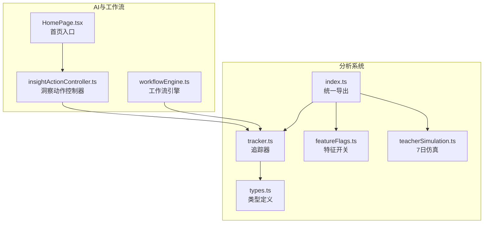
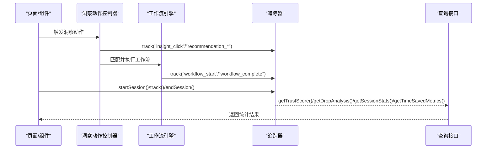
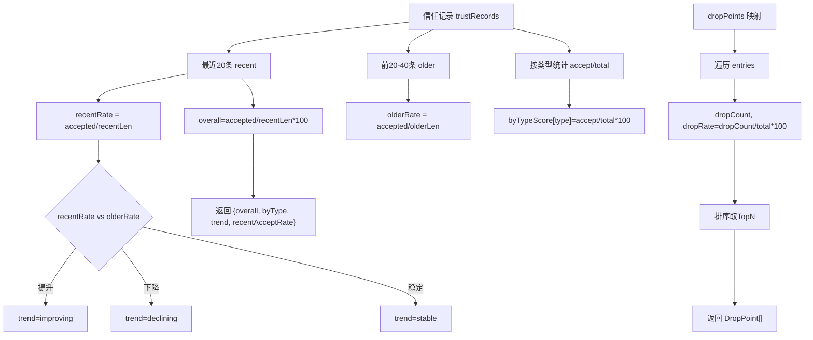
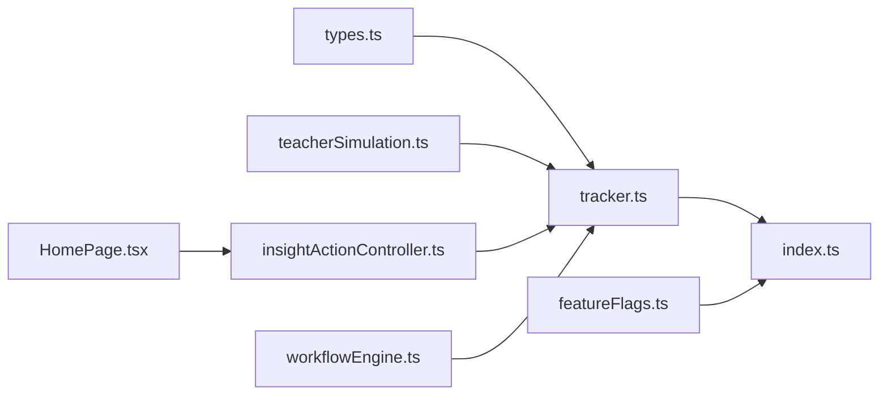

# 分析系统架构

<cite>
**本文引用的文件**   
- [src/analytics/index.ts](file://src/analytics/index.ts)
- [src/analytics/tracker.ts](file://src/analytics/tracker.ts)
- [src/analytics/types.ts](file://src/analytics/types.ts)
- [src/analytics/featureFlags.ts](file://src/analytics/featureFlags.ts)
- [src/analytics/teacherSimulation.ts](file://src/analytics/teacherSimulation.ts)
- [src/ai/insights/insightActionController.ts](file://src/ai/insights/insightActionController.ts)
- [src/ai/workflows/workflowEngine.ts](file://src/ai/workflows/workflowEngine.ts)
- [src/pages/HomePage.tsx](file://src/pages/HomePage.tsx)
</cite>

## 目录
1. [引言](#引言)
2. [项目结构](#项目结构)
3. [核心组件](#核心组件)
4. [架构总览](#架构总览)
5. [详细组件分析](#详细组件分析)
6. [依赖关系分析](#依赖关系分析)
7. [性能考量](#性能考量)
8. [故障排查指南](#故障排查指南)
9. [结论](#结论)
10. [附录](#附录)

## 引言
本文件面向小天AI教育平台的分析系统，系统性梳理其整体设计与核心实现，重点覆盖以下方面：
- 事件追踪机制：startSession、track、endSession 的工作流程与数据流转
- 会话管理：当前会话与历史会话的生命周期与状态维护
- 信任评分：基于推荐采纳/拒绝/修改行为的可信度计算
- 流失分析：基于工作流步骤的掉线点与漏斗转化分析
- 数据采集、处理与存储策略：内存态聚合与查询接口
- 事件类型定义、会话状态管理与统计指标计算方法
- 扩展接口与自定义分析：如何新增事件类型、扩展统计维度与接入外部存储
- 开发者最佳实践：埋点规范、查询接口使用与灰度控制

## 项目结构
分析系统位于 src/analytics 目录，采用“模块化导出 + 类型定义 + 模拟仿真”的组织方式：
- 入口导出：统一暴露追踪器、特征开关与仿真工具
- 核心追踪器：会话管理、事件采集、信任评分、流失分析与统计查询
- 类型定义：事件类型、会话模型、信任记录、漏斗与指标等
- 特征开关：按教师画像与灰度比例控制功能可见性
- 仿真：7天教师使用模拟，验证产品价值与分析指标



图表来源
- [src/analytics/index.ts:1-34](file://src/analytics/index.ts#L1-L34)
- [src/analytics/tracker.ts:1-216](file://src/analytics/tracker.ts#L1-L216)
- [src/analytics/types.ts:1-150](file://src/analytics/types.ts#L1-L150)
- [src/analytics/featureFlags.ts:1-108](file://src/analytics/featureFlags.ts#L1-L108)
- [src/analytics/teacherSimulation.ts:1-194](file://src/analytics/teacherSimulation.ts#L1-L194)
- [src/ai/insights/insightActionController.ts:1-229](file://src/ai/insights/insightActionController.ts#L1-L229)
- [src/ai/workflows/workflowEngine.ts:1-119](file://src/ai/workflows/workflowEngine.ts#L1-L119)
- [src/pages/HomePage.tsx:1-200](file://src/pages/HomePage.tsx#L1-L200)

章节来源
- [src/analytics/index.ts:1-34](file://src/analytics/index.ts#L1-L34)

## 核心组件
- 追踪器（Tracker）
  - 会话管理：startSession、endSession、getCurrentSession
  - 事件追踪：track（含会话内统计更新、信任记录、流失点统计）
  - 查询接口：getTrustScore、getDropAnalysis、getSessionStats、getTimeSavedMetrics
- 类型系统（Types）
  - 事件类型枚举、会话模型、教师画像、信任记录、漏斗与指标
- 特征开关（Feature Flags）
  - 注册与查询、按教师画像与灰度百分比控制
- 仿真（Teacher Simulation）
  - 7日连续使用模拟，驱动追踪器并输出报告

章节来源
- [src/analytics/tracker.ts:1-216](file://src/analytics/tracker.ts#L1-L216)
- [src/analytics/types.ts:1-150](file://src/analytics/types.ts#L1-L150)
- [src/analytics/featureFlags.ts:1-108](file://src/analytics/featureFlags.ts#L1-L108)
- [src/analytics/teacherSimulation.ts:1-194](file://src/analytics/teacherSimulation.ts#L1-L194)

## 架构总览
分析系统以“追踪器”为核心，围绕会话生命周期进行事件采集与统计，并通过查询接口对外提供信任评分、流失分析与会话统计。特征开关用于控制功能灰度，仿真模块用于验证指标有效性。



图表来源
- [src/analytics/tracker.ts:25-49](file://src/analytics/tracker.ts#L25-L49)
- [src/analytics/tracker.ts:53-134](file://src/analytics/tracker.ts#L53-L134)
- [src/analytics/tracker.ts:138-215](file://src/analytics/tracker.ts#L138-L215)
- [src/ai/insights/insightActionController.ts:48-156](file://src/ai/insights/insightActionController.ts#L48-L156)
- [src/ai/workflows/workflowEngine.ts:42-78](file://src/ai/workflows/workflowEngine.ts#L42-L78)

## 详细组件分析

### 事件追踪机制与API工作流
- startSession
  - 初始化当前会话，注入教师画像与起始时间，自动记录会话开始事件
- track
  - 生成事件对象并写入当前会话
  - 更新会话内统计：工作流完成数、节省时间、采纳率
  - 维护流失点映射（按步骤ID计数）与漏斗（按工作流ID累计进入）
  - 记录推荐信任事件（接受/拒绝/修改），并更新采纳率
- endSession
  - 记录会话结束事件，计算会话时长，写入历史会话并清空当前会话

```mermaid
flowchart TD
S["startSession(persona)"] --> T1["track('session_start')"]
T1 --> C["当前会话初始化完成"]
C --> EVT{"track(type, data)"}
EVT --> |workflow_complete| WF["workflowsCompleted++"]
EVT --> |add_to_basket| TS1["timeSavedMinutes+=3"]
EVT --> |assign_homework| TS2["timeSavedMinutes+=5"]
EVT --> |ai_search| TS3["timeSavedMinutes+=1"]
EVT --> |workflow_step_drop(stepId)| DP["dropPoints[stepId].count++"]
EVT --> |workflow_start(workflowId)| FN["dropPoints['wf-'+id].total++"]
EVT --> |recommendation_*| TR["trustRecords.push(...)"]
EVT --> |更新采纳率| AR["recommendationAcceptRate"]
AR --> E["endSession()"]
E --> H["写入sessionHistory并清空当前会话"]
```

图表来源
- [src/analytics/tracker.ts:25-49](file://src/analytics/tracker.ts#L25-L49)
- [src/analytics/tracker.ts:53-134](file://src/analytics/tracker.ts#L53-L134)
- [src/analytics/tracker.ts:180-193](file://src/analytics/tracker.ts#L180-L193)

章节来源
- [src/analytics/tracker.ts:25-49](file://src/analytics/tracker.ts#L25-L49)
- [src/analytics/tracker.ts:53-134](file://src/analytics/tracker.ts#L53-L134)

### 会话管理与状态维护
- 当前会话：仅允许一个活跃会话，所有事件写入该会话
- 历史会话：会话结束时复制到历史数组，便于离线统计
- 会话内统计：
  - 工作流完成数
  - 节省时间（分钟）：不同动作赋予不同权重
  - 推荐采纳率：基于会话内“接受/拒绝”事件计算

章节来源
- [src/analytics/tracker.ts:19-23](file://src/analytics/tracker.ts#L19-L23)
- [src/analytics/tracker.ts:72-75](file://src/analytics/tracker.ts#L72-L75)
- [src/analytics/tracker.ts:122-131](file://src/analytics/tracker.ts#L122-L131)

### 信任评分与流失分析
- 信任评分
  - 最近20条信任记录的总体采纳率与趋势（近期vs前20条）
  - 按推荐类型分组的采纳率
- 流失分析
  - 基于 dropPoints 映射统计各步骤掉线次数与掉线率
  - 漏斗分析：按工作流ID统计进入/完成/掉线与转化率



图表来源
- [src/analytics/tracker.ts:138-168](file://src/analytics/tracker.ts#L138-L168)
- [src/analytics/tracker.ts:170-178](file://src/analytics/tracker.ts#L170-L178)

章节来源
- [src/analytics/tracker.ts:138-168](file://src/analytics/tracker.ts#L138-L168)
- [src/analytics/tracker.ts:170-178](file://src/analytics/tracker.ts#L170-L178)

### 统计指标与时间节省度量
- 会话统计
  - 总会话数、总工作流完成数、总节省时间、平均会话时长、信任评分
- 时间节省度量
  - 本周节省总时长与周环比变化
  - 按活动类型的节省时长与发生频次拆解

章节来源
- [src/analytics/tracker.ts:180-193](file://src/analytics/tracker.ts#L180-L193)
- [src/analytics/tracker.ts:195-215](file://src/analytics/tracker.ts#L195-L215)

### 事件类型定义与数据模型
- 事件类型（示例）
  - 搜索、洞察点击、工作流启动/完成/取消/步骤掉线
  - 推荐采纳/拒绝/修改、重新生成、编辑结果、布置作业、加入篮子、导出资源、卡片查看、页面浏览、会话开始/结束、反馈提交
- 会话模型
  - 包含教师画像、起止时间、事件列表、节省时间、完成工作流数、采纳率
- 信任记录与漏斗
  - 信任记录包含推荐ID、类型、动作、时间戳与教师画像
  - 漏斗以“wf-{id}”键统计进入/完成/掉线

章节来源
- [src/analytics/types.ts:9-30](file://src/analytics/types.ts#L9-L30)
- [src/analytics/types.ts:48-60](file://src/analytics/types.ts#L48-L60)
- [src/analytics/types.ts:82-110](file://src/analytics/types.ts#L82-L110)

### 特征开关与灰度控制
- 注册多个功能开关，包含标签、描述、启用状态、灰度百分比与目标教师画像
- 查询逻辑
  - 检查启用状态与目标画像
  - 使用确定性哈希计算灰度阈值，决定是否对当前用户生效
- 支持动态设置开关状态

章节来源
- [src/analytics/featureFlags.ts:13-65](file://src/analytics/featureFlags.ts#L13-L65)
- [src/analytics/featureFlags.ts:73-99](file://src/analytics/featureFlags.ts#L73-L99)

### 7日教师使用仿真
- 模拟连续7天的教师使用行为，覆盖不同教师画像
- 逐日驱动 startSession、track、endSession
- 输出会话统计、信任评分、流失分析与时间节省指标

章节来源
- [src/analytics/teacherSimulation.ts:20-138](file://src/analytics/teacherSimulation.ts#L20-L138)
- [src/analytics/teacherSimulation.ts:142-193](file://src/analytics/teacherSimulation.ts#L142-L193)

### 与AI系统与工作流的集成
- 洞察动作控制器
  - 将洞察动作路由到不同面板或导航到搜索页，同时触发追踪事件
- 工作流引擎
  - 匹配自然语言到工作流，构建上下文并执行，期间产生工作流相关事件
- 首页入口
  - 触发AI搜索、布置练习等动作，间接驱动追踪器

章节来源
- [src/ai/insights/insightActionController.ts:48-156](file://src/ai/insights/insightActionController.ts#L48-L156)
- [src/ai/workflows/workflowEngine.ts:42-78](file://src/ai/workflows/workflowEngine.ts#L42-L78)
- [src/pages/HomePage.tsx:122-173](file://src/pages/HomePage.tsx#L122-L173)

## 依赖关系分析
- 追踪器依赖类型定义，提供会话、事件、信任记录与指标模型
- 特征开关独立于追踪器，但可被上层业务在渲染/路由前判断
- 仿真模块直接依赖追踪器API，形成闭环验证
- 洞察动作控制器与工作流引擎通过事件驱动追踪器，形成端到端埋点链路



图表来源
- [src/analytics/types.ts:1-150](file://src/analytics/types.ts#L1-L150)
- [src/analytics/tracker.ts:1-216](file://src/analytics/tracker.ts#L1-L216)
- [src/analytics/index.ts:1-34](file://src/analytics/index.ts#L1-L34)
- [src/analytics/featureFlags.ts:1-108](file://src/analytics/featureFlags.ts#L1-L108)
- [src/analytics/teacherSimulation.ts:1-194](file://src/analytics/teacherSimulation.ts#L1-L194)
- [src/ai/insights/insightActionController.ts:1-229](file://src/ai/insights/insightActionController.ts#L1-L229)
- [src/ai/workflows/workflowEngine.ts:1-119](file://src/ai/workflows/workflowEngine.ts#L1-L119)
- [src/pages/HomePage.tsx:1-200](file://src/pages/HomePage.tsx#L1-L200)

## 性能考量
- 内存态聚合
  - 会话、信任记录与流失点均在内存中维护，查询复杂度低，适合实时分析
- 事件计数与滑动窗口
  - 信任评分使用固定长度滑动窗口（最近20条），避免长期累积导致的偏差
- 时间复杂度
  - 事件写入O(1)，查询接口多为线性扫描（受限于会话/记录规模），满足前端实时需求
- 建议
  - 对超大规模场景，可考虑引入持久化存储与索引，结合定时聚合任务降低前端压力

## 故障排查指南
- 无当前会话
  - 现象：track返回空或抛出异常
  - 排查：确保已先调用 startSession，再进行事件追踪
- 事件未计入统计
  - 现象：工作流完成数/节省时间未增长
  - 排查：确认事件类型是否为 workflow_complete、add_to_basket、assign_homework 或 ai_search
- 采纳率不更新
  - 现象：recommendationAcceptRate 保持不变
  - 排查：确认事件类型为 recommendation_accept/recommendation_reject
- 流失分析为空
  - 现象：getDropAnalysis 返回空或零率
  - 排查：确认事件类型为 workflow_step_drop 且包含 stepId；或 workflow_start 且包含 workflowId
- 特征开关不生效
  - 现象：功能未按预期灰度
  - 排查：检查目标教师画像与 rolloutPercent，确认 isFeatureEnabled 的调用参数

章节来源
- [src/analytics/tracker.ts:57-58](file://src/analytics/tracker.ts#L57-L58)
- [src/analytics/tracker.ts:72-75](file://src/analytics/tracker.ts#L72-L75)
- [src/analytics/tracker.ts:122-131](file://src/analytics/tracker.ts#L122-L131)
- [src/analytics/tracker.ts:170-178](file://src/analytics/tracker.ts#L170-L178)
- [src/analytics/featureFlags.ts:73-99](file://src/analytics/featureFlags.ts#L73-L99)

## 结论
分析系统以轻量内存态聚合为核心，围绕会话生命周期提供事件追踪、信任评分与流失分析能力。通过统一导出与类型定义，系统具备良好的扩展性与可维护性。结合特征开关与7日仿真，能够快速验证产品价值与指标有效性。对于生产环境，建议在保证实时性的前提下，逐步引入持久化与索引优化，以支撑更大规模的数据分析与报表需求。

## 附录

### 扩展接口与自定义分析开发指南
- 新增事件类型
  - 在事件类型枚举中添加新类型
  - 在追踪器中补充对应统计逻辑（如节省时间、采纳率、流失点）
- 新增统计维度
  - 在会话模型中添加字段
  - 在查询接口中补充聚合与返回
- 接入外部存储
  - 在 endSession 时序列化当前会话并写入持久化层
  - 在查询接口中优先读取持久化数据，回退到内存态
- 灰度控制
  - 通过特征开关控制新功能曝光范围与目标画像
  - 使用 rolloutPercent 实现可控的用户比例分流

章节来源
- [src/analytics/types.ts:9-30](file://src/analytics/types.ts#L9-L30)
- [src/analytics/tracker.ts:72-131](file://src/analytics/tracker.ts#L72-L131)
- [src/analytics/featureFlags.ts:13-65](file://src/analytics/featureFlags.ts#L13-L65)