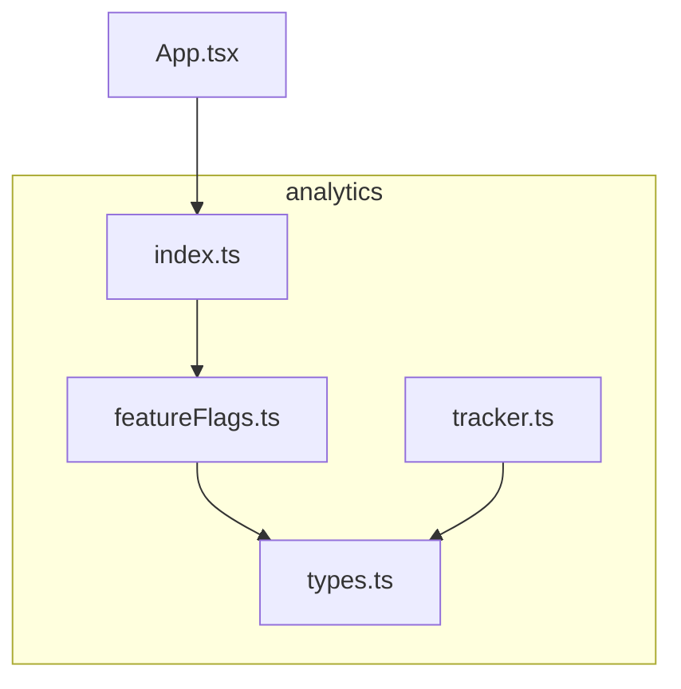
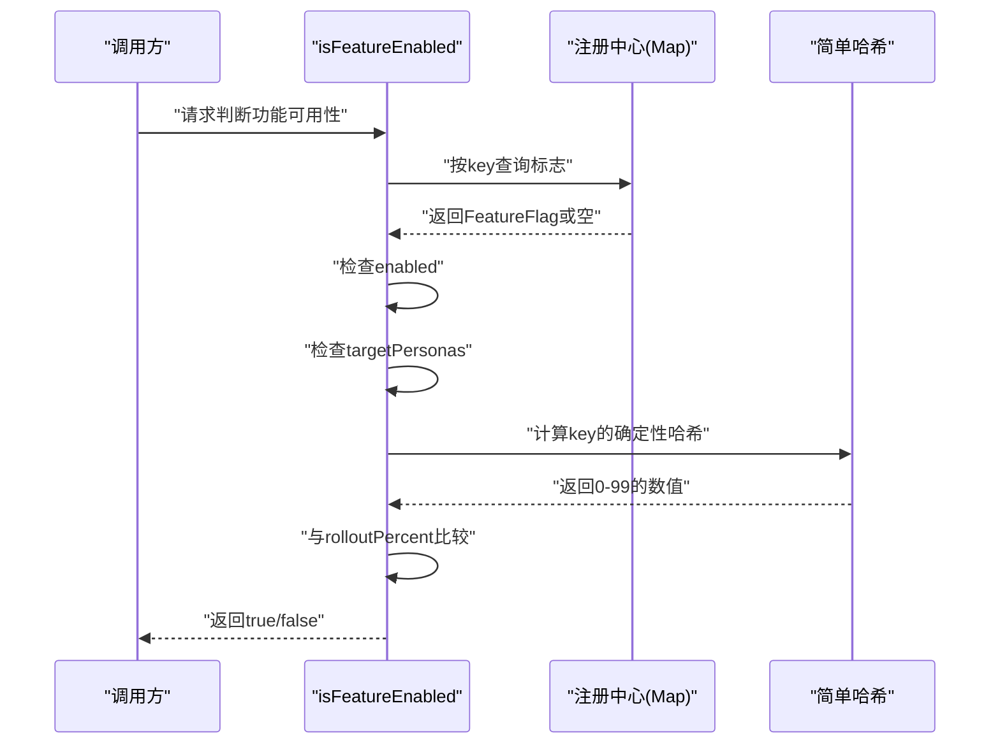
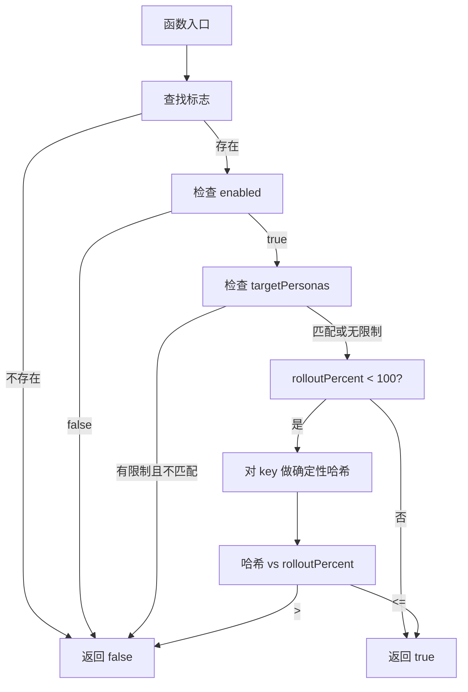
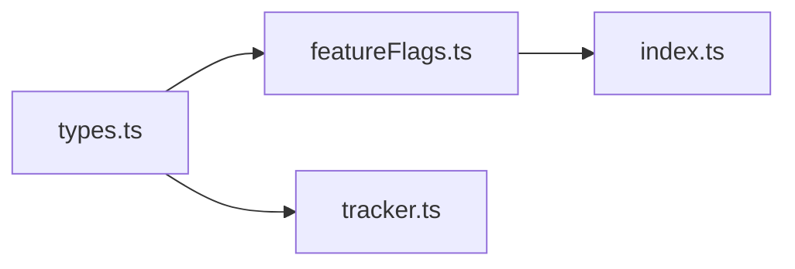

# 特征标志系统

<cite>
**本文引用的文件**
- [featureFlags.ts](file://src/analytics/featureFlags.ts)
- [types.ts](file://src/analytics/types.ts)
- [index.ts](file://src/analytics/index.ts)
- [tracker.ts](file://src/analytics/tracker.ts)
- [App.tsx](file://src/App.tsx)
</cite>

## 目录
1. [简介](#简介)
2. [项目结构](#项目结构)
3. [核心组件](#核心组件)
4. [架构总览](#架构总览)
5. [详细组件分析](#详细组件分析)
6. [依赖关系分析](#依赖关系分析)
7. [性能考量](#性能考量)
8. [故障排查指南](#故障排查指南)
9. [结论](#结论)
10. [附录](#附录)

## 简介
本文件为小天AI教育平台的特征标志系统提供完整技术文档。该系统用于对AI相关功能进行灰度发布与控制，支持按教师角色（persona）与用户占比（百分比）进行定向投放，同时提供运行时开关能力，便于快速回滚与实验验证。系统通过统一的注册中心与API对外暴露，确保在前端组件与业务流程中以一致的方式进行功能开关判断。

## 项目结构
特征标志系统位于 analytics 子模块中，核心文件如下：
- featureFlags.ts：特征标志注册与运行时判断逻辑
- types.ts：类型定义，包含 FeatureFlag 接口与教师角色枚举
- index.ts：导出入口，统一暴露 isFeatureEnabled、getAllFlags、setFlag 等API
- tracker.ts：教师行为埋点与分析（与特征标志协同用于实验评估）



图表来源
- [featureFlags.ts:1-108](file://src/analytics/featureFlags.ts#L1-L108)
- [types.ts:120-131](file://src/analytics/types.ts#L120-L131)
- [index.ts:13-14](file://src/analytics/index.ts#L13-L14)
- [tracker.ts:1-216](file://src/analytics/tracker.ts#L1-L216)
- [App.tsx:28-63](file://src/App.tsx#L28-L63)

章节来源
- [featureFlags.ts:1-108](file://src/analytics/featureFlags.ts#L1-L108)
- [types.ts:120-131](file://src/analytics/types.ts#L120-L131)
- [index.ts:13-14](file://src/analytics/index.ts#L13-L14)
- [tracker.ts:1-216](file://src/analytics/tracker.ts#L1-L216)
- [App.tsx:28-63](file://src/App.tsx#L28-L63)

## 核心组件
- 注册中心（flags Map）：集中存储所有 FeatureFlag 实例，键为字符串 key
- API：
  - isFeatureEnabled(key, persona?)：判断某功能是否对当前用户可见
  - getAllFlags()：获取全部标志配置
  - setFlag(key, enabled)：运行时修改某标志的启用状态
- 类型定义：
  - FeatureFlag：标志实体，包含 key、label、description、enabled、rolloutPercent、targetPersonas
  - TeacherPersonaType：教师角色枚举

章节来源
- [featureFlags.ts:11-107](file://src/analytics/featureFlags.ts#L11-L107)
- [types.ts:122-131](file://src/analytics/types.ts#L122-L131)

## 架构总览
特征标志系统采用“注册中心 + 运行时判定”的轻量架构。初始化时通过 registerFlag 将各功能标志注册到内存 Map；运行时通过 isFeatureEnabled 对目标用户进行多维判定（是否启用、角色匹配、百分比抽样），最终决定是否呈现对应功能。



图表来源
- [featureFlags.ts:73-90](file://src/analytics/featureFlags.ts#L73-L90)
- [featureFlags.ts:101-107](file://src/analytics/featureFlags.ts#L101-L107)

## 详细组件分析

### 数据模型与类型定义
FeatureFlag 接口字段说明：
- key：标志唯一标识，作为注册与查询的主键
- label：中文标签，便于运营与研发识别
- description：功能描述，记录目的与范围
- enabled：全局开关，false时直接不可见
- rolloutPercent：灰度百分比（0-100），用于按用户抽样
- targetPersonas：目标教师角色数组，空表示不限制

```mermaid
classDiagram
class FeatureFlag {
+string key
+string label
+string description
+boolean enabled
+number rolloutPercent
+TeacherPersonaType[] targetPersonas
}
class TeacherPersonaType {
<<enum>>
"new_teacher"
"experienced"
"head_teacher"
"exam_focused"
}
```

图表来源
- [types.ts:122-131](file://src/analytics/types.ts#L122-L131)
- [types.ts:64-69](file://src/analytics/types.ts#L64-L69)

章节来源
- [types.ts:122-131](file://src/analytics/types.ts#L122-L131)
- [types.ts:64-69](file://src/analytics/types.ts#L64-L69)

### API 使用与参数配置
- isFeatureEnabled(key, persona?)
  - 参数
    - key: 必填，标志键
    - persona: 可选，教师角色
  - 返回值: boolean
  - 行为规则
    - 未注册或未启用：返回 false
    - 有目标角色限制且 persona 不匹配：返回 false
    - 百分比小于100时，对 key 做确定性哈希，若哈希值大于 rolloutPercent 则返回 false
    - 其他情况返回 true
- getAllFlags()
  - 返回当前注册中心中的全部 FeatureFlag 数组
- setFlag(key, enabled)
  - 将指定标志的 enabled 字段设置为传入值（仅影响内存状态）

章节来源
- [featureFlags.ts:73-90](file://src/analytics/featureFlags.ts#L73-L90)
- [featureFlags.ts:92-94](file://src/analytics/featureFlags.ts#L92-L94)
- [featureFlags.ts:96-99](file://src/analytics/featureFlags.ts#L96-L99)

### 运行时判定流程图


图表来源
- [featureFlags.ts:73-90](file://src/analytics/featureFlags.ts#L73-L90)
- [featureFlags.ts:101-107](file://src/analytics/featureFlags.ts#L101-L107)

### 在A/B测试中的应用与实验设计
- 角色分层：通过 targetPersonas 限定实验群体，如仅对“经验教师”“班主任”开放
- 抽样策略：通过 rolloutPercent 对全量用户进行分桶，实现可控的流量分配
- 实验指标：结合 tracker.ts 中的行为埋点（如 workflow_start/completion、recommendation_accept/reject 等）评估功能效果
- 回滚与收敛：通过 setFlag 快速关闭问题功能；通过降低 rolloutPercent 逐步放量

章节来源
- [featureFlags.ts:78-87](file://src/analytics/featureFlags.ts#L78-L87)
- [tracker.ts:53-134](file://src/analytics/tracker.ts#L53-L134)

### 动态配置、权限控制与版本管理
- 动态配置
  - setFlag 支持运行时修改 enabled 状态，适合紧急回滚与临时开关
  - getAllFlags 可用于管理端/仪表盘展示与批量操作
- 权限控制
  - 通过 targetPersonas 限制可见范围，避免对不合适的用户群体暴露新功能
- 版本管理
  - 建议以 key 命名规范区分版本（如 feature-v1、feature-v2），并在注册时设定初始 rolloutPercent 与 targetPersonas
  - 通过 rolloutPercent 从0逐步提升至100，形成“灰度阶梯”

章节来源
- [featureFlags.ts:92-99](file://src/analytics/featureFlags.ts#L92-L99)
- [featureFlags.ts:13-65](file://src/analytics/featureFlags.ts#L13-L65)

### 扩展开发指南与最佳实践
- 新增标志
  - 在 featureFlags.ts 中使用 registerFlag 注册，设置合理的 rolloutPercent 与 targetPersonas
  - 为每个标志提供清晰的 label 与 description，便于跨团队协作
- 使用建议
  - 在组件渲染前调用 isFeatureEnabled，避免在运行时重复查询
  - 对需要持久化的用户偏好，建议结合本地存储或后端用户配置，但开关判断仍由 isFeatureEnabled 提供
- 实验设计
  - 明确实验目标与指标（如转化率、任务完成率、时间节省等）
  - 使用 rolloutPercent 设计多级灰度（如20/40/60/80/100），观察指标变化趋势
- 安全与可观测性
  - 对关键功能保留 debug-panel 等调试开关，便于问题定位
  - 通过 tracker.ts 记录关键事件，配合 getTrustScore/getDropAnalysis 等分析函数评估用户体验

章节来源
- [featureFlags.ts:13-65](file://src/analytics/featureFlags.ts#L13-L65)
- [tracker.ts:138-193](file://src/analytics/tracker.ts#L138-L193)

## 依赖关系分析
- featureFlags.ts 依赖 types.ts 中的 FeatureFlag 与 TeacherPersonaType
- index.ts 统一导出 isFeatureEnabled、getAllFlags、setFlag，供上层组件使用
- tracker.ts 依赖 types.ts 中的事件与会话类型，用于实验效果评估



图表来源
- [featureFlags.ts:7](file://src/analytics/featureFlags.ts#L7)
- [types.ts:122-131](file://src/analytics/types.ts#L122-L131)
- [index.ts:13-14](file://src/analytics/index.ts#L13-L14)
- [tracker.ts:8-15](file://src/analytics/tracker.ts#L8-L15)

章节来源
- [featureFlags.ts:7](file://src/analytics/featureFlags.ts#L7)
- [types.ts:122-131](file://src/analytics/types.ts#L122-L131)
- [index.ts:13-14](file://src/analytics/index.ts#L13-L14)
- [tracker.ts:8-15](file://src/analytics/tracker.ts#L8-L15)

## 性能考量
- 查询复杂度
  - 注册中心为 Map，查询/插入/更新均为 O(1)，整体性能优异
- 哈希计算
  - 确定性哈希函数对 key 字符串线性扫描，复杂度 O(n)，n 为 key 长度；通常较短，可忽略
- 内存占用
  - 每个标志对象包含少量字段，注册中心规模取决于功能数量，一般可忽略
- 建议
  - 将 isFeatureEnabled 的结果缓存于组件状态或上下文，减少重复计算
  - 对高频渲染路径，可在父组件层统一决策并向下传递布尔值

章节来源
- [featureFlags.ts:11](file://src/analytics/featureFlags.ts#L11)
- [featureFlags.ts:101-107](file://src/analytics/featureFlags.ts#L101-L107)

## 故障排查指南
- 症状：isFeatureEnabled 总是返回 false
  - 检查标志是否已通过 registerFlag 注册
  - 检查 enabled 是否为 true
  - 检查 targetPersonas 与传入 persona 是否匹配
  - 检查 rolloutPercent 与哈希计算结果
- 症状：setFlag 无法生效
  - 确认 key 正确且标志已注册
  - 注意 setFlag 仅修改内存状态，刷新页面后会丢失
- 症状：实验指标异常
  - 检查 rolloutPercent 是否与预期一致
  - 检查 targetPersonas 是否覆盖了目标群体
  - 使用 tracker.ts 的分析函数核对事件采集与统计

章节来源
- [featureFlags.ts:73-90](file://src/analytics/featureFlags.ts#L73-L90)
- [featureFlags.ts:96-99](file://src/analytics/featureFlags.ts#L96-L99)
- [tracker.ts:138-193](file://src/analytics/tracker.ts#L138-L193)

## 结论
特征标志系统以极简的注册中心与判定逻辑实现了灵活的功能开关与灰度发布能力。通过角色与百分比双维度控制，结合行为埋点与分析工具，能够支撑小天AI教育平台的持续实验与迭代优化。建议在后续版本中引入持久化开关与更细粒度的分桶策略，进一步增强实验的可控性与可追溯性。

## 附录
- 导出入口：index.ts 统一导出 isFeatureEnabled、getAllFlags、setFlag
- 示例路由：App.tsx 展示了页面路由组织方式，便于在页面级别集成特征标志控制

章节来源
- [index.ts:13-14](file://src/analytics/index.ts#L13-L14)
- [App.tsx:28-63](file://src/App.tsx#L28-L63)