# 内存存储实现

<cite>
**本文档引用的文件**
- [memoryStorage.ts](file://src/storage/memoryStorage.ts)
- [types.ts](file://src/storage/types.ts)
- [index.ts](file://src/storage/index.ts)
- [sqliteStorage.ts](file://src/storage/sqliteStorage.ts)
- [sessionMemory.ts](file://src/ai/memory/sessionMemory.ts)
- [workflowHistory.ts](file://src/ai/memory/workflowHistory.ts)
- [memoryAgent.ts](file://src/ai/agents/memoryAgent.ts)
- [sharedMemory.ts](file://src/ai/agent/sharedMemory.ts)
- [importanceScorer.ts](file://src/ai/memory/importanceScorer.ts)
</cite>

## 目录
1. [简介](#简介)
2. [项目结构](#项目结构)
3. [核心组件](#核心组件)
4. [架构概览](#架构概览)
5. [详细组件分析](#详细组件分析)
6. [依赖关系分析](#依赖关系分析)
7. [性能考量](#性能考量)
8. [并发访问控制](#并发访问控制)
9. [使用示例与最佳实践](#使用示例与最佳实践)
10. [调试指南](#调试指南)
11. [结论](#结论)

## 简介

小天AI教育平台的内存存储实现是一个基于JavaScript Map数据结构的高性能内存数据库解决方案。该实现完全符合StorageAdapter接口规范，为开发阶段提供了无需外部依赖的默认存储方案，并为生产环境预留了可替换的后端适配器（如SQLite、PostgreSQL等）。

内存存储系统采用单一全局适配器模式，通过getStorageAdapter()和setStorageAdapter()函数实现动态切换存储后端的能力。系统支持多种数据类型的持久化存储，包括会话信息、消息记录、工作流运行历史、工具执行结果和语义记忆等。

## 项目结构

内存存储相关的代码主要分布在以下目录和文件中：

```mermaid
graph TB
subgraph "存储层 (src/storage)"
TS[types.ts<br/>数据类型定义]
MS[memoryStorage.ts<br/>内存存储实现]
IS[index.ts<br/>存储适配器入口]
SS[sqliteStorage.ts<br/>SQLite适配器(占位) ]
end
subgraph "AI记忆层 (src/ai/memory)"
SM[sessionMemory.ts<br/>会话记忆管理]
WH[workflowHistory.ts<br/>工作流历史记录]
MA[memoryAgent.ts<br/>记忆代理]
IM[importanceScorer.ts<br/>重要性评分器]
end
subgraph "Agent层 (src/ai/agent)"
SHARED[sharedMemory.ts<br/>共享内存]
end
TS --> MS
TS --> SS
IS --> MS
IS --> SS
SM --> IS
WH --> IS
MA --> SM
MA --> WH
IM --> SM
SHARED --> MA
```

**图表来源**
- [types.ts:1-101](file://src/storage/types.ts#L1-L101)
- [memoryStorage.ts:1-168](file://src/storage/memoryStorage.ts#L1-L168)
- [index.ts:1-36](file://src/storage/index.ts#L1-L36)
- [sqliteStorage.ts:1-166](file://src/storage/sqliteStorage.ts#L1-L166)

**章节来源**
- [types.ts:1-101](file://src/storage/types.ts#L1-L101)
- [memoryStorage.ts:1-168](file://src/storage/memoryStorage.ts#L1-L168)
- [index.ts:1-36](file://src/storage/index.ts#L1-L36)

## 核心组件

内存存储系统由以下核心组件构成：

### 存储适配器接口 (StorageAdapter)
定义了统一的数据持久化接口规范，确保不同存储后端的兼容性。接口包含会话管理、消息处理、工作流记录、工具结果存储和语义记忆搜索等功能。

### 内存存储实现 (memoryStorage)
基于JavaScript原生Map对象实现的高性能内存存储，提供完整的StorageAdapter接口实现。每个数据类别都有独立的Map容器进行管理。

### 存储适配器入口 (storage/index)
提供全局单例模式的存储适配器管理，支持运行时动态切换不同的存储后端实现。

**章节来源**
- [types.ts:71-100](file://src/storage/types.ts#L71-L100)
- [memoryStorage.ts:28-167](file://src/storage/memoryStorage.ts#L28-L167)
- [index.ts:13-22](file://src/storage/index.ts#L13-L22)

## 架构概览

内存存储系统采用分层架构设计，实现了清晰的关注点分离：

```mermaid
graph TB
subgraph "应用层"
APP[业务逻辑]
AGENTS[AI代理系统]
WORKFLOWS[工作流引擎]
end
subgraph "存储抽象层"
ADAPTER[StorageAdapter接口]
ENTRY[存储入口(index.ts)]
end
subgraph "存储实现层"
MEM[内存存储(memoryStorage.ts)]
SQLITE[SQLite存储(sqliteStorage.ts)]
end
subgraph "数据容器层"
SESSIONS[会话存储(Map)]
MESSAGES[消息存储(Map)]
WORKFLOWS[工作流存储(Map)]
TOOLRES[工具结果存储(Map)]
MEMORY[语义记忆存储(Map)]
end
APP --> ADAPTER
AGENTS --> ADAPTER
WORKFLOWS --> ADAPTER
ENTRY --> ADAPTER
ADAPTER --> MEM
ADAPTER --> SQLITE
MEM --> SESSIONS
MEM --> MESSAGES
MEM --> WORKFLOWS
MEM --> TOOLRES
MEM --> MEMORY
```

**图表来源**
- [index.ts:1-36](file://src/storage/index.ts#L1-L36)
- [memoryStorage.ts:18-24](file://src/storage/memoryStorage.ts#L18-L24)
- [types.ts:71-100](file://src/storage/types.ts#L71-L100)

## 详细组件分析

### 数据模型设计

内存存储系统定义了五种核心数据模型，每种模型都针对特定的使用场景进行了优化：

#### StoredSession - 会话模型
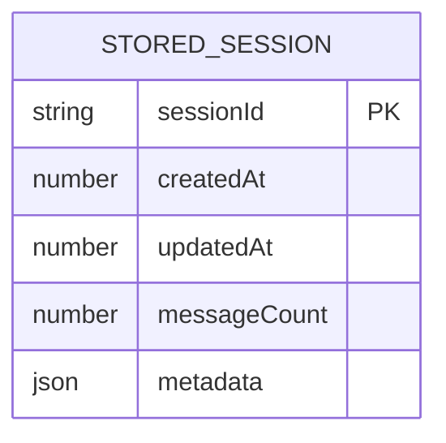

**图表来源**
- [types.ts:16-22](file://src/storage/types.ts#L16-L22)

#### StoredMessage - 消息模型
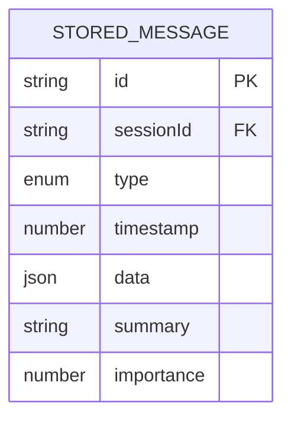

**图表来源**
- [types.ts:24-32](file://src/storage/types.ts#L24-L32)

#### StoredWorkflowRun - 工作流运行模型
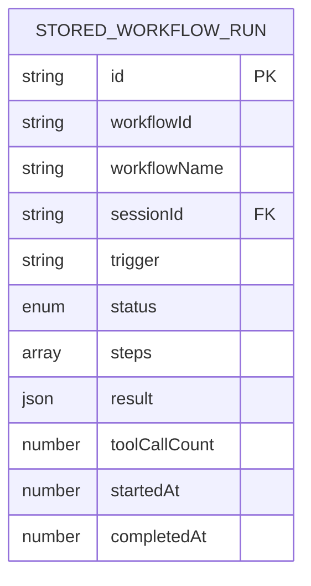

**图表来源**
- [types.ts:34-46](file://src/storage/types.ts#L34-L46)

#### StoredToolResult - 工具结果模型
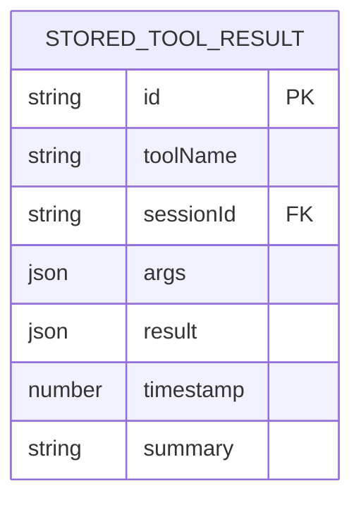

**图表来源**
- [types.ts:48-56](file://src/storage/types.ts#L48-L56)

#### StoredMemoryEntry - 语义记忆模型
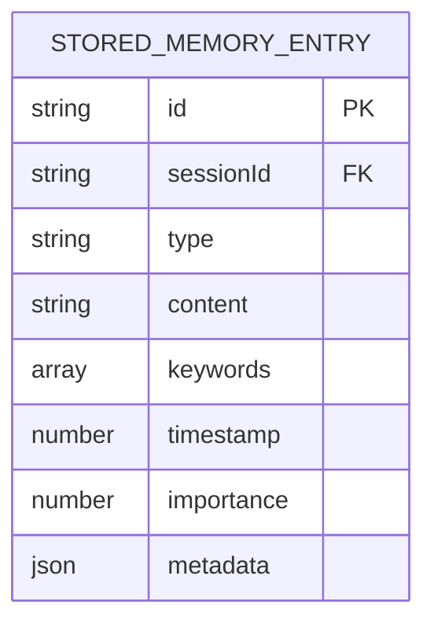

**图表来源**
- [types.ts:58-67](file://src/storage/types.ts#L58-L67)

### 内存存储实现

内存存储实现采用了多Map容器的设计模式，每个数据类别都有独立的存储空间：

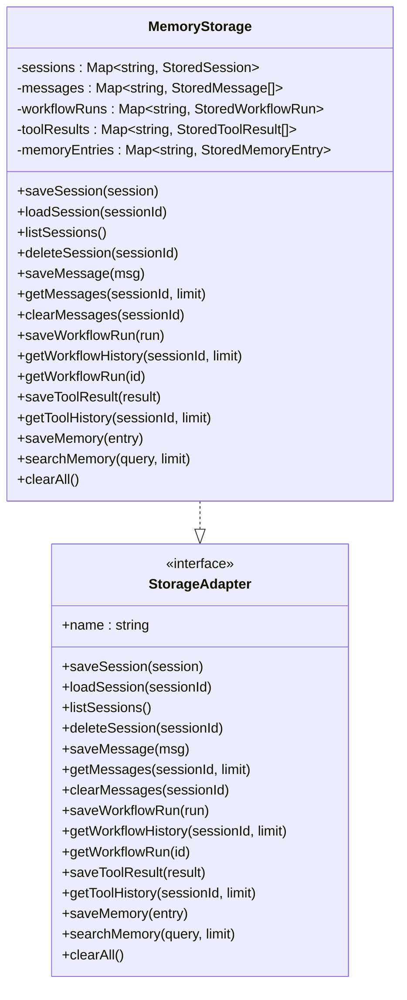

**图表来源**
- [memoryStorage.ts:28-167](file://src/storage/memoryStorage.ts#L28-L167)
- [types.ts:71-100](file://src/storage/types.ts#L71-L100)

### 增删改查操作实现

#### 会话管理操作
内存存储实现了完整的会话生命周期管理：

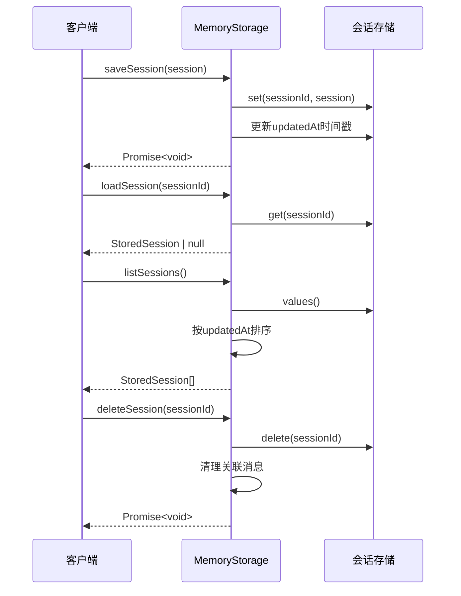

**图表来源**
- [memoryStorage.ts:32-52](file://src/storage/memoryStorage.ts#L32-L52)

#### 消息管理操作
消息存储采用了数组队列的实现方式，支持消息数量限制和时间戳排序：

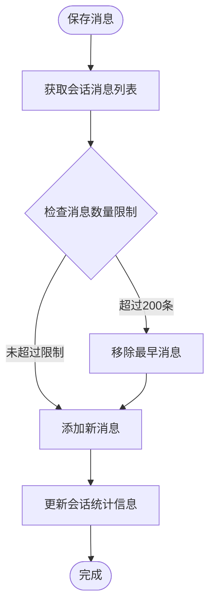

**图表来源**
- [memoryStorage.ts:55-69](file://src/storage/memoryStorage.ts#L55-L69)

#### 工作流运行历史管理
工作流运行历史采用了LRU（最近最少使用）缓存策略：

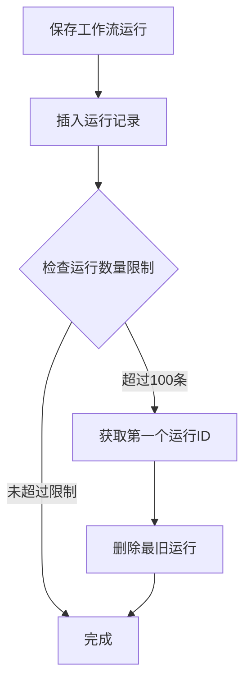

**图表来源**
- [memoryStorage.ts:81-88](file://src/storage/memoryStorage.ts#L81-L88)

#### 语义记忆搜索算法
内存存储实现了基于关键词匹配的语义搜索功能：

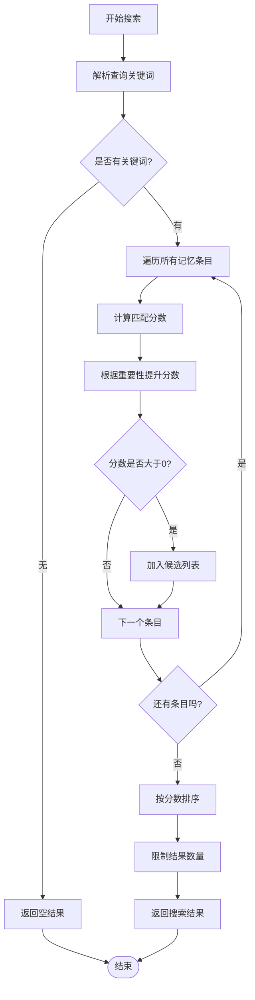

**图表来源**
- [memoryStorage.ts:131-157](file://src/storage/memoryStorage.ts#L131-L157)

**章节来源**
- [memoryStorage.ts:32-167](file://src/storage/memoryStorage.ts#L32-L167)

## 依赖关系分析

内存存储系统的依赖关系体现了清晰的分层架构：

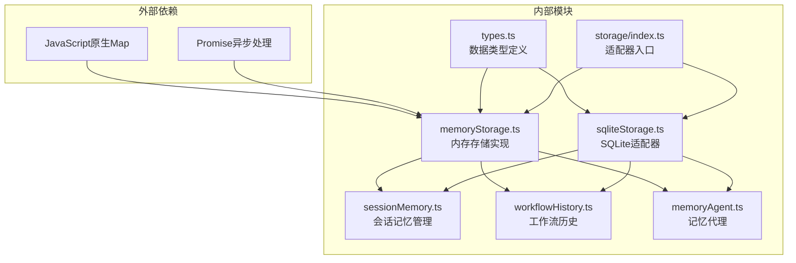

**图表来源**
- [memoryStorage.ts:9-16](file://src/storage/memoryStorage.ts#L9-L16)
- [index.ts:8-9](file://src/storage/index.ts#L8-L9)

**章节来源**
- [memoryStorage.ts:9-16](file://src/storage/memoryStorage.ts#L9-L16)
- [index.ts:8-27](file://src/storage/index.ts#L8-L27)

## 性能考量

内存存储实现具有以下性能特点：

### 时间复杂度分析
- **会话操作**: O(1) 平均时间复杂度，基于Map的键值查找
- **消息操作**: O(n) 最坏情况，需要维护消息数组的长度限制
- **工作流历史**: O(n) 遍历所有运行记录进行过滤和排序
- **语义搜索**: O(n*m) 复杂度，n为记忆条目数量，m为关键词数量

### 空间复杂度分析
- **内存占用**: O(n) 线性增长，其中n为存储的数据条目数量
- **LRU策略**: 通过定期清理最旧条目控制内存使用量
- **消息窗口**: 限制每个会话的消息数量为200条

### 性能优化策略
1. **批量操作**: 支持批量消息和工具结果的聚合存储
2. **索引策略**: 使用Map的哈希特性实现快速查找
3. **缓存机制**: 通过LRU策略自动清理过期数据
4. **延迟加载**: 搜索操作只在需要时执行

## 并发访问控制

内存存储系统在设计上考虑了并发访问的需求：

### 线程安全特性
- **单线程模型**: JavaScript的单线程执行模型天然避免了并发冲突
- **原子操作**: Map的set/get/delete操作都是原子性的
- **无锁设计**: 基于原生Map的实现不需要额外的锁机制

### 并发访问建议
虽然内存存储本身是线程安全的，但在实际使用中仍需注意：

1. **异步操作**: 所有存储操作都是异步的，需要正确处理Promise
2. **状态一致性**: 在高并发场景下，建议使用适当的重试机制
3. **错误处理**: 实现完善的错误处理和异常恢复机制

### 并发场景示例
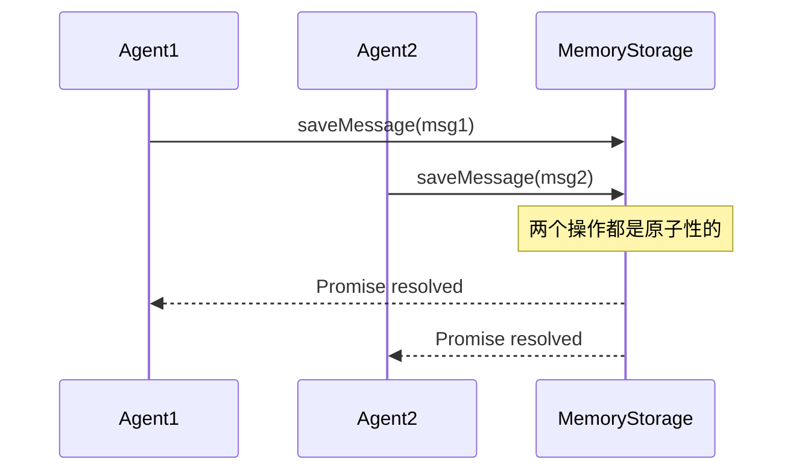

## 使用示例与最佳实践

### 基本使用模式

#### 会话管理示例
```typescript
// 创建新的会话
await storage.saveSession({
  sessionId: 'session-123',
  createdAt: Date.now(),
  updatedAt: Date.now(),
  messageCount: 0,
  metadata: {}
});

// 获取会话信息
const session = await storage.loadSession('session-123');
console.log(session);

// 删除会话及其关联数据
await storage.deleteSession('session-123');
```

#### 消息管理示例
```typescript
// 添加消息到会话
await storage.saveMessage({
  id: 'msg-1',
  sessionId: 'session-123',
  type: 'message',
  timestamp: Date.now(),
  data: { content: 'Hello World' },
  summary: '用户问候',
  importance: 0.5
});

// 获取最近的消息
const recentMessages = await storage.getMessages('session-123', 50);
```

#### 工作流历史示例
```typescript
// 记录工作流运行
await storage.saveWorkflowRun({
  id: 'run-1',
  workflowId: 'assignment-workflow',
  workflowName: '作业分配流程',
  sessionId: 'session-123',
  trigger: '用户请求',
  status: 'completed',
  steps: [],
  result: {},
  toolCallCount: 0,
  startedAt: Date.now() - 3000,
  completedAt: Date.now()
});
```

### 最佳实践

#### 数据清理策略
1. **定期清理**: 建议设置定时任务清理过期的会话和消息
2. **容量监控**: 监控内存使用量，及时调整清理阈值
3. **备份策略**: 对重要数据实施定期备份机制

#### 性能优化建议
1. **批量操作**: 尽可能使用批量操作减少系统调用次数
2. **合理限制**: 根据业务需求调整各种数据的存储限制
3. **索引优化**: 对常用查询字段建立合适的索引策略

#### 错误处理模式
```typescript
try {
  await storage.saveSession(session);
} catch (error) {
  console.error('保存会话失败:', error);
  // 实施重试机制或降级策略
}
```

**章节来源**
- [sessionMemory.ts:18-60](file://src/ai/memory/sessionMemory.ts#L18-L60)
- [workflowHistory.ts:10-48](file://src/ai/memory/workflowHistory.ts#L10-L48)

## 调试指南

### 常见问题诊断

#### 内存泄漏排查
1. **监控内存使用**: 使用浏览器开发者工具监控内存使用情况
2. **检查数据清理**: 确认LRU策略正常工作
3. **验证会话清理**: 确保删除会话时关联数据也被清理

#### 性能问题诊断
1. **分析查询模式**: 识别高频查询和潜在的性能瓶颈
2. **监控操作延迟**: 记录关键操作的执行时间
3. **优化数据结构**: 根据使用模式调整数据存储策略

### 调试工具和技巧

#### 开发者工具
1. **浏览器控制台**: 使用console.log输出调试信息
2. **断点调试**: 在关键位置设置断点进行逐步调试
3. **性能分析**: 使用性能分析工具识别热点代码

#### 日志记录
```typescript
// 在关键操作处添加日志
console.log(`💾 存储操作: ${operation}`);
console.log(`⏱️  执行时间: ${endTime - startTime}ms`);
```

### 故障排除

#### 连接问题
- 检查存储适配器是否正确初始化
- 验证setStorageAdapter函数的调用时机
- 确认全局单例的状态

#### 数据不一致
- 检查事务处理逻辑
- 验证数据同步机制
- 实施适当的错误恢复策略

**章节来源**
- [index.ts:15-18](file://src/storage/index.ts#L15-L18)

## 结论

小天AI教育平台的内存存储实现展现了优秀的软件工程实践：

### 设计优势
1. **接口抽象**: 通过StorageAdapter接口实现了良好的可扩展性
2. **数据隔离**: 采用多Map容器设计实现了清晰的数据隔离
3. **性能优化**: 基于原生Map的实现提供了高效的内存访问性能
4. **生命周期管理**: 完善的LRU策略确保了内存使用的可控性

### 技术特色
1. **单一职责**: 每个存储容器专注于特定的数据类型
2. **异步设计**: 完全基于Promise的异步操作模型
3. **错误处理**: 完善的错误处理和异常恢复机制
4. **可测试性**: 清晰的接口定义便于单元测试和集成测试

### 发展方向
1. **生产环境迁移**: 从内存存储平滑迁移到SQLite或其他持久化存储
2. **性能监控**: 增加详细的性能指标收集和分析
3. **数据备份**: 实现自动化的数据备份和恢复机制
4. **集群支持**: 为分布式部署提供支持

内存存储系统为小天AI教育平台提供了稳定可靠的数据持久化基础，其模块化的设计和清晰的接口定义为未来的功能扩展和技术演进奠定了坚实的基础。