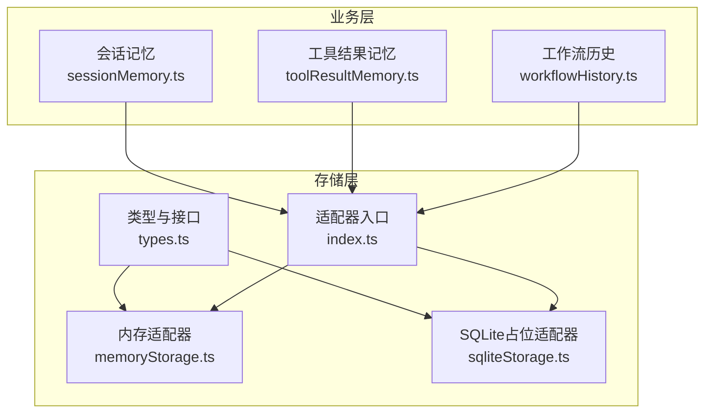
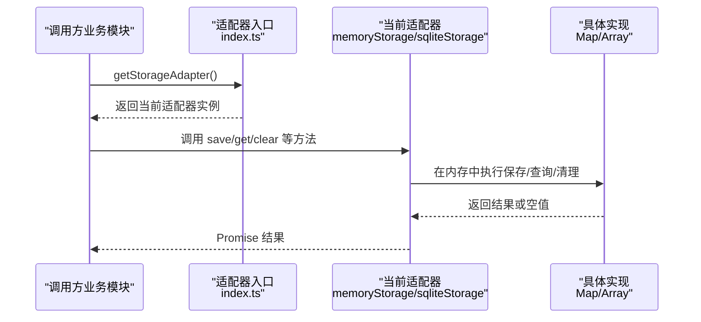
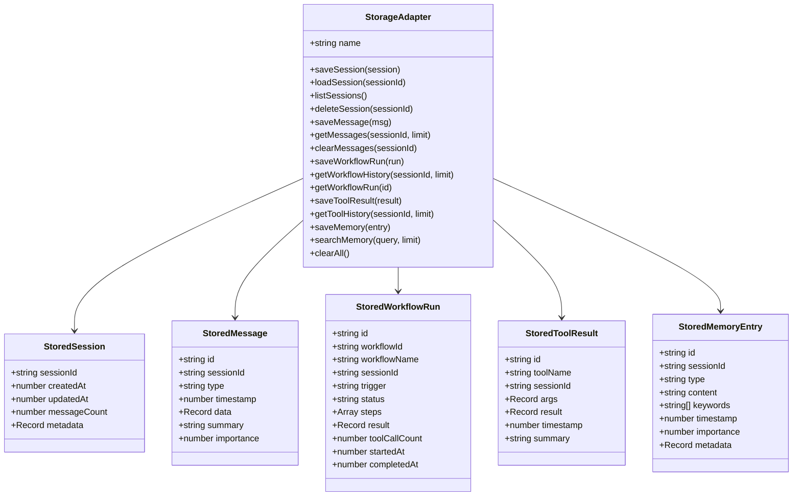
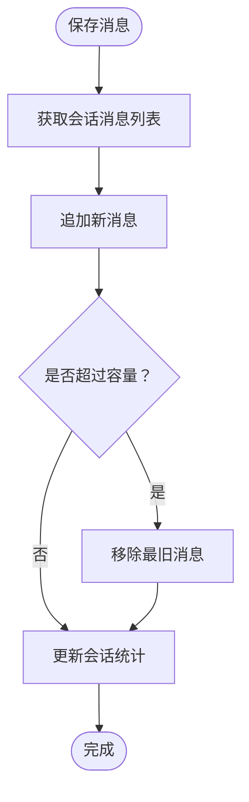
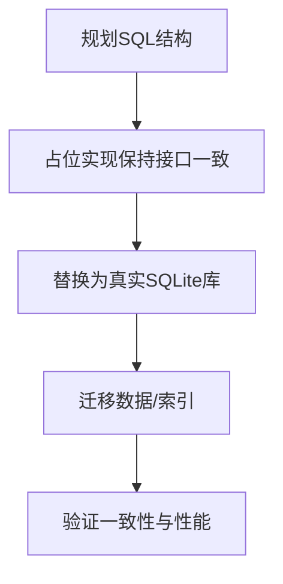
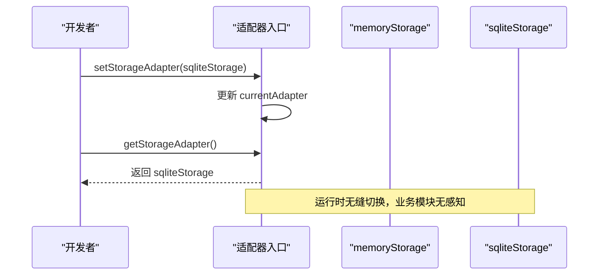
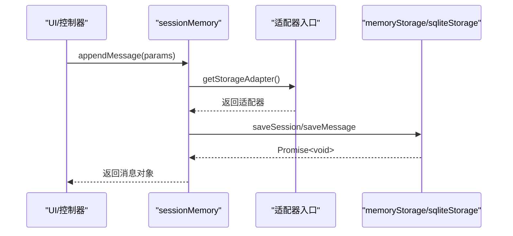
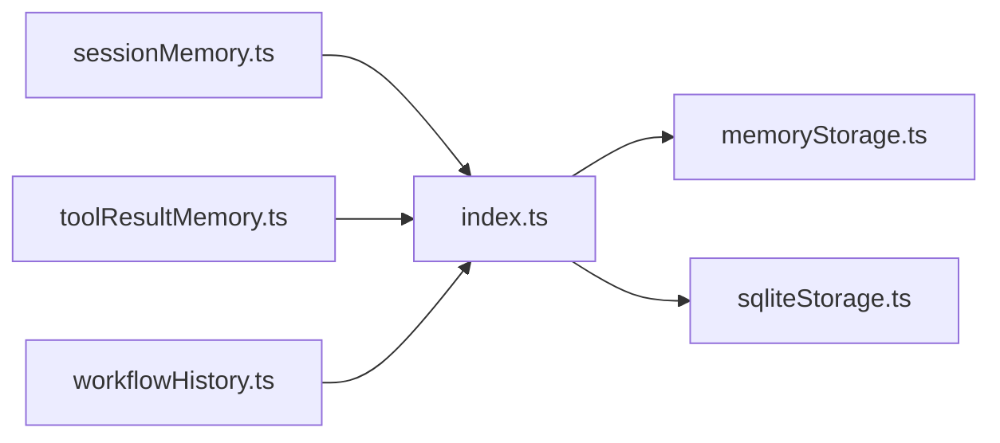

# 存储系统

<cite>
**本文引用的文件**
- [src/storage/index.ts](file://src/storage/index.ts)
- [src/storage/types.ts](file://src/storage/types.ts)
- [src/storage/memoryStorage.ts](file://src/storage/memoryStorage.ts)
- [src/storage/sqliteStorage.ts](file://src/storage/sqliteStorage.ts)
- [src/ai/memory/sessionMemory.ts](file://src/ai/memory/sessionMemory.ts)
- [src/ai/memory/toolResultMemory.ts](file://src/ai/memory/toolResultMemory.ts)
- [src/ai/memory/workflowHistory.ts](file://src/ai/memory/workflowHistory.ts)
</cite>

## 目录
1. [简介](#简介)
2. [项目结构](#项目结构)
3. [核心组件](#核心组件)
4. [架构总览](#架构总览)
5. [详细组件分析](#详细组件分析)
6. [依赖关系分析](#依赖关系分析)
7. [性能考量](#性能考量)
8. [故障排查指南](#故障排查指南)
9. [结论](#结论)
10. [附录](#附录)

## 简介
本技术文档面向小天AI教育平台的存储系统，聚焦“存储适配器架构”的设计理念与适配器模式实现，系统性阐述内存存储与SQLite存储的实现差异、数据结构设计与查询优化策略、接口抽象与切换机制、数据持久化与缓存策略、扩展与自定义开发指南，以及性能优化与故障恢复建议。文档以渐进式方式呈现，既适合初学者理解整体架构，也便于资深开发者深入掌握实现细节与最佳实践。

## 项目结构
存储系统位于 src/storage 目录，采用“接口抽象 + 多实现 + 单例适配器入口”的分层组织方式：
- 接口与数据模型：types.ts 定义统一的数据传输对象与适配器接口
- 内存实现：memoryStorage.ts 提供基于 Map 的默认实现
- SQLite占位实现：sqliteStorage.ts 提供与内存实现行为一致的占位实现，预留SQL迁移路径
- 适配器入口：index.ts 暴露全局单例 get/set 方法，支持运行时切换

图表来源
- [src/storage/types.ts:1-101](file://src/storage/types.ts#L1-L101)
- [src/storage/memoryStorage.ts:1-168](file://src/storage/memoryStorage.ts#L1-L168)
- [src/storage/sqliteStorage.ts:1-166](file://src/storage/sqliteStorage.ts#L1-L166)
- [src/storage/index.ts:1-36](file://src/storage/index.ts#L1-L36)
- [src/ai/memory/sessionMemory.ts:1-115](file://src/ai/memory/sessionMemory.ts#L1-L115)
- [src/ai/memory/toolResultMemory.ts:1-74](file://src/ai/memory/toolResultMemory.ts#L1-L74)
- [src/ai/memory/workflowHistory.ts:1-79](file://src/ai/memory/workflowHistory.ts#L1-L79)

章节来源
- [src/storage/index.ts:1-36](file://src/storage/index.ts#L1-L36)
- [src/storage/types.ts:1-101](file://src/storage/types.ts#L1-L101)

## 核心组件
- 存储适配器接口（StorageAdapter）
  - 职责：统一抽象会话、消息、工作流运行、工具结果、内存条目等的增删改查与清理能力
  - 设计要点：以只读 name 字段标识实现；所有方法均为异步 Promise；提供 clearAll 管理能力
- 数据传输对象（DTO）
  - StoredSession/StoredMessage/StoredWorkflowRun/StoredToolResult/StoredMemoryEntry
  - 统一字段命名与类型约束，便于跨实现的一致性处理
- 内存适配器（memoryStorage）
  - 使用 Map/Array 构建内存数据库，提供上限控制与简单排序/筛选
  - 适合开发与测试阶段，零外部依赖
- SQLite占位适配器（sqliteStorage）
  - 当前行为与内存适配器一致，保留接口签名，为后续真实SQLite实现预留迁移路径
- 适配器入口（index.ts）
  - 全局单例 currentAdapter，默认指向 memoryStorage
  - 提供 setStorageAdapter/getStorageAdapter，支持运行时切换

章节来源
- [src/storage/types.ts:71-100](file://src/storage/types.ts#L71-L100)
- [src/storage/types.ts:16-67](file://src/storage/types.ts#L16-L67)
- [src/storage/memoryStorage.ts:28-167](file://src/storage/memoryStorage.ts#L28-L167)
- [src/storage/sqliteStorage.ts:60-165](file://src/storage/sqliteStorage.ts#L60-L165)
- [src/storage/index.ts:13-22](file://src/storage/index.ts#L13-L22)

## 架构总览
存储系统采用“适配器模式 + 单例入口”的架构，业务模块仅依赖统一接口，不感知具体实现。通过 setStorageAdapter 可在运行时无缝切换后端，保证上层逻辑无侵入。

图表来源
- [src/storage/index.ts:20-22](file://src/storage/index.ts#L20-L22)
- [src/storage/memoryStorage.ts:28-167](file://src/storage/memoryStorage.ts#L28-L167)
- [src/storage/sqliteStorage.ts:60-165](file://src/storage/sqliteStorage.ts#L60-L165)

## 详细组件分析

### 适配器接口与数据模型
- 接口职责划分清晰：会话管理、消息管理、工作流运行记录、工具结果、RAG/语义检索、管理员清理
- DTO字段覆盖业务关键信息：时间戳、重要度、摘要、元数据、关键词等
- 通过接口隔离，实现层可独立演进（如从内存迁移到SQLite）

图表来源
- [src/storage/types.ts:71-100](file://src/storage/types.ts#L71-L100)
- [src/storage/types.ts:16-67](file://src/storage/types.ts#L16-L67)

章节来源
- [src/storage/types.ts:71-100](file://src/storage/types.ts#L71-L100)
- [src/storage/types.ts:16-67](file://src/storage/types.ts#L16-L67)

### 内存存储实现（memoryStorage）
- 存储介质：Map/Array
- 关键特性
  - 会话：按更新时间倒序列出，删除会话同时清理对应消息
  - 消息：每会话最多保留固定数量，自动丢弃最旧项；支持按会话取最近N条
  - 工作流运行：全局最多保留固定数量，按插入顺序淘汰最早项
  - 工具结果：每会话最多保留固定数量，按时间倒序返回
  - 内存条目：全局最多保留固定数量，按插入顺序淘汰最早项；支持关键词+重要度的简单相似度评分
  - 清理：提供 clearAll 清空全部数据
- 查询优化
  - 列表类查询先排序再切片，避免全量扫描
  - 搜索类查询对关键词进行预处理与评分，按分数降序返回
- 复杂度
  - 保存/加载/列表：O(1)~O(n)（取决于内部结构与限制）
  - 搜索：O(n*m)（n为条目数，m为关键词数）

图表来源
- [src/storage/memoryStorage.ts:55-69](file://src/storage/memoryStorage.ts#L55-L69)

章节来源
- [src/storage/memoryStorage.ts:28-167](file://src/storage/memoryStorage.ts#L28-L167)

### SQLite占位实现（sqliteStorage）
- 当前行为：与内存实现保持一致，便于平滑过渡
- 预留迁移路径：注释中给出计划的SQL表结构与FTS虚拟表，为后续真实SQLite实现提供蓝图
- 切换方式：setStorageAdapter(sqliteStorage) 后，业务模块无需修改即可接入

图表来源
- [src/storage/sqliteStorage.ts:13-41](file://src/storage/sqliteStorage.ts#L13-L41)
- [src/storage/sqliteStorage.ts:60-165](file://src/storage/sqliteStorage.ts#L60-L165)

章节来源
- [src/storage/sqliteStorage.ts:60-165](file://src/storage/sqliteStorage.ts#L60-L165)

### 适配器入口与切换机制（index.ts）
- 全局单例 currentAdapter，默认指向 memoryStorage
- setStorageAdapter 可在运行时切换至 sqliteStorage 或自定义实现
- 日志提示：切换时输出适配器名称，便于调试

图表来源
- [src/storage/index.ts:15-18](file://src/storage/index.ts#L15-L18)
- [src/storage/index.ts:20-22](file://src/storage/index.ts#L20-L22)

章节来源
- [src/storage/index.ts:13-22](file://src/storage/index.ts#L13-L22)

### 业务模块与存储层交互
- 会话记忆（sessionMemory）
  - 新增消息时确保会话存在，保存消息并返回
  - 获取最近消息、上下文窗口、清空会话、列出会话、统计消息数
- 工具结果记忆（toolResultMemory）
  - 记录工具调用结果，按会话取最近N条，查找最后一次调用结果
- 工作流历史（workflowHistory）
  - 记录工作流运行，按最近N条查询，按类型过滤，获取最后一条

图表来源
- [src/ai/memory/sessionMemory.ts:24-59](file://src/ai/memory/sessionMemory.ts#L24-L59)
- [src/storage/index.ts:20-22](file://src/storage/index.ts#L20-L22)
- [src/storage/memoryStorage.ts:32-69](file://src/storage/memoryStorage.ts#L32-L69)

章节来源
- [src/ai/memory/sessionMemory.ts:18-77](file://src/ai/memory/sessionMemory.ts#L18-L77)
- [src/ai/memory/toolResultMemory.ts:10-40](file://src/ai/memory/toolResultMemory.ts#L10-L40)
- [src/ai/memory/workflowHistory.ts:10-48](file://src/ai/memory/workflowHistory.ts#L10-L48)

## 依赖关系分析
- 低耦合高内聚
  - 业务模块仅依赖适配器接口，不关心具体实现
  - 适配器实现之间相互独立，可单独演进
- 单例入口降低全局状态复杂度
  - 通过 setStorageAdapter 统一切换，避免分散配置
- 可观测性
  - 切换日志便于定位问题
  - clearAll 提供重置能力，便于测试与调试

图表来源
- [src/ai/memory/sessionMemory.ts:9](file://src/ai/memory/sessionMemory.ts#L9)
- [src/ai/memory/toolResultMemory.ts:6](file://src/ai/memory/toolResultMemory.ts#L6)
- [src/ai/memory/workflowHistory.ts:6](file://src/ai/memory/workflowHistory.ts#L6)
- [src/storage/index.ts:9](file://src/storage/index.ts#L9)

章节来源
- [src/storage/index.ts:8-27](file://src/storage/index.ts#L8-L27)

## 性能考量
- 内存实现的性能特征
  - 保存/读取为近似 O(1)，列表查询先排序再切片，时间复杂度 O(n log n)
  - 搜索为线性扫描，时间复杂度 O(n*m)，适合中小规模数据
- 缓存与容量控制
  - 会话消息、工具结果、内存条目均设置上限，避免无限增长
  - 工作流运行记录设置上限，按插入顺序淘汰
- 查询优化建议
  - 对高频查询建立索引（如按时间、会话ID、工具名等）
  - 分页/限流：getMessages/getToolHistory/getWorkflowHistory 提供 limit 参数
  - 预聚合：在保存时维护常用统计（如会话消息数），减少读时计算
- SQLite迁移后的优化方向
  - 使用主键/外键索引提升 JOIN 性能
  - FTS5 虚拟表用于全文检索，结合重要度权重
  - 事务批处理批量写入，减少磁盘 IO
  - WAL 模式提升并发读写性能

[本节为通用性能指导，不直接分析特定文件]

## 故障排查指南
- 切换后端无效
  - 确认已调用 setStorageAdapter 并传入正确实例
  - 检查日志输出是否显示新的适配器名称
- 数据丢失或异常
  - 开发阶段：使用 clearAll 快速重置
  - 生产阶段：确认 SQLite 文件权限与路径
- 查询结果为空
  - 检查 limit 参数是否过小
  - 检查 sessionId 是否正确
  - 对搜索类查询，确认关键词预处理与重要度评分逻辑
- 性能问题
  - 观察容量上限是否触发频繁淘汰
  - 考虑增加索引或调整查询策略

章节来源
- [src/storage/index.ts:15-18](file://src/storage/index.ts#L15-L18)
- [src/storage/memoryStorage.ts:160-167](file://src/storage/memoryStorage.ts#L160-L167)
- [src/storage/sqliteStorage.ts:158-165](file://src/storage/sqliteStorage.ts#L158-L165)

## 结论
小天AI教育平台的存储系统通过“适配器模式 + 单例入口”实现了高度解耦与可插拔的持久化能力。内存实现满足开发与测试需求，SQLite占位实现为未来迁移奠定基础。业务模块通过统一接口与有限的API即可完成数据持久化与检索，具备良好的扩展性与可维护性。建议在生产环境中尽快完成SQLite真实实现与索引优化，并持续监控容量与性能指标。

[本节为总结性内容，不直接分析特定文件]

## 附录

### 扩展与自定义开发指南
- 自定义适配器实现步骤
  - 实现 StorageAdapter 接口的所有方法
  - 明确数据模型映射（DTO ↔ 数据库表）
  - 设计索引与查询策略，确保性能达标
  - 提供初始化脚本与迁移方案
  - 编写单元测试与集成测试
- 切换流程
  - 在应用启动时调用 setStorageAdapter(newAdapter)
  - 进行端到端回归测试
  - 上线后观察日志与指标，必要时回滚

章节来源
- [src/storage/types.ts:71-100](file://src/storage/types.ts#L71-L100)
- [src/storage/index.ts:15-18](file://src/storage/index.ts#L15-L18)

### 数据持久化策略与缓存机制
- 持久化策略
  - 会话：按更新时间持久化，支持删除会话级联清理
  - 消息：按时间戳持久化，支持按会话分页读取
  - 工作流运行：按开始时间持久化，支持按会话过滤
  - 工具结果：按时间戳持久化，支持按会话聚合
  - 内存条目：按ID持久化，支持关键词与重要度检索
- 缓存机制
  - 内存实现作为缓存层，提供近实时访问
  - SQLite实现可作为持久化层，结合LRU/容量控制策略

章节来源
- [src/storage/memoryStorage.ts:32-167](file://src/storage/memoryStorage.ts#L32-L167)
- [src/storage/sqliteStorage.ts:63-165](file://src/storage/sqliteStorage.ts#L63-L165)