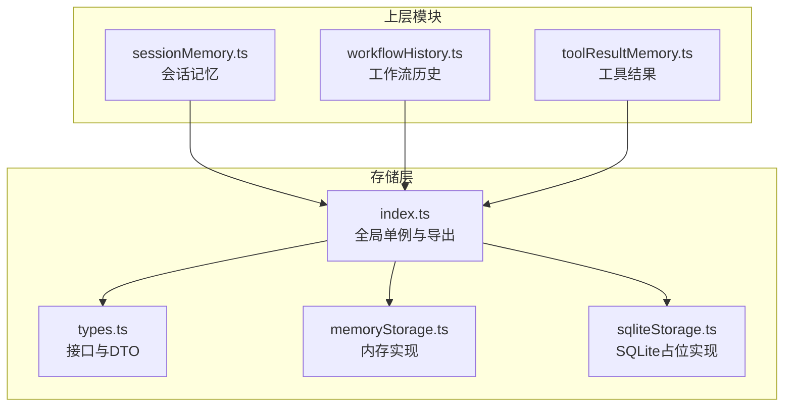
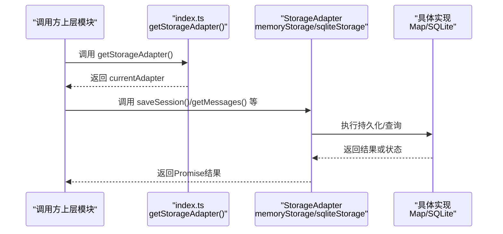
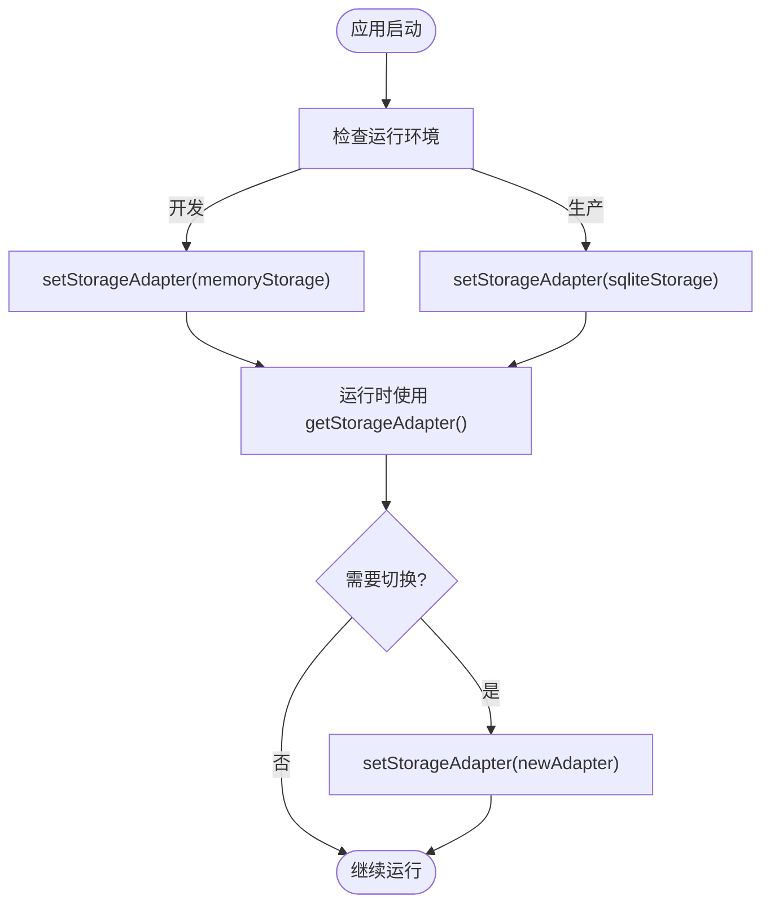
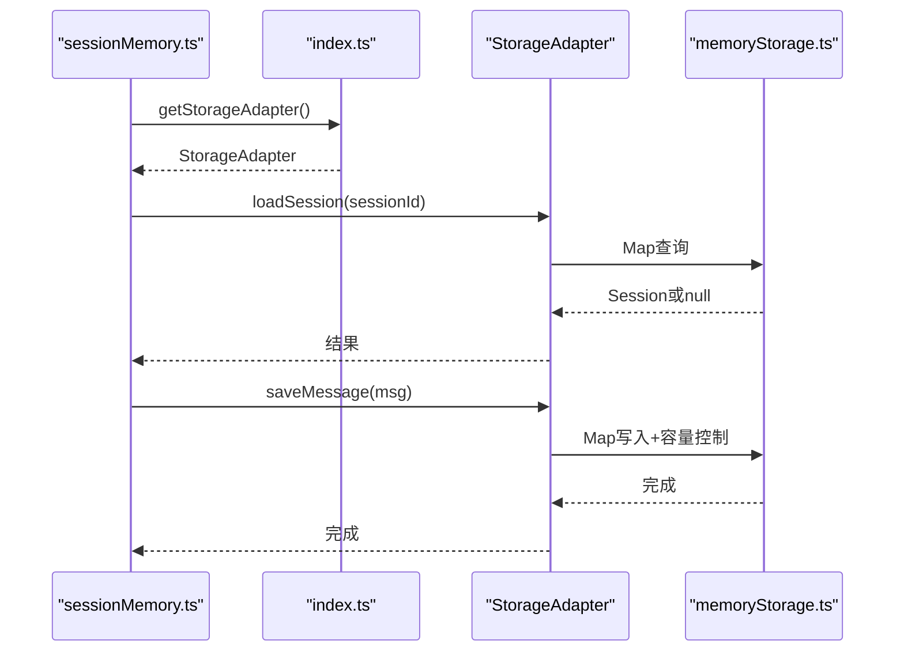
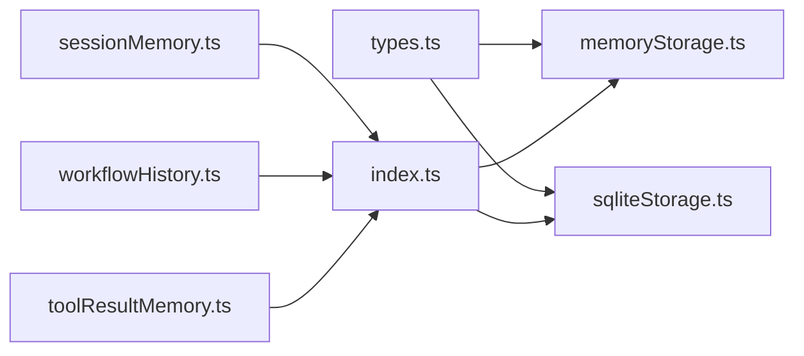

# 存储适配器架构

<cite>
**本文引用的文件**
- [src/storage/index.ts](file://src/storage/index.ts)
- [src/storage/types.ts](file://src/storage/types.ts)
- [src/storage/memoryStorage.ts](file://src/storage/memoryStorage.ts)
- [src/storage/sqliteStorage.ts](file://src/storage/sqliteStorage.ts)
- [src/ai/memory/sessionMemory.ts](file://src/ai/memory/sessionMemory.ts)
- [src/ai/memory/workflowHistory.ts](file://src/ai/memory/workflowHistory.ts)
- [src/ai/memory/toolResultMemory.ts](file://src/ai/memory/toolResultMemory.ts)
- [package.json](file://package.json)
</cite>

## 目录
1. [简介](#简介)
2. [项目结构](#项目结构)
3. [核心组件](#核心组件)
4. [架构总览](#架构总览)
5. [详细组件分析](#详细组件分析)
6. [依赖关系分析](#依赖关系分析)
7. [性能考量](#性能考量)
8. [故障排查指南](#故障排查指南)
9. [结论](#结论)
10. [附录](#附录)

## 简介
本文件系统性阐述小天AI教育平台的“存储适配器”架构，围绕StorageAdapter接口抽象、单例管理与动态切换机制、memoryStorage与sqliteStorage实现差异、生命周期与错误处理策略，以及扩展开发与自定义适配器的最佳实践。该架构通过统一接口屏蔽底层存储细节，使上层模块（如会话记忆、工作流历史、工具结果等）以一致的方式进行数据持久化与检索，同时支持在运行时无缝切换存储后端。

## 项目结构
存储相关代码位于src/storage目录，核心文件包括：
- types.ts：定义StorageAdapter接口与数据传输对象（DTO）
- memoryStorage.ts：基于内存Map的默认实现
- sqliteStorage.ts：面向SQLite的适配器（当前为占位实现，行为与memoryStorage一致）
- index.ts：导出全局单例与类型重导出，提供setStorageAdapter/getStorageAdapter

上层模块通过src/storage/index.ts提供的getStorageAdapter()获取当前适配器实例，从而实现对存储层的无感访问。

图表来源
- [src/storage/index.ts:1-36](file://src/storage/index.ts#L1-L36)
- [src/storage/types.ts:1-101](file://src/storage/types.ts#L1-L101)
- [src/storage/memoryStorage.ts:1-168](file://src/storage/memoryStorage.ts#L1-L168)
- [src/storage/sqliteStorage.ts:1-166](file://src/storage/sqliteStorage.ts#L1-L166)
- [src/ai/memory/sessionMemory.ts:1-115](file://src/ai/memory/sessionMemory.ts#L1-L115)
- [src/ai/memory/workflowHistory.ts:1-79](file://src/ai/memory/workflowHistory.ts#L1-L79)
- [src/ai/memory/toolResultMemory.ts:1-74](file://src/ai/memory/toolResultMemory.ts#L1-L74)

章节来源
- [src/storage/index.ts:1-36](file://src/storage/index.ts#L1-L36)
- [src/storage/types.ts:1-101](file://src/storage/types.ts#L1-L101)

## 核心组件
- StorageAdapter接口：定义统一的数据持久化能力，涵盖会话、消息、工作流运行、工具结果、内存条目以及管理员级清空能力。
- 数据传输对象（DTO）：封装各实体的字段与约束，确保跨模块的数据一致性。
- 单例适配器：通过index.ts维护currentAdapter，提供setStorageAdapter/getStorageAdapter，实现运行时切换。
- 内存实现（memoryStorage）：默认实现，适合开发与测试；内置容量控制与简单检索逻辑。
- SQLite占位实现（sqliteStorage）：与memoryStorage行为一致，但注释中预留SQL建表与查询计划，便于后续替换。

章节来源
- [src/storage/types.ts:69-100](file://src/storage/types.ts#L69-L100)
- [src/storage/memoryStorage.ts:28-167](file://src/storage/memoryStorage.ts#L28-L167)
- [src/storage/sqliteStorage.ts:60-165](file://src/storage/sqliteStorage.ts#L60-L165)
- [src/storage/index.ts:13-22](file://src/storage/index.ts#L13-L22)

## 架构总览
存储适配器采用“接口抽象 + 单例分发 + 上层委托”的模式：
- 上层模块仅依赖StorageAdapter接口，不关心具体实现。
- index.ts提供全局单例currentAdapter，所有调用均通过getStorageAdapter()获取。
- setStorageAdapter()允许在运行时切换实现，日志提示当前适配器名称。
- memoryStorage作为默认实现，sqliteStorage为可替换目标。

图表来源
- [src/storage/index.ts:13-22](file://src/storage/index.ts#L13-L22)
- [src/storage/memoryStorage.ts:28-167](file://src/storage/memoryStorage.ts#L28-L167)
- [src/storage/sqliteStorage.ts:60-165](file://src/storage/sqliteStorage.ts#L60-L165)

## 详细组件分析

### StorageAdapter接口设计
- 角色定位：统一抽象所有数据持久化能力，屏蔽底层差异。
- 方法分组：
  - 会话：保存、加载、列表、删除
  - 消息：保存、按会话查询、清理
  - 工作流运行：保存、历史查询、按ID查询
  - 工具结果：保存、历史查询
  - 内存：保存、关键词检索
  - 管理：清空全部
- 设计要点：
  - 所有方法返回Promise，保证异步一致性
  - 通过limit参数控制返回数量，避免无限增长
  - 会话更新时间与消息计数由实现维护，保证上层能快速判断会话活跃度

章节来源
- [src/storage/types.ts:69-100](file://src/storage/types.ts#L69-L100)

### 数据传输对象（DTO）
- StoredSession：标识、时间戳、消息计数、元数据
- StoredMessage：消息ID、会话ID、类型、时间戳、数据、摘要、重要性
- StoredWorkflowRun：运行ID、工作流ID/名称、触发器、状态、步骤、结果、工具调用次数、起止时间
- StoredToolResult：结果ID、工具名、会话ID、参数、结果、时间戳、摘要
- StoredMemoryEntry：条目ID、会话ID、类型、内容、关键词、时间戳、重要性、元数据

这些DTO定义了跨模块的数据契约，确保序列化/反序列化与版本演进的稳定性。

章节来源
- [src/storage/types.ts:16-67](file://src/storage/types.ts#L16-L67)

### 单例管理与动态切换
- 单例持有：index.ts内部维护currentAdapter，默认指向memoryStorage。
- 获取适配器：getStorageAdapter()返回当前实例。
- 切换适配器：setStorageAdapter()更新currentAdapter并打印日志。
- 使用建议：
  - 在应用启动时根据环境选择适配器（如开发用memory，生产用sqlite）
  - 切换需谨慎，确保在切换前后不会出现并发写入冲突
  - 切换后验证关键路径（会话、消息、工作流、工具结果）

图表来源
- [src/storage/index.ts:13-22](file://src/storage/index.ts#L13-L22)

章节来源
- [src/storage/index.ts:13-22](file://src/storage/index.ts#L13-L22)

### memoryStorage实现
- 存储结构：每个实体类型对应一个Map或数组，键为ID或会话ID。
- 会话管理：保存时更新updatedAt；删除会话时同步清理其消息。
- 消息管理：每会话最多保留固定数量，超出则丢弃最早项；同时更新会话消息计数。
- 工作流运行：最多保留固定数量，超出则删除最早项。
- 工具结果：每会话最多保留固定数量，超出则丢弃最早项。
- 内存条目：最多保留固定数量，超出则删除最早项；检索采用关键词匹配与重要性加权评分。
- 管理功能：clearAll用于清空所有数据。

章节来源
- [src/storage/memoryStorage.ts:18-167](file://src/storage/memoryStorage.ts#L18-L167)

### sqliteStorage实现
- 当前状态：与memoryStorage行为一致，使用内存Map作为占位实现。
- 未来规划：注释中给出SQL建表与FTS虚拟表的计划，用于全文检索与结构化查询。
- 切换方式：通过setStorageAdapter(sqliteStorage)完成切换。

章节来源
- [src/storage/sqliteStorage.ts:1-166](file://src/storage/sqliteStorage.ts#L1-L166)

### 上层模块与适配器交互
- 会话记忆（sessionMemory）：通过getStorageAdapter()获取适配器，先确保会话存在，再保存消息。
- 工作流历史（workflowHistory）：记录工作流运行并查询最近运行。
- 工具结果（toolResultMemory）：记录工具调用结果并查询最近结果。

图表来源
- [src/ai/memory/sessionMemory.ts:18-60](file://src/ai/memory/sessionMemory.ts#L18-L60)
- [src/storage/index.ts:20-22](file://src/storage/index.ts#L20-L22)
- [src/storage/memoryStorage.ts:32-69](file://src/storage/memoryStorage.ts#L32-L69)

章节来源
- [src/ai/memory/sessionMemory.ts:1-115](file://src/ai/memory/sessionMemory.ts#L1-L115)
- [src/ai/memory/workflowHistory.ts:1-79](file://src/ai/memory/workflowHistory.ts#L1-L79)
- [src/ai/memory/toolResultMemory.ts:1-74](file://src/ai/memory/toolResultMemory.ts#L1-L74)

## 依赖关系分析
- 上层模块对存储层的依赖通过index.ts解耦，避免直接导入具体实现。
- types.ts提供稳定的接口契约，确保新增/替换适配器不影响上层。
- memoryStorage与sqliteStorage共享同一接口，便于对比与迁移。

图表来源
- [src/storage/types.ts:69-100](file://src/storage/types.ts#L69-L100)
- [src/storage/memoryStorage.ts:28-167](file://src/storage/memoryStorage.ts#L28-L167)
- [src/storage/sqliteStorage.ts:60-165](file://src/storage/sqliteStorage.ts#L60-L165)
- [src/storage/index.ts:8-35](file://src/storage/index.ts#L8-L35)
- [src/ai/memory/sessionMemory.ts:8-9](file://src/ai/memory/sessionMemory.ts#L8-L9)
- [src/ai/memory/workflowHistory.ts:5-6](file://src/ai/memory/workflowHistory.ts#L5-L6)
- [src/ai/memory/toolResultMemory.ts:5-6](file://src/ai/memory/toolResultMemory.ts#L5-L6)

章节来源
- [src/storage/index.ts:8-35](file://src/storage/index.ts#L8-L35)
- [src/storage/types.ts:69-100](file://src/storage/types.ts#L69-L100)

## 性能考量
- 容量控制：每类实体设置上限，避免无限增长导致内存压力与查询开销上升。
- 查询限制：通过limit参数限制返回数量，减少I/O与渲染负担。
- 重要性评分：内存检索结合关键词匹配与重要性权重，提升相关性排序质量。
- 并发与一致性：当前实现为单线程内存模型，若迁移到SQLite，需考虑事务与锁策略，避免竞态条件。
- 日志与可观测性：setStorageAdapter会输出适配器名称，便于运行时确认切换生效。

章节来源
- [src/storage/memoryStorage.ts:60-62](file://src/storage/memoryStorage.ts#L60-L62)
- [src/storage/memoryStorage.ts:83-87](file://src/storage/memoryStorage.ts#L83-L87)
- [src/storage/memoryStorage.ts:107-108](file://src/storage/memoryStorage.ts#L107-L108)
- [src/storage/memoryStorage.ts:125-129](file://src/storage/memoryStorage.ts#L125-L129)
- [src/storage/index.ts:17-18](file://src/storage/index.ts#L17-L18)

## 故障排查指南
- 切换失败：确认已调用setStorageAdapter()且传入符合StorageAdapter接口的对象；检查控制台日志是否显示新适配器名称。
- 数据丢失：若从memoryStorage切换至sqliteStorage，需评估数据迁移策略；当前sqliteStorage仍为占位实现，数据不会自动迁移。
- 查询异常：检查limit参数是否过小；对于内存检索，确认关键词非空且重要性评分逻辑正常。
- 清空误操作：clearAll会清空所有数据，请谨慎使用；可在业务层增加二次确认或审计日志。
- 并发写入：多实例或多进程场景下，避免同时写入相同会话ID；必要时引入分布式锁或队列化写入。

章节来源
- [src/storage/index.ts:15-18](file://src/storage/index.ts#L15-L18)
- [src/storage/types.ts:98-100](file://src/storage/types.ts#L98-L100)
- [src/storage/sqliteStorage.ts:1-166](file://src/storage/sqliteStorage.ts#L1-L166)

## 结论
存储适配器架构通过接口抽象与单例分发，实现了上层模块与底层存储的松耦合，支持在开发与生产环境间灵活切换。memoryStorage提供了开箱即用的能力，sqliteStorage预留了结构化存储与全文检索的扩展空间。建议在生产环境中尽快完成SQLite实现，并配套完善的迁移、备份与监控策略。

## 附录

### 扩展开发指南
- 新增适配器步骤
  - 实现StorageAdapter接口的所有方法，确保命名与签名与types.ts一致
  - 在index.ts中导出新适配器实例，并在合适时机调用setStorageAdapter()切换
  - 编写单元测试覆盖关键路径（保存、查询、清理、容量控制）
- 迁移策略
  - 从memoryStorage迁移到sqliteStorage时，制定数据导出/导入脚本
  - 逐步灰度切换，先在非关键路径验证，再扩大范围
- 最佳实践
  - 保持DTO稳定，避免破坏向后兼容
  - 对外暴露的API尽量幂等，避免重复写入造成脏数据
  - 记录关键事件（切换、清空、容量告警）以便审计

章节来源
- [src/storage/types.ts:69-100](file://src/storage/types.ts#L69-L100)
- [src/storage/index.ts:26-35](file://src/storage/index.ts#L26-L35)

### 自定义适配器实现示例（步骤说明）
以下为实现步骤说明，不包含具体代码内容：
- 步骤1：定义适配器实例，实现StorageAdapter接口的所有方法
- 步骤2：在index.ts中导出该实例
- 步骤3：在应用初始化时调用setStorageAdapter(你的适配器实例)
- 步骤4：编写测试用例验证各方法的行为与边界条件
- 步骤5：在生产环境部署前进行灰度验证

章节来源
- [src/storage/index.ts:26-35](file://src/storage/index.ts#L26-L35)
- [src/storage/types.ts:69-100](file://src/storage/types.ts#L69-L100)