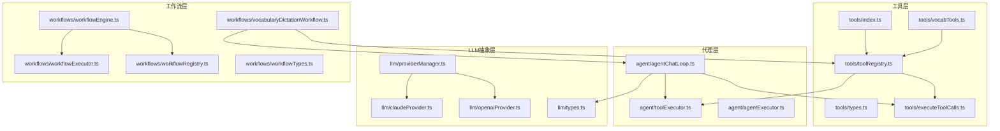
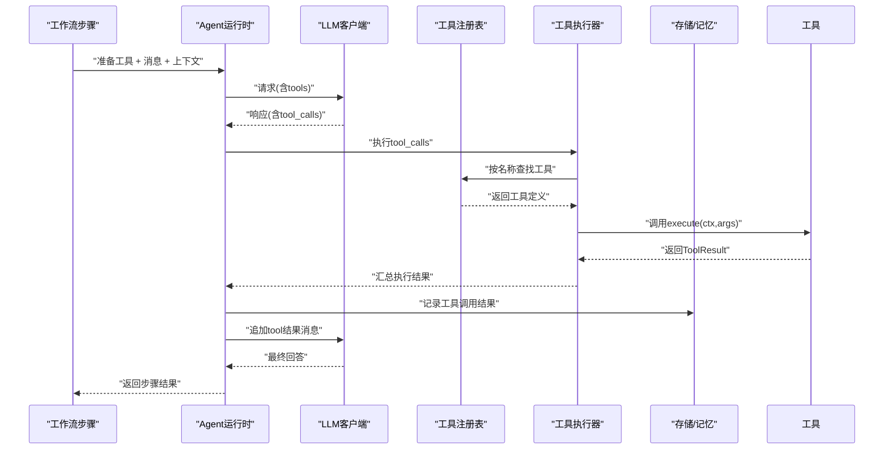
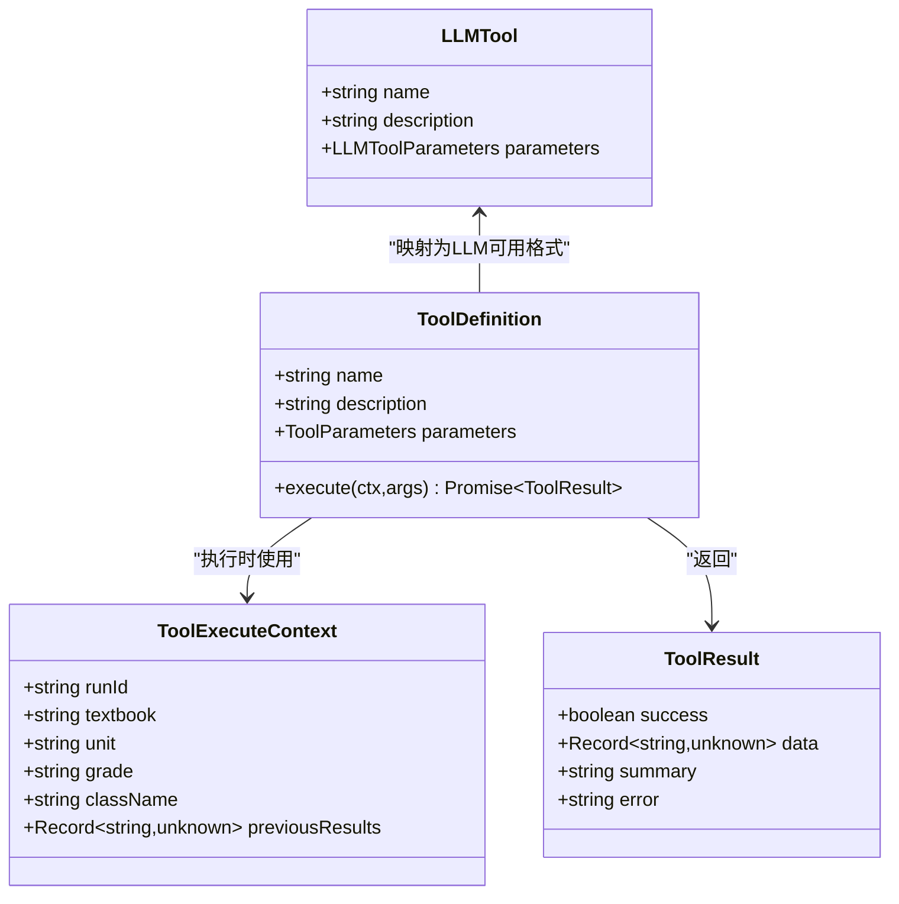
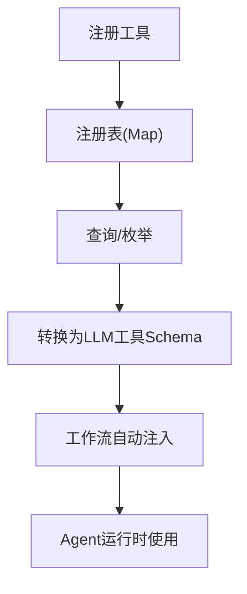
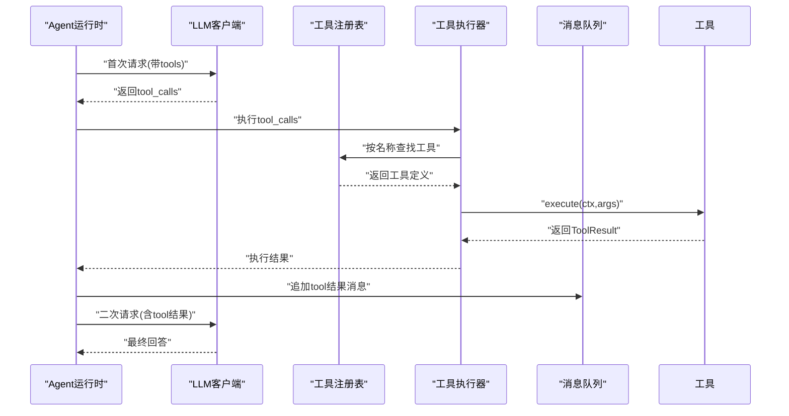
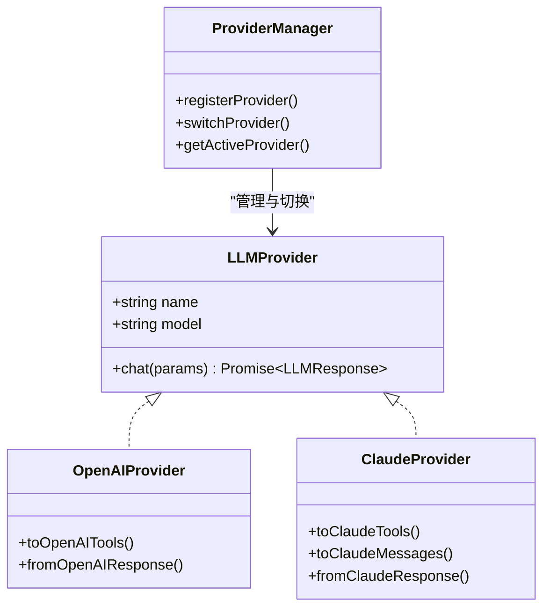
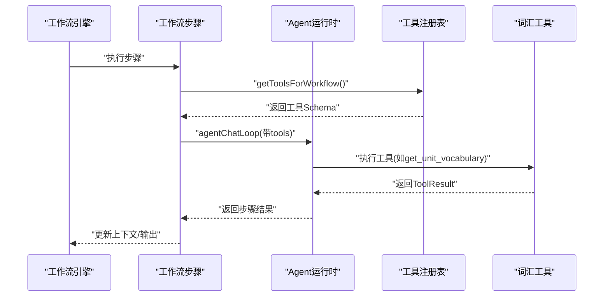
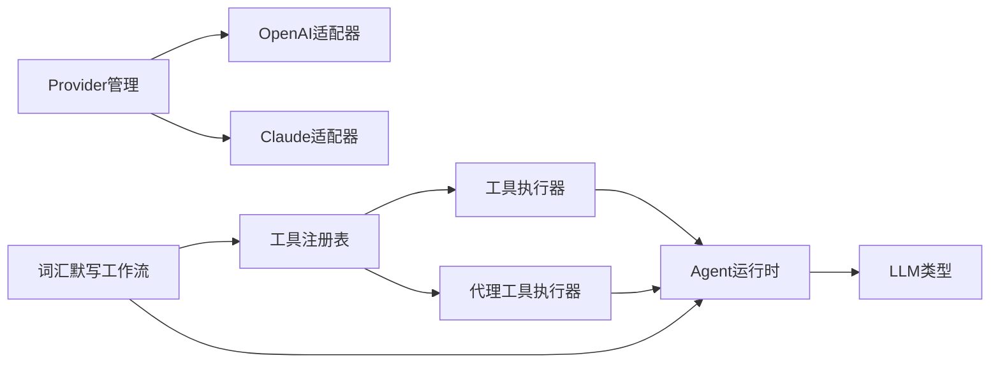

# 工具架构设计

<cite>
**本文引用的文件**
- [src/ai/tools/index.ts](file://src/ai/tools/index.ts)
- [src/ai/tools/types.ts](file://src/ai/tools/types.ts)
- [src/ai/tools/toolRegistry.ts](file://src/ai/tools/toolRegistry.ts)
- [src/ai/tools/executeToolCalls.ts](file://src/ai/tools/executeToolCalls.ts)
- [src/ai/tools/vocabTools.ts](file://src/ai/tools/vocabTools.ts)
- [src/ai/agent/toolExecutor.ts](file://src/ai/agent/toolExecutor.ts)
- [src/ai/agent/agentChatLoop.ts](file://src/ai/agent/agentChatLoop.ts)
- [src/ai/agent/agentExecutor.ts](file://src/ai/agent/agentExecutor.ts)
- [src/ai/llm/types.ts](file://src/ai/llm/types.ts)
- [src/ai/llm/providerManager.ts](file://src/ai/llm/providerManager.ts)
- [src/ai/llm/openaiProvider.ts](file://src/ai/llm/openaiProvider.ts)
- [src/ai/llm/claudeProvider.ts](file://src/ai/llm/claudeProvider.ts)
- [src/ai/workflows/workflowEngine.ts](file://src/ai/workflows/workflowEngine.ts)
- [src/ai/workflows/workflowExecutor.ts](file://src/ai/workflows/workflowExecutor.ts)
- [src/ai/workflows/workflowRegistry.ts](file://src/ai/workflows/workflowRegistry.ts)
- [src/ai/workflows/workflowTypes.ts](file://src/ai/workflows/workflowTypes.ts)
- [src/ai/workflows/vocabularyDictationWorkflow.ts](file://src/ai/workflows/vocabularyDictationWorkflow.ts)
</cite>

## 目录
1. [简介](#简介)
2. [项目结构](#项目结构)
3. [核心组件](#核心组件)
4. [架构总览](#架构总览)
5. [详细组件分析](#详细组件分析)
6. [依赖分析](#依赖分析)
7. [性能考虑](#性能考虑)
8. [故障排查指南](#故障排查指南)
9. [结论](#结论)
10. [附录](#附录)

## 简介
本文件面向小天AI教育平台的“工具架构”，系统化阐述工具系统的设计理念、接口规范、调用机制、与AI代理系统及工作流引擎的集成方式，并总结扩展性与模块化设计、LLM兼容性处理、格式转换等关键技术实现。文档旨在帮助开发者快速理解工具体系如何将“意图”转化为“动作”，以及如何在不改变上层调用的前提下平滑切换不同大模型。

## 项目结构
工具架构位于 src/ai/tools 下，围绕“工具定义-注册-执行-格式转换”形成闭环；与之协同的是代理运行时（agentChatLoop）、工作流引擎（workflowEngine）、LLM抽象层（llmClient + Provider），并通过工具注册表与工作流自动注入工具。

**图表来源**
- [src/ai/tools/index.ts:1-20](file://src/ai/tools/index.ts#L1-L20)
- [src/ai/tools/toolRegistry.ts:1-117](file://src/ai/tools/toolRegistry.ts#L1-L117)
- [src/ai/tools/executeToolCalls.ts:1-114](file://src/ai/tools/executeToolCalls.ts#L1-L114)
- [src/ai/tools/vocabTools.ts:1-260](file://src/ai/tools/vocabTools.ts#L1-L260)
- [src/ai/agent/agentChatLoop.ts:1-201](file://src/ai/agent/agentChatLoop.ts#L1-L201)
- [src/ai/agent/toolExecutor.ts:1-135](file://src/ai/agent/toolExecutor.ts#L1-L135)
- [src/ai/llm/types.ts:1-118](file://src/ai/llm/types.ts#L1-L118)
- [src/ai/llm/providerManager.ts:1-76](file://src/ai/llm/providerManager.ts#L1-L76)
- [src/ai/llm/openaiProvider.ts:1-196](file://src/ai/llm/openaiProvider.ts#L1-L196)
- [src/ai/llm/claudeProvider.ts:1-224](file://src/ai/llm/claudeProvider.ts#L1-L224)
- [src/ai/workflows/workflowEngine.ts:1-119](file://src/ai/workflows/workflowEngine.ts#L1-L119)
- [src/ai/workflows/workflowExecutor.ts:1-143](file://src/ai/workflows/workflowExecutor.ts#L1-L143)
- [src/ai/workflows/workflowRegistry.ts:1-119](file://src/ai/workflows/workflowRegistry.ts#L1-L119)
- [src/ai/workflows/workflowTypes.ts:1-164](file://src/ai/workflows/workflowTypes.ts#L1-L164)
- [src/ai/workflows/vocabularyDictationWorkflow.ts:1-387](file://src/ai/workflows/vocabularyDictationWorkflow.ts#L1-L387)

**章节来源**
- [src/ai/tools/index.ts:1-20](file://src/ai/tools/index.ts#L1-L20)
- [src/ai/tools/toolRegistry.ts:1-117](file://src/ai/tools/toolRegistry.ts#L1-L117)
- [src/ai/agent/agentChatLoop.ts:1-201](file://src/ai/agent/agentChatLoop.ts#L1-L201)
- [src/ai/workflows/workflowEngine.ts:1-119](file://src/ai/workflows/workflowEngine.ts#L1-L119)

## 核心组件
- 工具定义与类型
  - 工具接口规范：ToolDefinition、ToolExecuteContext、ToolResult、ToolParameters/ToolProperty，确保参数Schema与执行结果结构化。
  - LLM工具Schema：LLMTool/LLMToolParameters，与OpenAI function calling和Claude tool use对齐。
- 工具注册与查询
  - 注册表：集中管理工具，支持按名查找、枚举、批量转为LLM可用格式。
  - 工具自动注入：基于工作流ID自动映射所需工具集合。
- 工具调用执行
  - 单轮执行：executeToolCalls（支持多tool_call并行执行），返回执行明细与汇总。
  - 代理闭环：agentChatLoop将LLM响应中的tool_calls转为实际工具执行，并将结果回灌消息队列以二次推理。
- LLM兼容与格式转换
  - Provider抽象：统一LLMChatParams/LLMResponse，屏蔽OpenAI/Claude差异。
  - 格式转换：OpenAI/Claude适配器负责工具定义、消息与响应的双向转换。
- 工作流集成
  - 工作流引擎：匹配意图、构建上下文、顺序执行步骤。
  - 工具在工作流中的使用：通过getToolsForWorkflow自动注入工具，Agent在每步中按需调用工具。

**章节来源**
- [src/ai/tools/types.ts:1-60](file://src/ai/tools/types.ts#L1-L60)
- [src/ai/llm/types.ts:1-118](file://src/ai/llm/types.ts#L1-L118)
- [src/ai/tools/toolRegistry.ts:1-117](file://src/ai/tools/toolRegistry.ts#L1-L117)
- [src/ai/tools/executeToolCalls.ts:1-114](file://src/ai/tools/executeToolCalls.ts#L1-L114)
- [src/ai/agent/agentChatLoop.ts:1-201](file://src/ai/agent/agentChatLoop.ts#L1-L201)
- [src/ai/llm/openaiProvider.ts:1-196](file://src/ai/llm/openaiProvider.ts#L1-L196)
- [src/ai/llm/claudeProvider.ts:1-224](file://src/ai/llm/claudeProvider.ts#L1-L224)
- [src/ai/workflows/workflowEngine.ts:1-119](file://src/ai/workflows/workflowEngine.ts#L1-L119)

## 架构总览
工具架构采用“接口统一 + 注册表 + 适配器”的三层设计：
- 接口统一：工具定义、LLM消息与工具Schema均采用跨厂商兼容的统一类型。
- 注册表：集中注册工具，提供查询、批量转换、工作流映射。
- 适配器：Provider层负责将统一接口转换为各厂商API格式，隐藏差异。

**图表来源**
- [src/ai/agent/agentChatLoop.ts:70-201](file://src/ai/agent/agentChatLoop.ts#L70-L201)
- [src/ai/tools/executeToolCalls.ts:60-114](file://src/ai/tools/executeToolCalls.ts#L60-L114)
- [src/ai/tools/toolRegistry.ts:41-65](file://src/ai/tools/toolRegistry.ts#L41-L65)
- [src/ai/workflows/vocabularyDictationWorkflow.ts:124-299](file://src/ai/workflows/vocabularyDictationWorkflow.ts#L124-L299)

## 详细组件分析

### 工具接口规范与类型系统
- 设计原则
  - 与OpenAI function calling和Claude tool use对齐，确保跨厂商兼容。
  - 参数Schema严格声明，支持必填字段、枚举、嵌套对象与数组项约束。
  - 执行上下文ToolExecuteContext承载教学场景上下文（教材、单元、年级、班级）与历史结果，便于跨步骤复用。
  - 工具结果ToolResult结构化，包含success/data/summary/error，便于UI展示与错误处理。
- 类型关系

**图表来源**
- [src/ai/tools/types.ts:5-60](file://src/ai/tools/types.ts#L5-L60)
- [src/ai/llm/types.ts:18-38](file://src/ai/llm/types.ts#L18-L38)

**章节来源**
- [src/ai/tools/types.ts:1-60](file://src/ai/tools/types.ts#L1-L60)
- [src/ai/llm/types.ts:1-118](file://src/ai/llm/types.ts#L1-L118)

### 工具注册与自动注入
- 注册与查询
  - registerTool/getTool/getAllTools/getToolNames提供工具生命周期管理。
  - executeTool(name, ctx, args)封装执行逻辑，包含未注册与异常兜底。
- LLM格式转换
  - toolToLLMFormat/allToolsToLLMFormat将工具定义转换为LLM可用的工具Schema。
- 工作流自动注入
  - workflowToolMap按workflowId映射工具名集合，getToolsForWorkflow自动返回LLM格式工具列表，避免手工维护工具数组。

**图表来源**
- [src/ai/tools/toolRegistry.ts:14-117](file://src/ai/tools/toolRegistry.ts#L14-L117)

**章节来源**
- [src/ai/tools/toolRegistry.ts:1-117](file://src/ai/tools/toolRegistry.ts#L1-L117)

### 工具调用执行机制
- 单轮执行（executeToolCalls）
  - 输入：LLM返回的tool_calls数组、ToolExecuteContext。
  - 处理：逐条解析arguments（JSON字符串），查表执行工具，收集结果与摘要。
  - 输出：ExecutedToolCall[] + 汇总信息（allSuccess/summary）。
- 代理闭环（agentChatLoop）
  - 首轮请求携带tools；若返回tool_calls，则执行工具并将结果作为“tool”角色消息追加至对话。
  - 重复上述过程直至无tool_calls或达到最大轮次。
  - 记录工具调用到内存，便于审计与复盘。

**图表来源**
- [src/ai/agent/agentChatLoop.ts:70-201](file://src/ai/agent/agentChatLoop.ts#L70-L201)
- [src/ai/tools/executeToolCalls.ts:60-114](file://src/ai/tools/executeToolCalls.ts#L60-L114)
- [src/ai/tools/toolRegistry.ts:41-65](file://src/ai/tools/toolRegistry.ts#L41-L65)

**章节来源**
- [src/ai/tools/executeToolCalls.ts:1-114](file://src/ai/tools/executeToolCalls.ts#L1-L114)
- [src/ai/agent/agentChatLoop.ts:1-201](file://src/ai/agent/agentChatLoop.ts#L1-L201)

### LLM兼容性与格式转换
- 统一抽象
  - LLMChatParams/LLMResponse/LLMMessage/LLMTool等类型屏蔽厂商差异。
- OpenAI适配器
  - 将统一tools转换为OpenAI function tools；将OpenAI响应转换为统一LLMResponse。
  - 无API Key时回退到mock模式，保持开发体验。
- Claude适配器
  - 负责将统一tools转换为Claude input_schema；消息与响应双向转换，处理tool_use与tool_result块。
- Provider管理
  - providerManager集中注册与切换，支持热切换，workflow/agent/tool层无感知。

**图表来源**
- [src/ai/llm/types.ts:105-118](file://src/ai/llm/types.ts#L105-L118)
- [src/ai/llm/openaiProvider.ts:35-85](file://src/ai/llm/openaiProvider.ts#L35-L85)
- [src/ai/llm/claudeProvider.ts:25-129](file://src/ai/llm/claudeProvider.ts#L25-L129)
- [src/ai/llm/providerManager.ts:26-66](file://src/ai/llm/providerManager.ts#L26-L66)

**章节来源**
- [src/ai/llm/types.ts:1-118](file://src/ai/llm/types.ts#L1-L118)
- [src/ai/llm/openaiProvider.ts:1-196](file://src/ai/llm/openaiProvider.ts#L1-L196)
- [src/ai/llm/claudeProvider.ts:1-224](file://src/ai/llm/claudeProvider.ts#L1-L224)
- [src/ai/llm/providerManager.ts:1-76](file://src/ai/llm/providerManager.ts#L1-L76)

### 工具与AI代理系统、工作流引擎的集成
- 代理系统
  - agentChatLoop在每轮中检测tool_calls并执行，支持多轮工具调用闭环。
  - toolExecutor提供工具调用检测、执行与结果消息格式化能力。
- 工作流引擎
  - workflowEngine根据教师查询匹配最佳工作流，构建上下文并顺序执行步骤。
  - vocabularyDictationWorkflow示例展示了：
    - 通过getToolsForWorkflow自动注入工具；
    - 在“AI筛选重点词”和“生成默写内容”两步中直接调用agentChatLoop；
    - 将工具执行结果汇总为步骤输出，供后续步骤使用。

**图表来源**
- [src/ai/workflows/workflowEngine.ts:42-78](file://src/ai/workflows/workflowEngine.ts#L42-L78)
- [src/ai/workflows/vocabularyDictationWorkflow.ts:124-299](file://src/ai/workflows/vocabularyDictationWorkflow.ts#L124-L299)
- [src/ai/tools/toolRegistry.ts:103-116](file://src/ai/tools/toolRegistry.ts#L103-L116)

**章节来源**
- [src/ai/agent/agentChatLoop.ts:1-201](file://src/ai/agent/agentChatLoop.ts#L1-L201)
- [src/ai/agent/toolExecutor.ts:1-135](file://src/ai/agent/toolExecutor.ts#L1-L135)
- [src/ai/workflows/workflowEngine.ts:1-119](file://src/ai/workflows/workflowEngine.ts#L1-L119)
- [src/ai/workflows/vocabularyDictationWorkflow.ts:1-387](file://src/ai/workflows/vocabularyDictationWorkflow.ts#L1-L387)

### 工具系统扩展性与模块化设计
- 模块化
  - 工具定义独立于执行器与注册表，新增工具只需实现ToolDefinition并注册。
  - vocabTools示例展示了工具的职责边界：数据获取、筛选、生成，分别对应不同工具。
- 扩展点
  - 新增Provider：实现LLMProvider接口并在providerManager注册。
  - 新增工作流：在workflowRegistry注册并配置触发关键字/任务，使用getToolsForWorkflow自动注入。
  - 新增工具：在vocabTools风格下定义参数Schema与执行逻辑，注册后即可被Agent与工作流使用。

**章节来源**
- [src/ai/tools/vocabTools.ts:1-260](file://src/ai/tools/vocabTools.ts#L1-L260)
- [src/ai/llm/openaiProvider.ts:89-144](file://src/ai/llm/openaiProvider.ts#L89-L144)
- [src/ai/llm/claudeProvider.ts:133-179](file://src/ai/llm/claudeProvider.ts#L133-L179)
- [src/ai/workflows/workflowRegistry.ts:21-44](file://src/ai/workflows/workflowRegistry.ts#L21-L44)

## 依赖分析
- 组件耦合
  - 工具层与代理层通过LLM抽象解耦；工具层与工作流通过注册表解耦。
  - LLM适配器仅依赖统一类型接口，不依赖具体工具实现。
- 直接/间接依赖
  - agentChatLoop依赖executeToolCalls与toolExecutor；后者依赖toolRegistry。
  - vocabularyDictationWorkflow依赖getToolsForWorkflow与agentChatLoop。
  - providerManager集中管理OpenAI/Claude等Provider。

**图表来源**
- [src/ai/tools/toolRegistry.ts:14-117](file://src/ai/tools/toolRegistry.ts#L14-L117)
- [src/ai/tools/executeToolCalls.ts:15-17](file://src/ai/tools/executeToolCalls.ts#L15-L17)
- [src/ai/agent/toolExecutor.ts:18-21](file://src/ai/agent/toolExecutor.ts#L18-L21)
- [src/ai/agent/agentChatLoop.ts:19-26](file://src/ai/agent/agentChatLoop.ts#L19-L26)
- [src/ai/llm/providerManager.ts:14-54](file://src/ai/llm/providerManager.ts#L14-L54)
- [src/ai/workflows/vocabularyDictationWorkflow.ts:17-18](file://src/ai/workflows/vocabularyDictationWorkflow.ts#L17-L18)

**章节来源**
- [src/ai/tools/toolRegistry.ts:1-117](file://src/ai/tools/toolRegistry.ts#L1-L117)
- [src/ai/agent/agentChatLoop.ts:1-201](file://src/ai/agent/agentChatLoop.ts#L1-L201)
- [src/ai/llm/providerManager.ts:1-76](file://src/ai/llm/providerManager.ts#L1-L76)
- [src/ai/workflows/vocabularyDictationWorkflow.ts:1-387](file://src/ai/workflows/vocabularyDictationWorkflow.ts#L1-L387)

## 性能考虑
- 工具执行并发
  - executeToolCalls支持多tool_call并行执行，提升吞吐；建议在工具间无依赖时充分利用。
- LLM往返次数
  - agentChatLoop默认最多5轮，避免过多tool_round导致延迟；可通过maxRounds调整。
- 数据序列化
  - 工具参数与结果采用JSON字符串传输，注意避免超大数据体；必要时拆分为多个小工具。
- Provider选择
  - 在开发阶段可使用mock Provider降低延迟；生产环境建议配置真实API Key并监控耗时与费用。

[本节为通用指导，不直接分析具体文件]

## 故障排查指南
- 工具未注册
  - 症状：执行返回“未注册”提示。
  - 排查：确认工具已在导入路径中注册（如vocabTools自动注册），或显式调用registerTool。
- 参数解析失败
  - 症状：工具参数无法JSON解析。
  - 排查：检查LLM输出arguments格式；执行器会捕获异常并回退为原始参数。
- Provider不可用
  - 症状：OpenAI/Claude调用失败或回退到mock。
  - 排查：检查API Key配置；查看Provider日志与回退行为。
- 工作流工具缺失
  - 症状：工作流步骤无法获取所需工具。
  - 排查：确认workflowToolMap中已配置该工作流ID；或调用registerWorkflowTools注册映射。

**章节来源**
- [src/ai/tools/toolRegistry.ts:41-65](file://src/ai/tools/toolRegistry.ts#L41-L65)
- [src/ai/tools/executeToolCalls.ts:70-77](file://src/ai/tools/executeToolCalls.ts#L70-L77)
- [src/ai/llm/openaiProvider.ts:94-98](file://src/ai/llm/openaiProvider.ts#L94-L98)
- [src/ai/llm/claudeProvider.ts:138-141](file://src/ai/llm/claudeProvider.ts#L138-L141)
- [src/ai/tools/toolRegistry.ts:114-116](file://src/ai/tools/toolRegistry.ts#L114-L116)

## 结论
小天AI教育平台的工具架构以“统一接口 + 注册表 + 适配器”为核心，实现了跨厂商LLM兼容、工作流与代理系统的无缝集成。通过严格的类型定义与格式转换，工具系统具备良好的扩展性与可维护性；通过自动注入与闭环执行，显著降低了工具使用的复杂度，提升了教学场景下的智能化水平。

[本节为总结性内容，不直接分析具体文件]

## 附录
- 最佳实践与设计模式
  - 工具设计
    - 参数Schema最小化且明确，优先使用enum限制取值。
    - 工具职责单一，避免“巨无霸”工具；通过组合多个小工具实现复杂流程。
  - 执行与错误处理
    - 工具内部捕获异常并返回ToolResult.success=false，便于上层统一处理。
    - 对可能失败的工具调用进行重试策略与降级方案。
  - 集成与扩展
    - 新增Provider时，严格遵循LLMProvider接口契约，确保格式转换正确。
    - 新增工作流时，优先使用getToolsForWorkflow自动注入，减少手工维护成本。
  - 性能优化
    - 合理设置agentChatLoop的最大轮次与工具并发度。
    - 对大对象参数进行分片或缓存，减少重复计算与网络开销。

[本节为通用指导，不直接分析具体文件]