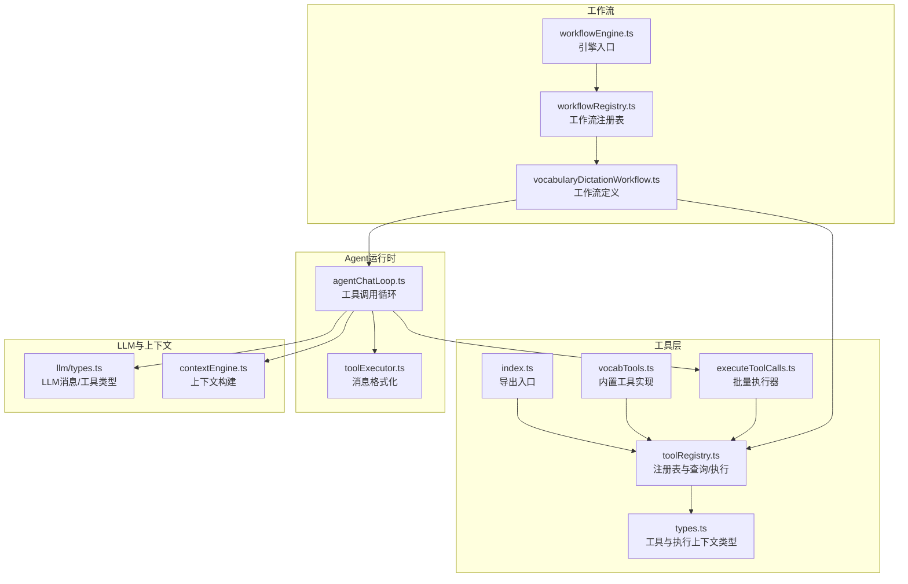
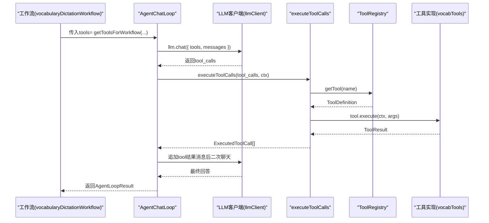
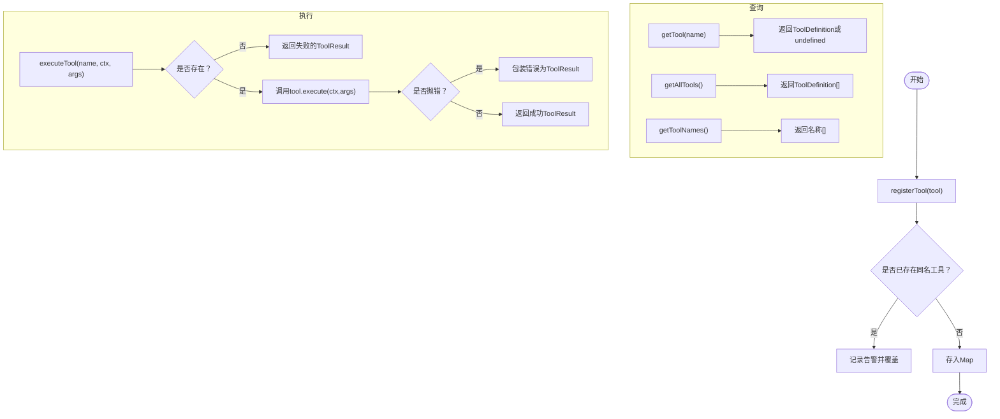
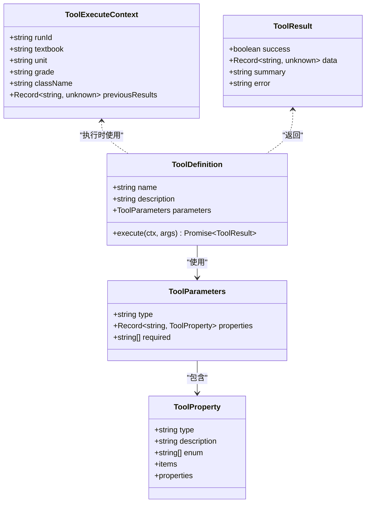
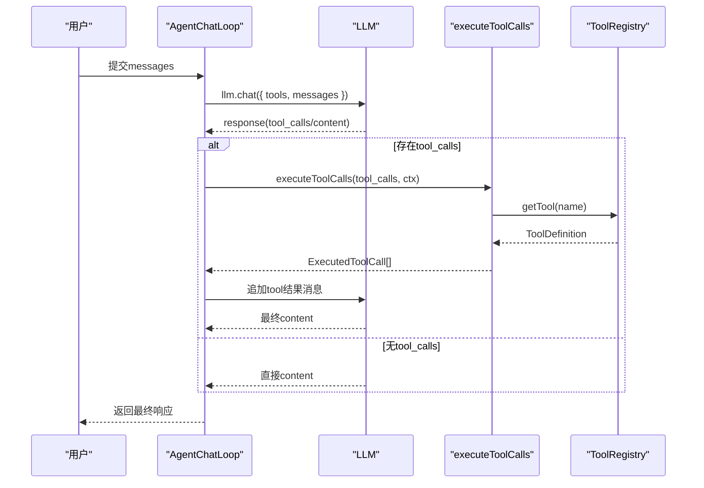
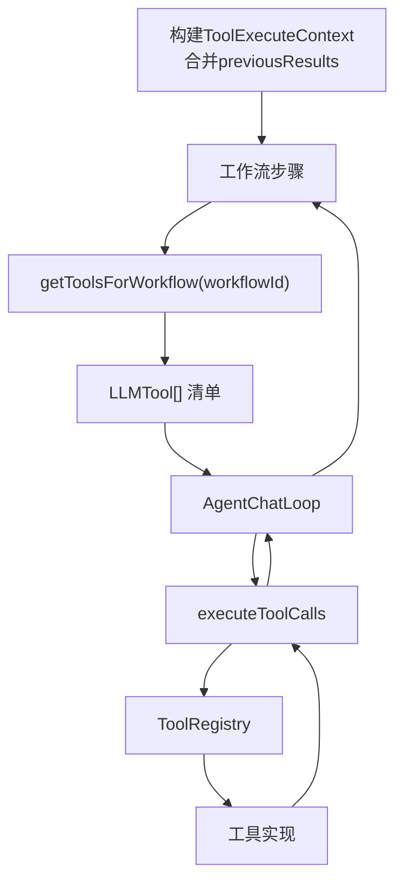
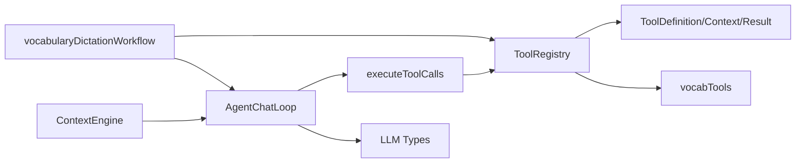

# 工具注册系统

<cite>
**本文引用的文件**
- [src/ai/tools/toolRegistry.ts](file://src/ai/tools/toolRegistry.ts)
- [src/ai/tools/index.ts](file://src/ai/tools/index.ts)
- [src/ai/tools/types.ts](file://src/ai/tools/types.ts)
- [src/ai/tools/vocabTools.ts](file://src/ai/tools/vocabTools.ts)
- [src/ai/tools/executeToolCalls.ts](file://src/ai/tools/executeToolCalls.ts)
- [src/ai/agent/toolExecutor.ts](file://src/ai/agent/toolExecutor.ts)
- [src/ai/agent/agentChatLoop.ts](file://src/ai/agent/agentChatLoop.ts)
- [src/ai/workflows/vocabularyDictationWorkflow.ts](file://src/ai/workflows/vocabularyDictationWorkflow.ts)
- [src/ai/workflows/workflowRegistry.ts](file://src/ai/workflows/workflowRegistry.ts)
- [src/ai/workflows/workflowEngine.ts](file://src/ai/workflows/workflowEngine.ts)
- [src/ai/llm/types.ts](file://src/ai/llm/types.ts)
- [src/ai/context/contextEngine.ts](file://src/ai/context/contextEngine.ts)
</cite>

## 目录
1. [简介](#简介)
2. [项目结构](#项目结构)
3. [核心组件](#核心组件)
4. [架构总览](#架构总览)
5. [详细组件分析](#详细组件分析)
6. [依赖分析](#依赖分析)
7. [性能考虑](#性能考虑)
8. [故障排查指南](#故障排查指南)
9. [结论](#结论)
10. [附录](#附录)

## 简介
本文件面向小天AI教育平台的“工具注册系统”，系统性阐述工具注册、获取、执行、查询与生命周期管理，以及与工作流、Agent运行时、LLM工具调用的协同机制。文档覆盖以下关键主题：
- registerTool函数的使用方法与注册流程
- 工具获取与查询API：getTool、getAllTools、getToolNames
- 工具执行链路：executeTool与executeToolCalls
- 工具权限与安全：参数Schema校验、错误处理与日志
- 工具生命周期：注册、自动注入、工作流映射
- 工具分类与命名规范
- 错误处理与调试方法
- 扩展指南与自定义工具开发流程

## 项目结构
工具注册系统位于src/ai/tools目录，围绕工具注册表、类型定义、工具实现与执行器展开，并与Agent运行时、工作流引擎、LLM类型模型形成松耦合协作。

图表来源
- [src/ai/tools/toolRegistry.ts:1-117](file://src/ai/tools/toolRegistry.ts#L1-L117)
- [src/ai/tools/index.ts:1-20](file://src/ai/tools/index.ts#L1-L20)
- [src/ai/tools/types.ts:1-60](file://src/ai/tools/types.ts#L1-L60)
- [src/ai/tools/vocabTools.ts:1-260](file://src/ai/tools/vocabTools.ts#L1-L260)
- [src/ai/tools/executeToolCalls.ts:1-114](file://src/ai/tools/executeToolCalls.ts#L1-L114)
- [src/ai/agent/toolExecutor.ts:1-135](file://src/ai/agent/toolExecutor.ts#L1-L135)
- [src/ai/agent/agentChatLoop.ts:1-201](file://src/ai/agent/agentChatLoop.ts#L1-L201)
- [src/ai/workflows/vocabularyDictationWorkflow.ts:1-387](file://src/ai/workflows/vocabularyDictationWorkflow.ts#L1-L387)
- [src/ai/workflows/workflowRegistry.ts:1-119](file://src/ai/workflows/workflowRegistry.ts#L1-L119)
- [src/ai/workflows/workflowEngine.ts:1-119](file://src/ai/workflows/workflowEngine.ts#L1-L119)
- [src/ai/llm/types.ts:1-118](file://src/ai/llm/types.ts#L1-L118)
- [src/ai/context/contextEngine.ts:1-189](file://src/ai/context/contextEngine.ts#L1-L189)

章节来源
- [src/ai/tools/index.ts:1-20](file://src/ai/tools/index.ts#L1-L20)
- [src/ai/tools/toolRegistry.ts:1-117](file://src/ai/tools/toolRegistry.ts#L1-L117)

## 核心组件
- 工具注册表与查询执行
  - registerTool：注册工具定义，同名覆盖并告警
  - getTool/getAllTools/getToolNames：按名称获取、列出所有、获取名称列表
  - executeTool：按名称执行工具，统一错误包装
  - toolToLLMFormat/allToolsToLLMFormat：将工具转换为LLM可用格式
  - getToolsForWorkflow/registerWorkflowTools：按工作流ID自动注入所需工具
- 工具类型与上下文
  - ToolDefinition/ToolParameters/ToolProperty：工具定义与参数Schema
  - ToolExecuteContext：执行上下文（包含教学场景信息）
  - ToolResult：执行结果（success/data/summary/error）
- 工具执行器
  - executeToolCalls：批量执行LLM返回的tool_calls，聚合结果与摘要
  - toolExecutor：消息格式化，将工具结果转为LLM消息
- 示例工具
  - vocabTools：词汇相关工具集合（获取词汇、筛选难度、生成默写）

章节来源
- [src/ai/tools/toolRegistry.ts:1-117](file://src/ai/tools/toolRegistry.ts#L1-L117)
- [src/ai/tools/types.ts:1-60](file://src/ai/tools/types.ts#L1-L60)
- [src/ai/tools/executeToolCalls.ts:1-114](file://src/ai/tools/executeToolCalls.ts#L1-L114)
- [src/ai/agent/toolExecutor.ts:1-135](file://src/ai/agent/toolExecutor.ts#L1-L135)
- [src/ai/tools/vocabTools.ts:1-260](file://src/ai/tools/vocabTools.ts#L1-L260)

## 架构总览
工具注册系统通过注册表集中管理工具定义，为Agent运行时与工作流提供统一的工具发现与执行能力；同时，工具参数Schema与LLM工具调用协议对齐，确保跨厂商兼容。

图表来源
- [src/ai/workflows/vocabularyDictationWorkflow.ts:124-188](file://src/ai/workflows/vocabularyDictationWorkflow.ts#L124-L188)
- [src/ai/agent/agentChatLoop.ts:70-201](file://src/ai/agent/agentChatLoop.ts#L70-L201)
- [src/ai/tools/executeToolCalls.ts:60-114](file://src/ai/tools/executeToolCalls.ts#L60-L114)
- [src/ai/tools/toolRegistry.ts:25-65](file://src/ai/tools/toolRegistry.ts#L25-L65)
- [src/ai/tools/vocabTools.ts:10-257](file://src/ai/tools/vocabTools.ts#L10-L257)

## 详细组件分析

### 组件A：工具注册表与执行链路
- 注册与覆盖
  - 同名工具注册会触发覆盖并记录告警，避免重复注册导致的隐性问题
- 查询与格式转换
  - getTool/getAllTools/getToolNames提供灵活的查询能力
  - toolToLLMFormat/allToolsToLLMFormat用于桥接工具定义与LLM工具调用协议
- 执行与错误处理
  - executeTool统一捕获异常并返回标准化的ToolResult
  - executeToolCalls支持批量tool_calls，聚合执行结果与摘要
- 工作流自动注入
  - getToolsForWorkflow基于预置映射自动返回工作流所需的工具清单
  - registerWorkflowTools允许新增工作流与工具的绑定

图表来源
- [src/ai/tools/toolRegistry.ts:18-65](file://src/ai/tools/toolRegistry.ts#L18-L65)

章节来源
- [src/ai/tools/toolRegistry.ts:1-117](file://src/ai/tools/toolRegistry.ts#L1-L117)
- [src/ai/tools/executeToolCalls.ts:60-114](file://src/ai/tools/executeToolCalls.ts#L60-L114)

### 组件B：工具类型与上下文
- 类型对齐
  - ToolDefinition与LLMTool参数Schema保持一致，便于跨厂商（OpenAI/Claude）适配
  - 参数Schema通过properties/required/enum/items等字段精确约束
- 上下文注入
  - ToolExecuteContext包含教学场景关键字段（如textbook/unit/grade/className），便于工具按需读取
- 结果约定
  - ToolResult统一包含success/data/summary/error，便于UI展示与后续处理

图表来源
- [src/ai/tools/types.ts:5-60](file://src/ai/tools/types.ts#L5-L60)

章节来源
- [src/ai/tools/types.ts:1-60](file://src/ai/tools/types.ts#L1-L60)

### 组件C：Agent运行时与工具调用循环
- AgentChatLoop
  - 自动构建system prompt与runtime context
  - 在每轮对话中检测tool_calls，执行工具并追加结果消息，直至无tool_calls或达到最大轮次
  - 记录工具调用结果到内存，便于后续分析与回放
- toolExecutor
  - 将工具执行结果格式化为LLM可理解的消息（role=tool），并携带tool_call_id与name
- executeToolCalls
  - 解析tool_calls，逐个查找工具并执行，聚合结果与摘要字符串

图表来源
- [src/ai/agent/agentChatLoop.ts:70-201](file://src/ai/agent/agentChatLoop.ts#L70-L201)
- [src/ai/agent/toolExecutor.ts:90-103](file://src/ai/agent/toolExecutor.ts#L90-L103)
- [src/ai/tools/executeToolCalls.ts:60-114](file://src/ai/tools/executeToolCalls.ts#L60-L114)
- [src/ai/tools/toolRegistry.ts:25-65](file://src/ai/tools/toolRegistry.ts#L25-L65)

章节来源
- [src/ai/agent/agentChatLoop.ts:1-201](file://src/ai/agent/agentChatLoop.ts#L1-L201)
- [src/ai/agent/toolExecutor.ts:1-135](file://src/ai/agent/toolExecutor.ts#L1-L135)
- [src/ai/tools/executeToolCalls.ts:1-114](file://src/ai/tools/executeToolCalls.ts#L1-L114)

### 组件D：工作流与工具映射
- vocabularyDictationWorkflow
  - 步骤间通过buildToolCtx传递previousResults，实现跨步骤数据共享
  - 使用getToolsForWorkflow自动注入工作流所需工具，简化调用方配置
  - 多轮Agent交互中，工具调用结果作为上下文参与后续推理
- workflowRegistry/workflowEngine
  - 提供工作流注册、查询、意图匹配与执行入口，与工具注册系统解耦

图表来源
- [src/ai/workflows/vocabularyDictationWorkflow.ts:38-53](file://src/ai/workflows/vocabularyDictationWorkflow.ts#L38-L53)
- [src/ai/workflows/vocabularyDictationWorkflow.ts:144-152](file://src/ai/workflows/vocabularyDictationWorkflow.ts#L144-L152)
- [src/ai/tools/toolRegistry.ts:103-116](file://src/ai/tools/toolRegistry.ts#L103-L116)

章节来源
- [src/ai/workflows/vocabularyDictationWorkflow.ts:1-387](file://src/ai/workflows/vocabularyDictationWorkflow.ts#L1-L387)
- [src/ai/workflows/workflowRegistry.ts:1-119](file://src/ai/workflows/workflowRegistry.ts#L1-L119)
- [src/ai/workflows/workflowEngine.ts:1-119](file://src/ai/workflows/workflowEngine.ts#L1-L119)

### 组件E：示例工具实现（词汇工具）
- get_unit_vocabulary：按单元/年级/教材版本获取词汇表
- filter_difficulty：按难度、核心词、中考词、考频等条件筛选词汇
- generate_dictation：根据词汇与模式生成默写题目与答题卡
- 注册：在导入vocabTools时自动注册上述工具

章节来源
- [src/ai/tools/vocabTools.ts:1-260](file://src/ai/tools/vocabTools.ts#L1-L260)

## 依赖分析
- 组件内聚与耦合
  - ToolRegistry与LLM类型对齐，降低跨厂商适配成本
  - Agent运行时仅依赖ToolRegistry与LLM抽象接口，不直接依赖具体工具实现
  - 工作流通过getToolsForWorkflow间接依赖工具注册表，保持低耦合
- 外部依赖
  - LLM客户端抽象（llmClient）与上下文引擎（contextEngine）提供运行时环境
  - 向量适配器（vectorAdapter）用于RAG检索，增强system prompt质量

图表来源
- [src/ai/tools/toolRegistry.ts:1-117](file://src/ai/tools/toolRegistry.ts#L1-L117)
- [src/ai/tools/executeToolCalls.ts:1-114](file://src/ai/tools/executeToolCalls.ts#L1-L114)
- [src/ai/agent/agentChatLoop.ts:1-201](file://src/ai/agent/agentChatLoop.ts#L1-L201)
- [src/ai/workflows/vocabularyDictationWorkflow.ts:1-387](file://src/ai/workflows/vocabularyDictationWorkflow.ts#L1-L387)
- [src/ai/context/contextEngine.ts:1-189](file://src/ai/context/contextEngine.ts#L1-L189)
- [src/ai/llm/types.ts:1-118](file://src/ai/llm/types.ts#L1-L118)

章节来源
- [src/ai/tools/toolRegistry.ts:1-117](file://src/ai/tools/toolRegistry.ts#L1-L117)
- [src/ai/agent/agentChatLoop.ts:1-201](file://src/ai/agent/agentChatLoop.ts#L1-L201)
- [src/ai/workflows/vocabularyDictationWorkflow.ts:1-387](file://src/ai/workflows/vocabularyDictationWorkflow.ts#L1-L387)

## 性能考虑
- 注册表查询：Map结构提供O(1)平均查找复杂度，适合高频查询
- 工具执行：批量执行器支持并发串行化处理，避免过度并发带来的资源争用
- 日志与追踪：Agent运行时输出详细的轮次、工具调用与耗时信息，便于定位性能瓶颈
- 上下文构建：RAG检索与历史数据加载采用并行策略，减少整体延迟

## 故障排查指南
- 工具未注册
  - 现象：executeTool或executeToolCalls返回失败的ToolResult，error包含“未注册”
  - 排查：确认工具是否已通过registerTool注册；检查名称是否一致
- 参数解析失败
  - 现象：tool_calls的arguments非合法JSON时，执行器会降级为原始参数对象
  - 排查：检查LLM返回的arguments格式；必要时在工具内部进行容错处理
- 工具执行异常
  - 现象：ToolResult.success=false，error包含具体错误信息
  - 排查：查看工具实现中的异常堆栈；确认上下文字段（如textbook/unit/grade）是否正确传入
- 工作流工具缺失
  - 现象：getToolsForWorkflow返回空或不完整
  - 排查：确认是否为新工作流，是否调用了registerWorkflowTools进行映射

章节来源
- [src/ai/tools/toolRegistry.ts:41-65](file://src/ai/tools/toolRegistry.ts#L41-L65)
- [src/ai/tools/executeToolCalls.ts:70-113](file://src/ai/tools/executeToolCalls.ts#L70-L113)
- [src/ai/agent/agentChatLoop.ts:135-178](file://src/ai/agent/agentChatLoop.ts#L135-L178)

## 结论
工具注册系统通过集中化的注册表与清晰的类型契约，实现了工具的统一管理、自动注入与跨工作流复用。结合Agent运行时的工具调用循环与工作流引擎，系统在保证安全性与可维护性的同时，提供了强大的教学场景自动化能力。建议在扩展新工具时严格遵循命名规范与参数Schema，确保与LLM工具调用协议对齐，并通过批量执行器与Agent运行时进行端到端测试。

## 附录

### 工具注册与使用流程（registerTool）
- 步骤
  - 定义ToolDefinition（含name/description/parameters/execute）
  - 调用registerTool注册
  - 通过getTool/getAllTools/getToolNames进行查询
  - 在Agent运行时或工作流中使用getToolsForWorkflow自动注入
- 注意事项
  - 同名覆盖会触发告警，需确保唯一性
  - 参数Schema必须与LLM工具调用协议一致

章节来源
- [src/ai/tools/toolRegistry.ts:18-35](file://src/ai/tools/toolRegistry.ts#L18-L35)
- [src/ai/tools/types.ts:5-17](file://src/ai/tools/types.ts#L5-L17)
- [src/ai/tools/index.ts:1-20](file://src/ai/tools/index.ts#L1-L20)

### 工具获取与查询API
- getTool(name)：按名称获取工具定义
- getAllTools()：获取所有工具定义
- getToolNames()：获取工具名称列表
- getToolsForWorkflow(workflowId)：按工作流ID自动返回所需工具清单
- registerWorkflowTools(workflowId, toolNames)：注册新的工作流-工具映射

章节来源
- [src/ai/tools/toolRegistry.ts:25-35](file://src/ai/tools/toolRegistry.ts#L25-L35)
- [src/ai/tools/toolRegistry.ts:103-116](file://src/ai/tools/toolRegistry.ts#L103-L116)

### 工具执行API
- executeTool(name, ctx, args)：按名称执行单个工具，返回标准化结果
- executeToolCalls(toolCalls, ctx)：批量执行LLM返回的tool_calls，返回聚合结果与摘要

章节来源
- [src/ai/tools/toolRegistry.ts:41-65](file://src/ai/tools/toolRegistry.ts#L41-L65)
- [src/ai/tools/executeToolCalls.ts:60-114](file://src/ai/tools/executeToolCalls.ts#L60-L114)

### 工具权限控制与安全机制
- 参数Schema校验：通过ToolParameters/ToolProperty限制参数类型、枚举与必填项
- 异常隔离：executeTool与executeToolCalls统一捕获异常并返回结构化错误
- 日志审计：Agent运行时输出工具调用详情，便于追踪与审计
- 上下文约束：ToolExecuteContext强制注入教学场景信息，避免工具滥用

章节来源
- [src/ai/tools/types.ts:19-32](file://src/ai/tools/types.ts#L19-L32)
- [src/ai/tools/toolRegistry.ts:41-65](file://src/ai/tools/toolRegistry.ts#L41-L65)
- [src/ai/tools/executeToolCalls.ts:78-113](file://src/ai/tools/executeToolCalls.ts#L78-L113)
- [src/ai/agent/agentChatLoop.ts:135-178](file://src/ai/agent/agentChatLoop.ts#L135-L178)

### 工具生命周期管理
- 注册：registerTool
- 激活：通过getToolsForWorkflow自动注入至Agent运行时
- 停用：移除工作流映射或在Agent调用时显式排除
- 注销：目前未提供注销API，可通过覆盖注册或在工作流层面屏蔽

章节来源
- [src/ai/tools/toolRegistry.ts:18-23](file://src/ai/tools/toolRegistry.ts#L18-L23)
- [src/ai/tools/toolRegistry.ts:103-116](file://src/ai/tools/toolRegistry.ts#L103-L116)

### 工具分类管理与命名规范
- 分类：工作流通过category字段进行分类（如generation）
- 命名：工具名称应语义明确、具备领域含义（如get_unit_vocabulary/filter_difficulty/generate_dictation）
- 参数：优先使用枚举与必填项约束，提升工具可预测性与安全性

章节来源
- [src/ai/workflows/vocabularyDictationWorkflow.ts:62-73](file://src/ai/workflows/vocabularyDictationWorkflow.ts#L62-L73)
- [src/ai/tools/vocabTools.ts:10-257](file://src/ai/tools/vocabTools.ts#L10-L257)

### 扩展指南与自定义工具开发流程
- 定义工具
  - 实现ToolDefinition，包含name/description/parameters/execute
  - 参数Schema参考ToolParameters/ToolProperty
- 注册工具
  - 调用registerTool或在模块导入时自动注册
- 集成到工作流
  - 在工作流中通过getToolsForWorkflow自动注入
  - 如需定制，使用registerWorkflowTools建立工作流-工具映射
- 测试与验证
  - 使用AgentChatLoop进行端到端测试
  - 关注日志输出与ToolResult结构，确保UI友好摘要与错误信息

章节来源
- [src/ai/tools/types.ts:5-17](file://src/ai/tools/types.ts#L5-L17)
- [src/ai/tools/toolRegistry.ts:18-23](file://src/ai/tools/toolRegistry.ts#L18-L23)
- [src/ai/tools/toolRegistry.ts:103-116](file://src/ai/tools/toolRegistry.ts#L103-L116)
- [src/ai/agent/agentChatLoop.ts:70-201](file://src/ai/agent/agentChatLoop.ts#L70-L201)