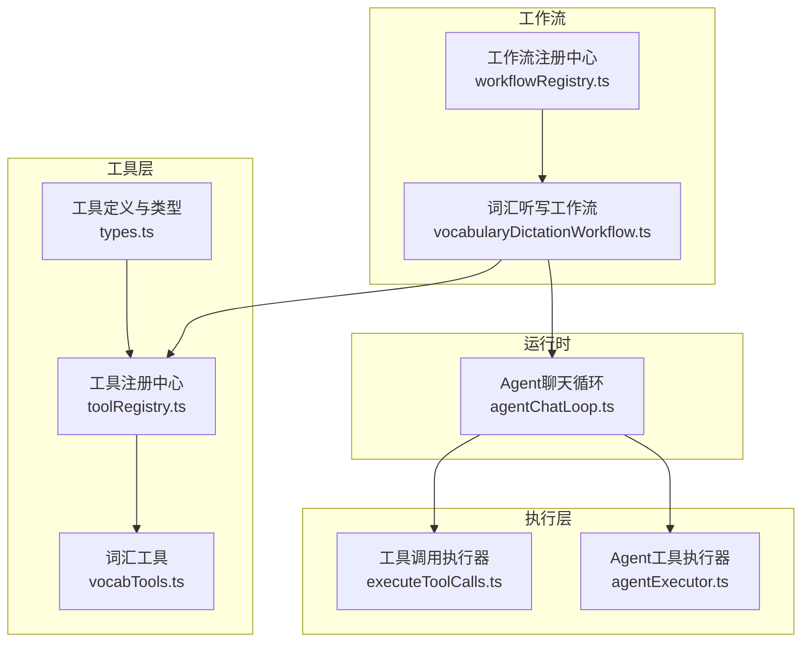
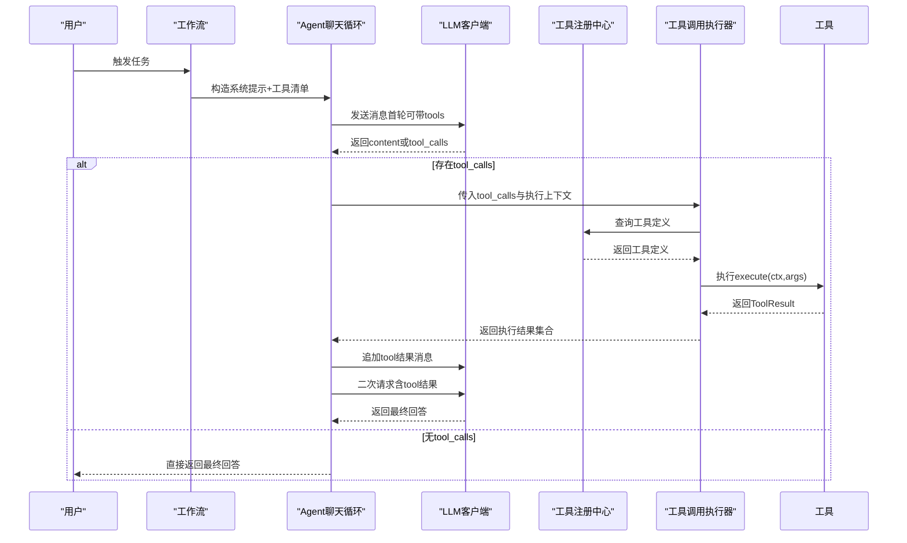
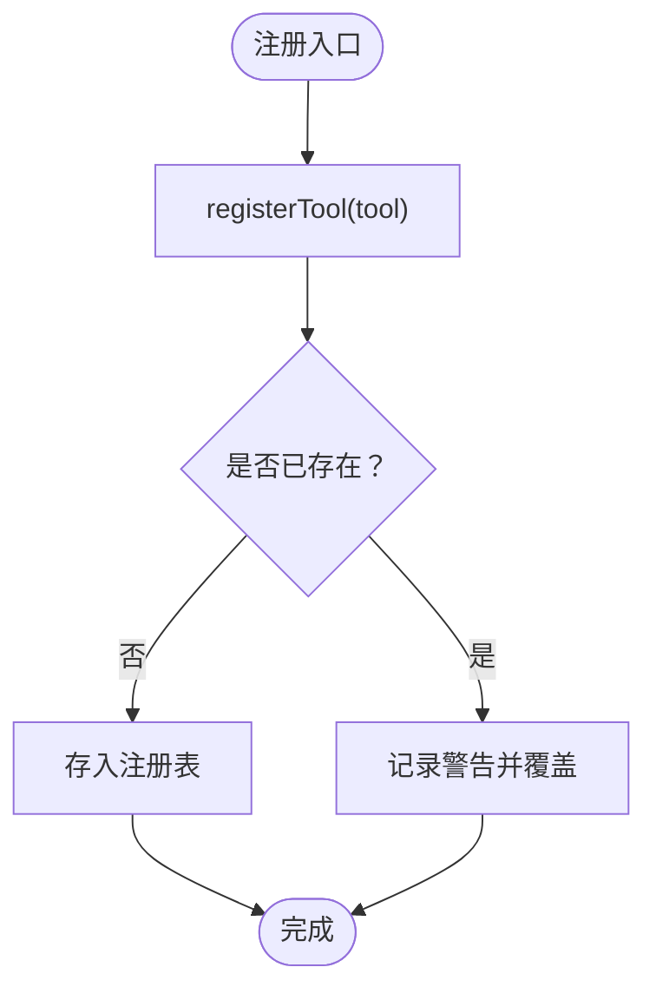
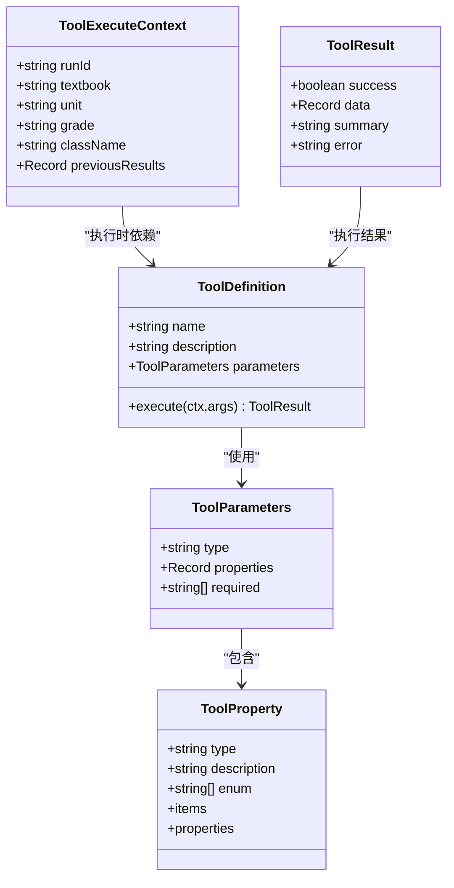
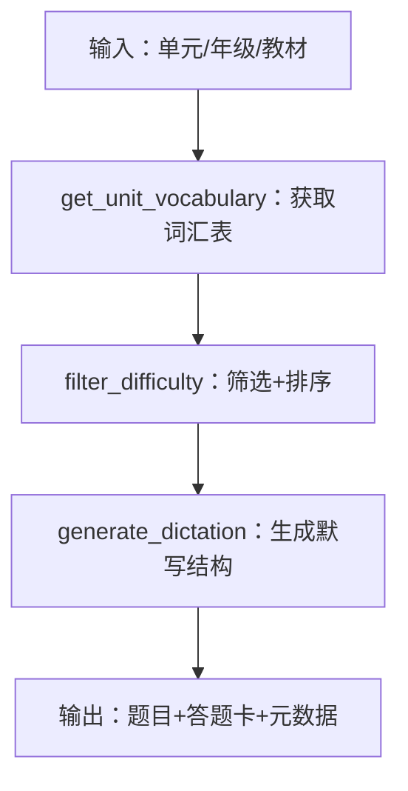
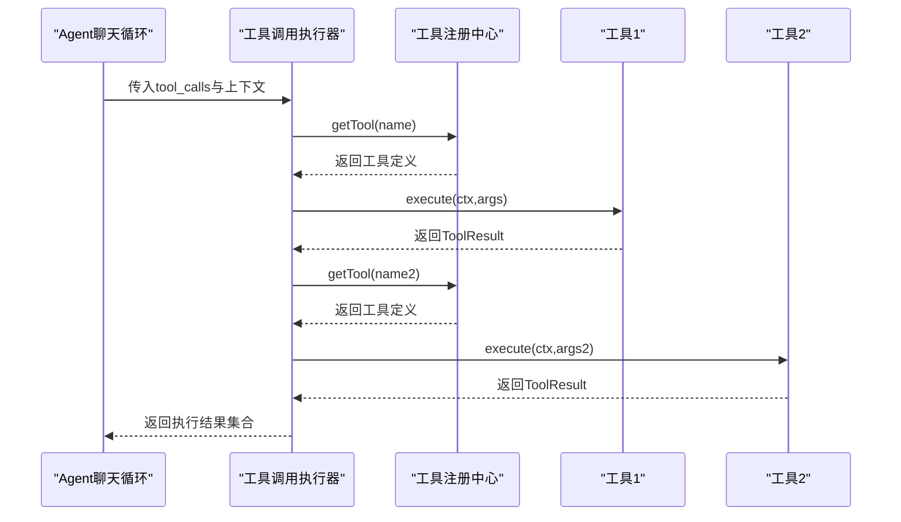
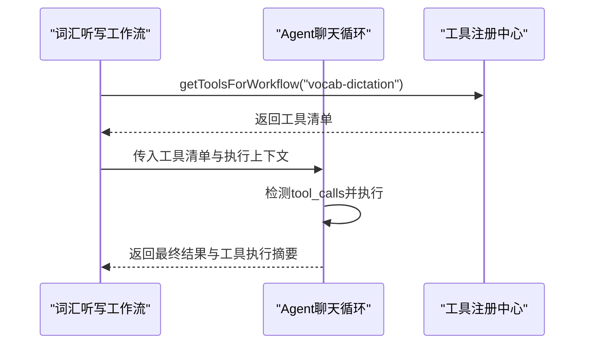

# 工具系统

<cite>
**本文引用的文件**
- [src/ai/tools/index.ts](file://src/ai/tools/index.ts)
- [src/ai/tools/types.ts](file://src/ai/tools/types.ts)
- [src/ai/tools/toolRegistry.ts](file://src/ai/tools/toolRegistry.ts)
- [src/ai/tools/vocabTools.ts](file://src/ai/tools/vocabTools.ts)
- [src/ai/tools/executeToolCalls.ts](file://src/ai/tools/executeToolCalls.ts)
- [src/ai/agent/toolExecutor.ts](file://src/ai/agent/toolExecutor.ts)
- [src/ai/agent/agentChatLoop.ts](file://src/ai/agent/agentChatLoop.ts)
- [src/ai/agent/agentExecutor.ts](file://src/ai/agent/agentExecutor.ts)
- [src/ai/workflows/vocabularyDictationWorkflow.ts](file://src/ai/workflows/vocabularyDictationWorkflow.ts)
- [src/ai/workflows/workflowRegistry.ts](file://src/ai/workflows/workflowRegistry.ts)
- [src/ai/mock/vocabData.ts](file://src/ai/mock/vocabData.ts)
</cite>

## 目录
1. [简介](#简介)
2. [项目结构](#项目结构)
3. [核心组件](#核心组件)
4. [架构总览](#架构总览)
5. [详细组件分析](#详细组件分析)
6. [依赖分析](#依赖分析)
7. [性能考虑](#性能考虑)
8. [故障排查指南](#故障排查指南)
9. [结论](#结论)
10. [附录](#附录)

## 简介
本文件面向小天AI教育平台的“工具系统”，系统性阐述其设计架构、接口规范、调用机制与生命周期管理，重点覆盖词汇工具等教育领域专用工具，以及工具注册、权限控制、分类与功能范围、调用执行与结果处理流程、扩展与自定义开发指南、最佳实践与性能优化建议。通过图示与路径引用，帮助开发者快速理解并高效使用工具系统。

## 项目结构
工具系统位于 src/ai/tools 下，围绕“工具定义与注册”“工具执行器”“与Agent运行时的桥接”“工作流集成”展开。核心模块如下：
- 工具类型与接口：定义工具、参数、执行上下文与结果的数据结构与契约
- 工具注册中心：集中注册、查询、批量导出工具，支持按工作流自动注入工具清单
- 词汇工具：面向教育场景的词汇获取、筛选与默写生成工具
- 工具调用执行器：接收LLM返回的tool_calls，查找并执行工具，汇总结果
- Agent运行时：在对话循环中检测tool_calls、执行工具、回传结果，形成闭环
- 工作流：将工具与业务流程解耦，按工作流ID自动注入所需工具

图表来源
- [src/ai/tools/types.ts:1-60](file://src/ai/tools/types.ts#L1-L60)
- [src/ai/tools/toolRegistry.ts:1-117](file://src/ai/tools/toolRegistry.ts#L1-L117)
- [src/ai/tools/vocabTools.ts:1-260](file://src/ai/tools/vocabTools.ts#L1-L260)
- [src/ai/tools/executeToolCalls.ts:1-114](file://src/ai/tools/executeToolCalls.ts#L1-L114)
- [src/ai/agent/toolExecutor.ts:1-135](file://src/ai/agent/toolExecutor.ts#L1-L135)
- [src/ai/agent/agentChatLoop.ts:1-201](file://src/ai/agent/agentChatLoop.ts#L1-L201)
- [src/ai/workflows/vocabularyDictationWorkflow.ts:1-387](file://src/ai/workflows/vocabularyDictationWorkflow.ts#L1-L387)
- [src/ai/workflows/workflowRegistry.ts:1-119](file://src/ai/workflows/workflowRegistry.ts#L1-L119)

章节来源
- [src/ai/tools/index.ts:1-20](file://src/ai/tools/index.ts#L1-L20)
- [src/ai/tools/types.ts:1-60](file://src/ai/tools/types.ts#L1-L60)
- [src/ai/tools/toolRegistry.ts:1-117](file://src/ai/tools/toolRegistry.ts#L1-L117)
- [src/ai/tools/vocabTools.ts:1-260](file://src/ai/tools/vocabTools.ts#L1-L260)
- [src/ai/tools/executeToolCalls.ts:1-114](file://src/ai/tools/executeToolCalls.ts#L1-L114)
- [src/ai/agent/toolExecutor.ts:1-135](file://src/ai/agent/toolExecutor.ts#L1-L135)
- [src/ai/agent/agentChatLoop.ts:1-201](file://src/ai/agent/agentChatLoop.ts#L1-L201)
- [src/ai/workflows/vocabularyDictationWorkflow.ts:1-387](file://src/ai/workflows/vocabularyDictationWorkflow.ts#L1-L387)
- [src/ai/workflows/workflowRegistry.ts:1-119](file://src/ai/workflows/workflowRegistry.ts#L1-L119)

## 核心组件
- 工具接口规范
  - 工具定义：包含唯一名称、描述、参数Schema与执行函数
  - 参数Schema：遵循OpenAI/Claude兼容格式，支持对象、枚举、数组等类型
  - 执行上下文：携带运行期上下文（如教材、单元、年级、班级）与历史步骤结果
  - 结果结构：统一success/data/summary/error字段，便于UI展示与错误处理
- 工具注册中心
  - 提供注册、查询、列举、按工作流自动注入工具清单的能力
  - 支持将工具转换为LLM可用的工具格式
- 词汇工具
  - 获取单元词汇：基于教材单元返回完整词汇表
  - 筛选难度：按难度、核心词、中考词、考频等条件筛选
  - 生成默写：按模式（英译中/中译英/混合/听音拼写）生成默写结构
- 工具调用执行器
  - 接收LLM返回的tool_calls，解析参数，查找工具并执行，收集结果
  - 支持多轮tool_calls循环，聚合成功/失败摘要
- Agent运行时
  - 在每轮对话中检测tool_calls，执行工具并将结果回传给LLM，直至无tool_calls返回最终回答
- 工作流集成
  - 工作流通过ID自动注入所需工具，与工具实现解耦
  - 词汇听写工作流演示了从“获取词汇→AI筛选→生成默写→可打印输出”的完整链路

章节来源
- [src/ai/tools/types.ts:1-60](file://src/ai/tools/types.ts#L1-L60)
- [src/ai/tools/toolRegistry.ts:1-117](file://src/ai/tools/toolRegistry.ts#L1-L117)
- [src/ai/tools/vocabTools.ts:1-260](file://src/ai/tools/vocabTools.ts#L1-L260)
- [src/ai/tools/executeToolCalls.ts:1-114](file://src/ai/tools/executeToolCalls.ts#L1-L114)
- [src/ai/agent/agentChatLoop.ts:1-201](file://src/ai/agent/agentChatLoop.ts#L1-L201)
- [src/ai/workflows/vocabularyDictationWorkflow.ts:1-387](file://src/ai/workflows/vocabularyDictationWorkflow.ts#L1-L387)

## 架构总览
工具系统采用“注册中心 + 执行器 + 运行时闭环”的分层架构，确保工具与工作流解耦、可扩展、可复用。

图表来源
- [src/ai/agent/agentChatLoop.ts:70-200](file://src/ai/agent/agentChatLoop.ts#L70-L200)
- [src/ai/tools/executeToolCalls.ts:60-114](file://src/ai/tools/executeToolCalls.ts#L60-L114)
- [src/ai/tools/toolRegistry.ts:41-81](file://src/ai/tools/toolRegistry.ts#L41-L81)
- [src/ai/workflows/vocabularyDictationWorkflow.ts:144-188](file://src/ai/workflows/vocabularyDictationWorkflow.ts#L144-L188)

## 详细组件分析

### 组件A：工具注册与生命周期
- 注册与查询
  - registerTool：注册工具，重复注册会给出警告并覆盖
  - getTool/getAllTools/getToolNames：提供查询能力
- 工具到LLM格式转换
  - toolToLLMFormat/allToolsToLLMFormat：将工具定义转换为LLM可用的工具schema
- 工作流工具映射
  - getToolsForWorkflow：按工作流ID返回所需工具清单
  - registerWorkflowTools：新增工作流与工具的映射
- 生命周期管理
  - 工具在导入时自动注册（词汇工具），保证系统启动即可用
  - 工具执行失败时返回标准化错误，避免中断流程

图表来源
- [src/ai/tools/toolRegistry.ts:18-23](file://src/ai/tools/toolRegistry.ts#L18-L23)

章节来源
- [src/ai/tools/toolRegistry.ts:1-117](file://src/ai/tools/toolRegistry.ts#L1-L117)
- [src/ai/tools/index.ts:1-20](file://src/ai/tools/index.ts#L1-L20)

### 组件B：工具接口规范与数据模型
- 工具定义
  - name/description/parameters/execute：统一的工具契约
- 参数Schema
  - 支持对象、枚举、数组、嵌套对象等，便于LLM精确调用
- 执行上下文
  - 包含runId、教材、单元、年级、班级与previousResults，支撑跨步骤数据访问
- 结果结构
  - success/data/summary/error：统一输出，便于UI与日志

图表来源
- [src/ai/tools/types.ts:5-59](file://src/ai/tools/types.ts#L5-L59)

章节来源
- [src/ai/tools/types.ts:1-60](file://src/ai/tools/types.ts#L1-L60)

### 组件C：词汇工具（教育领域专用）
- get_unit_vocabulary：按单元返回完整词汇表，包含音标、释义、词性、难度、考频、核心/中考标记、常见错误、例句等
- filter_difficulty：按难度、核心词、中考词、考频与排序策略筛选词汇，支持限制数量
- generate_dictation：按模式生成默写结构（题目、分值、答题卡），支持答案页开关
- 数据来源：allVocab（单元词汇数据库）

图表来源
- [src/ai/tools/vocabTools.ts:10-249](file://src/ai/tools/vocabTools.ts#L10-L249)
- [src/ai/mock/vocabData.ts:319-324](file://src/ai/mock/vocabData.ts#L319-L324)

章节来源
- [src/ai/tools/vocabTools.ts:1-260](file://src/ai/tools/vocabTools.ts#L1-L260)
- [src/ai/mock/vocabData.ts:1-324](file://src/ai/mock/vocabData.ts#L1-L324)

### 组件D：工具调用执行机制与结果处理
- executeToolCalls
  - 接收tool_calls与执行上下文，逐个解析参数、查找工具、执行并收集结果
  - 输出执行详情、摘要与整体成功标志
- agentChatLoop
  - 在每轮对话中检测tool_calls，执行工具并将结果追加到消息队列，再次请求LLM直至无tool_calls
  - 记录工具调用次数、轮次、耗时与最终回答
- toolExecutor（Agent侧）
  - 检测tool_calls、执行工具、将结果格式化为LLM可理解的消息并返回

图表来源
- [src/ai/agent/agentChatLoop.ts:142-178](file://src/ai/agent/agentChatLoop.ts#L142-L178)
- [src/ai/tools/executeToolCalls.ts:60-114](file://src/ai/tools/executeToolCalls.ts#L60-L114)
- [src/ai/tools/toolRegistry.ts:41-65](file://src/ai/tools/toolRegistry.ts#L41-L65)

章节来源
- [src/ai/tools/executeToolCalls.ts:1-114](file://src/ai/tools/executeToolCalls.ts#L1-L114)
- [src/ai/agent/toolExecutor.ts:1-135](file://src/ai/agent/toolExecutor.ts#L1-L135)
- [src/ai/agent/agentChatLoop.ts:1-201](file://src/ai/agent/agentChatLoop.ts#L1-L201)

### 组件E：工作流集成与工具注入
- vocabularyDictationWorkflow
  - 通过getToolsForWorkflow('vocab-dictation')自动注入所需工具
  - 在“AI筛选重点词”“生成默写内容”“生成可打印结果”三个关键步骤中，分别调用Agent运行时执行工具闭环
- workflowRegistry
  - 统一注册与查询工作流，提供按类别/任务匹配能力

图表来源
- [src/ai/workflows/vocabularyDictationWorkflow.ts:144-188](file://src/ai/workflows/vocabularyDictationWorkflow.ts#L144-L188)
- [src/ai/tools/toolRegistry.ts:103-109](file://src/ai/tools/toolRegistry.ts#L103-L109)
- [src/ai/workflows/workflowRegistry.ts:30-43](file://src/ai/workflows/workflowRegistry.ts#L30-L43)

章节来源
- [src/ai/workflows/vocabularyDictationWorkflow.ts:1-387](file://src/ai/workflows/vocabularyDictationWorkflow.ts#L1-L387)
- [src/ai/workflows/workflowRegistry.ts:1-119](file://src/ai/workflows/workflowRegistry.ts#L1-L119)

## 依赖分析
- 模块内聚与耦合
  - 工具注册中心与工具实现解耦，工具通过注册表被查询与执行
  - Agent运行时仅依赖工具注册表与工具执行器，不关心具体工具实现
  - 工作流通过ID自动注入工具，降低硬编码耦合
- 外部依赖
  - LLM客户端抽象接口（llm.chat）用于请求与响应
  - 上下文引擎与提示构建器用于生成系统提示
  - 会话记忆与工具结果记忆用于记录执行轨迹

图表来源
- [src/ai/agent/agentChatLoop.ts:19-29](file://src/ai/agent/agentChatLoop.ts#L19-L29)
- [src/ai/tools/executeToolCalls.ts:15-17](file://src/ai/tools/executeToolCalls.ts#L15-L17)
- [src/ai/tools/toolRegistry.ts:14-16](file://src/ai/tools/toolRegistry.ts#L14-L16)
- [src/ai/workflows/vocabularyDictationWorkflow.ts:17-18](file://src/ai/workflows/vocabularyDictationWorkflow.ts#L17-L18)

章节来源
- [src/ai/agent/agentChatLoop.ts:1-201](file://src/ai/agent/agentChatLoop.ts#L1-L201)
- [src/ai/tools/executeToolCalls.ts:1-114](file://src/ai/tools/executeToolCalls.ts#L1-L114)
- [src/ai/tools/toolRegistry.ts:1-117](file://src/ai/tools/toolRegistry.ts#L1-L117)
- [src/ai/workflows/vocabularyDictationWorkflow.ts:1-387](file://src/ai/workflows/vocabularyDictationWorkflow.ts#L1-L387)

## 性能考虑
- 工具执行并发
  - 当前工具执行为串行，若工具间无依赖，可考虑并行执行以缩短总耗时
- 参数解析健壮性
  - 工具调用执行器对JSON解析失败进行兜底，避免因参数格式问题导致中断
- 结果缓存与去重
  - 对常用查询（如获取单元词汇）可引入缓存，减少重复计算
- 日志与追踪
  - 在工具执行前后记录关键指标（耗时、参数、结果摘要），便于性能分析与问题定位

## 故障排查指南
- 工具未注册
  - 现象：执行结果包含“未注册”错误
  - 处理：确认工具已在导入时注册，或通过registerTool显式注册
- 参数解析失败
  - 现象：工具参数为原始字符串或空对象
  - 处理：检查LLM返回的arguments是否为合法JSON，必要时在工具内部做容错
- 执行异常
  - 现象：工具抛出异常，返回错误摘要
  - 处理：查看工具内部日志与错误栈，修复参数校验或数据访问逻辑
- 工作流工具缺失
  - 现象：工作流无法获取所需工具
  - 处理：通过registerWorkflowTools为新工作流添加工具映射，或检查工具是否正确注册

章节来源
- [src/ai/tools/executeToolCalls.ts:70-105](file://src/ai/tools/executeToolCalls.ts#L70-L105)
- [src/ai/tools/toolRegistry.ts:41-65](file://src/ai/tools/toolRegistry.ts#L41-L65)
- [src/ai/agent/agentChatLoop.ts:147-157](file://src/ai/agent/agentChatLoop.ts#L147-L157)

## 结论
工具系统通过“统一接口 + 注册中心 + 执行器 + 运行时闭环”的设计，实现了教育领域专用工具（尤其是词汇工具）的高内聚、低耦合与可扩展。工作流通过ID自动注入工具，使业务流程与工具实现解耦。开发者可基于现有接口与示例快速扩展新工具，并在Agent运行时中无缝集成。

## 附录

### 工具扩展与自定义开发指南
- 新增工具
  - 定义ToolDefinition，包含name/description/parameters/execute
  - 在工具文件末尾调用registerTool注册
- 工具参数Schema
  - 使用ToolParameters/ToolProperty描述参数类型、枚举与嵌套结构
- 执行上下文
  - 从ToolExecuteContext读取教材、单元、年级、班级与previousResults
- 结果输出
  - 返回ToolResult，包含success/data/summary/error
- 工作流集成
  - 在toolRegistry中为工作流ID添加工具名列表，或使用registerWorkflowTools动态注册
- 示例参考
  - 词汇工具的实现展示了参数解析、数据筛选与结构化输出的最佳实践

章节来源
- [src/ai/tools/types.ts:1-60](file://src/ai/tools/types.ts#L1-L60)
- [src/ai/tools/toolRegistry.ts:83-117](file://src/ai/tools/toolRegistry.ts#L83-L117)
- [src/ai/tools/vocabTools.ts:1-260](file://src/ai/tools/vocabTools.ts#L1-L260)