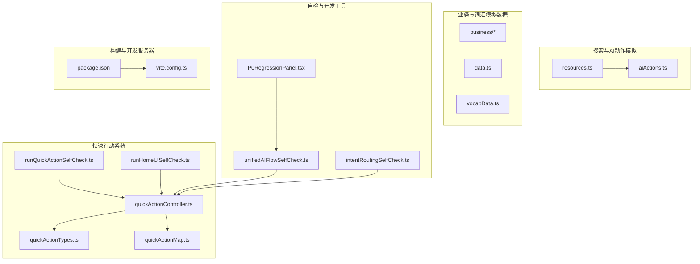
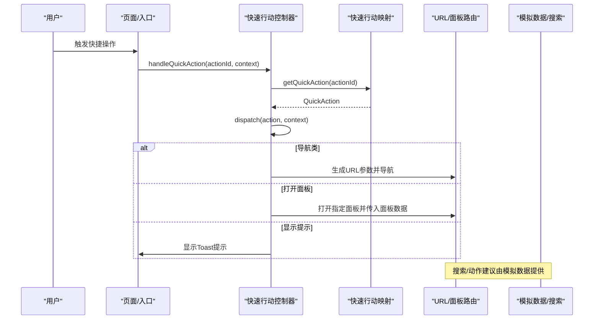
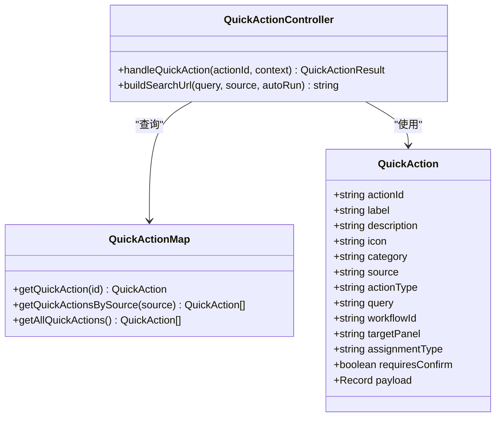
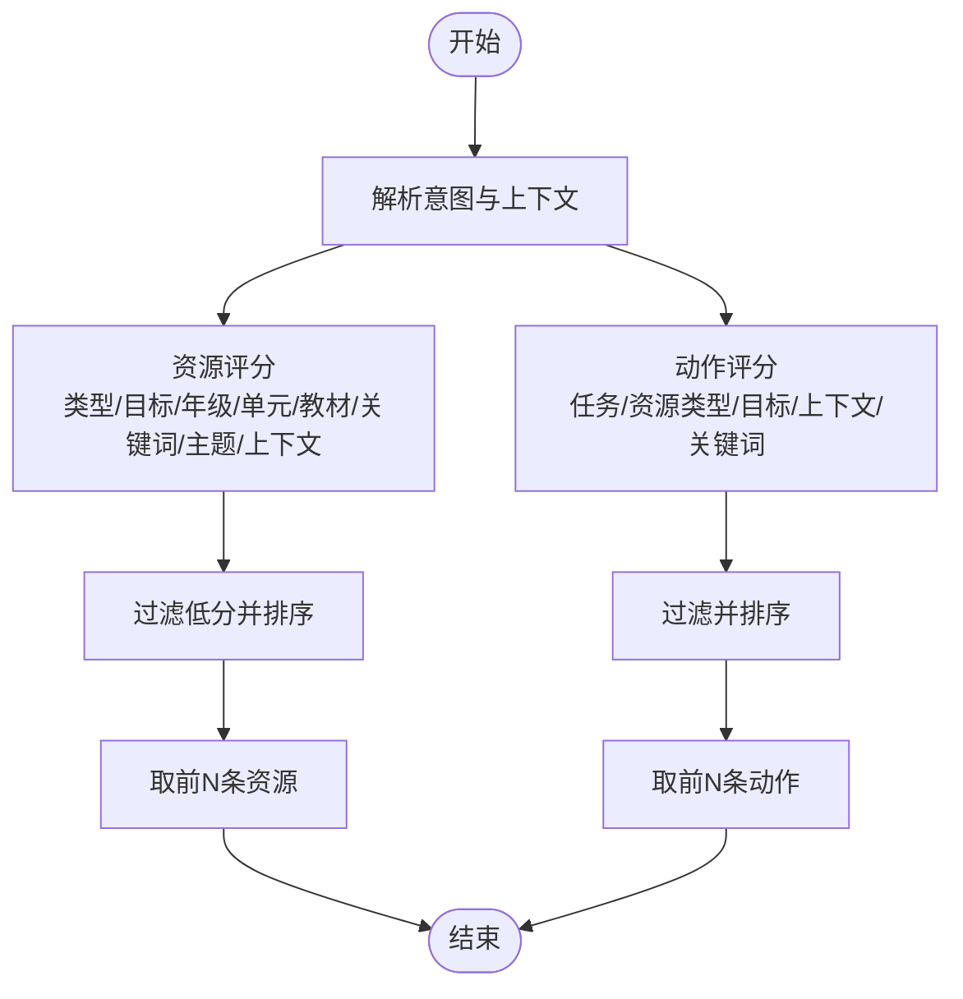
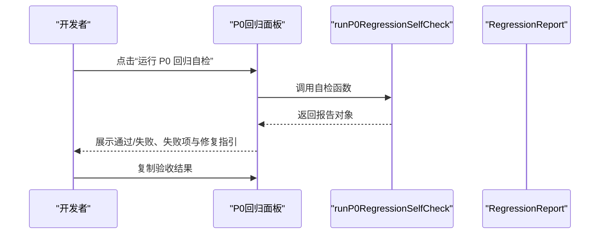
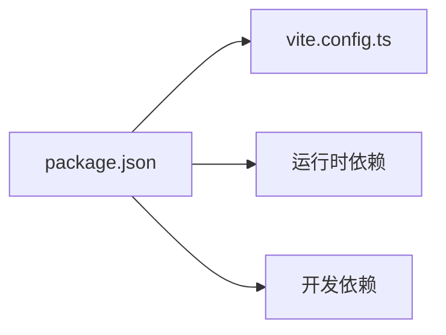

# 开发工具和辅助功能

<cite>
**本文引用的文件**
- [quickActionController.ts](file://src/ai/actions/quickActionController.ts)
- [quickActionTypes.ts](file://src/ai/actions/quickActionTypes.ts)
- [quickActionMap.ts](file://src/ai/actions/quickActionMap.ts)
- [runQuickActionSelfCheck.ts](file://src/ai/actions/runQuickActionSelfCheck.ts)
- [runHomeUiSelfCheck.ts](file://src/ai/actions/runHomeUiSelfCheck.ts)
- [resources.ts](file://src/ai/mock/search/resources.ts)
- [aiActions.ts](file://src/ai/mock/search/aiActions.ts)
- [vocabData.ts](file://src/ai/mock/vocabData.ts)
- [data.ts](file://src/ai/mock/data.ts)
- [unifiedAIFlowSelfCheck.ts](file://src/ai/tests/unifiedAIFlowSelfCheck.ts)
- [intentRoutingSelfCheck.ts](file://src/ai/tests/intentRoutingSelfCheck.ts)
- [P0RegressionPanel.tsx](file://src/ai/dev/P0RegressionPanel.tsx)
- [package.json](file://package.json)
- [vite.config.ts](file://vite.config.ts)
</cite>

## 目录
1. [简介](#简介)
2. [项目结构](#项目结构)
3. [核心组件](#核心组件)
4. [架构总览](#架构总览)
5. [详细组件分析](#详细组件分析)
6. [依赖分析](#依赖分析)
7. [性能考虑](#性能考虑)
8. [故障排查指南](#故障排查指南)
9. [结论](#结论)
10. [附录](#附录)

## 简介
本文件面向小天AI教育平台的开发者，系统化梳理“开发工具与辅助功能”，重点覆盖以下方面：
- 快速行动系统：控制器、动作类型与自检机制
- 模拟数据系统：业务模拟数据、搜索模拟数据与词汇数据
- 开发环境配置与调试技巧
- 开发工具扩展与自定义指南
- 开发效率提升最佳实践与工作流程优化
- 完整的开发工具链使用指南

## 项目结构
本项目采用按功能域划分的目录组织方式，开发工具与辅助功能主要分布在如下区域：
- 快速行动系统：src/ai/actions
- 搜索与AI动作模拟：src/ai/mock/search
- 业务模拟数据：src/ai/mock/business 与 src/ai/mock/data
- 词汇数据：src/ai/mock/vocabData.ts
- 自检与回归工具：src/ai/tests
- 开发态验收面板：src/ai/dev
- 构建与开发服务器：package.json、vite.config.ts

图表来源
- [quickActionController.ts:1-124](file://src/ai/actions/quickActionController.ts#L1-L124)
- [quickActionMap.ts:1-113](file://src/ai/actions/quickActionMap.ts#L1-L113)
- [quickActionTypes.ts:1-66](file://src/ai/actions/quickActionTypes.ts#L1-L66)
- [runQuickActionSelfCheck.ts:1-151](file://src/ai/actions/runQuickActionSelfCheck.ts#L1-L151)
- [runHomeUiSelfCheck.ts:1-143](file://src/ai/actions/runHomeUiSelfCheck.ts#L1-L143)
- [resources.ts:1-109](file://src/ai/mock/search/resources.ts#L1-L109)
- [aiActions.ts:1-304](file://src/ai/mock/search/aiActions.ts#L1-L304)
- [data.ts:1-191](file://src/ai/mock/data.ts#L1-L191)
- [vocabData.ts:1-324](file://src/ai/mock/vocabData.ts#L1-L324)
- [unifiedAIFlowSelfCheck.ts:1-104](file://src/ai/tests/unifiedAIFlowSelfCheck.ts#L1-L104)
- [intentRoutingSelfCheck.ts:1-96](file://src/ai/tests/intentRoutingSelfCheck.ts#L1-L96)
- [P0RegressionPanel.tsx:1-121](file://src/ai/dev/P0RegressionPanel.tsx#L1-L121)
- [package.json:1-31](file://package.json#L1-L31)
- [vite.config.ts:1-12](file://vite.config.ts#L1-L12)

章节来源
- [quickActionController.ts:1-124](file://src/ai/actions/quickActionController.ts#L1-L124)
- [quickActionMap.ts:1-113](file://src/ai/actions/quickActionMap.ts#L1-L113)
- [quickActionTypes.ts:1-66](file://src/ai/actions/quickActionTypes.ts#L1-L66)
- [runQuickActionSelfCheck.ts:1-151](file://src/ai/actions/runQuickActionSelfCheck.ts#L1-L151)
- [runHomeUiSelfCheck.ts:1-143](file://src/ai/actions/runHomeUiSelfCheck.ts#L1-L143)
- [resources.ts:1-109](file://src/ai/mock/search/resources.ts#L1-L109)
- [aiActions.ts:1-304](file://src/ai/mock/search/aiActions.ts#L1-L304)
- [data.ts:1-191](file://src/ai/mock/data.ts#L1-L191)
- [vocabData.ts:1-324](file://src/ai/mock/vocabData.ts#L1-L324)
- [unifiedAIFlowSelfCheck.ts:1-104](file://src/ai/tests/unifiedAIFlowSelfCheck.ts#L1-L104)
- [intentRoutingSelfCheck.ts:1-96](file://src/ai/tests/intentRoutingSelfCheck.ts#L1-L96)
- [P0RegressionPanel.tsx:1-121](file://src/ai/dev/P0RegressionPanel.tsx#L1-L121)
- [package.json:1-31](file://package.json#L1-L31)
- [vite.config.ts:1-12](file://vite.config.ts#L1-L12)

## 核心组件
- 快速行动控制器：统一接收 actionId，查询映射，按动作类型分发为导航、打开面板、显示提示或空操作。
- 快速行动类型与映射：定义动作类别、行为类型、来源标签与动作条目，提供查询与过滤接口。
- 搜索与AI动作模拟：提供资源检索与AI动作推荐的打分与过滤逻辑，支撑搜索结果与建议生成。
- 业务与词汇模拟数据：提供洞察、建议、风险、错题统计、今日建议、待办任务、近期使用等业务数据，以及词汇词典。
- 自检与回归工具：验证意图路由、资源动作路由、快速行动与首页UI一致性，以及开发态回归验收。
- 开发态验收面板：在开发模式下提供一键运行回归自检、查看结果与复制报告的能力。

章节来源
- [quickActionController.ts:34-124](file://src/ai/actions/quickActionController.ts#L34-L124)
- [quickActionTypes.ts:12-66](file://src/ai/actions/quickActionTypes.ts#L12-L66)
- [quickActionMap.ts:12-113](file://src/ai/actions/quickActionMap.ts#L12-L113)
- [resources.ts:57-109](file://src/ai/mock/search/resources.ts#L57-L109)
- [aiActions.ts:247-304](file://src/ai/mock/search/aiActions.ts#L247-L304)
- [data.ts:5-191](file://src/ai/mock/data.ts#L5-L191)
- [vocabData.ts:24-324](file://src/ai/mock/vocabData.ts#L24-L324)
- [unifiedAIFlowSelfCheck.ts:67-96](file://src/ai/tests/unifiedAIFlowSelfCheck.ts#L67-L96)
- [intentRoutingSelfCheck.ts:55-87](file://src/ai/tests/intentRoutingSelfCheck.ts#L55-L87)
- [P0RegressionPanel.tsx:22-121](file://src/ai/dev/P0RegressionPanel.tsx#L22-L121)

## 架构总览
快速行动系统与搜索/模拟数据协同，形成“意图识别—动作分发—结果呈现”的闭环。自检工具贯穿开发流程，确保功能正确性与回归稳定性。

图表来源
- [quickActionController.ts:34-124](file://src/ai/actions/quickActionController.ts#L34-L124)
- [quickActionMap.ts:102-113](file://src/ai/actions/quickActionMap.ts#L102-L113)
- [resources.ts:57-109](file://src/ai/mock/search/resources.ts#L57-L109)
- [aiActions.ts:247-304](file://src/ai/mock/search/aiActions.ts#L247-L304)

## 详细组件分析

### 快速行动系统
- 设计目标：统一入口、集中分发、可配置、可自检
- 关键类型与接口
  - QuickActionCategory：动作类别（词汇、资源、试卷、卡片、写作、听说、考试、报告）
  - QuickActionType：行为类型（搜索自动执行、生成内容、打开面板、布置、加入篮、模拟）
  - QuickActionSource：来源（首页快捷、AI搜索快捷、搜索建议、搜索历史、首页输入、洞察动作、抽屉动作）
  - QuickAction：动作定义，包含标识、标签、描述、图标、类别、来源、行为类型、查询、工作流ID、目标面板、布置类型、确认要求、额外载荷等
- 控制器职责
  - handleQuickAction：根据 actionId 获取动作并分发
  - dispatch：按行为类型生成导航URL、打开面板或提示
  - buildSearchUrl：便捷构建搜索URL（支持自动执行与来源标记）
- 自检机制
  - runQuickActionSelfCheck：校验映射数量、字段完整性、分发结果、URL参数、来源唯一性
  - runHomeUiSelfCheck：校验首页洞察、搜索输入、快捷动作控制器、模块数据与布局微调

图表来源
- [quickActionTypes.ts:45-66](file://src/ai/actions/quickActionTypes.ts#L45-L66)
- [quickActionController.ts:34-124](file://src/ai/actions/quickActionController.ts#L34-L124)
- [quickActionMap.ts:102-113](file://src/ai/actions/quickActionMap.ts#L102-L113)

章节来源
- [quickActionTypes.ts:12-66](file://src/ai/actions/quickActionTypes.ts#L12-L66)
- [quickActionController.ts:18-124](file://src/ai/actions/quickActionController.ts#L18-L124)
- [quickActionMap.ts:12-113](file://src/ai/actions/quickActionMap.ts#L12-L113)
- [runQuickActionSelfCheck.ts:10-143](file://src/ai/actions/runQuickActionSelfCheck.ts#L10-L143)
- [runHomeUiSelfCheck.ts:15-135](file://src/ai/actions/runHomeUiSelfCheck.ts#L15-L135)

### 搜索与AI动作模拟系统
- 资源搜索
  - 输入：解析后的意图与上下文
  - 评分维度：资源类型匹配、教学目标匹配、年级匹配、单元匹配、教材匹配、关键词命中、主题命中、上下文匹配
  - 输出：按分数降序、过滤低分后取前若干条资源
- AI动作推荐
  - 输入：解析后的意图与上下文
  - 评分维度：任务类型精确匹配、资源类型相关性、教学目标相关性、年级/单元/主题上下文、关键词命中
  - 输出：按分数降序、过滤后取前若干条动作

图表来源
- [resources.ts:57-109](file://src/ai/mock/search/resources.ts#L57-L109)
- [aiActions.ts:247-304](file://src/ai/mock/search/aiActions.ts#L247-L304)

章节来源
- [resources.ts:57-109](file://src/ai/mock/search/resources.ts#L57-L109)
- [aiActions.ts:247-304](file://src/ai/mock/search/aiActions.ts#L247-L304)

### 业务与词汇模拟数据
- 业务模拟数据
  - 洞察、建议、风险、错题统计、今日建议、待办任务、近期使用等
  - 用于首页/报告页/抽屉等界面的数据支撑
- 词汇数据
  - 单元词汇表（含词形、音标、难度、频率、标签、常见错误、核心词、中考词、词性、例句）
  - 支持按单元聚合与检索

章节来源
- [data.ts:5-191](file://src/ai/mock/data.ts#L5-L191)
- [vocabData.ts:24-324](file://src/ai/mock/vocabData.ts#L24-L324)

### 自检与回归工具
- 统一AI全链路自检
  - 验证意图路由（matchIntent）与资源动作路由（handleResourceAction）
  - 校验页面入口链路与组件使用
- 意图路由自检
  - 验证不同入口与来源下的意图识别准确性
- 开发态P0回归面板
  - 仅开发模式可见，一键运行回归自检，展示通过/失败、失败项与修复指引，支持复制报告

图表来源
- [P0RegressionPanel.tsx:29-41](file://src/ai/dev/P0RegressionPanel.tsx#L29-L41)
- [unifiedAIFlowSelfCheck.ts:67-96](file://src/ai/tests/unifiedAIFlowSelfCheck.ts#L67-L96)

章节来源
- [unifiedAIFlowSelfCheck.ts:14-96](file://src/ai/tests/unifiedAIFlowSelfCheck.ts#L14-L96)
- [intentRoutingSelfCheck.ts:55-87](file://src/ai/tests/intentRoutingSelfCheck.ts#L55-L87)
- [P0RegressionPanel.tsx:22-121](file://src/ai/dev/P0RegressionPanel.tsx#L22-L121)

## 依赖分析
- 构建与开发服务器
  - Vite + React + TailwindCSS 插件
  - 开发服务器允许本地与受控主机访问
- 依赖关系
  - 前端运行时依赖：React、React Router、TailwindCSS、Framer Motion、Lucide React、Zustand
  - 开发依赖：TypeScript、Vite、Netlify CLI

图表来源
- [package.json:6-31](file://package.json#L6-L31)
- [vite.config.ts:5-12](file://vite.config.ts#L5-L12)

章节来源
- [package.json:6-31](file://package.json#L6-L31)
- [vite.config.ts:5-12](file://vite.config.ts#L5-L12)

## 性能考虑
- 快速行动分发
  - 查询映射为内存查找，O(1)复杂度；分发分支有限，性能开销极低
- 搜索与动作推荐
  - 资源与动作均采用线性扫描+评分+排序，复杂度 O(N log N)，N 为候选集合大小
  - 建议控制候选规模（如限制资源/动作数量）以维持响应速度
- 模拟数据
  - 业务与词汇数据为静态常量，读取成本低；建议按需加载或懒初始化，避免首屏阻塞

## 故障排查指南
- 快速行动
  - 未知 actionId：返回提示类型，检查 actionId 是否存在于映射中
  - URL 参数缺失：核对来源与查询参数是否正确设置
  - 面板打开异常：确认目标面板名称与面板数据结构一致
- 搜索与动作
  - 结果为空：检查实体与教学目标是否匹配，或适当放宽阈值
  - 上下文不匹配：确认上下文字段（年级/单元/教材）与资源/动作标签一致
- 自检工具
  - runQuickActionSelfCheck：关注映射数量、字段完整性、URL参数与来源唯一性
  - runHomeUiSelfCheck：关注洞察生成、搜索URL构建与快捷动作控制器功能
  - unifiedAIFlowSelfCheck：核对意图路由与动作路由的预期结果
  - P0回归面板：查看失败项与修复指引，复制报告便于协作

章节来源
- [runQuickActionSelfCheck.ts:10-143](file://src/ai/actions/runQuickActionSelfCheck.ts#L10-L143)
- [runHomeUiSelfCheck.ts:15-135](file://src/ai/actions/runHomeUiSelfCheck.ts#L15-L135)
- [unifiedAIFlowSelfCheck.ts:67-96](file://src/ai/tests/unifiedAIFlowSelfCheck.ts#L67-L96)
- [P0RegressionPanel.tsx:68-115](file://src/ai/dev/P0RegressionPanel.tsx#L68-L115)

## 结论
本开发工具与辅助功能体系以“统一入口、可配置、可自检”为核心设计原则，通过快速行动控制器与映射、搜索与动作模拟、业务与词汇模拟数据、以及完善的自检与开发态验收工具，显著提升了开发效率与质量稳定性。建议在新增动作、修改搜索逻辑或引入新业务数据时，同步完善自检用例与验收面板，确保回归可控。

## 附录
- 开发工具链使用指南
  - 运行快速行动自检：在终端执行相应脚本路径，查看控制台输出
  - 运行首页UI自检：在终端执行相应脚本路径，查看控制台输出
  - 运行统一AI全链路自检：在终端执行相应脚本路径，查看控制台输出
  - 运行意图路由自检：在浏览器控制台调用对应函数或在Node环境中导入并调用
  - 开发态P0回归面板：在开发模式下打开页面，右下角固定面板可一键运行与复制报告
- 扩展与自定义建议
  - 新增动作：在映射中添加条目，补充类型与字段；在控制器中完善分发逻辑
  - 新增搜索/动作：在对应模拟模块中扩展候选集合与评分规则
  - 新增自检：在对应自检文件中追加用例，保持覆盖率与可维护性
  - 新增业务数据：在模拟数据模块中扩展结构与默认值，确保类型安全