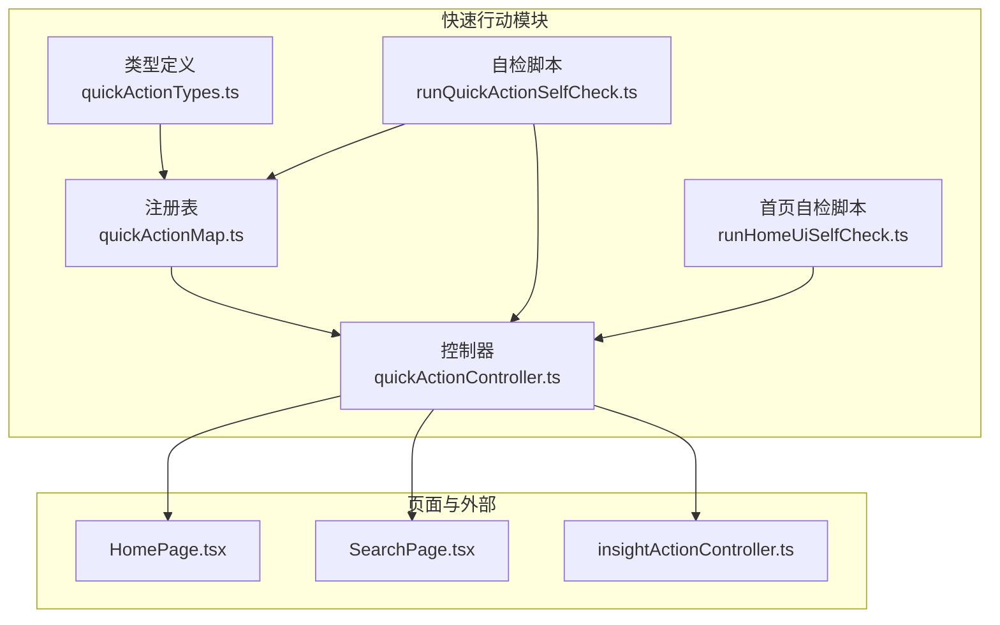
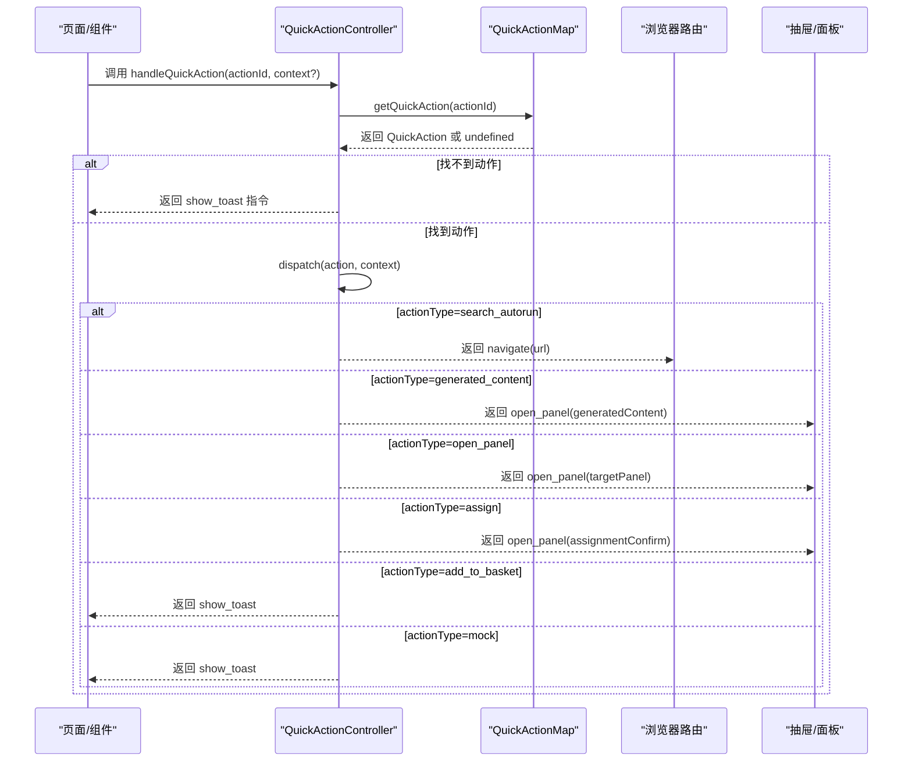
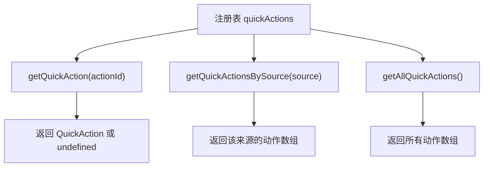
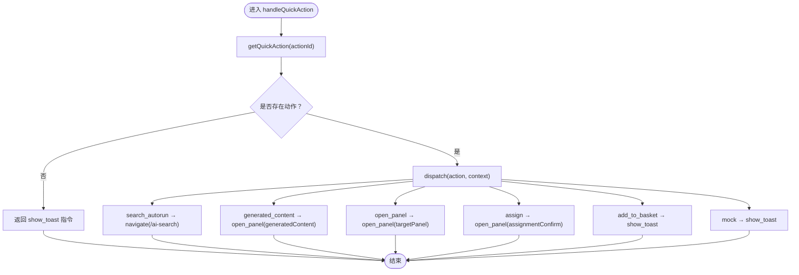
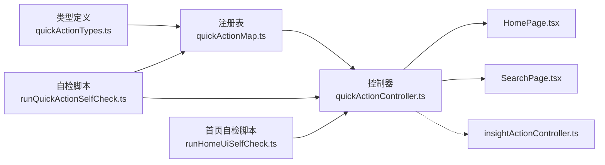

# 快速行动系统

<cite>
**本文引用的文件**
- [quickActionController.ts](file://src/ai/actions/quickActionController.ts)
- [quickActionMap.ts](file://src/ai/actions/quickActionMap.ts)
- [quickActionTypes.ts](file://src/ai/actions/quickActionTypes.ts)
- [runQuickActionSelfCheck.ts](file://src/ai/actions/runQuickActionSelfCheck.ts)
- [runHomeUiSelfCheck.ts](file://src/ai/actions/runHomeUiSelfCheck.ts)
- [quick-action-unification.md](file://docs/quick-action-unification.md)
- [insightActionController.ts](file://src/ai/insights/insightActionController.ts)
- [HomePage.tsx](file://src/pages/HomePage.tsx)
- [SearchPage.tsx](file://src/pages/SearchPage.tsx)
</cite>

## 目录
1. [简介](#简介)
2. [项目结构](#项目结构)
3. [核心组件](#核心组件)
4. [架构总览](#架构总览)
5. [详细组件分析](#详细组件分析)
6. [依赖关系分析](#依赖关系分析)
7. [性能考量](#性能考量)
8. [故障排查指南](#故障排查指南)
9. [结论](#结论)
10. [附录](#附录)

## 简介
本文件为小天AI教育平台“快速行动系统”的技术文档，聚焦于统一的快捷操作控制器设计与实现，涵盖以下关键主题：
- 统一的行动分发逻辑：通过控制器集中处理不同来源的快捷操作请求，屏蔽页面层的导航细节。
- 上下文管理：控制器接收可选上下文参数，用于影响派发结果（如布置练习时的班级名）。
- 结果处理：控制器返回标准化的结果对象，支持导航、打开面板、展示提示等指令。
- 快速行动类型定义：明确类别、行为类型、来源等字段，确保配置驱动与可扩展性。
- 快速行动映射系统：集中注册与查找机制，支持按来源筛选与全量导出。
- 自检系统与测试：提供自动化自检脚本，覆盖映射完整性、分发正确性与URL构建。
- 扩展与定制：新增行动类型与配置的步骤指南，以及与现有工作流引擎的集成方式。

## 项目结构
快速行动系统位于 src/ai/actions 目录，核心文件包括：
- 类型定义：quickActionTypes.ts
- 注册表：quickActionMap.ts
- 控制器：quickActionController.ts
- 自检脚本：runQuickActionSelfCheck.ts、runHomeUiSelfCheck.ts
- 设计文档：docs/quick-action-unification.md



图表来源
- [quickActionTypes.ts:1-66](file://src/ai/actions/quickActionTypes.ts#L1-L66)
- [quickActionMap.ts:1-113](file://src/ai/actions/quickActionMap.ts#L1-L113)
- [quickActionController.ts:1-124](file://src/ai/actions/quickActionController.ts#L1-L124)
- [runQuickActionSelfCheck.ts:1-151](file://src/ai/actions/runQuickActionSelfCheck.ts#L1-L151)
- [runHomeUiSelfCheck.ts:1-143](file://src/ai/actions/runHomeUiSelfCheck.ts#L1-L143)
- [HomePage.tsx:1-200](file://src/pages/HomePage.tsx#L1-L200)
- [SearchPage.tsx:1-200](file://src/pages/SearchPage.tsx#L1-L200)
- [insightActionController.ts:1-200](file://src/ai/insights/insightActionController.ts#L1-L200)

章节来源
- [quickActionController.ts:1-124](file://src/ai/actions/quickActionController.ts#L1-L124)
- [quickActionMap.ts:1-113](file://src/ai/actions/quickActionMap.ts#L1-L113)
- [quickActionTypes.ts:1-66](file://src/ai/actions/quickActionTypes.ts#L1-L66)
- [runQuickActionSelfCheck.ts:1-151](file://src/ai/actions/runQuickActionSelfCheck.ts#L1-L151)
- [runHomeUiSelfCheck.ts:1-143](file://src/ai/actions/runHomeUiSelfCheck.ts#L1-L143)
- [quick-action-unification.md:1-133](file://docs/quick-action-unification.md#L1-L133)

## 核心组件
- 类型定义（QuickAction 相关类型）
  - 行为类型 QuickActionType：search_autorun、generated_content、open_panel、assign、add_to_basket、mock
  - 类别 QuickActionCategory：vocab、resource、paper、card、writing、listening_speaking、exam、report
  - 来源 QuickActionSource：homepage_quick_action、ai_search_quick_action、ai_search_suggestion、ai_search_recent、homepage_input、insight_action、drawer_action
  - 快捷动作 QuickAction：包含 actionId、label、description、icon、category、source、actionType、query、workflowId、targetPanel、assignmentType、requiresConfirm、payload 等字段
- 注册表（QuickActionMap）
  - 提供 actionId 到 QuickAction 的映射，支持按来源过滤与全量导出
  - V1 定义了首页与搜索页各 4 个快捷动作，共计 8 个
- 控制器（QuickActionController）
  - 主入口 handleQuickAction：根据 actionId 获取动作并分发
  - 分发函数 dispatch：根据 actionType 返回标准化结果（navigate/open_panel/show_toast/none）
  - 构建搜索 URL 工具 buildSearchUrl：用于无需分发的直接 URL 生成
- 自检脚本
  - runQuickActionSelfCheck：验证映射数量、字段完整性、分发行为、buildSearchUrl 输出
  - runHomeUiSelfCheck：验证首页功能自检（洞察、搜索、快捷动作控制器可用性）

章节来源
- [quickActionTypes.ts:12-66](file://src/ai/actions/quickActionTypes.ts#L12-L66)
- [quickActionMap.ts:12-113](file://src/ai/actions/quickActionMap.ts#L12-L113)
- [quickActionController.ts:16-124](file://src/ai/actions/quickActionController.ts#L16-L124)
- [runQuickActionSelfCheck.ts:10-143](file://src/ai/actions/runQuickActionSelfCheck.ts#L10-L143)
- [runHomeUiSelfCheck.ts:15-135](file://src/ai/actions/runHomeUiSelfCheck.ts#L15-L135)

## 架构总览
统一的快捷操作控制器作为“入口”，屏蔽页面层的导航细节；注册表集中管理所有快捷动作；自检脚本保障配置与行为正确性。同时，洞察推荐动作控制器与之并行，未来可合并为统一控制器。



图表来源
- [quickActionController.ts:34-111](file://src/ai/actions/quickActionController.ts#L34-L111)
- [quickActionMap.ts:102-104](file://src/ai/actions/quickActionMap.ts#L102-L104)

章节来源
- [quickActionController.ts:34-124](file://src/ai/actions/quickActionController.ts#L34-L124)
- [quickActionMap.ts:102-113](file://src/ai/actions/quickActionMap.ts#L102-L113)

## 详细组件分析

### 快捷动作类型定义
- 行为类型（actionType）
  - search_autorun：自动执行搜索，生成 /ai-search URL 并携带 query、autoRun、source
  - generated_content：打开生成内容面板，传递 actionId、source、contentType
  - open_panel：打开指定面板，传递 actionId、source 与目标面板名
  - assign：打开布置确认面板，传递标题、班级名、作业类型等
  - add_to_basket：加入练习篮（V1 为占位，返回提示）
  - mock：占位动作（返回提示）
- 类别（category）
  - 用于内容分类，如词汇、资源、试卷、卡片、写作、听说、考试、报告
- 来源（source）
  - 用于埋点与追踪，区分首页、搜索页、洞察等来源
- 快捷动作（QuickAction）
  - 包含标识、标签、描述、图标、类别、来源、行为类型、查询、工作流ID、目标面板、作业类型、是否需要确认、额外载荷等

```mermaid
classDiagram
class QuickAction {
+string actionId
+string label
+string? description
+string? icon
+QuickActionCategory category
+QuickActionSource source
+QuickActionType actionType
+string? query
+string? workflowId
+string? targetPanel
+string? assignmentType
+boolean requiresConfirm
+Record~string,string~? payload
}
class QuickActionType {
<<enumeration>>
"search_autorun"
"generated_content"
"open_panel"
"assign"
"add_to_basket"
"mock"
}
class QuickActionCategory {
<<enumeration>>
"vocab"
"resource"
"paper"
"card"
"writing"
"listening_speaking"
"exam"
"report"
}
class QuickActionSource {
<<enumeration>>
"homepage_quick_action"
"ai_search_quick_action"
"ai_search_suggestion"
"ai_search_recent"
"homepage_input"
"insight_action"
"drawer_action"
}
QuickAction --> QuickActionType : "使用"
QuickAction --> QuickActionCategory : "使用"
QuickAction --> QuickActionSource : "使用"
```

图表来源
- [quickActionTypes.ts:45-66](file://src/ai/actions/quickActionTypes.ts#L45-L66)
- [quickActionTypes.ts:24-42](file://src/ai/actions/quickActionTypes.ts#L24-L42)

章节来源
- [quickActionTypes.ts:12-66](file://src/ai/actions/quickActionTypes.ts#L12-L66)

### 快速行动映射系统
- 注册表结构
  - 使用对象记录 actionId 到 QuickAction 的映射
  - 提供 getQuickAction、getQuickActionsBySource、getAllQuickActions 三种查询接口
- V1 动作清单
  - 首页快捷动作：生成听写、查同步资源、智能组卷、快速制卡（4 个）
  - 搜索页快捷动作：生成听写、查同步资源、智能组卷、快速制卡（4 个）
- 路由与来源
  - 首页动作 source 为 homepage_quick_action
  - 搜索页动作 source 为 ai_search_quick_action
  - 查询参数 autoRun=1 用于自动执行搜索



图表来源
- [quickActionMap.ts:12-113](file://src/ai/actions/quickActionMap.ts#L12-L113)

章节来源
- [quickActionMap.ts:12-113](file://src/ai/actions/quickActionMap.ts#L12-L113)

### 快速行动控制器
- 主入口 handleQuickAction
  - 根据 actionId 获取动作，若不存在则返回提示
  - 存在则进入 dispatch 分发
- 分发逻辑 dispatch
  - search_autorun：构造 /ai-search URL，设置 autoRun=1、source、query
  - generated_content：打开生成内容面板，传入 actionId、source、contentType
  - open_panel：打开指定面板，传入 actionId、source、targetPanel
  - assign：打开布置确认面板，传入标题、班级名、作业类型
  - add_to_basket：返回提示（V1 占位）
  - mock：返回提示（V1 占位）
- URL 构建工具 buildSearchUrl
  - 直接生成 /ai-search?query=...&autoRun=1&source=...



图表来源
- [quickActionController.ts:34-124](file://src/ai/actions/quickActionController.ts#L34-L124)

章节来源
- [quickActionController.ts:34-124](file://src/ai/actions/quickActionController.ts#L34-L124)

### 自检系统与测试
- runQuickActionSelfCheck
  - 验证映射数量与字段完整性
  - 验证分发行为（如 homepage_generate_dictation → navigate，URL 包含 /ai-search、autoRun、source、query）
  - 验证 buildSearchUrl 的输出
  - 验证来源唯一性（首页与搜索页各≥4）
- runHomeUiSelfCheck
  - 验证首页洞察生成、搜索 URL 构建、快捷动作控制器可用性
  - 验证模块数据与导入完整性
  - 验证布局微调与无重复壳子

章节来源
- [runQuickActionSelfCheck.ts:10-143](file://src/ai/actions/runQuickActionSelfCheck.ts#L10-L143)
- [runHomeUiSelfCheck.ts:15-135](file://src/ai/actions/runHomeUiSelfCheck.ts#L15-L135)

### 与页面和工作流的集成
- HomePage
  - 通过 handleQuickAction 接入快捷动作，触发工作流或导航
  - 与教师上下文（教材、单元、年级、班级、学生人数）结合
- SearchPage
  - 支持标签点击与自动执行搜索（autoRun=1）
  - 与新的搜索引擎协同工作（虽非本控制器直接职责，但 URL 与来源保持一致）

章节来源
- [HomePage.tsx:137-163](file://src/pages/HomePage.tsx#L137-L163)
- [SearchPage.tsx:60-74](file://src/pages/SearchPage.tsx#L60-L74)

## 依赖关系分析
- 控制器依赖注册表：通过 getQuickAction 获取动作定义
- 注册表依赖类型定义：确保动作字段符合类型约束
- 自检脚本依赖控制器与注册表：验证行为与输出
- 页面依赖控制器：通过统一入口发起操作
- 洞察动作控制器与之并行，未来可合并为统一控制器



图表来源
- [quickActionTypes.ts:1-66](file://src/ai/actions/quickActionTypes.ts#L1-L66)
- [quickActionMap.ts:1-113](file://src/ai/actions/quickActionMap.ts#L1-L113)
- [quickActionController.ts:1-124](file://src/ai/actions/quickActionController.ts#L1-L124)
- [runQuickActionSelfCheck.ts:1-151](file://src/ai/actions/runQuickActionSelfCheck.ts#L1-L151)
- [runHomeUiSelfCheck.ts:1-143](file://src/ai/actions/runHomeUiSelfCheck.ts#L1-L143)
- [HomePage.tsx:1-200](file://src/pages/HomePage.tsx#L1-L200)
- [SearchPage.tsx:1-200](file://src/pages/SearchPage.tsx#L1-L200)
- [insightActionController.ts:1-200](file://src/ai/insights/insightActionController.ts#L1-L200)

章节来源
- [quickActionController.ts:11-12](file://src/ai/actions/quickActionController.ts#L11-L12)
- [quickActionMap.ts:8-8](file://src/ai/actions/quickActionMap.ts#L8-L8)

## 性能考量
- 查询复杂度
  - 注册表为内存对象映射，getQuickAction 为 O(1)，getQuickActionsBySource 为 O(n)
- 分发复杂度
  - dispatch 为常数时间分支判断，开销极低
- 建议
  - 若动作规模扩大，可考虑对来源建立二级索引以优化按来源查询
  - URL 构建与字符串拼接为轻量操作，无需额外优化

## 故障排查指南
- 常见问题
  - 未知 actionId：控制器返回 show_toast，提示未找到快捷操作
  - URL 缺少 source/autoRun/query：检查 action.source 与 action.query 是否正确配置
  - 面板未打开：确认 actionType 与 targetPanel 是否匹配
- 自检脚本
  - 运行 runQuickActionSelfCheck，查看映射数量、字段完整性、分发行为与 URL 构建结果
  - 运行 runHomeUiSelfCheck，验证首页功能与控制器可用性
- 日志与调试
  - 在控制器中增加日志（如 actionId、actionType、context），便于定位问题
  - 在页面层捕获并展示返回的 toastMessage

章节来源
- [quickActionController.ts:38-42](file://src/ai/actions/quickActionController.ts#L38-L42)
- [runQuickActionSelfCheck.ts:19-101](file://src/ai/actions/runQuickActionSelfCheck.ts#L19-L101)

## 结论
快速行动系统通过“类型定义 + 注册表 + 控制器 + 自检脚本”的组合，实现了跨入口（首页、搜索页、洞察）的统一快捷操作体验。其设计具备以下优势：
- 统一分发：屏蔽页面层导航细节，降低重复逻辑
- 配置驱动：通过注册表集中管理动作，易于扩展
- 可观测性：标准化结果类型与来源追踪，便于埋点与分析
- 可靠性：完善的自检脚本保障映射与行为正确性
未来可进一步合并洞察动作控制器，形成统一的行动控制器，提升一致性与可维护性。

## 附录

### 快速行动类型与使用场景对照
- search_autorun：适用于“立即搜索”类动作，自动执行搜索并展示结果
- generated_content：适用于“生成内容”类动作，打开生成内容面板
- open_panel：适用于“打开面板”类动作，打开指定面板
- assign：适用于“布置练习”类动作，打开布置确认面板
- add_to_basket：占位动作，后续接入练习篮
- mock：占位动作，用于演示与过渡

章节来源
- [quickActionTypes.ts:24-31](file://src/ai/actions/quickActionTypes.ts#L24-L31)

### 新增快捷动作步骤指南
- 步骤
  - 在注册表中新增动作条目，确保 actionId 唯一、包含必需字段（actionId、label、source、actionType）
  - 如需自动搜索，设置 actionType=search_autorun 并提供 query
  - 如需打开面板，设置 actionType=open_panel 并提供 targetPanel
  - 如需布置确认，设置 actionType=assign 并提供 assignmentType
  - 如需生成内容，设置 actionType=generated_content 并提供 category/workflowId
  - 运行自检脚本验证映射与分发行为
- 注意事项
  - 保持 source 与触发场景一致（首页/搜索页/洞察）
  - 保证 URL 参数完整（query、autoRun、source）
  - 面板名称与实际面板一致

章节来源
- [quickActionMap.ts:12-98](file://src/ai/actions/quickActionMap.ts#L12-L98)
- [quickActionController.ts:49-111](file://src/ai/actions/quickActionController.ts#L49-L111)
- [runQuickActionSelfCheck.ts:27-65](file://src/ai/actions/runQuickActionSelfCheck.ts#L27-L65)

### 与洞察动作控制器的关系
- 当前并行运行：首页/搜索页使用 quickActionController，洞察使用 insightActionController
- 关键差异
  - 来源感知：insightActionController 根据 source 决定留在抽屉还是导航至 /ai-search
  - 内容生成：insightActionController 支持生成内容与资源推荐
- 合并前景：未来可将两者合并为统一控制器，统一来源规范与分发策略

章节来源
- [insightActionController.ts:48-157](file://src/ai/insights/insightActionController.ts#L48-L157)
- [quick-action-unification.md:68-82](file://docs/quick-action-unification.md#L68-L82)