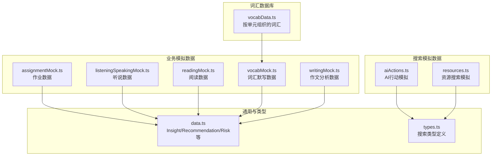
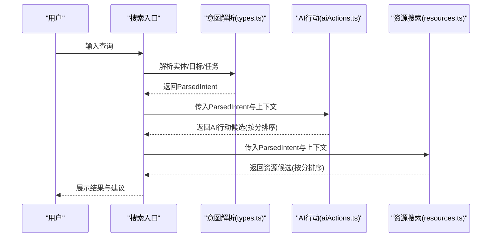
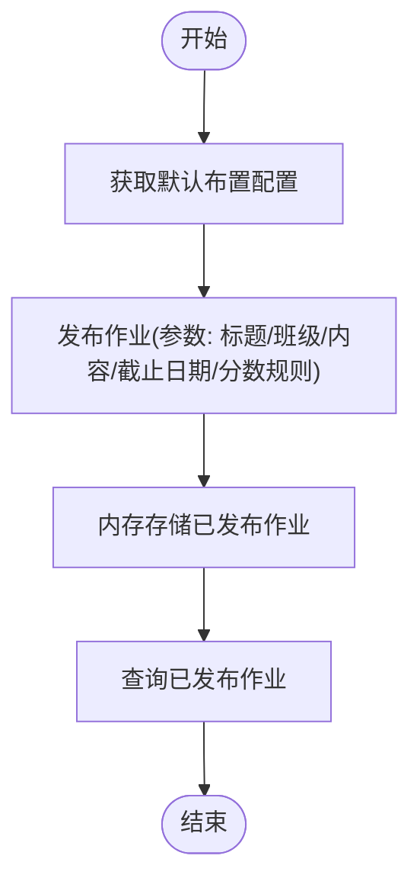
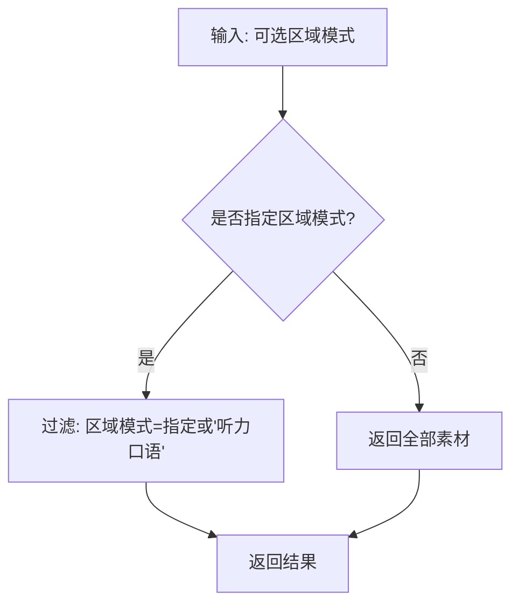
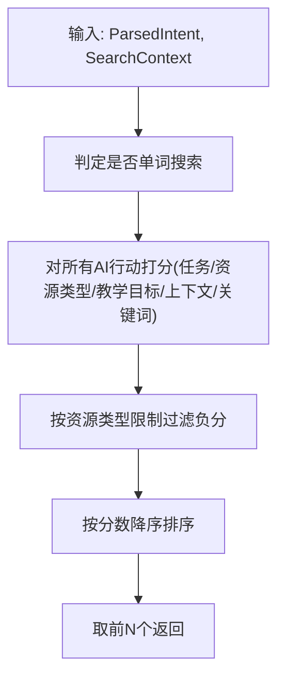
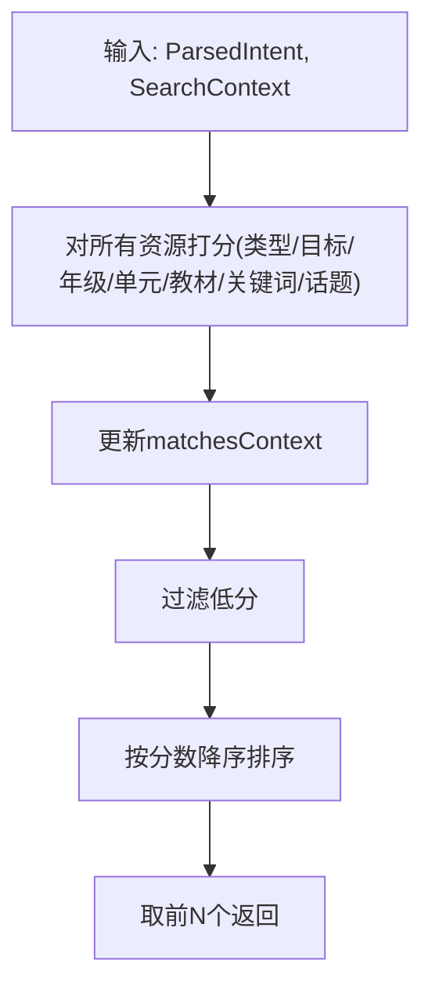
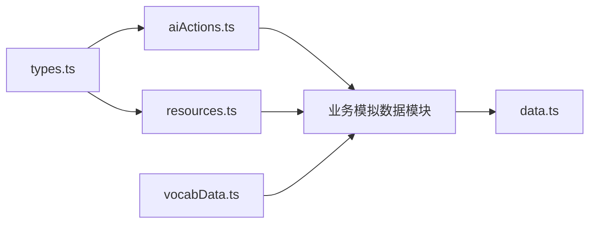

# 模拟数据系统

<cite>
**本文引用的文件**   
- [src/ai/mock/business/index.ts](file://src/ai/mock/business/index.ts)
- [src/ai/mock/business/assignmentMock.ts](file://src/ai/mock/business/assignmentMock.ts)
- [src/ai/mock/business/listeningSpeakingMock.ts](file://src/ai/mock/business/listeningSpeakingMock.ts)
- [src/ai/mock/business/readingMock.ts](file://src/ai/mock/business/readingMock.ts)
- [src/ai/mock/business/vocabMock.ts](file://src/ai/mock/business/vocabMock.ts)
- [src/ai/mock/business/writingMock.ts](file://src/ai/mock/business/writingMock.ts)
- [src/ai/mock/search/aiActions.ts](file://src/ai/mock/search/aiActions.ts)
- [src/ai/mock/search/resources.ts](file://src/ai/mock/search/resources.ts)
- [src/ai/mock/data.ts](file://src/ai/mock/data.ts)
- [src/ai/mock/vocabData.ts](file://src/ai/mock/vocabData.ts)
- [src/ai/search/types.ts](file://src/ai/search/types.ts)
- [src/ai/tests/actionRoutingSelfCheck.ts](file://src/ai/tests/actionRoutingSelfCheck.ts)
- [src/ai/tests/intentRoutingSelfCheck.ts](file://src/ai/tests/intentRoutingSelfCheck.ts)
</cite>

## 目录
1. [引言](#引言)
2. [项目结构](#项目结构)
3. [核心组件](#核心组件)
4. [架构总览](#架构总览)
5. [详细组件分析](#详细组件分析)
6. [依赖关系分析](#依赖关系分析)
7. [性能考虑](#性能考虑)
8. [故障排查指南](#故障排查指南)
9. [结论](#结论)
10. [附录](#附录)

## 引言
本文件为小天AI教育平台的“模拟数据系统”技术文档，目标是帮助开发者与测试人员理解并高效使用模拟数据，支撑业务模拟（作业、听说读写）、词汇模拟、搜索模拟（AI行动与资源搜索）等模块在开发与回归测试中的落地。文档覆盖设计目的、架构原理、数据结构与生成规则、配置与扩展方法、最佳实践、性能优化建议与使用指南。

## 项目结构
模拟数据系统主要分布在以下目录与文件中：
- 业务模拟数据：作业、听说、阅读、词汇、写作
- 搜索模拟数据：AI行动、资源搜索
- 通用洞察与建议：Insight、Recommendation、Risk、今日建议、待办等
- 词汇数据库：按单元组织的完整词汇条目
- 搜索类型定义：资源类型、教学目标、AI任务、意图实体、上下文等

图表来源
- [src/ai/mock/business/assignmentMock.ts:1-79](file://src/ai/mock/business/assignmentMock.ts#L1-L79)
- [src/ai/mock/business/listeningSpeakingMock.ts:1-134](file://src/ai/mock/business/listeningSpeakingMock.ts#L1-L134)
- [src/ai/mock/business/readingMock.ts:1-84](file://src/ai/mock/business/readingMock.ts#L1-L84)
- [src/ai/mock/business/vocabMock.ts:1-44](file://src/ai/mock/business/vocabMock.ts#L1-L44)
- [src/ai/mock/business/writingMock.ts:1-120](file://src/ai/mock/business/writingMock.ts#L1-L120)
- [src/ai/mock/search/aiActions.ts:1-304](file://src/ai/mock/search/aiActions.ts#L1-L304)
- [src/ai/mock/search/resources.ts:1-109](file://src/ai/mock/search/resources.ts#L1-L109)
- [src/ai/mock/data.ts:1-191](file://src/ai/mock/data.ts#L1-L191)
- [src/ai/mock/vocabData.ts:1-324](file://src/ai/mock/vocabData.ts#L1-L324)
- [src/ai/search/types.ts:1-195](file://src/ai/search/types.ts#L1-L195)

章节来源
- [src/ai/mock/business/index.ts:1-15](file://src/ai/mock/business/index.ts#L1-L15)

## 核心组件
- 业务模拟数据
  - 作业：班级列表、默认布置配置、发布作业（内存存储）、已发布作业查询
  - 听说：素材集合（含区域模式、技能焦点、难度、练习标记），提供按区域模式、考试准备、课堂可用素材的筛选
  - 阅读：阅读材料集合（标题、正文、题型、难度、预计时长、单元/年级标签）
  - 词汇：词汇默写集合（单词、释义、难度、错误率、来源单元、常见误拼），提供按单元取Top错误词
  - 作文：作文分析数据（话题、总数、均分、分数分布、常见问题、学生分数、样例改进）
- 搜索模拟数据
  - AI行动：按意图实体与上下文打分，过滤与排序，返回候选AI行动
  - 资源搜索：按资源类型、教学目标、年级/单元/教材、关键词/话题、上下文匹配打分，返回候选资源
- 通用与词汇
  - Insight/Recommendation/Risk/今日建议/待办/近期使用等
  - 按单元组织的完整词汇库（词、音标、难度、频率、标签、常见错误、是否核心/中考、词性、例句）

章节来源
- [src/ai/mock/business/assignmentMock.ts:1-79](file://src/ai/mock/business/assignmentMock.ts#L1-L79)
- [src/ai/mock/business/listeningSpeakingMock.ts:1-134](file://src/ai/mock/business/listeningSpeakingMock.ts#L1-L134)
- [src/ai/mock/business/readingMock.ts:1-84](file://src/ai/mock/business/readingMock.ts#L1-L84)
- [src/ai/mock/business/vocabMock.ts:1-44](file://src/ai/mock/business/vocabMock.ts#L1-L44)
- [src/ai/mock/business/writingMock.ts:1-120](file://src/ai/mock/business/writingMock.ts#L1-L120)
- [src/ai/mock/search/aiActions.ts:1-304](file://src/ai/mock/search/aiActions.ts#L1-L304)
- [src/ai/mock/search/resources.ts:1-109](file://src/ai/mock/search/resources.ts#L1-L109)
- [src/ai/mock/data.ts:1-191](file://src/ai/mock/data.ts#L1-L191)
- [src/ai/mock/vocabData.ts:1-324](file://src/ai/mock/vocabData.ts#L1-L324)

## 架构总览
模拟数据系统采用“模块化+组合式”的设计：
- 业务模块：各自独立的数据生成函数与类型定义，便于按需引入与替换
- 搜索模块：以意图解析与上下文为输入，对AI行动与资源进行打分与排序
- 通用模块：提供Insight/Risk/Recommendation等通用结构，支撑教学建议与风险提醒
- 词汇模块：提供按单元的词汇数据库，供业务与搜索模块复用

图表来源
- [src/ai/search/types.ts:57-134](file://src/ai/search/types.ts#L57-L134)
- [src/ai/mock/search/aiActions.ts:247-303](file://src/ai/mock/search/aiActions.ts#L247-L303)
- [src/ai/mock/search/resources.ts:57-108](file://src/ai/mock/search/resources.ts#L57-L108)

## 详细组件分析

### 业务模拟数据

#### 作业数据（assignmentMock）
- 设计目的：提供班级列表、默认布置配置、发布作业（内存存储）、查询已发布作业
- 关键接口
  - 获取班级列表
  - 获取默认布置配置（默认起止时间、发布模式、分数显示规则）
  - 发布作业（返回新发布的作业对象并存入内存列表）
  - 查询已发布作业
- 使用场景
  - 布置作业页面初始化
  - 作业管理与历史查看
  - 与工作流引擎对接，触发作业执行

图表来源
- [src/ai/mock/business/assignmentMock.ts:30-78](file://src/ai/mock/business/assignmentMock.ts#L30-L78)

章节来源
- [src/ai/mock/business/assignmentMock.ts:1-79](file://src/ai/mock/business/assignmentMock.ts#L1-L79)

#### 听说数据（listeningSpeakingMock）
- 设计目的：提供听力/口语素材集合，支持按区域模式、考试准备、课堂可用素材筛选
- 关键字段
  - 类型：单词朗读、对话、实景、文化、考试练习、复述
  - 区域模式：仅听力、仅口语、听力口语
  - 技能焦点：如“词汇辨音”“对话理解”“真实场景”“文化理解”“数字信息”“模仿朗读”“角色扮演”“故事复述”
  - 难度：基础/中等/高级
  - 是否有练习
  - 描述与AI理由
- 生成规则与格式规范
  - 默认返回全部素材；按区域模式过滤时保留“听力口语”模式
  - 考试准备素材：筛选类型为“考试练习”或“复述”
  - 课堂可用素材：筛选难度非“高级”且有练习
- 使用场景
  - 听说练习推荐
  - 广东/江苏等地区听说考试专项训练
  - 课堂导入/巩固

图表来源
- [src/ai/mock/business/listeningSpeakingMock.ts:119-133](file://src/ai/mock/business/listeningSpeakingMock.ts#L119-L133)

章节来源
- [src/ai/mock/business/listeningSpeakingMock.ts:1-134](file://src/ai/mock/business/listeningSpeakingMock.ts#L1-L134)

#### 阅读数据（readingMock）
- 设计目的：提供阅读理解材料集合，包含文章、题型、难度、预计时长、单元/年级标签
- 关键字段
  - 标题、正文、题数、题型数组、难度、预计时长、单元、年级、标签
- 生成规则与格式规范
  - 默认返回固定材料集合（包含多个示例）
  - 可按单元过滤（接口预留参数）
- 使用场景
  - 阅读练习推荐
  - 课堂/课后阅读训练
  - 教学进度匹配

章节来源
- [src/ai/mock/business/readingMock.ts:1-84](file://src/ai/mock/business/readingMock.ts#L1-L84)

#### 词汇数据（vocabMock）
- 设计目的：提供词汇默写数据，与阅读/听说等数据结构分离
- 关键字段
  - 单词、释义、难度（基础/中等/困难）、错误率、来源单元、常见误拼
- 生成规则与格式规范
  - 按单元返回词汇集合，默认返回“Unit 3”
  - 提供Top错误词排序（按错误率降序取前N）
- 使用场景
  - 词汇默写/听写生成
  - 错词本与个性化练习
  - 作文批改中的词汇问题识别

章节来源
- [src/ai/mock/business/vocabMock.ts:1-44](file://src/ai/mock/business/vocabMock.ts#L1-L44)

#### 作文分析数据（writingMock）
- 设计目的：模拟班级作文批改分析结果，支撑教学建议与风险提醒
- 关键字段
  - 话题、作文总数、平均分、分数分布、常见问题（类型/分类/人数/严重程度/建议）、学生分数、样例改进
- 生成规则与格式规范
  - 默认返回固定分析数据
  - 提供紧急关注学生筛选（needsUrgentHelp）
  - 提供按严重程度与数量排序的Top问题
- 使用场景
  - 作文分析报告
  - 个性化教学建议
  - 学情预警与干预

章节来源
- [src/ai/mock/business/writingMock.ts:1-120](file://src/ai/mock/business/writingMock.ts#L1-L120)

### 搜索模拟数据

#### AI行动模拟（aiActions）
- 设计目的：根据解析的意图实体与上下文，对AI行动进行打分、过滤与排序，返回候选AI行动
- 关键逻辑
  - 判定是否为单词搜索（纯英文短语且长度限制），仅单词搜索才显示“讲该词”
  - 精确任务匹配加分
  - 资源类型相关性：匹配则强加分，否则按无关程度扣分
  - 教学目标相关性：匹配加分，否则按无关程度扣分
  - 年级/单元/话题关键词匹配加分
  - 结果按分数降序，过滤负分（当限定资源类型时），取前若干
- 使用场景
  - 搜索结果页的AI行动建议
  - 快速动作与工作流入口

图表来源
- [src/ai/mock/search/aiActions.ts:247-303](file://src/ai/mock/search/aiActions.ts#L247-L303)

章节来源
- [src/ai/mock/search/aiActions.ts:1-304](file://src/ai/mock/search/aiActions.ts#L1-L304)

#### 资源搜索模拟（resources）
- 设计目的：根据解析的意图实体与上下文，对资源进行打分、过滤与排序，返回候选资源
- 关键逻辑
  - 资源类型匹配加分
  - 教学目标匹配加分
  - 年级匹配加分（完全匹配>通用>部分匹配）
  - 单元匹配加分
  - 教材匹配加分
  - 标题/描述/标签中的关键词匹配加分
  - 更新matchesContext（与当前上下文一致）
  - 过滤低分，按分数降序排序，取前若干
- 使用场景
  - 搜索结果页的资源推荐
  - 教学目标与单元匹配的精准推荐

图表来源
- [src/ai/mock/search/resources.ts:57-108](file://src/ai/mock/search/resources.ts#L57-L108)

章节来源
- [src/ai/mock/search/resources.ts:1-109](file://src/ai/mock/search/resources.ts#L1-L109)

### 通用与词汇

#### Insight/Recommendation/Risk/今日建议/待办/近期使用（data）
- 设计目的：提供教学洞察、建议、风险提醒、今日建议、待办任务、近期使用等通用结构
- 使用场景
  - 教学仪表盘与建议展示
  - 风险预警与干预提示
  - 任务中心与使用记录

章节来源
- [src/ai/mock/data.ts:1-191](file://src/ai/mock/data.ts#L1-L191)

#### 词汇数据库（vocabData）
- 设计目的：提供按单元组织的完整词汇条目，包含音标、难度、频率、标签、常见错误、是否核心/中考、词性、例句等
- 使用场景
  - 作文批改与词汇纠错
  - 个性化练习与错词本
  - 词汇教学与课堂讲授

章节来源
- [src/ai/mock/vocabData.ts:1-324](file://src/ai/mock/vocabData.ts#L1-L324)

## 依赖关系分析
- 业务模块之间相互独立，通过各自的导出接口被上层使用
- 搜索模块依赖搜索类型定义（types.ts）中的实体、目标、任务、权重等
- AI行动与资源搜索均依赖ParsedIntent与SearchContext进行打分
- 词汇数据库为词汇相关业务提供底层数据支撑

图表来源
- [src/ai/search/types.ts:1-195](file://src/ai/search/types.ts#L1-L195)
- [src/ai/mock/search/aiActions.ts:1-304](file://src/ai/mock/search/aiActions.ts#L1-L304)
- [src/ai/mock/search/resources.ts:1-109](file://src/ai/mock/search/resources.ts#L1-L109)
- [src/ai/mock/business/index.ts:1-15](file://src/ai/mock/business/index.ts#L1-L15)
- [src/ai/mock/data.ts:1-191](file://src/ai/mock/data.ts#L1-L191)
- [src/ai/mock/vocabData.ts:1-324](file://src/ai/mock/vocabData.ts#L1-L324)

## 性能考虑
- 打分与排序复杂度
  - AI行动与资源搜索均为线性扫描+排序，复杂度O(n log n)，n为候选数量
  - 当前实现为内存打分，适合中小规模数据
- 优化建议
  - 对于大规模资源/行动集合，可考虑索引化（如按类型/目标/关键词建立倒排索引）以降低扫描成本
  - 对频繁使用的Top-N结果进行缓存，减少重复计算
  - 在UI侧做懒加载与虚拟滚动，避免一次性渲染过多节点
  - 对正则匹配（如单词搜索）进行预编译与长度限制，避免高开销匹配
- 内存与持久化
  - 作业发布采用内存存储，适合开发/测试环境；生产环境建议替换为持久化存储
  - 词汇数据库与业务数据可按需拆分模块，按需加载

## 故障排查指南
- 行为分流自检（actionRoutingSelfCheck）
  - 验证“预览/布置/加入练习篮”三种行为是否正确分流，确保预览不进入布置、布置不直接发布、加入篮子不影响面板状态
  - 重复加入练习篮应去重拦截
- 意图路由自检（intentRoutingSelfCheck）
  - 验证不同入口与相同输入在不同source下是否产生预期意图
  - 特别注意模糊输入不应默认走词汇听写
  - 布置意图不应被其他关键词覆盖

章节来源
- [src/ai/tests/actionRoutingSelfCheck.ts:1-197](file://src/ai/tests/actionRoutingSelfCheck.ts#L1-L197)
- [src/ai/tests/intentRoutingSelfCheck.ts:1-96](file://src/ai/tests/intentRoutingSelfCheck.ts#L1-L96)

## 结论
模拟数据系统通过模块化的业务数据与搜索模拟，为小天AI教育平台提供了稳定、可扩展的开发与测试支撑。其设计强调：
- 明确的数据结构与生成规则，便于扩展与替换
- 基于意图与上下文的打分与排序，保证推荐质量
- 与教学目标、单元进度、地区差异的强关联，贴近真实教学场景
建议在生产环境中替换内存存储、引入索引与缓存，并完善配置化与A/B实验能力，以进一步提升性能与可维护性。

## 附录

### 配置选项与扩展方法
- 业务数据扩展
  - 新增单元词汇：在词汇数据库中添加单元条目，或新增一个单元的词汇数组
  - 新增阅读/听说素材：在对应Mock文件中追加条目，保持字段一致性
  - 新增作文分析维度：在作文分析数据结构中扩展字段，并更新Top问题与紧急学生筛选逻辑
- 搜索模拟扩展
  - 新增AI行动：在AI行动集合中追加条目，设置task、relevantResourceTypes、relevantGoals、tags等
  - 新增资源：在资源集合中追加条目，设置type、teachingGoal、grade、unit、textbook、tags等
  - 调整打分权重：在aiActions与resources的打分逻辑中调整加分/扣分项
- 通用数据扩展
  - 新增Insight/Recommendation/Risk：在data中追加条目，保持字段与优先级一致
- 最佳实践
  - 保持字段命名与类型一致，避免破坏上层消费逻辑
  - 为新增条目提供合理的aiReason与description，提升用户体验
  - 对高频访问的Top-N结果进行缓存，减少重复计算
  - 在测试中使用自检用例验证行为与意图路由的正确性