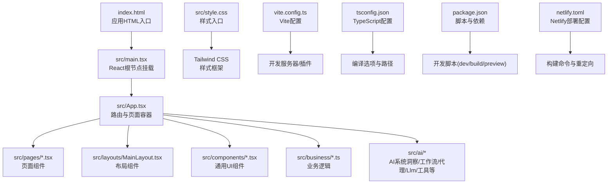
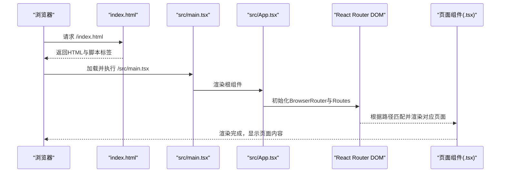
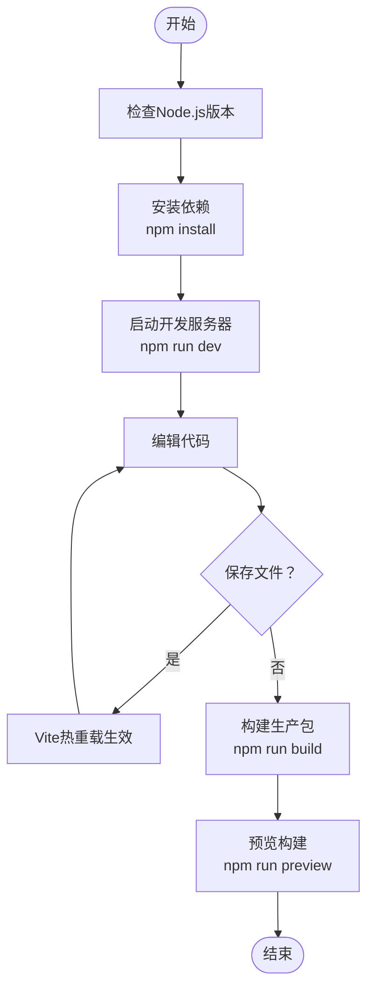
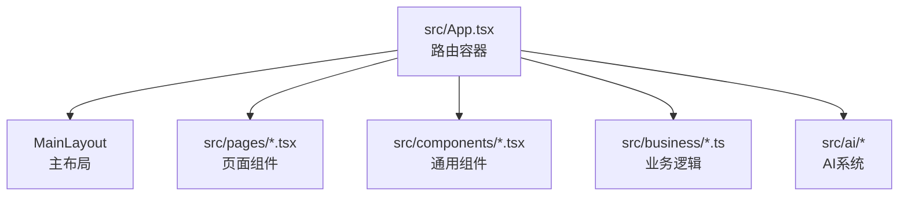
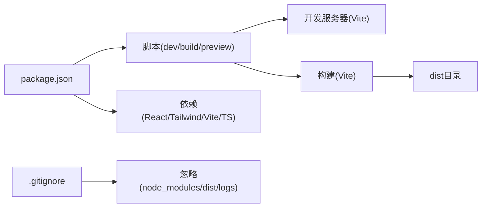

# 快速开始

<cite>
**本文引用的文件**
- [package.json](file://package.json)
- [vite.config.ts](file://vite.config.ts)
- [tsconfig.json](file://tsconfig.json)
- [index.html](file://index.html)
- [src/main.tsx](file://src/main.tsx)
- [src/App.tsx](file://src/App.tsx)
- [src/style.css](file://src/style.css)
- [netlify.toml](file://netlify.toml)
- [.gitignore](file://.gitignore)
- [docs/ai-insight-design.md](file://docs/ai-insight-design.md)
- [docs/current-demo-version.md](file://docs/current-demo-version.md)
- [AGENTS.md](file://AGENTS.md)
- [CLAUDE.md](file://CLAUDE.md)
</cite>

## 目录
1. [简介](#简介)
2. [项目结构](#项目结构)
3. [核心组件](#核心组件)
4. [架构总览](#架构总览)
5. [详细组件分析](#详细组件分析)
6. [依赖关系分析](#依赖关系分析)
7. [性能注意事项](#性能注意事项)
8. [故障排除指南](#故障排除指南)
9. [结论](#结论)
10. [附录](#附录)

## 简介
本指南面向新开发者，帮助你从零开始搭建并运行小天AI教育平台前端项目。你将获得：
- 开发环境准备（Node.js版本、包管理器、依赖安装）
- 项目启动与开发服务器配置
- 基本项目结构与文件组织
- 首次运行常见问题与解决方案
- 热重载、TypeScript编译与Vite构建的基础使用
- 从安装到成功运行的完整流程

## 项目结构
该项目采用React + TypeScript + Vite的现代前端架构，配合Tailwind CSS进行样式管理，并通过Netlify进行部署配置。核心入口与路由定义如下：
- HTML入口：index.html
- 应用入口：src/main.tsx
- 路由与页面：src/App.tsx
- 样式入口：src/style.css
- 构建与开发工具：package.json、vite.config.ts、tsconfig.json
- 部署配置：netlify.toml
- 忽略规则：.gitignore

**图表来源**
- [index.html:1-14](file://index.html#L1-L14)
- [src/main.tsx:1-11](file://src/main.tsx#L1-L11)
- [src/App.tsx:1-64](file://src/App.tsx#L1-L64)
- [src/style.css:1-2](file://src/style.css#L1-L2)
- [vite.config.ts:1-12](file://vite.config.ts#L1-L12)
- [tsconfig.json:1-25](file://tsconfig.json#L1-L25)
- [package.json:1-31](file://package.json#L1-L31)
- [netlify.toml:1-9](file://netlify.toml#L1-L9)

**章节来源**
- [package.json:1-31](file://package.json#L1-L31)
- [vite.config.ts:1-12](file://vite.config.ts#L1-L12)
- [tsconfig.json:1-25](file://tsconfig.json#L1-L25)
- [index.html:1-14](file://index.html#L1-L14)
- [src/main.tsx:1-11](file://src/main.tsx#L1-L11)
- [src/App.tsx:1-64](file://src/App.tsx#L1-L64)
- [src/style.css:1-2](file://src/style.css#L1-L2)
- [netlify.toml:1-9](file://netlify.toml#L1-L9)
- [.gitignore:1-25](file://.gitignore#L1-L25)

## 核心组件
- 应用入口与挂载
  - HTML入口负责创建挂载点并加载应用入口脚本。
  - React根节点在main.tsx中创建并渲染App组件。
- 路由与页面
  - App.tsx集中定义25条路由，覆盖首页、练习报告、错题/错词本、写作/听力、资源库、AI搜索、布置练习等。
- 样式与主题
  - style.css引入Tailwind CSS，提供原子化样式能力。
- 构建与开发
  - package.json提供开发、构建、预览脚本；vite.config.ts启用React与Tailwind插件并配置开发服务器；tsconfig.json设置TypeScript编译目标与模块解析策略。

**章节来源**
- [index.html:1-14](file://index.html#L1-L14)
- [src/main.tsx:1-11](file://src/main.tsx#L1-L11)
- [src/App.tsx:1-64](file://src/App.tsx#L1-L64)
- [src/style.css:1-2](file://src/style.css#L1-L2)
- [package.json:6-10](file://package.json#L6-L10)
- [vite.config.ts:1-12](file://vite.config.ts#L1-L12)
- [tsconfig.json:1-25](file://tsconfig.json#L1-L25)

## 架构总览
下面的序列图展示了从浏览器访问到页面渲染的关键流程：

**图表来源**
- [index.html:1-14](file://index.html#L1-L14)
- [src/main.tsx:1-11](file://src/main.tsx#L1-L11)
- [src/App.tsx:1-64](file://src/App.tsx#L1-L64)

## 详细组件分析

### 开发环境与工具链
- Node.js与包管理器
  - 使用NPM作为包管理器，安装依赖后即可启动开发服务器。
- TypeScript配置
  - 目标与模块：ES2023与ESNext，启用bundler模式与模块检测。
  - JSX：使用react-jsx，类型检查严格。
  - 无emit：仅编译不输出JS文件（由Vite打包）。
- Vite配置
  - 插件：@vitejs/plugin-react、@tailwindcss/vite。
  - 开发服务器：host绑定为0.0.0.0，允许特定域名访问。
- 构建脚本
  - dev：启动Vite开发服务器。
  - build：先执行TypeScript编译，再执行Vite构建。
  - preview：预览生产构建产物。

**图表来源**
- [package.json:6-10](file://package.json#L6-L10)
- [vite.config.ts:1-12](file://vite.config.ts#L1-L12)
- [tsconfig.json:1-25](file://tsconfig.json#L1-L25)

**章节来源**
- [package.json:6-10](file://package.json#L6-L10)
- [vite.config.ts:1-12](file://vite.config.ts#L1-L12)
- [tsconfig.json:1-25](file://tsconfig.json#L1-L25)

### 项目启动与开发服务器
- 启动开发服务器
  - 在项目根目录执行开发脚本，Vite将启动本地开发服务器并启用热重载。
- 开发服务器配置
  - host设置为0.0.0.0，便于网络共享与远程调试。
  - allowedHosts包含特定域名，确保开发环境的安全访问。
- 热重载机制
  - 保存TSX/TS/CSS等文件后，Vite自动刷新浏览器，无需手动重启。

**章节来源**
- [package.json:6-10](file://package.json#L6-L10)
- [vite.config.ts:7-11](file://vite.config.ts#L7-L11)

### 路由与页面组织
- 路由入口
  - App.tsx集中定义BrowserRouter与Routes，包含25条路由。
- 页面分类
  - 主布局路由（带侧边栏）：首页、练习报告、错题/错词本、写作/听力、资源库、AI搜索、布置练习等。
  - 沉浸式路由（无侧边栏）：词汇PK、各类布置页面、单词教学等。
- 页面组件
  - 页面组件位于src/pages目录，采用扁平结构，便于维护与查找。

**图表来源**
- [src/App.tsx:1-64](file://src/App.tsx#L1-L64)
- [AGENTS.md:23-87](file://AGENTS.md#L23-L87)

**章节来源**
- [src/App.tsx:1-64](file://src/App.tsx#L1-L64)
- [AGENTS.md:47-82](file://AGENTS.md#L47-L82)

### 样式与主题
- 样式入口
  - style.css通过@import引入Tailwind CSS，提供原子化样式能力。
- 主题与UI
  - 项目遵循“克制、清晰”的UI风格，使用品牌蓝与有限的颜色体系，避免过多视觉噪音。

**章节来源**
- [src/style.css:1-2](file://src/style.css#L1-L2)
- [AGENTS.md:150-167](file://AGENTS.md#L150-L167)

### 部署与构建
- 构建命令
  - build脚本先执行TypeScript编译，再执行Vite构建，输出dist目录。
- 预览
  - preview脚本用于本地预览生产构建产物。
- Netlify部署
  - netlify.toml定义构建命令与重定向规则，确保SPA路由兼容。

**章节来源**
- [package.json:6-10](file://package.json#L6-L10)
- [netlify.toml:1-9](file://netlify.toml#L1-L9)

## 依赖关系分析
- 依赖与脚本
  - package.json定义了开发脚本与依赖，包括React、React Router DOM、Tailwind CSS、Vite、TypeScript等。
- 构建与运行
  - 开发：npm run dev
  - 构建：npm run build（TypeScript编译 + Vite构建）
  - 预览：npm run preview
- 忽略文件
  - .gitignore忽略node_modules、dist、日志与IDE临时文件，避免污染仓库。

**图表来源**
- [package.json:1-31](file://package.json#L1-L31)
- [.gitignore:1-25](file://.gitignore#L1-L25)

**章节来源**
- [package.json:1-31](file://package.json#L1-L31)
- [.gitignore:1-25](file://.gitignore#L1-L25)

## 性能注意事项
- 热重载与增量编译
  - Vite提供极快的冷启动与热重载，开发体验流畅。
- TypeScript编译
  - tsconfig.json启用严格模式与模块检测，有助于早期发现问题。
- 构建优化
  - 生产构建由Vite完成，建议在CI中开启缓存与并行构建以提升效率。

[本节为通用指导，无需特定文件来源]

## 故障排除指南
- 安装依赖失败
  - 确认网络可访问npm镜像，必要时切换为国内镜像源。
  - 清理缓存后重试：npm ci 或 删除node_modules与lockfile后重新安装。
- 启动开发服务器报端口占用
  - 修改vite.config.ts中的server.port或释放占用端口。
- 热重载不生效
  - 检查文件保存是否触发Vite监听；确认未被.gitignore忽略。
- 构建失败
  - 查看TypeScript编译错误；确保所有类型检查通过后再执行构建。
- 预览页面空白
  - 确认dist目录存在且包含构建产物；检查netlify.toml重定向配置。

**章节来源**
- [vite.config.ts:7-11](file://vite.config.ts#L7-L11)
- [package.json:6-10](file://package.json#L6-L10)
- [netlify.toml:1-9](file://netlify.toml#L1-L9)

## 结论
通过本指南，你可以完成小天AI教育平台的开发环境搭建、项目启动与日常开发流程。建议在开发过程中：
- 保持TypeScript编译通过
- 利用Vite热重载提升迭代效率
- 遵循项目既定的路由与页面组织方式
- 使用自检套件保障核心流程稳定

[本节为总结，无需特定文件来源]

## 附录

### 从零到运行的完整流程
- 环境准备
  - 安装Node.js与NPM（版本满足项目要求）。
- 获取代码
  - 克隆仓库至本地。
- 安装依赖
  - 在项目根目录执行安装命令。
- 启动开发服务器
  - 执行开发脚本，打开浏览器访问本地地址。
- 首次运行验证
  - 访问首页与AI搜索页，确认页面渲染与路由跳转正常。
- 常用命令
  - 开发：npm run dev
  - 构建：npm run build
  - 预览：npm run preview

**章节来源**
- [package.json:6-10](file://package.json#L6-L10)
- [src/App.tsx:1-64](file://src/App.tsx#L1-L64)

### 项目背景与演示说明
- 当前版本定位
  - 交互原型（mock），适合内部演示与评审。
- 已完成能力
  - 首页、AI搜索、洞察（V1）、推荐动作闭环、快捷操作统一等。
- 演示路径
  - 首页快捷操作、自然语言搜索、洞察查看分析、洞察动作到布置的完整链路等。
- 已知限制
  - 样式未完全对齐、数据为mock、部分地区规则待完善等。

**章节来源**
- [docs/current-demo-version.md:1-251](file://docs/current-demo-version.md#L1-L251)
- [docs/ai-insight-design.md:1-622](file://docs/ai-insight-design.md#L1-L622)
- [AGENTS.md:1-228](file://AGENTS.md#L1-L228)
- [CLAUDE.md:1-244](file://CLAUDE.md#L1-L244)