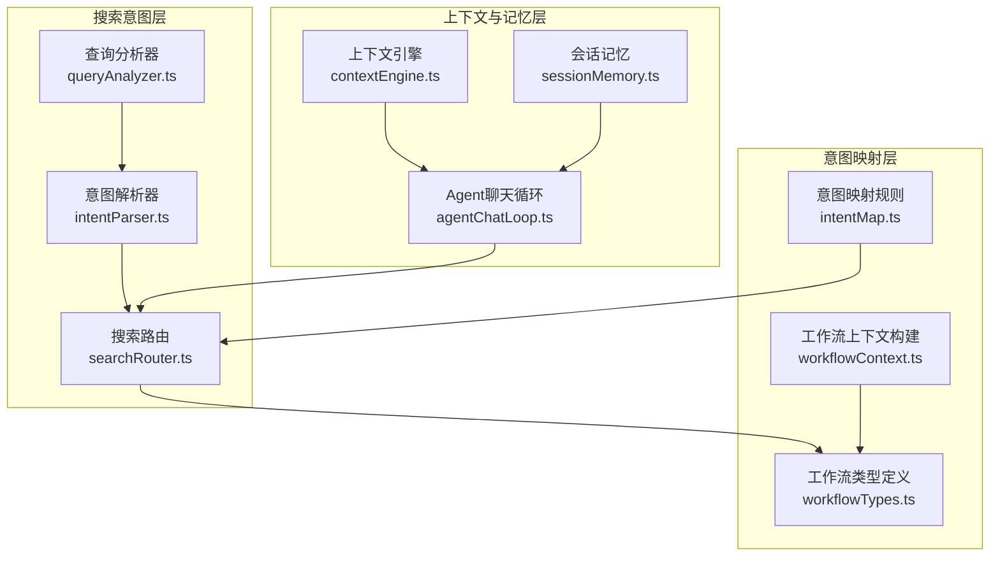
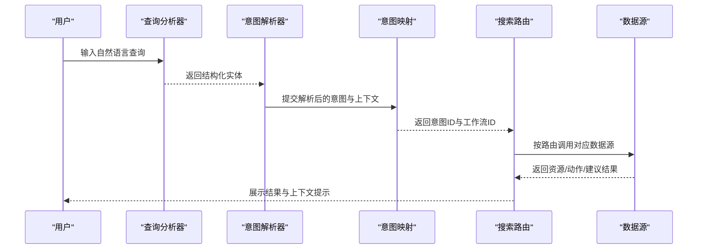
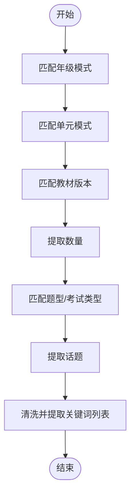
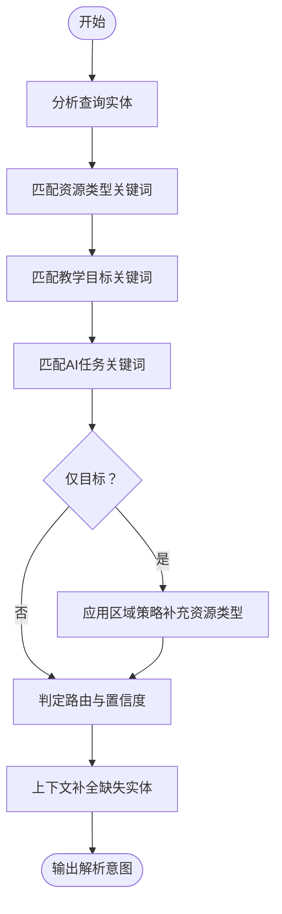
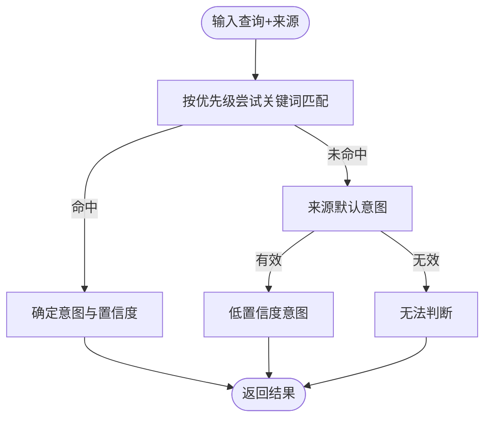
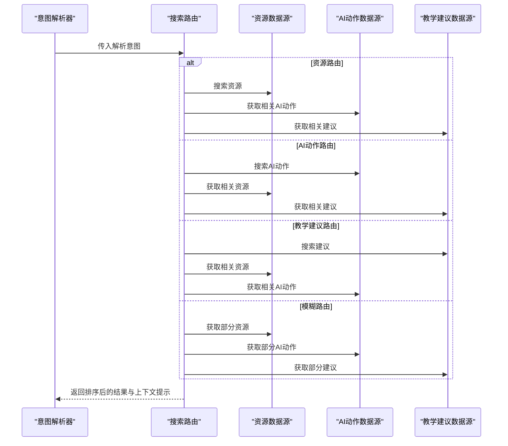
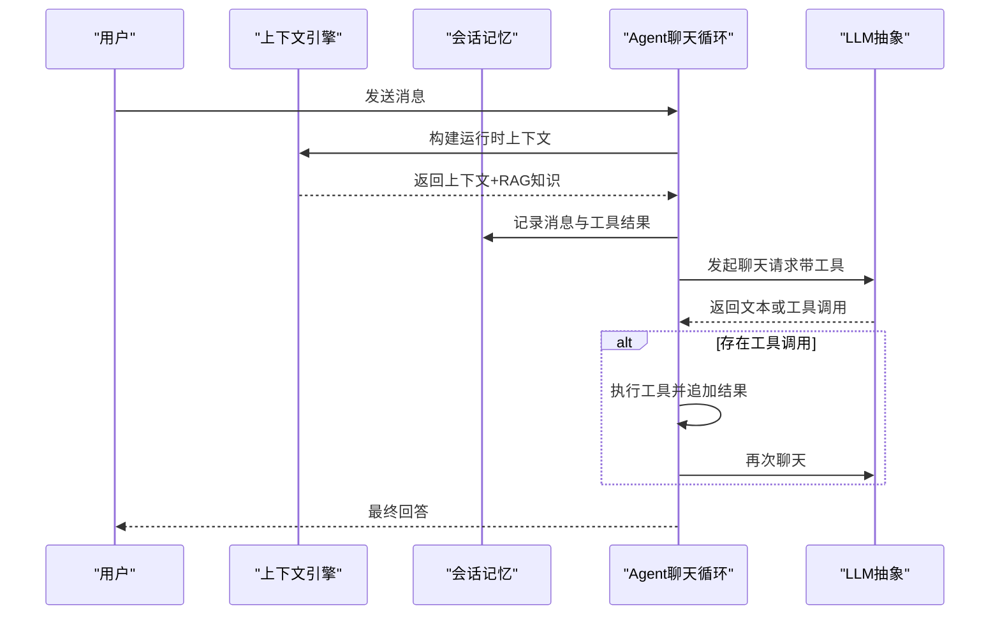
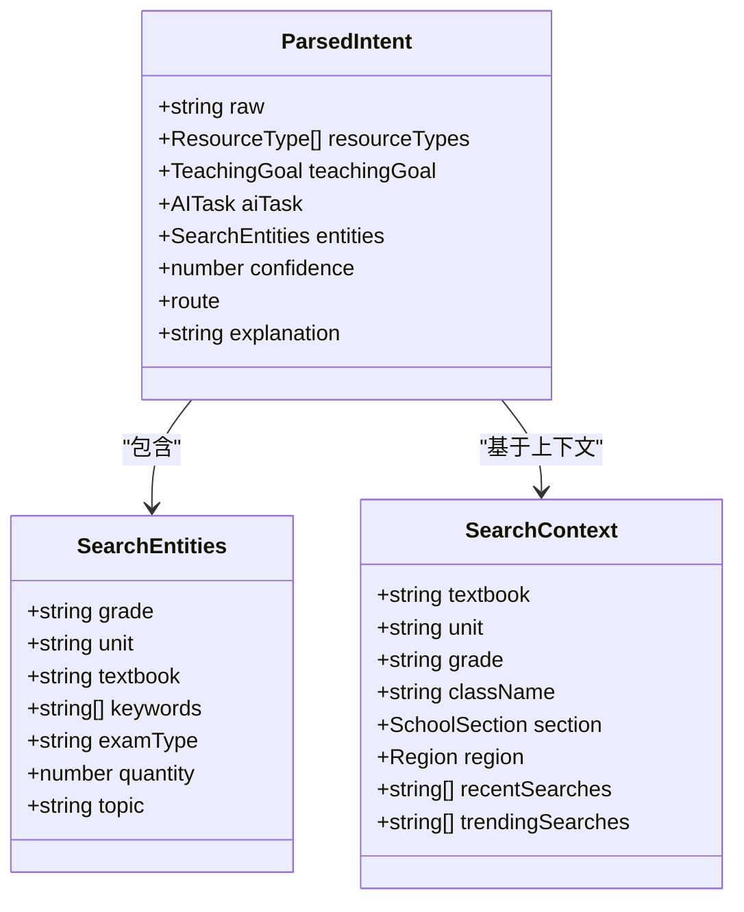
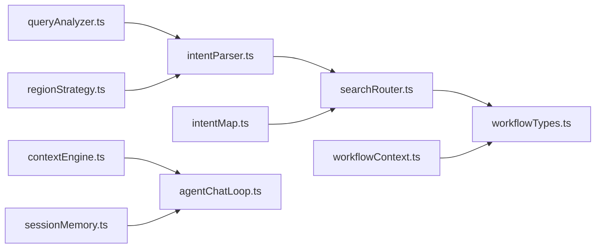

# 意图识别系统

<cite>
**本文引用的文件**
- [intentParser.ts](file://src/ai/search/intentParser.ts)
- [queryAnalyzer.ts](file://src/ai/search/queryAnalyzer.ts)
- [intentMap.ts](file://src/ai/router/intentMap.ts)
- [searchRouter.ts](file://src/ai/search/searchRouter.ts)
- [types.ts](file://src/ai/search/types.ts)
- [regionStrategy.ts](file://src/ai/search/regionStrategy.ts)
- [searchContext.ts](file://src/ai/search/searchContext.ts)
- [contextEngine.ts](file://src/ai/context/contextEngine.ts)
- [sessionMemory.ts](file://src/ai/memory/sessionMemory.ts)
- [agentChatLoop.ts](file://src/ai/agent/agentChatLoop.ts)
- [recommendationEngine.ts](file://src/ai/search/recommendationEngine.ts)
- [intentRoutingSelfCheck.ts](file://src/ai/tests/intentRoutingSelfCheck.ts)
- [workflowTypes.ts](file://src/ai/workflows/workflowTypes.ts)
- [workflowContext.ts](file://src/ai/workflows/workflowContext.ts)
</cite>

## 目录
1. [简介](#简介)
2. [项目结构](#项目结构)
3. [核心组件](#核心组件)
4. [架构总览](#架构总览)
5. [详细组件分析](#详细组件分析)
6. [依赖关系分析](#依赖关系分析)
7. [性能考量](#性能考量)
8. [故障排查指南](#故障排查指南)
9. [结论](#结论)
10. [附录](#附录)

## 简介
本文件面向小天AI教育平台的“意图识别系统”，系统性阐述以下能力与实现：
- 意图解析器：自然语言理解、意图分类与参数提取机制
- 查询分析器：语义实体抽取（年级、单元、教材、数量、题型、话题等）、关键词提取与上下文补全
- 意图映射系统：统一路由规则、来源增强与动态决策
- 多轮对话上下文：会话记忆、RAG知识注入与状态管理
- 准确率优化与错误处理：置信度策略、模糊场景兜底、规则优先级与回退
- 新意图扩展与既有意图演进：规则与数据结构扩展方法

## 项目结构
围绕“意图识别”主线，系统由三层协作构成：
- 表层：搜索意图解析与路由（queryAnalyzer + intentParser + searchRouter）
- 中层：统一意图映射与工作流对接（intentMap + workflow）
- 深层：上下文与记忆（contextEngine + sessionMemory + agentChatLoop）

图表来源
- [intentParser.ts:1-143](file://src/ai/search/intentParser.ts#L1-L143)
- [queryAnalyzer.ts:1-170](file://src/ai/search/queryAnalyzer.ts#L1-L170)
- [searchRouter.ts:1-72](file://src/ai/search/searchRouter.ts#L1-L72)
- [intentMap.ts:1-302](file://src/ai/router/intentMap.ts#L1-L302)
- [workflowTypes.ts:1-140](file://src/ai/workflows/workflowTypes.ts#L1-L140)
- [workflowContext.ts:1-43](file://src/ai/workflows/workflowContext.ts#L1-L43)
- [contextEngine.ts:1-189](file://src/ai/context/contextEngine.ts#L1-L189)
- [sessionMemory.ts:1-115](file://src/ai/memory/sessionMemory.ts#L1-L115)
- [agentChatLoop.ts:1-201](file://src/ai/agent/agentChatLoop.ts#L1-L201)

章节来源
- [intentParser.ts:1-143](file://src/ai/search/intentParser.ts#L1-L143)
- [queryAnalyzer.ts:1-170](file://src/ai/search/queryAnalyzer.ts#L1-L170)
- [intentMap.ts:1-302](file://src/ai/router/intentMap.ts#L1-L302)
- [searchRouter.ts:1-72](file://src/ai/search/searchRouter.ts#L1-L72)
- [workflowTypes.ts:1-140](file://src/ai/workflows/workflowTypes.ts#L1-L140)
- [workflowContext.ts:1-43](file://src/ai/workflows/workflowContext.ts#L1-L43)
- [contextEngine.ts:1-189](file://src/ai/context/contextEngine.ts#L1-L189)
- [sessionMemory.ts:1-115](file://src/ai/memory/sessionMemory.ts#L1-L115)
- [agentChatLoop.ts:1-201](file://src/ai/agent/agentChatLoop.ts#L1-L201)

## 核心组件
- 查询分析器（queryAnalyzer）：从原始查询中抽取结构化实体，包括年级、单元、教材、数量、题型、话题与关键词列表；并对常见表达进行规范化处理。
- 意图解析器（intentParser）：基于关键词匹配与区域策略，判定资源搜索、AI动作或教学建议等路由，并计算置信度与解释说明；同时从上下文补全缺失实体。
- 意图映射（intentMap）：统一的意图规则集，支持来源增强（sourceBoost）、优先级排序与模糊场景兜底，输出工作流ID与置信度。
- 搜索路由（searchRouter）：根据解析后的意图路由，调用不同数据源并进行上下文排序与提示说明。
- 上下文与记忆（contextEngine + sessionMemory + agentChatLoop）：构建运行时上下文、持久化会话消息、支持RAG知识检索与多轮工具调用。

章节来源
- [queryAnalyzer.ts:68-170](file://src/ai/search/queryAnalyzer.ts#L68-L170)
- [intentParser.ts:62-143](file://src/ai/search/intentParser.ts#L62-L143)
- [intentMap.ts:213-279](file://src/ai/router/intentMap.ts#L213-L279)
- [searchRouter.ts:7-72](file://src/ai/search/searchRouter.ts#L7-L72)
- [contextEngine.ts:37-189](file://src/ai/context/contextEngine.ts#L37-L189)
- [sessionMemory.ts:18-115](file://src/ai/memory/sessionMemory.ts#L18-L115)
- [agentChatLoop.ts:70-201](file://src/ai/agent/agentChatLoop.ts#L70-L201)

## 架构总览
意图识别系统采用“规则驱动 + 数据源路由”的双轨设计：
- 规则驱动：通过关键词正则与优先级，快速确定意图类别与工作流映射。
- 数据源路由：根据意图路由选择资源、AI动作或教学建议的数据源，并进行上下文排序与提示。

图表来源
- [queryAnalyzer.ts:72-170](file://src/ai/search/queryAnalyzer.ts#L72-L170)
- [intentParser.ts:69-142](file://src/ai/search/intentParser.ts#L69-L142)
- [intentMap.ts:219-272](file://src/ai/router/intentMap.ts#L219-L272)
- [searchRouter.ts:14-71](file://src/ai/search/searchRouter.ts#L14-L71)

## 详细组件分析

### 查询分析器（queryAnalyzer）
职责与流程：
- 识别并规范化“年级”（如“八上”→“八年级上”）、“单元”（Unit 3/第二单元/U3）、“教材版本”（人教版/外研版等）
- 提取“数量”（若干个/道/篇/套/份/张）、“题型/考试类型”（中考/高考/模拟考/期中期末等）、“话题”（环保/节日/食物/动物/运动/旅行/科技/健康）
- 基于未匹配模式提取“关键词列表”，用于后续意图判定与排序
- 对常见表达进行正则替换与归一化，提升鲁棒性

图表来源
- [queryAnalyzer.ts:72-168](file://src/ai/search/queryAnalyzer.ts#L72-L168)

章节来源
- [queryAnalyzer.ts:68-170](file://src/ai/search/queryAnalyzer.ts#L68-L170)

### 意图解析器（intentParser）
职责与流程：
- 调用查询分析器抽取实体
- 基于关键词表匹配“资源类型”“教学目标”“AI任务”
- 若仅存在教学目标，结合区域策略补充优先资源类型
- 根据匹配结果决定路由（资源搜索/AI动作/教学建议/模糊）
- 计算置信度与解释说明，自动填充缺失实体（来自上下文）

图表来源
- [intentParser.ts:69-142](file://src/ai/search/intentParser.ts#L69-L142)
- [regionStrategy.ts:60-71](file://src/ai/search/regionStrategy.ts#L60-L71)

章节来源
- [intentParser.ts:62-143](file://src/ai/search/intentParser.ts#L62-L143)
- [regionStrategy.ts:1-99](file://src/ai/search/regionStrategy.ts#L1-L99)

### 意图映射系统（intentMap）
职责与流程：
- 维护意图规则集（正则关键词、优先级、来源增强、标签）
- 显式关键词匹配优先，其次依据来源默认意图，最后“无法判断”
- 输出意图ID、工作流ID、置信度与匹配关键词
- 提供工具函数：判断是否工作流查询、获取工作流ID、导出全部规则与来源默认

图表来源
- [intentMap.ts:219-272](file://src/ai/router/intentMap.ts#L219-L272)

章节来源
- [intentMap.ts:1-302](file://src/ai/router/intentMap.ts#L1-L302)

### 搜索路由（searchRouter）
职责与流程：
- 根据意图路由调用不同数据源（资源、AI动作、教学建议）
- 对结果按“匹配当前上下文”进行排序
- 生成上下文提示（如“已从查询识别年级”或“已自动应用当前教学上下文”）

图表来源
- [searchRouter.ts:14-71](file://src/ai/search/searchRouter.ts#L14-L71)

章节来源
- [searchRouter.ts:1-72](file://src/ai/search/searchRouter.ts#L1-L72)

### 多轮对话上下文与状态管理
- 上下文引擎：构建运行时上下文，集成RAG检索与会话历史，支持向量化知识注入
- 会话记忆：持久化消息与工具调用结果，支持令牌窗口截断与会话清理
- Agent聊天循环：实现工具调用闭环，支持多轮对话与最终回答生成

图表来源
- [contextEngine.ts:37-189](file://src/ai/context/contextEngine.ts#L37-L189)
- [sessionMemory.ts:18-115](file://src/ai/memory/sessionMemory.ts#L18-L115)
- [agentChatLoop.ts:70-201](file://src/ai/agent/agentChatLoop.ts#L70-L201)

章节来源
- [contextEngine.ts:1-189](file://src/ai/context/contextEngine.ts#L1-L189)
- [sessionMemory.ts:1-115](file://src/ai/memory/sessionMemory.ts#L1-L115)
- [agentChatLoop.ts:1-201](file://src/ai/agent/agentChatLoop.ts#L1-L201)

### 数据模型与类型
- 意图解析结果：包含原始查询、资源类型、教学目标、AI任务、实体、置信度、路由与解释
- 搜索上下文：教材、单元、年级、学段、区域、班级、近期与热门搜索
- 结果类型：资源、AI动作、教学建议，均支持“匹配当前上下文”标记

图表来源
- [types.ts:59-134](file://src/ai/search/types.ts#L59-L134)

章节来源
- [types.ts:1-195](file://src/ai/search/types.ts#L1-L195)

## 依赖关系分析
- 意图解析器依赖查询分析器与区域策略，输出解析意图
- 搜索路由依赖解析意图与上下文，调用不同数据源
- 统一意图映射独立于搜索模块，可直接对接工作流
- 上下文引擎与会话记忆为Agent聊天循环提供运行时支撑

图表来源
- [intentParser.ts:1-143](file://src/ai/search/intentParser.ts#L1-L143)
- [queryAnalyzer.ts:1-170](file://src/ai/search/queryAnalyzer.ts#L1-L170)
- [regionStrategy.ts:1-99](file://src/ai/search/regionStrategy.ts#L1-L99)
- [searchRouter.ts:1-72](file://src/ai/search/searchRouter.ts#L1-L72)
- [intentMap.ts:1-302](file://src/ai/router/intentMap.ts#L1-L302)
- [contextEngine.ts:1-189](file://src/ai/context/contextEngine.ts#L1-L189)
- [sessionMemory.ts:1-115](file://src/ai/memory/sessionMemory.ts#L1-L115)
- [agentChatLoop.ts:1-201](file://src/ai/agent/agentChatLoop.ts#L1-L201)
- [workflowTypes.ts:1-140](file://src/ai/workflows/workflowTypes.ts#L1-L140)
- [workflowContext.ts:1-43](file://src/ai/workflows/workflowContext.ts#L1-L43)

章节来源
- [intentParser.ts:1-143](file://src/ai/search/intentParser.ts#L1-L143)
- [intentMap.ts:1-302](file://src/ai/router/intentMap.ts#L1-L302)
- [searchRouter.ts:1-72](file://src/ai/search/searchRouter.ts#L1-L72)
- [workflowTypes.ts:1-140](file://src/ai/workflows/workflowTypes.ts#L1-L140)

## 性能考量
- 关键词匹配与正则扫描：O(n)级别，适合大规模规则集；建议对常用关键词建立索引或分组缓存
- 置信度计算：基于匹配数量与规则优先级，避免过度复杂逻辑导致延迟
- 数据源路由：按需调用，避免一次性拉取过多结果；可引入并发限制与超时控制
- 上下文与RAG：向量检索可能成为瓶颈，建议预热向量索引、设置最小分数阈值与topK裁剪
- 会话记忆：令牌窗口截断与分页加载，避免单次载入过大

## 故障排查指南
- 模糊输入误判：检查意图映射规则优先级与来源默认，确保“无法判断”兜底生效
- 关键词覆盖问题：确认高优先级规则（如布置作业）不会被低优先级泛关键词覆盖
- 上下文未生效：核对解析意图中的实体补全逻辑与上下文字段一致性
- 置信度异常：调整关键词匹配权重与规则优先级，必要时引入阈值与解释说明
- 自检工具：使用意图路由自检脚本验证规则与来源增强效果

章节来源
- [intentRoutingSelfCheck.ts:1-96](file://src/ai/tests/intentRoutingSelfCheck.ts#L1-L96)
- [intentMap.ts:219-272](file://src/ai/router/intentMap.ts#L219-L272)
- [intentParser.ts:69-142](file://src/ai/search/intentParser.ts#L69-L142)

## 结论
该意图识别系统以“规则+上下文+来源增强”为核心，实现了稳定、可扩展且可自检的意图解析与路由能力。通过清晰的类型定义与模块边界，系统既便于维护，也为未来接入LLM与RAG提供了平滑过渡路径。

## 附录

### 新意图类型的添加与现有意图扩展方法
- 添加新意图（以“意图映射”为例）：
  - 在规则集中新增一条意图规则（包含意图ID、工作流ID、正则关键词、优先级、来源增强）
  - 如需默认来源行为，在来源默认表中配置
  - 导出规则与来源默认以便调试
- 扩展现有意图：
  - 调整正则关键词覆盖更多表达
  - 降低优先级以避免覆盖更高优先级规则
  - 增加来源增强以适配不同入口场景
- 搜索意图扩展：
  - 在解析器关键词表中增加新资源类型/教学目标/AI任务
  - 在区域策略中调整权重与优先资源类型
  - 在搜索路由中扩展数据源调用与排序逻辑

章节来源
- [intentMap.ts:72-186](file://src/ai/router/intentMap.ts#L72-L186)
- [intentMap.ts:190-209](file://src/ai/router/intentMap.ts#L190-L209)
- [intentParser.ts:8-44](file://src/ai/search/intentParser.ts#L8-L44)
- [regionStrategy.ts:3-54](file://src/ai/search/regionStrategy.ts#L3-L54)
- [searchRouter.ts:14-71](file://src/ai/search/searchRouter.ts#L14-L71)