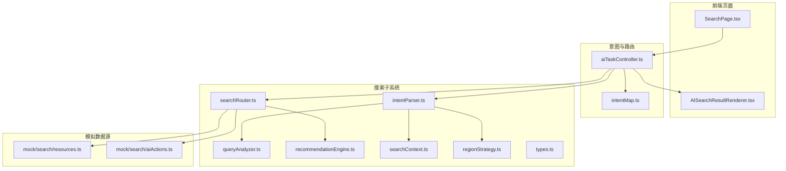
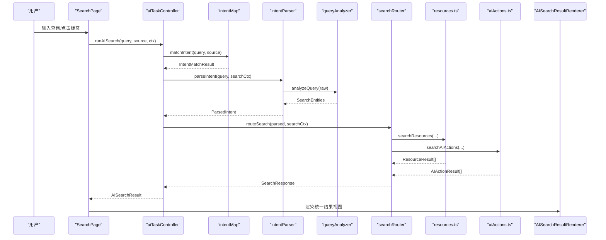
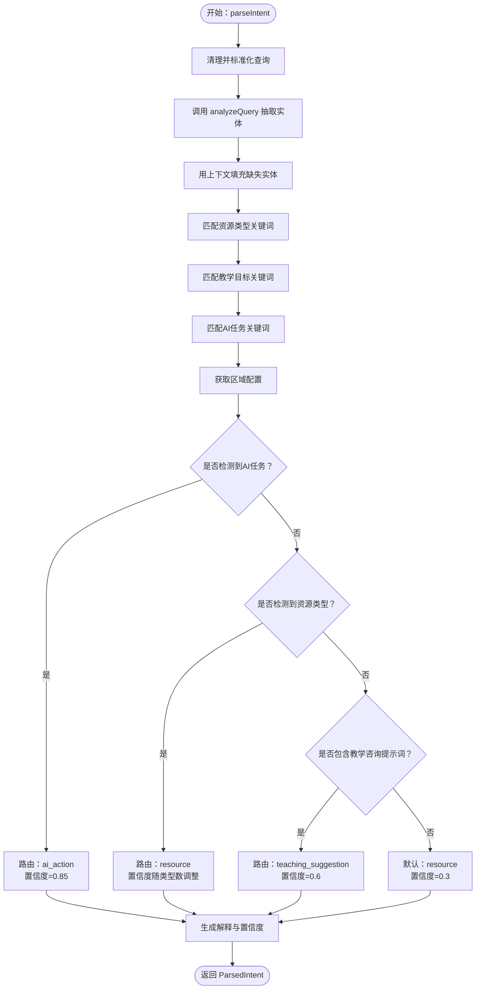
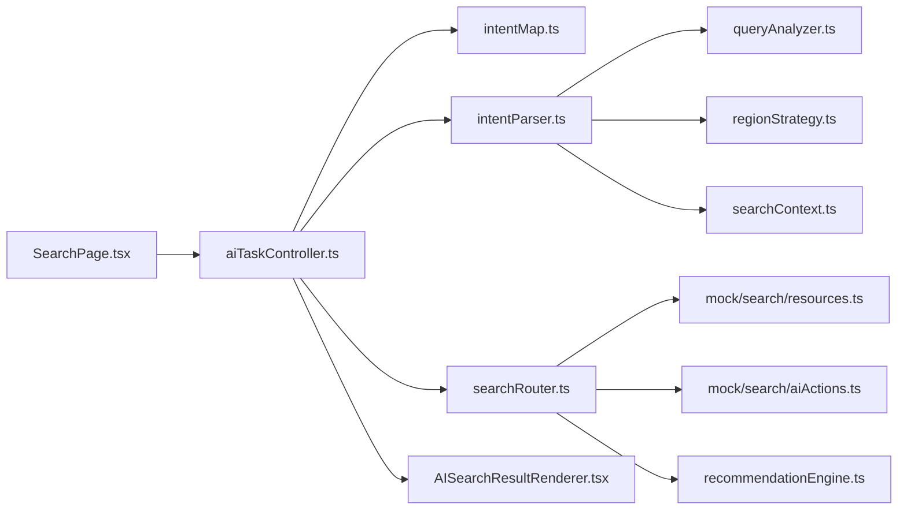
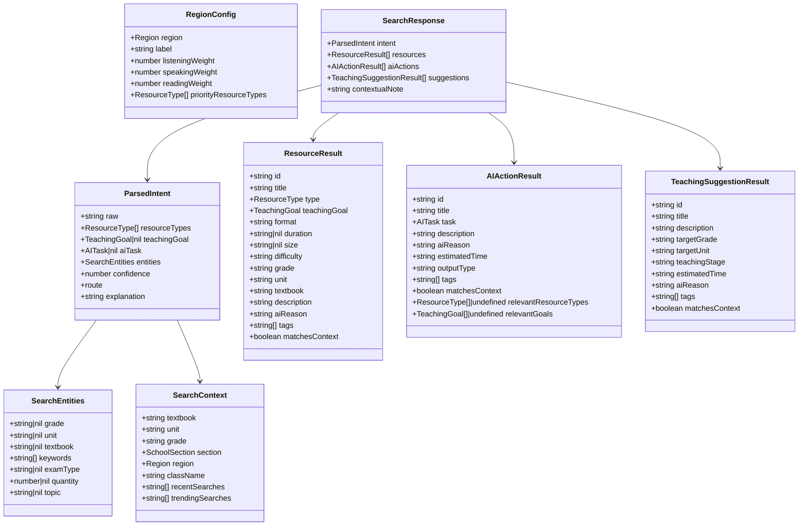

# 搜索和意图识别

<cite>
**本文引用的文件**
- [src/ai/search/index.ts](file://src/ai/search/index.ts)
- [src/ai/search/intentParser.ts](file://src/ai/search/intentParser.ts)
- [src/ai/search/queryAnalyzer.ts](file://src/ai/search/queryAnalyzer.ts)
- [src/ai/search/searchRouter.ts](file://src/ai/search/searchRouter.ts)
- [src/ai/search/recommendationEngine.ts](file://src/ai/search/recommendationEngine.ts)
- [src/ai/search/types.ts](file://src/ai/search/types.ts)
- [src/ai/search/searchContext.ts](file://src/ai/search/searchContext.ts)
- [src/ai/search/regionStrategy.ts](file://src/ai/search/regionStrategy.ts)
- [src/ai/mock/search/resources.ts](file://src/ai/mock/search/resources.ts)
- [src/ai/mock/search/aiActions.ts](file://src/ai/mock/search/aiActions.ts)
- [src/ai/router/intentMap.ts](file://src/ai/router/intentMap.ts)
- [src/ai/controller/aiTaskController.ts](file://src/ai/controller/aiTaskController.ts)
- [src/pages/SearchPage.tsx](file://src/pages/SearchPage.tsx)
- [src/ai/components/AISearchResultRenderer.tsx](file://src/ai/components/AISearchResultRenderer.tsx)
</cite>

## 目录
1. [简介](#简介)
2. [项目结构](#项目结构)
3. [核心组件](#核心组件)
4. [架构总览](#架构总览)
5. [详细组件分析](#详细组件分析)
6. [依赖关系分析](#依赖关系分析)
7. [性能考量](#性能考量)
8. [故障排查指南](#故障排查指南)
9. [结论](#结论)
10. [附录](#附录)

## 简介
本技术文档面向小天AI教育平台的“搜索与意图识别”系统，目标是帮助开发者与产品人员全面理解系统设计与实现，掌握搜索结果排序与相关性评估、意图识别与路由、查询分析与上下文理解、以及结果聚合与渲染的全流程。文档同时提供性能优化建议、扩展与自定义开发指南，确保在现有MVP基础上平滑演进至生产级搜索与意图识别。

## 项目结构
搜索与意图识别相关代码集中在 src/ai/search 与 src/ai/router、src/ai/controller、src/ai/mock 等目录，并通过页面 SearchPage 与统一渲染器 AISearchResultRenderer 进行端到端集成。

**图表来源**
- [src/pages/SearchPage.tsx:16-166](file://src/pages/SearchPage.tsx#L16-L166)
- [src/ai/controller/aiTaskController.ts:78-118](file://src/ai/controller/aiTaskController.ts#L78-L118)
- [src/ai/router/intentMap.ts:219-272](file://src/ai/router/intentMap.ts#L219-L272)
- [src/ai/search/intentParser.ts:69-142](file://src/ai/search/intentParser.ts#L69-L142)
- [src/ai/search/queryAnalyzer.ts:72-169](file://src/ai/search/queryAnalyzer.ts#L72-L169)
- [src/ai/search/searchRouter.ts:14-71](file://src/ai/search/searchRouter.ts#L14-L71)
- [src/ai/search/recommendationEngine.ts:10-54](file://src/ai/search/recommendationEngine.ts#L10-L54)
- [src/ai/search/searchContext.ts:7-76](file://src/ai/search/searchContext.ts#L7-L76)
- [src/ai/search/regionStrategy.ts:60-80](file://src/ai/search/regionStrategy.ts#L60-L80)
- [src/ai/mock/search/resources.ts:57-108](file://src/ai/mock/search/resources.ts#L57-L108)
- [src/ai/mock/search/aiActions.ts:247-303](file://src/ai/mock/search/aiActions.ts#L247-L303)
- [src/ai/components/AISearchResultRenderer.tsx:29-54](file://src/ai/components/AISearchResultRenderer.tsx#L29-L54)

**章节来源**
- [src/ai/search/index.ts:1-20](file://src/ai/search/index.ts#L1-L20)

## 核心组件
- 意图识别与解析：基于关键词匹配与上下文填充，输出结构化意图与路由决策。
- 查询分析器：从自然语言中抽取年级、单元、教材、数量、题型、主题等实体。
- 搜索路由器：根据意图路由到资源、AI动作与教学建议，并进行上下文优先排序。
- 推荐引擎：构建“推荐搜索词”与“相关推荐”，提升发现体验。
- 上下文与区域策略：默认教学上下文、区域权重与优先资源类型。
- 统一控制器与渲染器：页面入口统一调度，渲染器按意图类型呈现结果。

**章节来源**
- [src/ai/search/intentParser.ts:69-142](file://src/ai/search/intentParser.ts#L69-L142)
- [src/ai/search/queryAnalyzer.ts:72-169](file://src/ai/search/queryAnalyzer.ts#L72-L169)
- [src/ai/search/searchRouter.ts:14-71](file://src/ai/search/searchRouter.ts#L14-L71)
- [src/ai/search/recommendationEngine.ts:10-54](file://src/ai/search/recommendationEngine.ts#L10-L54)
- [src/ai/search/searchContext.ts:7-76](file://src/ai/search/searchContext.ts#L7-L76)
- [src/ai/search/regionStrategy.ts:60-80](file://src/ai/search/regionStrategy.ts#L60-L80)
- [src/ai/controller/aiTaskController.ts:78-118](file://src/ai/controller/aiTaskController.ts#L78-L118)
- [src/ai/components/AISearchResultRenderer.tsx:29-54](file://src/ai/components/AISearchResultRenderer.tsx#L29-L54)

## 架构总览
整体流程：页面输入触发统一控制器，先进行意图匹配，再执行搜索路由，最终由渲染器统一呈现。意图识别与解析模块负责抽取实体并决定路由；搜索路由器负责调用模拟数据源并按上下文优先排序；推荐引擎提供上下文感知的推荐与相关推荐。

**图表来源**
- [src/pages/SearchPage.tsx:55-70](file://src/pages/SearchPage.tsx#L55-L70)
- [src/ai/controller/aiTaskController.ts:78-118](file://src/ai/controller/aiTaskController.ts#L78-L118)
- [src/ai/router/intentMap.ts:219-272](file://src/ai/router/intentMap.ts#L219-L272)
- [src/ai/search/intentParser.ts:69-142](file://src/ai/search/intentParser.ts#L69-L142)
- [src/ai/search/queryAnalyzer.ts:72-169](file://src/ai/search/queryAnalyzer.ts#L72-L169)
- [src/ai/search/searchRouter.ts:14-71](file://src/ai/search/searchRouter.ts#L14-L71)
- [src/ai/mock/search/resources.ts:57-108](file://src/ai/mock/search/resources.ts#L57-L108)
- [src/ai/mock/search/aiActions.ts:247-303](file://src/ai/mock/search/aiActions.ts#L247-L303)
- [src/ai/components/AISearchResultRenderer.tsx:29-54](file://src/ai/components/AISearchResultRenderer.tsx#L29-L54)

## 详细组件分析

### 意图识别与解析（intentParser）
- 实体抽取：通过规则匹配从查询中提取年级、单元、教材、数量、题型、主题等实体。
- 资源类型与教学目标：基于关键词映射识别资源类型与教学目标。
- AI任务识别：识别生成、批改、分析、推荐、总结、听写、出题等任务。
- 路由决策：根据是否检测到AI任务、资源类型、教学咨询等，决定路由类型与置信度。
- 区域策略：当仅检测到教学目标时，依据区域配置优先资源类型。

**图表来源**
- [src/ai/search/intentParser.ts:69-142](file://src/ai/search/intentParser.ts#L69-L142)
- [src/ai/search/queryAnalyzer.ts:72-169](file://src/ai/search/queryAnalyzer.ts#L72-L169)
- [src/ai/search/regionStrategy.ts:60-80](file://src/ai/search/regionStrategy.ts#L60-L80)

**章节来源**
- [src/ai/search/intentParser.ts:69-142](file://src/ai/search/intentParser.ts#L69-L142)
- [src/ai/search/queryAnalyzer.ts:72-169](file://src/ai/search/queryAnalyzer.ts#L72-L169)
- [src/ai/search/regionStrategy.ts:60-80](file://src/ai/search/regionStrategy.ts#L60-L80)

### 查询分析器（queryAnalyzer）
- 年级：支持“七上/八上/九上/高一/中考/高考”等模式识别与规范化。
- 单元：支持“Unit 3”、“第X单元”、“U3”等模式识别与规范化。
- 教材：识别“人教版/外研版/牛津版/北师大版/冀教版/仁爱版”。
- 数量：识别“N个/N道/N篇/N套/N份/N张”。
- 考试类型：识别“中考/高考/模拟考/期中/期末/月考/一模/二模”。
- 主题：识别“环保/节日/食物/动物/运动/旅行/科技/健康”等主题。
- 关键词：移除上述模式后，剩余文本切分为关键词数组。

**章节来源**
- [src/ai/search/queryAnalyzer.ts:72-169](file://src/ai/search/queryAnalyzer.ts#L72-L169)

### 搜索路由器（searchRouter）
- 路由策略：根据意图路由类型，分别调用资源、AI动作、教学建议的模拟数据源。
- 结果聚合：按“匹配当前教学上下文”的布尔值进行降序排序，优先显示匹配结果。
- 上下文说明：根据查询是否改变年级等，生成上下文说明文案。

**章节来源**
- [src/ai/search/searchRouter.ts:14-71](file://src/ai/search/searchRouter.ts#L14-L71)

### 推荐引擎（recommendationEngine）
- 推荐搜索词：结合当前教学上下文与热门搜索，生成推荐搜索词列表。
- 相关推荐：以某条资源为种子，构造轻量意图并调用资源搜索，过滤自身后返回相似资源。

**章节来源**
- [src/ai/search/recommendationEngine.ts:10-54](file://src/ai/search/recommendationEngine.ts#L10-L54)

### 上下文与区域策略（searchContext、regionStrategy）
- 默认上下文：提供默认教材、单元、年级、班级、近期与热门搜索等。
- 区域配置：不同地区对听力、口语、阅读的权重不同，优先资源类型也不同。
- 推理函数：从年级字符串推理学段，从提示词推理区域。

**章节来源**
- [src/ai/search/searchContext.ts:7-76](file://src/ai/search/searchContext.ts#L7-L76)
- [src/ai/search/regionStrategy.ts:60-80](file://src/ai/search/regionStrategy.ts#L60-L80)

### 搜索与排序（mock/resources）
- 评分维度：资源类型匹配、教学目标匹配、年级匹配、单元匹配、教材匹配、标题/描述关键词匹配、主题匹配、上下文匹配。
- 过滤与排序：过滤低分结果，按分数降序取前若干条。

**章节来源**
- [src/ai/mock/search/resources.ts:57-108](file://src/ai/mock/search/resources.ts#L57-L108)

### AI动作排序（mock/aiActions）
- 评分维度：任务类型精确匹配、资源类型相关性、教学目标相关性、上下文关键词匹配、单词搜索特殊处理。
- 过滤策略：对特定资源类型的搜索，过滤掉明显无关的动作。

**章节来源**
- [src/ai/mock/search/aiActions.ts:247-303](file://src/ai/mock/search/aiActions.ts#L247-L303)

### 统一控制器与渲染器（aiTaskController、AISearchResultRenderer）
- 控制器：统一入口，先进行意图匹配，再执行搜索，必要时运行工作流，始终保证 searchResponse 可用。
- 渲染器：根据 AISearchResult 的 resultType 与 searchResponse，统一渲染资源、AI动作与教学建议，并提供操作按钮。

**章节来源**
- [src/ai/controller/aiTaskController.ts:78-118](file://src/ai/controller/aiTaskController.ts#L78-L118)
- [src/ai/components/AISearchResultRenderer.tsx:29-54](file://src/ai/components/AISearchResultRenderer.tsx#L29-L54)

## 依赖关系分析
- 页面层：SearchPage 依赖 aiTaskController，通过 runAISearch 获取统一结果。
- 控制器层：aiTaskController 依赖 intentMap、intentParser、searchRouter，并可选运行工作流。
- 解析层：intentParser 依赖 queryAnalyzer、regionStrategy、searchContext。
- 路由层：searchRouter 依赖 mock 数据源（resources、aiActions、suggestions）。
- 渲染层：AISearchResultRenderer 依赖统一结果结构，按意图类型渲染。

**图表来源**
- [src/pages/SearchPage.tsx:55-70](file://src/pages/SearchPage.tsx#L55-L70)
- [src/ai/controller/aiTaskController.ts:78-118](file://src/ai/controller/aiTaskController.ts#L78-L118)
- [src/ai/router/intentMap.ts:219-272](file://src/ai/router/intentMap.ts#L219-L272)
- [src/ai/search/intentParser.ts:69-142](file://src/ai/search/intentParser.ts#L69-L142)
- [src/ai/search/queryAnalyzer.ts:72-169](file://src/ai/search/queryAnalyzer.ts#L72-L169)
- [src/ai/search/searchRouter.ts:14-71](file://src/ai/search/searchRouter.ts#L14-L71)
- [src/ai/search/recommendationEngine.ts:10-54](file://src/ai/search/recommendationEngine.ts#L10-L54)
- [src/ai/search/searchContext.ts:7-76](file://src/ai/search/searchContext.ts#L7-L76)
- [src/ai/search/regionStrategy.ts:60-80](file://src/ai/search/regionStrategy.ts#L60-L80)
- [src/ai/mock/search/resources.ts:57-108](file://src/ai/mock/search/resources.ts#L57-L108)
- [src/ai/mock/search/aiActions.ts:247-303](file://src/ai/mock/search/aiActions.ts#L247-L303)
- [src/ai/components/AISearchResultRenderer.tsx:29-54](file://src/ai/components/AISearchResultRenderer.tsx#L29-L54)

## 性能考量
- 模块内优化
  - 关键词匹配与正则：保持规则简洁，避免回溯风暴；对高频规则采用预处理与缓存。
  - 排序与过滤：在 mock 数据规模可控的前提下，尽量减少重复计算；对资源与AI动作分别评分后合并时，注意避免二次排序。
  - 上下文优先：排序逻辑简单稳定，建议在数据量增大时引入索引字段（如 matchesContext）以加速。
- 端到端优化
  - 避免重复执行：SearchPage 已内置防抖与去重标记，确保严格模式下不重复触发。
  - 渲染优化：AISearchResultRenderer 对不同意图类型采用条件渲染，减少不必要的DOM节点。
- 生产迁移建议
  - 使用向量化检索与倒排索引替代线性扫描，显著提升大规模资源检索性能。
  - 引入缓存层（LRU/Redis）缓存热门查询与结果，降低重复请求成本。
  - 对意图识别与查询分析引入LLM，逐步替换硬编码规则，提升泛化能力。

[本节为通用性能建议，无需特定文件引用]

## 故障排查指南
- 意图识别不准确
  - 检查关键词映射是否覆盖用户常用表达；必要时扩展 queryAnalyzer 的正则规则。
  - 提升区域策略权重与优先资源类型配置，确保符合实际教学场景。
- 资源排序不符合预期
  - 核对资源评分维度与权重，确保 matchesContext 字段正确更新。
  - 检查 queryAnalyzer 是否正确抽取实体，进而影响评分。
- 路由错误或返回为空
  - 确认 searchRouter 的路由分支与 mock 数据源是否匹配。
  - 若出现“无法判断”，检查 intentMap 的规则优先级与 sourceBoost 设置。
- 渲染异常
  - 确保 AISearchResultRenderer 接收的 searchResponse 结构完整。
  - 检查资源与AI动作的标签、描述字段是否为空，避免渲染崩溃。

**章节来源**
- [src/ai/search/intentParser.ts:69-142](file://src/ai/search/intentParser.ts#L69-L142)
- [src/ai/search/queryAnalyzer.ts:72-169](file://src/ai/search/queryAnalyzer.ts#L72-L169)
- [src/ai/search/searchRouter.ts:14-71](file://src/ai/search/searchRouter.ts#L14-L71)
- [src/ai/router/intentMap.ts:219-272](file://src/ai/router/intentMap.ts#L219-L272)
- [src/ai/components/AISearchResultRenderer.tsx:29-54](file://src/ai/components/AISearchResultRenderer.tsx#L29-L54)

## 结论
小天AI教育平台的搜索与意图识别系统以“规则+上下文+区域策略”为基础，在MVP阶段实现了稳定的意图识别、查询分析与结果聚合。通过统一控制器与渲染器，系统在页面与工作流之间保持一致的用户体验。未来可在LLM增强、向量化检索、缓存与索引等方面持续演进，以支撑更大规模与更复杂场景的搜索需求。

[本节为总结性内容，无需特定文件引用]

## 附录

### 数据模型概览

**图表来源**
- [src/ai/search/types.ts:59-194](file://src/ai/search/types.ts#L59-L194)

### 开发与扩展指南
- 自定义关键词映射
  - 在 intentParser 的关键词映射表中添加新的领域表达，确保覆盖多地区、多学段常用说法。
- 扩展查询分析规则
  - 在 queryAnalyzer 中新增正则模式与标签映射，提升实体抽取的准确性与覆盖面。
- 新增区域策略
  - 在 regionStrategy 中新增 Region 配置，调整权重与优先资源类型，适配新地区的教学实践。
- 替换或扩展模拟数据源
  - 将 mock/search 下的 resources.ts 与 aiActions.ts 替换为真实API调用或向量化检索接口，实现真实搜索与排序。
- 集成LLM
  - 将 intentParser 与 queryAnalyzer 的规则替换为LLM调用，提升对复杂自然语言的理解能力。
- 性能优化
  - 引入缓存、索引与分页；对评分与排序逻辑进行向量化与并行化改造。

[本节为通用开发指南，无需特定文件引用]