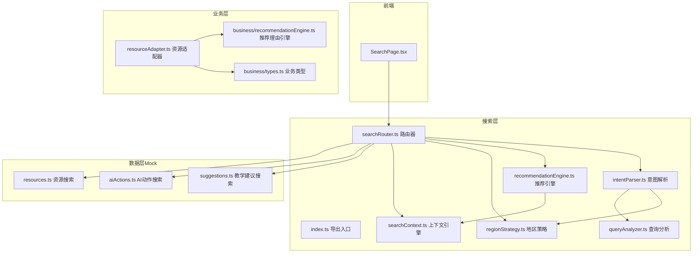
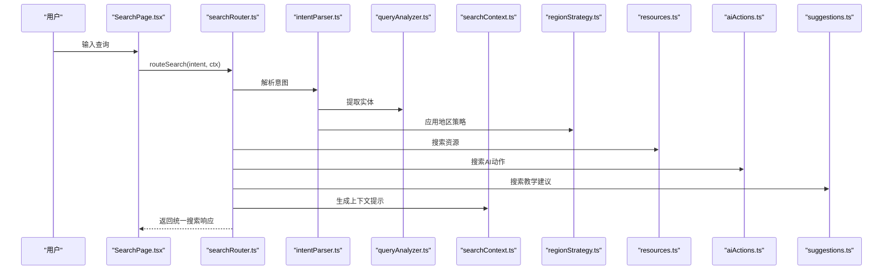
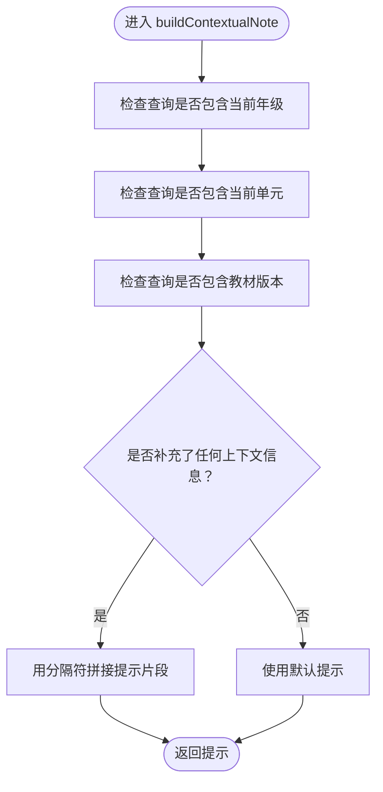
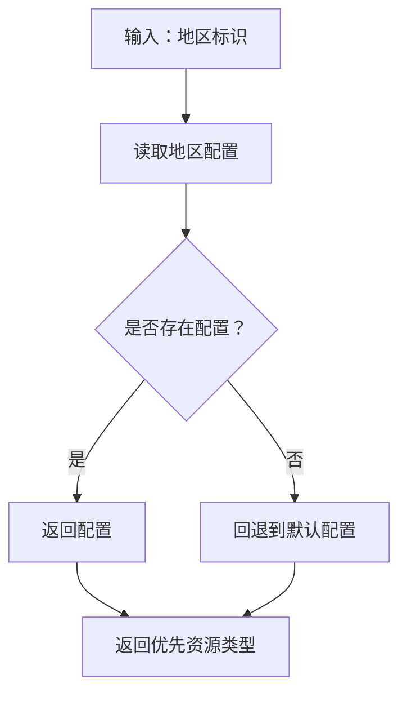
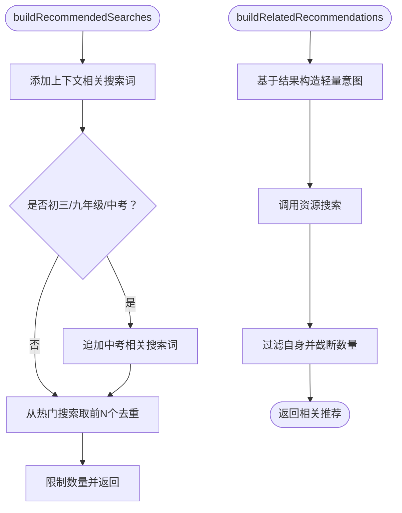
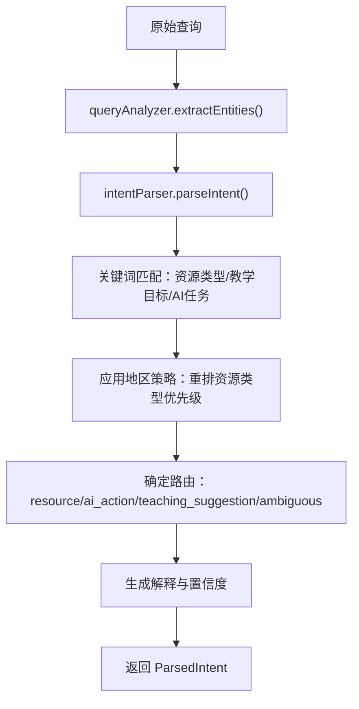
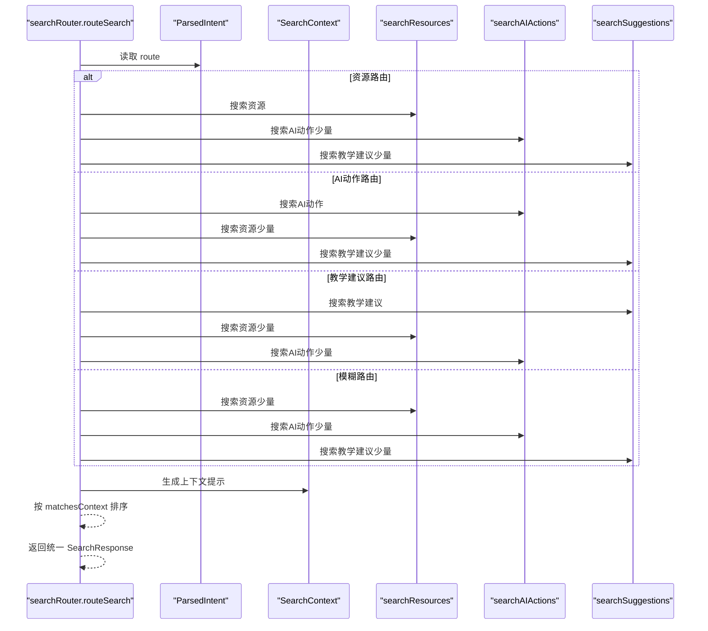
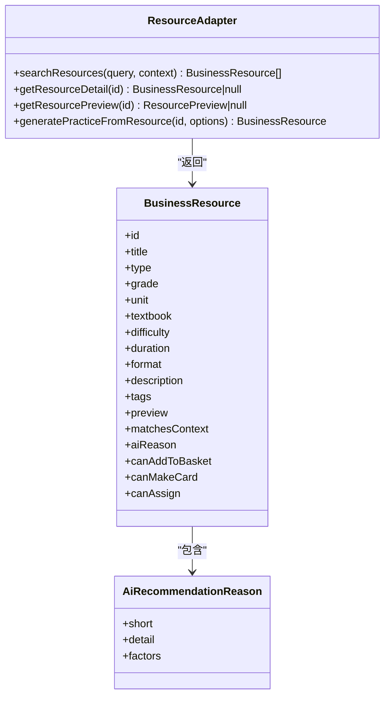
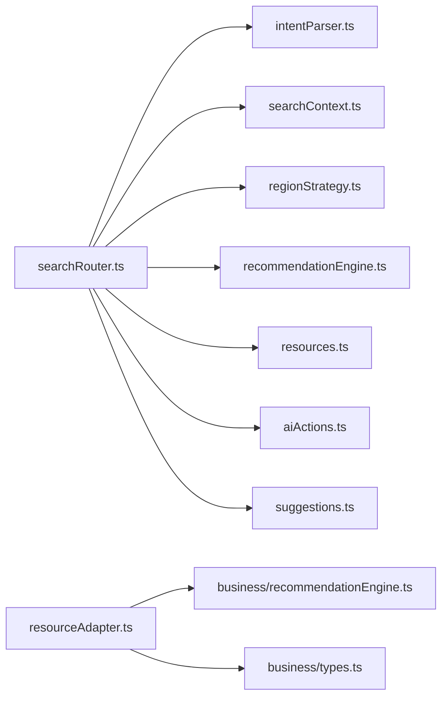

# 搜索系统架构

<cite>
**本文引用的文件**
- [src/ai/search/index.ts](file://src/ai/search/index.ts)
- [src/ai/search/searchContext.ts](file://src/ai/search/searchContext.ts)
- [src/ai/search/regionStrategy.ts](file://src/ai/search/regionStrategy.ts)
- [src/ai/search/recommendationEngine.ts](file://src/ai/search/recommendationEngine.ts)
- [src/ai/search/types.ts](file://src/ai/search/types.ts)
- [src/ai/search/intentParser.ts](file://src/ai/search/intentParser.ts)
- [src/ai/search/queryAnalyzer.ts](file://src/ai/search/queryAnalyzer.ts)
- [src/ai/search/searchRouter.ts](file://src/ai/search/searchRouter.ts)
- [src/ai/mock/search/resources.ts](file://src/ai/mock/search/resources.ts)
- [src/ai/mock/search/aiActions.ts](file://src/ai/mock/search/aiActions.ts)
- [src/ai/mock/search/suggestions.ts](file://src/ai/mock/search/suggestions.ts)
- [src/business/recommendationEngine.ts](file://src/business/recommendationEngine.ts)
- [src/business/resourceAdapter.ts](file://src/business/resourceAdapter.ts)
- [src/business/types.ts](file://src/business/types.ts)
- [src/ai/context/contextEngine.ts](file://src/ai/context/contextEngine.ts)
- [src/pages/SearchPage.tsx](file://src/pages/SearchPage.tsx)
</cite>

## 目录
1. [引言](#引言)
2. [项目结构](#项目结构)
3. [核心组件](#核心组件)
4. [架构总览](#架构总览)
5. [详细组件分析](#详细组件分析)
6. [依赖分析](#依赖分析)
7. [性能考虑](#性能考虑)
8. [故障排查指南](#故障排查指南)
9. [结论](#结论)
10. [附录](#附录)

## 引言
本文件面向小天AI教育平台的搜索系统，系统性阐述其整体设计思路与核心组件关系，重点覆盖以下方面：
- 搜索上下文引擎：默认上下文构建、区域推断、情境笔记生成
- 区域策略系统：地区配置获取、优先资源类型管理、地区解释
- 推荐引擎：推荐搜索构建、相关推荐生成
- 搜索路由与响应：意图解析、路由分发、结果排序与上下文提示
- 业务适配与扩展：资源适配器、推荐理由引擎、与真实资源库对接
- 性能优化与最佳实践：评分与过滤策略、并发加载、缓存与降级

## 项目结构
搜索系统位于 src/ai/search 目录，采用“意图解析 + 上下文 + 路由 + 结果聚合”的分层设计。前端页面通过 SearchPage.tsx 与搜索模块交互，后端逻辑以 mock 数据为主，便于快速迭代与验证。

图表来源
- [src/pages/SearchPage.tsx:1-249](file://src/pages/SearchPage.tsx#L1-L249)
- [src/ai/search/index.ts:1-20](file://src/ai/search/index.ts#L1-L20)
- [src/ai/search/intentParser.ts:1-143](file://src/ai/search/intentParser.ts#L1-L143)
- [src/ai/search/queryAnalyzer.ts:1-170](file://src/ai/search/queryAnalyzer.ts#L1-L170)
- [src/ai/search/searchContext.ts:1-77](file://src/ai/search/searchContext.ts#L1-L77)
- [src/ai/search/regionStrategy.ts:1-99](file://src/ai/search/regionStrategy.ts#L1-L99)
- [src/ai/search/recommendationEngine.ts:1-55](file://src/ai/search/recommendationEngine.ts#L1-L55)
- [src/ai/search/searchRouter.ts:1-72](file://src/ai/search/searchRouter.ts#L1-L72)
- [src/ai/mock/search/resources.ts:1-109](file://src/ai/mock/search/resources.ts#L1-L109)
- [src/ai/mock/search/aiActions.ts:1-304](file://src/ai/mock/search/aiActions.ts#L1-L304)
- [src/ai/mock/search/suggestions.ts:1-155](file://src/ai/mock/search/suggestions.ts#L1-L155)
- [src/business/resourceAdapter.ts:1-193](file://src/business/resourceAdapter.ts#L1-L193)
- [src/business/recommendationEngine.ts:1-87](file://src/business/recommendationEngine.ts#L1-L87)
- [src/business/types.ts:1-203](file://src/business/types.ts#L1-L203)

章节来源
- [src/ai/search/index.ts:1-20](file://src/ai/search/index.ts#L1-L20)
- [src/pages/SearchPage.tsx:1-249](file://src/pages/SearchPage.tsx#L1-L249)

## 核心组件
- 搜索上下文引擎：负责默认上下文构建、区域推断、情境笔记生成，确保搜索结果与当前教学情境高度契合。
- 区域策略系统：提供地区配置、优先资源类型排序与地区解释，支撑差异化教学资源推荐。
- 推荐引擎：构建“推荐搜索词”与“相关推荐”，提升用户发现与召回质量。
- 意图解析与查询分析：将自然语言查询结构化为资源类型、教学目标、AI任务等意图，为路由与排序提供依据。
- 搜索路由器：根据意图路由到资源、AI动作或教学建议，并进行上下文匹配排序与提示生成。
- 业务适配与推荐理由：将AI搜索结果映射到真实业务资源，动态生成推荐理由，增强解释性与可信度。

章节来源
- [src/ai/search/searchContext.ts:1-77](file://src/ai/search/searchContext.ts#L1-L77)
- [src/ai/search/regionStrategy.ts:1-99](file://src/ai/search/regionStrategy.ts#L1-L99)
- [src/ai/search/recommendationEngine.ts:1-55](file://src/ai/search/recommendationEngine.ts#L1-L55)
- [src/ai/search/intentParser.ts:1-143](file://src/ai/search/intentParser.ts#L1-L143)
- [src/ai/search/queryAnalyzer.ts:1-170](file://src/ai/search/queryAnalyzer.ts#L1-L170)
- [src/ai/search/searchRouter.ts:1-72](file://src/ai/search/searchRouter.ts#L1-L72)
- [src/business/resourceAdapter.ts:1-193](file://src/business/resourceAdapter.ts#L1-L193)
- [src/business/recommendationEngine.ts:1-87](file://src/business/recommendationEngine.ts#L1-L87)

## 架构总览
搜索系统采用“意图驱动 + 上下文增强 + 多结果聚合”的架构。前端发起查询后，经由意图解析与查询分析，结合区域策略与上下文，路由到资源、AI动作或教学建议的搜索模块，最终返回统一的搜索响应对象，包含上下文提示与排序后的结果。

图表来源
- [src/pages/SearchPage.tsx:76-88](file://src/pages/SearchPage.tsx#L76-L88)
- [src/ai/search/searchRouter.ts:14-71](file://src/ai/search/searchRouter.ts#L14-L71)
- [src/ai/search/intentParser.ts:69-142](file://src/ai/search/intentParser.ts#L69-L142)
- [src/ai/search/queryAnalyzer.ts:72-168](file://src/ai/search/queryAnalyzer.ts#L72-L168)
- [src/ai/search/searchContext.ts:62-76](file://src/ai/search/searchContext.ts#L62-L76)
- [src/ai/mock/search/resources.ts:57-108](file://src/ai/mock/search/resources.ts#L57-L108)
- [src/ai/mock/search/aiActions.ts:247-303](file://src/ai/mock/search/aiActions.ts#L247-L303)
- [src/ai/mock/search/suggestions.ts:126-154](file://src/ai/mock/search/suggestions.ts#L126-L154)

## 详细组件分析

### 搜索上下文引擎
- 默认搜索上下文：提供教材、单元、年级、学段、地区、班级名以及近期/热门搜索等默认值，便于MVP阶段快速落地。
- 学段推断：根据年级字符串推断初中/高中/中考阶段，影响资源类型与教学建议的侧重点。
- 地区推断：基于提示字符串（如地市关键词）推断地区，支持后续地区化策略。
- 情境笔记：根据查询与上下文差异生成“已自动应用/已匹配”的提示文本，提升透明度与可解释性。

图表来源
- [src/ai/search/searchContext.ts:62-76](file://src/ai/search/searchContext.ts#L62-L76)

章节来源
- [src/ai/search/searchContext.ts:7-76](file://src/ai/search/searchContext.ts#L7-L76)

### 区域策略系统
- 配置中心：集中维护各地区的权重与优先资源类型，支持默认与多地区分支。
- 优先资源类型：不同地区因听说考试占比不同，优先级顺序有所差异，直接影响资源排序与推荐。
- 地区解释：提供人类可读的解释文案，说明地区策略的优先方向。

图表来源
- [src/ai/search/regionStrategy.ts:60-80](file://src/ai/search/regionStrategy.ts#L60-L80)

章节来源
- [src/ai/search/regionStrategy.ts:1-99](file://src/ai/search/regionStrategy.ts#L1-L99)

### 推荐引擎
- 推荐搜索词：基于当前上下文（年级/单元/近期/热门）生成候选搜索词，提升发现率。
- 相关推荐：基于结果标题与教学目标构造轻量意图，调用资源搜索生成“你可能也喜欢”的结果。

图表来源
- [src/ai/search/recommendationEngine.ts:10-30](file://src/ai/search/recommendationEngine.ts#L10-L30)
- [src/ai/search/recommendationEngine.ts:35-54](file://src/ai/search/recommendationEngine.ts#L35-L54)

章节来源
- [src/ai/search/recommendationEngine.ts:1-55](file://src/ai/search/recommendationEngine.ts#L1-L55)

### 意图解析与查询分析
- 查询分析：抽取年级、单元、教材、数量、考试类型、主题等实体，为后续意图解析与路由提供结构化输入。
- 意图解析：匹配资源类型、教学目标、AI任务关键词，结合地区策略与上下文，确定路由与置信度，并生成解释说明。

图表来源
- [src/ai/search/queryAnalyzer.ts:72-168](file://src/ai/search/queryAnalyzer.ts#L72-L168)
- [src/ai/search/intentParser.ts:69-142](file://src/ai/search/intentParser.ts#L69-L142)

章节来源
- [src/ai/search/queryAnalyzer.ts:1-170](file://src/ai/search/queryAnalyzer.ts#L1-L170)
- [src/ai/search/intentParser.ts:1-143](file://src/ai/search/intentParser.ts#L1-L143)

### 搜索路由器与响应
- 路由分发：根据意图路由到资源、AI动作或教学建议，并在 ambiguous 情况下均衡返回。
- 排序与上下文提示：按 matchesContext 降序排序，生成上下文提示，强调自动应用与识别差异。

图表来源
- [src/ai/search/searchRouter.ts:14-71](file://src/ai/search/searchRouter.ts#L14-L71)

章节来源
- [src/ai/search/searchRouter.ts:1-72](file://src/ai/search/searchRouter.ts#L1-L72)

### 业务适配与推荐理由
- 资源适配器：将AI搜索结果映射到真实业务资源，提供搜索、预览、生成练习等接口，并在生产环境替换为真实API。
- 推荐理由引擎：基于弱项、教学阶段、地区、难度、趋势等因素动态生成推荐理由，增强解释性与可信度。

图表来源
- [src/business/resourceAdapter.ts:155-192](file://src/business/resourceAdapter.ts#L155-L192)
- [src/business/types.ts:41-65](file://src/business/types.ts#L41-L65)
- [src/business/types.ts:80-95](file://src/business/types.ts#L80-L95)

章节来源
- [src/business/resourceAdapter.ts:1-193](file://src/business/resourceAdapter.ts#L1-L193)
- [src/business/recommendationEngine.ts:1-87](file://src/business/recommendationEngine.ts#L1-L87)
- [src/business/types.ts:1-203](file://src/business/types.ts#L1-L203)

### 搜索系统扩展与定制开发实践
- 替换意图解析：可将关键词匹配替换为LLM解析，保持接口一致，便于平滑迁移。
- 扩展地区策略：新增地区配置与解释文案，不影响上游路由与排序逻辑。
- 丰富推荐词：结合业务热点与教学进度，动态扩展推荐搜索词集合。
- 适配真实资源库：通过资源适配器抽象，将mock替换为真实API，保持上层调用不变。
- 增强上下文：结合RAG检索与课堂历史，进一步提升上下文准确性与个性化。

章节来源
- [src/ai/search/intentParser.ts:69-142](file://src/ai/search/intentParser.ts#L69-L142)
- [src/ai/search/regionStrategy.ts:60-80](file://src/ai/search/regionStrategy.ts#L60-L80)
- [src/ai/search/recommendationEngine.ts:10-30](file://src/ai/search/recommendationEngine.ts#L10-L30)
- [src/business/resourceAdapter.ts:155-192](file://src/business/resourceAdapter.ts#L155-L192)

## 依赖分析
- 组件耦合：搜索路由器依赖意图解析、查询分析、上下文与地区策略；资源、AI动作、教学建议模块相互独立，通过统一响应聚合。
- 外部依赖：资源适配器与推荐理由引擎依赖业务类型定义，保证数据一致性。
- 可能的循环依赖：当前模块间为单向依赖，未见循环。

图表来源
- [src/ai/search/searchRouter.ts:14-71](file://src/ai/search/searchRouter.ts#L14-L71)
- [src/ai/search/intentParser.ts:69-142](file://src/ai/search/intentParser.ts#L69-L142)
- [src/ai/search/searchContext.ts:7-76](file://src/ai/search/searchContext.ts#L7-L76)
- [src/ai/search/regionStrategy.ts:60-80](file://src/ai/search/regionStrategy.ts#L60-L80)
- [src/ai/search/recommendationEngine.ts:10-54](file://src/ai/search/recommendationEngine.ts#L10-L54)
- [src/ai/mock/search/resources.ts:57-108](file://src/ai/mock/search/resources.ts#L57-L108)
- [src/ai/mock/search/aiActions.ts:247-303](file://src/ai/mock/search/aiActions.ts#L247-L303)
- [src/ai/mock/search/suggestions.ts:126-154](file://src/ai/mock/search/suggestions.ts#L126-L154)
- [src/business/resourceAdapter.ts:155-192](file://src/business/resourceAdapter.ts#L155-L192)
- [src/business/recommendationEngine.ts:10-86](file://src/business/recommendationEngine.ts#L10-L86)
- [src/business/types.ts:172-195](file://src/business/types.ts#L172-L195)

章节来源
- [src/ai/search/index.ts:1-20](file://src/ai/search/index.ts#L1-L20)

## 性能考虑
- 评分与过滤：资源搜索采用多维度评分（类型、目标、年级、单元、教材、关键词、主题、上下文匹配），先过滤低分再排序，减少无效渲染。
- 并发加载：上下文构建与RAG检索可并行执行，缩短首屏延迟。
- 缓存与降级：向量检索失败时回退到本地知识片段，保证稳定性。
- 前端体验：搜索结果按 matchesContext 优先显示，提升命中质量；推荐词与热门搜索减少用户思考成本。

章节来源
- [src/ai/mock/search/resources.ts:57-108](file://src/ai/mock/search/resources.ts#L57-L108)
- [src/ai/context/contextEngine.ts:62-68](file://src/ai/context/contextEngine.ts#L62-L68)
- [src/ai/context/contextEngine.ts:129-133](file://src/ai/context/contextEngine.ts#L129-L133)

## 故障排查指南
- 意图解析异常：检查关键词映射是否覆盖用户输入，必要时扩展关键词表或引入LLM解析。
- 实体抽取偏差：校准正则与模式，确保年级、单元、教材、主题等抽取准确。
- 地区策略不生效：确认地区标识与配置键一致，检查默认回退逻辑。
- 排序不符合预期：调整评分权重或过滤阈值，确保 matchesContext 的判定逻辑正确。
- 响应为空：检查过滤阈值与mock数据范围，逐步缩小问题范围。

章节来源
- [src/ai/search/intentParser.ts:69-142](file://src/ai/search/intentParser.ts#L69-L142)
- [src/ai/search/queryAnalyzer.ts:72-168](file://src/ai/search/queryAnalyzer.ts#L72-L168)
- [src/ai/search/regionStrategy.ts:60-80](file://src/ai/search/regionStrategy.ts#L60-L80)
- [src/ai/mock/search/resources.ts:57-108](file://src/ai/mock/search/resources.ts#L57-L108)

## 结论
小天AI教育平台的搜索系统以“意图驱动 + 上下文增强 + 多结果聚合”为核心，通过上下文引擎、区域策略与推荐引擎形成闭环，既保证了教学情境的贴合度，又提升了资源发现与个性化程度。通过资源适配器与推荐理由引擎，系统具备良好的扩展性与可解释性，便于在生产环境中接入真实资源库与数据驱动的优化策略。

## 附录
- 类型体系：涵盖资源类型、教学目标、AI任务、地区配置、搜索上下文、搜索结果与响应等，确保前后端契约清晰。
- 前端入口：SearchPage.tsx 提供查询输入、推荐词点击、结果展示与操作入口，串联搜索与业务流程。

章节来源
- [src/ai/search/types.ts:1-195](file://src/ai/search/types.ts#L1-L195)
- [src/pages/SearchPage.tsx:1-249](file://src/pages/SearchPage.tsx#L1-L249)