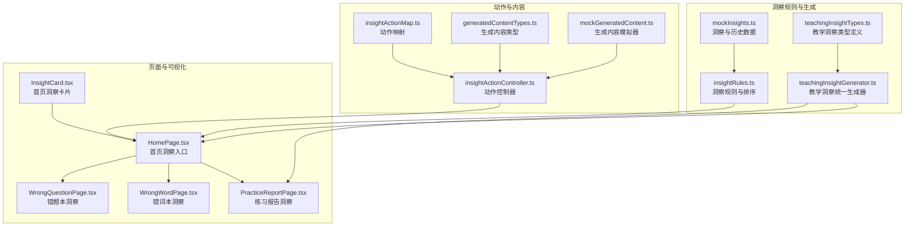
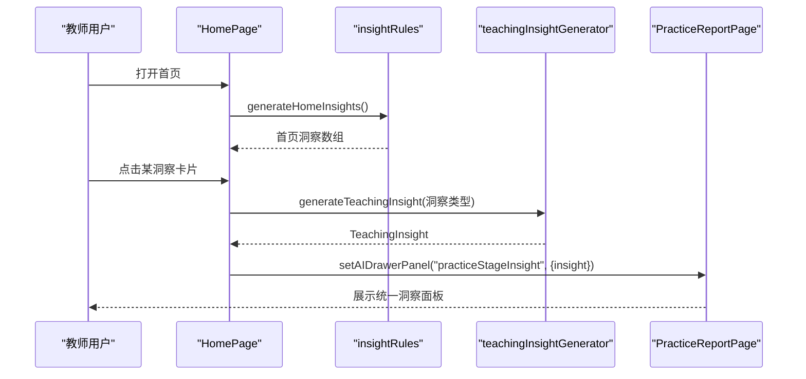
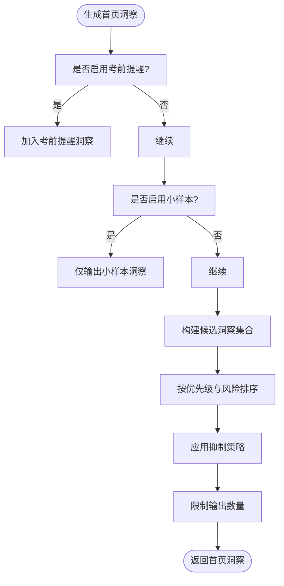
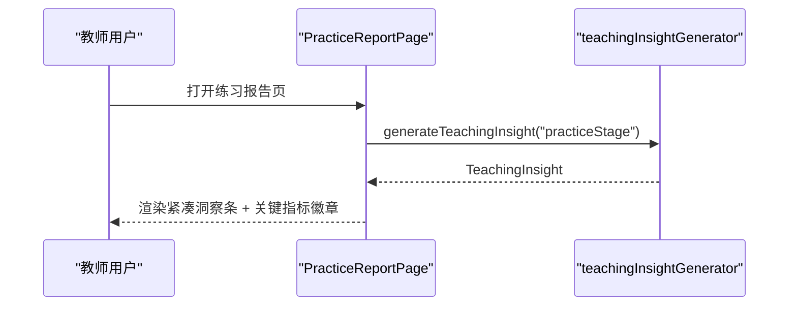
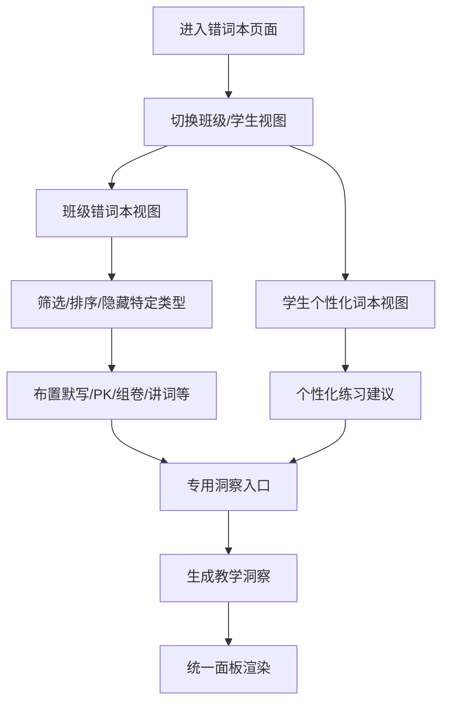
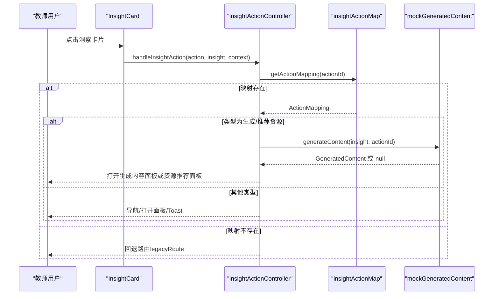
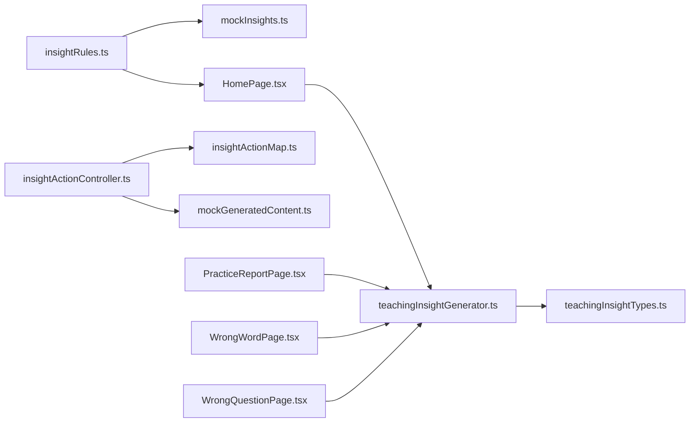

# 具体洞察实现

<cite>
**本文引用的文件**
- [src/ai/insights/teachingInsightGenerator.ts](file://src/ai/insights/teachingInsightGenerator.ts)
- [src/ai/insights/teachingInsightTypes.ts](file://src/ai/insights/teachingInsightTypes.ts)
- [src/ai/insights/insightRules.ts](file://src/ai/insights/insightRules.ts)
- [src/ai/insights/insightTypes.ts](file://src/ai/insights/insightTypes.ts)
- [src/ai/insights/generatedContentTypes.ts](file://src/ai/insights/generatedContentTypes.ts)
- [src/ai/insights/mockGeneratedContent.ts](file://src/ai/insights/mockGeneratedContent.ts)
- [src/ai/insights/insightActionController.ts](file://src/ai/insights/insightActionController.ts)
- [src/ai/insights/insightActionMap.ts](file://src/ai/insights/insightActionMap.ts)
- [src/ai/insights/mockInsights.ts](file://src/ai/insights/mockInsights.ts)
- [src/ai/insights/runInsightV1SelfCheck.ts](file://src/ai/insights/runInsightV1SelfCheck.ts)
- [src/pages/HomePage.tsx](file://src/pages/HomePage.tsx)
- [src/pages/PracticeReportPage.tsx](file://src/pages/PracticeReportPage.tsx)
- [src/pages/WrongWordPage.tsx](file://src/pages/WrongWordPage.tsx)
- [src/pages/WrongQuestionPage.tsx](file://src/pages/WrongQuestionPage.tsx)
- [src/ai/components/InsightCard.tsx](file://src/ai/components/InsightCard.tsx)
</cite>

## 目录
1. [简介](#简介)
2. [项目结构](#项目结构)
3. [核心组件](#核心组件)
4. [架构总览](#架构总览)
5. [详细组件分析](#详细组件分析)
6. [依赖关系分析](#依赖关系分析)
7. [性能考量](#性能考量)
8. [故障排查指南](#故障排查指南)
9. [结论](#结论)
10. [附录](#附录)

## 简介
本技术文档面向小天AI教育平台的“具体洞察实现”，系统化阐述各类教学洞察（首页洞察、错词洞察、写作洞察、听力洞察、练习报告洞察、错题本洞察等）的数据来源、分析算法、生成逻辑、模板系统、内容生成机制、可视化展示与交互设计、个性化定制与动态内容生成、扩展与自定义开发方法、效果评估指标与优化策略，并提供完整实现示例与使用说明。

## 项目结构
洞察系统由“洞察规则与生成”“教学洞察统一结构”“动作控制器与映射”“页面集成与可视化”四个层面构成，采用模块化与类型驱动的设计，确保跨页面的一致性与可扩展性。



图表来源
- [src/ai/insights/insightRules.ts:1-179](file://src/ai/insights/insightRules.ts#L1-L179)
- [src/ai/insights/mockInsights.ts:1-376](file://src/ai/insights/mockInsights.ts#L1-L376)
- [src/ai/insights/teachingInsightGenerator.ts:1-388](file://src/ai/insights/teachingInsightGenerator.ts#L1-L388)
- [src/ai/insights/teachingInsightTypes.ts:1-191](file://src/ai/insights/teachingInsightTypes.ts#L1-L191)
- [src/ai/insights/insightActionController.ts:1-229](file://src/ai/insights/insightActionController.ts#L1-L229)
- [src/ai/insights/insightActionMap.ts:1-172](file://src/ai/insights/insightActionMap.ts#L1-L172)
- [src/ai/insights/generatedContentTypes.ts:1-114](file://src/ai/insights/generatedContentTypes.ts#L1-L114)
- [src/ai/insights/mockGeneratedContent.ts:1-246](file://src/ai/insights/mockGeneratedContent.ts#L1-L246)
- [src/pages/HomePage.tsx:1-465](file://src/pages/HomePage.tsx#L1-L465)
- [src/pages/PracticeReportPage.tsx:1-339](file://src/pages/PracticeReportPage.tsx#L1-L339)
- [src/pages/WrongWordPage.tsx:1-516](file://src/pages/WrongWordPage.tsx#L1-L516)
- [src/pages/WrongQuestionPage.tsx:1-518](file://src/pages/WrongQuestionPage.tsx#L1-L518)
- [src/ai/components/InsightCard.tsx:1-84](file://src/ai/components/InsightCard.tsx#L1-L84)

章节来源
- [src/ai/insights/insightRules.ts:1-179](file://src/ai/insights/insightRules.ts#L1-L179)
- [src/ai/insights/teachingInsightGenerator.ts:1-388](file://src/ai/insights/teachingInsightGenerator.ts#L1-L388)
- [src/pages/HomePage.tsx:1-465](file://src/pages/HomePage.tsx#L1-L465)

## 核心组件
- 洞察规则与排序：提供样本量判断、考前提醒判断、洞察优先级排序、抑制策略、首页洞察生成、文本安全校验等。
- 教学洞察统一生成器：将各学科维度（练习阶段、词汇、听力/口语、写作）整合为统一结构，便于页面渲染与交互。
- 动作控制器与映射：将洞察动作标准化为“生成内容/跳转/打开面板/布置/加入篮子/占位提示”等行为，并支持来源感知路由。
- 页面集成与可视化：首页洞察卡片、练习报告洞察条、错词本/错题本洞察入口，均通过统一生成器与动作控制器实现一致体验。

章节来源
- [src/ai/insights/insightRules.ts:1-179](file://src/ai/insights/insightRules.ts#L1-L179)
- [src/ai/insights/teachingInsightGenerator.ts:1-388](file://src/ai/insights/teachingInsightGenerator.ts#L1-L388)
- [src/ai/insights/insightActionController.ts:1-229](file://src/ai/insights/insightActionController.ts#L1-L229)
- [src/ai/insights/insightActionMap.ts:1-172](file://src/ai/insights/insightActionMap.ts#L1-L172)
- [src/pages/HomePage.tsx:1-465](file://src/pages/HomePage.tsx#L1-L465)

## 架构总览
洞察系统采用“规则驱动 + 统一结构 + 动作编排”的三层架构：
- 规则层：负责洞察候选生成、优先级排序、抑制与安全校验。
- 结构层：提供教学洞察统一数据结构，屏蔽页面差异。
- 控制层：将动作映射为UI指令，实现“在洞察面板内打开/跳转到搜索/打开生成内容面板/布置任务/加入练习篮”等行为。



图表来源
- [src/pages/HomePage.tsx:350-383](file://src/pages/HomePage.tsx#L350-L383)
- [src/ai/insights/insightRules.ts:102-128](file://src/ai/insights/insightRules.ts#L102-L128)
- [src/ai/insights/teachingInsightGenerator.ts:12-19](file://src/ai/insights/teachingInsightGenerator.ts#L12-L19)
- [src/pages/PracticeReportPage.tsx:215-218](file://src/pages/PracticeReportPage.tsx#L215-L218)

## 详细组件分析

### 首页洞察（Home Insights）
- 数据来源：基于规则函数生成候选洞察，结合“考前提醒”“小样本”等开关控制输出。
- 排序与抑制：优先级排序，考前提醒置顶；小样本场景抑制高风险结论；历史与屏蔽策略避免重复与无效提醒。
- 可视化：首页洞察卡片按风险等级着色与图标区分，点击后进入统一教学洞察面板。



图表来源
- [src/ai/insights/insightRules.ts:102-128](file://src/ai/insights/insightRules.ts#L102-L128)
- [src/ai/insights/insightRules.ts:42-67](file://src/ai/insights/insightRules.ts#L42-L67)
- [src/ai/insights/insightRules.ts:69-89](file://src/ai/insights/insightRules.ts#L69-L89)

章节来源
- [src/ai/insights/insightRules.ts:91-128](file://src/ai/insights/insightRules.ts#L91-L128)
- [src/ai/components/InsightCard.tsx:1-84](file://src/ai/components/InsightCard.tsx#L1-L84)
- [src/pages/HomePage.tsx:350-383](file://src/pages/HomePage.tsx#L350-L383)

### 练习报告洞察（Practice Report Insights）
- 数据来源：页面侧直接调用教学洞察生成器，返回统一结构洞察。
- 可视化：页面顶部紧凑洞察条，包含关键指标徽章与跳转到对应分析区域的能力。



图表来源
- [src/pages/PracticeReportPage.tsx:215-218](file://src/pages/PracticeReportPage.tsx#L215-L218)
- [src/ai/insights/teachingInsightGenerator.ts:12-19](file://src/ai/insights/teachingInsightGenerator.ts#L12-L19)

章节来源
- [src/pages/PracticeReportPage.tsx:201-287](file://src/pages/PracticeReportPage.tsx#L201-L287)

### 错词洞察（Wrong Word Insights）
- 数据来源：错词本页面提供“班级错词本/学生个性化词本”双视图，页面内集成“专用洞察入口”。
- 可视化：班级视图网格展示高频错词，支持筛选与批量操作；学生视图表格展示个人错词统计与个性化练习建议。



图表来源
- [src/pages/WrongWordPage.tsx:143-319](file://src/pages/WrongWordPage.tsx#L143-L319)
- [src/pages/WrongWordPage.tsx:349-490](file://src/pages/WrongWordPage.tsx#L349-L490)

章节来源
- [src/pages/WrongWordPage.tsx:1-516](file://src/pages/WrongWordPage.tsx#L1-L516)

### 写作洞察（Writing Insights）
- 数据来源：写作练习批改结果，包含提交率、平均得分、语法准确性、句式多样性等指标。
- 可视化：页面顶部洞察条展示关键指标，支持一键生成讲评、范文、二次修改任务等。

章节来源
- [src/pages/PracticeReportPage.tsx:215-218](file://src/pages/PracticeReportPage.tsx#L215-L218)
- [src/ai/insights/teachingInsightGenerator.ts:318-384](file://src/ai/insights/teachingInsightGenerator.ts#L318-L384)

### 听力/口语洞察（Listening/Speaking Insights）
- 数据来源：听力/口语练习得分率、细节题正确率、数字信息识别、发音准确度等指标。
- 可视化：页面顶部洞察条展示关键指标，支持推荐专项训练、模拟任务、跟读材料等。

章节来源
- [src/ai/insights/teachingInsightGenerator.ts:247-314](file://src/ai/insights/teachingInsightGenerator.ts#L247-L314)

### 错题本洞察（Wrong Question Insights）
- 数据来源：错题本页面按题型/知识点/错误率等维度聚合题目，页面内集成“专用洞察入口”。
- 可视化：题型分组展示，支持音频播放、答案解析、加入试卷篮等操作。

章节来源
- [src/pages/WrongQuestionPage.tsx:251-504](file://src/pages/WrongQuestionPage.tsx#L251-L504)

### 教学洞察统一结构与模板系统
- 统一结构：教学洞察类型定义涵盖标题、摘要、结论、分析范围、关键指标、趋势分析、对比分析、问题诊断、影响范围、学生分群、推荐动作、关联项与类型特有字段。
- 模板系统：通过“洞察类型 → 统一结构”的映射，实现不同页面的统一渲染与交互。

```mermaid
classDiagram
class TeachingInsight {
+id : string
+type : TeachingInsightType
+priority : InsightPriority
+title : string
+summary : string
+conclusion : string
+analysisScope
+keyMetrics
+trendAnalysis?
+referenceComparison?
+problemDiagnosis?
+impactScope?
+studentSegments?
+recommendedActions
+relatedItems?
+errorTypes?
+highFreqItems?
+radarDimensions?
}
class TeachingInsightType {
<<enumeration>>
"practiceStage"
"vocabulary"
"listeningSpeaking"
"writing"
}
class InsightPriority {
<<enumeration>>
"needs_attention"
"suggest_attention"
"continue_observe"
"improving"
}
TeachingInsight --> TeachingInsightType
TeachingInsight --> InsightPriority
```

图表来源
- [src/ai/insights/teachingInsightTypes.ts:10-191](file://src/ai/insights/teachingInsightTypes.ts#L10-L191)

章节来源
- [src/ai/insights/teachingInsightTypes.ts:1-191](file://src/ai/insights/teachingInsightTypes.ts#L1-L191)
- [src/ai/insights/teachingInsightGenerator.ts:1-388](file://src/ai/insights/teachingInsightGenerator.ts#L1-L388)

### 内容生成机制与动作编排
- 动作映射：将洞察动作标识映射为“生成内容/跳转/打开面板/布置/加入篮子/占位提示”等类型。
- 动作控制器：根据动作类型与来源（洞察面板/抽屉/首页快捷动作）决定UI指令，支持生成内容后打开生成内容面板或资源推荐面板。
- 生成内容：注册生成器，按动作标识生成对应内容（如错词强化练习、作文讲评、范文、模拟卷等）。



图表来源
- [src/ai/components/InsightCard.tsx:15-83](file://src/ai/components/InsightCard.tsx#L15-L83)
- [src/ai/insights/insightActionController.ts:48-157](file://src/ai/insights/insightActionController.ts#L48-L157)
- [src/ai/insights/insightActionMap.ts:47-161](file://src/ai/insights/insightActionMap.ts#L47-L161)
- [src/ai/insights/mockGeneratedContent.ts:232-239](file://src/ai/insights/mockGeneratedContent.ts#L232-L239)

章节来源
- [src/ai/insights/insightActionController.ts:1-229](file://src/ai/insights/insightActionController.ts#L1-L229)
- [src/ai/insights/insightActionMap.ts:1-172](file://src/ai/insights/insightActionMap.ts#L1-L172)
- [src/ai/insights/generatedContentTypes.ts:1-114](file://src/ai/insights/generatedContentTypes.ts#L1-L114)
- [src/ai/insights/mockGeneratedContent.ts:1-246](file://src/ai/insights/mockGeneratedContent.ts#L1-L246)

### 个性化定制与动态内容生成
- 个性化维度：按班级、单元、时间段、题型、知识点等筛选与聚合，支持“分层布置”“个性化练习”等。
- 动态内容：根据洞察生成对应内容（如错词强化练习、作文讲评、范文、模拟卷），并支持编辑、预览、布置、加入练习篮等操作。
- 来源感知路由：洞察面板内动作保持在抽屉内打开，首页快捷动作跳转到搜索页自动执行。

章节来源
- [src/ai/insights/insightActionController.ts:64-99](file://src/ai/insights/insightActionController.ts#L64-L99)
- [src/ai/insights/mockGeneratedContent.ts:32-59](file://src/ai/insights/mockGeneratedContent.ts#L32-L59)
- [src/ai/insights/mockGeneratedContent.ts:63-94](file://src/ai/insights/mockGeneratedContent.ts#L63-L94)
- [src/ai/insights/mockGeneratedContent.ts:131-158](file://src/ai/insights/mockGeneratedContent.ts#L131-L158)
- [src/ai/insights/mockGeneratedContent.ts:162-198](file://src/ai/insights/mockGeneratedContent.ts#L162-L198)
- [src/ai/insights/mockGeneratedContent.ts:202-228](file://src/ai/insights/mockGeneratedContent.ts#L202-L228)

### 扩展指南与自定义开发方法
- 新增洞察类型：在教学洞察类型定义中扩展类型枚举，在统一生成器中新增构建函数，补充页面映射与可视化组件。
- 新增动作：在动作映射中新增动作标识与类型，配置目标路径/查询/工作流ID/面板名称/布置类型/生成内容类型等元数据。
- 新增生成内容：在生成器注册表中新增动作到生成器的映射，定义生成内容结构与额外字段。
- 新增页面洞察：在页面组件中集成“专用洞察入口”，调用统一生成器与动作控制器，保持一致交互体验。

章节来源
- [src/ai/insights/teachingInsightTypes.ts:10-191](file://src/ai/insights/teachingInsightTypes.ts#L10-L191)
- [src/ai/insights/teachingInsightGenerator.ts:12-19](file://src/ai/insights/teachingInsightGenerator.ts#L12-L19)
- [src/ai/insights/insightActionMap.ts:47-161](file://src/ai/insights/insightActionMap.ts#L47-L161)
- [src/ai/insights/mockGeneratedContent.ts:18-20](file://src/ai/insights/mockGeneratedContent.ts#L18-L20)

## 依赖关系分析
- 洞察规则依赖模拟洞察数据，用于规则验证与排序。
- 教学洞察生成器依赖统一类型定义，保证跨页面一致性。
- 动作控制器依赖动作映射与生成内容模拟器，实现动作到UI指令的解耦。
- 页面组件依赖洞察生成器与动作控制器，形成“规则 → 结构 → 控制 → 视图”的清晰依赖链。



图表来源
- [src/ai/insights/insightRules.ts:1-179](file://src/ai/insights/insightRules.ts#L1-L179)
- [src/ai/insights/mockInsights.ts:1-376](file://src/ai/insights/mockInsights.ts#L1-L376)
- [src/ai/insights/teachingInsightGenerator.ts:1-388](file://src/ai/insights/teachingInsightGenerator.ts#L1-L388)
- [src/ai/insights/teachingInsightTypes.ts:1-191](file://src/ai/insights/teachingInsightTypes.ts#L1-L191)
- [src/ai/insights/insightActionController.ts:1-229](file://src/ai/insights/insightActionController.ts#L1-L229)
- [src/ai/insights/insightActionMap.ts:1-172](file://src/ai/insights/insightActionMap.ts#L1-L172)
- [src/ai/insights/mockGeneratedContent.ts:1-246](file://src/ai/insights/mockGeneratedContent.ts#L1-L246)
- [src/pages/HomePage.tsx:1-465](file://src/pages/HomePage.tsx#L1-L465)
- [src/pages/PracticeReportPage.tsx:1-339](file://src/pages/PracticeReportPage.tsx#L1-L339)
- [src/pages/WrongWordPage.tsx:1-516](file://src/pages/WrongWordPage.tsx#L1-L516)
- [src/pages/WrongQuestionPage.tsx:1-518](file://src/pages/WrongQuestionPage.tsx#L1-L518)

章节来源
- [src/ai/insights/insightRules.ts:1-179](file://src/ai/insights/insightRules.ts#L1-L179)
- [src/ai/insights/teachingInsightGenerator.ts:1-388](file://src/ai/insights/teachingInsightGenerator.ts#L1-L388)
- [src/ai/insights/insightActionController.ts:1-229](file://src/ai/insights/insightActionController.ts#L1-L229)

## 性能考量
- 规则计算：样本量判断、考前提醒判断、排序与抑制均为轻量计算，可在前端运行。
- 数据结构：统一教学洞察结构减少页面渲染分支，提高首屏渲染效率。
- 动作编排：动作映射与生成器注册表采用查找表，降低条件分支成本。
- 可视化：卡片与洞察条采用简洁布局，避免复杂DOM层级，提升滚动性能。

## 故障排查指南
- 文案安全：规则提供禁止词检测与文案校验，发现违规文案时返回问题列表，便于定位与修复。
- 样本量异常：当样本量过少时，应抑制高风险结论，避免误导教学决策。
- 动作未生效：检查动作映射是否存在、生成器是否注册、来源上下文是否正确。
- 页面不一致：核对教学洞察类型与页面映射，确保统一结构字段齐全。

章节来源
- [src/ai/insights/runInsightV1SelfCheck.ts:1-107](file://src/ai/insights/runInsightV1SelfCheck.ts#L1-L107)
- [src/ai/insights/insightRules.ts:136-160](file://src/ai/insights/insightRules.ts#L136-L160)
- [src/ai/insights/insightRules.ts:23-28](file://src/ai/insights/insightRules.ts#L23-L28)
- [src/ai/insights/insightRules.ts:32-38](file://src/ai/insights/insightRules.ts#L32-L38)

## 结论
小天AI教育平台的洞察系统通过“规则驱动 + 统一结构 + 动作编排”的架构，实现了首页、练习报告、错词本、错题本等多页面的统一洞察体验。教学洞察统一结构确保了跨页面一致性，动作映射与控制器提供了灵活的交互编排能力。未来可在此基础上接入真实数据源与LLM生成，进一步提升洞察的准确性与个性化程度。

## 附录
- 实现示例路径
  - 首页洞察生成：[src/ai/insights/insightRules.ts:102-128](file://src/ai/insights/insightRules.ts#L102-L128)
  - 教学洞察统一生成：[src/ai/insights/teachingInsightGenerator.ts:12-19](file://src/ai/insights/teachingInsightGenerator.ts#L12-L19)
  - 动作映射与控制器：[src/ai/insights/insightActionMap.ts:47-161](file://src/ai/insights/insightActionMap.ts#L47-L161)、[src/ai/insights/insightActionController.ts:48-157](file://src/ai/insights/insightActionController.ts#L48-L157)
  - 生成内容注册与生成：[src/ai/insights/mockGeneratedContent.ts:18-20](file://src/ai/insights/mockGeneratedContent.ts#L18-L20)、[src/ai/insights/mockGeneratedContent.ts:232-239](file://src/ai/insights/mockGeneratedContent.ts#L232-L239)
  - 页面集成与可视化：[src/pages/HomePage.tsx:350-383](file://src/pages/HomePage.tsx#L350-L383)、[src/pages/PracticeReportPage.tsx:215-218](file://src/pages/PracticeReportPage.tsx#L215-L218)、[src/pages/WrongWordPage.tsx](file://src/pages/WrongWordPage.tsx#L232)、[src/pages/WrongQuestionPage.tsx](file://src/pages/WrongQuestionPage.tsx#L294)
- 自检工具
  - 洞察自检：[src/ai/insights/runInsightV1SelfCheck.ts:14-99](file://src/ai/insights/runInsightV1SelfCheck.ts#L14-L99)