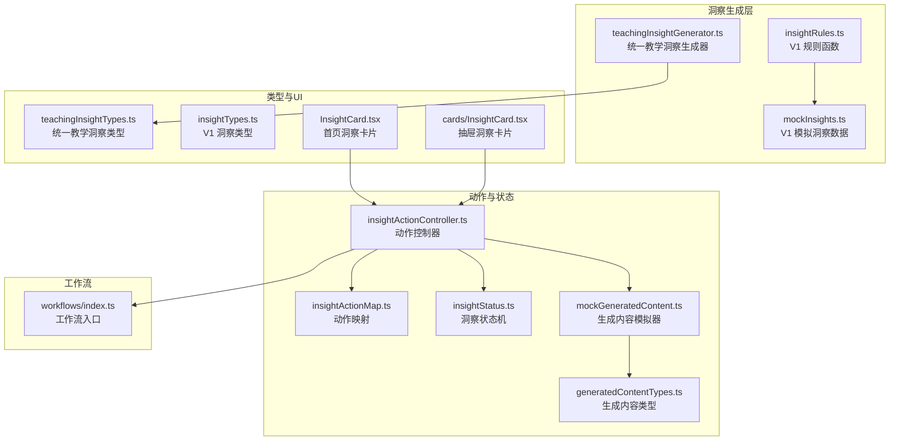
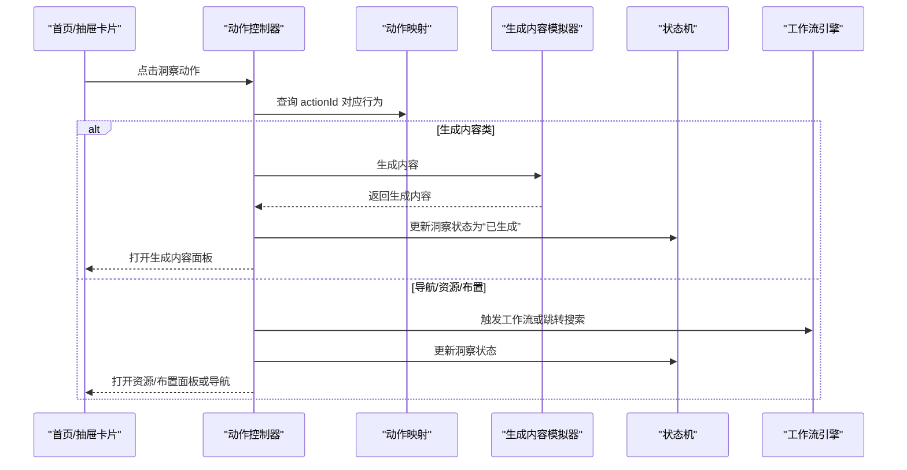
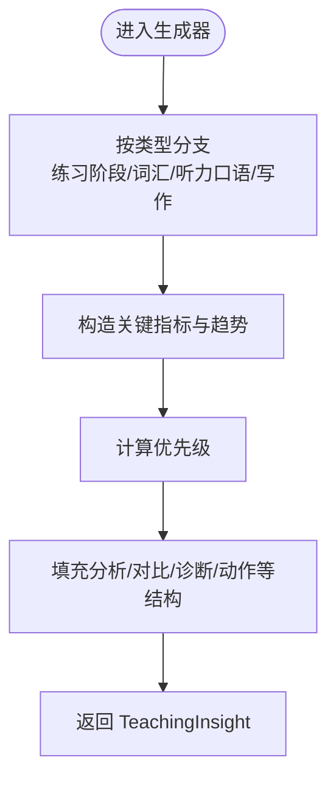
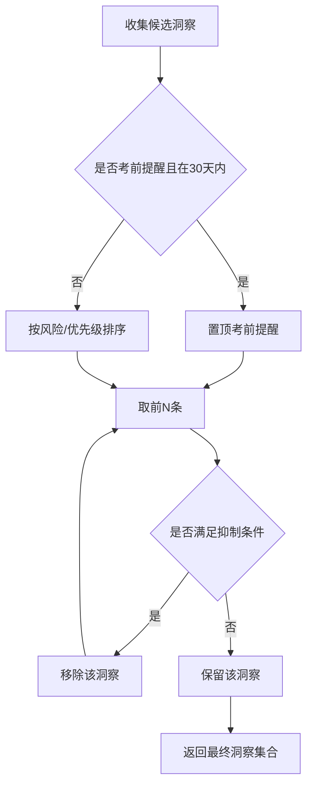
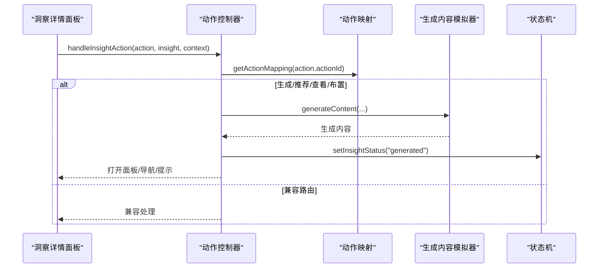
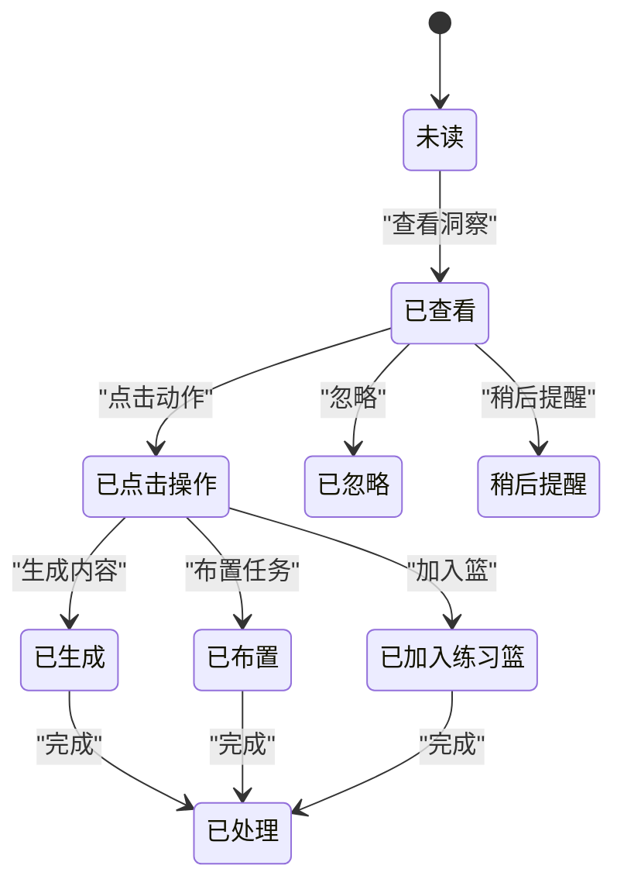
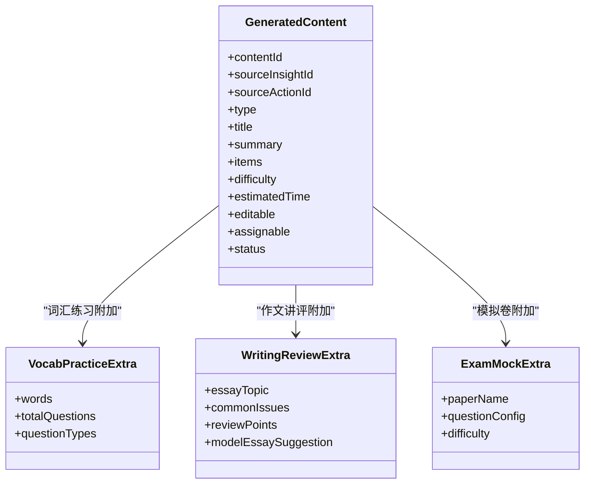
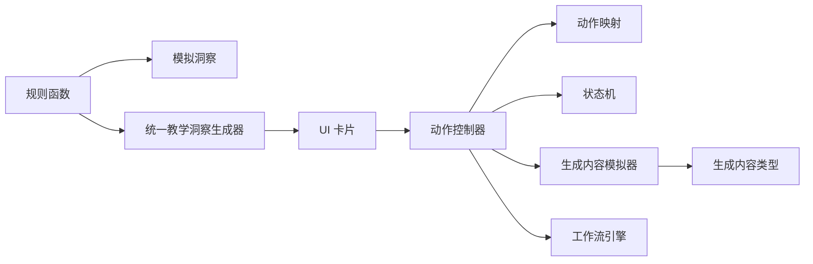

# 教学洞察系统

<cite>
**本文引用的文件**
- [src/ai/insights/teachingInsightGenerator.ts](file://src/ai/insights/teachingInsightGenerator.ts)
- [src/ai/insights/insightRules.ts](file://src/ai/insights/insightRules.ts)
- [src/ai/insights/insightActionController.ts](file://src/ai/insights/insightActionController.ts)
- [src/ai/insights/insightActionMap.ts](file://src/ai/insights/insightActionMap.ts)
- [src/ai/insights/insightTypes.ts](file://src/ai/insights/insightTypes.ts)
- [src/ai/insights/mockInsights.ts](file://src/ai/insights/mockInsights.ts)
- [src/ai/insights/insightStatus.ts](file://src/ai/insights/insightStatus.ts)
- [src/ai/insights/generatedContentTypes.ts](file://src/ai/insights/generatedContentTypes.ts)
- [src/ai/insights/mockGeneratedContent.ts](file://src/ai/insights/mockGeneratedContent.ts)
- [src/ai/insights/teachingInsightTypes.ts](file://src/ai/insights/teachingInsightTypes.ts)
- [src/ai/components/InsightCard.tsx](file://src/ai/components/InsightCard.tsx)
- [src/ai/cards/InsightCard.tsx](file://src/ai/cards/InsightCard.tsx)
- [src/ai/workflows/index.ts](file://src/ai/workflows/index.ts)
- [docs/ai-insight-design.md](file://docs/ai-insight-design.md)
- [docs/ai-insight-rule-functions.md](file://docs/ai-insight-rule-functions.md)
</cite>

## 目录
1. [引言](#引言)
2. [项目结构](#项目结构)
3. [核心组件](#核心组件)
4. [架构总览](#架构总览)
5. [详细组件分析](#详细组件分析)
6. [依赖分析](#依赖分析)
7. [性能考量](#性能考量)
8. [故障排查指南](#故障排查指南)
9. [结论](#结论)
10. [附录](#附录)

## 引言
本文件面向小天AI教育平台的教学洞察系统，提供从架构设计、核心流程、规则定义、生成算法到质量控制的完整技术文档。系统以“数据驱动 + 教研导向”为核心，面向初高中英语教师输出“班级发生了什么、教研判断、下一步教学动作”的结构化洞察，并配套动作执行与结果追踪，形成“洞察—动作—反馈”的闭环。

## 项目结构
教学洞察系统位于 src/ai/insights 目录，围绕“洞察生成器、规则引擎、动作控制器、状态机、生成内容类型”五大模块构建，同时通过 UI 组件与工作流引擎进行集成。

图表来源
- [src/ai/insights/teachingInsightGenerator.ts:1-388](file://src/ai/insights/teachingInsightGenerator.ts#L1-L388)
- [src/ai/insights/insightRules.ts:1-179](file://src/ai/insights/insightRules.ts#L1-L179)
- [src/ai/insights/mockInsights.ts:1-376](file://src/ai/insights/mockInsights.ts#L1-L376)
- [src/ai/insights/insightActionController.ts:1-229](file://src/ai/insights/insightActionController.ts#L1-L229)
- [src/ai/insights/insightActionMap.ts:1-172](file://src/ai/insights/insightActionMap.ts#L1-L172)
- [src/ai/insights/insightStatus.ts:1-60](file://src/ai/insights/insightStatus.ts#L1-L60)
- [src/ai/insights/mockGeneratedContent.ts:1-246](file://src/ai/insights/mockGeneratedContent.ts#L1-L246)
- [src/ai/insights/generatedContentTypes.ts:1-114](file://src/ai/insights/generatedContentTypes.ts#L1-L114)
- [src/ai/insights/teachingInsightTypes.ts:1-191](file://src/ai/insights/teachingInsightTypes.ts#L1-L191)
- [src/ai/components/InsightCard.tsx:1-84](file://src/ai/components/InsightCard.tsx#L1-L84)
- [src/ai/cards/InsightCard.tsx:1-58](file://src/ai/cards/InsightCard.tsx#L1-L58)
- [src/ai/workflows/index.ts:1-38](file://src/ai/workflows/index.ts#L1-L38)

章节来源
- [src/ai/insights/teachingInsightGenerator.ts:1-388](file://src/ai/insights/teachingInsightGenerator.ts#L1-L388)
- [src/ai/insights/insightRules.ts:1-179](file://src/ai/insights/insightRules.ts#L1-L179)
- [src/ai/insights/insightActionController.ts:1-229](file://src/ai/insights/insightActionController.ts#L1-L229)
- [src/ai/insights/insightActionMap.ts:1-172](file://src/ai/insights/insightActionMap.ts#L1-L172)
- [src/ai/insights/insightStatus.ts:1-60](file://src/ai/insights/insightStatus.ts#L1-L60)
- [src/ai/insights/mockGeneratedContent.ts:1-246](file://src/ai/insights/mockGeneratedContent.ts#L1-L246)
- [src/ai/insights/generatedContentTypes.ts:1-114](file://src/ai/insights/generatedContentTypes.ts#L1-L114)
- [src/ai/insights/teachingInsightTypes.ts:1-191](file://src/ai/insights/teachingInsightTypes.ts#L1-L191)
- [src/ai/components/InsightCard.tsx:1-84](file://src/ai/components/InsightCard.tsx#L1-L84)
- [src/ai/cards/InsightCard.tsx:1-58](file://src/ai/cards/InsightCard.tsx#L1-L58)
- [src/ai/workflows/index.ts:1-38](file://src/ai/workflows/index.ts#L1-L38)

## 核心组件
- 统一教学洞察生成器：按类型生成结构化教学洞察，内置优先级与趋势分析、对比分析、问题诊断、推荐动作等字段。
- V1 规则引擎：定义首页洞察生成、样本量判断、考前提醒、洞察排序与抑制等规则函数。
- 动作控制器：统一调度洞察动作，支持生成内容、资源推荐、布置任务、打开面板、导航跳转等。
- 动作映射：将 actionId 解析为具体行为类型与参数，决定 UI 层如何响应。
- 状态机：跟踪洞察生命周期（未读→已查看→已点击操作→已生成→已布置等）。
- 生成内容类型：定义生成内容的数据结构与类型枚举，支撑“生成讲评/范文/练习”等动作。
- UI 卡片：首页与抽屉中的洞察卡片组件，负责渲染与交互。
- 工作流：与工作流引擎对接，支持通过工作流执行生成或跳转搜索。

章节来源
- [src/ai/insights/teachingInsightGenerator.ts:1-388](file://src/ai/insights/teachingInsightGenerator.ts#L1-L388)
- [src/ai/insights/insightRules.ts:1-179](file://src/ai/insights/insightRules.ts#L1-L179)
- [src/ai/insights/insightActionController.ts:1-229](file://src/ai/insights/insightActionController.ts#L1-L229)
- [src/ai/insights/insightActionMap.ts:1-172](file://src/ai/insights/insightActionMap.ts#L1-L172)
- [src/ai/insights/insightStatus.ts:1-60](file://src/ai/insights/insightStatus.ts#L1-L60)
- [src/ai/insights/generatedContentTypes.ts:1-114](file://src/ai/insights/generatedContentTypes.ts#L1-L114)
- [src/ai/components/InsightCard.tsx:1-84](file://src/ai/components/InsightCard.tsx#L1-L84)
- [src/ai/cards/InsightCard.tsx:1-58](file://src/ai/cards/InsightCard.tsx#L1-L58)
- [src/ai/workflows/index.ts:1-38](file://src/ai/workflows/index.ts#L1-L38)

## 架构总览
系统采用“规则驱动 + 统一数据模型 + 动作路由 + 状态追踪”的分层架构。V1 以模拟数据与映射表为主，V2 将接入真实数据与 LLM，逐步替换模拟实现。

图表来源
- [src/ai/insights/insightActionController.ts:48-157](file://src/ai/insights/insightActionController.ts#L48-L157)
- [src/ai/insights/insightActionMap.ts:165-171](file://src/ai/insights/insightActionMap.ts#L165-L171)
- [src/ai/insights/mockGeneratedContent.ts:232-239](file://src/ai/insights/mockGeneratedContent.ts#L232-L239)
- [src/ai/insights/insightStatus.ts:23-29](file://src/ai/insights/insightStatus.ts#L23-L29)
- [src/ai/workflows/index.ts:1-38](file://src/ai/workflows/index.ts#L1-L38)

## 详细组件分析

### 统一教学洞察生成器（TeachingInsight）
- 职责：按类型生成统一结构的教学洞察，包含标题、摘要、结论、分析范围、关键指标、趋势分析、对比分析、问题诊断、影响范围、学生分群、推荐动作、相关条目、雷达图等。
- 优先级判定：基于正确率/完成率/得分率阈值与趋势变化，自动映射为“需关注/建议关注/持续观察/表现提升”。
- 类型覆盖：练习阶段、词汇、听力/口语、写作四大类型，未来可扩展更多类型。

图表来源
- [src/ai/insights/teachingInsightGenerator.ts:12-19](file://src/ai/insights/teachingInsightGenerator.ts#L12-L19)
- [src/ai/insights/teachingInsightGenerator.ts:23-46](file://src/ai/insights/teachingInsightGenerator.ts#L23-L46)

章节来源
- [src/ai/insights/teachingInsightGenerator.ts:1-388](file://src/ai/insights/teachingInsightGenerator.ts#L1-L388)
- [src/ai/insights/teachingInsightTypes.ts:1-191](file://src/ai/insights/teachingInsightTypes.ts#L1-L191)

### V1 规则引擎（Insight Rules）
- 样本量判断：根据班级规模与样本数设定阈值，避免小样本误导。
- 考前提醒：基于考试日期判断是否在考前30天内，置顶首页洞察。
- 洞察排序：按风险与优先级排序，考试期优先考前提醒。
- 抑制策略：重复提醒、已处理动作、样本不足、已结束考试、历史关闭等场景抑制。
- 文本安全：过滤敏感词，保障输出合规。

图表来源
- [src/ai/insights/insightRules.ts:42-67](file://src/ai/insights/insightRules.ts#L42-L67)
- [src/ai/insights/insightRules.ts:71-89](file://src/ai/insights/insightRules.ts#L71-L89)

章节来源
- [src/ai/insights/insightRules.ts:1-179](file://src/ai/insights/insightRules.ts#L1-L179)
- [docs/ai-insight-design.md:84-117](file://docs/ai-insight-design.md#L84-L117)
- [docs/ai-insight-rule-functions.md:414-470](file://docs/ai-insight-rule-functions.md#L414-L470)

### 动作控制器与映射
- 控制器职责：接收动作请求，更新状态，决定打开面板、导航跳转、显示提示等。
- 映射表：将 actionId 映射为行为类型（生成/查看/推荐资源/布置/加入篮/占位），并携带查询参数、目标路径、工作流ID等。
- 兼容回退：若无映射，则按旧类型路由兼容处理。

图表来源
- [src/ai/insights/insightActionController.ts:48-157](file://src/ai/insights/insightActionController.ts#L48-L157)
- [src/ai/insights/insightActionMap.ts:165-171](file://src/ai/insights/insightActionMap.ts#L165-L171)
- [src/ai/insights/mockGeneratedContent.ts:232-239](file://src/ai/insights/mockGeneratedContent.ts#L232-L239)
- [src/ai/insights/insightStatus.ts:23-29](file://src/ai/insights/insightStatus.ts#L23-L29)

章节来源
- [src/ai/insights/insightActionController.ts:1-229](file://src/ai/insights/insightActionController.ts#L1-L229)
- [src/ai/insights/insightActionMap.ts:1-172](file://src/ai/insights/insightActionMap.ts#L1-L172)

### 状态管理与追踪
- 状态机：维护洞察生命周期状态（未读、已查看、已点击操作、已生成、已加入练习篮、已布置、已忽略、稍后提醒、已处理）。
- 记忆存储：内存 Map，便于测试与演示；P2 将接入持久化。
- UI 标签：中文状态标签，便于教师理解。

图表来源
- [src/ai/insights/insightStatus.ts:8-18](file://src/ai/insights/insightStatus.ts#L8-L18)
- [src/ai/insights/insightStatus.ts:23-29](file://src/ai/insights/insightStatus.ts#L23-L29)

章节来源
- [src/ai/insights/insightStatus.ts:1-60](file://src/ai/insights/insightStatus.ts#L1-L60)

### 生成内容类型与模拟器
- 类型定义：词汇练习、错词练习、口语练习、听力练习、作文讲评、范文、二次修改、模拟卷、专项训练等。
- 模拟生成器：注册不同 actionId 的生成器，返回结构化内容，包含标题、摘要、题目清单、难度、时长、可编辑/可布置等属性。
- 状态联动：生成成功后更新洞察状态为“已生成”。

图表来源
- [src/ai/insights/generatedContentTypes.ts:37-57](file://src/ai/insights/generatedContentTypes.ts#L37-L57)
- [src/ai/insights/generatedContentTypes.ts:61-70](file://src/ai/insights/generatedContentTypes.ts#L61-L70)
- [src/ai/insights/generatedContentTypes.ts:84-92](file://src/ai/insights/generatedContentTypes.ts#L84-L92)
- [src/ai/insights/generatedContentTypes.ts:107-113](file://src/ai/insights/generatedContentTypes.ts#L107-L113)

章节来源
- [src/ai/insights/generatedContentTypes.ts:1-114](file://src/ai/insights/generatedContentTypes.ts#L1-L114)
- [src/ai/insights/mockGeneratedContent.ts:1-246](file://src/ai/insights/mockGeneratedContent.ts#L1-L246)

### UI 卡片与交互
- 首页卡片：展示风险等级徽标、标题摘要、推荐动作数量与“查看分析”入口。
- 抽屉卡片：展示优先级色条、标签、标题摘要与右箭头，点击打开洞察抽屉。
- 交互：卡片点击后通过状态管理与动作控制器联动，打开详情或执行动作。

章节来源
- [src/ai/components/InsightCard.tsx:1-84](file://src/ai/components/InsightCard.tsx#L1-L84)
- [src/ai/cards/InsightCard.tsx:1-58](file://src/ai/cards/InsightCard.tsx#L1-L58)

### 工作流集成
- 工作流入口：提供 runWorkflow、executeWorkflow、注册表与上下文工具。
- 动作控制器可调用工作流执行生成或跳转搜索，实现与现有工作流生态的无缝对接。

章节来源
- [src/ai/workflows/index.ts:1-38](file://src/ai/workflows/index.ts#L1-L38)

## 依赖分析
- 组件耦合：动作控制器依赖映射表与状态机；生成内容模拟器依赖类型定义；UI 卡片依赖动作控制器。
- 规则与数据：V1 依赖模拟洞察与规则函数；V2 将替换为真实数据与 LLM。
- 外部集成：工作流引擎提供执行通道；LLM 提供生成能力（P2）。

图表来源
- [src/ai/insights/insightRules.ts:102-128](file://src/ai/insights/insightRules.ts#L102-L128)
- [src/ai/insights/mockInsights.ts:11-376](file://src/ai/insights/mockInsights.ts#L11-L376)
- [src/ai/insights/teachingInsightGenerator.ts:12-19](file://src/ai/insights/teachingInsightGenerator.ts#L12-L19)
- [src/ai/insights/insightActionController.ts:48-157](file://src/ai/insights/insightActionController.ts#L48-L157)
- [src/ai/insights/insightActionMap.ts:165-171](file://src/ai/insights/insightActionMap.ts#L165-L171)
- [src/ai/insights/insightStatus.ts:23-29](file://src/ai/insights/insightStatus.ts#L23-L29)
- [src/ai/insights/mockGeneratedContent.ts:232-239](file://src/ai/insights/mockGeneratedContent.ts#L232-L239)
- [src/ai/insights/generatedContentTypes.ts:37-57](file://src/ai/insights/generatedContentTypes.ts#L37-L57)
- [src/ai/workflows/index.ts:1-38](file://src/ai/workflows/index.ts#L1-L38)

章节来源
- [src/ai/insights/insightRules.ts:1-179](file://src/ai/insights/insightRules.ts#L1-L179)
- [src/ai/insights/mockInsights.ts:1-376](file://src/ai/insights/mockInsights.ts#L1-L376)
- [src/ai/insights/teachingInsightGenerator.ts:1-388](file://src/ai/insights/teachingInsightGenerator.ts#L1-L388)
- [src/ai/insights/insightActionController.ts:1-229](file://src/ai/insights/insightActionController.ts#L1-L229)
- [src/ai/insights/insightActionMap.ts:1-172](file://src/ai/insights/insightActionMap.ts#L1-L172)
- [src/ai/insights/insightStatus.ts:1-60](file://src/ai/insights/insightStatus.ts#L1-L60)
- [src/ai/insights/mockGeneratedContent.ts:1-246](file://src/ai/insights/mockGeneratedContent.ts#L1-L246)
- [src/ai/insights/generatedContentTypes.ts:1-114](file://src/ai/insights/generatedContentTypes.ts#L1-L114)
- [src/ai/workflows/index.ts:1-38](file://src/ai/workflows/index.ts#L1-L38)

## 性能考量
- V1 模拟实现：内存 Map 状态存储，生成内容为本地模拟，延迟极低，适合前端演示与快速迭代。
- 规则过滤：在生成前进行样本量与抑制判断，减少无效渲染与动作执行。
- UI 渲染：卡片组件按需渲染，避免不必要的重绘。
- 后续优化：P2 引入缓存与懒加载、服务端生成、增量更新与分页加载，以应对大规模数据与复杂规则。

## 故障排查指南
- 动作无响应：检查动作映射是否存在、是否被规则抑制、是否已生成/布置。
- 生成内容为空：确认生成器是否注册、模拟数据是否完整、状态是否更新为“已生成”。
- 样本不足提示：调整样本量阈值或等待更多数据；考前提醒不受样本限制。
- 文本安全拦截：检查敏感词过滤规则，必要时调整策略。

章节来源
- [src/ai/insights/insightActionController.ts:53-61](file://src/ai/insights/insightActionController.ts#L53-L61)
- [src/ai/insights/insightRules.ts:71-89](file://src/ai/insights/insightRules.ts#L71-L89)
- [src/ai/insights/insightRules.ts:144-160](file://src/ai/insights/insightRules.ts#L144-L160)
- [src/ai/insights/mockGeneratedContent.ts:232-239](file://src/ai/insights/mockGeneratedContent.ts#L232-L239)

## 结论
教学洞察系统以统一数据模型与规则引擎为核心，结合动作控制器与状态机，实现了从“洞察生成—动作执行—结果追踪”的闭环。V1 通过模拟数据与映射表快速验证业务逻辑，V2 将接入真实数据与 LLM，进一步提升洞察质量与个性化程度。开发者可基于现有类型与映射快速扩展新洞察与动作，确保系统具备良好的可扩展性与可维护性。

## 附录

### 不同类型洞察实现概览
- 练习阶段洞察：关注完成率、正确率、订正完成率等，提供趋势与对比分析，推荐错词重练、分层布置等动作。
- 词汇洞察：聚焦高频错词、错误类型分布、回滚掌握率等，推荐听写、重练、分层布置等动作。
- 听力/口语洞察：基于地区考情与教师练习行为，推荐专项训练、模拟、跟读等动作。
- 写作洞察：基于作文批改结果与模型诊断，推荐讲评、范文、句型升级、二次修改等动作。

章节来源
- [src/ai/insights/teachingInsightGenerator.ts:70-158](file://src/ai/insights/teachingInsightGenerator.ts#L70-L158)
- [src/ai/insights/teachingInsightGenerator.ts:162-243](file://src/ai/insights/teachingInsightGenerator.ts#L162-L243)
- [src/ai/insights/teachingInsightGenerator.ts:247-314](file://src/ai/insights/teachingInsightGenerator.ts#L247-L314)
- [src/ai/insights/teachingInsightGenerator.ts:318-385](file://src/ai/insights/teachingInsightGenerator.ts#L318-L385)

### 洞察动作系统（定义、执行与追踪）
- 动作定义：通过映射表定义动作类型与参数，支持生成、查看、推荐资源、布置、加入篮、占位等。
- 执行机制：控制器根据映射类型执行相应动作，生成内容时自动打开内容面板，否则导航或打开面板。
- 结果追踪：状态机记录洞察生命周期，支持“已生成”“已布置”“已处理”等状态流转。

章节来源
- [src/ai/insights/insightActionMap.ts:47-161](file://src/ai/insights/insightActionMap.ts#L47-L161)
- [src/ai/insights/insightActionController.ts:66-157](file://src/ai/insights/insightActionController.ts#L66-L157)
- [src/ai/insights/insightStatus.ts:23-29](file://src/ai/insights/insightStatus.ts#L23-L29)

### 数据模型与状态管理
- 统一教学洞察类型：涵盖标题、摘要、结论、分析范围、关键指标、趋势分析、对比分析、问题诊断、推荐动作、相关条目、雷达图等字段。
- V1 洞察类型：包含模块、风险等级、优先级、范围、证据、分析、建议、动作、样本信息、考试信息、状态等。
- 状态机：提供 CRUD 与标签映射，支持测试访问内部存储。

章节来源
- [src/ai/insights/teachingInsightTypes.ts:137-191](file://src/ai/insights/teachingInsightTypes.ts#L137-L191)
- [src/ai/insights/insightTypes.ts:58-75](file://src/ai/insights/insightTypes.ts#L58-L75)
- [src/ai/insights/insightStatus.ts:23-53](file://src/ai/insights/insightStatus.ts#L23-L53)

### 扩展与自定义开发指南
- 新增洞察类型：在统一生成器中添加类型分支，填充关键指标与推荐动作。
- 新增动作：在映射表中注册 actionId 与行为类型，控制器中按类型分支处理。
- 新增生成内容：在生成器注册表中添加生成器，返回结构化内容并更新状态。
- 规则扩展：在规则函数中添加新的阈值与抑制逻辑，保持排序与优先级一致性。

章节来源
- [src/ai/insights/teachingInsightGenerator.ts:12-19](file://src/ai/insights/teachingInsightGenerator.ts#L12-L19)
- [src/ai/insights/insightActionMap.ts:165-171](file://src/ai/insights/insightActionMap.ts#L165-L171)
- [src/ai/insights/mockGeneratedContent.ts:18-20](file://src/ai/insights/mockGeneratedContent.ts#L18-L20)
- [docs/ai-insight-design.md:120-160](file://docs/ai-insight-design.md#L120-L160)

### 效果评估与优化策略
- 评估指标：洞察命中率、动作点击率、生成内容完成率、布置任务完成率、教师满意度。
- 优化策略：动态调整样本量阈值、优化规则权重、引入 A/B 实验评估不同动作组合效果、基于反馈迭代提示词与生成逻辑。

章节来源
- [docs/ai-insight-design.md:84-117](file://docs/ai-insight-design.md#L84-L117)
- [docs/ai-insight-rule-functions.md:524-554](file://docs/ai-insight-rule-functions.md#L524-L554)