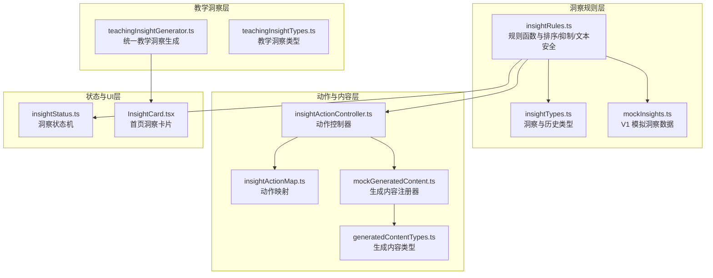
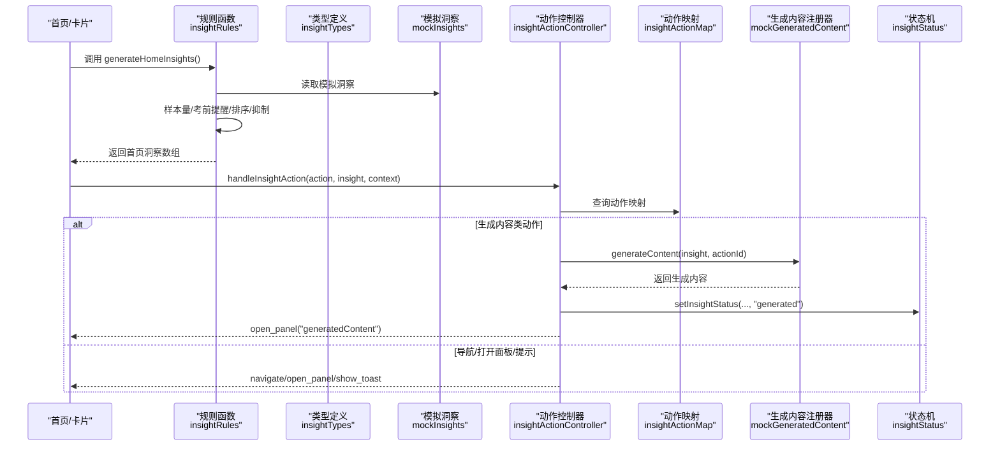
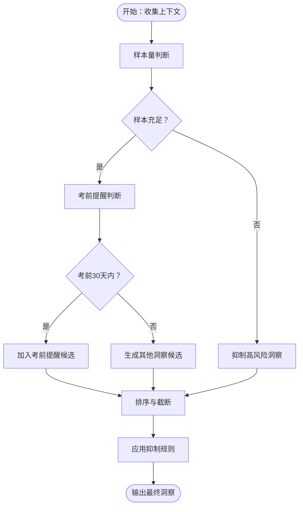
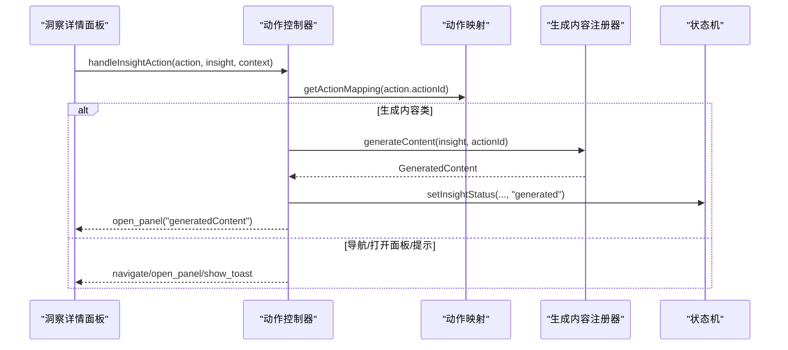
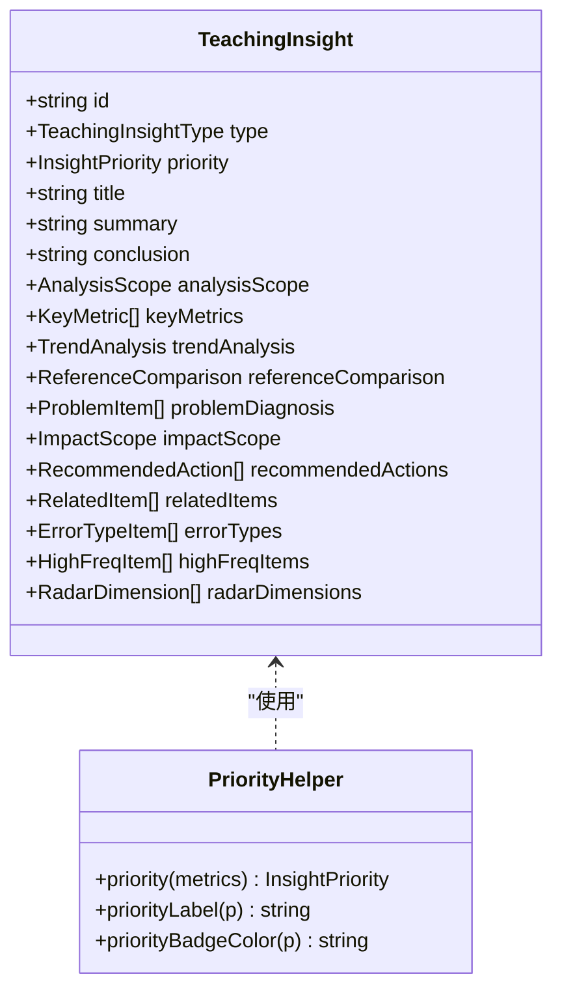
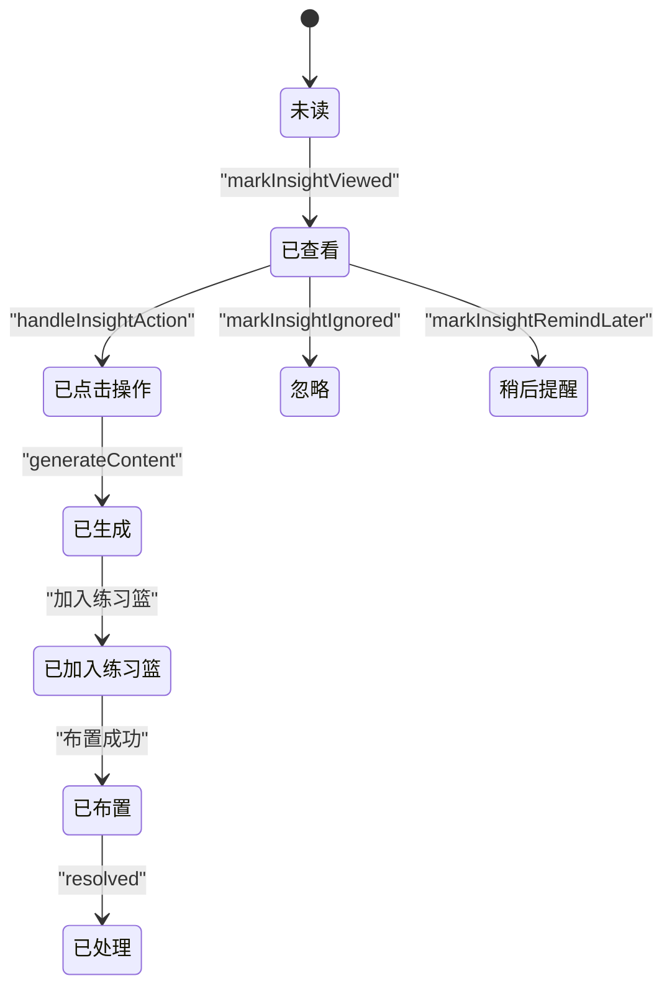
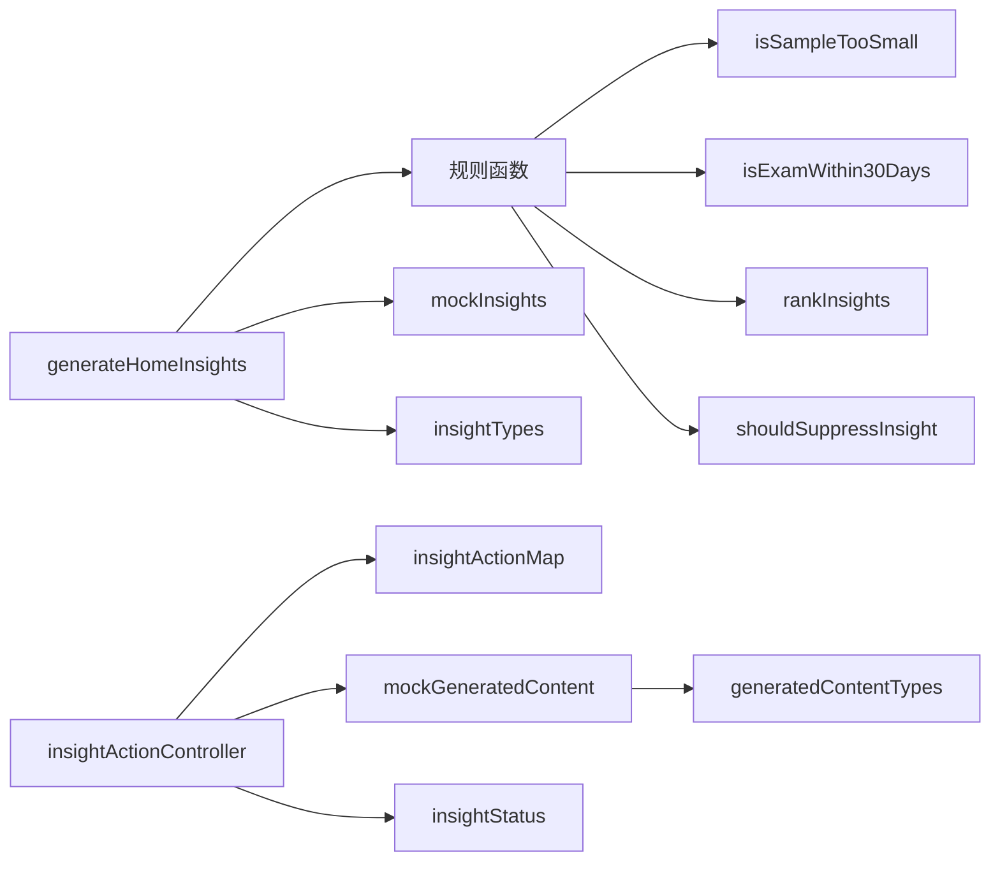

# 洞察生成架构

<cite>
**本文引用的文件**
- [insightRules.ts](file://src/ai/insights/insightRules.ts)
- [insightTypes.ts](file://src/ai/insights/insightTypes.ts)
- [mockInsights.ts](file://src/ai/insights/mockInsights.ts)
- [insightActionController.ts](file://src/ai/insights/insightActionController.ts)
- [insightActionMap.ts](file://src/ai/insights/insightActionMap.ts)
- [mockGeneratedContent.ts](file://src/ai/insights/mockGeneratedContent.ts)
- [insightStatus.ts](file://src/ai/insights/insightStatus.ts)
- [teachingInsightGenerator.ts](file://src/ai/insights/teachingInsightGenerator.ts)
- [teachingInsightTypes.ts](file://src/ai/insights/teachingInsightTypes.ts)
- [generatedContentTypes.ts](file://src/ai/insights/generatedContentTypes.ts)
- [runInsightV1SelfCheck.ts](file://src/ai/insights/runInsightV1SelfCheck.ts)
- [runGeneratedContentFlowSelfCheck.ts](file://src/ai/insights/runGeneratedContentFlowSelfCheck.ts)
- [InsightCard.tsx](file://src/ai/components/InsightCard.tsx)
- [ai-insight-design.md](file://docs/ai-insight-design.md)
- [ai-insight-rule-functions.md](file://docs/ai-insight-rule-functions.md)
</cite>

## 目录
1. [简介](#简介)
2. [项目结构](#项目结构)
3. [核心组件](#核心组件)
4. [架构总览](#架构总览)
5. [详细组件分析](#详细组件分析)
6. [依赖分析](#依赖分析)
7. [性能考量](#性能考量)
8. [故障排查指南](#故障排查指南)
9. [结论](#结论)
10. [附录](#附录)

## 简介
本文件面向小天AI教育平台的洞察生成架构，系统化阐述洞察规则函数的设计原理、洞察优先级排序机制、洞察质量控制流程，以及从数据收集、规则匹配到最终输出的完整生命周期管理。文档还涵盖洞察系统的扩展性设计、状态管理与历史记录机制、性能优化策略与错误处理机制，并提供开发者实现细节与最佳实践指南。

## 项目结构
洞察生成相关代码位于 src/ai/insights 目录，采用“规则函数 + 类型定义 + 动作映射 + 生成内容 + 状态机”的分层组织方式，配合 docs 下的设计与规则文档，形成“设计—规则—实现—测试”的闭环。

图表来源
- [insightRules.ts:1-179](file://src/ai/insights/insightRules.ts#L1-L179)
- [insightTypes.ts:1-113](file://src/ai/insights/insightTypes.ts#L1-L113)
- [mockInsights.ts:1-376](file://src/ai/insights/mockInsights.ts#L1-L376)
- [insightActionController.ts:1-229](file://src/ai/insights/insightActionController.ts#L1-L229)
- [insightActionMap.ts:1-172](file://src/ai/insights/insightActionMap.ts#L1-L172)
- [mockGeneratedContent.ts:1-246](file://src/ai/insights/mockGeneratedContent.ts#L1-L246)
- [generatedContentTypes.ts:1-114](file://src/ai/insights/generatedContentTypes.ts#L1-L114)
- [teachingInsightGenerator.ts:1-388](file://src/ai/insights/teachingInsightGenerator.ts#L1-L388)
- [teachingInsightTypes.ts:1-191](file://src/ai/insights/teachingInsightTypes.ts#L1-L191)
- [insightStatus.ts:1-60](file://src/ai/insights/insightStatus.ts#L1-L60)
- [InsightCard.tsx:1-84](file://src/ai/components/InsightCard.tsx#L1-L84)

章节来源
- [insightRules.ts:1-179](file://src/ai/insights/insightRules.ts#L1-L179)
- [insightTypes.ts:1-113](file://src/ai/insights/insightTypes.ts#L1-L113)
- [mockInsights.ts:1-376](file://src/ai/insights/mockInsights.ts#L1-L376)
- [insightActionController.ts:1-229](file://src/ai/insights/insightActionController.ts#L1-L229)
- [insightActionMap.ts:1-172](file://src/ai/insights/insightActionMap.ts#L1-L172)
- [mockGeneratedContent.ts:1-246](file://src/ai/insights/mockGeneratedContent.ts#L1-L246)
- [generatedContentTypes.ts:1-114](file://src/ai/insights/generatedContentTypes.ts#L1-L114)
- [teachingInsightGenerator.ts:1-388](file://src/ai/insights/teachingInsightGenerator.ts#L1-L388)
- [teachingInsightTypes.ts:1-191](file://src/ai/insights/teachingInsightTypes.ts#L1-L191)
- [insightStatus.ts:1-60](file://src/ai/insights/insightStatus.ts#L1-L60)
- [InsightCard.tsx:1-84](file://src/ai/components/InsightCard.tsx#L1-L84)

## 核心组件
- 规则函数与排序/抑制/文本安全：负责样本量判断、考前提醒判断、洞察排序、抑制策略与文案安全检查。
- 类型定义：统一洞察、证据、动作、样本信息、考试信息、历史记录等结构。
- 动作控制器与映射：将洞察动作路由到导航、打开面板、显示提示或生成内容。
- 生成内容注册器：按动作ID注册内容生成器，产出可编辑/可布置的练习或讲评内容。
- 教学洞察生成器：统一构建教学阶段/词汇/听力口语/写作洞察，内置优先级判定。
- 状态机：追踪洞察生命周期状态，支持内存存储与查询。
- UI卡片：首页洞察卡片组件，承载洞察摘要与交互入口。

章节来源
- [insightRules.ts:1-179](file://src/ai/insights/insightRules.ts#L1-L179)
- [insightTypes.ts:1-113](file://src/ai/insights/insightTypes.ts#L1-L113)
- [insightActionController.ts:1-229](file://src/ai/insights/insightActionController.ts#L1-L229)
- [insightActionMap.ts:1-172](file://src/ai/insights/insightActionMap.ts#L1-L172)
- [mockGeneratedContent.ts:1-246](file://src/ai/insights/mockGeneratedContent.ts#L1-L246)
- [teachingInsightGenerator.ts:1-388](file://src/ai/insights/teachingInsightGenerator.ts#L1-L388)
- [insightStatus.ts:1-60](file://src/ai/insights/insightStatus.ts#L1-L60)
- [InsightCard.tsx:1-84](file://src/ai/components/InsightCard.tsx#L1-L84)

## 架构总览
洞察生成从“首页洞察”“教学洞察”两条主线展开，前者基于规则函数与模拟数据生成首页提醒；后者通过统一生成器产出结构化教学洞察。动作控制器根据动作映射决定路由行为，生成内容注册器产出可编辑内容并与状态机联动。

图表来源
- [insightRules.ts:91-128](file://src/ai/insights/insightRules.ts#L91-L128)
- [mockInsights.ts:11-376](file://src/ai/insights/mockInsights.ts#L11-L376)
- [insightActionController.ts:48-157](file://src/ai/insights/insightActionController.ts#L48-L157)
- [insightActionMap.ts:47-161](file://src/ai/insights/insightActionMap.ts#L47-L161)
- [mockGeneratedContent.ts:232-239](file://src/ai/insights/mockGeneratedContent.ts#L232-L239)
- [insightStatus.ts:23-29](file://src/ai/insights/insightStatus.ts#L23-L29)

## 详细组件分析

### 规则函数与洞察生命周期
- 样本量判断：根据班级规模与参与人数计算样本是否偏少，避免高风险结论。
- 考前提醒判断：基于考试日期与当前日期判断是否处于考前30天。
- 洞察排序：优先级（exam_reminder置顶）→ 风险等级 → 创建时间；考试期与非考试期排序策略不同。
- 抑制策略：样本量不足、重复、已处理、关闭、考试结束、地区不适用、无动作等场景抑制展示。
- 文案安全：禁止词检测与问题上报，保障输出合规。

图表来源
- [insightRules.ts:23-89](file://src/ai/insights/insightRules.ts#L23-L89)
- [insightRules.ts:102-128](file://src/ai/insights/insightRules.ts#L102-L128)

章节来源
- [insightRules.ts:1-179](file://src/ai/insights/insightRules.ts#L1-L179)
- [ai-insight-design.md:84-117](file://docs/ai-insight-design.md#L84-L117)
- [ai-insight-rule-functions.md:414-470](file://docs/ai-insight-rule-functions.md#L414-L470)

### 动作控制器与生成内容流程
- 动作映射：将 actionId 映射到类型（生成/查看/推荐/布置/加入篮/占位），并携带目标路径、查询参数、工作流ID、面板名称、作业类型、生成内容类型与是否需要确认等元数据。
- 控制器路由：根据映射类型与来源（洞察详情/抽屉/首页快捷动作）决定返回指令（导航/打开面板/显示提示），并处理生成内容流程。
- 生成内容注册器：按动作ID注册生成器，产出内容对象（可编辑、可预览、可布置、可加入练习篮），并更新洞察状态为“已生成”。

图表来源
- [insightActionController.ts:48-157](file://src/ai/insights/insightActionController.ts#L48-L157)
- [insightActionMap.ts:47-161](file://src/ai/insights/insightActionMap.ts#L47-L161)
- [mockGeneratedContent.ts:232-239](file://src/ai/insights/mockGeneratedContent.ts#L232-L239)
- [insightStatus.ts:23-29](file://src/ai/insights/insightStatus.ts#L23-L29)

章节来源
- [insightActionController.ts:1-229](file://src/ai/insights/insightActionController.ts#L1-L229)
- [insightActionMap.ts:1-172](file://src/ai/insights/insightActionMap.ts#L1-L172)
- [mockGeneratedContent.ts:1-246](file://src/ai/insights/mockGeneratedContent.ts#L1-L246)
- [generatedContentTypes.ts:1-114](file://src/ai/insights/generatedContentTypes.ts#L1-L114)

### 教学洞察生成器与优先级
- 统一接口：按类型（practiceStage/vocabulary/listeningSpeaking/writing）生成结构化教学洞察。
- 优先级判定：基于指标阈值与趋势，将洞察分为 needs_attention/suggest_attention/continue_observe/improving 四档。
- 结构化输出：包含标题、摘要、结论、分析范围、关键指标、趋势分析、对比分析、问题诊断、影响范围、推荐动作、相关条目与雷达维度等。

图表来源
- [teachingInsightGenerator.ts:12-66](file://src/ai/insights/teachingInsightGenerator.ts#L12-L66)
- [teachingInsightTypes.ts:137-191](file://src/ai/insights/teachingInsightTypes.ts#L137-L191)

章节来源
- [teachingInsightGenerator.ts:1-388](file://src/ai/insights/teachingInsightGenerator.ts#L1-L388)
- [teachingInsightTypes.ts:1-191](file://src/ai/insights/teachingInsightTypes.ts#L1-L191)

### 类型系统与状态管理
- 洞察类型：模块、风险等级、优先级、范围、证据、分析、建议、动作、样本信息、考试信息、创建/过期时间、状态等。
- 历史记录：最近洞察、最近动作、已关闭洞察、最后生成时间。
- 状态机：洞察生命周期状态（未读/已查看/已点击操作/已生成/加入练习篮/已布置/忽略/稍后提醒/已处理），内存Map存储，提供查询与重置。

图表来源
- [insightStatus.ts:8-53](file://src/ai/insights/insightStatus.ts#L8-L53)

章节来源
- [insightTypes.ts:1-113](file://src/ai/insights/insightTypes.ts#L1-L113)
- [insightStatus.ts:1-60](file://src/ai/insights/insightStatus.ts#L1-L60)

### UI集成与展示
- 首页洞察卡片：根据风险等级与模块渲染颜色与徽标，展示标题与证据摘要，并引导查看分析。
- 教学洞察卡片：按优先级配置色带与徽标，展示摘要与标签，打开抽屉查看详情。

章节来源
- [InsightCard.tsx:1-84](file://src/ai/components/InsightCard.tsx#L1-L84)

## 依赖分析
洞察生成的函数依赖关系如下：

图表来源
- [insightRules.ts:102-128](file://src/ai/insights/insightRules.ts#L102-L128)
- [insightActionController.ts:16-20](file://src/ai/insights/insightActionController.ts#L16-L20)
- [insightActionMap.ts:165-167](file://src/ai/insights/insightActionMap.ts#L165-L167)
- [mockGeneratedContent.ts:14-20](file://src/ai/insights/mockGeneratedContent.ts#L14-L20)

章节来源
- [ai-insight-rule-functions.md:575-609](file://docs/ai-insight-rule-functions.md#L575-L609)

## 性能考量
- 规则函数与排序：O(n log n)，n为候选洞察数；排序与抑制逻辑尽量在小集合上执行。
- 文案安全检查：线性扫描字段与禁止词列表，复杂度 O(k·m)，k为洞察字段数，m为禁止词数；可通过预编译正则或集合查找优化。
- 生成内容注册器：按动作ID查找生成器，哈希表查找 O(1)；内容对象构造为线性复杂度。
- 状态机：Map存取 O(1)，适合高频状态变更。
- 建议优化
  - 对大规模数据源，提前过滤与缓存常用阈值与历史记录。
  - 将禁止词检查改为一次性预处理（小写化、去重、构建集合）。
  - 将排序与抑制合并为一次遍历，减少多次扫描。
  - 对生成内容注册器使用延迟初始化与按需加载。

[本节为通用指导，无需特定文件引用]

## 故障排查指南
- 自检工具
  - 首页洞察V1自检：验证样本量判断、考前提醒判断、首页洞察数量与排序、文案安全。
  - 生成内容流程自检：验证内容生成、控制器路由、状态联动与内容状态流转。
- 常见问题
  - 样本量不足导致高风险洞察未生成：检查 isSampleTooSmall 与 shouldGenerateStrongInsight 的调整逻辑。
  - 考前提醒未置顶：检查 isExamWithin30Days 与 rankInsights 的考试期特殊规则。
  - 动作未路由：检查 insightActionMap 中是否存在对应 actionId 的映射。
  - 生成内容为空：检查生成器注册与 generateContent 返回值。
  - 文案违规：检查禁止词列表与 validateInsightText 的问题输出。

章节来源
- [runInsightV1SelfCheck.ts:1-107](file://src/ai/insights/runInsightV1SelfCheck.ts#L1-L107)
- [runGeneratedContentFlowSelfCheck.ts:1-170](file://src/ai/insights/runGeneratedContentFlowSelfCheck.ts#L1-L170)

## 结论
洞察生成架构以规则函数为核心，结合类型系统、动作映射与生成内容注册器，实现了从数据到洞察再到行动的闭环。通过样本量与抑制规则保障质量，通过优先级与排序确保关键信息优先触达，通过状态机与UI卡片实现完整的生命周期管理。该架构具备良好的扩展性，便于后续接入真实数据源与持久化存储。

[本节为总结，无需特定文件引用]

## 附录

### 扩展性设计与最佳实践
- 新洞察类型添加
  - 在规则函数中新增生成函数，定义触发条件、判断逻辑与动作集合。
  - 在类型定义中扩展模块枚举与证据/动作结构。
  - 在首页生成函数中加入候选生成与排序逻辑。
  - 在动作映射中为推荐动作提供元数据。
- 现有规则修改
  - 修改阈值与权重时，同步更新自检工具与设计文档中的规则说明。
  - 对抑制规则与文案安全策略进行回归测试。
- 状态与历史
  - 状态机为内存存储，P2可替换为持久化；历史记录可用于去重与个性化推荐。
- 性能与错误处理
  - 对热点路径进行缓存与批量处理；对异常输入进行防御性校验与降级处理。

章节来源
- [ai-insight-design.md:120-160](file://docs/ai-insight-design.md#L120-L160)
- [ai-insight-rule-functions.md:575-631](file://docs/ai-insight-rule-functions.md#L575-L631)