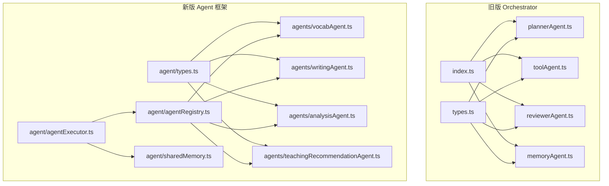
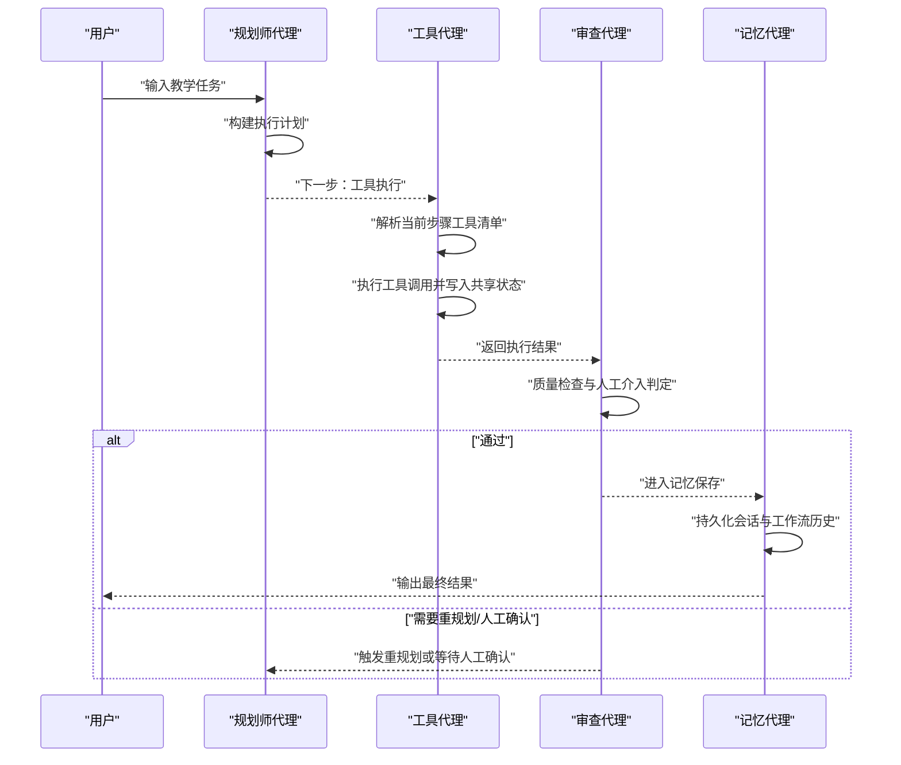
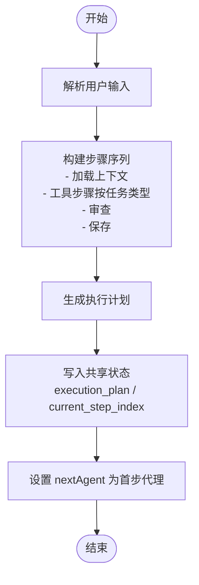
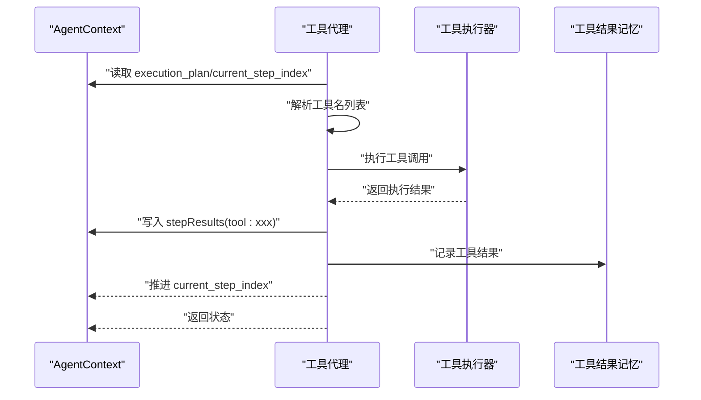
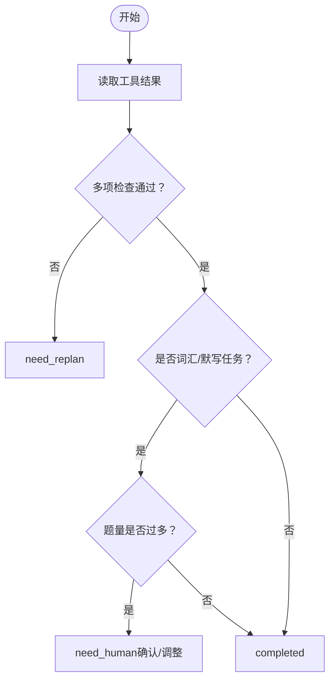
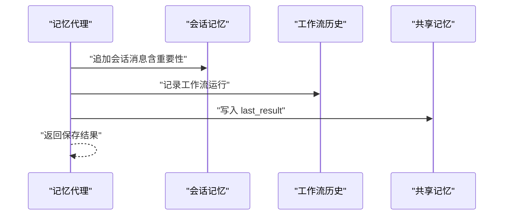
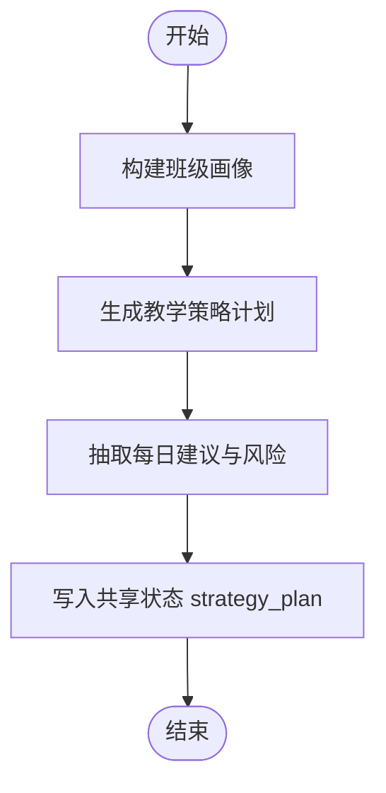
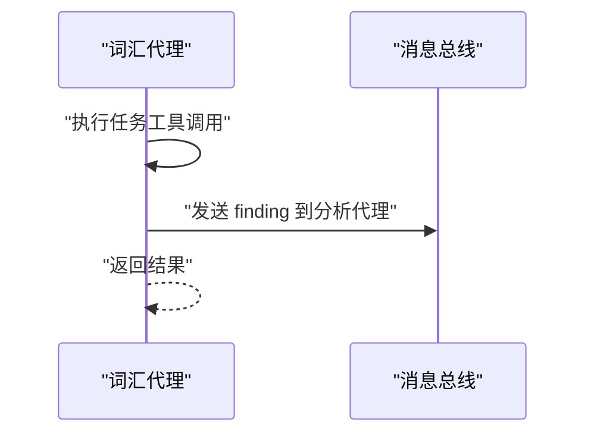
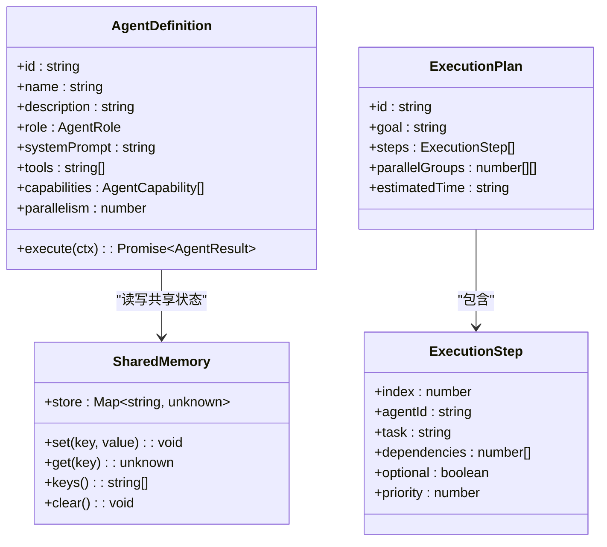
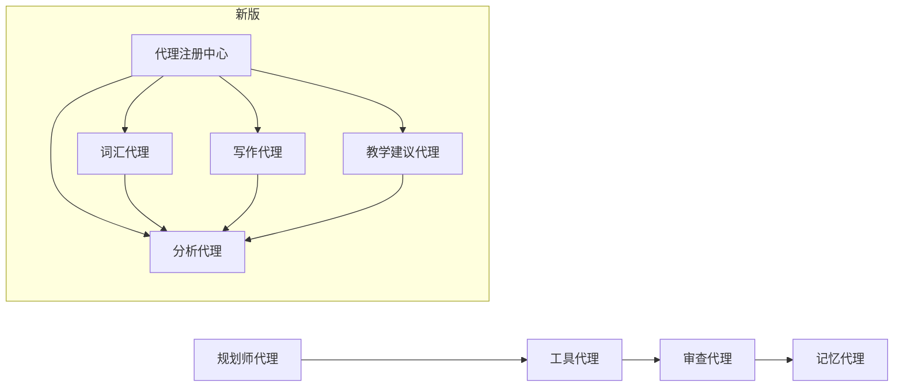

# 专用代理实现

<cite>
**本文引用的文件**
- [src/ai/agents/index.ts](file://src/ai/agents/index.ts)
- [src/ai/agents/types.ts](file://src/ai/agents/types.ts)
- [src/ai/agent/index.ts](file://src/ai/agent/index.ts)
- [src/ai/agent/types.ts](file://src/ai/agent/types.ts)
- [src/ai/agent/agentRegistry.ts](file://src/ai/agent/agentRegistry.ts)
- [src/ai/agent/agentExecutor.ts](file://src/ai/agent/agentExecutor.ts)
- [src/ai/agent/sharedMemory.ts](file://src/ai/agent/sharedMemory.ts)
- [src/ai/agents/plannerAgent.ts](file://src/ai/agents/plannerAgent.ts)
- [src/ai/agents/toolAgent.ts](file://src/ai/agents/toolAgent.ts)
- [src/ai/agents/reviewerAgent.ts](file://src/ai/agents/reviewerAgent.ts)
- [src/ai/agents/memoryAgent.ts](file://src/ai/agents/memoryAgent.ts)
- [src/ai/agents/vocabAgent.ts](file://src/ai/agents/vocabAgent.ts)
- [src/ai/agents/writingAgent.ts](file://src/ai/agents/writingAgent.ts)
- [src/ai/agents/analysisAgent.ts](file://src/ai/agents/analysisAgent.ts)
- [src/ai/agents/teachingRecommendationAgent.ts](file://src/ai/agents/teachingRecommendationAgent.ts)
</cite>

## 目录
1. [引言](#引言)
2. [项目结构](#项目结构)
3. [核心组件](#核心组件)
4. [架构总览](#架构总览)
5. [详细组件分析](#详细组件分析)
6. [依赖关系分析](#依赖关系分析)
7. [性能考量](#性能考量)
8. [故障排查指南](#故障排查指南)
9. [结论](#结论)
10. [附录](#附录)

## 引言
本文件面向小天AI教育平台的专用代理系统，系统性梳理“规划师代理、工具代理、审查代理、记忆代理、教学建议代理、词汇代理、写作代理、分析代理”的设计与实现，阐明职责边界、协作模式、状态管理、决策逻辑与执行策略，并提供扩展与自定义指南、调试与监控方法以及性能优化建议。文档兼顾技术深度与可读性，帮助开发者快速理解并高效使用该代理体系。

## 项目结构
专用代理系统主要分布在以下路径：
- 旧版多代理编排（orchestrator）：src/ai/agents/*
- 新版多代理框架（agent framework）：src/ai/agent/*

新版框架提供了更清晰的 AgentDefinition、ExecutionPlan、消息总线与共享内存抽象，支持按能力匹配与并行执行；旧版orchestrator则聚焦于会话级的规划-工具-审查-记忆闭环。

图表来源
- [src/ai/agents/index.ts:1-26](file://src/ai/agents/index.ts#L1-L26)
- [src/ai/agents/types.ts:1-142](file://src/ai/agents/types.ts#L1-L142)
- [src/ai/agent/index.ts:1-57](file://src/ai/agent/index.ts#L1-L57)
- [src/ai/agent/types.ts:1-131](file://src/ai/agent/types.ts#L1-L131)
- [src/ai/agent/agentRegistry.ts:1-62](file://src/ai/agent/agentRegistry.ts#L1-L62)
- [src/ai/agent/agentExecutor.ts:1-165](file://src/ai/agent/agentExecutor.ts#L1-L165)
- [src/ai/agent/sharedMemory.ts:1-29](file://src/ai/agent/sharedMemory.ts#L1-L29)
- [src/ai/agents/plannerAgent.ts:1-118](file://src/ai/agents/plannerAgent.ts#L1-L118)
- [src/ai/agents/toolAgent.ts:1-97](file://src/ai/agents/toolAgent.ts#L1-L97)
- [src/ai/agents/reviewerAgent.ts:1-146](file://src/ai/agents/reviewerAgent.ts#L1-L146)
- [src/ai/agents/memoryAgent.ts:1-78](file://src/ai/agents/memoryAgent.ts#L1-L78)
- [src/ai/agents/vocabAgent.ts:1-73](file://src/ai/agents/vocabAgent.ts#L1-L73)
- [src/ai/agents/writingAgent.ts:1-56](file://src/ai/agents/writingAgent.ts#L1-L56)
- [src/ai/agents/analysisAgent.ts:1-63](file://src/ai/agents/analysisAgent.ts#L1-L63)
- [src/ai/agents/teachingRecommendationAgent.ts:1-76](file://src/ai/agents/teachingRecommendationAgent.ts#L1-L76)

章节来源
- [src/ai/agents/index.ts:1-26](file://src/ai/agents/index.ts#L1-L26)
- [src/ai/agent/index.ts:1-57](file://src/ai/agent/index.ts#L1-L57)

## 核心组件
- 代理接口与上下文
  - 旧版：Agent、AgentContext、AgentResult、ExecutionPlan、PlanStep、OrchestratorTrace 等类型定义，用于会话级编排。
  - 新版：AgentDefinition、AgentExecuteContext、AgentResult、ExecutionPlan、ExecutionStep、AgentMessage、SharedMemory 等，支持能力匹配、消息总线与并行执行。
- 注册中心：集中注册与发现代理，支持按能力关键词匹配与按角色过滤。
- 执行器：接收 ExecutionPlan，按并行组顺序执行，收集结果并维护共享内存与消息。
- 共享内存：跨代理读写共享数据，作为执行状态与中间结果的载体。
- 消息总线：代理间异步通信通道，支持定向与广播消息。

章节来源
- [src/ai/agents/types.ts:1-142](file://src/ai/agents/types.ts#L1-L142)
- [src/ai/agent/types.ts:1-131](file://src/ai/agent/types.ts#L1-L131)
- [src/ai/agent/agentRegistry.ts:1-62](file://src/ai/agent/agentRegistry.ts#L1-L62)
- [src/ai/agent/agentExecutor.ts:1-165](file://src/ai/agent/agentExecutor.ts#L1-L165)
- [src/ai/agent/sharedMemory.ts:1-29](file://src/ai/agent/sharedMemory.ts#L1-L29)

## 架构总览
旧版Orchestrator采用“规划 → 工具 → 审查 → 记忆”的固定轮次闭环；新版框架通过ExecutionPlan的并行分组与依赖关系，支持更灵活的协作模式。

图表来源
- [src/ai/agents/plannerAgent.ts:1-118](file://src/ai/agents/plannerAgent.ts#L1-L118)
- [src/ai/agents/toolAgent.ts:1-97](file://src/ai/agents/toolAgent.ts#L1-L97)
- [src/ai/agents/reviewerAgent.ts:1-146](file://src/ai/agents/reviewerAgent.ts#L1-L146)
- [src/ai/agents/memoryAgent.ts:1-78](file://src/ai/agents/memoryAgent.ts#L1-L78)

## 详细组件分析

### 规划师代理（Planner Agent）
- 职责
  - 解析用户输入，动态生成执行计划（ExecutionPlan），包含步骤顺序、依赖与预估轮次。
  - 在计划中插入“加载上下文”“审查”“保存”等通用步骤，并根据任务类型（词汇/默写、试卷、分析）插入相应工具步骤。
- 关键行为
  - 基于正则匹配识别任务类型，构建步骤序列。
  - 将计划与初始索引写入共享状态，设置下一步代理。
- 初始化与运行时
  - 输入：sessionId、userInput、metadata、stepResults、tools、strategy。
  - 输出：AgentResult（status、nextAgent、summary、可选output）。
- 使用场景
  - 任何需要“先规划再执行”的教学任务，如生成词汇练习、试卷、学情分析等。

图表来源
- [src/ai/agents/plannerAgent.ts:1-118](file://src/ai/agents/plannerAgent.ts#L1-L118)

章节来源
- [src/ai/agents/plannerAgent.ts:1-118](file://src/ai/agents/plannerAgent.ts#L1-L118)

### 工具代理（Tool Agent）
- 职责
  - 依据当前步骤的工具清单，构造工具调用请求并执行。
  - 将工具执行结果写入共享状态（带前缀），并记录到持久化工具结果记忆。
  - 推进当前步骤索引，返回下一步状态。
- 关键行为
  - 从共享状态读取计划与当前步骤，解析工具名列表。
  - 构造工具调用参数（unit、grade、textbook、quantity等）。
  - 执行后写入多个键值（原始数据与摘要），并记录到工具结果记忆。
- 初始化与运行时
  - 输入：AgentContext（包含stepResults、metadata、sessionId）。
  - 输出：AgentResult（status=completed/need_replan，summary、可选error）。
- 使用场景
  - 所有需要外部工具（如获取词汇、筛选难度、生成默写）的任务步骤。

图表来源
- [src/ai/agents/toolAgent.ts:1-97](file://src/ai/agents/toolAgent.ts#L1-L97)

章节来源
- [src/ai/agents/toolAgent.ts:1-97](file://src/ai/agents/toolAgent.ts#L1-L97)

### 审查代理（Reviewer Agent）
- 职责
  - 对工具执行结果进行质量检查，必要时请求人工确认或触发重规划。
- 关键行为
  - 检查词汇总量、默写内容数量、筛选结果有效性等。
  - 对词汇/默写类任务，若题量过多或需调整难度，请求教师确认。
  - 任一检查不通过即触发重规划；否则通过。
- 初始化与运行时
  - 输入：AgentContext（包含stepResults、userInput）。
  - 输出：AgentResult（status=completed/need_replan/need_human，humanRequest可选）。
- 使用场景
  - 保证生成内容质量与教学适切性，避免低效或错误输出。

图表来源
- [src/ai/agents/reviewerAgent.ts:1-146](file://src/ai/agents/reviewerAgent.ts#L1-L146)

章节来源
- [src/ai/agents/reviewerAgent.ts:1-146](file://src/ai/agents/reviewerAgent.ts#L1-L146)

### 记忆代理（Memory Agent）
- 职责
  - 将执行结果持久化到会话记忆、工作流历史与共享记忆，便于后续代理复用。
- 关键行为
  - 遍历stepResults，写入会话消息（含重要性评分）。
  - 记录工作流运行历史（触发条件、状态、摘要）。
  - 写入共享记忆中的last_result，供其他代理读取。
- 初始化与运行时
  - 输入：AgentContext（包含sessionId、userInput、metadata、stepResults）。
  - 输出：AgentResult（summary、savedKeys）。
- 使用场景
  - 所有流程的收尾阶段，确保结果可追溯、可复用。

图表来源
- [src/ai/agents/memoryAgent.ts:1-78](file://src/ai/agents/memoryAgent.ts#L1-L78)

章节来源
- [src/ai/agents/memoryAgent.ts:1-78](file://src/ai/agents/memoryAgent.ts#L1-L78)

### 教学建议代理（Teaching Recommendation Agent）
- 职责
  - 基于班级画像与策略引擎生成每日教学建议与风险提醒。
- 关键行为
  - 构建ClassProfile（年级、班级、教材、单元、平均分、薄弱点、强项、区域、阶段等）。
  - 调用策略引擎生成TeachingStrategyPlan，抽取前N条建议与风险提示。
  - 将策略计划写入共享状态，供下游使用。
- 初始化与运行时
  - 输入：AgentContext（包含metadata、stepResults）。
  - 输出：AgentResult（status=completed，summary、output含plan与dailySuggestions）。
- 使用场景
  - 日常教学决策支持与风险预警。

图表来源
- [src/ai/agents/teachingRecommendationAgent.ts:1-76](file://src/ai/agents/teachingRecommendationAgent.ts#L1-L76)

章节来源
- [src/ai/agents/teachingRecommendationAgent.ts:1-76](file://src/ai/agents/teachingRecommendationAgent.ts#L1-L76)

### 词汇代理（Vocab Agent）
- 职责
  - 专攻词汇任务：获取词汇表、筛选重点词、生成默写/听写内容。
- 关键行为
  - 使用AgentDefinition定义角色、能力与工具权限。
  - 通过agentChatLoop与工具协作，完成后向分析代理发送“发现”消息。
- 初始化与运行时
  - 输入：AgentExecuteContext（task、runtimeContext、sharedMemory）。
  - 输出：AgentResult（success、output、data、duration）。
- 使用场景
  - 词汇教学、默写/听写生成、重点词筛选。

图表来源
- [src/ai/agents/vocabAgent.ts:1-73](file://src/ai/agents/vocabAgent.ts#L1-L73)

章节来源
- [src/ai/agents/vocabAgent.ts:1-73](file://src/ai/agents/vocabAgent.ts#L1-L73)

### 写作代理（Writing Agent）
- 职责
  - 作文批改、语法检查、写作建议。
- 关键行为
  - 向分析代理广播写作分析发现。
- 初始化与运行时
  - 输入：AgentExecuteContext。
  - 输出：AgentResult。
- 使用场景
  - 写作教学与个性化反馈。

章节来源
- [src/ai/agents/writingAgent.ts:1-56](file://src/ai/agents/writingAgent.ts#L1-L56)

### 分析代理（Analysis Agent）
- 职责
  - 学情分析、错题统计、风险识别、趋势预测、班级报告。
- 关键行为
  - 向全体代理广播学情分析结果。
- 初始化与运行时
  - 输入：AgentExecuteContext。
  - 输出：AgentResult。
- 使用场景
  - 教学诊断与策略制定。

章节来源
- [src/ai/agents/analysisAgent.ts:1-63](file://src/ai/agents/analysisAgent.ts#L1-L63)

### 新版框架：代理注册与执行
- 代理注册
  - 通过registerAgent集中注册，支持按能力关键词匹配与按角色过滤。
- 执行器
  - 接收ExecutionPlan，按并行组顺序执行；同组内并行；失败时可停止非可选步骤。
  - 维护SharedMemory与消息总线，存储每步结果与最近消息。
- 共享内存
  - Map结构，提供set/get/keys/clear，作为跨代理共享状态的核心。

图表来源
- [src/ai/agent/types.ts:1-131](file://src/ai/agent/types.ts#L1-L131)
- [src/ai/agent/agentRegistry.ts:1-62](file://src/ai/agent/agentRegistry.ts#L1-L62)
- [src/ai/agent/sharedMemory.ts:1-29](file://src/ai/agent/sharedMemory.ts#L1-L29)

章节来源
- [src/ai/agent/agentRegistry.ts:1-62](file://src/ai/agent/agentRegistry.ts#L1-L62)
- [src/ai/agent/agentExecutor.ts:1-165](file://src/ai/agent/agentExecutor.ts#L1-L165)
- [src/ai/agent/sharedMemory.ts:1-29](file://src/ai/agent/sharedMemory.ts#L1-L29)

## 依赖关系分析
- 代理间耦合
  - 旧版：planner → tool → reviewer → memory 形成强链路，耦合度高但简单明确。
  - 新版：通过SharedMemory与消息总线解耦，AgentDefinition之间通过能力与消息交互，耦合度降低。
- 外部依赖
  - 工具执行器：封装工具调用与结果记录。
  - 策略引擎：生成教学建议与风险提醒。
  - 记忆模块：会话记忆、工作流历史、工具结果记忆。
- 循环依赖
  - 通过消息总线与共享状态传递，避免直接循环引用。

图表来源
- [src/ai/agents/plannerAgent.ts:1-118](file://src/ai/agents/plannerAgent.ts#L1-L118)
- [src/ai/agents/toolAgent.ts:1-97](file://src/ai/agents/toolAgent.ts#L1-L97)
- [src/ai/agents/reviewerAgent.ts:1-146](file://src/ai/agents/reviewerAgent.ts#L1-L146)
- [src/ai/agents/memoryAgent.ts:1-78](file://src/ai/agents/memoryAgent.ts#L1-L78)
- [src/ai/agent/agentRegistry.ts:1-62](file://src/ai/agent/agentRegistry.ts#L1-L62)

章节来源
- [src/ai/agent/agentRegistry.ts:1-62](file://src/ai/agent/agentRegistry.ts#L1-L62)

## 性能考量
- 并行执行
  - 新版执行器按并行组并发执行，显著缩短总时长；建议合理划分并行组，避免资源争用。
- 工具调用批量化
  - 工具代理批量执行工具调用，减少往返开销；注意工具参数一致性与幂等性。
- 共享内存访问
  - 避免在热路径频繁读写大对象；对关键数据使用前缀键隔离。
- 日志与追踪
  - 为每个Agent与步骤记录耗时与摘要，便于定位瓶颈。
- 缓存与降级
  - 对高频查询（如词汇表）引入缓存；工具失败时提供降级策略（如默认参数或简化流程）。

## 故障排查指南
- 规划失败
  - 症状：规划无法生成或步骤缺失。
  - 排查：检查用户输入关键词匹配、正则规则与任务类型分支。
- 工具执行异常
  - 症状：部分工具失败或无结果。
  - 排查：查看工具调用参数、返回摘要与持久化记录；确认工具注册与权限。
- 审查拦截
  - 症状：被拒绝继续，需人工确认或重规划。
  - 排查：关注词汇数量、默写题量、筛选结果有效性；根据humanRequest调整参数或人工干预。
- 记忆写入失败
  - 症状：会话或历史未记录。
  - 排查：检查会话消息追加与工作流记录接口调用；确认sessionId与元数据完整性。
- 新版代理未注册
  - 症状：执行时报未知Agent。
  - 排查：确认代理在入口处自动注册；检查id重复与导入顺序。

章节来源
- [src/ai/agents/plannerAgent.ts:1-118](file://src/ai/agents/plannerAgent.ts#L1-L118)
- [src/ai/agents/toolAgent.ts:1-97](file://src/ai/agents/toolAgent.ts#L1-L97)
- [src/ai/agents/reviewerAgent.ts:1-146](file://src/ai/agents/reviewerAgent.ts#L1-L146)
- [src/ai/agents/memoryAgent.ts:1-78](file://src/ai/agents/memoryAgent.ts#L1-L78)
- [src/ai/agent/agentExecutor.ts:1-165](file://src/ai/agent/agentExecutor.ts#L1-L165)

## 结论
专用代理系统通过“旧版Orchestrator”与“新版Agent框架”两条路径，实现了从固定流程到灵活协作的演进。规划师、工具、审查、记忆代理构成稳定的会话闭环；词汇、写作、分析、教学建议代理则覆盖教学关键场景。通过共享内存与消息总线，代理间实现低耦合、高扩展的协作模式。建议在实际部署中结合并行策略、缓存与降级机制，持续优化性能与稳定性。

## 附录

### 开发者扩展与自定义指南
- 新增代理
  - 定义AgentDefinition（role、capabilities、tools、parallelism），实现execute方法。
  - 在入口自动注册，确保id唯一。
- 自定义规划
  - 扩展规划器：在buildPlan中新增任务类型分支与工具步骤。
- 自定义审查规则
  - 在审查代理中扩展检查项与人工确认选项。
- 自定义策略
  - 扩展教学建议代理：完善ClassProfile字段与策略引擎集成。

章节来源
- [src/ai/agent/types.ts:1-131](file://src/ai/agent/types.ts#L1-L131)
- [src/ai/agent/agentRegistry.ts:1-62](file://src/ai/agent/agentRegistry.ts#L1-L62)
- [src/ai/agents/plannerAgent.ts:1-118](file://src/ai/agents/plannerAgent.ts#L1-L118)
- [src/ai/agents/reviewerAgent.ts:1-146](file://src/ai/agents/reviewerAgent.ts#L1-L146)
- [src/ai/agents/teachingRecommendationAgent.ts:1-76](file://src/ai/agents/teachingRecommendationAgent.ts#L1-L76)