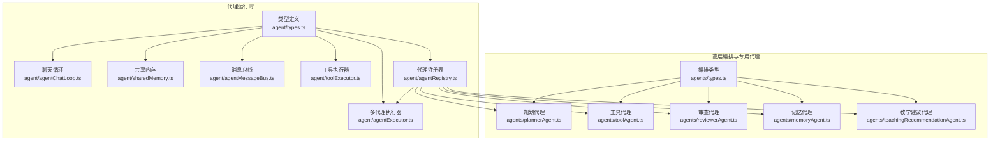
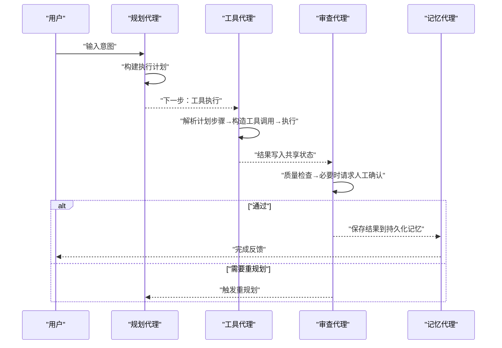
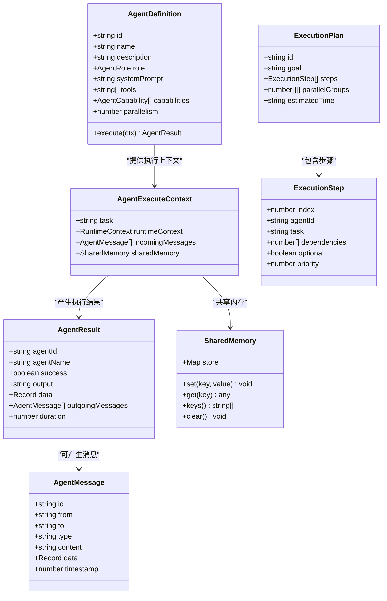
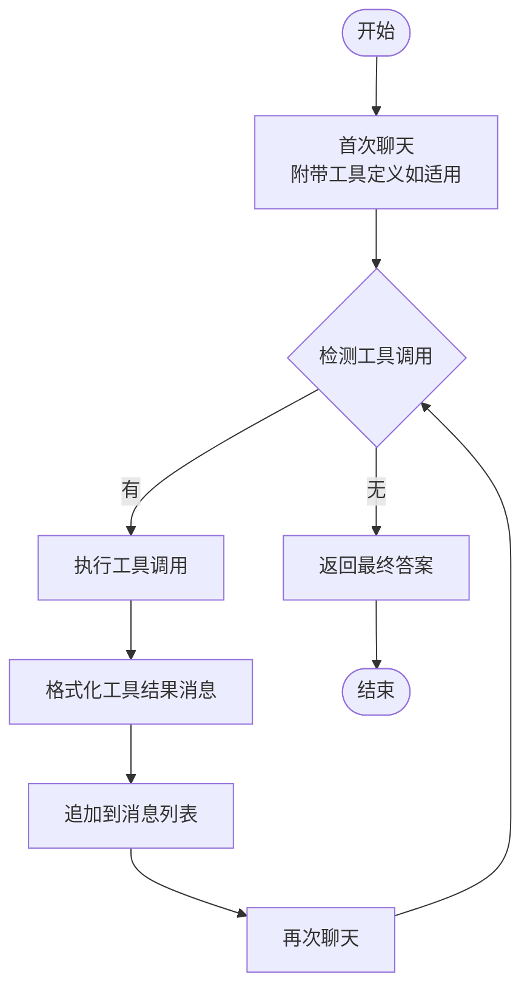
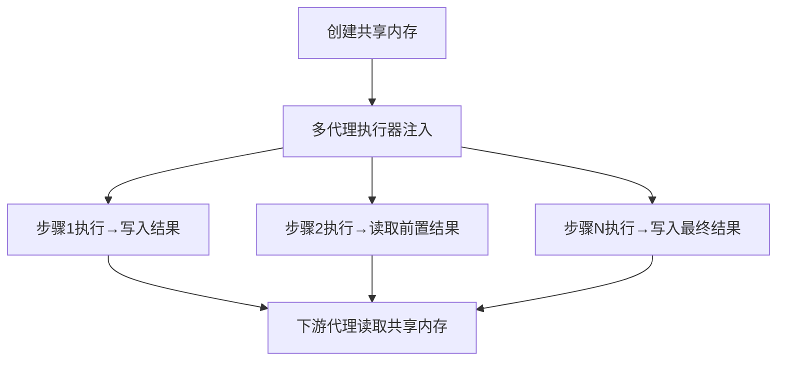
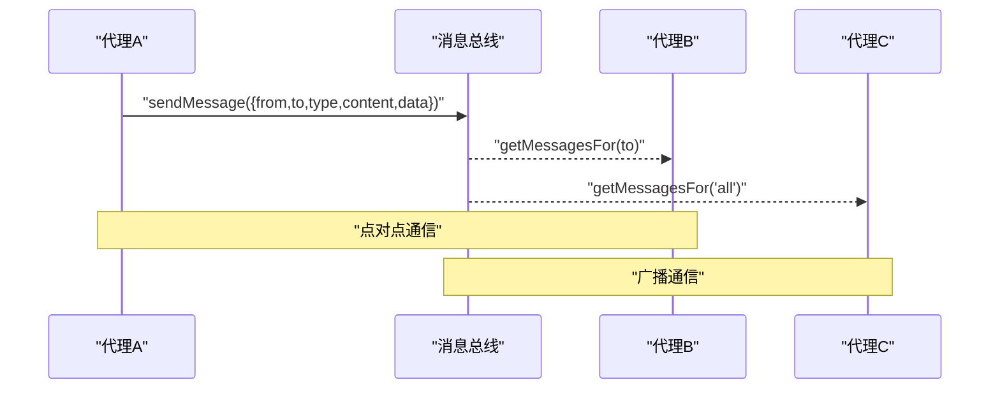
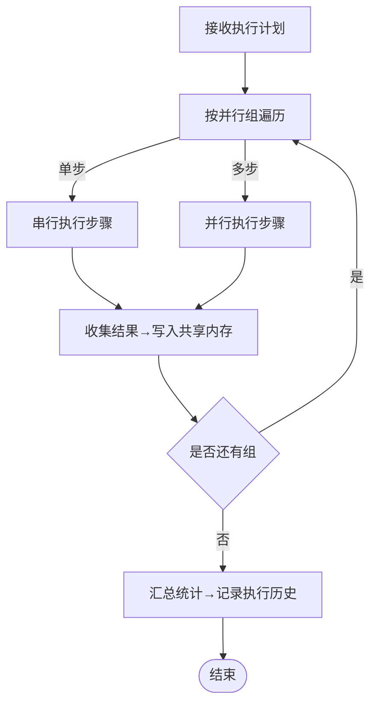
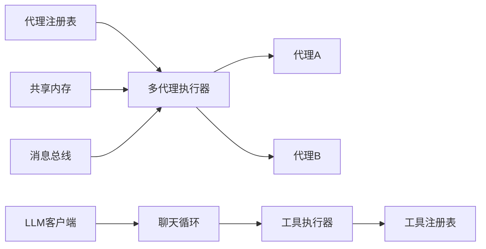

# 代理架构设计

<cite>
**本文引用的文件**
- [src/ai/agent/types.ts](file://src/ai/agent/types.ts)
- [src/ai/agent/agentChatLoop.ts](file://src/ai/agent/agentChatLoop.ts)
- [src/ai/agent/sharedMemory.ts](file://src/ai/agent/sharedMemory.ts)
- [src/ai/agent/agentExecutor.ts](file://src/ai/agent/agentExecutor.ts)
- [src/ai/agent/toolExecutor.ts](file://src/ai/agent/toolExecutor.ts)
- [src/ai/agent/agentMessageBus.ts](file://src/ai/agent/agentMessageBus.ts)
- [src/ai/agent/agentRegistry.ts](file://src/ai/agent/agentRegistry.ts)
- [src/ai/agent/index.ts](file://src/ai/agent/index.ts)
- [src/ai/agents/types.ts](file://src/ai/agents/types.ts)
- [src/ai/agents/plannerAgent.ts](file://src/ai/agents/plannerAgent.ts)
- [src/ai/agents/toolAgent.ts](file://src/ai/agents/toolAgent.ts)
- [src/ai/agents/reviewerAgent.ts](file://src/ai/agents/reviewerAgent.ts)
- [src/ai/agents/memoryAgent.ts](file://src/ai/agents/memoryAgent.ts)
- [src/ai/agents/teachingRecommendationAgent.ts](file://src/ai/agents/teachingRecommendationAgent.ts)
</cite>

## 目录
1. [引言](#引言)
2. [项目结构](#项目结构)
3. [核心组件](#核心组件)
4. [架构总览](#架构总览)
5. [详细组件分析](#详细组件分析)
6. [依赖关系分析](#依赖关系分析)
7. [性能考量](#性能考量)
8. [故障排查指南](#故障排查指南)
9. [结论](#结论)
10. [附录](#附录)

## 引言
本文件面向小天AI教育平台的智能代理架构，系统化阐述多角色协作的AI代理网络设计与实现。文档聚焦以下主题：
- 代理类型定义与职责边界：AgentDefinition、AgentRole、AgentCapability、AgentExecuteContext 等
- 代理执行流程与聊天循环机制：AgentChatLoop 的工作原理与消息传递模式
- 共享内存系统：SharedMemory 的创建与管理机制
- 代理间通信协议与消息格式：AgentMessage 的类型与路由规则
- 扩展性设计与性能优化：并行执行、工具调用循环、回退与人工介入
- 开发者实践指南：如何注册代理、构建执行计划、接入工具与消息总线

## 项目结构
小天AI教育平台的代理系统分为两层：
- 低层代理运行时与工具链：AgentChatLoop、AgentExecutor、SharedMemory、AgentMessageBus、ToolExecutor、AgentRegistry 等
- 高层编排与专用代理：Planner、Tool、Reviewer、Memory、TeachingRecommendation 等

图表来源
- [src/ai/agent/types.ts:1-131](file://src/ai/agent/types.ts#L1-L131)
- [src/ai/agent/agentChatLoop.ts:1-201](file://src/ai/agent/agentChatLoop.ts#L1-L201)
- [src/ai/agent/agentExecutor.ts:1-165](file://src/ai/agent/agentExecutor.ts#L1-L165)
- [src/ai/agent/sharedMemory.ts:1-29](file://src/ai/agent/sharedMemory.ts#L1-L29)
- [src/ai/agent/agentMessageBus.ts:1-58](file://src/ai/agent/agentMessageBus.ts#L1-L58)
- [src/ai/agent/toolExecutor.ts:1-135](file://src/ai/agent/toolExecutor.ts#L1-L135)
- [src/ai/agent/agentRegistry.ts:1-62](file://src/ai/agent/agentRegistry.ts#L1-L62)
- [src/ai/agents/types.ts:1-142](file://src/ai/agents/types.ts#L1-L142)
- [src/ai/agents/plannerAgent.ts:1-118](file://src/ai/agents/plannerAgent.ts#L1-L118)
- [src/ai/agents/toolAgent.ts:1-97](file://src/ai/agents/toolAgent.ts#L1-L97)
- [src/ai/agents/reviewerAgent.ts:1-146](file://src/ai/agents/reviewerAgent.ts#L1-L146)
- [src/ai/agents/memoryAgent.ts:1-78](file://src/ai/agents/memoryAgent.ts#L1-L78)
- [src/ai/agents/teachingRecommendationAgent.ts:1-76](file://src/ai/agents/teachingRecommendationAgent.ts#L1-L76)

章节来源
- [src/ai/agent/index.ts:1-57](file://src/ai/agent/index.ts#L1-L57)

## 核心组件
本节梳理代理系统的关键类型与职责，帮助快速建立整体认知。

- 类型定义与职责
  - AgentDefinition：代理的唯一标识、名称、描述、角色、系统提示、允许使用的工具、能力标签、并行优先级，以及执行函数
  - AgentExecuteContext：执行上下文，包含任务、运行时上下文、来自消息总线的入站消息、共享内存
  - AgentResult：执行结果，包含代理ID/名称、成功标志、输出文本、附加数据、出站消息、耗时
  - ExecutionPlan/ExecutionStep：执行计划与步骤，包含步骤索引、代理ID、任务描述、依赖、可选性、优先级
  - AgentMessage：代理间消息，包含消息ID、发送方、接收方（支持广播）、类型（上下文/发现/请求/结果/错误）、内容、数据、时间戳
  - SharedMemory：跨代理共享键值存储，提供 set/get/keys/clear 方法

- 代理注册与发现
  - AgentRegistry 提供注册、查询、按能力匹配、按角色过滤等能力，用于 Planner 决策

- 工具执行器
  - ToolExecutor 负责检测 LLM 响应中的工具调用、分发到工具注册表执行、格式化工具结果消息，形成“检测→执行→追加→再聊天”的循环

- 聊天循环
  - AgentChatLoop 封装了完整的工具调用闭环：首次聊天→检测工具调用→执行工具→追加工具结果→再次聊天→最终回答；支持最大轮次限制与计时统计

- 多代理执行器
  - AgentExecutor 接收 ExecutionPlan，按并行组顺序执行，收集 AgentResult，维护共享内存与消息总线，记录工作流执行历史

章节来源
- [src/ai/agent/types.ts:13-131](file://src/ai/agent/types.ts#L13-L131)
- [src/ai/agent/agentRegistry.ts:10-62](file://src/ai/agent/agentRegistry.ts#L10-L62)
- [src/ai/agent/toolExecutor.ts:45-135](file://src/ai/agent/toolExecutor.ts#L45-L135)
- [src/ai/agent/agentChatLoop.ts:70-201](file://src/ai/agent/agentChatLoop.ts#L70-L201)
- [src/ai/agent/agentExecutor.ts:36-165](file://src/ai/agent/agentExecutor.ts#L36-L165)

## 架构总览
小天AI教育平台采用“规划-工具-审查-记忆”的编排范式，结合“聊天循环+工具调用”的执行闭环，形成可扩展的多代理协作网络。

图表来源
- [src/ai/agents/plannerAgent.ts:17-38](file://src/ai/agents/plannerAgent.ts#L17-L38)
- [src/ai/agents/toolAgent.ts:18-93](file://src/ai/agents/toolAgent.ts#L18-L93)
- [src/ai/agents/reviewerAgent.ts:24-142](file://src/ai/agents/reviewerAgent.ts#L24-L142)
- [src/ai/agents/memoryAgent.ts:22-74](file://src/ai/agents/memoryAgent.ts#L22-L74)

## 详细组件分析

### 组件一：类型与接口体系
- 设计理念
  - 通过清晰的接口分离关注点：类型定义（职责、能力、消息、共享内存）、执行上下文（任务、运行时、消息、共享内存）、执行结果（输出、消息、耗时）
  - 支持多角色协作：AgentRole 定义规划、词汇、写作、听力、分析、考试、资源等角色；AgentCapability 通过关键词与描述匹配用户意图
  - 执行计划抽象：ExecutionPlan/ExecutionStep 描述步骤、依赖、可选性与优先级，便于并行组调度

图表来源
- [src/ai/agent/types.ts:13-131](file://src/ai/agent/types.ts#L13-L131)

章节来源
- [src/ai/agent/types.ts:13-131](file://src/ai/agent/types.ts#L13-L131)

### 组件二：聊天循环与工具调用闭环
- 工作原理
  - 首次聊天：携带系统提示与消息，若为首轮且存在工具，则附带工具定义
  - 工具检测：若响应包含工具调用，则进入工具执行阶段
  - 工具执行：将工具调用分发至工具注册表，收集执行结果
  - 结果注入：将工具结果格式化为消息并追加到对话历史，准备再次聊天
  - 最终回答：当无工具调用时，返回最终文本响应
  - 轮次控制：默认最多 N 轮，防止无限循环；记录总耗时与工具调用次数

图表来源
- [src/ai/agent/agentChatLoop.ts:112-179](file://src/ai/agent/agentChatLoop.ts#L112-L179)
- [src/ai/agent/toolExecutor.ts:45-135](file://src/ai/agent/toolExecutor.ts#L45-L135)

章节来源
- [src/ai/agent/agentChatLoop.ts:70-201](file://src/ai/agent/agentChatLoop.ts#L70-L201)
- [src/ai/agent/toolExecutor.ts:45-135](file://src/ai/agent/toolExecutor.ts#L45-L135)

### 组件三：共享内存系统
- 设计目标
  - 为所有代理提供统一的键值存储，支持跨代理读写
  - 在多代理执行期间，作为中间状态与结果的中转站
- 实现要点
  - 使用 Map 存储键值对，提供 set/get/keys/clear 方法
  - 在多代理执行器中创建并注入共享内存，确保执行前后状态一致
  - 执行器将每步结果写入共享内存，供下游代理读取

图表来源
- [src/ai/agent/sharedMemory.ts:10-29](file://src/ai/agent/sharedMemory.ts#L10-L29)
- [src/ai/agent/agentExecutor.ts:41-145](file://src/ai/agent/agentExecutor.ts#L41-L145)

章节来源
- [src/ai/agent/sharedMemory.ts:1-29](file://src/ai/agent/sharedMemory.ts#L1-L29)
- [src/ai/agent/agentExecutor.ts:36-165](file://src/ai/agent/agentExecutor.ts#L36-L165)

### 组件四：代理间通信协议与消息格式
- 消息模型
  - AgentMessage：包含唯一ID、发送方、接收方（支持广播）、类型（上下文/发现/请求/结果/错误）、内容、数据、时间戳
- 通信机制
  - 通过 AgentMessageBus 管理消息队列，支持按代理查询、按来源查询、获取最近消息、清空队列
  - 在多代理执行器中，将上游代理的出站消息作为下游代理的入站消息，形成消息链路
- 路由规则
  - 支持点对点与广播两种模式（to='all' 表示广播）

图表来源
- [src/ai/agent/agentMessageBus.ts:17-58](file://src/ai/agent/agentMessageBus.ts#L17-L58)
- [src/ai/agent/types.ts:107-115](file://src/ai/agent/types.ts#L107-L115)
- [src/ai/agent/agentExecutor.ts:134-139](file://src/ai/agent/agentExecutor.ts#L134-L139)

章节来源
- [src/ai/agent/agentMessageBus.ts:1-58](file://src/ai/agent/agentMessageBus.ts#L1-L58)
- [src/ai/agent/types.ts:107-115](file://src/ai/agent/types.ts#L107-L115)
- [src/ai/agent/agentExecutor.ts:110-150](file://src/ai/agent/agentExecutor.ts#L110-L150)

### 组件五：多代理执行器与并行调度
- 执行模式
  - 按并行组顺序执行：同一组内的步骤并行，不同组之间串行
  - 对于非可选步骤，若某步失败则停止后续执行
- 上下文与状态
  - 构建运行时上下文，注入共享内存与消息总线
  - 将每步结果写入共享内存，供下游步骤使用
- 统计与记录
  - 统计总耗时、调用次数、成功与否，记录工作流执行历史

图表来源
- [src/ai/agent/agentExecutor.ts:55-86](file://src/ai/agent/agentExecutor.ts#L55-L86)
- [src/ai/agent/agentExecutor.ts:110-150](file://src/ai/agent/agentExecutor.ts#L110-L150)

章节来源
- [src/ai/agent/agentExecutor.ts:36-165](file://src/ai/agent/agentExecutor.ts#L36-L165)

### 组件六：专用代理实现示例

#### 规划代理（Planner）
- 职责：根据用户输入动态生成执行计划，设置当前步骤索引，引导后续代理执行
- 关键点：将计划写入共享状态，设置下一步代理

章节来源
- [src/ai/agents/plannerAgent.ts:17-38](file://src/ai/agents/plannerAgent.ts#L17-L38)

#### 工具代理（Tool）
- 职责：解析计划步骤，构造工具调用，执行工具，写入结果到共享状态，推进步骤索引
- 关键点：批量工具调用、结果持久化记录、失败时触发重规划

章节来源
- [src/ai/agents/toolAgent.ts:18-93](file://src/ai/agents/toolAgent.ts#L18-L93)

#### 审查代理（Reviewer）
- 职责：质量检查，必要时请求人工确认，严重问题触发重规划
- 关键点：基于任务类型（如词汇/默写）进行差异化处理，支持多种交互选项

章节来源
- [src/ai/agents/reviewerAgent.ts:24-142](file://src/ai/agents/reviewerAgent.ts#L24-L142)

#### 记忆代理（Memory）
- 职责：将结果保存到会话记忆与工作流历史，供后续流程复用
- 关键点：持久化记录、重要性评分、共享记忆写入

章节来源
- [src/ai/agents/memoryAgent.ts:22-74](file://src/ai/agents/memoryAgent.ts#L22-L74)

#### 教学建议代理（TeachingRecommendation）
- 职责：基于教学策略与学情生成每日建议与风险提醒
- 关键点：构建班级画像→生成策略→输出建议与总结

章节来源
- [src/ai/agents/teachingRecommendationAgent.ts:21-72](file://src/ai/agents/teachingRecommendationAgent.ts#L21-L72)

## 依赖关系分析
- 组件耦合
  - 代理注册表集中管理代理定义，多代理执行器通过 ID 获取代理实例，降低耦合度
  - 工具执行器与工具注册表解耦，通过名称分发工具调用
  - 聊天循环与工具执行器解耦，通过抽象接口 llm.chat() 与 executeToolCalls() 连接
- 外部依赖
  - LLM 客户端：抽象接口 llm.chat()，屏蔽具体模型差异
  - 工具注册表：通过名称查找并执行工具
  - 记忆模块：会话记忆与工作流历史记录

图表来源
- [src/ai/agent/agentRegistry.ts:19-21](file://src/ai/agent/agentRegistry.ts#L19-L21)
- [src/ai/agent/agentExecutor.ts:116-141](file://src/ai/agent/agentExecutor.ts#L116-L141)
- [src/ai/agent/toolExecutor.ts:72-82](file://src/ai/agent/toolExecutor.ts#L72-L82)
- [src/ai/agent/agentChatLoop.ts:20-28](file://src/ai/agent/agentChatLoop.ts#L20-L28)

章节来源
- [src/ai/agent/agentRegistry.ts:1-62](file://src/ai/agent/agentRegistry.ts#L1-L62)
- [src/ai/agent/agentExecutor.ts:17-24](file://src/ai/agent/agentExecutor.ts#L17-L24)
- [src/ai/agent/toolExecutor.ts:18-21](file://src/ai/agent/toolExecutor.ts#L18-L21)
- [src/ai/agent/agentChatLoop.ts:19-29](file://src/ai/agent/agentChatLoop.ts#L19-L29)

## 性能考量
- 工具调用循环
  - 限制最大轮次，避免深度嵌套工具调用导致性能劣化
  - 对工具参数进行 JSON 解析容错，减少异常开销
- 并行执行
  - 利用 ExecutionPlan 的并行组，最大化无依赖步骤的并发度
  - 控制并发规模，避免资源争用
- 日志与追踪
  - 在关键路径记录耗时与调用次数，便于定位瓶颈
- 内存管理
  - 消息总线限制消息数量，避免内存膨胀
  - 共享内存按需清理，避免长期累积

## 故障排查指南
- 工具调用失败
  - 检查工具名称是否正确、参数是否符合预期
  - 查看工具执行器返回的摘要与错误信息
- 代理未注册
  - 确认代理已在启动时自动注册或手动注册
  - 检查代理 ID 是否与执行计划一致
- 消息丢失
  - 确认消息总线的路由规则（点对点 vs 广播）
  - 检查最近消息获取范围是否足够大
- 执行中断
  - 若出现非可选步骤失败，执行器会提前终止
  - 检查审查代理的判定逻辑与人工介入请求

章节来源
- [src/ai/agent/agentExecutor.ts:116-127](file://src/ai/agent/agentExecutor.ts#L116-L127)
- [src/ai/agent/agentMessageBus.ts:41-53](file://src/ai/agent/agentMessageBus.ts#L41-L53)
- [src/ai/agents/reviewerAgent.ts:74-82](file://src/ai/agents/reviewerAgent.ts#L74-L82)

## 结论
小天AI教育平台的智能代理架构以“类型驱动、职责清晰、可并行、可扩展”为核心设计原则，通过聊天循环与工具调用闭环、共享内存与消息总线、以及多代理执行器，实现了从规划到执行再到记忆的完整链路。该架构既满足教学场景的复杂需求，又为未来引入更强大的 LLM 规划与策略引擎预留了空间。

## 附录
- 开发者实践清单
  - 注册新代理：实现 AgentDefinition 或 Agent 接口，调用 registerAgent 完成注册
  - 构建执行计划：参考 Planner 的策略，将步骤拆分为可并行组
  - 接入工具：在工具注册表中注册工具，确保名称与参数一致
  - 使用共享内存：在执行器中注入共享内存，按约定键名读写状态
  - 使用消息总线：通过 sendMessage 发送消息，按代理 ID 或广播接收
  - 监控与记录：利用执行器的统计信息与工作流历史记录，持续优化