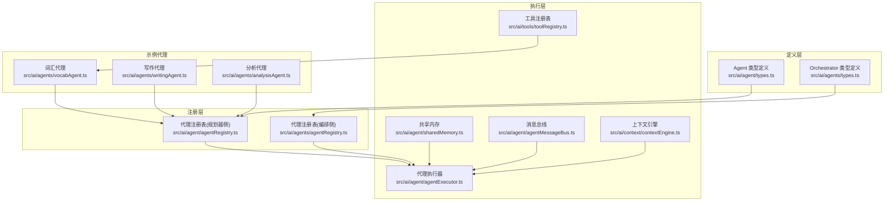
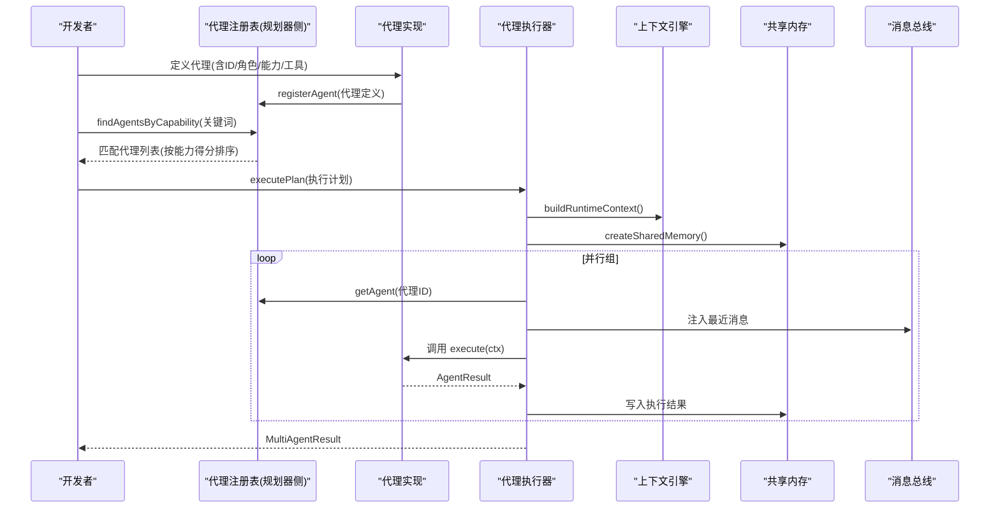
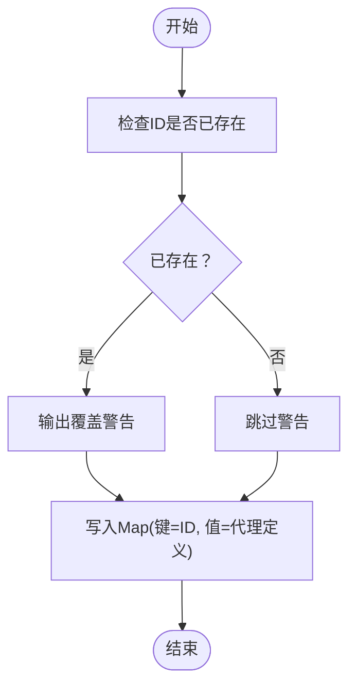
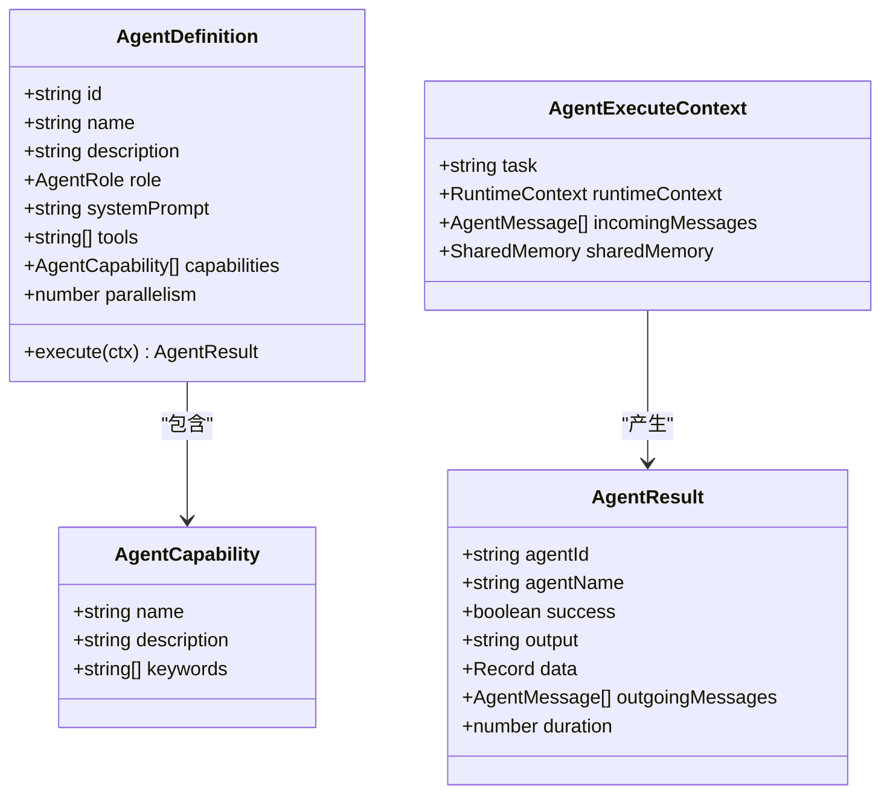
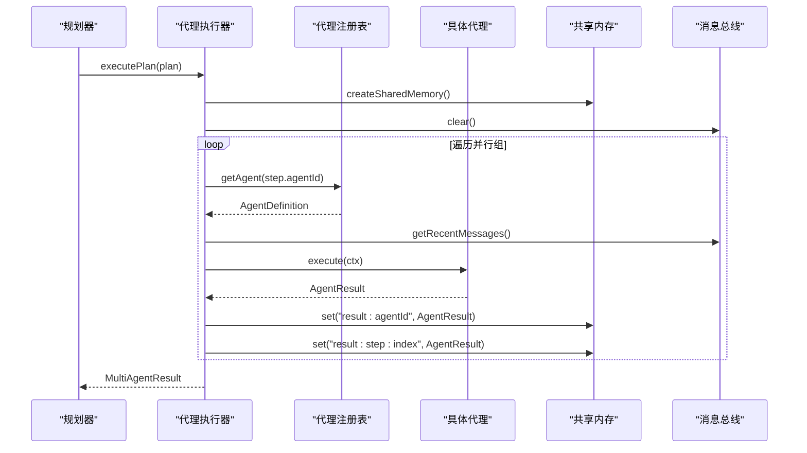
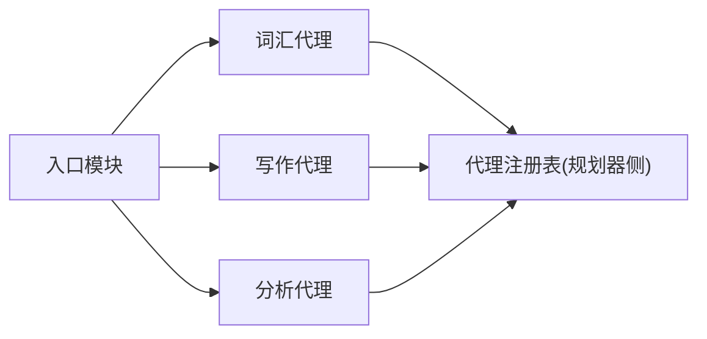
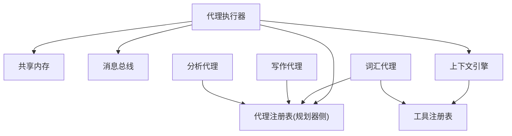

# 代理注册系统

<cite>
**本文引用的文件**
- [src/ai/agent/agentRegistry.ts](file://src/ai/agent/agentRegistry.ts)
- [src/ai/agents/agentRegistry.ts](file://src/ai/agents/agentRegistry.ts)
- [src/ai/agent/types.ts](file://src/ai/agent/types.ts)
- [src/ai/agents/types.ts](file://src/ai/agents/types.ts)
- [src/ai/agent/index.ts](file://src/ai/agent/index.ts)
- [src/ai/agents/index.ts](file://src/ai/agents/index.ts)
- [src/ai/agents/vocabAgent.ts](file://src/ai/agents/vocabAgent.ts)
- [src/ai/agents/writingAgent.ts](file://src/ai/agents/writingAgent.ts)
- [src/ai/agents/analysisAgent.ts](file://src/ai/agents/analysisAgent.ts)
- [src/ai/agent/agentExecutor.ts](file://src/ai/agent/agentExecutor.ts)
- [src/ai/context/contextEngine.ts](file://src/ai/context/contextEngine.ts)
- [src/ai/tools/toolRegistry.ts](file://src/ai/tools/toolRegistry.ts)
- [src/ai/agent/sharedMemory.ts](file://src/ai/agent/sharedMemory.ts)
- [src/ai/agent/agentMessageBus.ts](file://src/ai/agent/agentMessageBus.ts)
</cite>

## 目录
1. [简介](#简介)
2. [项目结构](#项目结构)
3. [核心组件](#核心组件)
4. [架构总览](#架构总览)
5. [详细组件分析](#详细组件分析)
6. [依赖关系分析](#依赖关系分析)
7. [性能考虑](#性能考虑)
8. [故障排查指南](#故障排查指南)
9. [结论](#结论)
10. [附录](#附录)

## 简介
本技术文档面向小天AI教育平台的“代理注册系统”，聚焦于多智能体协作框架中的代理注册、查询与生命周期管理。文档围绕以下目标展开：
- 解释代理注册系统的设计原理与实现机制，涵盖 registerAgent、getAgent、listAgents 等核心API。
- 详述代理注册流程：代理定义验证、唯一性检查与注册过程。
- 阐明代理查询机制：按能力匹配、按角色分类与ID列表管理。
- 说明代理生命周期管理：创建、激活、停用与销毁流程。
- 解释代理权限控制与访问管理机制（工具授权、消息总线）。
- 提供最佳实践与常见问题解决方案，以及扩展方法。

## 项目结构
代理注册系统位于多智能体子系统中，采用“定义层 + 注册层 + 执行层”的分层设计：
- 定义层：统一的类型定义与能力模型，确保代理具备一致的接口与能力描述。
- 注册层：集中式注册表，提供注册、查询、按能力/角色筛选与ID列表管理。
- 执行层：执行器根据规划生成的执行计划调度代理，传递上下文、共享内存与消息总线。

图表来源
- [src/ai/agent/agentRegistry.ts:1-62](file://src/ai/agent/agentRegistry.ts#L1-L62)
- [src/ai/agents/agentRegistry.ts:1-29](file://src/ai/agents/agentRegistry.ts#L1-L29)
- [src/ai/agent/types.ts:1-131](file://src/ai/agent/types.ts#L1-L131)
- [src/ai/agents/types.ts:1-142](file://src/ai/agents/types.ts#L1-L142)
- [src/ai/agent/agentExecutor.ts:1-165](file://src/ai/agent/agentExecutor.ts#L1-L165)
- [src/ai/agent/sharedMemory.ts:1-29](file://src/ai/agent/sharedMemory.ts#L1-L29)
- [src/ai/agent/agentMessageBus.ts:1-58](file://src/ai/agent/agentMessageBus.ts#L1-L58)
- [src/ai/context/contextEngine.ts:1-189](file://src/ai/context/contextEngine.ts#L1-L189)
- [src/ai/tools/toolRegistry.ts:1-117](file://src/ai/tools/toolRegistry.ts#L1-L117)
- [src/ai/agents/vocabAgent.ts:1-73](file://src/ai/agents/vocabAgent.ts#L1-L73)
- [src/ai/agents/writingAgent.ts:1-56](file://src/ai/agents/writingAgent.ts#L1-L56)
- [src/ai/agents/analysisAgent.ts:1-63](file://src/ai/agents/analysisAgent.ts#L1-L63)

章节来源
- [src/ai/agent/index.ts:1-57](file://src/ai/agent/index.ts#L1-L57)
- [src/ai/agents/index.ts:1-26](file://src/ai/agents/index.ts#L1-L26)

## 核心组件
- 代理注册表（规划器侧）：提供注册、查询、按能力匹配、按角色过滤与ID列表导出。
- 代理注册表（编排侧）：用于编排器获取代理实例，支持注册、查询与列表导出。
- 代理类型定义：统一的代理定义、能力模型、执行上下文与结果结构。
- 代理执行器：接收执行计划，按并行组调度代理，构建运行时上下文、共享内存与消息总线。
- 共享内存：跨代理共享键值对数据，便于结果传播与后续步骤复用。
- 消息总线：代理间通信通道，支持上下文、发现、请求、结果与错误消息。
- 上下文引擎：构建运行时上下文，整合最近工作流、工具调用、会话消息与RAG检索知识。
- 工具注册表：桥接工具与LLM调用，按工作流自动注入所需工具。

章节来源
- [src/ai/agent/agentRegistry.ts:12-61](file://src/ai/agent/agentRegistry.ts#L12-L61)
- [src/ai/agents/agentRegistry.ts:11-28](file://src/ai/agents/agentRegistry.ts#L11-L28)
- [src/ai/agent/types.ts:13-73](file://src/ai/agent/types.ts#L13-L73)
- [src/ai/agent/agentExecutor.ts:36-106](file://src/ai/agent/agentExecutor.ts#L36-L106)
- [src/ai/agent/sharedMemory.ts:10-28](file://src/ai/agent/sharedMemory.ts#L10-L28)
- [src/ai/agent/agentMessageBus.ts:17-57](file://src/ai/agent/agentMessageBus.ts#L17-L57)
- [src/ai/context/contextEngine.ts:37-80](file://src/ai/context/contextEngine.ts#L37-L80)
- [src/ai/tools/toolRegistry.ts:18-117](file://src/ai/tools/toolRegistry.ts#L18-L117)

## 架构总览
代理注册系统贯穿“定义 → 注册 → 查询 → 执行”的主干流程。规划器侧注册表用于能力匹配与角色筛选；编排侧注册表用于实例化与执行；执行器负责调度与状态记录。

图表来源
- [src/ai/agent/agentRegistry.ts:12-61](file://src/ai/agent/agentRegistry.ts#L12-L61)
- [src/ai/agent/agentExecutor.ts:36-106](file://src/ai/agent/agentExecutor.ts#L36-L106)
- [src/ai/context/contextEngine.ts:37-80](file://src/ai/context/contextEngine.ts#L37-L80)
- [src/ai/agent/sharedMemory.ts:10-28](file://src/ai/agent/sharedMemory.ts#L10-L28)
- [src/ai/agent/agentMessageBus.ts:41-53](file://src/ai/agent/agentMessageBus.ts#L41-L53)

## 详细组件分析

### 代理注册表（规划器侧）
- 职责
  - 注册代理：若同名ID已存在则覆盖并告警。
  - 查询代理：按ID获取代理定义。
  - 列出代理：返回全部代理定义数组。
  - 列出ID：返回全部代理ID数组。
  - 能力匹配：根据关键词计算能力得分，降序返回匹配代理。
  - 角色过滤：按角色筛选代理集合。
- 设计要点
  - 使用Map存储代理定义，键为唯一ID。
  - 能力匹配算法：关键词包含关系计整分，描述包含计半分，最终按分数排序。
  - 角色过滤直接基于代理定义中的role字段。
- 复杂度
  - 注册/查询/列出ID均为O(1)/O(n)遍历。
  - 能力匹配为O(A×C×K)，其中A为代理数、C为平均能力数、K为关键词数。

图表来源
- [src/ai/agent/agentRegistry.ts:12-17](file://src/ai/agent/agentRegistry.ts#L12-L17)

章节来源
- [src/ai/agent/agentRegistry.ts:12-61](file://src/ai/agent/agentRegistry.ts#L12-L61)

### 代理注册表（编排侧）
- 职责
  - 注册代理实例：同名ID覆盖并告警。
  - 查询代理实例：按ID获取代理对象。
  - 列出代理实例与ID列表。
- 适用场景
  - 编排器需要直接获取代理实例以执行其run方法。
- 注意
  - 与规划器侧注册表不同，此处存储的是代理实例而非定义。

章节来源
- [src/ai/agents/agentRegistry.ts:11-28](file://src/ai/agents/agentRegistry.ts#L11-L28)

### 代理类型定义与能力模型
- 关键接口
  - AgentDefinition：代理定义，包含ID、名称、描述、角色、系统提示、允许工具、能力列表、并行优先级与execute方法。
  - AgentExecuteContext：执行上下文，包含任务、运行时上下文、上游消息、共享内存。
  - AgentResult：执行结果，包含成功标志、输出、数据、传出消息与耗时。
  - AgentCapability：能力描述，包含名称、描述与关键词标签。
- 设计原则
  - 统一的执行接口与结果结构，便于执行器调度与结果收集。
  - 能力模型用于规划器侧的意图匹配与代理选择。

图表来源
- [src/ai/agent/types.ts:13-73](file://src/ai/agent/types.ts#L13-L73)

章节来源
- [src/ai/agent/types.ts:13-73](file://src/ai/agent/types.ts#L13-L73)

### 代理执行器与生命周期
- 生命周期阶段
  - 创建：构建共享内存、清空消息总线、写入执行计划。
  - 激活：按并行组顺序执行步骤，注入最近消息与共享内存。
  - 运行：调用代理execute方法，写入结果到共享内存。
  - 停用：遇到非可选失败立即停止后续步骤。
  - 销毁：返回聚合结果，记录工作流执行摘要。
- 关键流程
  - 并行组执行：同一组内并发执行，不同组按顺序串行。
  - 结果传播：每个步骤结果写入共享内存，供下游代理读取。
  - 失败处理：非可选步骤失败即终止执行。

图表来源
- [src/ai/agent/agentExecutor.ts:36-106](file://src/ai/agent/agentExecutor.ts#L36-L106)
- [src/ai/agent/agentRegistry.ts:19-21](file://src/ai/agent/agentRegistry.ts#L19-L21)
- [src/ai/agent/agentMessageBus.ts:51-53](file://src/ai/agent/agentMessageBus.ts#L51-L53)
- [src/ai/agent/sharedMemory.ts:10-28](file://src/ai/agent/sharedMemory.ts#L10-L28)

章节来源
- [src/ai/agent/agentExecutor.ts:36-165](file://src/ai/agent/agentExecutor.ts#L36-L165)

### 示例代理与自动注册
- 词汇代理：负责词汇获取、筛选与默写生成，注册后自动加入注册表。
- 写作代理：负责作文批改与写作建议，注册后可被规划器匹配。
- 分析代理：负责学情分析与风险识别，注册后可广播分析发现。
- 自动注册：在入口模块中导入各代理文件，触发其内部的registerAgent调用。

图表来源
- [src/ai/agents/vocabAgent.ts:72-73](file://src/ai/agents/vocabAgent.ts#L72-L73)
- [src/ai/agents/writingAgent.ts:55-56](file://src/ai/agents/writingAgent.ts#L55-L56)
- [src/ai/agents/analysisAgent.ts:62-63](file://src/ai/agents/analysisAgent.ts#L62-L63)
- [src/ai/agent/index.ts:52-57](file://src/ai/agent/index.ts#L52-L57)

章节来源
- [src/ai/agents/vocabAgent.ts:14-73](file://src/ai/agents/vocabAgent.ts#L14-L73)
- [src/ai/agents/writingAgent.ts:11-56](file://src/ai/agents/writingAgent.ts#L11-L56)
- [src/ai/agents/analysisAgent.ts:11-63](file://src/ai/agents/analysisAgent.ts#L11-L63)
- [src/ai/agent/index.ts:52-57](file://src/ai/agent/index.ts#L52-L57)

### 权限控制与访问管理
- 工具授权
  - 代理定义中声明允许使用的工具名称列表。
  - 工具注册表提供按工作流自动注入工具的能力，避免在步骤中重复声明。
- 消息总线
  - 代理通过消息总线发送上下文、发现、请求、结果与错误消息。
  - 支持按接收方或广播模式发送，限制消息范围。
- 上下文注入
  - 上下文引擎构建运行时上下文，包含教师、班级、教材、最近工作流、工具调用与RAG知识，供代理执行时使用。

章节来源
- [src/ai/agent/types.ts:24-31](file://src/ai/agent/types.ts#L24-L31)
- [src/ai/tools/toolRegistry.ts:86-117](file://src/ai/tools/toolRegistry.ts#L86-L117)
- [src/ai/agent/agentMessageBus.ts:17-57](file://src/ai/agent/agentMessageBus.ts#L17-L57)
- [src/ai/context/contextEngine.ts:37-80](file://src/ai/context/contextEngine.ts#L37-L80)

## 依赖关系分析
- 组件耦合
  - 执行器依赖注册表获取代理定义，依赖共享内存与消息总线进行状态传播。
  - 上下文引擎为执行器提供运行时上下文，工具注册表为代理提供工具调用能力。
- 外部依赖
  - 向量适配器用于RAG检索，作为上下文引擎的一部分。
- 循环依赖
  - 注册表与代理实现通过入口模块间接关联，避免直接循环依赖。

图表来源
- [src/ai/agent/agentExecutor.ts:18-23](file://src/ai/agent/agentExecutor.ts#L18-L23)
- [src/ai/context/contextEngine.ts:16-16](file://src/ai/context/contextEngine.ts#L16-L16)
- [src/ai/tools/toolRegistry.ts:14-14](file://src/ai/tools/toolRegistry.ts#L14-L14)
- [src/ai/agents/vocabAgent.ts:8-12](file://src/ai/agents/vocabAgent.ts#L8-L12)

章节来源
- [src/ai/agent/agentExecutor.ts:18-23](file://src/ai/agent/agentExecutor.ts#L18-L23)
- [src/ai/context/contextEngine.ts:16-16](file://src/ai/context/contextEngine.ts#L16-L16)
- [src/ai/tools/toolRegistry.ts:14-14](file://src/ai/tools/toolRegistry.ts#L14-L14)
- [src/ai/agents/vocabAgent.ts:8-12](file://src/ai/agents/vocabAgent.ts#L8-L12)

## 性能考虑
- 能力匹配复杂度：findAgentsByCapability为O(A×C×K)，建议控制关键词数量与代理数量，必要时引入缓存或索引。
- 并行执行：执行器按并行组并发执行，减少总耗时；但需注意共享内存与消息总线的并发写入竞争。
- 日志与消息上限：消息总线维护最大消息数量，避免内存膨胀。
- RAG检索：上下文引擎的向量检索可能成为瓶颈，建议合理设置topK与最小分数阈值。

## 故障排查指南
- 代理未注册
  - 现象：执行器按ID无法获取代理，返回失败结果。
  - 排查：确认代理是否在入口模块中被导入以触发registerAgent；检查ID是否冲突。
- 工具未注册
  - 现象：代理执行过程中调用工具失败。
  - 排查：确认工具已在工具注册表中注册；检查工作流映射是否正确。
- 能力匹配不到代理
  - 现象：findAgentsByCapability返回空列表。
  - 排查：核对关键词与代理能力关键词的包含关系；调整关键词粒度或描述匹配权重。
- 并发写入冲突
  - 现象：共享内存或消息总线出现竞态。
  - 排查：确保仅在执行器的步骤边界写入共享内存；避免在代理内部并发写入。
- RAG检索异常
  - 现象：上下文构建失败或返回回退知识。
  - 排查：检查向量适配器配置与过滤条件；确认网络与服务可用性。

章节来源
- [src/ai/agent/agentExecutor.ts:115-127](file://src/ai/agent/agentExecutor.ts#L115-L127)
- [src/ai/tools/toolRegistry.ts:41-65](file://src/ai/tools/toolRegistry.ts#L41-L65)
- [src/ai/agent/agentRegistry.ts:35-54](file://src/ai/agent/agentRegistry.ts#L35-L54)
- [src/ai/agent/agentMessageBus.ts:35-37](file://src/ai/agent/agentMessageBus.ts#L35-L37)
- [src/ai/context/contextEngine.ts:107-133](file://src/ai/context/contextEngine.ts#L107-L133)

## 结论
代理注册系统通过统一的类型定义、集中式注册表与执行器，实现了代理的标准化注册、灵活查询与高效执行。规划器侧的“能力匹配”与“角色过滤”为任务分配提供了智能化依据；编排侧的“实例注册”满足了动态执行需求。结合共享内存、消息总线与上下文引擎，系统形成了完整的多智能体协作闭环。遵循本文的最佳实践与故障排查建议，可有效提升代理系统的稳定性与可维护性。

## 附录

### API参考（核心）
- 规划器侧注册表
  - registerAgent(agent: AgentDefinition): void
  - getAgent(id: string): AgentDefinition | undefined
  - listAgents(): AgentDefinition[]
  - listAgentIds(): string[]
  - findAgentsByCapability(keywords: string[]): AgentDefinition[]
  - getAgentsByRole(role: string): AgentDefinition[]
- 编排侧注册表
  - registerAgent(agent: Agent): void
  - getAgent(id: string): Agent | undefined
  - listAgents(): Agent[]
  - listAgentIds(): string[]
- 执行器
  - executePlan(plan: ExecutionPlan, sharedMemory?: SharedMemory): Promise<MultiAgentResult>
  - recordMultiAgentRun(result: MultiAgentResult): Promise<void>
- 共享内存
  - createSharedMemory(): SharedMemory
- 消息总线
  - sendMessage(params): AgentMessage
  - getMessagesFor(agentId): AgentMessage[]
  - getMessagesFrom(agentId): AgentMessage[]
  - getRecentMessages(limit?): AgentMessage[]
  - clear(): void
- 上下文引擎
  - buildRuntimeContext(params): Promise<RuntimeContext>
  - retrieveRelevantKnowledge(classInfo): Promise<KnowledgeFragment[]>
- 工具注册表
  - registerTool(tool: ToolDefinition): void
  - getTool(name: string): ToolDefinition | undefined
  - getAllTools(): ToolDefinition[]
  - getToolNames(): string[]
  - executeTool(name: string, ctx, args): Promise<ToolResult>
  - allToolsToLLMFormat(): LLMTool[]
  - getToolsForWorkflow(workflowId: string): LLMTool[]
  - registerWorkflowTools(workflowId: string, toolNames: string[]): void

章节来源
- [src/ai/agent/agentRegistry.ts:12-61](file://src/ai/agent/agentRegistry.ts#L12-L61)
- [src/ai/agents/agentRegistry.ts:11-28](file://src/ai/agents/agentRegistry.ts#L11-L28)
- [src/ai/agent/agentExecutor.ts:27-106](file://src/ai/agent/agentExecutor.ts#L27-L106)
- [src/ai/agent/sharedMemory.ts:10-28](file://src/ai/agent/sharedMemory.ts#L10-L28)
- [src/ai/agent/agentMessageBus.ts:17-57](file://src/ai/agent/agentMessageBus.ts#L17-L57)
- [src/ai/context/contextEngine.ts:37-133](file://src/ai/context/contextEngine.ts#L37-L133)
- [src/ai/tools/toolRegistry.ts:18-117](file://src/ai/tools/toolRegistry.ts#L18-L117)