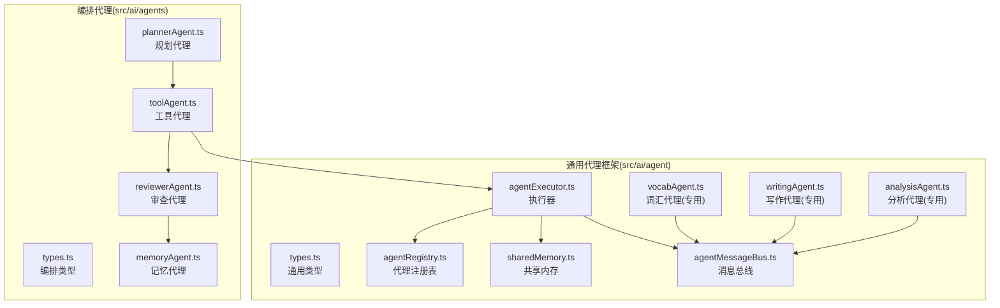
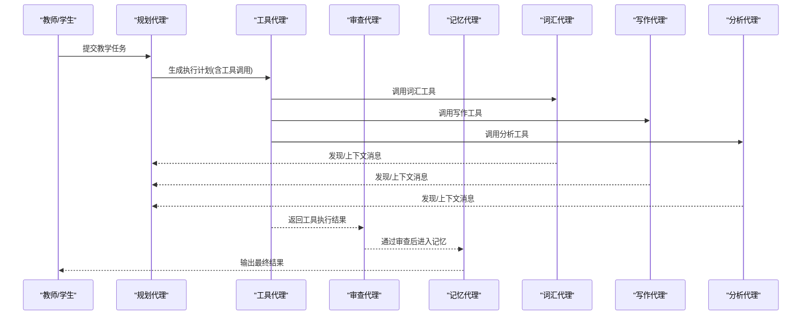
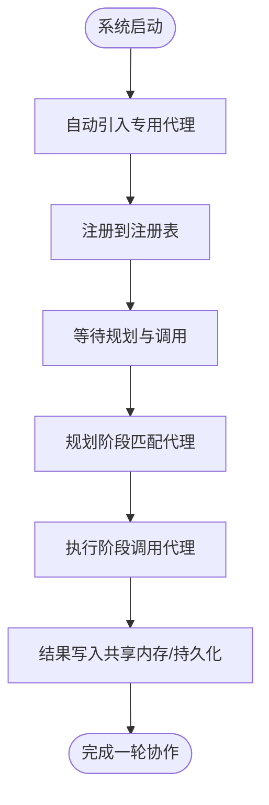
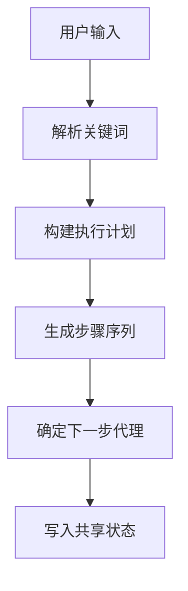
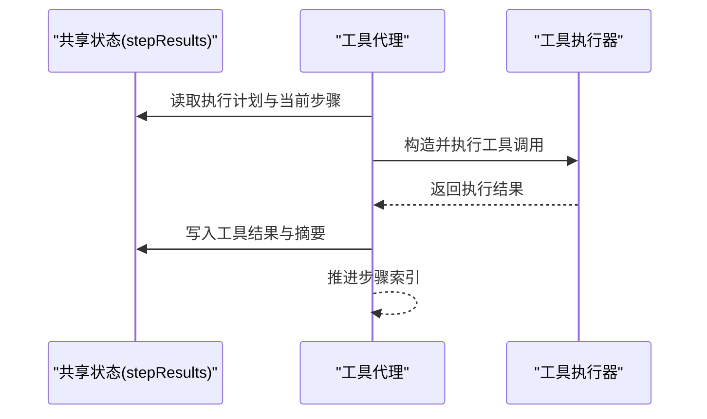
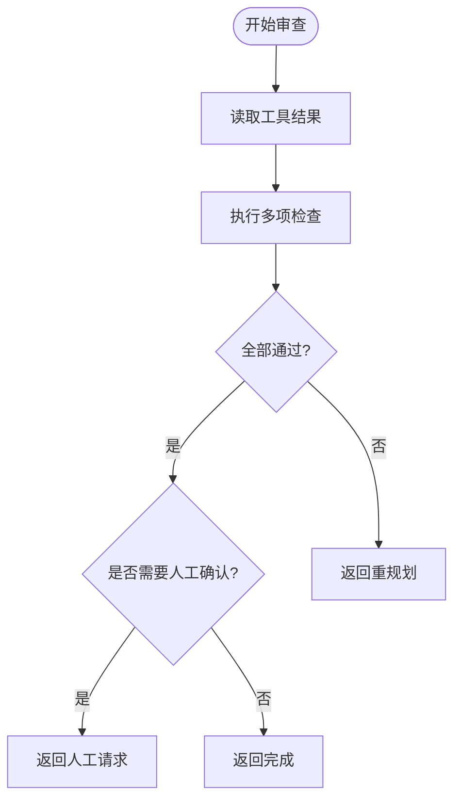
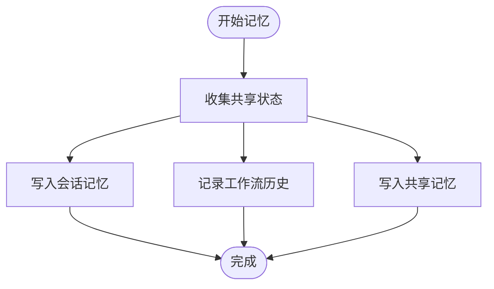
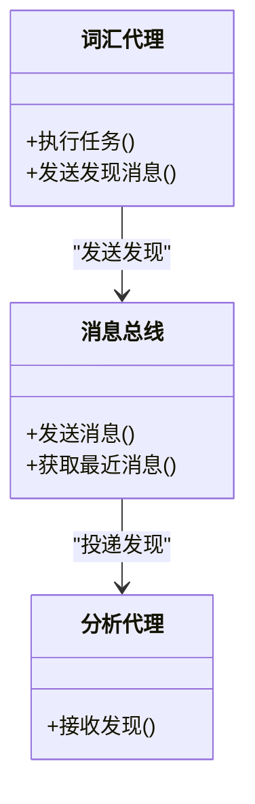
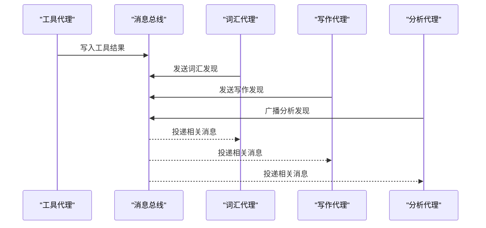
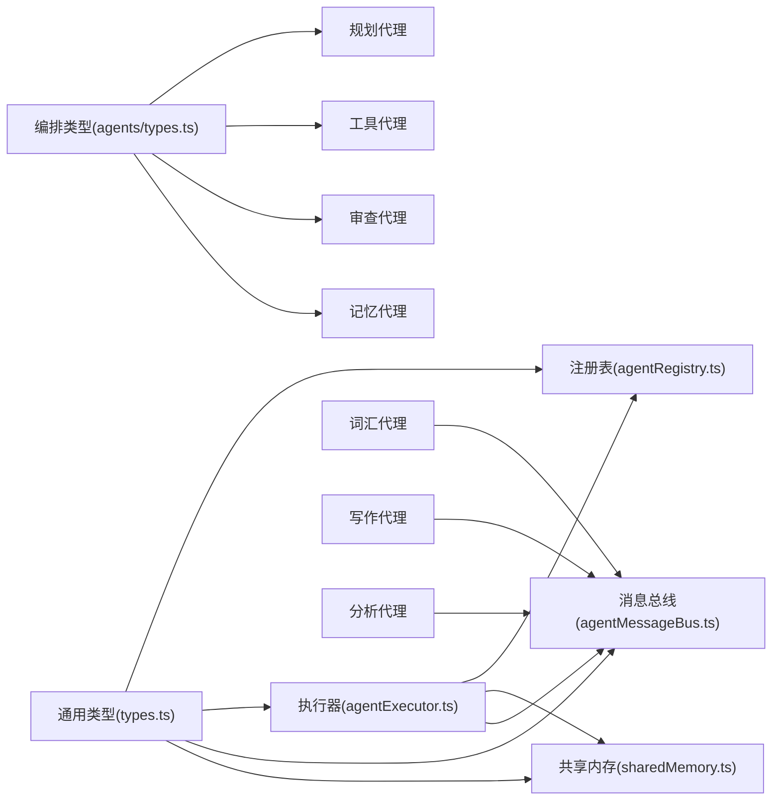

# 智能代理系统

<cite>
**本文引用的文件**
- [src/ai/agent/index.ts](file://src/ai/agent/index.ts)
- [src/ai/agents/index.ts](file://src/ai/agents/index.ts)
- [src/ai/agent/types.ts](file://src/ai/agent/types.ts)
- [src/ai/agents/types.ts](file://src/ai/agents/types.ts)
- [src/ai/agent/agentRegistry.ts](file://src/ai/agent/agentRegistry.ts)
- [src/ai/agent/agentExecutor.ts](file://src/ai/agent/agentExecutor.ts)
- [src/ai/agent/sharedMemory.ts](file://src/ai/agent/sharedMemory.ts)
- [src/ai/agent/agentMessageBus.ts](file://src/ai/agent/agentMessageBus.ts)
- [src/ai/agents/plannerAgent.ts](file://src/ai/agents/plannerAgent.ts)
- [src/ai/agents/toolAgent.ts](file://src/ai/agents/toolAgent.ts)
- [src/ai/agents/reviewerAgent.ts](file://src/ai/agents/reviewerAgent.ts)
- [src/ai/agents/memoryAgent.ts](file://src/ai/agents/memoryAgent.ts)
- [src/ai/agents/vocabAgent.ts](file://src/ai/agents/vocabAgent.ts)
- [src/ai/agents/writingAgent.ts](file://src/ai/agents/writingAgent.ts)
- [src/ai/agents/analysisAgent.ts](file://src/ai/agents/analysisAgent.ts)
</cite>

## 目录
1. [引言](#引言)
2. [项目结构](#项目结构)
3. [核心组件](#核心组件)
4. [架构总览](#架构总览)
5. [详细组件分析](#详细组件分析)
6. [依赖关系分析](#依赖关系分析)
7. [性能考量](#性能考量)
8. [故障排查指南](#故障排查指南)
9. [结论](#结论)
10. [附录](#附录)

## 引言
本技术文档面向小天AI教育平台的智能代理系统，系统采用“多角色协作”的AI代理网络设计，围绕“规划-工具-审查-记忆”主回路，结合专用领域代理（如词汇、写作、分析）实现闭环的智能教学辅助。文档涵盖代理注册与生命周期、职责分工、通信与协作、状态与上下文传递、扩展与自定义指南，以及完整实现与使用说明。

## 项目结构
智能代理系统主要分布在以下两个模块：
- 通用代理框架与执行器：位于 src/ai/agent，提供类型定义、注册表、消息总线、共享内存、执行器等基础设施。
- Orchestration 代理编排：位于 src/ai/agents，提供规划、工具、审查、记忆等编排型代理，以及若干专用代理（词汇、写作、分析）。

图表来源
- [src/ai/agent/types.ts:1-131](file://src/ai/agent/types.ts#L1-L131)
- [src/ai/agents/types.ts:1-142](file://src/ai/agents/types.ts#L1-L142)
- [src/ai/agent/agentRegistry.ts:1-62](file://src/ai/agent/agentRegistry.ts#L1-L62)
- [src/ai/agent/agentExecutor.ts:1-165](file://src/ai/agent/agentExecutor.ts#L1-L165)
- [src/ai/agent/sharedMemory.ts:1-29](file://src/ai/agent/sharedMemory.ts#L1-L29)
- [src/ai/agent/agentMessageBus.ts:1-58](file://src/ai/agent/agentMessageBus.ts#L1-L58)
- [src/ai/agents/plannerAgent.ts:1-118](file://src/ai/agents/plannerAgent.ts#L1-L118)
- [src/ai/agents/toolAgent.ts:1-97](file://src/ai/agents/toolAgent.ts#L1-L97)
- [src/ai/agents/reviewerAgent.ts:1-146](file://src/ai/agents/reviewerAgent.ts#L1-L146)
- [src/ai/agents/memoryAgent.ts:1-78](file://src/ai/agents/memoryAgent.ts#L1-L78)
- [src/ai/agents/vocabAgent.ts:1-73](file://src/ai/agents/vocabAgent.ts#L1-L73)
- [src/ai/agents/writingAgent.ts:1-56](file://src/ai/agents/writingAgent.ts#L1-L56)
- [src/ai/agents/analysisAgent.ts:1-63](file://src/ai/agents/analysisAgent.ts#L1-L63)

章节来源
- [src/ai/agent/index.ts:1-57](file://src/ai/agent/index.ts#L1-L57)
- [src/ai/agents/index.ts:1-26](file://src/ai/agents/index.ts#L1-L26)

## 核心组件
- 通用类型与契约：定义代理、执行上下文、执行计划、消息、共享内存等核心类型，确保跨模块一致的数据结构与行为约定。
- 代理注册表：集中注册与检索代理，支持按能力关键词匹配与按角色过滤，为规划阶段提供决策依据。
- 执行器：接收规划后的执行计划，按并行组顺序执行，支持串行、并行与条件分支，收集结果并记录工作流运行轨迹。
- 共享内存：跨代理共享键值对状态，便于结果传递与上下文延续。
- 消息总线：代理间异步通信通道，支持上下文、发现、请求、结果、错误等消息类型。
- 专用代理：词汇、写作、分析等专业角色代理，具备明确的能力标签与工具权限，通过消息总线协同。

章节来源
- [src/ai/agent/types.ts:1-131](file://src/ai/agent/types.ts#L1-L131)
- [src/ai/agent/agentRegistry.ts:1-62](file://src/ai/agent/agentRegistry.ts#L1-L62)
- [src/ai/agent/agentExecutor.ts:1-165](file://src/ai/agent/agentExecutor.ts#L1-L165)
- [src/ai/agent/sharedMemory.ts:1-29](file://src/ai/agent/sharedMemory.ts#L1-L29)
- [src/ai/agent/agentMessageBus.ts:1-58](file://src/ai/agent/agentMessageBus.ts#L1-L58)
- [src/ai/agents/vocabAgent.ts:1-73](file://src/ai/agents/vocabAgent.ts#L1-L73)
- [src/ai/agents/writingAgent.ts:1-56](file://src/ai/agents/writingAgent.ts#L1-L56)
- [src/ai/agents/analysisAgent.ts:1-63](file://src/ai/agents/analysisAgent.ts#L1-L63)

## 架构总览
系统采用“编排型代理 + 专用代理”的双层架构：
- 编排层：规划、工具、审查、记忆代理构成主回路，负责任务分解、工具调用、质量把关与结果持久化。
- 专用层：词汇、写作、分析等代理专注于特定教学场景，通过消息总线与编排层交互，形成多角色协作网络。

图表来源
- [src/ai/agents/plannerAgent.ts:1-118](file://src/ai/agents/plannerAgent.ts#L1-L118)
- [src/ai/agents/toolAgent.ts:1-97](file://src/ai/agents/toolAgent.ts#L1-L97)
- [src/ai/agents/reviewerAgent.ts:1-146](file://src/ai/agents/reviewerAgent.ts#L1-L146)
- [src/ai/agents/memoryAgent.ts:1-78](file://src/ai/agents/memoryAgent.ts#L1-L78)
- [src/ai/agents/vocabAgent.ts:1-73](file://src/ai/agents/vocabAgent.ts#L1-L73)
- [src/ai/agents/writingAgent.ts:1-56](file://src/ai/agents/writingAgent.ts#L1-L56)
- [src/ai/agents/analysisAgent.ts:1-63](file://src/ai/agents/analysisAgent.ts#L1-L63)

## 详细组件分析

### 代理注册系统与生命周期
- 注册机制：通过注册表集中注册代理，若重复注册会发出警告并覆盖。
- 查询接口：支持按ID获取、列出全部、按能力关键词匹配、按角色过滤。
- 生命周期：代理在系统启动时被自动引入，随后在执行过程中被规划与调用，执行结束后结果写入共享内存与持久化存储。

图表来源
- [src/ai/agent/index.ts:52-57](file://src/ai/agent/index.ts#L52-L57)
- [src/ai/agent/agentRegistry.ts:1-62](file://src/ai/agent/agentRegistry.ts#L1-L62)

章节来源
- [src/ai/agent/index.ts:18-26](file://src/ai/agent/index.ts#L18-L26)
- [src/ai/agent/agentRegistry.ts:12-61](file://src/ai/agent/agentRegistry.ts#L12-L61)

### 规划师代理（Planner Agent）
- 职责：根据用户输入动态生成执行计划，包含步骤、依赖与并行分组，设定下一步执行的代理。
- 关键逻辑：解析用户输入中的关键词，构建词汇/默写、测验卷、学情分析等步骤序列，并设置审查与记忆步骤作为收尾。
- 结果：将计划写入共享状态，供执行器按组并行/串行调度。

图表来源
- [src/ai/agents/plannerAgent.ts:17-38](file://src/ai/agents/plannerAgent.ts#L17-L38)
- [src/ai/agents/plannerAgent.ts:43-110](file://src/ai/agents/plannerAgent.ts#L43-L110)

章节来源
- [src/ai/agents/plannerAgent.ts:12-39](file://src/ai/agents/plannerAgent.ts#L12-L39)

### 工具代理（Tool Agent）
- 职责：根据当前步骤所需工具名称，构造工具调用参数，批量执行工具并写入共享状态。
- 关键逻辑：从共享状态读取当前步骤索引与计划，构建工具调用列表，执行后记录工具结果到持久化存储，并推进步骤索引。
- 结果：返回执行摘要与状态（成功/需重规划）。

图表来源
- [src/ai/agents/toolAgent.ts:22-82](file://src/ai/agents/toolAgent.ts#L22-L82)

章节来源
- [src/ai/agents/toolAgent.ts:13-96](file://src/ai/agents/toolAgent.ts#L13-L96)

### 审查代理（Reviewer Agent）
- 职责：对工具执行结果进行质量检查，必要时请求教师确认或触发重新规划。
- 关键逻辑：检查词汇数量、默写内容、筛选结果等；对词汇/默写任务在题量较多或需要难度调整时请求人工确认。
- 结果：返回完成/需人工/需重规划状态及人类交互请求。

图表来源
- [src/ai/agents/reviewerAgent.ts:24-82](file://src/ai/agents/reviewerAgent.ts#L24-L82)
- [src/ai/agents/reviewerAgent.ts:84-133](file://src/ai/agents/reviewerAgent.ts#L84-L133)

章节来源
- [src/ai/agents/reviewerAgent.ts:19-145](file://src/ai/agents/reviewerAgent.ts#L19-L145)

### 记忆代理（Memory Agent）
- 职责：将最终结果写入会话记忆、工作流历史与共享记忆，供后续流程复用。
- 关键逻辑：遍历共享状态键值，写入会话消息与工作流记录，并在共享记忆中保留最近结果。
- 结果：返回保存的键集合与摘要信息。

图表来源
- [src/ai/agents/memoryAgent.ts:22-63](file://src/ai/agents/memoryAgent.ts#L22-L63)

章节来源
- [src/ai/agents/memoryAgent.ts:17-77](file://src/ai/agents/memoryAgent.ts#L17-L77)

### 词汇代理（Vocabulary Agent）
- 职责：专注词汇相关任务，包括获取词汇表、筛选重点词、生成默写/听写内容。
- 能力标签：词汇获取、词汇筛选、默写生成。
- 通信：通过消息总线向分析代理分享发现，促进跨代理协作。

图表来源
- [src/ai/agents/vocabAgent.ts:33-68](file://src/ai/agents/vocabAgent.ts#L33-L68)
- [src/ai/agent/agentMessageBus.ts:17-39](file://src/ai/agent/agentMessageBus.ts#L17-L39)
- [src/ai/agents/analysisAgent.ts:33-44](file://src/ai/agents/analysisAgent.ts#L33-L44)

章节来源
- [src/ai/agents/vocabAgent.ts:14-72](file://src/ai/agents/vocabAgent.ts#L14-L72)

### 写作代理（Writing Agent）
- 职责：作文批改、语法检查、写作建议。
- 能力标签：作文批改、写作分析、写作建议。
- 通信：向分析代理发送写作分析发现，辅助整体学情洞察。

章节来源
- [src/ai/agents/writingAgent.ts:11-55](file://src/ai/agents/writingAgent.ts#L11-L55)

### 分析代理（Analysis Agent）
- 职责：学情分析、错题统计、风险识别、趋势预测、班级报告。
- 能力标签：学情分析、风险识别、趋势预测、班级报告。
- 通信：向全体代理广播分析发现，形成全局上下文。

章节来源
- [src/ai/agents/analysisAgent.ts:11-62](file://src/ai/agents/analysisAgent.ts#L11-L62)

### 代理间通信与协作
- 消息类型：上下文、发现、请求、结果、错误。
- 传递路径：工具代理执行后将结果写入共享状态；审查代理在需要时请求人工干预；记忆代理统一归档；专用代理通过消息总线共享发现。
- 并发策略：执行器按并行组并发执行，组内串行，失败时可中断或触发重规划。

图表来源
- [src/ai/agents/toolAgent.ts:64-77](file://src/ai/agents/toolAgent.ts#L64-L77)
- [src/ai/agents/vocabAgent.ts:51-58](file://src/ai/agents/vocabAgent.ts#L51-L58)
- [src/ai/agents/writingAgent.ts:32-38](file://src/ai/agents/writingAgent.ts#L32-L38)
- [src/ai/agents/analysisAgent.ts:33-44](file://src/ai/agents/analysisAgent.ts#L33-L44)
- [src/ai/agent/agentMessageBus.ts:41-53](file://src/ai/agent/agentMessageBus.ts#L41-L53)

## 依赖关系分析
- 类型与契约：通用类型与编排类型分别定义跨模块的数据结构与行为接口。
- 执行器依赖：注册表用于解析代理定义，共享内存提供状态容器，消息总线提供通信通道。
- 专用代理依赖：专用代理通过消息总线与编排代理交互，同时可访问工具注册表与运行时上下文。

图表来源
- [src/ai/agent/types.ts:1-131](file://src/ai/agent/types.ts#L1-L131)
- [src/ai/agents/types.ts:1-142](file://src/ai/agents/types.ts#L1-L142)
- [src/ai/agent/agentRegistry.ts:1-62](file://src/ai/agent/agentRegistry.ts#L1-L62)
- [src/ai/agent/agentExecutor.ts:1-165](file://src/ai/agent/agentExecutor.ts#L1-L165)
- [src/ai/agent/sharedMemory.ts:1-29](file://src/ai/agent/sharedMemory.ts#L1-L29)
- [src/ai/agent/agentMessageBus.ts:1-58](file://src/ai/agent/agentMessageBus.ts#L1-L58)
- [src/ai/agents/vocabAgent.ts:1-73](file://src/ai/agents/vocabAgent.ts#L1-L73)
- [src/ai/agents/writingAgent.ts:1-56](file://src/ai/agents/writingAgent.ts#L1-L56)
- [src/ai/agents/analysisAgent.ts:1-63](file://src/ai/agents/analysisAgent.ts#L1-L63)

章节来源
- [src/ai/agent/index.ts:1-57](file://src/ai/agent/index.ts#L1-L57)
- [src/ai/agents/index.ts:1-26](file://src/ai/agents/index.ts#L1-L26)

## 性能考量
- 并行执行：执行器按并行组并发执行，显著缩短端到端时间；建议将无依赖步骤放入同一组。
- 通信开销：消息总线维护有限条目，避免无限增长；建议控制消息体量与频率。
- 工具调用：批量执行工具并合并结果，减少往返次数；失败时尽早短路，避免无效尝试。
- 状态管理：共享内存键命名规范化，避免冲突；及时清理无关键，降低查询成本。

## 故障排查指南
- 代理未注册：执行器在找不到代理时会返回失败结果；检查代理是否正确注册与导入。
- 工具调用失败：工具代理返回“需重规划”状态；检查工具参数、权限与上游数据。
- 审查不通过：审查代理可能因词汇数量不足、默写内容为空或筛选结果为空而触发重规划；核对上游工具输出。
- 人工确认阻塞：审查代理在词汇/默写任务中可能请求教师确认；确认交互界面与选项配置。
- 记忆写入异常：记忆代理负责持久化；若失败，检查会话记忆与工作流历史的写入接口。

章节来源
- [src/ai/agent/agentExecutor.ts:116-127](file://src/ai/agent/agentExecutor.ts#L116-L127)
- [src/ai/agents/toolAgent.ts:82-92](file://src/ai/agents/toolAgent.ts#L82-L92)
- [src/ai/agents/reviewerAgent.ts:73-82](file://src/ai/agents/reviewerAgent.ts#L73-L82)
- [src/ai/agents/memoryAgent.ts:69-73](file://src/ai/agents/memoryAgent.ts#L69-L73)

## 结论
该智能代理系统通过清晰的类型契约、集中注册与消息总线，实现了编排型代理与专用代理的高效协作。规划-工具-审查-记忆的主回路保证了任务的可控执行，而专用代理则提供了强大的领域能力。系统具备良好的扩展性与可维护性，适合在教育场景中持续演进。

## 附录

### 代理定义规范与注册流程
- 定义规范：代理需提供唯一ID、名称、描述、角色、系统提示、允许使用的工具清单、能力标签与并行优先级。
- 注册流程：在模块入口导入代理文件，代理内部通过注册函数完成注册；规划阶段可通过关键词匹配与角色过滤选择代理。

章节来源
- [src/ai/agent/types.ts:13-32](file://src/ai/agent/types.ts#L13-L32)
- [src/ai/agent/agentRegistry.ts:12-17](file://src/ai/agent/agentRegistry.ts#L12-L17)
- [src/ai/agent/index.ts:52-57](file://src/ai/agent/index.ts#L52-L57)

### 执行器与计划执行
- 输入：执行计划（含步骤、并行分组、估计轮次）。
- 流程：按并行组顺序执行，组内并发；收集每个步骤的代理结果；失败时按可选标记决定是否中断。
- 输出：聚合结果、总耗时、代理调用计数与摘要。

章节来源
- [src/ai/agent/agentExecutor.ts:36-106](file://src/ai/agent/agentExecutor.ts#L36-L106)
- [src/ai/agent/agentExecutor.ts:110-150](file://src/ai/agent/agentExecutor.ts#L110-L150)

### 上下文与状态传递
- 运行时上下文：由上下文引擎构建，包含会话、课堂元数据等。
- 共享内存：键值对存储，支持设置、获取、枚举与清空；执行器与代理均可读写。
- 消息总线：代理间异步通信，支持按代理ID或广播接收。

章节来源
- [src/ai/agent/agentExecutor.ts:47-48](file://src/ai/agent/agentExecutor.ts#L47-L48)
- [src/ai/agent/sharedMemory.ts:10-28](file://src/ai/agent/sharedMemory.ts#L10-L28)
- [src/ai/agent/agentMessageBus.ts:17-39](file://src/ai/agent/agentMessageBus.ts#L17-L39)

### 开发者扩展与自定义指南
- 新增代理
  - 定义代理：实现代理定义接口，声明角色、能力标签与工具权限。
  - 实现执行：在执行上下文中读取任务、运行时上下文、消息与共享内存，返回标准结果。
  - 注册代理：在模块入口导入，确保被自动注册。
- 自定义规划
  - 在规划代理中扩展关键词解析与步骤生成逻辑，适配新的教学任务类型。
- 自定义审查
  - 在审查代理中新增检查规则与人工交互选项，满足不同学科与学段需求。
- 工具集成
  - 将新工具注册到工具注册表，代理通过工具名称在执行阶段调用。

章节来源
- [src/ai/agent/types.ts:13-32](file://src/ai/agent/types.ts#L13-L32)
- [src/ai/agents/plannerAgent.ts:43-110](file://src/ai/agents/plannerAgent.ts#L43-L110)
- [src/ai/agents/reviewerAgent.ts:19-145](file://src/ai/agents/reviewerAgent.ts#L19-L145)
- [src/ai/agent/index.ts:52-57](file://src/ai/agent/index.ts#L52-L57)