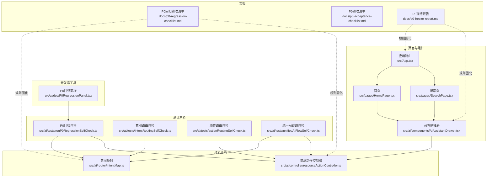
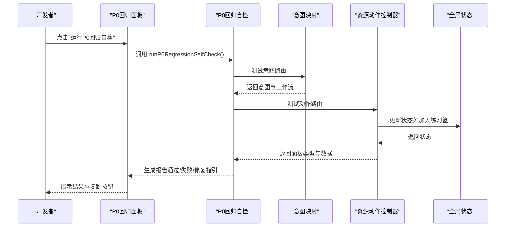
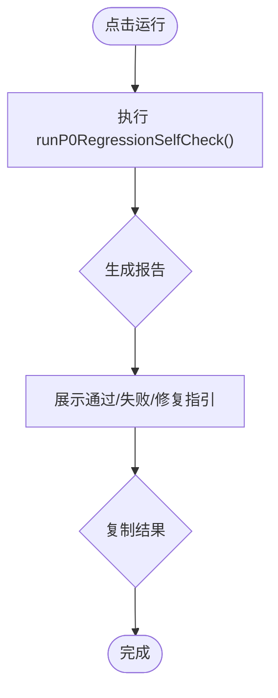
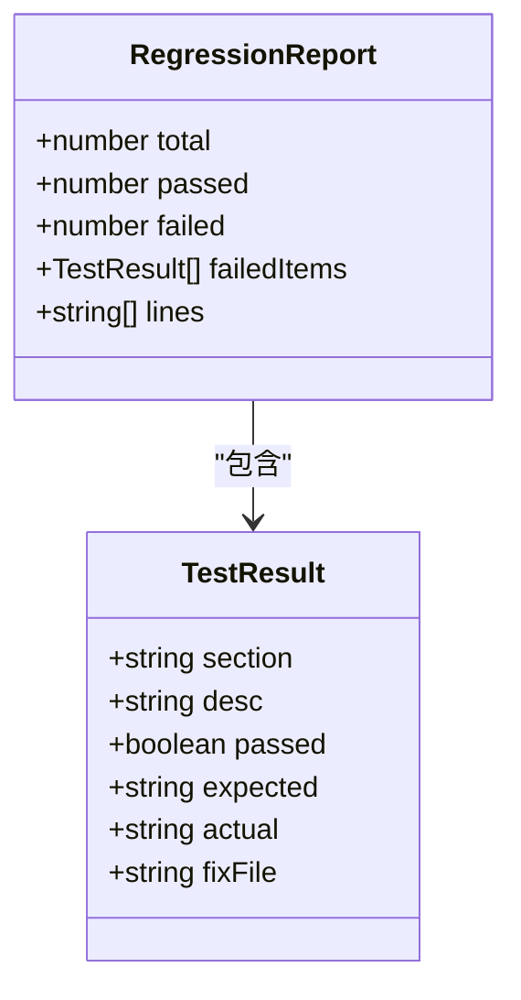
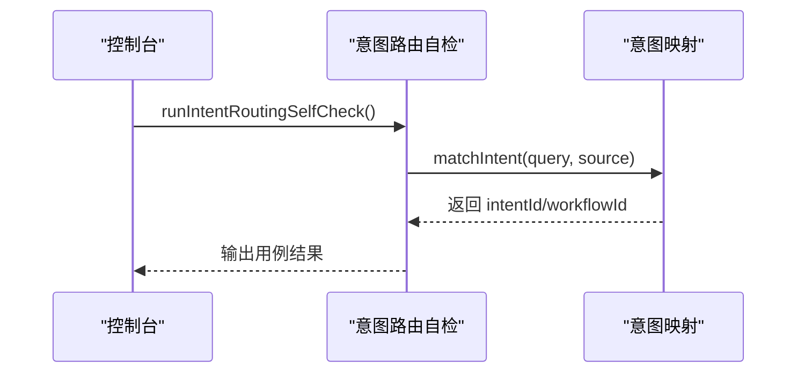
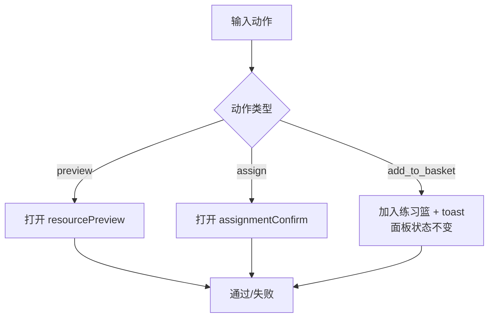
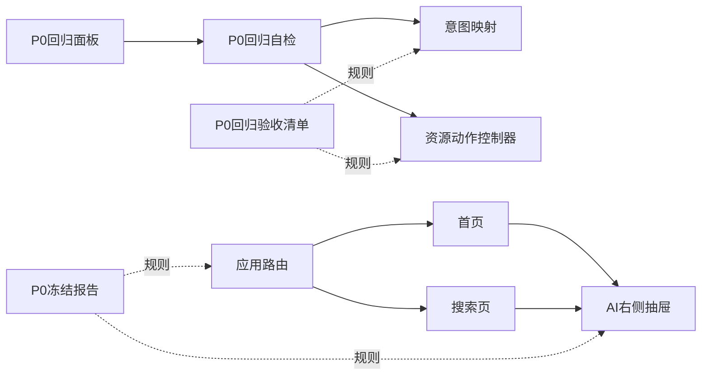

# P0回归测试

<cite>
**本文引用的文件**
- [P0回归面板](file://src/ai/dev/P0RegressionPanel.tsx)
- [P0回归自检](file://src/ai/tests/runP0RegressionSelfCheck.ts)
- [意图路由自检](file://src/ai/tests/intentRoutingSelfCheck.ts)
- [动作路由自检](file://src/ai/tests/actionRoutingSelfCheck.ts)
- [统一AI链路自检](file://src/ai/tests/unifiedAIFlowSelfCheck.ts)
- [意图映射](file://src/ai/router/intentMap.ts)
- [资源动作控制器](file://src/ai/controller/resourceActionController.ts)
- [应用路由](file://src/App.tsx)
- [首页](file://src/pages/HomePage.tsx)
- [搜索页](file://src/pages/SearchPage.tsx)
- [AI右侧抽屉](file://src/ai/components/AIAssistantDrawer.tsx)
- [P0回归验收清单](file://docs/p0-regression-checklist.md)
- [P0验收清单](file://docs/p0-acceptance-checklist.md)
- [P0冻结报告](file://docs/p0-freeze-report.md)
- [包配置](file://package.json)
</cite>

## 目录
1. [引言](#引言)
2. [项目结构](#项目结构)
3. [核心组件](#核心组件)
4. [架构总览](#架构总览)
5. [详细组件分析](#详细组件分析)
6. [依赖关系分析](#依赖关系分析)
7. [性能考量](#性能考量)
8. [故障排查指南](#故障排查指南)
9. [结论](#结论)
10. [附录](#附录)

## 引言
本文件面向小天AI教育平台的P0回归测试体系，系统化阐述P0回归测试的设计理念、实施策略与质量保障价值，覆盖测试用例选择标准、覆盖范围、P0回归面板的实现机制、执行流程与结果展示，并提供使用指南与最佳实践，帮助测试团队与开发者建立稳定可靠的P0回归体系。

## 项目结构
围绕P0回归测试的关键代码与文档分布如下：
- 开发态P0回归面板：位于开发环境专用的可视化控制面板，用于一键运行P0回归自检并展示结果。
- 测试自检模块：包含意图路由、动作路由、统一链路与全量回归自检，形成完整的回归用例矩阵。
- 路由与控制器：意图映射与资源动作控制器是P0回归的核心业务边界，决定用户意图到工作流的正确分流。
- 页面与组件：首页、搜索页、AI右侧抽屉等页面组件体现P0冻结的行为规则与交互约束。
- 文档：P0回归验收清单、P0验收清单、P0冻结报告等文档固化了P0规则与回归结果。

图表来源
- [P0回归面板:1-121](file://src/ai/dev/P0RegressionPanel.tsx#L1-L121)
- [P0回归自检:1-222](file://src/ai/tests/runP0RegressionSelfCheck.ts#L1-L222)
- [意图路由自检:1-96](file://src/ai/tests/intentRoutingSelfCheck.ts#L1-L96)
- [动作路由自检:1-197](file://src/ai/tests/actionRoutingSelfCheck.ts#L1-L197)
- [统一AI链路自检:1-104](file://src/ai/tests/unifiedAIFlowSelfCheck.ts#L1-L104)
- [意图映射:1-302](file://src/ai/router/intentMap.ts#L1-L302)
- [资源动作控制器:1-120](file://src/ai/controller/resourceActionController.ts#L1-L120)
- [应用路由:1-64](file://src/App.tsx#L1-L64)
- [首页:1-465](file://src/pages/HomePage.tsx#L1-L465)
- [搜索页:1-249](file://src/pages/SearchPage.tsx#L1-L249)
- [AI右侧抽屉:1-800](file://src/ai/components/AIAssistantDrawer.tsx#L1-L800)
- [P0回归验收清单:1-190](file://docs/p0-regression-checklist.md#L1-L190)
- [P0验收清单:1-161](file://docs/p0-acceptance-checklist.md#L1-L161)
- [P0冻结报告:1-116](file://docs/p0-freeze-report.md#L1-L116)

章节来源
- [P0回归面板:1-121](file://src/ai/dev/P0RegressionPanel.tsx#L1-L121)
- [P0回归自检:1-222](file://src/ai/tests/runP0RegressionSelfCheck.ts#L1-L222)
- [意图映射:1-302](file://src/ai/router/intentMap.ts#L1-L302)
- [资源动作控制器:1-120](file://src/ai/controller/resourceActionController.ts#L1-L120)
- [应用路由:1-64](file://src/App.tsx#L1-L64)
- [首页:1-465](file://src/pages/HomePage.tsx#L1-L465)
- [搜索页:1-249](file://src/pages/SearchPage.tsx#L1-L249)
- [AI右侧抽屉:1-800](file://src/ai/components/AIAssistantDrawer.tsx#L1-L800)
- [P0回归验收清单:1-190](file://docs/p0-regression-checklist.md#L1-L190)
- [P0验收清单:1-161](file://docs/p0-acceptance-checklist.md#L1-L161)
- [P0冻结报告:1-116](file://docs/p0-freeze-report.md#L1-L116)

## 核心组件
- P0回归面板：仅在开发模式显示，提供一键运行P0回归自检、结果统计、失败项修复指引与结果复制功能，便于开发自测与快速定位问题。
- P0回归自检：整合意图路由、动作路由、页面入口与面板导航四大维度的回归用例，输出结构化报告，支持在浏览器控制台直接运行。
- 意图路由自检：验证从自然语言输入到意图与工作流的正确分流，覆盖关键词匹配、来源增强与模糊输入策略。
- 动作路由自检：验证预览、布置、加入练习篮等动作的分流规则，确保UI行为与业务规则一致。
- 统一AI链路自检：串联意图路由与动作路由，验证从入口到最终动作的完整链路。
- 意图映射与资源动作控制器：P0回归的核心业务边界，决定用户意图到工作流与面板的正确映射。
- 页面与组件：首页、搜索页、AI右侧抽屉等页面组件体现P0冻结的行为规则与交互约束。

章节来源
- [P0回归面板:1-121](file://src/ai/dev/P0RegressionPanel.tsx#L1-L121)
- [P0回归自检:1-222](file://src/ai/tests/runP0RegressionSelfCheck.ts#L1-L222)
- [意图路由自检:1-96](file://src/ai/tests/intentRoutingSelfCheck.ts#L1-L96)
- [动作路由自检:1-197](file://src/ai/tests/actionRoutingSelfCheck.ts#L1-L197)
- [统一AI链路自检:1-104](file://src/ai/tests/unifiedAIFlowSelfCheck.ts#L1-L104)
- [意图映射:1-302](file://src/ai/router/intentMap.ts#L1-L302)
- [资源动作控制器:1-120](file://src/ai/controller/resourceActionController.ts#L1-L120)
- [首页:1-465](file://src/pages/HomePage.tsx#L1-L465)
- [搜索页:1-249](file://src/pages/SearchPage.tsx#L1-L249)
- [AI右侧抽屉:1-800](file://src/ai/components/AIAssistantDrawer.tsx#L1-L800)

## 架构总览
P0回归测试体系以“开发态可视化面板 + 多维度自检脚本 + 文档化规则”为核心，形成从入口到动作的闭环验证。

图表来源
- [P0回归面板:29-41](file://src/ai/dev/P0RegressionPanel.tsx#L29-L41)
- [P0回归自检:166-212](file://src/ai/tests/runP0RegressionSelfCheck.ts#L166-L212)
- [意图映射:219-272](file://src/ai/router/intentMap.ts#L219-L272)
- [资源动作控制器:60-119](file://src/ai/controller/resourceActionController.ts#L60-L119)

## 详细组件分析

### P0回归面板
- 设计理念：仅在开发模式可见，避免污染生产界面；提供一键运行、结果统计、失败项修复指引与复制功能。
- 组织方式：固定在右下角，支持展开/收起；运行后展示通过数、失败数与通过率。
- 执行流程：点击运行按钮触发自检，生成结构化报告；失败项展示修复文件与描述。
- 结果展示：支持复制验收结果到剪贴板，便于快速分享与归档。

图表来源
- [P0回归面板:29-41](file://src/ai/dev/P0RegressionPanel.tsx#L29-L41)
- [P0回归自检:166-212](file://src/ai/tests/runP0RegressionSelfCheck.ts#L166-L212)

章节来源
- [P0回归面板:1-121](file://src/ai/dev/P0RegressionPanel.tsx#L1-L121)
- [P0回归自检:1-222](file://src/ai/tests/runP0RegressionSelfCheck.ts#L1-L222)

### P0回归自检（全量）
- 覆盖范围：意图路由（11条）、动作路由（5条）、页面入口（7条）、面板导航（若干条）。
- 用例设计：每个维度抽取代表性场景，覆盖关键词匹配、来源增强、模糊输入、面板切换与关闭等关键路径。
- 报告格式：结构化文本，包含各维度用例、期望/实际对比、失败项修复指引与汇总统计。
- 运行方式：支持在浏览器控制台与Node环境中直接调用。

图表来源
- [P0回归自检:158-164](file://src/ai/tests/runP0RegressionSelfCheck.ts#L158-L164)
- [P0回归自检:19-26](file://src/ai/tests/runP0RegressionSelfCheck.ts#L19-L26)

章节来源
- [P0回归自检:1-222](file://src/ai/tests/runP0RegressionSelfCheck.ts#L1-L222)

### 意图路由自检
- 核心目标：验证自然语言输入到意图与工作流的正确分流，覆盖关键词匹配、来源增强与模糊输入策略。
- 用例设计：包含基础关键词、相同输入不同来源、布置意图覆盖、模糊输入不默认等场景。
- 报告输出：逐条用例的期望/实际对比，便于快速定位规则偏差。

图表来源
- [意图路由自检:55-87](file://src/ai/tests/intentRoutingSelfCheck.ts#L55-L87)
- [意图映射:219-272](file://src/ai/router/intentMap.ts#L219-L272)

章节来源
- [意图路由自检:1-96](file://src/ai/tests/intentRoutingSelfCheck.ts#L1-L96)
- [意图映射:1-302](file://src/ai/router/intentMap.ts#L1-L302)

### 动作路由自检
- 核心目标：验证预览、布置、加入练习篮等动作的分流规则，确保UI行为与业务规则一致。
- 用例设计：覆盖预览仅打开预览面板、布置仅打开确认面板、加入练习篮仅更新状态且不改变面板等。
- 报告输出：逐条用例的期望/实际对比，包含去重拦截与链路正确性校验。

图表来源
- [动作路由自检:31-69](file://src/ai/tests/actionRoutingSelfCheck.ts#L31-L69)
- [资源动作控制器:60-119](file://src/ai/controller/resourceActionController.ts#L60-L119)

章节来源
- [动作路由自检:1-197](file://src/ai/tests/actionRoutingSelfCheck.ts#L1-L197)
- [资源动作控制器:1-120](file://src/ai/controller/resourceActionController.ts#L1-L120)

### 统一AI链路自检
- 核心目标：串联意图路由与动作路由，验证从任意入口到最终动作的完整链路。
- 用例设计：覆盖常见意图与动作组合，以及页面入口与结果渲染的正确性。
- 报告输出：分维度展示结果并汇总通过率。

章节来源
- [统一AI链路自检:1-104](file://src/ai/tests/unifiedAIFlowSelfCheck.ts#L1-L104)

### 页面与组件（P0冻结规则）
- 首页：AI入口跳转至搜索页，快捷动作触发意图匹配与工作流执行。
- 搜索页：路由到搜索页，URL参数自动执行搜索，结果渲染与动作处理。
- AI右侧抽屉：仅承载预览、布置、练习篮、制卡、词表编辑、洞察详情等面板，不承载搜索首页/结果/workflow等旧逻辑。

章节来源
- [应用路由:28-63](file://src/App.tsx#L28-L63)
- [首页:122-173](file://src/pages/HomePage.tsx#L122-L173)
- [搜索页:61-88](file://src/pages/SearchPage.tsx#L61-L88)
- [AI右侧抽屉:1-18](file://src/ai/components/AIAssistantDrawer.tsx#L1-L18)

## 依赖关系分析
- P0回归面板依赖P0回归自检模块，用于生成与展示结果。
- P0回归自检依赖意图映射与资源动作控制器，用于验证意图分流与动作分流。
- 页面与组件依赖路由与状态管理，体现P0冻结规则。
- 文档（验收清单、冻结报告）固化规则，指导测试用例设计与回归结果判定。

图表来源
- [P0回归面板:14-31](file://src/ai/dev/P0RegressionPanel.tsx#L14-L31)
- [P0回归自检:12-16](file://src/ai/tests/runP0RegressionSelfCheck.ts#L12-L16)
- [意图映射:1-11](file://src/ai/router/intentMap.ts#L1-L11)
- [资源动作控制器:1-6](file://src/ai/controller/resourceActionController.ts#L1-L6)
- [应用路由:28-63](file://src/App.tsx#L28-L63)
- [首页:107-173](file://src/pages/HomePage.tsx#L107-L173)
- [搜索页:27-88](file://src/pages/SearchPage.tsx#L27-L88)
- [AI右侧抽屉:1-18](file://src/ai/components/AIAssistantDrawer.tsx#L1-L18)
- [P0回归验收清单:1-190](file://docs/p0-regression-checklist.md#L1-L190)
- [P0冻结报告:1-116](file://docs/p0-freeze-report.md#L1-L116)

章节来源
- [P0回归面板:1-121](file://src/ai/dev/P0RegressionPanel.tsx#L1-L121)
- [P0回归自检:1-222](file://src/ai/tests/runP0RegressionSelfCheck.ts#L1-L222)
- [意图映射:1-302](file://src/ai/router/intentMap.ts#L1-L302)
- [资源动作控制器:1-120](file://src/ai/controller/resourceActionController.ts#L1-L120)
- [应用路由:1-64](file://src/App.tsx#L1-L64)
- [首页:1-465](file://src/pages/HomePage.tsx#L1-L465)
- [搜索页:1-249](file://src/pages/SearchPage.tsx#L1-L249)
- [AI右侧抽屉:1-800](file://src/ai/components/AIAssistantDrawer.tsx#L1-L800)
- [P0回归验收清单:1-190](file://docs/p0-regression-checklist.md#L1-L190)
- [P0冻结报告:1-116](file://docs/p0-freeze-report.md#L1-L116)

## 性能考量
- 自检脚本采用轻量级测试框架与结构化输出，避免额外依赖，适合在开发态快速执行。
- 面板仅在开发模式渲染，不影响生产性能。
- 建议将P0回归纳入本地开发流水线，减少回归成本与风险。

## 故障排查指南
- 失败项定位：P0回归自检报告会列出失败用例与修复文件，优先检查对应模块的规则变更。
- 意图分流异常：检查意图映射规则与来源增强逻辑，确保关键词优先级与模糊输入策略符合预期。
- 动作分流异常：检查资源动作控制器的分流规则，确保预览/布置/加入练习篮等动作不越界。
- 页面行为异常：核对P0冻结报告中的规则，确认页面入口与组件行为未被破坏。
- 复制与归档：使用面板的复制功能将结果粘贴至问题跟踪系统，便于追踪与闭环。

章节来源
- [P0回归自检:185-212](file://src/ai/tests/runP0RegressionSelfCheck.ts#L185-L212)
- [意图映射:188-272](file://src/ai/router/intentMap.ts#L188-L272)
- [资源动作控制器:50-119](file://src/ai/controller/resourceActionController.ts#L50-L119)
- [P0冻结报告:84-116](file://docs/p0-freeze-report.md#L84-L116)

## 结论
P0回归测试体系通过开发态可视化面板与多维度自检脚本，构建了覆盖意图分流、动作分流、页面入口与面板导航的完整回归矩阵。配合文档化的P0规则与冻结报告，确保关键功能的稳定性、防止严重缺陷引入并维护产品可靠性。建议将P0回归纳入日常开发与提测流程，持续保障质量基线。

## 附录

### 使用指南与最佳实践
- 运行频率：每次修改AI相关代码后，优先运行P0回归自检；每日构建集成前执行一次。
- 用例编写规范：
  - 意图路由：覆盖关键词匹配、来源增强与模糊输入场景。
  - 动作路由：覆盖预览、布置、加入练习篮等关键动作，确保不越界。
  - 页面入口：验证首页、搜索页、抽屉等入口行为与冻结规则一致。
  - 面板导航：验证返回栈、关闭与成功后的关闭行为。
- 问题跟踪流程：失败项自动标注修复文件与描述，按修复文件定位责任人并闭环验证。

章节来源
- [P0回归自检:1-222](file://src/ai/tests/runP0RegressionSelfCheck.ts#L1-L222)
- [P0回归验收清单:1-190](file://docs/p0-regression-checklist.md#L1-L190)
- [P0冻结报告:110-116](file://docs/p0-freeze-report.md#L110-L116)