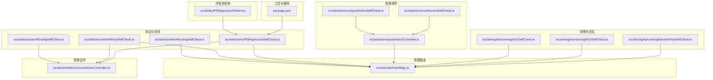
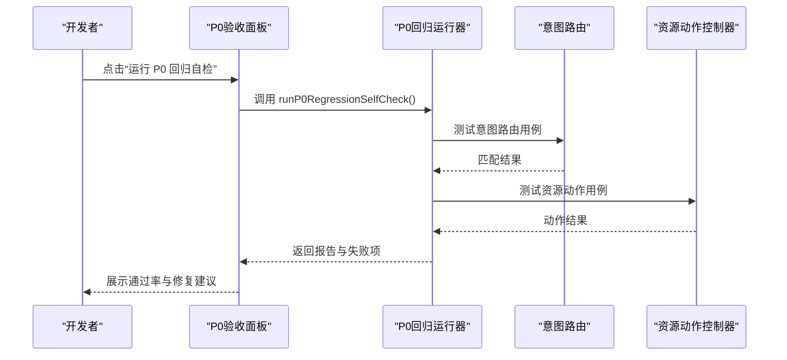
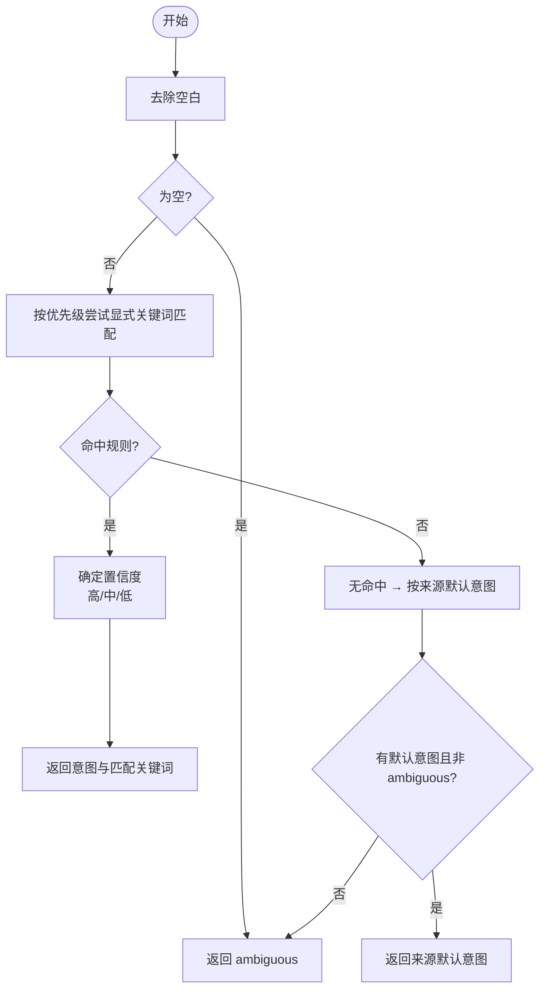
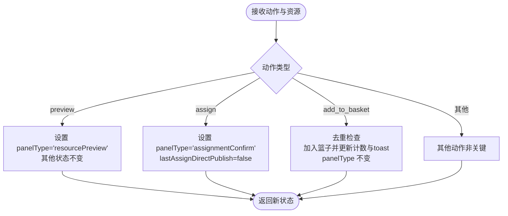
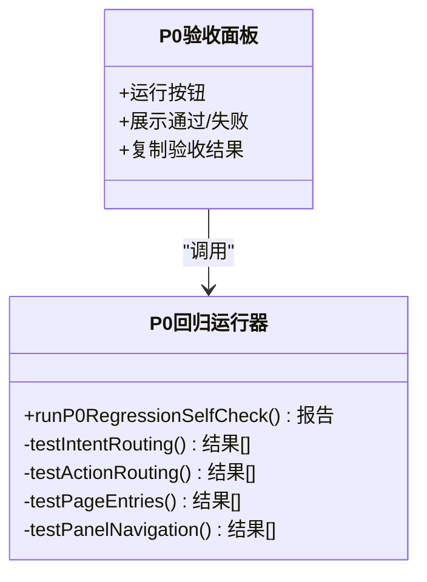
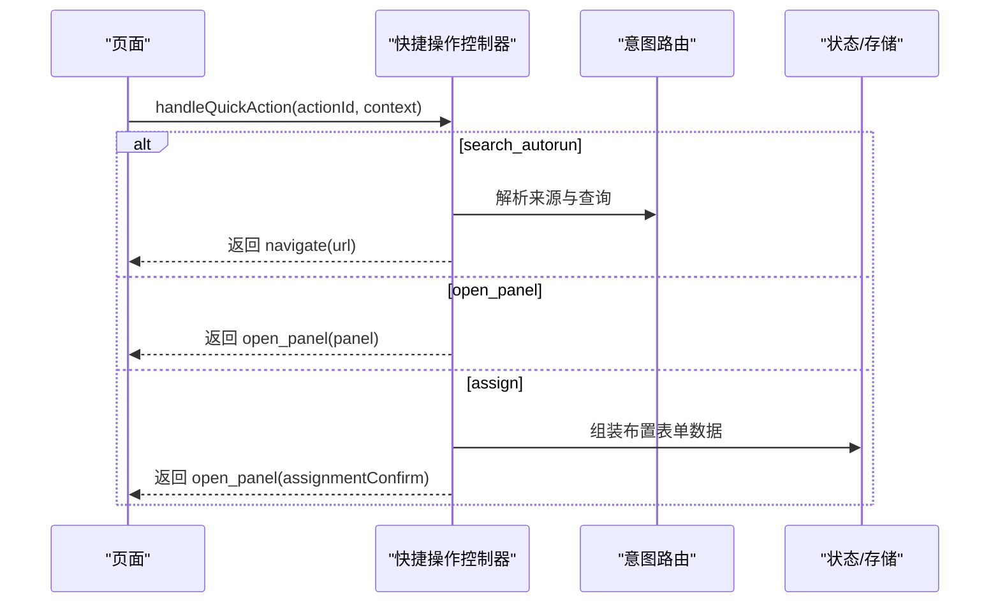
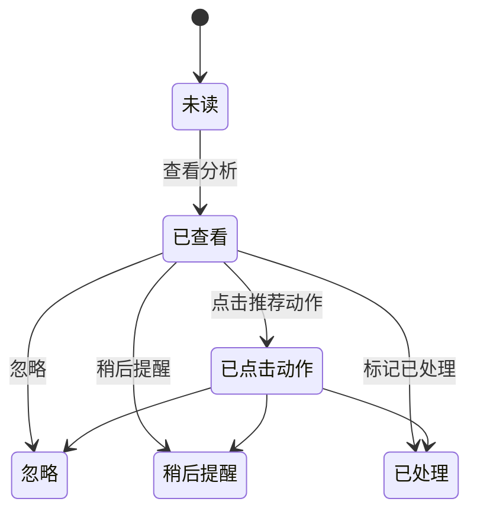
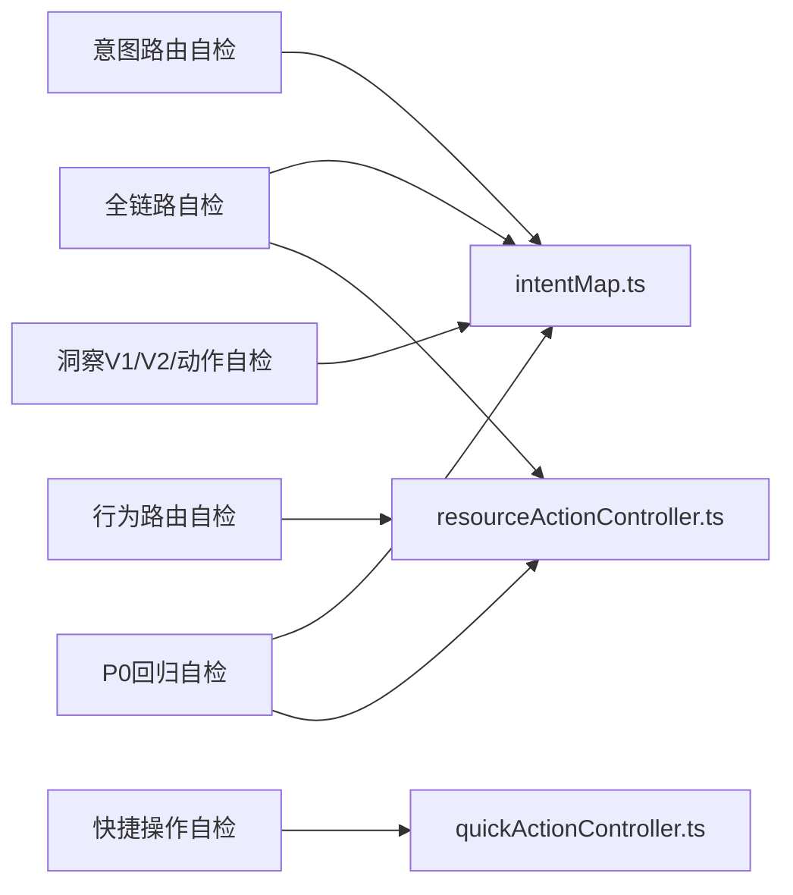

# 测试和质量保证

<cite>
**本文引用的文件**
- [intentRoutingSelfCheck.ts](file://src/ai/tests/intentRoutingSelfCheck.ts)
- [actionRoutingSelfCheck.ts](file://src/ai/tests/actionRoutingSelfCheck.ts)
- [runP0RegressionSelfCheck.ts](file://src/ai/tests/runP0RegressionSelfCheck.ts)
- [unifiedAIFlowSelfCheck.ts](file://src/ai/tests/unifiedAIFlowSelfCheck.ts)
- [P0RegressionPanel.tsx](file://src/ai/dev/P0RegressionPanel.tsx)
- [runHomeUiSelfCheck.ts](file://src/ai/actions/runHomeUiSelfCheck.ts)
- [runQuickActionSelfCheck.ts](file://src/ai/actions/runQuickActionSelfCheck.ts)
- [runInsightV1SelfCheck.ts](file://src/ai/insights/runInsightV1SelfCheck.ts)
- [runInsightV2SelfCheck.ts](file://src/ai/insights/runInsightV2SelfCheck.ts)
- [runInsightActionFlowSelfCheck.ts](file://src/ai/insights/runInsightActionFlowSelfCheck.ts)
- [intentMap.ts](file://src/ai/router/intentMap.ts)
- [quickActionController.ts](file://src/ai/actions/quickActionController.ts)
- [resourceActionController.ts](file://src/ai/controller/resourceActionController.ts)
- [package.json](file://package.json)
</cite>

## 目录
1. [引言](#引言)
2. [项目结构](#项目结构)
3. [核心组件](#核心组件)
4. [架构总览](#架构总览)
5. [详细组件分析](#详细组件分析)
6. [依赖分析](#依赖分析)
7. [性能考虑](#性能考虑)
8. [故障排查指南](#故障排查指南)
9. [结论](#结论)
10. [附录](#附录)

## 引言
本文件面向小天AI教育平台的测试与质量保证体系，系统化阐述自检机制（工作流自检、意图路由自检、快速行动自检）、P0回归测试设计与实施策略、测试用例管理与质量流程、缺陷跟踪机制、自动化测试配置与执行、测试覆盖率与性能测试策略，并提供测试扩展与自定义开发指南，帮助开发者建立完善的测试与质量保障体系。

## 项目结构
测试与质量保证相关代码主要分布在以下区域：
- 自检与回归：src/ai/tests 下的各类自检脚本
- 开发态验收面板：src/ai/dev/P0RegressionPanel.tsx
- 快速行动与快捷操作：src/ai/actions 下的自检与控制器
- 意图路由与工作流：src/ai/router/intentMap.ts
- 资源动作控制器：src/ai/controller/resourceActionController.ts
- 快捷操作控制器：src/ai/actions/quickActionController.ts
- 洞察与交互闭环：src/ai/insights 下的自检与控制器
- 项目脚本与工具：package.json

图表来源
- [intentRoutingSelfCheck.ts:1-96](file://src/ai/tests/intentRoutingSelfCheck.ts#L1-L96)
- [actionRoutingSelfCheck.ts:1-197](file://src/ai/tests/actionRoutingSelfCheck.ts#L1-L197)
- [unifiedAIFlowSelfCheck.ts:1-104](file://src/ai/tests/unifiedAIFlowSelfCheck.ts#L1-L104)
- [runP0RegressionSelfCheck.ts:1-222](file://src/ai/tests/runP0RegressionSelfCheck.ts#L1-L222)
- [P0RegressionPanel.tsx:1-121](file://src/ai/dev/P0RegressionPanel.tsx#L1-L121)
- [quickActionController.ts:1-124](file://src/ai/actions/quickActionController.ts#L1-L124)
- [runQuickActionSelfCheck.ts:1-151](file://src/ai/actions/runQuickActionSelfCheck.ts#L1-L151)
- [runHomeUiSelfCheck.ts:1-143](file://src/ai/actions/runHomeUiSelfCheck.ts#L1-L143)
- [intentMap.ts:1-302](file://src/ai/router/intentMap.ts#L1-L302)
- [resourceActionController.ts:1-120](file://src/ai/controller/resourceActionController.ts#L1-L120)
- [runInsightV1SelfCheck.ts:1-107](file://src/ai/insights/runInsightV1SelfCheck.ts#L1-L107)
- [runInsightV2SelfCheck.ts:1-260](file://src/ai/insights/runInsightV2SelfCheck.ts#L1-L260)
- [runInsightActionFlowSelfCheck.ts:1-168](file://src/ai/insights/runInsightActionFlowSelfCheck.ts#L1-L168)
- [package.json:1-31](file://package.json#L1-L31)

章节来源
- [package.json:1-31](file://package.json#L1-L31)

## 核心组件
- 意图路由自检：验证关键词匹配、来源增强与歧义处理，确保“布置”等高优意图优先、模糊输入不误判。
- 行为路由自检：验证资源预览、布置、加入篮子等动作的分流与状态变更约束。
- 全链路自检：串联意图路由与行为路由，覆盖从入口到最终动作的完整路径。
- P0回归自检：全量回归，覆盖意图路由、行为路由、页面入口与面板导航，输出修复指引。
- 开发态P0验收面板：开发模式下可视化运行P0回归并导出结果。
- 快捷操作自检与控制器：统一快捷操作映射与分发，保证URL构建与面板打开一致性。
- 首页UI对齐自检：验证首页能力保留与布局调整后的功能正确性。
- 洞察系统自检：V1文案安全与质量校验；V2统一教学洞察的数据结构、质量与视觉一致性；洞察动作交互闭环。
- 资源动作控制器：统一资源预览、布置、加入篮子、编辑、制卡等动作的路由与状态。

章节来源
- [intentRoutingSelfCheck.ts:1-96](file://src/ai/tests/intentRoutingSelfCheck.ts#L1-L96)
- [actionRoutingSelfCheck.ts:1-197](file://src/ai/tests/actionRoutingSelfCheck.ts#L1-L197)
- [unifiedAIFlowSelfCheck.ts:1-104](file://src/ai/tests/unifiedAIFlowSelfCheck.ts#L1-L104)
- [runP0RegressionSelfCheck.ts:1-222](file://src/ai/tests/runP0RegressionSelfCheck.ts#L1-L222)
- [P0RegressionPanel.tsx:1-121](file://src/ai/dev/P0RegressionPanel.tsx#L1-L121)
- [runQuickActionSelfCheck.ts:1-151](file://src/ai/actions/runQuickActionSelfCheck.ts#L1-L151)
- [quickActionController.ts:1-124](file://src/ai/actions/quickActionController.ts#L1-L124)
- [runHomeUiSelfCheck.ts:1-143](file://src/ai/actions/runHomeUiSelfCheck.ts#L1-L143)
- [runInsightV1SelfCheck.ts:1-107](file://src/ai/insights/runInsightV1SelfCheck.ts#L1-L107)
- [runInsightV2SelfCheck.ts:1-260](file://src/ai/insights/runInsightV2SelfCheck.ts#L1-L260)
- [runInsightActionFlowSelfCheck.ts:1-168](file://src/ai/insights/runInsightActionFlowSelfCheck.ts#L1-L168)
- [resourceActionController.ts:1-120](file://src/ai/controller/resourceActionController.ts#L1-L120)

## 架构总览
测试与质量保证采用“自检脚本 + 开发态面板 + 统一路由与控制器”的架构，确保：
- 路由与动作的职责清晰、边界明确
- 自检脚本覆盖关键路径与边界条件
- 开发态面板提供即时反馈与结果导出
- 缺陷定位精确到文件与用例

图表来源
- [P0RegressionPanel.tsx:22-32](file://src/ai/dev/P0RegressionPanel.tsx#L22-L32)
- [runP0RegressionSelfCheck.ts:166-212](file://src/ai/tests/runP0RegressionSelfCheck.ts#L166-L212)

## 详细组件分析

### 意图路由自检（Intent Routing Self-Check）
- 目标：验证关键词优先级、来源增强与歧义处理，确保高优意图优先、模糊输入不误判。
- 关键点：
  - 高优意图（如布置）优先于泛词汇匹配
  - 相同关键词在不同来源页面应产生不同默认意图
  - 无法判断时返回“ambiguous”，不默认词汇听写
- 用例覆盖：基础关键词、模糊输入、来源增强、布置意图保护
- 输出：逐条用例通过/失败与期望/实际对比

图表来源
- [intentRoutingSelfCheck.ts:55-87](file://src/ai/tests/intentRoutingSelfCheck.ts#L55-L87)
- [intentMap.ts:219-272](file://src/ai/router/intentMap.ts#L219-L272)

章节来源
- [intentRoutingSelfCheck.ts:1-96](file://src/ai/tests/intentRoutingSelfCheck.ts#L1-L96)
- [intentMap.ts:1-302](file://src/ai/router/intentMap.ts#L1-L302)

### 行为路由自检（Action Routing Self-Check）
- 目标：验证资源预览、布置、加入篮子等动作的分流与状态变更约束。
- 核心规则：
  - preview → 仅打开资源预览，不得进入布置确认
  - assign → 仅打开布置确认，不得直接发布或进入预览
  - add_to_basket → 仅加入篮子与提示，不得改变面板状态
  - 面板状态链路正确（如 preview→assign 的二级跳转）
  - 去重拦截（重复加入篮子不重复计数）
- 输出：逐条用例通过/失败与状态对比

图表来源
- [actionRoutingSelfCheck.ts:31-69](file://src/ai/tests/actionRoutingSelfCheck.ts#L31-L69)
- [resourceActionController.ts:60-119](file://src/ai/controller/resourceActionController.ts#L60-L119)

章节来源
- [actionRoutingSelfCheck.ts:1-197](file://src/ai/tests/actionRoutingSelfCheck.ts#L1-L197)
- [resourceActionController.ts:1-120](file://src/ai/controller/resourceActionController.ts#L1-L120)

### 全链路自检（Unified AI Flow Self-Check）
- 目标：串联意图路由与行为路由，验证从任意入口到最终动作的完整链路。
- 覆盖：
  - 意图路由：关键词→意图→工作流
  - 行为路由：动作→面板/内容生成
  - 页面入口：首页、搜索页、抽屉等
- 输出：分段统计与总通过率

章节来源
- [unifiedAIFlowSelfCheck.ts:1-104](file://src/ai/tests/unifiedAIFlowSelfCheck.ts#L1-L104)

### P0回归自检（P0 Regression Self-Check）
- 目标：全量回归，确保关键路径稳定。
- 覆盖维度：
  - A. 意图路由（11条）
  - B. 行为路由（5条）
  - C. 页面入口（7条）
  - D. 面板导航（若干条）
- 输出：结构化报告，包含失败项与修复文件指引
- 开发态集成：P0验收面板在开发模式下可视化运行并支持复制结果

图表来源
- [runP0RegressionSelfCheck.ts:166-212](file://src/ai/tests/runP0RegressionSelfCheck.ts#L166-L212)
- [P0RegressionPanel.tsx:22-32](file://src/ai/dev/P0RegressionPanel.tsx#L22-L32)

章节来源
- [runP0RegressionSelfCheck.ts:1-222](file://src/ai/tests/runP0RegressionSelfCheck.ts#L1-L222)
- [P0RegressionPanel.tsx:1-121](file://src/ai/dev/P0RegressionPanel.tsx#L1-L121)

### 快捷操作自检与控制器
- 目标：统一快捷操作映射与分发，保证URL构建与面板打开一致性。
- 关键点：
  - 映射完整性（≥8个动作）
  - 来源唯一性（首页与搜索各≥4个）
  - 分发规则：search_autorun→导航至/ai-search并带参数；open_panel→打开指定面板；assign→打开布置确认
  - buildSearchUrl：自动注入autoRun与source参数
- 输出：逐条用例通过/失败与参数校验

图表来源
- [quickActionController.ts:34-111](file://src/ai/actions/quickActionController.ts#L34-L111)
- [intentMap.ts:219-272](file://src/ai/router/intentMap.ts#L219-L272)

章节来源
- [runQuickActionSelfCheck.ts:1-151](file://src/ai/actions/runQuickActionSelfCheck.ts#L1-L151)
- [quickActionController.ts:1-124](file://src/ai/actions/quickActionController.ts#L1-L124)

### 首页UI对齐自检
- 目标：验证首页UI对齐后AI能力仍完整，不检查视觉外观，仅功能正确性。
- 关注点：
  - 首页洞察生成仍返回1-3条，且具备标题与证据摘要
  - 搜索输入仍可构建/ai-search链接并携带autoRun与source
  - 快捷操作控制器仍可分发并返回导航指令
  - 模块数据与组件导入完整性
  - 布局微调与无重复壳子（侧边栏/头部）

章节来源
- [runHomeUiSelfCheck.ts:1-143](file://src/ai/actions/runHomeUiSelfCheck.ts#L1-L143)

### 洞察系统自检
- V1自检：
  - 样本量判断、考前30天判断
  - 首页洞察生成数量与考试期置顶
  - 文案安全检查
- V2自检：
  - 教学洞察统一生成与面板映射
  - 数据结构质量（字段完整性、优先级、参考对比、问题诊断、影响范围）
  - 类型覆盖（指标与行动数量阈值）
  - 视觉一致性（优先级徽章颜色、结论卡片边框风格、行动卡片边框风格）
- 动作交互闭环：
  - 动作映射类型（generate/generate_content/recommend_resource/open_panel）
  - 动作路由（Drawer内打开/生成内容/布置确认）
  - 状态机：unread→viewed→action_clicked→ignored/remind_later/resolved

图表来源
- [runInsightActionFlowSelfCheck.ts:120-151](file://src/ai/insights/runInsightActionFlowSelfCheck.ts#L120-L151)

章节来源
- [runInsightV1SelfCheck.ts:1-107](file://src/ai/insights/runInsightV1SelfCheck.ts#L1-L107)
- [runInsightV2SelfCheck.ts:1-260](file://src/ai/insights/runInsightV2SelfCheck.ts#L1-L260)
- [runInsightActionFlowSelfCheck.ts:1-168](file://src/ai/insights/runInsightActionFlowSelfCheck.ts#L1-L168)

## 依赖分析
- 自检脚本依赖：
  - 意图路由：intentMap.ts
  - 资源动作：resourceActionController.ts
  - 快捷操作：quickActionController.ts
  - 洞察系统：insightActionController/insightStatus/insightActionMap
- 开发态面板依赖P0回归运行器输出结构化报告
- 脚本运行工具：package.json中的脚本（如tsx）用于直接运行自检脚本

图表来源
- [intentRoutingSelfCheck.ts:10-11](file://src/ai/tests/intentRoutingSelfCheck.ts#L10-L11)
- [actionRoutingSelfCheck.ts:1-10](file://src/ai/tests/actionRoutingSelfCheck.ts#L1-L10)
- [unifiedAIFlowSelfCheck.ts:7-10](file://src/ai/tests/unifiedAIFlowSelfCheck.ts#L7-L10)
- [runP0RegressionSelfCheck.ts:12-15](file://src/ai/tests/runP0RegressionSelfCheck.ts#L12-L15)
- [runQuickActionSelfCheck.ts:7-8](file://src/ai/actions/runQuickActionSelfCheck.ts#L7-L8)
- [runInsightV1SelfCheck.ts:7-12](file://src/ai/insights/runInsightV1SelfCheck.ts#L7-L12)
- [runInsightV2SelfCheck.ts:8-9](file://src/ai/insights/runInsightV2SelfCheck.ts#L8-L9)
- [runInsightActionFlowSelfCheck.ts:7-10](file://src/ai/insights/runInsightActionFlowSelfCheck.ts#L7-L10)

章节来源
- [package.json:6-10](file://package.json#L6-L10)

## 性能考虑
- 自检脚本以同步函数运行，适合在本地与CI中快速反馈，避免长耗时阻塞。
- P0回归报告聚合多个维度，建议在CI中按需触发（如PR关联）。
- 意图路由与动作路由均使用轻量级匹配与查找，复杂度与规则数量线性相关，建议控制规则数量与正则复杂度。
- 开发态面板仅在开发环境启用，避免生产开销。

## 故障排查指南
- 意图路由误判：
  - 检查关键词正则与优先级顺序
  - 确认来源增强是否生效
  - 避免将“词汇”等泛关键词置于高优先级
- 行为路由异常：
  - 检查资源动作控制器的分支逻辑与返回值
  - 确认面板状态未被外部逻辑篡改
- 快捷操作URL缺失参数：
  - 检查buildSearchUrl与handleQuickAction的参数拼接
- P0回归失败：
  - 根据报告中的“修复文件”定位具体模块
  - 在开发态面板中复制结果并与团队共享
- 洞察文案问题：
  - 使用文案安全检查函数定位问题项
  - 统一文案规范与风险提示

章节来源
- [intentMap.ts:70-186](file://src/ai/router/intentMap.ts#L70-L186)
- [resourceActionController.ts:60-119](file://src/ai/controller/resourceActionController.ts#L60-L119)
- [quickActionController.ts:115-123](file://src/ai/actions/quickActionController.ts#L115-L123)
- [runP0RegressionSelfCheck.ts:202-209](file://src/ai/tests/runP0RegressionSelfCheck.ts#L202-L209)
- [runInsightV1SelfCheck.ts:77-89](file://src/ai/insights/runInsightV1SelfCheck.ts#L77-L89)

## 结论
通过意图路由自检、行为路由自检、全链路自检与P0回归自检的组合，配合开发态验收面板与洞察系统自检，小天AI教育平台建立了覆盖关键路径、可追溯、可扩展的质量保证体系。建议在CI中定期运行P0回归，在PR中强制通过关键自检，持续优化规则与用例，提升系统稳定性与交付质量。

## 附录
- 自动化测试配置与执行：
  - 使用package.json中的脚本运行自检脚本
  - 在CI中添加P0回归步骤，失败即阻断
- 测试用例管理：
  - 将用例集中在对应自检文件中，便于维护与扩展
  - 用例命名清晰，包含场景与预期
- 缺陷跟踪：
  - P0回归报告提供“修复文件”字段，便于追踪责任与修复
- 测试扩展与自定义：
  - 新增自检时遵循现有结构（用例数组、结果收集、输出格式）
  - 如需新增规则，优先在intentMap.ts中扩展，保持路由集中管理
  - 新增动作时在resourceActionController.ts中补充分支并在自检中覆盖