# 自检系统

<cite>
**本文引用的文件**
- [unifiedAIFlowSelfCheck.ts](file://src/ai/tests/unifiedAIFlowSelfCheck.ts)
- [intentRoutingSelfCheck.ts](file://src/ai/tests/intentRoutingSelfCheck.ts)
- [actionRoutingSelfCheck.ts](file://src/ai/tests/actionRoutingSelfCheck.ts)
- [runP0RegressionSelfCheck.ts](file://src/ai/tests/runP0RegressionSelfCheck.ts)
- [runQuickActionSelfCheck.ts](file://src/ai/actions/runQuickActionSelfCheck.ts)
- [intentMap.ts](file://src/ai/router/intentMap.ts)
- [resourceActionController.ts](file://src/ai/controller/resourceActionController.ts)
- [quickActionController.ts](file://src/ai/actions/quickActionController.ts)
- [quickActionMap.ts](file://src/ai/actions/quickActionMap.ts)
- [quickActionTypes.ts](file://src/ai/actions/quickActionTypes.ts)
- [panelState.ts](file://src/ai/controller/panelState.ts)
- [ai-insight-design.md](file://docs/ai-insight-design.md)
- [p0-acceptance-checklist.md](file://docs/p0-acceptance-checklist.md)
- [package.json](file://package.json)
</cite>

## 目录
1. [简介](#简介)
2. [项目结构](#项目结构)
3. [核心组件](#核心组件)
4. [架构总览](#架构总览)
5. [详细组件分析](#详细组件分析)
6. [依赖关系分析](#依赖关系分析)
7. [性能考量](#性能考量)
8. [故障排查指南](#故障排查指南)
9. [结论](#结论)
10. [附录](#附录)

## 简介
本文件为小天AI教育平台“自检系统”的权威技术文档，围绕统一AI流程自检展开，系统性阐述意图路由自检与动作路由自检的工作原理、测试用例设计、执行流程与结果验证机制，并总结自检系统在开发过程中的价值与使用方法，提供扩展指南与最佳实践，帮助开发者快速理解与高效使用。

## 项目结构
自检系统位于 src/ai/tests 目录，配合路由与控制器模块共同构成完整的自检闭环。关键文件与职责如下：
- src/ai/tests/unifiedAIFlowSelfCheck.ts：全链路自检入口，整合意图路由与动作路由测试，输出综合报告。
- src/ai/tests/intentRoutingSelfCheck.ts：意图路由自检，覆盖关键词匹配、source增强、模糊输入与布置覆盖等场景。
- src/ai/tests/actionRoutingSelfCheck.ts：动作路由自检，模拟预览/布置/加入练习篮的行为与状态流转。
- src/ai/tests/runP0RegressionSelfCheck.ts：P0回归自检，覆盖意图路由、动作路由、页面入口与面板导航等关键路径。
- src/ai/actions/runQuickActionSelfCheck.ts：快捷操作统一自检，校验快捷动作映射、控制器分发与URL构建。
- src/ai/router/intentMap.ts：意图路由核心，定义意图规则、优先级与source默认意图。
- src/ai/controller/resourceActionController.ts：资源动作控制器，统一处理预览、布置、加入练习篮等动作。
- src/ai/actions/quickActionController.ts：快捷动作控制器，统一分发搜索自动运行、打开面板、布置等行为。
- src/ai/actions/quickActionMap.ts：快捷动作注册表，集中管理所有快捷动作配置。
- src/ai/actions/quickActionTypes.ts：快捷动作类型定义，约束字段与行为类型。
- src/ai/controller/panelState.ts：面板类型与默认表单定义，确保动作结果与UI状态一致。

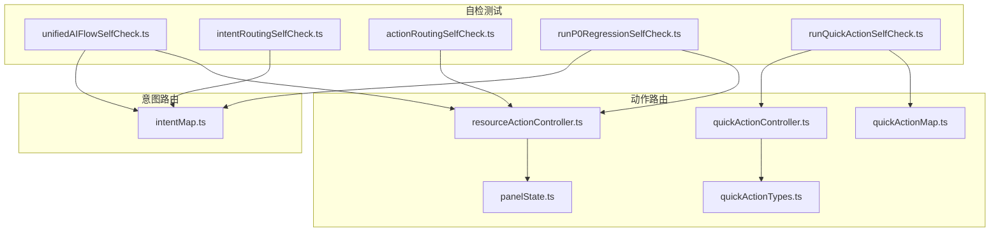

**图表来源**
- [unifiedAIFlowSelfCheck.ts:1-104](file://src/ai/tests/unifiedAIFlowSelfCheck.ts#L1-L104)
- [intentRoutingSelfCheck.ts:1-96](file://src/ai/tests/intentRoutingSelfCheck.ts#L1-L96)
- [actionRoutingSelfCheck.ts:1-197](file://src/ai/tests/actionRoutingSelfCheck.ts#L1-L197)
- [runP0RegressionSelfCheck.ts:1-222](file://src/ai/tests/runP0RegressionSelfCheck.ts#L1-L222)
- [runQuickActionSelfCheck.ts:1-151](file://src/ai/actions/runQuickActionSelfCheck.ts#L1-L151)
- [intentMap.ts:1-302](file://src/ai/router/intentMap.ts#L1-L302)
- [resourceActionController.ts:1-120](file://src/ai/controller/resourceActionController.ts#L1-L120)
- [quickActionController.ts:1-124](file://src/ai/actions/quickActionController.ts#L1-L124)
- [quickActionMap.ts:1-113](file://src/ai/actions/quickActionMap.ts#L1-L113)
- [quickActionTypes.ts:1-66](file://src/ai/actions/quickActionTypes.ts#L1-L66)
- [panelState.ts:1-52](file://src/ai/controller/panelState.ts#L1-L52)

**章节来源**
- [unifiedAIFlowSelfCheck.ts:1-104](file://src/ai/tests/unifiedAIFlowSelfCheck.ts#L1-L104)
- [intentRoutingSelfCheck.ts:1-96](file://src/ai/tests/intentRoutingSelfCheck.ts#L1-L96)
- [actionRoutingSelfCheck.ts:1-197](file://src/ai/tests/actionRoutingSelfCheck.ts#L1-L197)
- [runP0RegressionSelfCheck.ts:1-222](file://src/ai/tests/runP0RegressionSelfCheck.ts#L1-L222)
- [runQuickActionSelfCheck.ts:1-151](file://src/ai/actions/runQuickActionSelfCheck.ts#L1-L151)
- [intentMap.ts:1-302](file://src/ai/router/intentMap.ts#L1-L302)
- [resourceActionController.ts:1-120](file://src/ai/controller/resourceActionController.ts#L1-L120)
- [quickActionController.ts:1-124](file://src/ai/actions/quickActionController.ts#L1-L124)
- [quickActionMap.ts:1-113](file://src/ai/actions/quickActionMap.ts#L1-L113)
- [quickActionTypes.ts:1-66](file://src/ai/actions/quickActionTypes.ts#L1-L66)
- [panelState.ts:1-52](file://src/ai/controller/panelState.ts#L1-L52)

## 核心组件
- 统一AI流程自检：整合意图路由与动作路由测试，输出全链路通过率与明细。
- 意图路由自检：验证关键词匹配、source增强、模糊输入与布置覆盖等规则。
- 动作路由自检：验证预览、布置、加入练习篮等动作的面板切换与状态变更。
- P0回归自检：覆盖意图路由、动作路由、页面入口与面板导航的关键路径。
- 快捷操作统一自检：验证快捷动作映射、控制器分发与URL构建。
- 意图路由核心：规则优先级、source默认意图与关键词匹配。
- 资源动作控制器：统一处理预览、布置、加入练习篮等动作，保证UI状态一致性。
- 快捷动作控制器与注册表：统一分发搜索自动运行、打开面板、布置等行为。
- 面板类型与默认表单：确保动作结果与UI状态一致。

**章节来源**
- [unifiedAIFlowSelfCheck.ts:67-96](file://src/ai/tests/unifiedAIFlowSelfCheck.ts#L67-L96)
- [intentRoutingSelfCheck.ts:55-87](file://src/ai/tests/intentRoutingSelfCheck.ts#L55-L87)
- [actionRoutingSelfCheck.ts:73-189](file://src/ai/tests/actionRoutingSelfCheck.ts#L73-L189)
- [runP0RegressionSelfCheck.ts:166-212](file://src/ai/tests/runP0RegressionSelfCheck.ts#L166-L212)
- [runQuickActionSelfCheck.ts:10-143](file://src/ai/actions/runQuickActionSelfCheck.ts#L10-L143)
- [intentMap.ts:70-272](file://src/ai/router/intentMap.ts#L70-L272)
- [resourceActionController.ts:50-119](file://src/ai/controller/resourceActionController.ts#L50-L119)
- [quickActionController.ts:34-123](file://src/ai/actions/quickActionController.ts#L34-L123)
- [quickActionMap.ts:12-112](file://src/ai/actions/quickActionMap.ts#L12-L112)
- [panelState.ts:7-51](file://src/ai/controller/panelState.ts#L7-L51)

## 架构总览
自检系统通过测试用例驱动，验证从自然语言输入到最终动作执行的完整链路。其核心流程如下：
- 意图路由：输入查询与来源 → 匹配意图规则 → 返回意图ID与工作流ID。
- 动作路由：资源动作 → 统一控制器 → 返回面板类型与数据。
- 快捷动作：快捷动作ID → 控制器分发 → 导航URL或面板指令。
- 全链路汇总：将意图路由与动作路由结果汇总，输出通过率与明细。

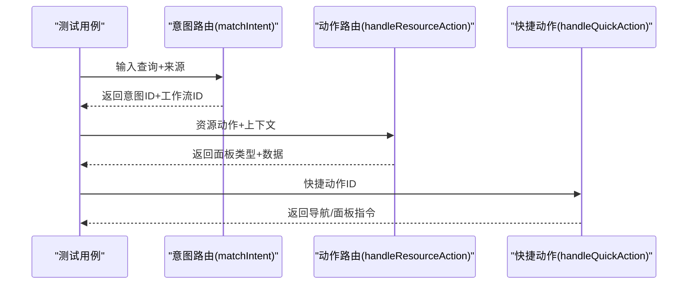

**图表来源**
- [intentMap.ts:219-272](file://src/ai/router/intentMap.ts#L219-L272)
- [resourceActionController.ts:60-119](file://src/ai/controller/resourceActionController.ts#L60-L119)
- [quickActionController.ts:34-111](file://src/ai/actions/quickActionController.ts#L34-L111)

## 详细组件分析

### 统一AI流程自检（unifiedAIFlowSelfCheck）
- 测试目标：验证从任意入口到最终动作的完整链路。
- 测试内容：
  - 意图路由：关键词匹配、source增强、模糊输入与布置覆盖。
  - 动作路由：预览、布置、加入练习篮、制卡、编辑等动作的面板切换。
  - 页面入口：首页AI入口、搜索页、结果渲染与动作分发。
- 执行流程：逐条执行测试用例，收集通过/失败结果，输出综合统计。
- 结果验证：计算通过数量与百分比，输出详细日志。

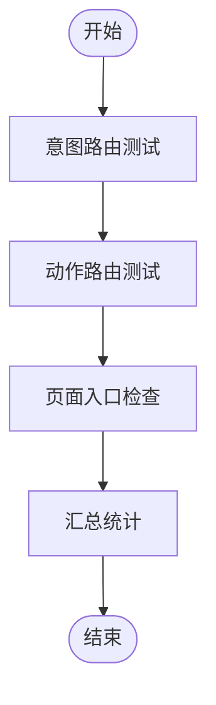

**图表来源**
- [unifiedAIFlowSelfCheck.ts:14-96](file://src/ai/tests/unifiedAIFlowSelfCheck.ts#L14-L96)

**章节来源**
- [unifiedAIFlowSelfCheck.ts:14-96](file://src/ai/tests/unifiedAIFlowSelfCheck.ts#L14-L96)

### 意图路由自检（intentRoutingSelfCheck）
- 测试目标：验证所有入口到意图再到工作流的分流正确性。
- 测试用例设计：
  - 基础关键词测试：覆盖词汇听写、阅读理解、听说训练、写作分析、学情分析、错词分析、错题分析、资源搜索、智能组卷、快速制卡、布置等。
  - 模糊输入：避免默认词汇听写，返回ambiguous。
  - source增强：相同输入在不同页面来源应产生不同意图。
  - 布置覆盖：包含“布置”关键词的输入应稳定识别为assignment。
- 执行流程：遍历测试用例，调用matchIntent，比较期望与实际意图ID与工作流ID。
- 结果验证：输出通过/失败明细与通过率。

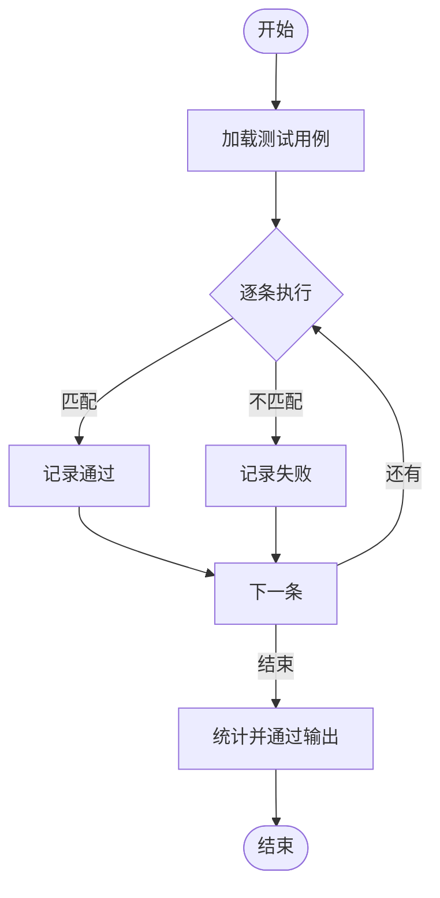

**图表来源**
- [intentRoutingSelfCheck.ts:55-87](file://src/ai/tests/intentRoutingSelfCheck.ts#L55-L87)
- [intentMap.ts:219-272](file://src/ai/router/intentMap.ts#L219-L272)

**章节来源**
- [intentRoutingSelfCheck.ts:19-87](file://src/ai/tests/intentRoutingSelfCheck.ts#L19-L87)
- [intentMap.ts:70-272](file://src/ai/router/intentMap.ts#L70-L272)

### 动作路由自检（actionRoutingSelfCheck）
- 测试目标：验证预览、布置、加入练习篮等动作的面板切换与状态变更。
- 测试用例设计：
  - 预览：仅能打开资源预览，不能进入布置确认。
  - 布置：仅能打开布置确认，不能直接发布。
  - 加入练习篮：仅能加入篮子与提示，不能改变面板状态。
  - 重复加入：去重拦截，避免重复添加。
  - 链式动作：预览后点击布置，应正确跳转至布置确认。
- 执行流程：模拟状态机，执行动作后检查面板类型、计数与提示。
- 结果验证：输出通过/失败明细与通过率。

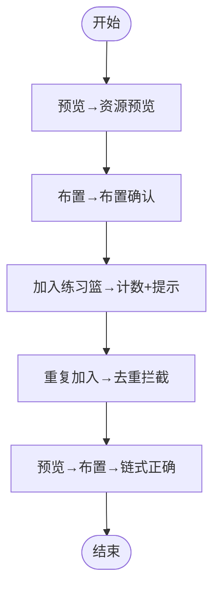

**图表来源**
- [actionRoutingSelfCheck.ts:73-189](file://src/ai/tests/actionRoutingSelfCheck.ts#L73-L189)
- [resourceActionController.ts:60-119](file://src/ai/controller/resourceActionController.ts#L60-L119)

**章节来源**
- [actionRoutingSelfCheck.ts:73-189](file://src/ai/tests/actionRoutingSelfCheck.ts#L73-L189)
- [resourceActionController.ts:50-119](file://src/ai/controller/resourceActionController.ts#L50-L119)

### P0回归自检（runP0RegressionSelfCheck）
- 测试目标：全量回归，覆盖意图路由、动作路由、页面入口与面板导航。
- 测试内容：
  - 意图路由：11条关键词测试。
  - 动作路由：5条动作测试。
  - 页面入口：7条架构级检查。
  - 面板导航：6条导航行为检查。
- 执行流程：分别执行四类测试，收集结果并生成报告。
- 结果验证：输出总通过数、失败项与修复文件指引。

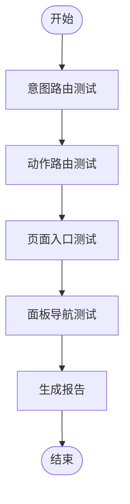

**图表来源**
- [runP0RegressionSelfCheck.ts:166-212](file://src/ai/tests/runP0RegressionSelfCheck.ts#L166-L212)

**章节来源**
- [runP0RegressionSelfCheck.ts:30-154](file://src/ai/tests/runP0RegressionSelfCheck.ts#L30-L154)
- [runP0RegressionSelfCheck.ts:166-212](file://src/ai/tests/runP0RegressionSelfCheck.ts#L166-L212)

### 快捷操作统一自检（runQuickActionSelfCheck）
- 测试目标：验证快捷动作映射、控制器分发与URL构建。
- 测试内容：
  - 快捷动作映射：至少8个动作，包含主页与AI搜索两类。
  - 控制器分发：不同动作返回正确的导航/面板指令。
  - URL构建：buildSearchUrl正确拼接参数。
  - Source唯一性：主页与AI搜索动作数量与来源校验。
- 执行流程：逐一校验映射、分发与URL构建，输出通过/失败明细。
- 结果验证：输出总通过数与通过率。

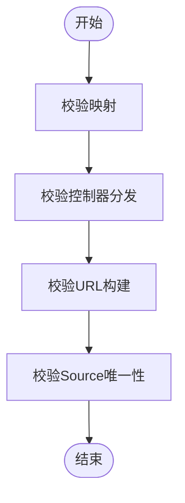

**图表来源**
- [runQuickActionSelfCheck.ts:10-143](file://src/ai/actions/runQuickActionSelfCheck.ts#L10-L143)
- [quickActionController.ts:34-123](file://src/ai/actions/quickActionController.ts#L34-L123)
- [quickActionMap.ts:12-112](file://src/ai/actions/quickActionMap.ts#L12-L112)

**章节来源**
- [runQuickActionSelfCheck.ts:10-143](file://src/ai/actions/runQuickActionSelfCheck.ts#L10-L143)
- [quickActionController.ts:34-123](file://src/ai/actions/quickActionController.ts#L34-L123)
- [quickActionMap.ts:12-112](file://src/ai/actions/quickActionMap.ts#L12-L112)

### 意图路由核心（intentMap）
- 规则优先级：关键词显式匹配优先，随后source增强，默认ambiguous。
- 关键接口：
  - matchIntent：输入查询与来源，返回意图ID、工作流ID与置信度。
  - isWorkflowQuery：判断是否应运行工作流而非搜索。
  - getWorkflowId：根据意图ID获取工作流ID。
  - getAllRules/getSourceDefaults：用于调试与自检。

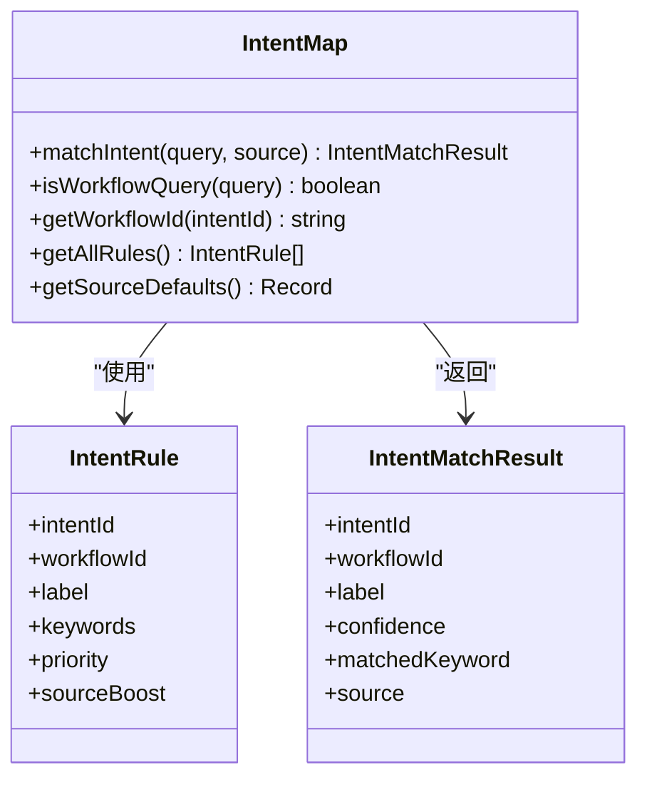

**图表来源**
- [intentMap.ts:49-68](file://src/ai/router/intentMap.ts#L49-L68)
- [intentMap.ts:219-272](file://src/ai/router/intentMap.ts#L219-L272)

**章节来源**
- [intentMap.ts:15-301](file://src/ai/router/intentMap.ts#L15-L301)

### 资源动作控制器（resourceActionController）
- 统一动作处理：预览、布置、加入练习篮、编辑、制卡。
- 面板类型与数据：
  - 预览：返回资源预览面板与预览数据。
  - 布置：返回布置确认面板与默认表单数据。
  - 加入练习篮：仅调用store.addToBasket，面板类型为null。
  - 编辑/制卡：返回对应面板类型。
- 与面板状态约定：严格遵守panelState.ts中的面板类型定义。

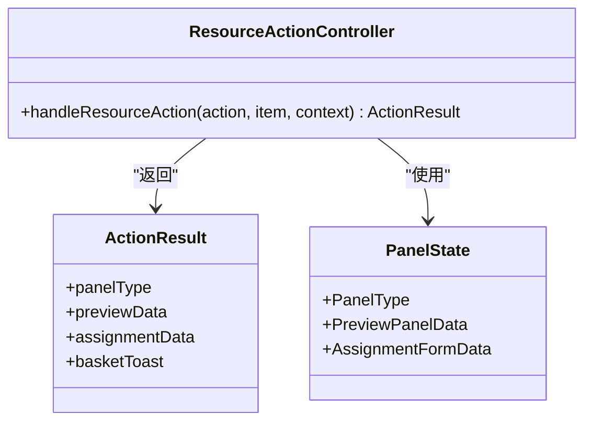

**图表来源**
- [resourceActionController.ts:37-46](file://src/ai/controller/resourceActionController.ts#L37-L46)
- [panelState.ts:7-51](file://src/ai/controller/panelState.ts#L7-L51)

**章节来源**
- [resourceActionController.ts:50-119](file://src/ai/controller/resourceActionController.ts#L50-L119)
- [panelState.ts:7-51](file://src/ai/controller/panelState.ts#L7-L51)

### 快捷动作控制器与注册表（quickActionController & quickActionMap）
- 控制器分发：根据actionType分发到搜索自动运行、打开面板、布置等。
- 注册表：集中管理所有快捷动作，提供查询与筛选。
- 类型约束：quickActionTypes.ts定义了类别、行为类型与来源。

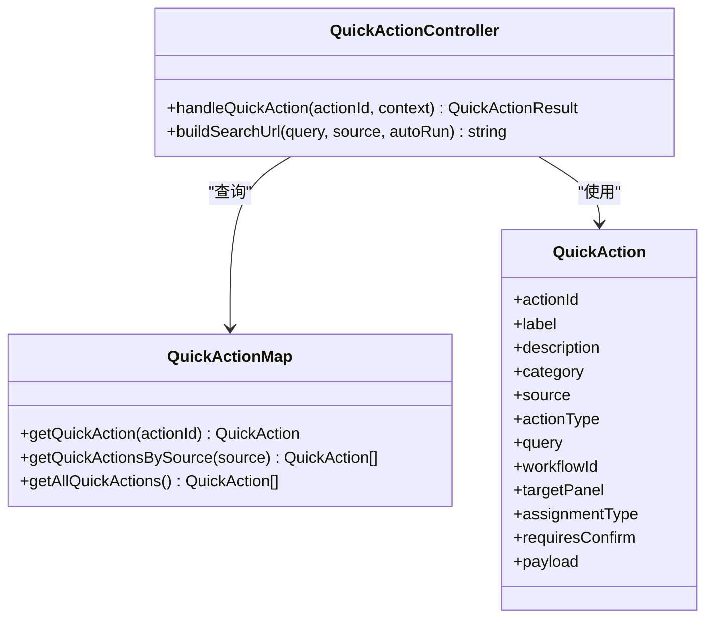

**图表来源**
- [quickActionController.ts:34-123](file://src/ai/actions/quickActionController.ts#L34-L123)
- [quickActionMap.ts:12-112](file://src/ai/actions/quickActionMap.ts#L12-L112)
- [quickActionTypes.ts:45-65](file://src/ai/actions/quickActionTypes.ts#L45-L65)

**章节来源**
- [quickActionController.ts:34-123](file://src/ai/actions/quickActionController.ts#L34-L123)
- [quickActionMap.ts:12-112](file://src/ai/actions/quickActionMap.ts#L12-L112)
- [quickActionTypes.ts:12-65](file://src/ai/actions/quickActionTypes.ts#L12-L65)

## 依赖关系分析
- 自检测试依赖意图路由核心与动作控制器，确保测试用例与生产代码保持一致。
- 快捷动作自检依赖控制器与注册表，确保映射与分发正确。
- 面板状态定义约束动作结果，防止UI状态不一致。

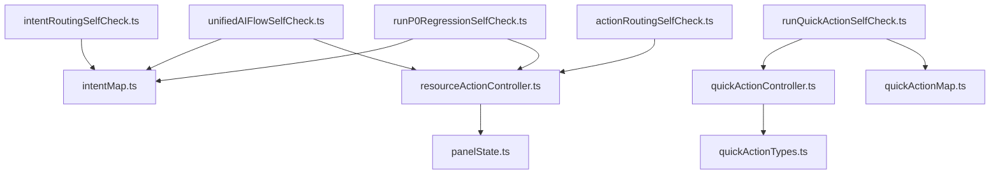

**图表来源**
- [unifiedAIFlowSelfCheck.ts:7-10](file://src/ai/tests/unifiedAIFlowSelfCheck.ts#L7-L10)
- [intentRoutingSelfCheck.ts:10-11](file://src/ai/tests/intentRoutingSelfCheck.ts#L10-L11)
- [actionRoutingSelfCheck.ts:31-69](file://src/ai/tests/actionRoutingSelfCheck.ts#L31-L69)
- [runP0RegressionSelfCheck.ts:12-15](file://src/ai/tests/runP0RegressionSelfCheck.ts#L12-L15)
- [runQuickActionSelfCheck.ts:7-8](file://src/ai/actions/runQuickActionSelfCheck.ts#L7-L8)
- [quickActionController.ts:11-12](file://src/ai/actions/quickActionController.ts#L11-L12)
- [quickActionMap.ts:8](file://src/ai/actions/quickActionMap.ts#L8)
- [resourceActionController.ts:8-10](file://src/ai/controller/resourceActionController.ts#L8-L10)
- [panelState.ts:7-16](file://src/ai/controller/panelState.ts#L7-L16)

**章节来源**
- [unifiedAIFlowSelfCheck.ts:7-10](file://src/ai/tests/unifiedAIFlowSelfCheck.ts#L7-L10)
- [intentRoutingSelfCheck.ts:10-11](file://src/ai/tests/intentRoutingSelfCheck.ts#L10-L11)
- [actionRoutingSelfCheck.ts:31-69](file://src/ai/tests/actionRoutingSelfCheck.ts#L31-L69)
- [runP0RegressionSelfCheck.ts:12-15](file://src/ai/tests/runP0RegressionSelfCheck.ts#L12-L15)
- [runQuickActionSelfCheck.ts:7-8](file://src/ai/actions/runQuickActionSelfCheck.ts#L7-L8)
- [quickActionController.ts:11-12](file://src/ai/actions/quickActionController.ts#L11-L12)
- [quickActionMap.ts:8](file://src/ai/actions/quickActionMap.ts#L8)
- [resourceActionController.ts:8-10](file://src/ai/controller/resourceActionController.ts#L8-L10)
- [panelState.ts:7-16](file://src/ai/controller/panelState.ts#L7-L16)

## 性能考量
- 测试执行：自检测试均为内存级执行，无外部依赖，执行速度快。
- 规则匹配：意图路由采用正则匹配与优先级排序，复杂度与规则数量线性相关。
- 动作分发：动作路由为简单switch分支，时间复杂度O(1)。
- 建议：随着规则与动作增多，可考虑缓存常用匹配结果与动作分发结果，进一步优化性能。

## 故障排查指南
- 意图路由失败：
  - 检查关键词正则是否覆盖输入。
  - 检查source增强是否正确配置。
  - 确认ambiguous场景是否符合预期。
- 动作路由失败：
  - 检查面板类型是否与panelState.ts一致。
  - 确认加入练习篮是否仅调用store.addToBasket且不改变面板。
- 快捷动作失败：
  - 检查actionId是否存在。
  - 确认actionType与URL参数拼接是否正确。
- 全链路失败：
  - 逐步缩小范围，先验证意图路由，再验证动作路由，最后验证页面入口。

**章节来源**
- [intentMap.ts:219-272](file://src/ai/router/intentMap.ts#L219-L272)
- [resourceActionController.ts:60-119](file://src/ai/controller/resourceActionController.ts#L60-L119)
- [quickActionController.ts:34-123](file://src/ai/actions/quickActionController.ts#L34-L123)
- [panelState.ts:7-51](file://src/ai/controller/panelState.ts#L7-L51)

## 结论
自检系统通过意图路由与动作路由的双轨自检，确保从自然语言输入到最终动作执行的正确性与一致性。其测试用例设计覆盖关键词匹配、source增强、模糊输入、布置覆盖、面板状态与URL构建等关键场景，能够快速发现回归问题，显著提升开发效率与质量。建议在每次改动意图规则或动作逻辑后运行相应自检，确保系统稳定。

## 附录

### 使用方法
- 在浏览器控制台运行：
  - 意图路由自检：调用 runIntentRoutingSelfCheck()
  - 动作路由自检：调用 runActionRoutingSelfCheck()
  - 全链路自检：调用 runUnifiedAIFlowSelfCheck()
  - P0回归自检：调用 runP0RegressionSelfCheck()
  - 快捷操作自检：调用 runQuickActionSelfCheck()
- 在Node环境运行：
  - 使用 tsx 运行自检脚本，如 npx tsx -e "import { runP0RegressionSelfCheck } from './src/ai/tests/runP0RegressionSelfCheck'; runP0RegressionSelfCheck();"

**章节来源**
- [intentRoutingSelfCheck.ts:89-95](file://src/ai/tests/intentRoutingSelfCheck.ts#L89-L95)
- [actionRoutingSelfCheck.ts:191-197](file://src/ai/tests/actionRoutingSelfCheck.ts#L191-L197)
- [unifiedAIFlowSelfCheck.ts:98-104](file://src/ai/tests/unifiedAIFlowSelfCheck.ts#L98-L104)
- [runP0RegressionSelfCheck.ts:214-222](file://src/ai/tests/runP0RegressionSelfCheck.ts#L214-L222)
- [runQuickActionSelfCheck.ts:145-151](file://src/ai/actions/runQuickActionSelfCheck.ts#L145-L151)

### 扩展指南
- 添加新的意图规则：
  - 在 intentMap.ts 的 RULES 中新增规则，设置关键词、优先级与sourceBoost。
  - 更新测试用例，覆盖新增规则。
- 添加新的动作：
  - 在 resourceActionController.ts 中扩展switch分支，返回正确的面板类型与数据。
  - 在 panelState.ts 中扩展面板类型定义。
  - 更新自检测试，验证动作行为。
- 添加新的快捷动作：
  - 在 quickActionMap.ts 中新增动作配置。
  - 在 quickActionController.ts 中扩展dispatch分支。
  - 更新自检测试，验证映射与分发。
- 自定义验证规则：
  - 在对应的自检文件中增加测试用例，确保规则覆盖全面。
  - 使用 runP0RegressionSelfCheck 生成统一报告，便于追踪修复。

**章节来源**
- [intentMap.ts:72-186](file://src/ai/router/intentMap.ts#L72-L186)
- [resourceActionController.ts:60-119](file://src/ai/controller/resourceActionController.ts#L60-L119)
- [panelState.ts:7-16](file://src/ai/controller/panelState.ts#L7-L16)
- [quickActionMap.ts:12-98](file://src/ai/actions/quickActionMap.ts#L12-L98)
- [quickActionController.ts:45-111](file://src/ai/actions/quickActionController.ts#L45-L111)

### 相关文档
- 小天AI洞察V2设计文档：涵盖洞察模块的统一结构、文案规范与规则体系。
- P0验收清单：提供验收项与通过状态，便于对照自检结果。

**章节来源**
- [ai-insight-design.md:1-622](file://docs/ai-insight-design.md#L1-L622)
- [p0-acceptance-checklist.md:1-161](file://docs/p0-acceptance-checklist.md#L1-L161)