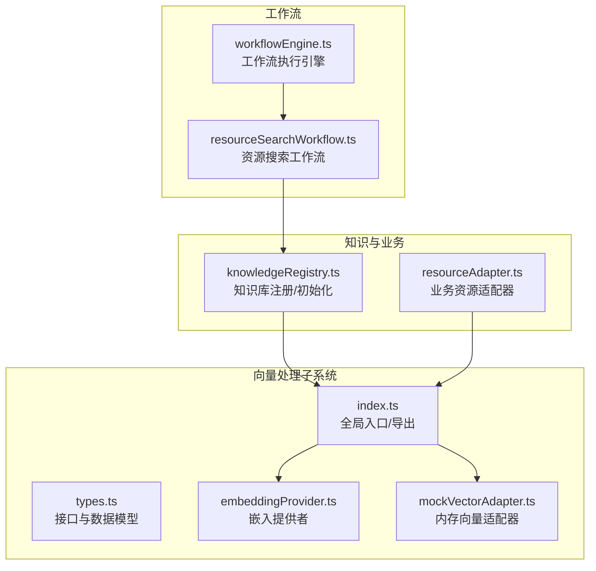
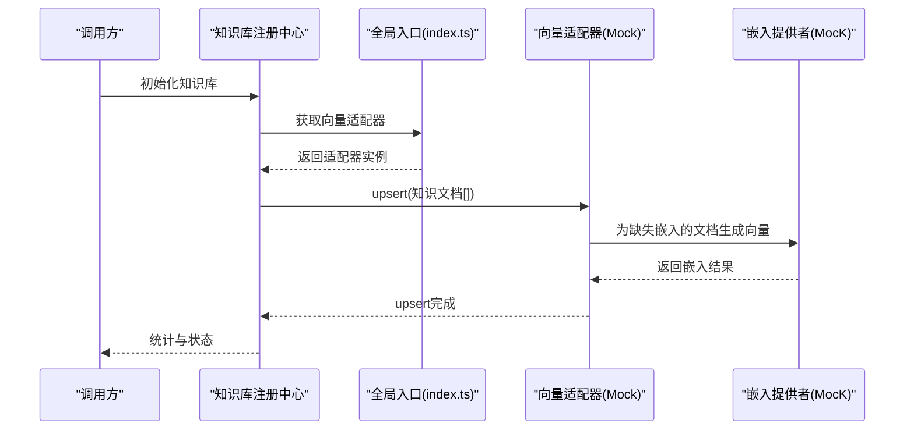
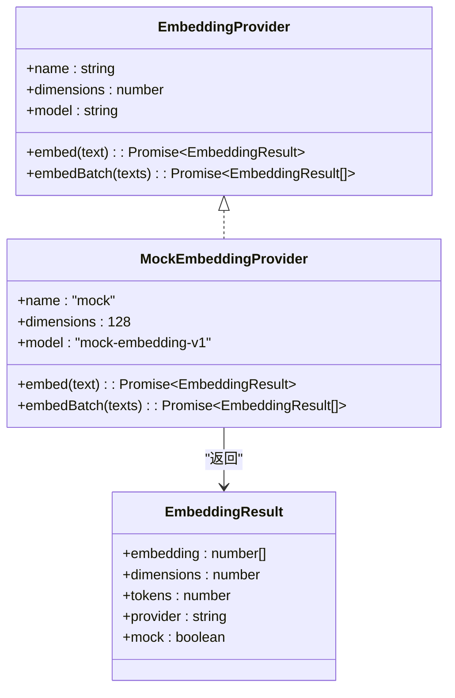
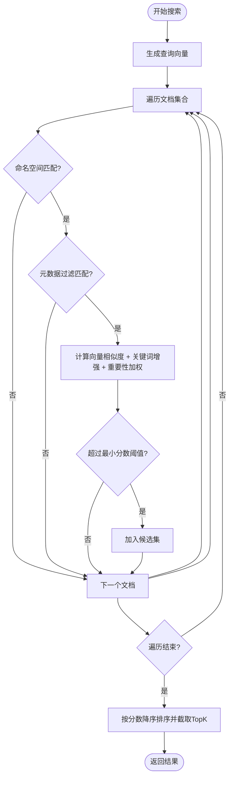
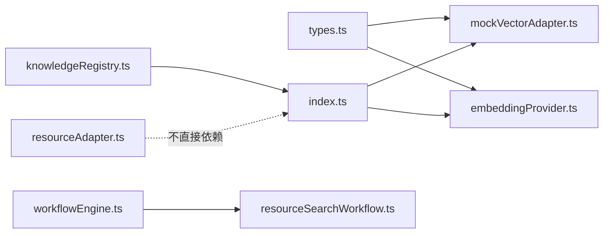

# 向量处理系统

<cite>
**本文引用的文件**
- [embeddingProvider.ts](file://src/vector/embeddingProvider.ts)
- [types.ts](file://src/vector/types.ts)
- [mockVectorAdapter.ts](file://src/vector/mockVectorAdapter.ts)
- [index.ts](file://src/vector/index.ts)
- [knowledgeRegistry.ts](file://src/knowledge/knowledgeRegistry.ts)
- [resourceAdapter.ts](file://src/business/resourceAdapter.ts)
- [workflowEngine.ts](file://src/ai/engine/workflowRunner.ts)
- [resourceSearchWorkflow.ts](file://src/ai/workflows/resourceSearchWorkflow.ts)
</cite>

## 目录
1. [简介](#简介)
2. [项目结构](#项目结构)
3. [核心组件](#核心组件)
4. [架构总览](#架构总览)
5. [详细组件分析](#详细组件分析)
6. [依赖关系分析](#依赖关系分析)
7. [性能考量](#性能考量)
8. [故障排查指南](#故障排查指南)
9. [结论](#结论)
10. [附录](#附录)

## 简介
本文件面向小天AI教育平台的向量处理系统，提供从架构设计、组件职责、数据与控制流，到扩展与优化的完整技术文档。系统围绕“向量嵌入提供者”和“向量适配器”两大抽象展开，既支持本地演示（Mock）能力，也为接入真实向量数据库（如 Pinecone/pgvector/Milvus/Weaviate）预留了清晰的扩展路径。同时，文档给出适配器接口规范、相似度计算与搜索机制、索引与查询优化建议、以及自定义适配器开发指南。

## 项目结构
向量处理系统位于 src/vector 目录，核心文件包括：
- types.ts：定义知识文档、元数据、搜索结果、嵌入结果、嵌入提供者与向量适配器接口
- embeddingProvider.ts：嵌入提供者实现（Mock为主，预留OpenAI等接入）
- mockVectorAdapter.ts：内存向量适配器实现，支持向量相似度与关键词融合打分
- index.ts：适配器与嵌入提供者的全局入口与导出

知识库注册中心 src/knowledge/knowledgeRegistry.ts 负责将内置知识文档批量 upsert 到向量存储，并提供运行时新增文档的能力；业务资源适配器 src/business/resourceAdapter.ts 提供业务资源检索能力；工作流引擎与资源搜索工作流展示了向量系统在实际业务中的调用方式。

图表来源
- [types.ts:1-115](file://src/vector/types.ts#L1-L115)
- [embeddingProvider.ts:1-138](file://src/vector/embeddingProvider.ts#L1-L138)
- [mockVectorAdapter.ts:1-112](file://src/vector/mockVectorAdapter.ts#L1-L112)
- [index.ts:1-35](file://src/vector/index.ts#L1-L35)
- [knowledgeRegistry.ts:1-109](file://src/knowledge/knowledgeRegistry.ts#L1-L109)
- [resourceAdapter.ts:1-193](file://src/business/resourceAdapter.ts#L1-L193)
- [workflowEngine.ts:1-288](file://src/ai/engine/workflowRunner.ts#L1-L288)
- [resourceSearchWorkflow.ts:1-152](file://src/ai/workflows/resourceSearchWorkflow.ts#L1-L152)

章节来源
- [types.ts:1-115](file://src/vector/types.ts#L1-L115)
- [embeddingProvider.ts:1-138](file://src/vector/embeddingProvider.ts#L1-L138)
- [mockVectorAdapter.ts:1-112](file://src/vector/mockVectorAdapter.ts#L1-L112)
- [index.ts:1-35](file://src/vector/index.ts#L1-L35)
- [knowledgeRegistry.ts:1-109](file://src/knowledge/knowledgeRegistry.ts#L1-L109)
- [resourceAdapter.ts:1-193](file://src/business/resourceAdapter.ts#L1-L193)
- [workflowEngine.ts:1-288](file://src/ai/engine/workflowRunner.ts#L1-L288)
- [resourceSearchWorkflow.ts:1-152](file://src/ai/workflows/resourceSearchWorkflow.ts#L1-L152)

## 核心组件
- 嵌入提供者（EmbeddingProvider）
  - 职责：为文本生成向量嵌入，支持单条与批量嵌入
  - 当前实现：Mock 嵌入提供者（维度128，带延迟与伪向量生成），并预留 OpenAI 等第三方提供者接入
- 向量适配器（VectorAdapter）
  - 职责：统一的向量存储抽象，支持 upsert、search、deleteNamespace、stats
  - 当前实现：Mock 内存适配器，内置向量相似度与关键词融合打分
- 全局入口（index.ts）
  - 提供 set/get 适配器与嵌入提供者的全局切换能力，导出类型与工具函数

章节来源
- [embeddingProvider.ts:13-86](file://src/vector/embeddingProvider.ts#L13-L86)
- [types.ts:65-79](file://src/vector/types.ts#L65-L79)
- [mockVectorAdapter.ts:20-111](file://src/vector/mockVectorAdapter.ts#L20-L111)
- [types.ts:83-114](file://src/vector/types.ts#L83-L114)
- [index.ts:5-21](file://src/vector/index.ts#L5-L21)

## 架构总览
系统采用“接口抽象 + 可插拔实现”的设计：
- 上层业务（知识库注册、工作流、资源适配器）仅依赖抽象接口，不感知底层实现
- 通过全局入口进行提供者/适配器的切换，便于在开发、测试与生产环境间灵活替换
- 搜索流程：查询文本经嵌入提供者生成向量，再由向量适配器进行相似度计算与过滤，最终返回排序后的结果

图表来源
- [knowledgeRegistry.ts:47-92](file://src/knowledge/knowledgeRegistry.ts#L47-L92)
- [index.ts:11-13](file://src/vector/index.ts#L11-L13)
- [mockVectorAdapter.ts:23-41](file://src/vector/mockVectorAdapter.ts#L23-L41)
- [embeddingProvider.ts:26-35](file://src/vector/embeddingProvider.ts#L26-L35)

## 详细组件分析

### 嵌入提供者（EmbeddingProvider）
- 设计要点
  - 接口定义包含名称、维度、模型、单条与批量嵌入方法
  - Mock 实现使用确定性伪向量生成，支持 L2 归一化，便于近似余弦相似度
  - 提供余弦相似度计算工具函数
- 扩展建议
  - 新增第三方提供者时，保持接口一致，仅替换 embed/embedBatch 与维度/模型信息
  - 批量嵌入需考虑服务端限制与并发控制

图表来源
- [types.ts:65-79](file://src/vector/types.ts#L65-L79)
- [embeddingProvider.ts:21-40](file://src/vector/embeddingProvider.ts#L21-L40)
- [types.ts:55-61](file://src/vector/types.ts#L55-L61)

章节来源
- [embeddingProvider.ts:13-138](file://src/vector/embeddingProvider.ts#L13-L138)
- [types.ts:65-79](file://src/vector/types.ts#L65-L79)

### 向量适配器（VectorAdapter）
- 设计要点
  - 接口定义包含 upsert、search、deleteNamespace、stats 四大能力
  - Mock 实现使用内存数组存储，支持命名空间过滤、元数据过滤、关键词增强打分
  - 搜索融合向量相似度（余弦）与关键词命中、重要性权重，支持 topK 与最小分数阈值
- 查询流程
  - 生成查询向量
  - 遍历文档，按命名空间与元数据过滤
  - 计算向量相似度与关键词增强得分，合并为最终得分
  - 过滤最低分后排序取前 K

图表来源
- [mockVectorAdapter.ts:43-94](file://src/vector/mockVectorAdapter.ts#L43-L94)

章节来源
- [mockVectorAdapter.ts:1-112](file://src/vector/mockVectorAdapter.ts#L1-L112)
- [types.ts:83-114](file://src/vector/types.ts#L83-L114)

### 全局入口与类型导出（index.ts）
- 职责
  - 维护当前适配器与嵌入提供者的单例引用
  - 提供 set/get 方法用于运行时切换
  - 导出类型与工具函数，便于上层模块统一引用

章节来源
- [index.ts:1-35](file://src/vector/index.ts#L1-L35)

### 知识库注册与初始化（knowledgeRegistry.ts）
- 职责
  - 注册内置知识源（教学大纲、策略库、常见错误、考试信息等）
  - 启动时将所有知识文档 upsert 至向量存储，并打印统计信息
  - 提供运行时新增文档的能力

章节来源
- [knowledgeRegistry.ts:1-109](file://src/knowledge/knowledgeRegistry.ts#L1-L109)

### 业务资源适配器（resourceAdapter.ts）
- 职责
  - 将 AI 搜索与真实业务资源库解耦
  - 提供资源检索、详情、预览与基于资源生成练习的能力
  - 示例中对资源进行关键词与上下文匹配打分

章节来源
- [resourceAdapter.ts:1-193](file://src/business/resourceAdapter.ts#L1-L193)

### 工作流引擎与资源搜索工作流（workflowEngine.ts、resourceSearchWorkflow.ts）
- 职责
  - 工作流引擎：统一的执行入口，按步骤顺序执行，收集结果与建议
  - 资源搜索工作流：根据触发词与上下文解析，生成资源列表输出
  - 两者共同体现向量系统在业务流程中的集成方式

章节来源
- [workflowEngine.ts:1-288](file://src/ai/engine/workflowRunner.ts#L1-L288)
- [resourceSearchWorkflow.ts:1-152](file://src/ai/workflows/resourceSearchWorkflow.ts#L1-L152)

## 依赖关系分析
- 抽象与实现分离
  - types.ts 定义接口与数据模型，为所有实现提供契约
  - embeddingProvider.ts 与 mockVectorAdapter.ts 分别实现嵌入与向量存储
- 运行时依赖注入
  - index.ts 作为全局入口，集中管理当前使用的适配器与提供者
- 业务耦合点
  - knowledgeRegistry.ts 依赖向量适配器完成知识入库
  - resourceAdapter.ts 与向量系统无直接耦合，但可与之协作（例如在更复杂的检索场景中）

图表来源
- [types.ts:1-115](file://src/vector/types.ts#L1-L115)
- [embeddingProvider.ts:1-138](file://src/vector/embeddingProvider.ts#L1-L138)
- [mockVectorAdapter.ts:1-112](file://src/vector/mockVectorAdapter.ts#L1-L112)
- [index.ts:1-35](file://src/vector/index.ts#L1-L35)
- [knowledgeRegistry.ts:1-109](file://src/knowledge/knowledgeRegistry.ts#L1-L109)
- [resourceAdapter.ts:1-193](file://src/business/resourceAdapter.ts#L1-L193)
- [workflowEngine.ts:1-288](file://src/ai/engine/workflowRunner.ts#L1-L288)
- [resourceSearchWorkflow.ts:1-152](file://src/ai/workflows/resourceSearchWorkflow.ts#L1-L152)

## 性能考量
- 嵌入生成
  - Mock 实现包含固定延迟与伪向量生成，适合演示与本地调试
  - 生产环境建议使用真实提供者，并考虑批量请求、并发限流与缓存
- 搜索复杂度
  - Mock 适配器为全量遍历，时间复杂度 O(N·D)，N 为文档数，D 为平均维度
  - 建议在真实向量库中引入索引（如 HNSW/IVF/Flat）与量化，以降低查询成本
- 打分与过滤
  - 命名空间与元数据过滤可在进入向量检索前做粗排，减少候选集规模
  - 关键词增强与重要性加权为常数开销，建议在候选集较小后进行
- 内存与序列化
  - Mock 适配器使用内存数组，注意文档数量增长带来的内存占用
  - 生产环境应采用持久化向量存储，避免重启丢失

[本节为通用性能建议，无需特定文件引用]

## 故障排查指南
- 常见问题
  - 文档未生成嵌入：检查嵌入提供者是否正确初始化与可用
  - 搜索结果为空：确认命名空间/元数据过滤条件是否过于严格，或最小分数阈值过高
  - 性能异常：评估文档规模与索引策略，必要时启用向量库索引与分页
- 调试建议
  - 在知识库初始化阶段打印统计信息，核对 upsert 数量与命名空间分布
  - 对关键路径增加日志（如生成查询向量、过滤与打分过程）
  - 使用较小 topK 与宽松阈值快速定位问题

章节来源
- [knowledgeRegistry.ts:82-92](file://src/knowledge/knowledgeRegistry.ts#L82-L92)
- [mockVectorAdapter.ts:43-94](file://src/vector/mockVectorAdapter.ts#L43-L94)

## 结论
小天AI教育平台的向量处理系统通过清晰的接口抽象与可插拔实现，实现了从嵌入生成到向量检索的完整链路。Mock 提供者与适配器确保了开发与演示的便利性，同时为接入真实向量数据库提供了标准化接口。结合命名空间与元数据过滤、关键词增强打分与索引策略，系统具备良好的扩展性与可维护性。

[本节为总结性内容，无需特定文件引用]

## 附录

### 接口规范与扩展指南
- 向量适配器扩展
  - 必须实现 upsert、search、deleteNamespace、stats 四个方法
  - search 支持 topK、命名空间、元数据过滤与最小分数阈值
  - 建议在内部引入索引与量化，提升大规模检索性能
- 嵌入提供者扩展
  - 保持 embed/embedBatch 返回 EmbeddingResult，包含 embedding、dimensions、tokens、provider、mock 字段
  - 注意批次大小与并发控制，遵循第三方服务限制
- 自定义适配器开发步骤
  - 基于 types.ts 中的接口定义实现具体适配器
  - 在 index.ts 中通过 setVectorAdapter 切换至新适配器
  - 在知识库初始化阶段验证 upsert 与 stats 行为
  - 在搜索调用处验证命名空间/过滤/打分逻辑

章节来源
- [types.ts:83-114](file://src/vector/types.ts#L83-L114)
- [types.ts:65-79](file://src/vector/types.ts#L65-L79)
- [index.ts:7-13](file://src/vector/index.ts#L7-L13)