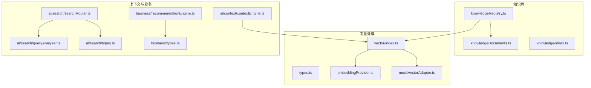
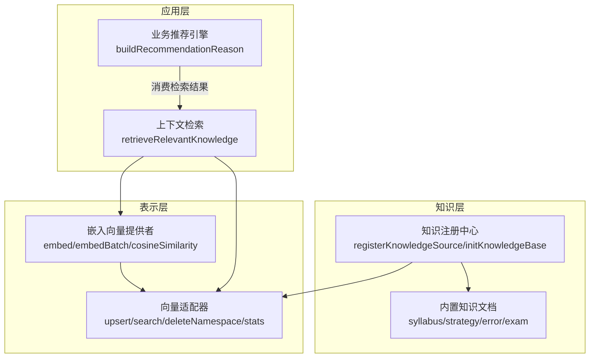
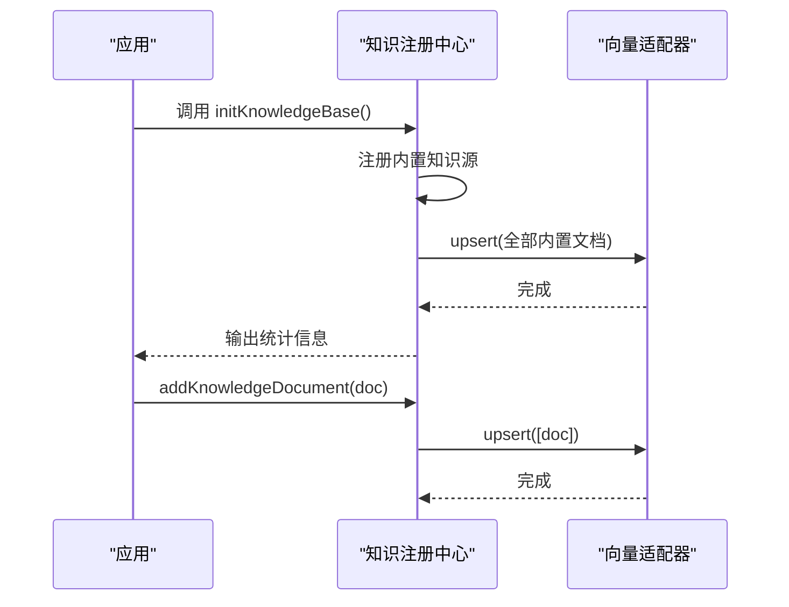
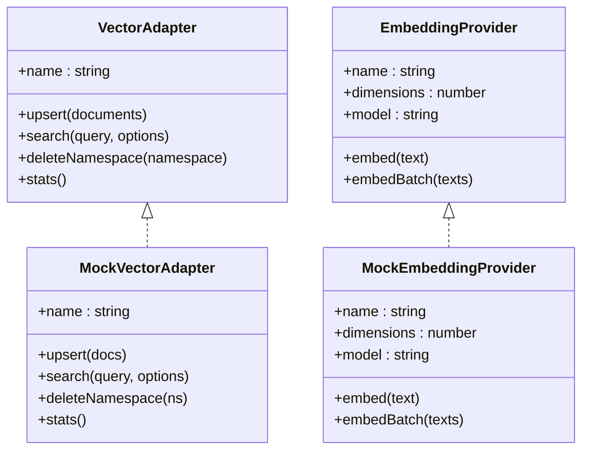
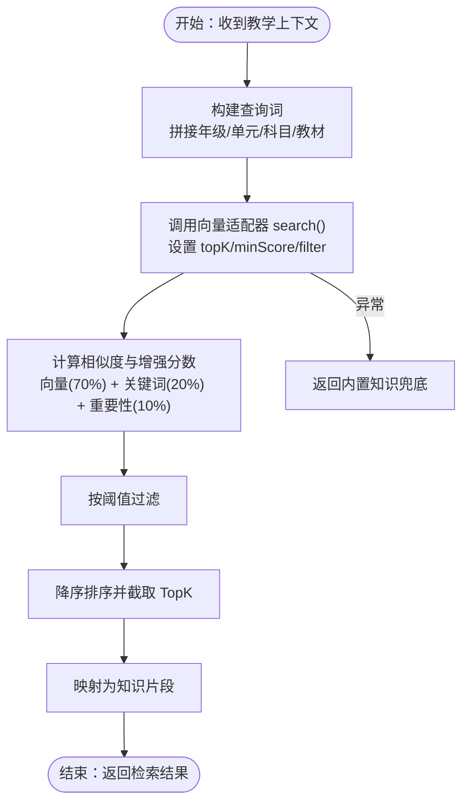
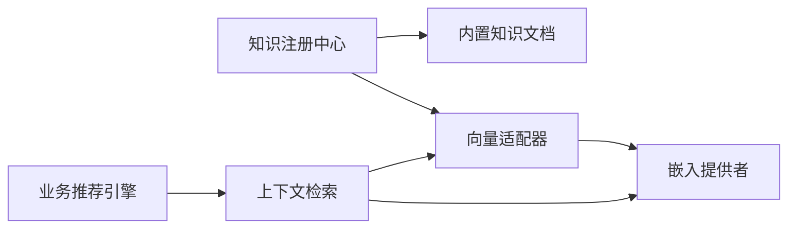
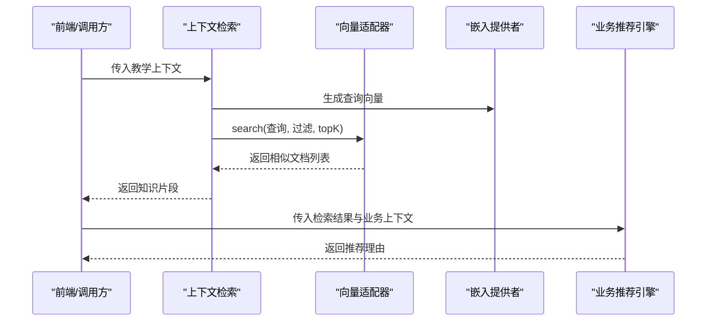

# 知识库和向量处理系统

<cite>
**本文引用的文件**
- [src/knowledge/knowledgeRegistry.ts](file://src/knowledge/knowledgeRegistry.ts)
- [src/knowledge/knowledgeDocuments.ts](file://src/knowledge/knowledgeDocuments.ts)
- [src/knowledge/index.ts](file://src/knowledge/index.ts)
- [src/vector/types.ts](file://src/vector/types.ts)
- [src/vector/embeddingProvider.ts](file://src/vector/embeddingProvider.ts)
- [src/vector/mockVectorAdapter.ts](file://src/vector/mockVectorAdapter.ts)
- [src/vector/index.ts](file://src/vector/index.ts)
- [src/ai/context/contextEngine.ts](file://src/ai/context/contextEngine.ts)
- [src/ai/search/searchRouter.ts](file://src/ai/search/searchRouter.ts)
- [src/ai/search/queryAnalyzer.ts](file://src/ai/search/queryAnalyzer.ts)
- [src/ai/search/types.ts](file://src/ai/search/types.ts)
- [src/business/recommendationEngine.ts](file://src/business/recommendationEngine.ts)
- [src/business/types.ts](file://src/business/types.ts)
</cite>

## 目录
1. [简介](#简介)
2. [项目结构](#项目结构)
3. [核心组件](#核心组件)
4. [架构总览](#架构总览)
5. [详细组件分析](#详细组件分析)
6. [依赖关系分析](#依赖关系分析)
7. [性能考量](#性能考量)
8. [故障排查指南](#故障排查指南)
9. [结论](#结论)
10. [附录](#附录)

## 简介
本技术文档面向小天AI教育平台的知识库与向量处理系统，系统目标是为教学场景提供“知识注册、向量化存储、检索与推荐”的一体化能力。知识库以“知识源注册中心”为核心，统一管理教材、策略、高频错误、考试等多类知识；向量处理系统通过“嵌入向量提供者”和“向量适配器”解耦底层向量库实现，支持在内存模拟与真实向量库之间无缝切换。系统同时提供基于RAG的上下文检索能力，结合业务层推荐引擎，形成“知识驱动的智能教学辅助”。

## 项目结构
围绕知识库与向量处理的关键目录与文件如下：
- 知识库
  - 知识注册中心：src/knowledge/knowledgeRegistry.ts
  - 内置知识文档聚合：src/knowledge/knowledgeDocuments.ts
  - 知识库导出入口：src/knowledge/index.ts
- 向量处理
  - 类型定义：src/vector/types.ts
  - 嵌入向量提供者：src/vector/embeddingProvider.ts
  - 向量适配器（内存模拟实现）：src/vector/mockVectorAdapter.ts
  - 向量模块导出：src/vector/index.ts
- 上下文检索与业务集成
  - AI上下文检索：src/ai/context/contextEngine.ts
  - 搜索路由与意图解析：src/ai/search/searchRouter.ts、src/ai/search/queryAnalyzer.ts、src/ai/search/types.ts
  - 业务推荐理由引擎：src/business/recommendationEngine.ts、src/business/types.ts

图表来源
- [src/knowledge/knowledgeRegistry.ts:1-109](file://src/knowledge/knowledgeRegistry.ts#L1-L109)
- [src/knowledge/knowledgeDocuments.ts:1-142](file://src/knowledge/knowledgeDocuments.ts#L1-L142)
- [src/knowledge/index.ts:1-11](file://src/knowledge/index.ts#L1-L11)
- [src/vector/types.ts:1-115](file://src/vector/types.ts#L1-L115)
- [src/vector/embeddingProvider.ts:1-138](file://src/vector/embeddingProvider.ts#L1-L138)
- [src/vector/mockVectorAdapter.ts:1-112](file://src/vector/mockVectorAdapter.ts#L1-L112)
- [src/vector/index.ts:1-35](file://src/vector/index.ts#L1-L35)
- [src/ai/context/contextEngine.ts:82-135](file://src/ai/context/contextEngine.ts#L82-L135)
- [src/ai/search/searchRouter.ts:1-72](file://src/ai/search/searchRouter.ts#L1-L72)
- [src/ai/search/queryAnalyzer.ts:1-170](file://src/ai/search/queryAnalyzer.ts#L1-L170)
- [src/ai/search/types.ts:1-195](file://src/ai/search/types.ts#L1-L195)
- [src/business/recommendationEngine.ts:1-87](file://src/business/recommendationEngine.ts#L1-L87)
- [src/business/types.ts:1-203](file://src/business/types.ts#L1-L203)

章节来源
- [src/knowledge/knowledgeRegistry.ts:1-109](file://src/knowledge/knowledgeRegistry.ts#L1-L109)
- [src/knowledge/knowledgeDocuments.ts:1-142](file://src/knowledge/knowledgeDocuments.ts#L1-L142)
- [src/knowledge/index.ts:1-11](file://src/knowledge/index.ts#L1-L11)
- [src/vector/types.ts:1-115](file://src/vector/types.ts#L1-L115)
- [src/vector/embeddingProvider.ts:1-138](file://src/vector/embeddingProvider.ts#L1-L138)
- [src/vector/mockVectorAdapter.ts:1-112](file://src/vector/mockVectorAdapter.ts#L1-L112)
- [src/vector/index.ts:1-35](file://src/vector/index.ts#L1-L35)
- [src/ai/context/contextEngine.ts:82-135](file://src/ai/context/contextEngine.ts#L82-L135)
- [src/ai/search/searchRouter.ts:1-72](file://src/ai/search/searchRouter.ts#L1-L72)
- [src/ai/search/queryAnalyzer.ts:1-170](file://src/ai/search/queryAnalyzer.ts#L1-L170)
- [src/ai/search/types.ts:1-195](file://src/ai/search/types.ts#L1-L195)
- [src/business/recommendationEngine.ts:1-87](file://src/business/recommendationEngine.ts#L1-L87)
- [src/business/types.ts:1-203](file://src/business/types.ts#L1-L203)

## 核心组件
- 知识注册中心
  - 负责注册知识源（如教材、策略、高频错误、考试），并在应用启动时将内置知识批量写入向量存储；同时支持运行时动态新增知识文档。
- 内置知识文档
  - 聚合了教学相关的知识条目，包含内容、元数据、标签、重要性等字段，便于后续向量化与检索。
- 向量适配器（VectorAdapter）
  - 抽象向量数据库操作接口，支持 upsert、search、deleteNamespace、stats 等能力；当前提供内存模拟实现，支持余弦相似度检索与关键词增强。
- 嵌入向量提供者（EmbeddingProvider）
  - 抽象嵌入生成接口，当前默认使用“确定性伪向量”（mock），维度可配置；提供余弦相似度计算工具函数。
- 上下文检索（RAG）
  - 基于当前教学上下文构建查询，调用向量适配器进行检索，并转换为知识片段返回；异常时回退到内置知识。
- 业务推荐理由引擎
  - 根据业务上下文动态生成推荐理由，包含权重因子与说明文本，用于教学资源与AI动作的解释性输出。

章节来源
- [src/knowledge/knowledgeRegistry.ts:27-108](file://src/knowledge/knowledgeRegistry.ts#L27-L108)
- [src/knowledge/knowledgeDocuments.ts:18-141](file://src/knowledge/knowledgeDocuments.ts#L18-L141)
- [src/vector/types.ts:83-114](file://src/vector/types.ts#L83-L114)
- [src/vector/embeddingProvider.ts:21-86](file://src/vector/embeddingProvider.ts#L21-L86)
- [src/vector/mockVectorAdapter.ts:20-111](file://src/vector/mockVectorAdapter.ts#L20-L111)
- [src/ai/context/contextEngine.ts:94-133](file://src/ai/context/contextEngine.ts#L94-L133)
- [src/business/recommendationEngine.ts:10-86](file://src/business/recommendationEngine.ts#L10-L86)

## 架构总览
系统采用“知识库 + 向量处理 + 上下文检索 + 业务推荐”的分层设计：
- 知识层：知识注册中心与内置知识文档构成知识源，统一管理与初始化。
- 表示层：嵌入向量提供者负责文本到向量的映射；向量适配器负责向量存储与检索。
- 应用层：上下文检索在教学场景中触发，将上下文信息转化为查询；业务层根据检索结果生成推荐理由与教学建议。

图表来源
- [src/knowledge/knowledgeRegistry.ts:47-92](file://src/knowledge/knowledgeRegistry.ts#L47-L92)
- [src/knowledge/knowledgeDocuments.ts:18-141](file://src/knowledge/knowledgeDocuments.ts#L18-L141)
- [src/vector/embeddingProvider.ts:21-86](file://src/vector/embeddingProvider.ts#L21-L86)
- [src/vector/mockVectorAdapter.ts:20-111](file://src/vector/mockVectorAdapter.ts#L20-L111)
- [src/ai/context/contextEngine.ts:94-133](file://src/ai/context/contextEngine.ts#L94-L133)
- [src/business/recommendationEngine.ts:10-86](file://src/business/recommendationEngine.ts#L10-L86)

## 详细组件分析

### 知识注册中心与知识源管理
- 设计理念
  - 以“知识源”为单位进行注册与隔离，每个源包含名称、描述、命名空间与文档集合；支持在应用启动时批量初始化，并允许运行时动态追加。
- 关键流程
  - 初始化：注册内置源（教材、策略、高频错误、考试），随后调用向量适配器批量 upsert。
  - 动态新增：提供单条与批量新增接口，直接写入向量存储。
- 数据结构要点
  - 知识源对象包含文档列表；文档具备唯一ID、内容、元数据、向量、命名空间、标签、时间戳与重要性等字段。

图表来源
- [src/knowledge/knowledgeRegistry.ts:47-92](file://src/knowledge/knowledgeRegistry.ts#L47-L92)
- [src/knowledge/knowledgeRegistry.ts:100-108](file://src/knowledge/knowledgeRegistry.ts#L100-L108)
- [src/vector/index.ts:11-13](file://src/vector/index.ts#L11-L13)

章节来源
- [src/knowledge/knowledgeRegistry.ts:27-108](file://src/knowledge/knowledgeRegistry.ts#L27-L108)
- [src/knowledge/knowledgeDocuments.ts:18-141](file://src/knowledge/knowledgeDocuments.ts#L18-L141)
- [src/knowledge/index.ts:1-11](file://src/knowledge/index.ts#L1-L11)

### 向量适配器与嵌入向量提供者
- 向量适配器（内存模拟）
  - upsert：若文档未包含向量，则通过嵌入提供者生成；支持去重替换与新增。
  - search：生成查询向量，遍历文档计算相似度，支持命名空间与元数据过滤；融合关键词命中与重要性，按阈值与TopK返回。
  - deleteNamespace：按命名空间删除文档。
  - stats：统计各命名空间文档数量与总数。
- 嵌入向量提供者
  - 默认使用“确定性伪向量”，维度可配置；提供 embed 与 embedBatch；cosineSimilarity 用于向量相似度计算。
  - 提供 set/get 接口以切换提供者（当前默认 mock）。

图表来源
- [src/vector/types.ts:83-114](file://src/vector/types.ts#L83-L114)
- [src/vector/types.ts:65-79](file://src/vector/types.ts#L65-L79)
- [src/vector/mockVectorAdapter.ts:20-111](file://src/vector/mockVectorAdapter.ts#L20-L111)
- [src/vector/embeddingProvider.ts:21-86](file://src/vector/embeddingProvider.ts#L21-L86)

章节来源
- [src/vector/mockVectorAdapter.ts:20-111](file://src/vector/mockVectorAdapter.ts#L20-L111)
- [src/vector/embeddingProvider.ts:21-86](file://src/vector/embeddingProvider.ts#L21-L86)
- [src/vector/types.ts:65-114](file://src/vector/types.ts#L65-L114)
- [src/vector/index.ts:1-35](file://src/vector/index.ts#L1-L35)

### 知识检索与相似度计算
- 检索流程
  - 构建查询：由教学上下文（年级、单元、科目、教材）拼接查询词。
  - 调用向量适配器：设置 topK、最小分数与元数据过滤条件。
  - 结果转换：将向量搜索结果映射为知识片段，包含来源、相关度与元信息。
  - 异常回退：当检索失败时，返回内置知识作为兜底。
- 相似度与打分
  - 向量相似度：使用余弦相似度。
  - 关键词增强：若查询词出现在内容或标签中，给予一定权重。
  - 重要性加权：结合文档的重要性系数进行综合评分。
  - 最终得分：向量相似度（70%）+ 关键词命中（20%）+ 重要性（10%），并按阈值过滤与排序。

图表来源
- [src/ai/context/contextEngine.ts:94-133](file://src/ai/context/contextEngine.ts#L94-L133)
- [src/vector/mockVectorAdapter.ts:43-94](file://src/vector/mockVectorAdapter.ts#L43-L94)
- [src/vector/embeddingProvider.ts:123-133](file://src/vector/embeddingProvider.ts#L123-L133)

章节来源
- [src/ai/context/contextEngine.ts:94-133](file://src/ai/context/contextEngine.ts#L94-L133)
- [src/vector/mockVectorAdapter.ts:43-94](file://src/vector/mockVectorAdapter.ts#L43-L94)
- [src/vector/embeddingProvider.ts:123-133](file://src/vector/embeddingProvider.ts#L123-L133)

### 知识更新与维护策略
- 初始化与增量
  - 应用启动时一次性初始化内置知识；运行时可通过动态新增接口追加教师自定义笔记等新知识。
- 命名空间与过滤
  - 通过命名空间与元数据过滤，确保检索范围可控；删除命名空间可用于清理某类知识。
- 版本与演进
  - 知识文档结构支持扩展字段；向量适配器接口保持稳定，便于替换为真实向量库（如 Pinecone、pgvector 等）。

章节来源
- [src/knowledge/knowledgeRegistry.ts:47-92](file://src/knowledge/knowledgeRegistry.ts#L47-L92)
- [src/knowledge/knowledgeRegistry.ts:100-108](file://src/knowledge/knowledgeRegistry.ts#L100-L108)
- [src/vector/types.ts:83-114](file://src/vector/types.ts#L83-L114)

### 扩展与自定义开发指南
- 自定义向量适配器
  - 实现 VectorAdapter 接口（upsert/search/deleteNamespace/stats），并通过 setVectorAdapter 注入系统。
- 自定义嵌入提供者
  - 实现 EmbeddingProvider 接口（embed/embedBatch），并通过 setEmbeddingProvider 注入系统。
- 自定义知识源
  - 新增知识文档并注册到知识注册中心；或通过动态新增接口实时写入。
- 检索策略扩展
  - 在向量相似度基础上增加重排序（re-ranking）或引入更复杂的融合策略。
- 业务推荐扩展
  - 在推荐理由引擎中增加新的因子类型与权重，以适配不同教学阶段与区域。

章节来源
- [src/vector/types.ts:83-114](file://src/vector/types.ts#L83-L114)
- [src/vector/index.ts:7-13](file://src/vector/index.ts#L7-L13)
- [src/vector/embeddingProvider.ts:80-86](file://src/vector/embeddingProvider.ts#L80-L86)
- [src/knowledge/knowledgeRegistry.ts:27-37](file://src/knowledge/knowledgeRegistry.ts#L27-L37)
- [src/business/recommendationEngine.ts:10-86](file://src/business/recommendationEngine.ts#L10-L86)

## 依赖关系分析
- 模块内聚与耦合
  - 知识注册中心与内置知识文档强关联，共同构成知识源；向量适配器与嵌入提供者通过接口解耦，便于替换实现。
  - 上下文检索依赖向量适配器与嵌入提供者；业务推荐引擎依赖上下文检索结果与业务类型定义。
- 外部依赖与集成点
  - 当前默认使用内存模拟实现；生产环境可注入真实向量库适配器与外部嵌入服务。
- 循环依赖
  - 未发现循环依赖；模块职责清晰，接口边界明确。

图表来源
- [src/knowledge/knowledgeRegistry.ts:51-85](file://src/knowledge/knowledgeRegistry.ts#L51-L85)
- [src/vector/index.ts:11-13](file://src/vector/index.ts#L11-L13)
- [src/ai/context/contextEngine.ts:97-114](file://src/ai/context/contextEngine.ts#L97-L114)
- [src/business/recommendationEngine.ts:10-86](file://src/business/recommendationEngine.ts#L10-L86)

章节来源
- [src/knowledge/knowledgeRegistry.ts:51-85](file://src/knowledge/knowledgeRegistry.ts#L51-L85)
- [src/vector/index.ts:1-35](file://src/vector/index.ts#L1-L35)
- [src/ai/context/contextEngine.ts:94-133](file://src/ai/context/contextEngine.ts#L94-L133)
- [src/business/recommendationEngine.ts:10-86](file://src/business/recommendationEngine.ts#L10-L86)

## 性能考量
- 向量生成与批量处理
  - 嵌入提供者支持批量生成；在大规模文档入库时，优先使用批量接口以减少网络/IO开销。
- 检索效率
  - 内存模拟实现适合演示与小规模数据；生产环境建议使用带索引的真实向量库，以支持高效近邻搜索。
- 过滤与评分
  - 合理设置 topK、minScore 与过滤条件，避免返回过多低质量结果；关键词增强与重要性加权需平衡准确性与性能。
- 缓存与回退
  - 检索异常时的内置知识回退可保证可用性；建议在生产环境增加缓存层与熔断保护。

## 故障排查指南
- 初始化失败
  - 检查是否重复初始化；确认内置知识文档是否正确注册；查看向量适配器 upsert 是否抛出异常。
- 检索无结果
  - 调整 minScore 与 topK；检查命名空间与元数据过滤条件；确认文档是否包含有效向量。
- 相似度异常
  - 确认嵌入维度一致；检查 cosineSimilarity 输入长度；验证文档 embedding 字段是否被正确填充。
- 动态新增无效
  - 确认新增文档是否成功 upsert；检查 ID 唯一性与命名空间一致性。

章节来源
- [src/knowledge/knowledgeRegistry.ts:47-92](file://src/knowledge/knowledgeRegistry.ts#L47-L92)
- [src/vector/mockVectorAdapter.ts:23-41](file://src/vector/mockVectorAdapter.ts#L23-L41)
- [src/vector/mockVectorAdapter.ts:43-94](file://src/vector/mockVectorAdapter.ts#L43-L94)
- [src/vector/embeddingProvider.ts:123-133](file://src/vector/embeddingProvider.ts#L123-L133)

## 结论
小天AI教育平台的知识库与向量处理系统通过清晰的接口抽象与模块化设计，实现了从知识注册、向量化存储到上下文检索与业务推荐的完整闭环。系统在开发阶段提供内存模拟实现，便于快速迭代；在生产阶段可通过注入真实向量库与嵌入服务实现高性能部署。建议在后续版本中引入重排序、缓存与监控体系，进一步提升检索精度与稳定性。

## 附录
- 关键流程时序图（检索与推荐）

图表来源
- [src/ai/context/contextEngine.ts:94-133](file://src/ai/context/contextEngine.ts#L94-L133)
- [src/vector/mockVectorAdapter.ts:43-94](file://src/vector/mockVectorAdapter.ts#L43-L94)
- [src/vector/embeddingProvider.ts:26-40](file://src/vector/embeddingProvider.ts#L26-L40)
- [src/business/recommendationEngine.ts:10-86](file://src/business/recommendationEngine.ts#L10-L86)