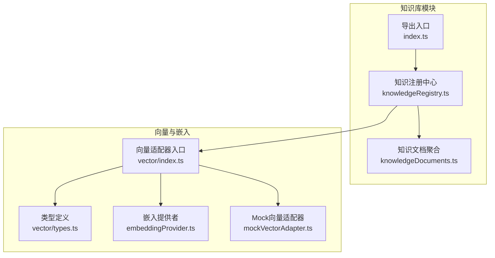
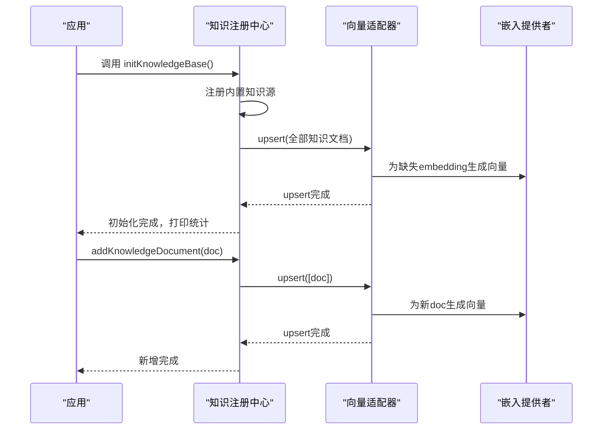
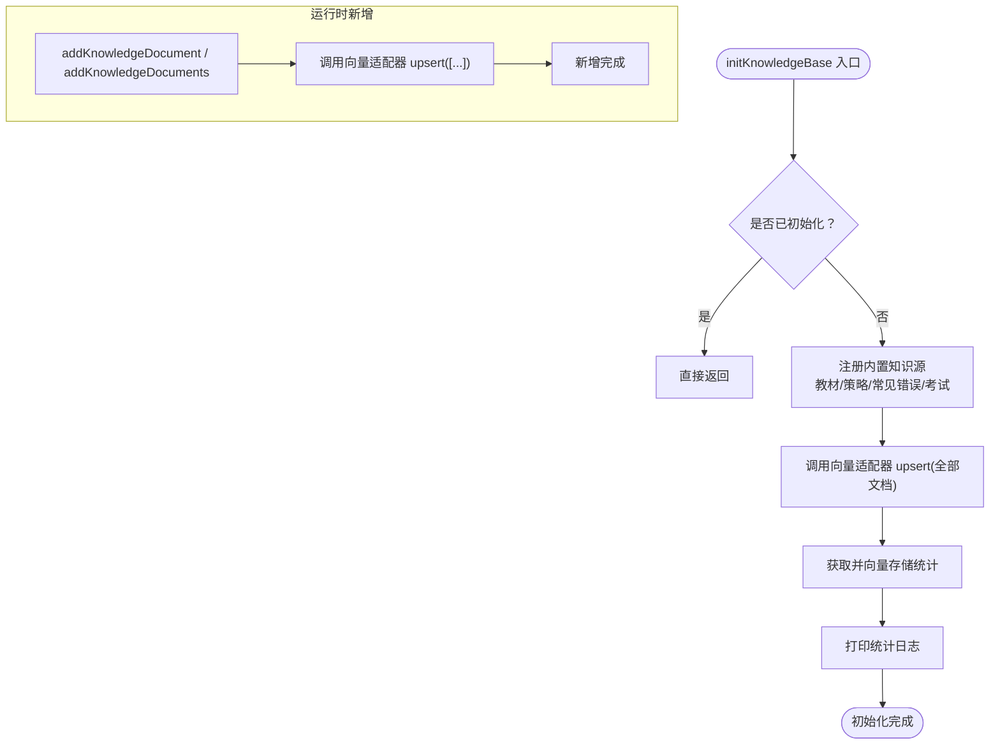
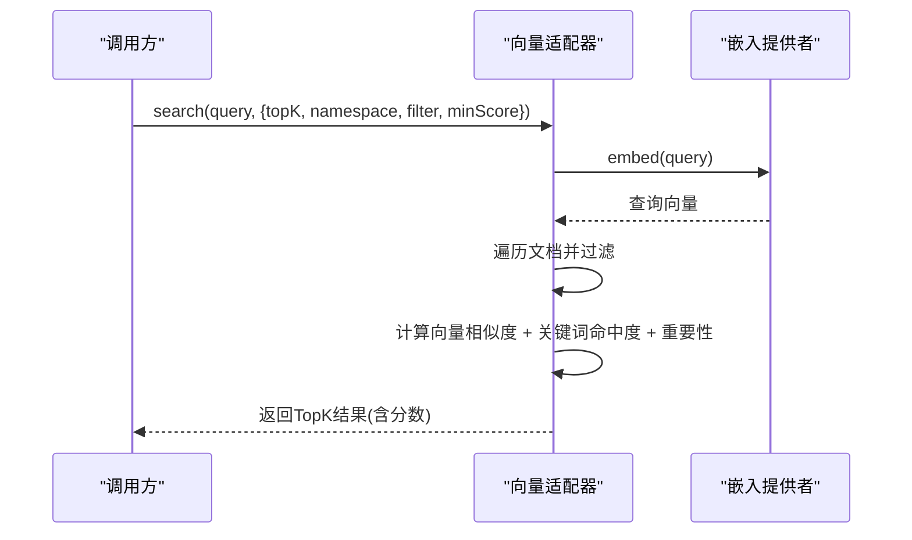
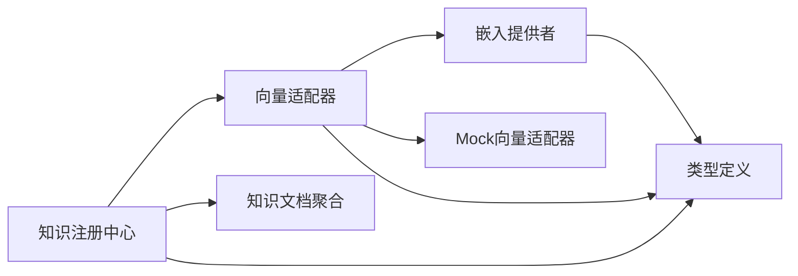

# 知识库架构设计

<cite>
**本文引用的文件**
- [src/knowledge/index.ts](file://src/knowledge/index.ts)
- [src/knowledge/knowledgeRegistry.ts](file://src/knowledge/knowledgeRegistry.ts)
- [src/knowledge/knowledgeDocuments.ts](file://src/knowledge/knowledgeDocuments.ts)
- [src/vector/index.ts](file://src/vector/index.ts)
- [src/vector/types.ts](file://src/vector/types.ts)
- [src/vector/embeddingProvider.ts](file://src/vector/embeddingProvider.ts)
- [src/vector/mockVectorAdapter.ts](file://src/vector/mockVectorAdapter.ts)
</cite>

## 目录
1. [引言](#引言)
2. [项目结构](#项目结构)
3. [核心组件](#核心组件)
4. [架构总览](#架构总览)
5. [详细组件分析](#详细组件分析)
6. [依赖关系分析](#依赖关系分析)
7. [性能考虑](#性能考虑)
8. [故障排查指南](#故障排查指南)
9. [结论](#结论)
10. [附录](#附录)

## 引言
本技术文档围绕小天AI教育平台的知识库架构进行系统化设计说明，目标是帮助开发者快速理解知识库的整体设计理念、数据模型与存储结构、知识注册与检索机制、更新与维护策略，以及扩展与自定义开发指南。文档同时提供性能优化建议与最佳实践，帮助在真实生产环境中稳定运行。

## 项目结构
知识库相关代码主要位于以下模块：
- 知识注册与初始化：src/knowledge/knowledgeRegistry.ts
- 知识文档聚合：src/knowledge/knowledgeDocuments.ts
- 知识导出入口：src/knowledge/index.ts
- 向量适配器与类型：src/vector/index.ts、src/vector/types.ts
- 嵌入提供者与相似度计算：src/vector/embeddingProvider.ts
- 内存向量适配器（Mock实现）：src/vector/mockVectorAdapter.ts

图表来源
- [src/knowledge/knowledgeRegistry.ts:1-109](file://src/knowledge/knowledgeRegistry.ts#L1-L109)
- [src/knowledge/knowledgeDocuments.ts:1-142](file://src/knowledge/knowledgeDocuments.ts#L1-L142)
- [src/knowledge/index.ts:1-11](file://src/knowledge/index.ts#L1-L11)
- [src/vector/index.ts:1-35](file://src/vector/index.ts#L1-L35)
- [src/vector/types.ts:1-115](file://src/vector/types.ts#L1-L115)
- [src/vector/embeddingProvider.ts:1-138](file://src/vector/embeddingProvider.ts#L1-L138)
- [src/vector/mockVectorAdapter.ts:1-112](file://src/vector/mockVectorAdapter.ts#L1-L112)

章节来源
- [src/knowledge/index.ts:1-11](file://src/knowledge/index.ts#L1-L11)
- [src/knowledge/knowledgeRegistry.ts:1-109](file://src/knowledge/knowledgeRegistry.ts#L1-L109)
- [src/knowledge/knowledgeDocuments.ts:1-142](file://src/knowledge/knowledgeDocuments.ts#L1-L142)
- [src/vector/index.ts:1-35](file://src/vector/index.ts#L1-L35)
- [src/vector/types.ts:1-115](file://src/vector/types.ts#L1-L115)
- [src/vector/embeddingProvider.ts:1-138](file://src/vector/embeddingProvider.ts#L1-L138)
- [src/vector/mockVectorAdapter.ts:1-112](file://src/vector/mockVectorAdapter.ts#L1-L112)

## 核心组件
- 知识注册中心：负责知识源注册、初始化时批量upsert、运行时动态新增文档。
- 知识文档聚合：集中定义教学大纲、教学策略、常见错误、考试信息等知识条目。
- 向量适配器：统一抽象，屏蔽底层向量库差异，提供 upsert、search、deleteNamespace、stats 等能力。
- 嵌入提供者：生成文本向量，支持Mock与未来接入第三方模型。
- 搜索与评分：基于向量相似度与关键词命中度综合打分，支持命名空间过滤与元数据过滤。

章节来源
- [src/knowledge/knowledgeRegistry.ts:1-109](file://src/knowledge/knowledgeRegistry.ts#L1-L109)
- [src/knowledge/knowledgeDocuments.ts:1-142](file://src/knowledge/knowledgeDocuments.ts#L1-L142)
- [src/vector/types.ts:83-114](file://src/vector/types.ts#L83-L114)
- [src/vector/embeddingProvider.ts:65-79](file://src/vector/embeddingProvider.ts#L65-L79)
- [src/vector/mockVectorAdapter.ts:43-94](file://src/vector/mockVectorAdapter.ts#L43-L94)

## 架构总览
知识库采用“注册中心 + 文档聚合 + 向量适配器”的分层架构。启动时将内置知识源一次性upsert到向量存储；运行时支持按需新增文档；检索时通过向量相似度与关键词命中度综合评分，结合命名空间与元数据过滤返回结果。

图表来源
- [src/knowledge/knowledgeRegistry.ts:47-92](file://src/knowledge/knowledgeRegistry.ts#L47-L92)
- [src/knowledge/knowledgeRegistry.ts:100-108](file://src/knowledge/knowledgeRegistry.ts#L100-L108)
- [src/vector/mockVectorAdapter.ts:23-41](file://src/vector/mockVectorAdapter.ts#L23-L41)
- [src/vector/embeddingProvider.ts:26-35](file://src/vector/embeddingProvider.ts#L26-L35)

## 详细组件分析

### 知识注册中心（knowledgeRegistry）
职责
- 维护知识源集合（名称、描述、命名空间、文档列表）
- 初始化时注册内置知识源并批量upsert
- 运行时支持动态新增单个或批量文档
- 提供查询所有知识源的能力

关键流程
- 注册内置知识源：根据命名空间筛选聚合文档并注册
- 初始化：调用向量适配器执行upsert，并输出统计信息
- 动态新增：将新文档upsert到向量存储

图表来源
- [src/knowledge/knowledgeRegistry.ts:47-92](file://src/knowledge/knowledgeRegistry.ts#L47-L92)
- [src/knowledge/knowledgeRegistry.ts:100-108](file://src/knowledge/knowledgeRegistry.ts#L100-L108)

章节来源
- [src/knowledge/knowledgeRegistry.ts:1-109](file://src/knowledge/knowledgeRegistry.ts#L1-L109)

### 知识文档聚合（knowledgeDocuments）
职责
- 聚合各类教学知识文档，按命名空间组织
- 提供 allKnowledgeDocuments 作为统一导出
- 未来可扩展导入外部资源（如教材、真题、校本资料）

内容组织
- 教学大纲（syllabus）
- 教学策略（strategy）
- 常见错误（common_error）
- 考试信息（exam）

章节来源
- [src/knowledge/knowledgeDocuments.ts:1-142](file://src/knowledge/knowledgeDocuments.ts#L1-L142)

### 向量适配器与类型（vector）
职责
- 抽象向量数据库操作：upsert、search、deleteNamespace、stats
- 统一知识文档结构：id、content、metadata、embedding、namespace、tags、createdAt、importance
- 支持多种嵌入提供者（Mock/第三方）

接口要点
- upsert：插入或更新文档（含向量）
- search：支持 topK、命名空间过滤、元数据过滤、最小分数阈值
- deleteNamespace：删除指定命名空间下所有文档
- stats：返回各命名空间文档数量与总数

章节来源
- [src/vector/types.ts:11-28](file://src/vector/types.ts#L11-L28)
- [src/vector/types.ts:30-43](file://src/vector/types.ts#L30-L43)
- [src/vector/types.ts:83-114](file://src/vector/types.ts#L83-L114)

### 嵌入提供者（embeddingProvider）
职责
- 生成文本向量，支持批量嵌入
- 默认使用Mock嵌入（确定性伪向量，便于演示）
- 提供余弦相似度计算工具

Mock嵌入特性
- 基于文本哈希与字符位置权重生成向量
- 维度可配置（演示用128维）
- 支持批量生成，便于向量适配器批量upsert

章节来源
- [src/vector/embeddingProvider.ts:17-40](file://src/vector/embeddingProvider.ts#L17-L40)
- [src/vector/embeddingProvider.ts:97-118](file://src/vector/embeddingProvider.ts#L97-L118)
- [src/vector/embeddingProvider.ts:123-133](file://src/vector/embeddingProvider.ts#L123-L133)

### Mock向量适配器（mockVectorAdapter）
职责
- 在内存中维护文档集合
- 实现向量相似度搜索与关键词命中度增强
- 支持命名空间过滤与元数据过滤
- 支持删除命名空间与统计查询

评分公式
- 最终得分 = 向量相似度×0.7 + 关键词命中度×0.2 + 重要性×0.1
- 关键词命中度：内容匹配与标签匹配分别加权
- 支持最小分数阈值过滤与topK返回

章节来源
- [src/vector/mockVectorAdapter.ts:20-41](file://src/vector/mockVectorAdapter.ts#L20-L41)
- [src/vector/mockVectorAdapter.ts:43-94](file://src/vector/mockVectorAdapter.ts#L43-L94)
- [src/vector/mockVectorAdapter.ts:96-111](file://src/vector/mockVectorAdapter.ts#L96-L111)

### 知识检索接口与流程
检索流程
- 输入查询文本
- 生成查询向量
- 遍历文档集合，按命名空间与元数据过滤
- 计算向量相似度与关键词命中度，综合评分
- 按分数降序排序，返回前K条结果

图表来源
- [src/vector/types.ts:95-103](file://src/vector/types.ts#L95-L103)
- [src/vector/mockVectorAdapter.ts:43-94](file://src/vector/mockVectorAdapter.ts#L43-L94)
- [src/vector/embeddingProvider.ts:26-35](file://src/vector/embeddingProvider.ts#L26-L35)

## 依赖关系分析
- 知识注册中心依赖向量适配器与知识文档聚合
- 向量适配器通过嵌入提供者生成向量
- Mock向量适配器内部依赖嵌入提供者与cosineSimilarity
- 类型定义贯穿知识文档、向量适配器与嵌入提供者

图表来源
- [src/knowledge/knowledgeRegistry.ts:10-12](file://src/knowledge/knowledgeRegistry.ts#L10-L12)
- [src/vector/index.ts:1-13](file://src/vector/index.ts#L1-L13)
- [src/vector/types.ts:1-115](file://src/vector/types.ts#L1-L115)
- [src/vector/embeddingProvider.ts:1-138](file://src/vector/embeddingProvider.ts#L1-L138)
- [src/vector/mockVectorAdapter.ts:1-112](file://src/vector/mockVectorAdapter.ts#L1-L112)

章节来源
- [src/knowledge/knowledgeRegistry.ts:1-12](file://src/knowledge/knowledgeRegistry.ts#L1-L12)
- [src/vector/index.ts:1-13](file://src/vector/index.ts#L1-L13)
- [src/vector/types.ts:1-115](file://src/vector/types.ts#L1-L115)
- [src/vector/embeddingProvider.ts:1-138](file://src/vector/embeddingProvider.ts#L1-L138)
- [src/vector/mockVectorAdapter.ts:1-112](file://src/vector/mockVectorAdapter.ts#L1-L112)

## 性能考虑
- 嵌入生成
  - 使用批量嵌入减少网络/模型调用开销（嵌入提供者支持批量接口）
  - Mock嵌入仅用于演示，生产环境建议接入真实嵌入服务
- 检索性能
  - 当前Mock适配器为内存遍历，复杂度O(N)；建议在生产环境替换为高性能向量库（如Pinecone、Milvus等），并启用索引与过滤
  - 合理设置topK与minScore，避免返回过多低质量结果
- 存储与命名空间
  - 使用命名空间隔离不同来源/类型的文档，便于批量清理与统计
  - deleteNamespace可用于灰度发布或迁移场景下的快速清库
- 缓存与预热
  - 应用启动时一次性upsert，避免频繁I/O
  - 对热点文档可考虑缓存向量或结果（需评估一致性与成本）

## 故障排查指南
- 初始化失败
  - 检查是否重复调用初始化函数；当前实现具备幂等保护
  - 确认向量适配器已正确注入（默认为Mock适配器）
- 检索结果为空
  - 检查命名空间与元数据过滤条件是否过于严格
  - 降低minScore或扩大命名空间范围进行验证
  - 确认文档已成功upsert且embedding非空
- 新增文档未生效
  - 确认调用了addKnowledgeDocument或addKnowledgeDocuments
  - 检查文档id是否冲突导致覆盖
- 性能问题
  - 生产环境请替换为真实向量库适配器
  - 评估批量大小与并发度，避免阻塞主线程

章节来源
- [src/knowledge/knowledgeRegistry.ts:47-92](file://src/knowledge/knowledgeRegistry.ts#L47-L92)
- [src/knowledge/knowledgeRegistry.ts:100-108](file://src/knowledge/knowledgeRegistry.ts#L100-L108)
- [src/vector/mockVectorAdapter.ts:43-94](file://src/vector/mockVectorAdapter.ts#L43-L94)

## 结论
该知识库架构以“注册中心 + 文档聚合 + 向量适配器”为核心，通过清晰的类型定义与抽象接口，实现了知识源的统一管理、高效的检索与灵活的扩展能力。Mock实现确保了开发与测试的便利性，生产环境只需替换适配器即可无缝对接真实向量库。建议在后续版本中完善批量同步、增量更新与版本化管理等能力，进一步提升知识库的可运维性与可扩展性。

## 附录

### 数据模型与存储结构
- 知识文档字段
  - id：唯一标识
  - content：文本内容
  - metadata：富元数据（学科、年级、单元、来源、类型等）
  - embedding：向量表示
  - namespace：命名空间（逻辑隔离）
  - tags：标签（过滤与增强）
  - createdAt：创建时间
  - importance：重要性（0-1）
- 存储结构
  - 内存数组（Mock）或外部向量库（生产）
  - 通过命名空间与元数据实现逻辑隔离与高效过滤

章节来源
- [src/vector/types.ts:11-28](file://src/vector/types.ts#L11-L28)
- [src/vector/types.ts:30-43](file://src/vector/types.ts#L30-L43)
- [src/vector/mockVectorAdapter.ts:16-16](file://src/vector/mockVectorAdapter.ts#L16-L16)

### 知识更新与维护策略
- 增量更新
  - 运行时通过 addKnowledgeDocument/addKnowledgeDocuments 动态upsert
  - 建议在业务侧记录变更批次，便于审计与回滚
- 批量同步
  - 应用启动时统一初始化，确保一致性
  - 支持按命名空间批量清理与重建
- 版本与归档
  - 建议为文档增加版本号与失效时间字段，配合命名空间进行归档与迁移

章节来源
- [src/knowledge/knowledgeRegistry.ts:100-108](file://src/knowledge/knowledgeRegistry.ts#L100-L108)
- [src/vector/types.ts:11-28](file://src/vector/types.ts#L11-L28)
- [src/vector/mockVectorAdapter.ts:96-111](file://src/vector/mockVectorAdapter.ts#L96-L111)

### 扩展与自定义开发指南
- 替换向量适配器
  - 实现 VectorAdapter 接口，通过 setVectorAdapter 注入
  - 保持 KnowledgeDocument 结构不变，即可无缝切换底层存储
- 自定义嵌入提供者
  - 实现 EmbeddingProvider 接口，通过 setEmbeddingProvider 注入
  - 注意维度与tokens统计，确保与向量库兼容
- 新增知识源
  - 在知识文档聚合中新增命名空间与文档集合
  - 在注册中心注册新知识源，随应用启动自动upsert
- 检索增强
  - 在向量相似度基础上增加领域规则或重排策略
  - 支持多模态（如图文）时扩展文档结构与嵌入维度

章节来源
- [src/vector/index.ts:7-13](file://src/vector/index.ts#L7-L13)
- [src/vector/types.ts:83-114](file://src/vector/types.ts#L83-L114)
- [src/knowledge/knowledgeDocuments.ts:136-142](file://src/knowledge/knowledgeDocuments.ts#L136-L142)
- [src/knowledge/knowledgeRegistry.ts:54-80](file://src/knowledge/knowledgeRegistry.ts#L54-L80)

### 使用示例（路径指引）
- 初始化知识库
  - 调用路径：[src/knowledge/knowledgeRegistry.ts:47-92](file://src/knowledge/knowledgeRegistry.ts#L47-L92)
- 注册知识源
  - 调用路径：[src/knowledge/knowledgeRegistry.ts:27-37](file://src/knowledge/knowledgeRegistry.ts#L27-L37)
- 新增知识文档
  - 单个：[src/knowledge/knowledgeRegistry.ts:100-103](file://src/knowledge/knowledgeRegistry.ts#L100-L103)
  - 批量：[src/knowledge/knowledgeRegistry.ts:105-108](file://src/knowledge/knowledgeRegistry.ts#L105-L108)
- 检索知识
  - 调用路径：[src/vector/types.ts:95-103](file://src/vector/types.ts#L95-L103)
  - 实现参考：[src/vector/mockVectorAdapter.ts:43-94](file://src/vector/mockVectorAdapter.ts#L43-L94)
- 更换向量适配器
  - 设置路径：[src/vector/index.ts:7-9](file://src/vector/index.ts#L7-L9)
  - 类型接口：[src/vector/types.ts:83-114](file://src/vector/types.ts#L83-L114)