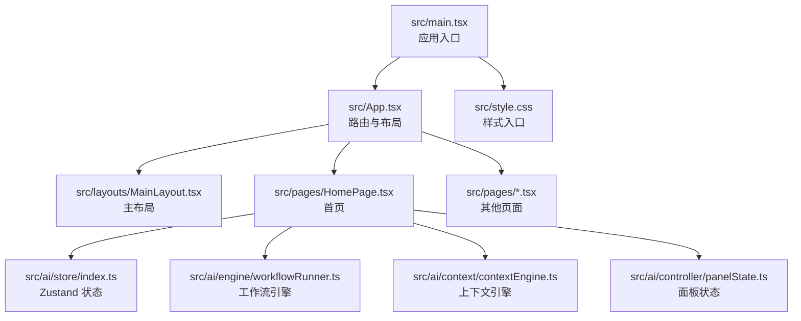
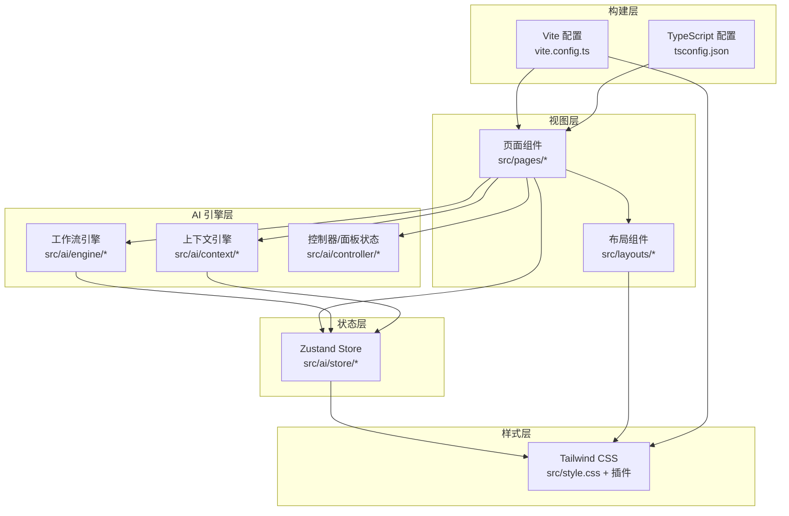
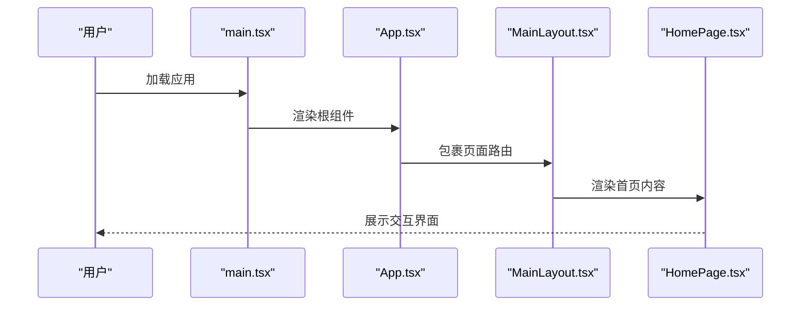
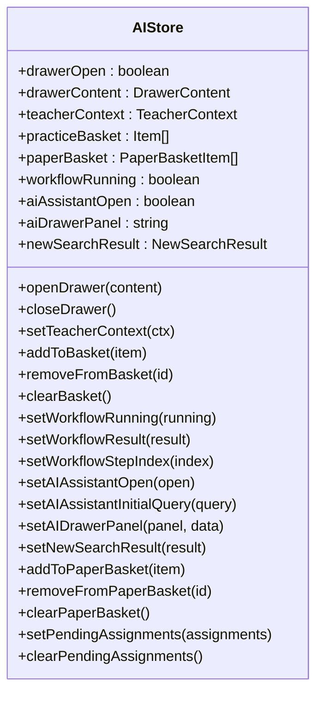
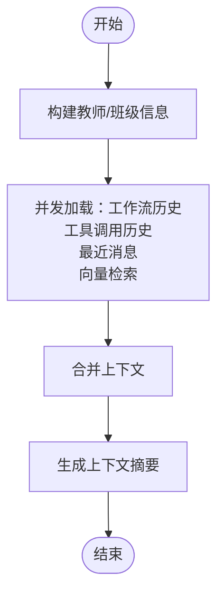
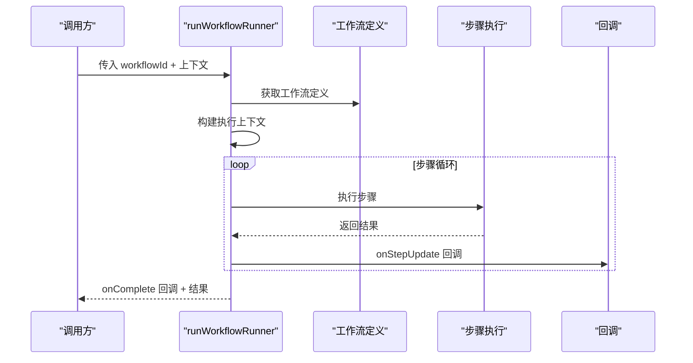
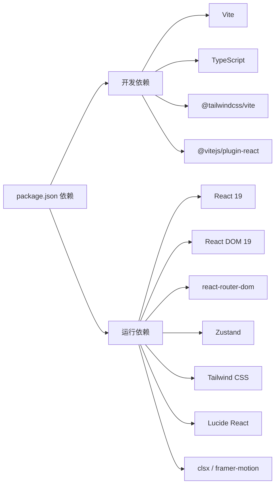

# 技术栈详解

<cite>
**本文引用的文件**
- [package.json](file://package.json)
- [vite.config.ts](file://vite.config.ts)
- [tsconfig.json](file://tsconfig.json)
- [src/main.tsx](file://src/main.tsx)
- [src/App.tsx](file://src/App.tsx)
- [src/style.css](file://src/style.css)
- [src/layouts/MainLayout.tsx](file://src/layouts/MainLayout.tsx)
- [src/pages/HomePage.tsx](file://src/pages/HomePage.tsx)
- [src/ai/store/index.ts](file://src/ai/store/index.ts)
- [src/ai/engine/workflowRunner.ts](file://src/ai/engine/workflowRunner.ts)
- [src/ai/context/contextEngine.ts](file://src/ai/context/contextEngine.ts)
- [src/ai/controller/panelState.ts](file://src/ai/controller/panelState.ts)
</cite>

## 目录
1. [引言](#引言)
2. [项目结构](#项目结构)
3. [核心组件](#核心组件)
4. [架构总览](#架构总览)
5. [详细组件分析](#详细组件分析)
6. [依赖关系分析](#依赖关系分析)
7. [性能考量](#性能考量)
8. [故障排查指南](#故障排查指南)
9. [结论](#结论)
10. [附录](#附录)

## 引言
本技术栈详解面向小天AI教育平台，系统性解析项目采用的核心技术与框架选择，包括 React 19、TypeScript、Vite、Zustand、Tailwind CSS 等，并结合实际代码落地场景说明其选型原因、优势、应用位置与集成方式。文档同时覆盖版本兼容性、升级策略、开发工具链配置（构建、类型定义、开发服务器）、性能优化与最佳实践，帮助开发者快速理解并高效使用该技术栈。

## 项目结构
项目采用以功能域为中心的组织方式，前端入口位于 src 目录，路由与页面按业务模块划分，AI 相关能力集中在 src/ai 子目录，包含工作流引擎、上下文引擎、控制器与状态管理等。样式通过 Tailwind CSS 驱动，构建由 Vite 提供，类型检查由 TypeScript 执行。

图示来源
- [src/main.tsx:1-11](file://src/main.tsx#L1-L11)
- [src/App.tsx:1-64](file://src/App.tsx#L1-L64)
- [src/layouts/MainLayout.tsx:1-215](file://src/layouts/MainLayout.tsx#L1-L215)
- [src/pages/HomePage.tsx:1-465](file://src/pages/HomePage.tsx#L1-L465)
- [src/style.css:1-2](file://src/style.css#L1-L2)
- [src/ai/store/index.ts:1-244](file://src/ai/store/index.ts#L1-L244)
- [src/ai/engine/workflowRunner.ts:1-288](file://src/ai/engine/workflowRunner.ts#L1-L288)
- [src/ai/context/contextEngine.ts:1-189](file://src/ai/context/contextEngine.ts#L1-L189)
- [src/ai/controller/panelState.ts:1-52](file://src/ai/controller/panelState.ts#L1-L52)

章节来源
- [src/main.tsx:1-11](file://src/main.tsx#L1-L11)
- [src/App.tsx:1-64](file://src/App.tsx#L1-L64)
- [src/style.css:1-2](file://src/style.css#L1-L2)

## 核心组件
- React 19：作为视图层框架，提供组件化 UI 与状态更新；项目中通过严格模式渲染，路由基于 react-router-dom 实现。
- TypeScript：提供强类型保障，编译器选项针对打包器模式进行优化，开启严格未使用检查与语法擦除模式。
- Vite：提供快速开发体验与高效构建，集成 React 与 Tailwind CSS 插件，支持本地开发服务器与预览。
- Zustand：轻量级状态管理，用于统一管理 AI 助手抽屉、教师上下文、作业篮、工作流运行状态等。
- Tailwind CSS：原子化样式框架，通过 @tailwindcss/vite 插件在构建期处理，样式入口引入官方预设。

章节来源
- [package.json:11-30](file://package.json#L11-L30)
- [vite.config.ts:1-12](file://vite.config.ts#L1-L12)
- [tsconfig.json:1-25](file://tsconfig.json#L1-L25)
- [src/ai/store/index.ts:1-244](file://src/ai/store/index.ts#L1-L244)
- [src/style.css:1-2](file://src/style.css#L1-L2)

## 架构总览
整体架构围绕“页面层（React）— 控制器/引擎层（AI）— 状态层（Zustand）— 样式层（Tailwind）— 构建层（Vite/TS）”展开。页面通过路由组织，AI 能力通过上下文引擎与工作流引擎串联，状态通过 Zustand 统一管理，样式通过 Tailwind 原子类与插件体系实现。

图示来源
- [src/pages/HomePage.tsx:1-465](file://src/pages/HomePage.tsx#L1-L465)
- [src/layouts/MainLayout.tsx:1-215](file://src/layouts/MainLayout.tsx#L1-L215)
- [src/ai/context/contextEngine.ts:1-189](file://src/ai/context/contextEngine.ts#L1-L189)
- [src/ai/engine/workflowRunner.ts:1-288](file://src/ai/engine/workflowRunner.ts#L1-L288)
- [src/ai/controller/panelState.ts:1-52](file://src/ai/controller/panelState.ts#L1-L52)
- [src/ai/store/index.ts:1-244](file://src/ai/store/index.ts#L1-L244)
- [src/style.css:1-2](file://src/style.css#L1-L2)
- [vite.config.ts:1-12](file://vite.config.ts#L1-L12)
- [tsconfig.json:1-25](file://tsconfig.json#L1-L25)

## 详细组件分析

### React 19 与路由
- 应用入口通过严格模式渲染根节点，挂载 App 组件。
- App 使用 BrowserRouter 包裹 Routes，集中声明页面路由与布局包裹关系。
- 主布局 MainLayout 提供侧边导航、顶部栏与抽屉容器，承载页面内容与 AI 抽屉。

图示来源
- [src/main.tsx:1-11](file://src/main.tsx#L1-L11)
- [src/App.tsx:1-64](file://src/App.tsx#L1-L64)
- [src/layouts/MainLayout.tsx:1-215](file://src/layouts/MainLayout.tsx#L1-L215)
- [src/pages/HomePage.tsx:1-465](file://src/pages/HomePage.tsx#L1-L465)

章节来源
- [src/main.tsx:1-11](file://src/main.tsx#L1-L11)
- [src/App.tsx:1-64](file://src/App.tsx#L1-L64)
- [src/layouts/MainLayout.tsx:1-215](file://src/layouts/MainLayout.tsx#L1-L215)

### Zustand 状态管理
- Store 覆盖抽屉、教师上下文、练习篮、工作流状态、AI 助手面板、搜索结果、试卷篮持久化等。
- 支持局部更新与去重逻辑，提供 Toast 通知与本地存储持久化（如试卷篮）。
- 与页面组件解耦，通过 hooks 订阅状态变化，避免深层传递。

图示来源
- [src/ai/store/index.ts:59-243](file://src/ai/store/index.ts#L59-L243)

章节来源
- [src/ai/store/index.ts:1-244](file://src/ai/store/index.ts#L1-L244)

### 上下文引擎（Context Engine）
- 负责构建运行时上下文，聚合近期会话、工具调用、工作流历史与向量检索的相关知识。
- 向量检索失败时提供回退知识，保证系统可用性。
- 提供上下文摘要，便于日志与调试。

图示来源
- [src/ai/context/contextEngine.ts:37-189](file://src/ai/context/contextEngine.ts#L37-L189)

章节来源
- [src/ai/context/contextEngine.ts:1-189](file://src/ai/context/contextEngine.ts#L1-L189)

### 工作流引擎（Workflow Runner）
- 作为 AI 工作流执行入口，负责查找定义、构建执行上下文、顺序执行步骤、回调通知与结果汇总。
- 支持步骤计时、失败中断、可调整参数与建议收集。
- 与 LLM/工具调用解耦，便于替换与扩展。

图示来源
- [src/ai/engine/workflowRunner.ts:103-179](file://src/ai/engine/workflowRunner.ts#L103-L179)

章节来源
- [src/ai/engine/workflowRunner.ts:1-288](file://src/ai/engine/workflowRunner.ts#L1-L288)

### 页面与交互（首页）
- 首页整合布置练习、课堂教学、资源模块、AI 搜索与教学关注等区域。
- 通过 Zustand 管理抽屉与工作流状态，触发工作流执行与结果展示。
- 使用 Lucide React 图标与 Tailwind 原子类实现一致的视觉风格。

章节来源
- [src/pages/HomePage.tsx:1-465](file://src/pages/HomePage.tsx#L1-L465)
- [src/layouts/MainLayout.tsx:1-215](file://src/layouts/MainLayout.tsx#L1-L215)

## 依赖关系分析
- 开发依赖：Vite、TypeScript、@tailwindcss/vite、@vitejs/plugin-react。
- 运行依赖：React 19、React DOM 19、react-router-dom、Zustand、Tailwind CSS、Lucide React、clsx、framer-motion。
- 构建与类型：Vite 配置启用 React 与 Tailwind 插件；tsconfig 针对打包器模式优化，启用严格未使用检查与语法擦除模式。

图示来源
- [package.json:11-30](file://package.json#L11-L30)

章节来源
- [package.json:11-30](file://package.json#L11-L30)
- [vite.config.ts:1-12](file://vite.config.ts#L1-L12)
- [tsconfig.json:1-25](file://tsconfig.json#L1-L25)

## 性能考量
- 构建与打包
  - 使用 Vite 的原生 ESM 与按需编译，减少冷启动时间与热更新延迟。
  - TypeScript 以 bundler 模式解析模块，避免额外的类型检查开销，构建阶段交由 tsc 与 Vite 协同完成。
- 运行时性能
  - Zustand 无中间件与样板代码，状态更新粒度细，避免不必要重渲染。
  - 页面组件按需加载与懒加载路由，降低首屏负担。
  - Tailwind 原子类减少样式体积与重复定义，提升样式复用效率。
- 算法与数据流
  - 上下文引擎并发加载多源数据，缩短等待时间；向量检索失败回退，确保稳定性。
  - 工作流引擎按步骤执行并记录耗时，便于定位性能瓶颈。
- 优化建议
  - 对高频组件使用 memo 化与浅比较，减少重渲染。
  - 将大列表虚拟化，控制一次性渲染元素数量。
  - 对静态资源使用 CDN 与缓存策略，结合 Netlify 部署优化网络传输。
  - 在开发阶段开启严格类型检查与未使用变量警告，及早发现潜在问题。

## 故障排查指南
- 构建与类型错误
  - 确认 tsconfig 的 bundler 模式与 verbatimModuleSyntax 设置是否与 Vite 插件匹配。
  - 若出现模块解析异常，检查 moduleResolution 与 allowImportingTsExtensions。
- 开发服务器问题
  - 若本地无法访问或端口冲突，检查 vite.config 中 server.host 与 allowedHosts 配置。
  - 如需远程联调，确保 allowedHosts 包含对应域名。
- 样式未生效
  - 确认 src/style.css 已正确引入 Tailwind 指令，且 @tailwindcss/vite 插件已启用。
- 状态异常
  - 检查 Zustand Store 初始化值与更新函数是否被正确调用，避免深拷贝遗漏字段。
  - 对持久化状态（如试卷篮）注意序列化/反序列化边界条件与存储配额。
- 工作流执行失败
  - 关注步骤回调 onError 输出，定位首个失败步骤并检查其输入与副作用。
  - 对外部向量检索失败场景，确认回退知识是否正常返回。

章节来源
- [vite.config.ts:7-11](file://vite.config.ts#L7-L11)
- [tsconfig.json:10-22](file://tsconfig.json#L10-L22)
- [src/style.css:1-2](file://src/style.css#L1-L2)
- [src/ai/store/index.ts:120-137](file://src/ai/store/index.ts#L120-L137)
- [src/ai/engine/workflowRunner.ts:205-219](file://src/ai/engine/workflowRunner.ts#L205-L219)
- [src/ai/context/contextEngine.ts:129-133](file://src/ai/context/contextEngine.ts#L129-L133)

## 结论
本项目以 React 19 为核心视图层，结合 TypeScript、Vite、Tailwind CSS 与 Zustand，形成现代化、高性能、易维护的前端技术栈。通过上下文引擎与工作流引擎抽象 AI 能力，配合集中式状态管理与原子化样式体系，满足教育场景下的复杂交互与快速迭代需求。建议在后续演进中持续关注各依赖的版本兼容性与安全更新，保持构建与类型配置的一致性，并在性能与可维护性之间取得平衡。

## 附录
- 版本兼容性与升级策略
  - React 19 与 react-router-dom 7.x：建议采用语义化版本策略，先在测试环境验证再灰度上线。
  - TypeScript 6.x：保持与 Vite 生态兼容，升级前先行本地与 CI 构建验证。
  - Vite 8.x：关注插件生态更新，优先升级 @vitejs/plugin-react 与 @tailwindcss/vite。
  - Tailwind CSS 4.x：留意新版本指令与默认行为变更，逐步迁移至新语法。
  - Zustand 5.x：关注 API 变更与迁移指南，确保 store 定义与订阅方式兼容。
- 开发工具链配置要点
  - 构建：使用 Vite 的原生 ESM 与 React 插件，Tailwind 插件自动扫描类名。
  - 类型：启用 bundler 模式与严格未使用检查，避免冗余类型与潜在错误。
  - 开发服务器：host 设置为 0.0.0.0 便于局域网联调，allowedHosts 配置允许的外网主机。
  - 预览：使用 vite preview 验证生产构建产物，确保样式与脚本加载正常。

章节来源
- [package.json:11-30](file://package.json#L11-L30)
- [vite.config.ts:1-12](file://vite.config.ts#L1-L12)
- [tsconfig.json:1-25](file://tsconfig.json#L1-L25)