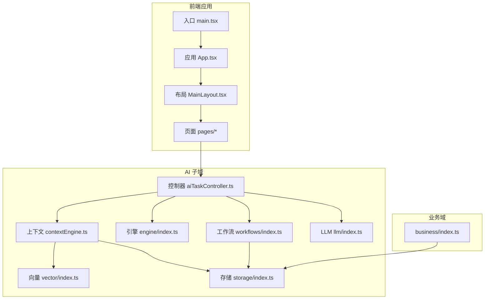
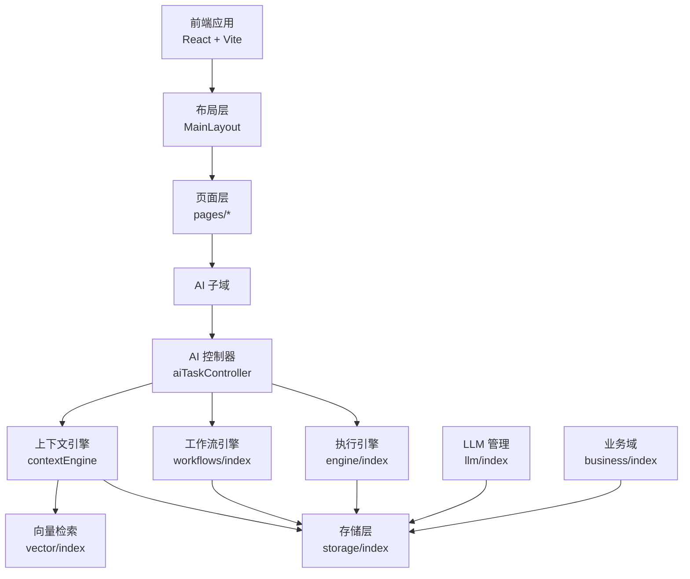
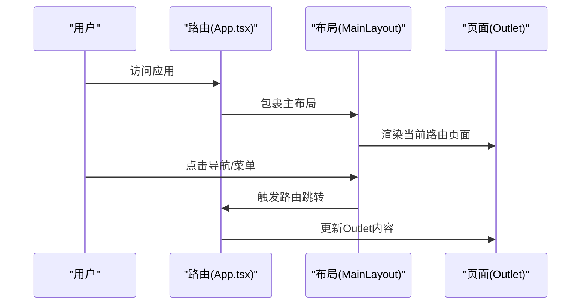
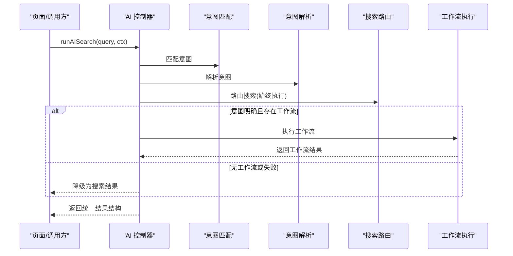
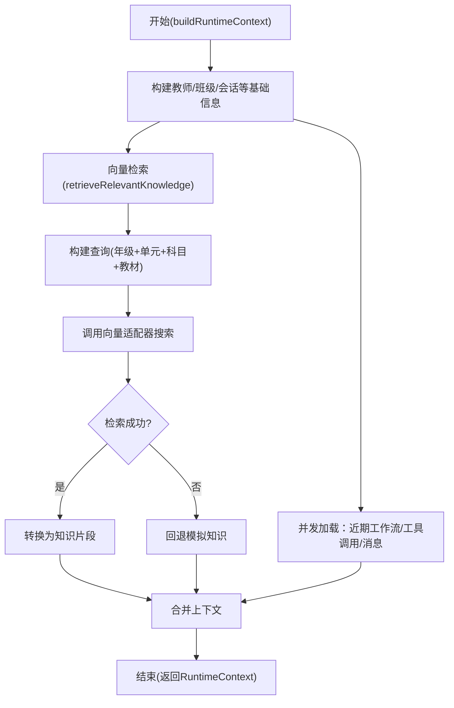
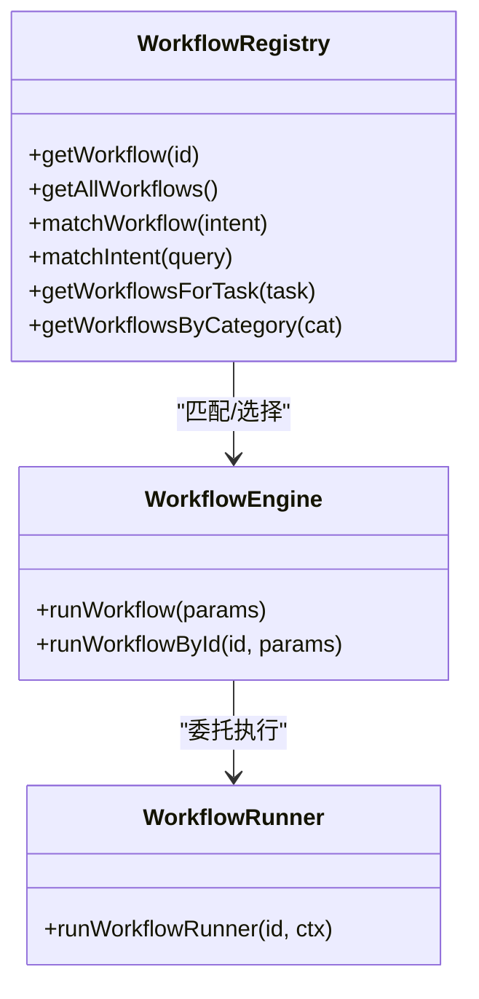
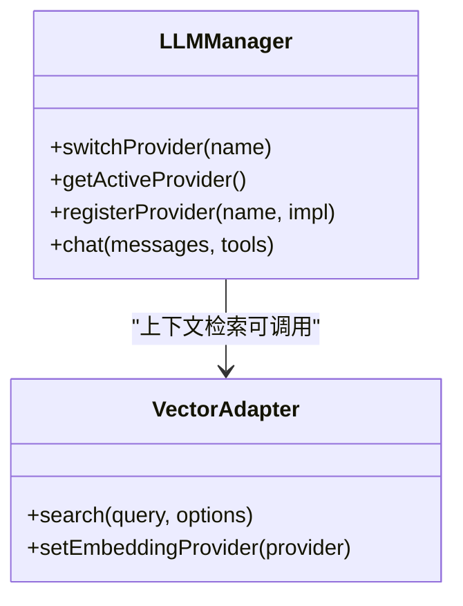
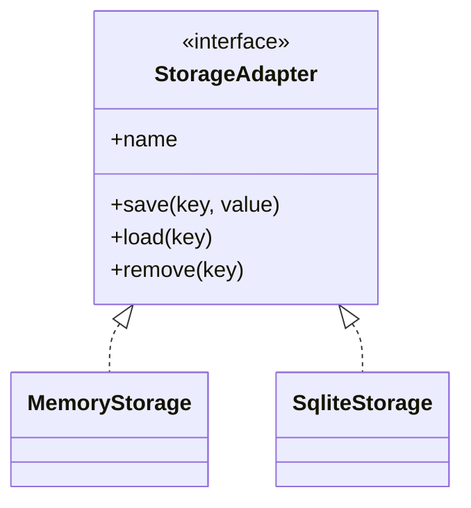
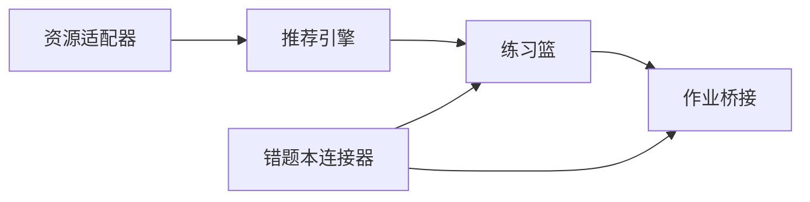
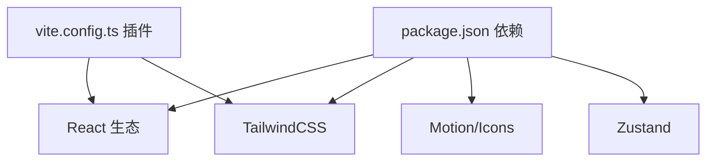

# 整体架构设计

<cite>
**本文引用的文件**
- [src/App.tsx](file://src/App.tsx)
- [src/main.tsx](file://src/main.tsx)
- [src/layouts/MainLayout.tsx](file://src/layouts/MainLayout.tsx)
- [package.json](file://package.json)
- [vite.config.ts](file://vite.config.ts)
- [src/ai/controller/aiTaskController.ts](file://src/ai/controller/aiTaskController.ts)
- [src/ai/context/contextEngine.ts](file://src/ai/context/contextEngine.ts)
- [src/ai/engine/index.ts](file://src/ai/engine/index.ts)
- [src/ai/workflows/index.ts](file://src/ai/workflows/index.ts)
- [src/ai/llm/index.ts](file://src/ai/llm/index.ts)
- [src/vector/index.ts](file://src/vector/index.ts)
- [src/storage/index.ts](file://src/storage/index.ts)
- [src/business/index.ts](file://src/business/index.ts)
</cite>

## 目录
1. [引言](#引言)
2. [项目结构](#项目结构)
3. [核心组件](#核心组件)
4. [架构总览](#架构总览)
5. [详细组件分析](#详细组件分析)
6. [依赖分析](#依赖分析)
7. [性能考虑](#性能考虑)
8. [故障排查指南](#故障排查指南)
9. [结论](#结论)
10. [附录](#附录)

## 引言
本文件为“小天AI教育平台”的整体架构设计文档，面向架构师与高级开发者，提供系统全貌的理解框架。文档聚焦以下目标：
- 高层架构模式：模块化、分层与插件化设计
- 前端应用组织：路由系统、布局系统与页面组件层次
- 系统边界与模块职责划分
- 数据流向与组件间通信机制
- 架构决策的技术考量与设计权衡
- 系统架构图与组件关系图

## 项目结构
小天AI教育平台采用以功能域为中心的模块化组织方式，前端基于React + Vite构建，AI能力以独立子域封装，业务域与基础设施域清晰分离。

图表来源
- [src/main.tsx:1-11](file://src/main.tsx#L1-L11)
- [src/App.tsx:1-64](file://src/App.tsx#L1-L64)
- [src/layouts/MainLayout.tsx:1-215](file://src/layouts/MainLayout.tsx#L1-L215)
- [src/ai/controller/aiTaskController.ts:1-184](file://src/ai/controller/aiTaskController.ts#L1-L184)
- [src/ai/context/contextEngine.ts:1-189](file://src/ai/context/contextEngine.ts#L1-L189)
- [src/ai/engine/index.ts:1-15](file://src/ai/engine/index.ts#L1-L15)
- [src/ai/workflows/index.ts:1-38](file://src/ai/workflows/index.ts#L1-L38)
- [src/ai/llm/index.ts:1-39](file://src/ai/llm/index.ts#L1-L39)
- [src/vector/index.ts:1-35](file://src/vector/index.ts#L1-L35)
- [src/storage/index.ts:1-36](file://src/storage/index.ts#L1-L36)
- [src/business/index.ts:1-55](file://src/business/index.ts#L1-L55)

章节来源
- [src/main.tsx:1-11](file://src/main.tsx#L1-L11)
- [src/App.tsx:1-64](file://src/App.tsx#L1-L64)
- [src/layouts/MainLayout.tsx:1-215](file://src/layouts/MainLayout.tsx#L1-L215)
- [package.json:1-31](file://package.json#L1-L31)
- [vite.config.ts:1-12](file://vite.config.ts#L1-L12)

## 核心组件
- 应用入口与渲染
  - 入口文件负责挂载根组件与全局样式，确保严格模式运行。
  - 应用根组件配置路由与主布局包装，统一承载导航、侧边栏与内容区域。
- 主布局系统
  - 提供顶部导航栏、左侧蓝底导航、移动端抽屉、返回与最小化控制等。
  - 内容区通过 Outlet 渲染当前路由页面，支持无侧边栏沉浸式页面。
- AI任务控制器
  - 统一意图解析、搜索路由与工作流执行入口，保证所有页面使用一致的AI行为。
  - 支持快捷动作与洞察动作两类预设查询映射。
- 上下文引擎
  - 构建运行时上下文，聚合教师信息、班级信息、近期会话、工具调用与检索到的相关知识。
  - 集成向量检索，实现RAG增强的提示注入。
- 工作流与引擎
  - 工作流注册表与执行器解耦具体流程定义；引擎提供统一的运行时参数与回调接口。
- LLM与向量适配器
  - LLM提供多提供商管理与切换；向量适配器支持嵌入与检索抽象，便于替换实现。
- 存储层
  - 存储适配器单例模式，支持内存与SQLite等后端切换，向上层屏蔽持久化细节。
- 业务域
  - 资源适配器、推荐引擎、练习篮、错题本连接器与作业桥接器，形成教学业务闭环。

章节来源
- [src/main.tsx:1-11](file://src/main.tsx#L1-L11)
- [src/App.tsx:1-64](file://src/App.tsx#L1-L64)
- [src/layouts/MainLayout.tsx:1-215](file://src/layouts/MainLayout.tsx#L1-L215)
- [src/ai/controller/aiTaskController.ts:1-184](file://src/ai/controller/aiTaskController.ts#L1-L184)
- [src/ai/context/contextEngine.ts:1-189](file://src/ai/context/contextEngine.ts#L1-L189)
- [src/ai/engine/index.ts:1-15](file://src/ai/engine/index.ts#L1-L15)
- [src/ai/workflows/index.ts:1-38](file://src/ai/workflows/index.ts#L1-L38)
- [src/ai/llm/index.ts:1-39](file://src/ai/llm/index.ts#L1-L39)
- [src/vector/index.ts:1-35](file://src/vector/index.ts#L1-L35)
- [src/storage/index.ts:1-36](file://src/storage/index.ts#L1-L36)
- [src/business/index.ts:1-55](file://src/business/index.ts#L1-L55)

## 架构总览
系统采用“前端单页应用 + AI子域 + 业务域 + 基础设施域”的分层架构，结合模块化与插件化设计，实现高内聚低耦合。

图表来源
- [src/App.tsx:1-64](file://src/App.tsx#L1-L64)
- [src/layouts/MainLayout.tsx:1-215](file://src/layouts/MainLayout.tsx#L1-L215)
- [src/ai/controller/aiTaskController.ts:1-184](file://src/ai/controller/aiTaskController.ts#L1-L184)
- [src/ai/context/contextEngine.ts:1-189](file://src/ai/context/contextEngine.ts#L1-L189)
- [src/ai/workflows/index.ts:1-38](file://src/ai/workflows/index.ts#L1-L38)
- [src/ai/engine/index.ts:1-15](file://src/ai/engine/index.ts#L1-L15)
- [src/ai/llm/index.ts:1-39](file://src/ai/llm/index.ts#L1-L39)
- [src/vector/index.ts:1-35](file://src/vector/index.ts#L1-L35)
- [src/storage/index.ts:1-36](file://src/storage/index.ts#L1-L36)
- [src/business/index.ts:1-55](file://src/business/index.ts#L1-L55)

## 详细组件分析

### 前端路由与布局系统
- 路由组织
  - 使用 React Router DOM 定义主布局包裹下的多页面路由，并提供若干无需侧边栏的沉浸式页面。
  - 路由路径覆盖首页、错题/错词、报告、写作/听力、资源、同步教学、考试复习、搜索、AI搜索、手动创作以及多种布置任务页面。
- 布局系统
  - 顶部导航包含品牌标识、教材版本与班级选择、通知与下载按钮、AI助手入口与窗口控制模拟。
  - 左侧蓝底导航提供常用功能入口，支持“更多功能”折叠菜单。
  - 移动端侧边抽屉与返回/最小化控制，保障移动端体验。
  - 内容区通过 Outlet 接收当前路由页面渲染。

图表来源
- [src/App.tsx:1-64](file://src/App.tsx#L1-L64)
- [src/layouts/MainLayout.tsx:1-215](file://src/layouts/MainLayout.tsx#L1-L215)

章节来源
- [src/App.tsx:1-64](file://src/App.tsx#L1-L64)
- [src/layouts/MainLayout.tsx:1-215](file://src/layouts/MainLayout.tsx#L1-L215)

### AI任务控制器与意图路由
- 统一入口
  - 所有页面必须通过 AI 控制器发起搜索或工作流执行，避免重复逻辑与不一致行为。
- 意图解析与搜索路由
  - 先进行意图匹配与解析，再执行搜索路由，确保无论是否触发工作流，均返回一致的搜索结果结构。
- 工作流执行回退
  - 当工作流执行失败时，自动降级为搜索结果，保证用户体验连续性。
- 快捷动作与洞察动作
  - 提供预设查询映射，简化用户操作路径；资源搜索动作强制走搜索模式。

图表来源
- [src/ai/controller/aiTaskController.ts:1-184](file://src/ai/controller/aiTaskController.ts#L1-L184)

章节来源
- [src/ai/controller/aiTaskController.ts:1-184](file://src/ai/controller/aiTaskController.ts#L1-L184)

### 上下文引擎与RAG检索
- 运行时上下文构建
  - 聚合教师、班级、近期会话、工具调用与检索到的相关知识，形成统一上下文对象。
- RAG检索流程
  - 基于当前教学情境构建查询，调用向量适配器检索知识片段，转换为知识片段格式。
  - 失败时回退到模拟知识，保证系统可用性。
- 总结摘要
  - 将上下文关键信息汇总为可读字符串，便于日志与调试。

图表来源
- [src/ai/context/contextEngine.ts:1-189](file://src/ai/context/contextEngine.ts#L1-L189)
- [src/vector/index.ts:1-35](file://src/vector/index.ts#L1-L35)

章节来源
- [src/ai/context/contextEngine.ts:1-189](file://src/ai/context/contextEngine.ts#L1-L189)
- [src/vector/index.ts:1-35](file://src/vector/index.ts#L1-L35)

### 工作流与引擎
- 工作流注册与匹配
  - 提供工作流注册表、按任务/类别匹配与意图匹配能力，支撑动态路由与选择。
- 执行引擎
  - 提供统一的运行时上下文、回调与结果类型，屏蔽具体步骤细节。
- 类型与导出
  - 对外暴露工作流定义、执行上下文、步骤结果与输出类型，便于扩展与测试。

图表来源
- [src/ai/workflows/index.ts:1-38](file://src/ai/workflows/index.ts#L1-L38)
- [src/ai/engine/index.ts:1-15](file://src/ai/engine/index.ts#L1-L15)

章节来源
- [src/ai/workflows/index.ts:1-38](file://src/ai/workflows/index.ts#L1-L38)
- [src/ai/engine/index.ts:1-15](file://src/ai/engine/index.ts#L1-L15)

### LLM与向量适配器
- LLM管理
  - 提供客户端封装、提供商切换与注册、活跃提供商查询等能力，便于多模型接入与灰度发布。
- 向量适配器
  - 抽象向量检索与嵌入提供者，支持替换实现与一致性接口。

图表来源
- [src/ai/llm/index.ts:1-39](file://src/ai/llm/index.ts#L1-L39)
- [src/vector/index.ts:1-35](file://src/vector/index.ts#L1-L35)

章节来源
- [src/ai/llm/index.ts:1-39](file://src/ai/llm/index.ts#L1-L39)
- [src/vector/index.ts:1-35](file://src/vector/index.ts#L1-L35)

### 存储层
- 单例适配器
  - 默认内存存储，可通过设置函数切换至SQLite等其他实现，向上层屏蔽持久化差异。
- 类型与导出
  - 统一存储接口与数据模型，便于扩展与迁移。

图表来源
- [src/storage/index.ts:1-36](file://src/storage/index.ts#L1-L36)

章节来源
- [src/storage/index.ts:1-36](file://src/storage/index.ts#L1-L36)

### 业务域
- 资源适配器与推荐引擎
  - 提供资源检索与推荐原因构建能力。
- 练习篮
  - 支持添加、移除、更新、清空与生成作业等操作。
- 错题本连接器
  - 提供班级错词/错题、高频错点与弱知识点统计，支持生成针对性训练。
- 作业桥接
  - 支持创建草稿、发布作业、查询已发布作业与活动日志、统计信息等。

图表来源
- [src/business/index.ts:1-55](file://src/business/index.ts#L1-L55)

章节来源
- [src/business/index.ts:1-55](file://src/business/index.ts#L1-L55)

## 依赖分析
- 前端依赖
  - React、React Router DOM、TailwindCSS、Framer Motion、Lucide React、Zustand 等。
- 开发依赖
  - TypeScript、Vite、@vitejs/plugin-react、@tailwindcss/vite、Netlify CLI。
- 构建与运行
  - Vite 提供开发服务器与打包能力，支持本地主机与允许的主机列表配置。

图表来源
- [package.json:1-31](file://package.json#L1-L31)
- [vite.config.ts:1-12](file://vite.config.ts#L1-L12)

章节来源
- [package.json:1-31](file://package.json#L1-L31)
- [vite.config.ts:1-12](file://vite.config.ts#L1-L12)

## 性能考虑
- 并发加载与懒加载
  - 上下文构建阶段对近期工作流、工具调用、消息与RAG知识进行并发加载，减少等待时间。
- 缓存与回退
  - 向量检索失败时回退模拟知识，保证服务可用性；存储层可替换为SQLite以提升持久化性能。
- 路由与渲染
  - 主布局统一承载导航与内容，避免重复渲染；无侧边栏页面直接渲染，降低层级开销。
- LLM与向量
  - 提供提供商切换与注册能力，便于灰度与A/B测试；向量适配器抽象便于替换实现。

## 故障排查指南
- AI任务执行失败
  - 检查意图匹配与工作流ID是否存在；若工作流执行抛出异常，控制器会自动降级为搜索结果，确认搜索响应是否正常。
- RAG检索异常
  - 核对向量适配器是否正确初始化；当检索失败时，系统回退模拟知识，检查模拟数据是否满足预期。
- 存储不可用
  - 确认存储适配器是否被替换为SQLite；默认内存适配器仅适用于开发与测试。
- 路由与布局问题
  - 检查路由配置与主布局包裹是否正确；移动端抽屉状态与导航激活态应符合预期。

章节来源
- [src/ai/controller/aiTaskController.ts:1-184](file://src/ai/controller/aiTaskController.ts#L1-L184)
- [src/ai/context/contextEngine.ts:1-189](file://src/ai/context/contextEngine.ts#L1-L189)
- [src/storage/index.ts:1-36](file://src/storage/index.ts#L1-L36)
- [src/App.tsx:1-64](file://src/App.tsx#L1-L64)
- [src/layouts/MainLayout.tsx:1-215](file://src/layouts/MainLayout.tsx#L1-L215)

## 结论
小天AI教育平台通过模块化、分层与插件化设计，实现了前端与AI子域的清晰边界与高内聚。统一的AI任务控制器与上下文引擎确保了教学场景下的意图解析、搜索与工作流执行的一致性；RAG检索与存储抽象提升了系统的可扩展性与可维护性。该架构既满足当前教学业务需求，也为未来多模型接入、知识库扩展与业务域演进提供了坚实基础。

## 附录
- 关键文件清单
  - 应用入口与路由：[src/main.tsx:1-11](file://src/main.tsx#L1-L11)、[src/App.tsx:1-64](file://src/App.tsx#L1-L64)
  - 布局与页面：[src/layouts/MainLayout.tsx:1-215](file://src/layouts/MainLayout.tsx#L1-L215)
  - AI控制器与上下文：[src/ai/controller/aiTaskController.ts:1-184](file://src/ai/controller/aiTaskController.ts#L1-L184)、[src/ai/context/contextEngine.ts:1-189](file://src/ai/context/contextEngine.ts#L1-L189)
  - 工作流与引擎：[src/ai/workflows/index.ts:1-38](file://src/ai/workflows/index.ts#L1-L38)、[src/ai/engine/index.ts:1-15](file://src/ai/engine/index.ts#L1-L15)
  - LLM与向量：[src/ai/llm/index.ts:1-39](file://src/ai/llm/index.ts#L1-L39)、[src/vector/index.ts:1-35](file://src/vector/index.ts#L1-L35)
  - 存储层：[src/storage/index.ts:1-36](file://src/storage/index.ts#L1-L36)
  - 业务域：[src/business/index.ts:1-55](file://src/business/index.ts#L1-L55)
- 构建与依赖
  - [package.json:1-31](file://package.json#L1-L31)、[vite.config.ts:1-12](file://vite.config.ts#L1-L12)