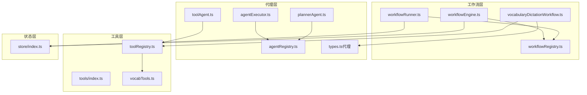
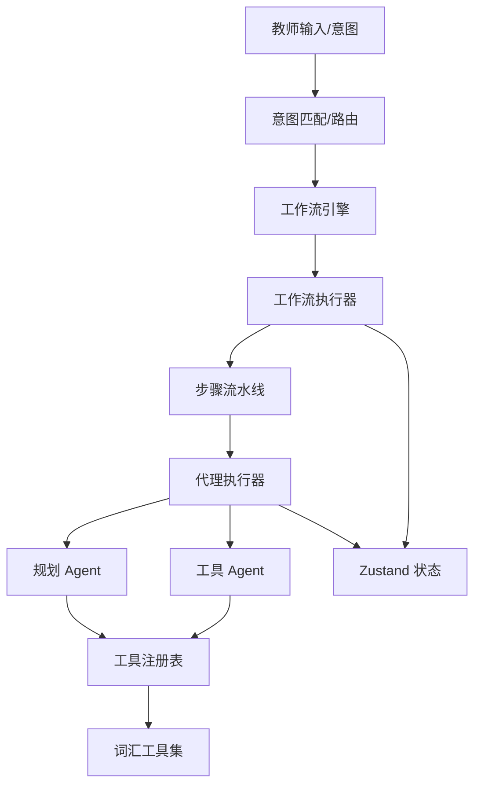
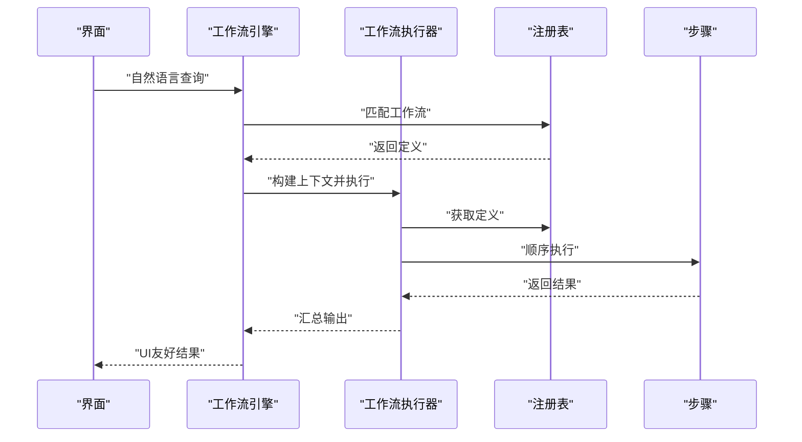
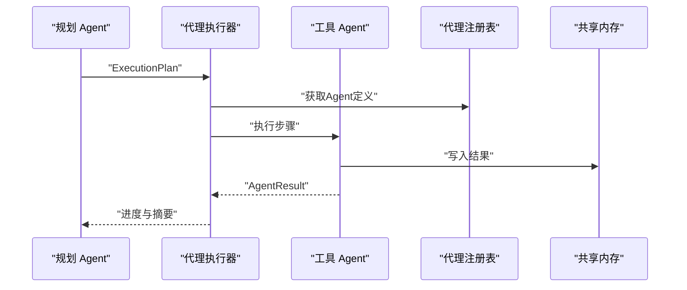
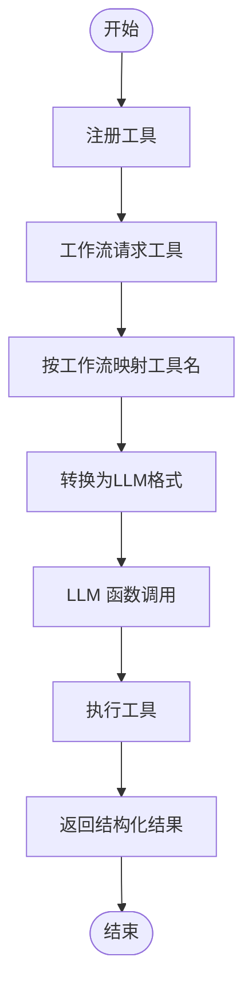
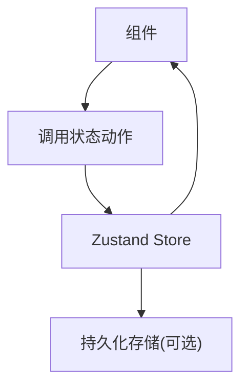
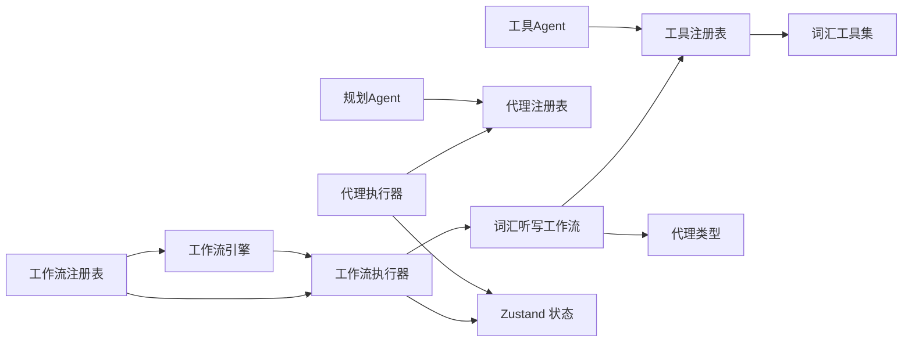

# 核心设计理念

<cite>
**本文引用的文件**
- [workflowRunner.ts](file://src/ai/engine/workflowRunner.ts)
- [workflowEngine.ts](file://src/ai/workflows/workflowEngine.ts)
- [workflowRegistry.ts](file://src/ai/workflows/workflowRegistry.ts)
- [vocabularyDictationWorkflow.ts](file://src/ai/workflows/vocabularyDictationWorkflow.ts)
- [agentExecutor.ts](file://src/ai/agent/agentExecutor.ts)
- [agentRegistry.ts](file://src/ai/agent/agentRegistry.ts)
- [plannerAgent.ts](file://src/ai/agents/plannerAgent.ts)
- [toolAgent.ts](file://src/ai/agents/toolAgent.ts)
- [types.ts（代理）](file://src/ai/agent/types.ts)
- [toolRegistry.ts](file://src/ai/tools/toolRegistry.ts)
- [tools/index.ts](file://src/ai/tools/index.ts)
- [vocabTools.ts](file://src/ai/tools/vocabTools.ts)
- [store/index.ts](file://src/ai/store/index.ts)
</cite>

## 目录
1. [引言](#引言)
2. [项目结构](#项目结构)
3. [核心组件](#核心组件)
4. [架构总览](#架构总览)
5. [详细组件分析](#详细组件分析)
6. [依赖关系分析](#依赖关系分析)
7. [性能考量](#性能考量)
8. [故障排查指南](#故障排查指南)
9. [结论](#结论)
10. [附录](#附录)

## 引言
本设计文档面向小天AI教育平台，系统阐述四大核心设计理念及其在AI教学助手系统中的协同机制：
- 工作流驱动架构：将复杂教学任务拆解为可编排、可观测、可扩展的步骤流水线。
- 代理协作模式：多智能体按计划并行/串行协作，围绕共同目标完成任务。
- 工具调用模式：将功能封装为可复用工具，统一参数与结果格式，支持LLM函数调用桥接。
- 状态管理模式：使用Zustand进行全局状态管理，确保UI与业务流程的解耦与一致性。

这些理念相互支撑：工作流定义任务边界与步骤；代理负责动态规划与执行；工具提供原子能力；Zustand保障状态一致与可追踪。

## 项目结构
小天AI教育平台采用“领域分层 + 组件自治”的组织方式：
- 工作流层：定义教学任务的步骤与执行策略，屏蔽底层实现细节。
- 代理层：规划与执行任务，协调工具调用与消息传递。
- 工具层：提供可复用的功能模块，统一参数与结果格式。
- 状态层：集中管理教师上下文、抽屉面板、作业篮、工作流运行状态等。

图表来源
- [workflowRunner.ts:103-179](file://src/ai/engine/workflowRunner.ts#L103-L179)
- [workflowEngine.ts:42-78](file://src/ai/workflows/workflowEngine.ts#L42-L78)
- [workflowRegistry.ts:47-73](file://src/ai/workflows/workflowRegistry.ts#L47-L73)
- [vocabularyDictationWorkflow.ts:59-299](file://src/ai/workflows/vocabularyDictationWorkflow.ts#L59-L299)
- [agentExecutor.ts:36-106](file://src/ai/agent/agentExecutor.ts#L36-L106)
- [agentRegistry.ts:19-29](file://src/ai/agent/agentRegistry.ts#L19-L29)
- [plannerAgent.ts:12-38](file://src/ai/agents/plannerAgent.ts#L12-L38)
- [toolAgent.ts:13-93](file://src/ai/agents/toolAgent.ts#L13-L93)
- [toolRegistry.ts:25-65](file://src/ai/tools/toolRegistry.ts#L25-L65)
- [tools/index.ts:1-20](file://src/ai/tools/index.ts#L1-L20)
- [vocabTools.ts:10-59](file://src/ai/tools/vocabTools.ts#L10-L59)
- [store/index.ts:140-243](file://src/ai/store/index.ts#L140-L243)

章节来源
- [workflowRunner.ts:103-179](file://src/ai/engine/workflowRunner.ts#L103-L179)
- [workflowEngine.ts:42-78](file://src/ai/workflows/workflowEngine.ts#L42-L78)
- [workflowRegistry.ts:47-73](file://src/ai/workflows/workflowRegistry.ts#L47-L73)
- [vocabularyDictationWorkflow.ts:59-299](file://src/ai/workflows/vocabularyDictationWorkflow.ts#L59-L299)
- [agentExecutor.ts:36-106](file://src/ai/agent/agentExecutor.ts#L36-L106)
- [agentRegistry.ts:19-29](file://src/ai/agent/agentRegistry.ts#L19-L29)
- [plannerAgent.ts:12-38](file://src/ai/agents/plannerAgent.ts#L12-L38)
- [toolAgent.ts:13-93](file://src/ai/agents/toolAgent.ts#L13-L93)
- [toolRegistry.ts:25-65](file://src/ai/tools/toolRegistry.ts#L25-L65)
- [tools/index.ts:1-20](file://src/ai/tools/index.ts#L1-L20)
- [vocabTools.ts:10-59](file://src/ai/tools/vocabTools.ts#L10-L59)
- [store/index.ts:140-243](file://src/ai/store/index.ts#L140-L243)

## 核心组件
- 工作流执行器：接收工作流ID与教师上下文，按步骤顺序执行，收集每步结果并汇总输出，支持回调与可调整参数。
- 工作流引擎：根据自然语言查询匹配最合适的教学任务，构建执行上下文并触发执行。
- 工作流注册表：集中注册与查找工作流，支持意图路由与分类检索。
- 代理执行器：按并行组顺序执行多智能体计划，支持串行与并行组合，聚合结果并记录协作摘要。
- 代理注册表与代理类型：统一管理代理定义、能力匹配与角色划分。
- 工具注册表与工具集合：统一注册工具、参数Schema与LLM桥接格式，自动为工作流注入所需工具。
- Zustand状态存储：集中管理抽屉、教师上下文、作业篮、工作流运行状态等，提供持久化与响应式更新。

章节来源
- [workflowRunner.ts:103-179](file://src/ai/engine/workflowRunner.ts#L103-L179)
- [workflowEngine.ts:42-78](file://src/ai/workflows/workflowEngine.ts#L42-L78)
- [workflowRegistry.ts:47-73](file://src/ai/workflows/workflowRegistry.ts#L47-L73)
- [agentExecutor.ts:36-106](file://src/ai/agent/agentExecutor.ts#L36-L106)
- [agentRegistry.ts:19-29](file://src/ai/agent/agentRegistry.ts#L19-L29)
- [toolRegistry.ts:25-65](file://src/ai/tools/toolRegistry.ts#L25-L65)
- [store/index.ts:140-243](file://src/ai/store/index.ts#L140-L243)

## 架构总览
四大设计模式在系统中的协同关系如下：

图表来源
- [workflowEngine.ts:42-78](file://src/ai/workflows/workflowEngine.ts#L42-L78)
- [workflowRunner.ts:103-179](file://src/ai/engine/workflowRunner.ts#L103-L179)
- [agentExecutor.ts:36-106](file://src/ai/agent/agentExecutor.ts#L36-L106)
- [plannerAgent.ts:12-38](file://src/ai/agents/plannerAgent.ts#L12-L38)
- [toolAgent.ts:13-93](file://src/ai/agents/toolAgent.ts#L13-L93)
- [toolRegistry.ts:25-65](file://src/ai/tools/toolRegistry.ts#L25-L65)
- [vocabTools.ts:10-59](file://src/ai/tools/vocabTools.ts#L10-L59)
- [store/index.ts:140-243](file://src/ai/store/index.ts#L140-L243)

## 详细组件分析

### 工作流驱动架构
- 设计要点
  - 将复杂教学任务拆分为固定或可配置的步骤，每步产出结构化结果，便于UI展示与后续步骤消费。
  - 执行器负责按序调度、异常中断、回调通知与最终输出构建。
  - 支持可调整参数与建议收集，提升交互体验与可定制性。
- 实现原理
  - 注册表查找工作流定义，构建执行上下文，逐步骤调用step.execute并缓存中间结果。
  - 输出优先取最后带outputType的步骤，否则回退为文本摘要。
- 应用场景
  - 词汇听写生成、作文分析、试卷生成、学情分析等教学任务。
- 优势
  - 任务可编排、可观测、可扩展；与LLM解耦，便于替换为真实模型。
- 最佳实践
  - 步骤命名清晰、职责单一；在步骤间传递必要上下文；捕获并上报错误以便快速定位。

图表来源
- [workflowEngine.ts:42-78](file://src/ai/workflows/workflowEngine.ts#L42-L78)
- [workflowRunner.ts:103-179](file://src/ai/engine/workflowRunner.ts#L103-L179)
- [workflowRegistry.ts:47-73](file://src/ai/workflows/workflowRegistry.ts#L47-L73)

章节来源
- [workflowEngine.ts:42-78](file://src/ai/workflows/workflowEngine.ts#L42-L78)
- [workflowRunner.ts:103-179](file://src/ai/engine/workflowRunner.ts#L103-L179)
- [workflowRegistry.ts:47-73](file://src/ai/workflows/workflowRegistry.ts#L47-L73)
- [vocabularyDictationWorkflow.ts:59-299](file://src/ai/workflows/vocabularyDictationWorkflow.ts#L59-L299)

### 代理协作模式
- 设计要点
  - 规划阶段由规划Agent根据用户意图生成执行计划，包含步骤、并行组与依赖。
  - 执行阶段按并行组顺序推进，同组内Agent并行，跨组串行，共享内存与消息。
- 实现原理
  - 执行器读取ExecutionPlan，按组调度Agent，收集AgentResult并写入共享内存。
  - 支持可选步骤与失败中断，保证流程鲁棒性。
- 应用场景
  - 多Agent协同完成“筛选+生成+校验+记忆”等复合任务。
- 优势
  - 动态规划、并行加速、强解耦、可扩展新Agent。
- 最佳实践
  - 明确Agent角色与能力标签；合理划分并行组；通过共享内存传递必要数据。

图表来源
- [agentExecutor.ts:36-106](file://src/ai/agent/agentExecutor.ts#L36-L106)
- [agentRegistry.ts:19-29](file://src/ai/agent/agentRegistry.ts#L19-L29)
- [plannerAgent.ts:12-38](file://src/ai/agents/plannerAgent.ts#L12-L38)
- [toolAgent.ts:13-93](file://src/ai/agents/toolAgent.ts#L13-L93)

章节来源
- [agentExecutor.ts:36-106](file://src/ai/agent/agentExecutor.ts#L36-L106)
- [agentRegistry.ts:19-29](file://src/ai/agent/agentRegistry.ts#L19-L29)
- [plannerAgent.ts:12-38](file://src/ai/agents/plannerAgent.ts#L12-L38)
- [toolAgent.ts:13-93](file://src/ai/agents/toolAgent.ts#L13-L93)
- [types.ts（代理）:13-131](file://src/ai/agent/types.ts#L13-L131)

### 工具调用模式
- 设计要点
  - 工具以统一Schema定义参数与结果，支持LLM函数调用桥接。
  - 工具注册表集中管理，按工作流自动注入所需工具，降低耦合。
- 实现原理
  - 工具注册表提供注册、查询、转换为LLM格式与批量执行能力。
  - 工作流通过工具名集合自动获取工具Schema，Agent在对话中调用工具并回传结果。
- 应用场景
  - 词汇获取、筛选、默写生成等教学辅助功能。
- 优势
  - 参数标准化、结果结构化、易于扩展与复用。
- 最佳实践
  - 工具职责单一、参数最小化；提供清晰的描述与示例；错误处理与摘要明确。

图表来源
- [toolRegistry.ts:25-65](file://src/ai/tools/toolRegistry.ts#L25-L65)
- [tools/index.ts:1-20](file://src/ai/tools/index.ts#L1-L20)
- [vocabTools.ts:10-59](file://src/ai/tools/vocabTools.ts#L10-L59)

章节来源
- [toolRegistry.ts:25-65](file://src/ai/tools/toolRegistry.ts#L25-L65)
- [tools/index.ts:1-20](file://src/ai/tools/index.ts#L1-L20)
- [vocabTools.ts:10-59](file://src/ai/tools/vocabTools.ts#L10-L59)

### 状态管理模式（Zustand）
- 设计要点
  - 使用Zustand集中管理抽屉、教师上下文、作业篮、工作流运行状态等。
  - 提供持久化（如试卷篮）与响应式更新，简化UI与业务逻辑耦合。
- 实现原理
  - 定义状态切片与动作，按需订阅；部分状态本地持久化，避免刷新丢失。
- 应用场景
  - 教师端侧边栏抽屉、作业篮、工作流执行状态、AI助手面板等。
- 优势
  - 轻量、易用、类型安全；与React Hooks无缝集成。
- 最佳实践
  - 切分状态粒度，避免不必要的重渲染；对大对象使用选择器订阅。

图表来源
- [store/index.ts:140-243](file://src/ai/store/index.ts#L140-L243)

章节来源
- [store/index.ts:140-243](file://src/ai/store/index.ts#L140-L243)

## 依赖关系分析
- 工作流层依赖注册表与执行器；步骤内部可调用工具或Agent闭环。
- 代理层依赖注册表与共享内存；规划Agent生成ExecutionPlan，工具Agent执行工具调用。
- 工具层依赖注册表与具体实现；工作流自动注入所需工具。
- 状态层被工作流与代理执行器读写，用于UI同步与持久化。

图表来源
- [workflowRegistry.ts:47-73](file://src/ai/workflows/workflowRegistry.ts#L47-L73)
- [workflowEngine.ts:42-78](file://src/ai/workflows/workflowEngine.ts#L42-L78)
- [workflowRunner.ts:103-179](file://src/ai/engine/workflowRunner.ts#L103-L179)
- [vocabularyDictationWorkflow.ts:59-299](file://src/ai/workflows/vocabularyDictationWorkflow.ts#L59-L299)
- [agentExecutor.ts:36-106](file://src/ai/agent/agentExecutor.ts#L36-L106)
- [agentRegistry.ts:19-29](file://src/ai/agent/agentRegistry.ts#L19-L29)
- [plannerAgent.ts:12-38](file://src/ai/agents/plannerAgent.ts#L12-L38)
- [toolAgent.ts:13-93](file://src/ai/agents/toolAgent.ts#L13-L93)
- [toolRegistry.ts:25-65](file://src/ai/tools/toolRegistry.ts#L25-L65)
- [vocabTools.ts:10-59](file://src/ai/tools/vocabTools.ts#L10-L59)
- [store/index.ts:140-243](file://src/ai/store/index.ts#L140-L243)

章节来源
- [workflowRegistry.ts:47-73](file://src/ai/workflows/workflowRegistry.ts#L47-L73)
- [workflowEngine.ts:42-78](file://src/ai/workflows/workflowEngine.ts#L42-L78)
- [workflowRunner.ts:103-179](file://src/ai/engine/workflowRunner.ts#L103-L179)
- [vocabularyDictationWorkflow.ts:59-299](file://src/ai/workflows/vocabularyDictationWorkflow.ts#L59-L299)
- [agentExecutor.ts:36-106](file://src/ai/agent/agentExecutor.ts#L36-L106)
- [agentRegistry.ts:19-29](file://src/ai/agent/agentRegistry.ts#L19-L29)
- [plannerAgent.ts:12-38](file://src/ai/agents/plannerAgent.ts#L12-L38)
- [toolAgent.ts:13-93](file://src/ai/agents/toolAgent.ts#L13-L93)
- [toolRegistry.ts:25-65](file://src/ai/tools/toolRegistry.ts#L25-L65)
- [vocabTools.ts:10-59](file://src/ai/tools/vocabTools.ts#L10-L59)
- [store/index.ts:140-243](file://src/ai/store/index.ts#L140-L243)

## 性能考量
- 工作流执行
  - 步骤顺序执行，遇到失败立即停止，减少无效开销；每步记录耗时，便于优化瓶颈。
- 代理协作
  - 并行组内并发执行，缩短总时长；严格控制可选步骤，避免无效重试。
- 工具调用
  - 参数Schema最小化，减少LLM推理负担；工具执行幂等化，避免重复计算。
- 状态管理
  - 切片化状态与选择器订阅，降低重渲染频率；持久化仅针对必要字段，避免频繁IO。

## 故障排查指南
- 工作流执行失败
  - 检查工作流是否注册、步骤是否抛错、回调是否正确处理；查看失败步骤的错误摘要。
- 代理执行异常
  - 核对ExecutionPlan的并行组与依赖关系；确认Agent是否注册、共享内存键是否冲突。
- 工具调用失败
  - 校验工具Schema与参数；查看工具执行返回的错误摘要；确认工作流映射是否正确。
- 状态不一致
  - 检查状态动作是否正确更新；确认持久化键与序列化格式；观察订阅粒度是否过宽。

章节来源
- [workflowRunner.ts:205-218](file://src/ai/engine/workflowRunner.ts#L205-L218)
- [agentExecutor.ts:69-73](file://src/ai/agent/agentExecutor.ts#L69-L73)
- [toolRegistry.ts:46-65](file://src/ai/tools/toolRegistry.ts#L46-L65)
- [store/index.ts:124-136](file://src/ai/store/index.ts#L124-L136)

## 结论
小天AI教育平台通过“工作流驱动架构 + 代理协作模式 + 工具调用模式 + Zustand状态管理”形成了一套可演进的教学助手体系：任务可编排、流程可协作、能力可复用、状态可追踪。四大设计模式相辅相成，既满足当前教学场景需求，也为未来接入真实LLM与扩展更多教学任务提供了坚实基础。

## 附录
- 设计决策案例
  - 工作流步骤间通过Map缓存中间结果，避免重复计算，提升整体吞吐。
  - 代理执行器支持可选步骤与失败中断，保障流程稳定性。
  - 工具注册表自动映射工作流所需工具，降低手工维护成本。
  - Zustand切片化状态与本地持久化，兼顾易用性与性能。
- 最佳实践清单
  - 步骤职责单一、命名清晰；代理能力标签与角色明确；工具Schema最小化且描述准确；状态切片粒度适中；错误处理与摘要必达。