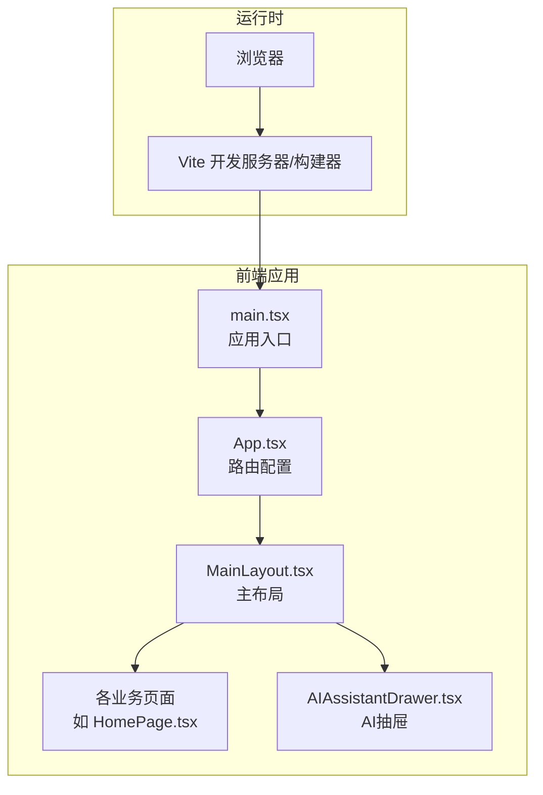
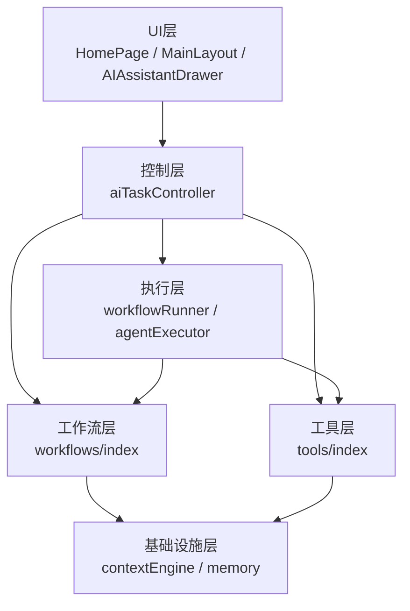
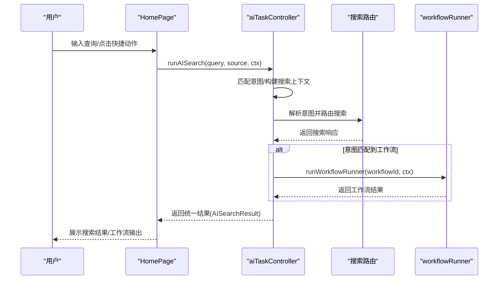
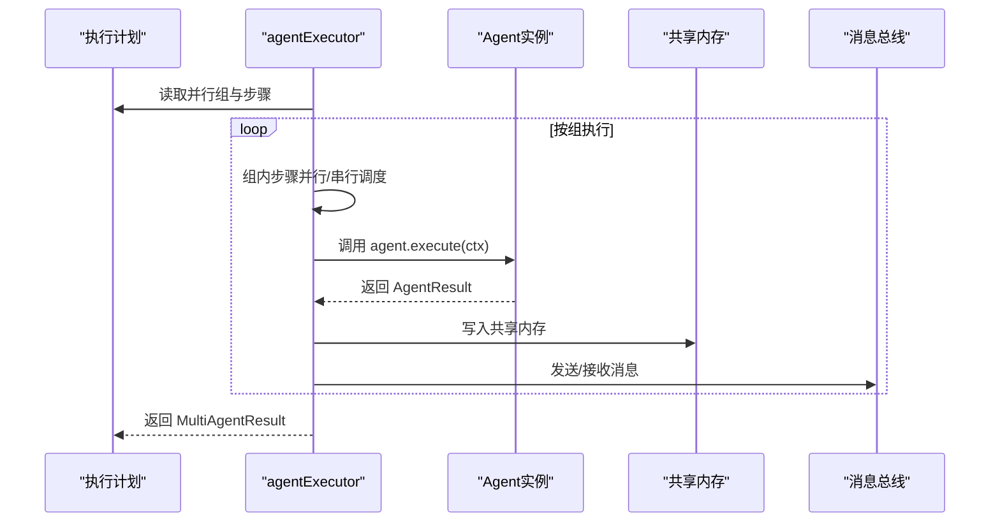
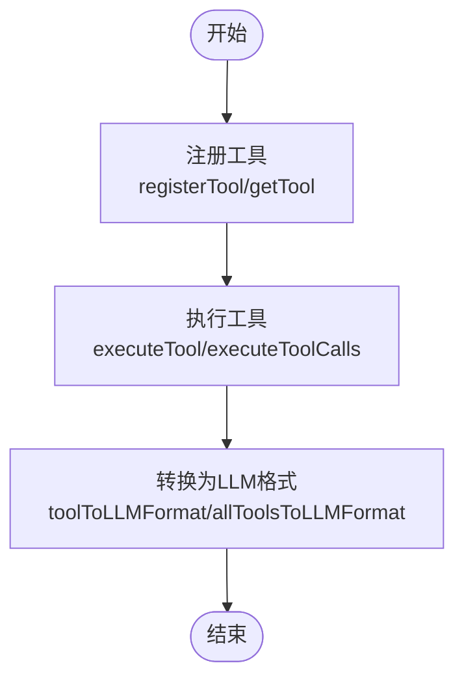
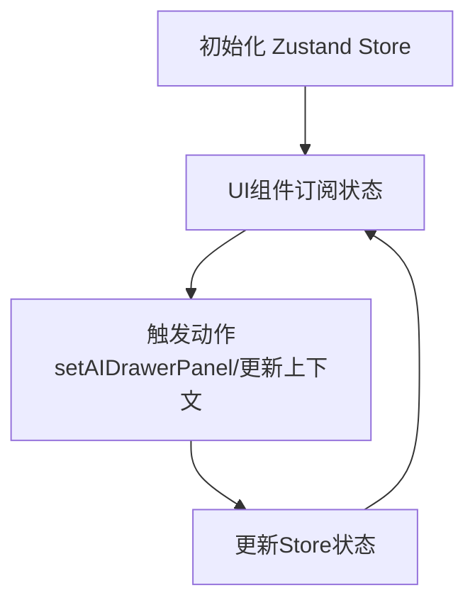
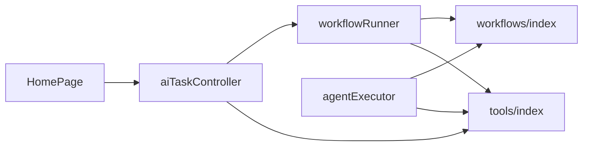
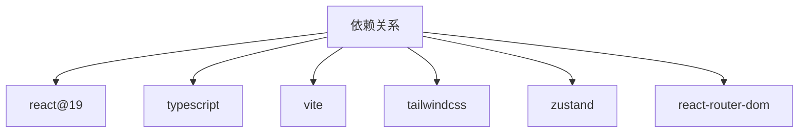

# 系统架构设计

<cite>
**本文引用的文件**
- [package.json](file://package.json)
- [vite.config.ts](file://vite.config.ts)
- [tsconfig.json](file://tsconfig.json)
- [src/main.tsx](file://src/main.tsx)
- [src/App.tsx](file://src/App.tsx)
- [src/layouts/MainLayout.tsx](file://src/layouts/MainLayout.tsx)
- [src/pages/HomePage.tsx](file://src/pages/HomePage.tsx)
- [src/ai/components/AIAssistantDrawer.tsx](file://src/ai/components/AIAssistantDrawer.tsx)
- [src/ai/controller/aiTaskController.ts](file://src/ai/controller/aiTaskController.ts)
- [src/ai/engine/workflowRunner.ts](file://src/ai/engine/workflowRunner.ts)
- [src/ai/agent/agentExecutor.ts](file://src/ai/agent/agentExecutor.ts)
- [src/ai/workflows/index.ts](file://src/ai/workflows/index.ts)
- [src/ai/tools/index.ts](file://src/ai/tools/index.ts)
</cite>

## 目录
1. [引言](#引言)
2. [项目结构](#项目结构)
3. [核心组件](#核心组件)
4. [架构总览](#架构总览)
5. [详细组件分析](#详细组件分析)
6. [依赖分析](#依赖分析)
7. [性能考量](#性能考量)
8. [故障排查指南](#故障排查指南)
9. [结论](#结论)
10. [附录](#附录)

## 引言
本设计文档面向小天AI教育平台，聚焦于系统架构模式、核心设计理念与技术选型，旨在为架构师与高级开发者提供深入洞察，同时帮助初级开发者建立清晰的架构理解框架。文档重点阐述模块化架构、分层架构与插件化设计，解释工作流驱动架构、代理协作模式、工具调用模式与状态管理模式，并给出系统边界、组件交互关系、架构图表与数据流图，以及可扩展性与未来演进方向。

## 项目结构
小天AI教育平台采用前端单页应用（SPA）架构，基于React 19与TypeScript构建，使用Vite进行开发与打包，状态管理采用Zustand，UI样式通过Tailwind CSS实现。页面路由由react-router-dom统一管理，主布局负责导航与AI抽屉容器，AI子系统围绕“意图解析-搜索-工作流执行”闭环组织。

**图表来源**
- [src/main.tsx:1-11](file://src/main.tsx#L1-L11)
- [src/App.tsx:28-64](file://src/App.tsx#L28-L64)
- [src/layouts/MainLayout.tsx:32-215](file://src/layouts/MainLayout.tsx#L32-L215)
- [src/pages/HomePage.tsx:107-465](file://src/pages/HomePage.tsx#L107-L465)
- [src/ai/components/AIAssistantDrawer.tsx:48-433](file://src/ai/components/AIAssistantDrawer.tsx#L48-L433)

**章节来源**
- [package.json:1-31](file://package.json#L1-L31)
- [vite.config.ts:1-12](file://vite.config.ts#L1-L12)
- [tsconfig.json:1-25](file://tsconfig.json#L1-L25)
- [src/main.tsx:1-11](file://src/main.tsx#L1-L11)
- [src/App.tsx:1-64](file://src/App.tsx#L1-L64)
- [src/layouts/MainLayout.tsx:1-215](file://src/layouts/MainLayout.tsx#L1-L215)

## 核心组件
- 应用入口与路由
  - 应用入口负责挂载React根节点与全局样式。
  - 路由在App组件中集中声明，MainLayout作为顶层布局包裹业务页面。
- 主布局与导航
  - MainLayout提供顶部栏、侧边栏与主内容区，并承载两个AI抽屉：轻量抽屉与AI助手抽屉。
- 页面层
  - HomePage作为主工作台，集成AI搜索输入、洞察卡片、布置练习模块与最近报告展示，并通过控制器触发AI任务与工作流执行。
- AI子系统
  - AI任务控制器统一处理意图匹配、搜索路由与工作流执行，保证不同入口的一致性。
  - 工作流执行器负责按步骤顺序执行工作流，支持回调与错误处理。
  - 代理执行器支持多Agent计划执行，按并行组顺序执行，收集共享记忆与消息。
  - 工具注册中心提供工具注册、执行与LLM格式转换，支撑工具调用模式。
  - 工作流注册中心与上下文引擎提供工作流定义、意图匹配与执行上下文构建。

**章节来源**
- [src/main.tsx:1-11](file://src/main.tsx#L1-L11)
- [src/App.tsx:1-64](file://src/App.tsx#L1-L64)
- [src/layouts/MainLayout.tsx:1-215](file://src/layouts/MainLayout.tsx#L1-L215)
- [src/pages/HomePage.tsx:1-465](file://src/pages/HomePage.tsx#L1-L465)
- [src/ai/controller/aiTaskController.ts:1-184](file://src/ai/controller/aiTaskController.ts#L1-L184)
- [src/ai/engine/workflowRunner.ts:1-288](file://src/ai/engine/workflowRunner.ts#L1-L288)
- [src/ai/agent/agentExecutor.ts:1-165](file://src/ai/agent/agentExecutor.ts#L1-L165)
- [src/ai/tools/index.ts:1-20](file://src/ai/tools/index.ts#L1-L20)
- [src/ai/workflows/index.ts:1-38](file://src/ai/workflows/index.ts#L1-L38)

## 架构总览
小天AI教育平台采用“模块化 + 分层 + 插件化”的混合架构：
- 模块化：以AI子系统为核心模块，围绕意图解析、搜索、工作流与工具形成独立模块，便于替换与扩展。
- 分层：UI层（页面与抽屉）、控制层（AI任务控制器）、执行层（工作流执行器/代理执行器）、工具层（工具注册与执行）、基础设施层（上下文引擎、存储适配）。
- 插件化：工作流、代理、工具均通过注册中心动态注册，支持按需启用与替换。

**图表来源**
- [src/pages/HomePage.tsx:107-465](file://src/pages/HomePage.tsx#L107-L465)
- [src/layouts/MainLayout.tsx:32-215](file://src/layouts/MainLayout.tsx#L32-L215)
- [src/ai/components/AIAssistantDrawer.tsx:48-433](file://src/ai/components/AIAssistantDrawer.tsx#L48-L433)
- [src/ai/controller/aiTaskController.ts:1-184](file://src/ai/controller/aiTaskController.ts#L1-L184)
- [src/ai/engine/workflowRunner.ts:1-288](file://src/ai/engine/workflowRunner.ts#L1-L288)
- [src/ai/agent/agentExecutor.ts:1-165](file://src/ai/agent/agentExecutor.ts#L1-L165)
- [src/ai/tools/index.ts:1-20](file://src/ai/tools/index.ts#L1-L20)
- [src/ai/workflows/index.ts:1-38](file://src/ai/workflows/index.ts#L1-L38)

## 详细组件分析

### 工作流驱动架构
工作流驱动架构以“意图解析-搜索-工作流执行”为主线，通过统一控制器协调搜索与工作流执行，确保不同入口行为一致。

**图表来源**
- [src/pages/HomePage.tsx:122-173](file://src/pages/HomePage.tsx#L122-L173)
- [src/ai/controller/aiTaskController.ts:78-118](file://src/ai/controller/aiTaskController.ts#L78-L118)
- [src/ai/engine/workflowRunner.ts:103-179](file://src/ai/engine/workflowRunner.ts#L103-L179)

**章节来源**
- [src/pages/HomePage.tsx:107-465](file://src/pages/HomePage.tsx#L107-L465)
- [src/ai/controller/aiTaskController.ts:1-184](file://src/ai/controller/aiTaskController.ts#L1-L184)
- [src/ai/engine/workflowRunner.ts:1-288](file://src/ai/engine/workflowRunner.ts#L1-L288)

### 代理协作模式
多Agent协作模式通过执行计划（ExecutionPlan）按并行组顺序执行，支持串行与并行组合，Agent间通过共享内存与消息总线传递状态与结果。

**图表来源**
- [src/ai/agent/agentExecutor.ts:36-106](file://src/ai/agent/agentExecutor.ts#L36-L106)
- [src/ai/agent/agentExecutor.ts:110-150](file://src/ai/agent/agentExecutor.ts#L110-L150)

**章节来源**
- [src/ai/agent/agentExecutor.ts:1-165](file://src/ai/agent/agentExecutor.ts#L1-L165)

### 工具调用模式
工具调用模式通过工具注册中心统一管理工具定义与执行，支持将工具转换为LLM可用格式，便于在工作流或代理执行中调用。

**图表来源**
- [src/ai/tools/index.ts:1-20](file://src/ai/tools/index.ts#L1-L20)

**章节来源**
- [src/ai/tools/index.ts:1-20](file://src/ai/tools/index.ts#L1-L20)

### 状态管理模式
状态管理采用Zustand，通过全局状态store管理AI抽屉面板、教师上下文、练习篮等跨组件共享状态，避免深层props传递与重复渲染。

**图表来源**
- [src/ai/components/AIAssistantDrawer.tsx:48-115](file://src/ai/components/AIAssistantDrawer.tsx#L48-L115)

**章节来源**
- [src/ai/components/AIAssistantDrawer.tsx:1-800](file://src/ai/components/AIAssistantDrawer.tsx#L1-L800)

### 数据流与交互关系
- 页面层（HomePage）负责用户交互与触发AI任务，调用AI任务控制器。
- 控制层（aiTaskController）负责意图匹配、搜索路由与工作流执行协调。
- 执行层（workflowRunner/agentExecutor）负责具体步骤执行与结果聚合。
- 工具层（tools/index）提供工具注册与执行能力。
- 基础设施层（contextEngine/memory）提供上下文与记忆能力。

**图表来源**
- [src/pages/HomePage.tsx:107-465](file://src/pages/HomePage.tsx#L107-L465)
- [src/ai/controller/aiTaskController.ts:1-184](file://src/ai/controller/aiTaskController.ts#L1-L184)
- [src/ai/engine/workflowRunner.ts:1-288](file://src/ai/engine/workflowRunner.ts#L1-L288)
- [src/ai/agent/agentExecutor.ts:1-165](file://src/ai/agent/agentExecutor.ts#L1-L165)
- [src/ai/tools/index.ts:1-20](file://src/ai/tools/index.ts#L1-L20)
- [src/ai/workflows/index.ts:1-38](file://src/ai/workflows/index.ts#L1-L38)

## 依赖分析
- 技术栈与工具链
  - React 19：组件化UI与Hooks生态。
  - TypeScript：强类型保障与IDE体验。
  - Vite：快速开发与构建。
  - Tailwind CSS：原子化样式与主题一致性。
  - Zustand：轻量状态管理。
  - react-router-dom：路由与导航。
- 模块依赖
  - 页面依赖AI任务控制器与工作流执行器。
  - AI任务控制器依赖意图匹配、搜索路由与工作流执行器。
  - 工作流执行器依赖工作流注册中心与上下文引擎。
  - 工具层依赖工具注册中心与执行器。
  - 代理执行器依赖代理注册中心与共享内存。

**图表来源**
- [package.json:11-29](file://package.json#L11-L29)

**章节来源**
- [package.json:1-31](file://package.json#L1-L31)
- [vite.config.ts:1-12](file://vite.config.ts#L1-L12)
- [tsconfig.json:1-25](file://tsconfig.json#L1-L25)

## 性能考量
- 渲染性能
  - 使用Zustand减少不必要的重渲染，仅订阅必要状态片段。
  - 通过抽屉面板栈管理与条件渲染降低DOM复杂度。
- 执行性能
  - 工作流执行器按步骤顺序执行，支持错误中断与回调统计，便于性能监控与优化。
  - 代理执行器支持并行组执行，提升多Agent协作吞吐。
- 构建与加载
  - Vite提供快速热更新与按需打包，Tailwind CSS通过原子类减少CSS体积。
- 可观测性
  - 工作流执行器记录每步耗时与最终汇总，便于定位瓶颈。

[本节为通用指导，无需特定文件引用]

## 故障排查指南
- 工作流执行失败
  - 检查工作流定义是否注册、上下文参数是否完整、步骤执行是否抛出异常。
  - 关注执行器回调中的错误信息与步骤索引。
- 意图解析与搜索路由
  - 确认意图匹配逻辑与搜索路由返回值，避免Ambiguous或无工作流ID导致的降级。
- 代理协作失败
  - 检查代理注册、执行上下文与消息总线状态，确认非可选步骤失败时的短路逻辑。
- 状态异常
  - 检查Zustand状态更新路径与订阅组件，避免竞态与重复更新。

**章节来源**
- [src/ai/engine/workflowRunner.ts:183-223](file://src/ai/engine/workflowRunner.ts#L183-L223)
- [src/ai/agent/agentExecutor.ts:110-150](file://src/ai/agent/agentExecutor.ts#L110-L150)
- [src/ai/components/AIAssistantDrawer.tsx:68-75](file://src/ai/components/AIAssistantDrawer.tsx#L68-L75)

## 结论
小天AI教育平台通过模块化、分层与插件化设计，实现了意图解析、搜索与工作流执行的统一闭环。工作流驱动架构、代理协作模式与工具调用模式共同支撑了教学场景下的智能化任务编排。结合Zustand状态管理与Tailwind CSS样式体系，系统在可维护性、可扩展性与用户体验方面取得平衡。未来可进一步引入LLM工具调用、增强代理协作的条件分支与自适应策略，并完善可观测性与A/B实验能力。

[本节为总结性内容，无需特定文件引用]

## 附录
- 技术选型说明
  - React 19：现代化组件模型与并发特性，适合复杂交互。
  - TypeScript：静态类型检查，降低回归风险。
  - Vite：快速开发与构建，支持ESM与插件生态。
  - Tailwind CSS：实用优先的样式方案，提升UI一致性与可维护性。
  - Zustand：轻量状态管理，易于测试与迁移。

**章节来源**
- [package.json:16-29](file://package.json#L16-L29)
- [vite.config.ts:1-12](file://vite.config.ts#L1-L12)
- [tsconfig.json:1-25](file://tsconfig.json#L1-L25)